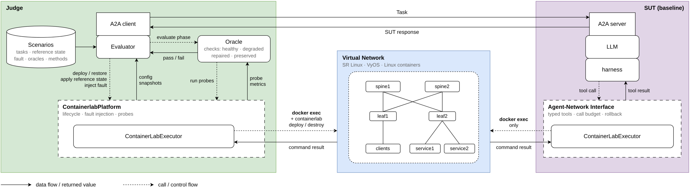
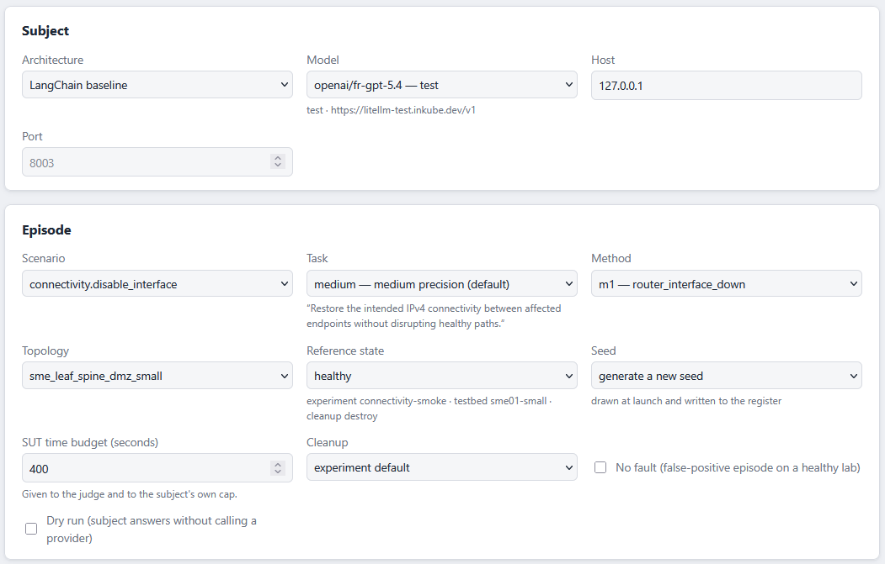

# AIBNArena

AIBNArena is a dynamic benchmarking framework for agentic Intent-Based Networking. It compiles declarative, topology-aware
scenarios into faults injected in a live emulated network (Containerlab with SR Linux, VyOS and Linux hosts), hands the task
to an AI agent through a structured Agent-Network Interface (ANI), and lets an independent judge verify with task-specific
oracles whether the network state satisfies the original intent again.

The key features of AIBNArena are

- **Declarative scenarios.** Topologies and scenarios are declared separately in YAML. A scenario names the intent, the fault to
  inject, its instantiation methods and the oracle that checks it, and it is compiled against any compatible topology.
- **Reproducible tasks.** Every instance of a fault is bound to a seed, so the same scenario, method and topology give the same task again.
- **An independent judge.** The judge deploys the virtual network, injects the fault, confirms with probes that it is in place,
  sends the task to the subject and evaluates the repaired network with the scenario's oracle. The subject never sees the oracle.
- **A neutral interface for agents.** The subject under test (SUT) is reached through the A2A protocol and acts on the network
  only through the ANI, a typed tool API with a call budget and rollback. Any agent that speaks A2A can be evaluated.
- **Two reference subjects.** `sut/langchain_agent`, a ReAct baseline, and `sut/langchain_rag_agent`, the same agent with
  retrieval-augmented generation over a troubleshooting guide and the vendor documentation.
- **Reports and evaluation parameters.** Every run keeps the interactions between the agent and the network, the model's
  reasoning, the tokens and the time. A campaign ends with a comparison of the subjects on pass rate, tool call success rate,
  repeat action rate, submission rates and root cause identified.

## Framework overview



## Scenarios

| Category | Scenarios (instantiation methods) |
|---|---|
| Connectivity and routing | interface disabled (3), routing disabled (4), traffic dropped to or from a subnet (4), IP address removed (5), wrong routing table (5), DHCP provisioning (4) |
| Filtering | zone policy enforcement (3) |
| QoS | link impairment (2), WAN shaping policy repair (4), assured bandwidth (1) |

Ten scenarios and 35 instantiation methods, on topologies of two to four switches or routers, a firewall, two services and
three users.

## Web interface



The **Episode** page runs one task. The **Campaign** page runs a matrix of subjects, models, scenarios and seeds and ends with
the comparison page of the evaluation parameters. The **Models** page registers the endpoints the models are served from.

## Results

Both subjects on the 35 scenarios, same seeds, one run per cell, 400 s budget per task. The root cause is judged with ParaPLUIE
on the agent's final diagnosis. The records are under `reports/campaigns/`.

| | gpt-5.4 baseline | gpt-5.4 RAG | Qwen3.8-27B baseline | Qwen3.8-27B RAG |
|---|---|---|---|---|
| Pass rate (repair oracle) | 21/35 | 24/35 | 21/35 | 25/35 |
| Root cause identified (ParaPLUIE) | 27/35 | 23/35 | 16/35 | 21/35 |
| Scenarios ended by the 400 s budget | 0/35 | 1/35 | 14/35 | 13/35 |
| Median time per scenario | 130 s | 138 s | 320 s | 293 s |

## Architecture
```text
benchmarks/core/                    shared lifecycle, A2A, metrics, tracing, results
benchmarks/domains/                 connectivity, dhcp_dns, filtering, qos, security probes and metrics
benchmarks/platforms/containerlab/  environment, safety, execution, observation, ANI
benchmarks/testbeds/containerlab/   physical labs and reference states
benchmarks/configs/                 benchmark-owned experiments and testbeds
reports/manual/                     ignored runs launched by hand, one report each, results under results/
reports/campaigns/                  campaign records per model, subject and intent, raw runs under runs/
experiments/                        repeatable experimental matrices
scenarios/                          scenarios, oracles, schemas, topologies, compiler
sut/                                the active SUTs and the shared transport plumbing
webui/                              the web interface, local pages for one episode or a campaign of them
```
Every run follows one seventeen-phase lifecycle, from configuration loading through testbed cleanup and result writing.
## Install
```bash
python -m venv .venv
.venv/bin/python -m pip install -r requirements.txt
```
Docker and Containerlab are required only for real integration runs.
## Validate without infrastructure
```bash
.venv/bin/python benchmarks/run.py --validate-only -c benchmarks/configs/experiments/connectivity-smoke.toml
.venv/bin/python benchmarks/run.py --validate-only -c benchmarks/configs/experiments/qos-smoke.toml
```
SUT identity and runtime parameters are discovered from its Agent Card and execution report. They are not benchmark configuration.
## Run
```bash
./sut/langchain_agent/a2a_server.py --scenario-topology scenarios/topologies/sme_leaf_spine_dmz_small.yaml --healthy-state benchmarks/testbeds/containerlab/sme01-small/states/healthy.json
.venv/bin/python benchmarks/run.py -c benchmarks/configs/experiments/connectivity-smoke.toml --sut-url http://127.0.0.1:8003
```
Each run writes its result under `reports/manual/results/` and the report derived from it in `reports/manual/`.
`result_dir` and `report_dir` in the experiment TOML, or `--result-dir` and `--report-dir`, send them elsewhere.
The RAG subject starts the same way from `./sut/langchain_rag_agent/a2a_server.py` and listens on port 8004, see [its README](sut/langchain_rag_agent/README.md).
The complete LangChain baseline matrix (two models, three scenarios, three seeds) is `experiments/run_langchain_baseline.sh`.
## Run from the web interface
```bash
.venv/bin/python -m pip install -r requirements-webui.txt
.venv/bin/python -m webui.main
```
`webui/` serves the web interface on http://127.0.0.1:8080, a local front end for the two commands above. The **Episode** page runs one episode. It starts the subject, proves the process and model answering are the ones it started, runs the judge against it, and stops the subject whatever the outcome. The **Campaign** page runs a matrix of subjects × models × scenarios × seeds, starting each subject once per model and topology, then writes the campaign's comparison page and lays its records out under `reports/campaigns/`. The **Models** page registers the endpoints the models are served from. Same results and reports, same directories. See `webui/README.md`.
## Tests
```bash
.venv/bin/python -m pytest -q
```
Validation-only and golden tests do not claim Containerlab integration. A real integration pass needs Docker, images, credentials and a model endpoint.

## Citation

This code is not yet associated with a published paper. If you find it useful for research or teaching, please cite the
GitHub repository directly.

```
@misc{AIBNArena2026,
  author = {{SAMOVAR, T\'el\'ecom SudParis}},
  title = {{AIBNArena}: A Dynamic Benchmarking Framework for Agentic Intent-Based Networking},
  year = {2026},
  howpublished = {\url{https://github.com/NetSecAI/AIBNArena}}
}
```

## References

For the list of contributors, please check the file CONTRIBUTORS.

## License

BSD 3-Clause, see [LICENSE](LICENSE).
