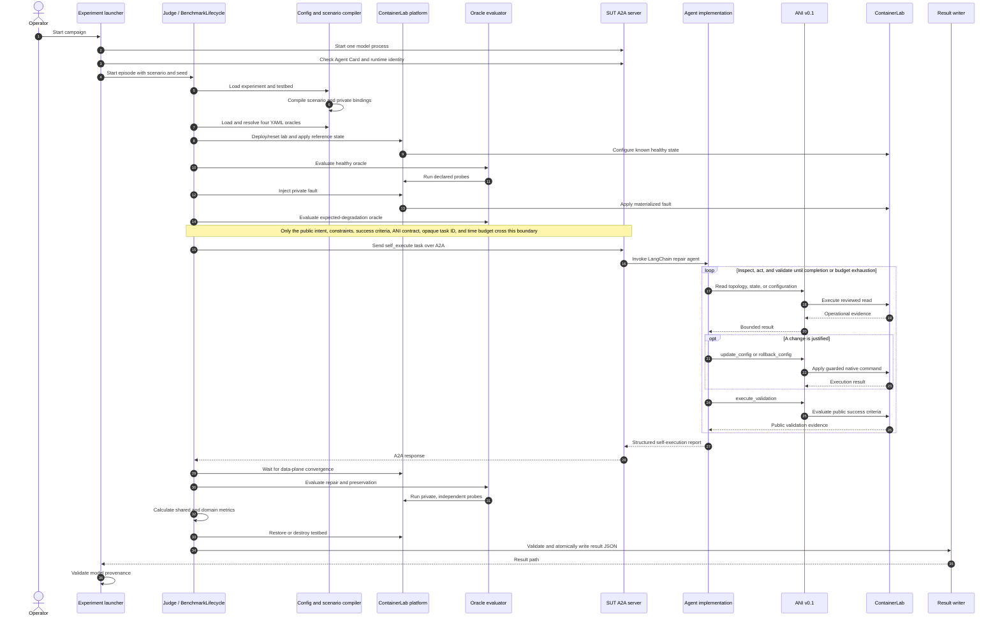

# Experimental Pipeline Tutorial

A benchmark episode combines an experiment suite, a testbed, a compiled scenario, four versioned oracles, and a running System Under Test (SUT). Every domain—Connectivity, QoS, or Security—uses the same lifecycle and result schema.

```text
experiment TOML + testbed TOML + scenario YAML + oracle YAML
                              |
                              v
                    shared benchmark lifecycle
                              |
                     public A2A task to SUT
                              |
                    SUT actions through ANI
                              |
                 independent oracle evaluation
                              |
                    versioned result JSON
```

## End-to-End Sequence



The SUT-side `execute_validation` call and the Judge's oracle evaluation are intentionally different. The former helps the agent decide whether it is done using public criteria; the latter produces the authoritative benchmark verdict using private oracle definitions.

## The Four Inputs

| Input | Responsibility | Main implementation |
|---|---|---|
| Experiment TOML | Select scenario, topology, testbed, seed, budget, cleanup, and result directory | [`benchmarks/configs/loader.py`](../benchmarks/configs/loader.py) |
| Testbed TOML | Declare platform, topology descriptor, reference state, and convergence settings | [`benchmarks/configs/testbeds/`](../benchmarks/configs/testbeds/) |
| Scenario YAML | Declare intent, applicability, semantic fault method, and oracle references | [`scenarios/`](../scenarios/) and [`ScenarioCompiler`](../scenarios/compiler/compiler.py) |
| Oracle YAML | Declare healthy, expected-degradation, repair, and preservation probes and thresholds | [`scenarios/oracles/`](../scenarios/oracles/) and [`oracle_loader.py`](../scenarios/oracle_loader.py) |

The SUT configuration is not embedded in the experiment TOML. A SUT is started independently, advertises its identity through A2A/runtime metadata, and is selected for a run with `--sut-url`.

## The Fourteen Lifecycle Phases

The ordered phase list is defined by [`BenchmarkLifecycle.PHASES`](../benchmarks/core/lifecycle.py). Durations for all phases are stored in every result.

| Phase | What happens |
|---|---|
| `load_configuration` | Compose the experiment and testbed configuration. |
| `load_validate_scenario` | Compile and select the deterministic scenario instance for the requested seed. |
| `load_oracles` | Load, version-check, resolve bindings, and schema-validate the four oracle documents. |
| `deploy_reset_testbed` | Create or reset the ContainerLab environment. |
| `apply_reference_state` | Apply the known-good state and wait for initial convergence. |
| `evaluate_healthy` | Require the healthy oracle to pass before fault injection. |
| `record_baseline` | Retain healthy probe values for relative thresholds and later comparison. |
| `inject_fault` | Materialize and apply the benchmark-private fault. |
| `evaluate_degradation` | Require the expected degradation to be observable; otherwise the episode is invalid. |
| `invoke_sut` | Build the public request, call the SUT through the official A2A SDK, and parse its report. |
| `evaluate_repair_preservation` | Wait for convergence, then independently evaluate repair and, when applicable, preservation. |
| `calculate_metrics` | Combine oracle outcomes, convergence, and SUT completion/verification into the final metrics. |
| `restore_destroy` | Restore the reference state or destroy the lab, including on failures. |
| `write_result` | Validate the result schema and atomically persist one JSON file. |

A failed setup invariant still produces a result whenever possible. The top-level `error.phase` identifies where the lifecycle stopped.

## Public and Private Boundaries

| Visible to the SUT | Kept private by the Judge |
|---|---|
| Opaque per-episode task ID | Source scenario ID used for fault materialization |
| Natural-language intent and safety constraints | Selected fault target and injected commands |
| Public success criteria | Restore commands and reference-state internals |
| ANI version, operations, and argument schemas | Oracle YAML, thresholds, and resolved bindings |
| Wall-clock execution budget | Independent repair and preservation probes |
| Evidence explicitly requested through ANI | Scenario compiler's private fields |

The allowlisted request is built in [`benchmarks/core/a2a_contracts.py`](../benchmarks/core/a2a_contracts.py) and [`scenarios/access.py`](../scenarios/access.py). Recursive anti-leakage checks reject evaluator-private keys before an A2A request is sent.

## Code Walkthrough

1. [`benchmarks/run.py`](../benchmarks/run.py) parses CLI overrides, validates the bundle, creates dependencies, and starts the lifecycle.
2. [`benchmarks/configs/loader.py`](../benchmarks/configs/loader.py) composes configuration and materializes the selected scenario.
3. [`scenarios/compiler/compiler.py`](../scenarios/compiler/compiler.py) binds semantic scenario selectors to a concrete topology and deterministic seed.
4. [`scenarios/oracle_loader.py`](../scenarios/oracle_loader.py) resolves exact `${bindings.name}` placeholders and validates oracle documents.
5. [`benchmarks/platforms/containerlab/platform.py`](../benchmarks/platforms/containerlab/platform.py) owns deployment, fault injection, convergence, probes, and cleanup.
6. [`benchmarks/core/oracle_evaluator.py`](../benchmarks/core/oracle_evaluator.py) evaluates the same declarative oracle format for every domain.
7. [`benchmarks/core/sut_client.py`](../benchmarks/core/sut_client.py) and [`benchmarks/core/a2a.py`](../benchmarks/core/a2a.py) exchange the public task and SUT report.
8. [`benchmarks/core/metrics.py`](../benchmarks/core/metrics.py), [`provenance.py`](../benchmarks/core/provenance.py), and [`reporting.py`](../benchmarks/core/reporting.py) calculate metrics, capture reproducibility metadata, validate the schema, and write the result.
9. [`experiments/run_langchain_baseline.sh`](../experiments/run_langchain_baseline.sh) orchestrates the current multi-model, multi-scenario, multi-seed baseline campaign and rejects stale processes or contradictory provenance.

The LangChain-specific side is described in [LangChain Baseline](langchain_baseline.md). Result interpretation is described in [Reading Experiment Outputs](experiment_outputs.md).

## Validate Before Provisioning

Validate composition, schema references, and oracle bindings without touching ContainerLab or A2A:

```bash
Correctness  [######............]   33.3%
Safety       [##################]  100.0%
Action exec  [##################]  100.0%
Latency avg  121.329s
Latency p50  139.31s
Latency max  157.413s
Actions avg   2.333
Unsafe acts       0
```

Generate an HTML report:

```bash
./scripts/generate_report.py benchmarks/domains/connectivity/results/<run>.json
```

Open the Marimo explorer:

```bash
marimo run demos/marimo/ibn_eval_demo.py
```

## 12. Reproduction Tutorial

### Step 1: Prepare Python Dependencies

```bash
python3 -m venv .venv
source .venv/bin/activate
python -m pip install --upgrade pip
python -m pip install -r requirements.txt
python -m pip install -r requirements-agent-poc.txt
python -m pip install -r requirements-demo.txt
```

### Step 2: Deploy ContainerLab

```bash
./benchmarks/testbeds/containerlab/scripts/deploy.sh
```

Check lab status:

```bash
./benchmarks/testbeds/containerlab/scripts/status.sh
```

### Step 3: Apply Healthy State

```bash
./scripts/apply_healthy_state.py --verify
```

Expected result:

```text
verify=True
[OK] connectivity client1 -> client2
[OK] connectivity client2 -> client1
```

### Step 4: Validate Scenario Preparation

```bash
./benchmarks/run.py --benchmark connectivity --mode prepare
```

This confirms that each controlled fault can be injected and that connectivity breaks.

### Step 5: Validate Deterministic Baseline

```bash
./benchmarks/run.py --benchmark connectivity --mode dummy-repair
```

This should repair all current MVP faults. It validates the environment, fault catalog, fresh-lab isolation, action execution, verification, and metrics without involving an LLM.

### Step 6: Run The Current Agentic SUT

Terminal 1:

```bash
export OPENAI_API_KEY="your-key"
./sut/langchain_agent/a2a_server.py \
  --host 0.0.0.0 \
  --port 8003 \
  --model openai/gpt-4o-mini \
  --max-execution-seconds 400 \
  --scenario-topology scenarios/topologies/sme_leaf_spine_dmz_small.yaml \
  --healthy-state benchmarks/testbeds/containerlab/sme01-small/states/healthy.json
```

Terminal 2:

```bash
./benchmarks/run.py \
  --benchmark connectivity \
  --mode a2a-repair \
  --config benchmarks/domains/connectivity/config.autonomous.template.toml
```

### Step 7: Read The Agent Trace

The SUT terminal prints a compact trace:

```text
Autonomous repair result
========================
mode: self_execute
status: FAILED
verified: False
steps: 3

Step 1
--------
action: client1 :: ip link set eth1 up
exec: ok=True, safe=True, target=client1
verified_after_action: False
connectivity:
  [FAILED] client1 -> client2 (192.168.20.10), loss=100.0%
```

Read it like this:

- `action`: what the SUT believed would fix the problem.
- `exec.ok`: whether the command was accepted by the target node.
- `safe`: whether the safety gate allowed it.
- `verified_after_action`: whether connectivity came back.
- `connectivity`: independent network symptom after the action.

A command can be safe and executable but still wrong.

## 13. Plugging A Future IBN SUT

Imagine another paper produces an IBN agent. That agent does not need to use our internal Python classes. To be evaluated here, it only needs to satisfy the A2A-facing contract.

### Minimal Integration Contract

The external SUT should:

1. Expose an A2A server with an agent card.
2. Accept a text payload containing the benchmark task JSON.
3. Optionally inspect the network through its own tools, MCP tools, NETCONF or gNMI.
4. Use ANI v0.1 (locally or through MCP), perform self-execution, and return a report.
5. Leave final scoring to the Judge.

The agent can be evaluated without exposing its internal state, prompts, or reasoning to the Judge. This is exactly why A2A is useful here: the benchmark tests externally observable behavior.

### What Code Can Be Reused

A future SUT team can copy or adapt:

- A2A server wrapper: [`sut/langchain_agent/a2a_server.py`](../sut/langchain_agent/a2a_server.py)
- Response formatting and self-execute report shape: [`sut/langchain_agent/a2a_server.py`](../sut/langchain_agent/a2a_server.py)
- ANI v0.1 implementation: [`benchmarks/platforms/containerlab/ani.py`](../benchmarks/platforms/containerlab/ani.py)
- Safe execution path: [`benchmarks/platforms/containerlab/env.py`](../benchmarks/platforms/containerlab/env.py), [`benchmarks/platforms/containerlab/safety.py`](../benchmarks/platforms/containerlab/safety.py)
- Result interpretation and metrics: [`benchmarks/domains/connectivity/evaluator.py`](../benchmarks/domains/connectivity/evaluator.py)

What they do not need to reuse:

- LangGraph.
- LiteLLM.
- Our prompt.
- Our local action-builder tools.

Those are implementation details of the current PoC SUT.

## 14. Current Limitations

The current MVP intentionally focuses on evaluation plumbing, not SUT intelligence.

Known limitations:

- The autonomous SUT may repeat bad actions.
- The current faults are manually declared, not dynamically generated at NetArena scale.
- The tool surface is local Python, not yet MCP.
- The benchmark currently focuses on routing/connectivity only.
- QoS and security benchmarks are placeholders.
- Safety is a command safety gate, not a full formal policy verifier.

These limitations are useful: they keep the first complete version understandable and reproducible.

## 15. Extension Roadmap

Near term:

- Add richer agent traces to results JSON.
- Add scenario-level visual timelines.
- Add dynamic query/fault generation inspired by NetArena.
- Convert local tools to MCP tools.

Medium term:

- Add `qos` for bandwidth, rate limiting, latency, and loss tasks.
- Add `security` for ACL/firewalling tasks.
- Add confidence intervals when runs are repeated many times.

Long term:

- Compare multiple SUTs across the same generated benchmark suite.
- Add larger topologies.
- Add adversarial/rare fault generation.
- Use benchmark rewards for training or reinforcement learning loops.
=======
.venv/bin/python benchmarks/run.py \
  --validate-only \
  --config benchmarks/configs/experiments/connectivity-smoke.toml
```

A live integration result additionally requires prepared Docker, ContainerLab and the selected model endpoint.
