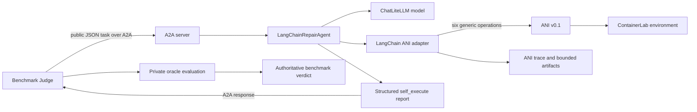

# LangChain Baseline

## Purpose

The LangChain baseline is the repository's minimal autonomous System Under Test (SUT):

```text
baseline = LLM + generic agent harness + ANI tools
```

It provides a controlled reference point: a subject that adds capabilities to this harness is measured against it. It deliberately contains no hidden topology access, scenario-specific repair logic, or benchmark oracle logic.

The benchmark is framework-independent. LangChain is an internal implementation choice of this SUT, not part of the Judge-to-SUT contract.

## Architecture



The agent and Judge operate on the same lab but through different interfaces. The agent can only inspect or modify the network through ANI. The Judge controls setup, private fault injection, independent oracle probes, scoring, and cleanup.

## Main Components

| Component | Role | Code |
|---|---|---|
| A2A entry point | Parses server/model options, builds the Agent Card, wires ANI, and starts Uvicorn | [`sut/langchain_agent/a2a_server.py`](../sut/langchain_agent/a2a_server.py) |
| Shared A2A application | Serializes SUT episodes, exposes the Agent Card and runtime identity, and renders server logs | [`sut/common/a2a_app.py`](../sut/common/a2a_app.py) |
| Agent | Creates the LangChain agent, enforces the budget, derives telemetry, and builds the SUT report | [`sut/langchain_agent/agent.py`](../sut/langchain_agent/agent.py) |
| Model adapter | Uses `ChatLiteLLM` so the baseline can target OpenAI-compatible model endpoints | [`LangChainRepairAgent._model`](../sut/langchain_agent/agent.py) |
| Tool adapter | Exposes strict LangChain tools over the framework-independent ANI contract | [`sut/langchain_agent/ani_tools.py`](../sut/langchain_agent/ani_tools.py) |
| ANI backend | Executes reviewed reads, validations, guarded mutations, and rollbacks against ContainerLab | [`benchmarks/platforms/containerlab/ani.py`](../benchmarks/platforms/containerlab/ani.py) |
| Shared configuration | Defines model, endpoint, token, execution, and runtime defaults | [`sut/common/agent_config.py`](../sut/common/agent_config.py) |

## One Agent Episode

1. The A2A server receives a JSON `self_execute` task and calls `LangChainRepairAgent.invoke`.
2. The agent removes any non-public fields before presenting the task to the model.
3. `create_agent` builds a standard LangChain model/tool loop with the repository system prompt and six ANI tools.
4. The model may discover topology, inspect state/configuration, apply a small change, validate, and revise.
5. `ToolStrategy(StructuredConclusion)` constrains the model's terminal response to `status` and a concise `summary`.
6. The harness derives actions, tool counts, validation evidence, elapsed time, token usage, and provider model from execution—not from free-form model claims.
7. The SUT returns a structured report over A2A. The Judge then evaluates the lab independently.

The core loop is intentionally simple. There is no custom planning graph, hand-coded troubleshooting policy, or scenario router.

## ANI Tools

The adapter exposes exactly the operations defined by ANI v0.1:

| Tool | Baseline use |
|---|---|
| `get_topology` | Discover reviewed nodes, roles, links, capabilities, and interface names. |
| `get_state` | Inspect interfaces, routes, Linux/SR Linux `qdisc`, or system state. |
| `get_running_config` | Read scoped native configuration or structured SR Linux data. |
| `get_object` | Read one named object on one node (interface, route, ARP or MAC entry, QoS policy, firewall ruleset, zone, DHCP pool): the small read to use once the agent knows what to look at. |
| `update_config` | Submit native commands through ANI safety checks and transaction handling. |
| `update_object` | Change one named object by attributes; the ANI compiles the native commands and applies them with the same safety checks and rollback. |
| `execute_validation` | Test a specific ICMP path or the complete public success criteria. |
| `rollback_config` | Apply recorded compensation for an earlier transaction. |

Tool schemas use strict Pydantic models with unknown fields forbidden. The underlying ANI contract is documented in [ANI v0.1](ani_v0_1.md).

## Context and Artifact Handling

ANI responses can be larger than a model context window. [`LangChainANIAdapter`](../sut/langchain_agent/ani_tools.py) therefore:

- supports node scoping, case-insensitive filtering, offsets, and bounded page sizes;
- reports whether a response was truncated;
- includes byte counts, page metadata, and a SHA-256 digest;
- stores the complete response as a content-addressed JSON artifact when truncation occurs;
- records the artifact reference in the ANI operation trace.

The model receives the bounded envelope. The full artifact is retained for audit and analysis, not silently injected into the model context.

## Completion, Validation, and Stop Conditions

A model cannot obtain a successful SUT report merely by saying it is finished:

- `verified: true` requires a passing ANI `execute_validation` result for the public success criteria;
- `status: completed` requires both a model conclusion of `completed` and that passing validation;
- a completion claim without passing validation becomes `status: failed`;
- the Judge's repair and preservation oracles remain authoritative and can still reject a SUT-verified repair.

The public wall-clock budget is the primary runtime limit. It bounds agent creation, provider calls, and the whole asynchronous graph invocation. The high LangChain recursion limit is a secondary runaway-loop guard, not the experiment budget. Three identical failed ANI requests trigger an earlier deterministic loop guard.

## Safety Model

The system prompt asks for narrow inspection, the smallest safe change, and explicit validation. Actual enforcement comes from ANI:

- only reviewed nodes and supported operations are addressable;
- mutations pass through command and target safety checks;
- each accepted change produces traceable execution evidence;
- optional rollback commands are stored under a transaction ID;
- failed and unsafe operations are counted;
- the Judge restores or destroys the lab after the episode.

`unsafe_operations = 0` means no request triggered ANI's unsafe-operation accounting. It does not prove that every allowed decision was semantically correct. Final-state preservation and future action-level safety metrics cover different risks.

## Configuration

Configuration precedence is CLI arguments, agent-specific environment variables, then shared environment fallbacks.

| Concern | CLI example | Environment |
|---|---|---|
| Model | `--model openai/gpt-5.4` | `LANGCHAIN_AGENT_MODEL` |
| Endpoint | `--api-base ...` | `LANGCHAIN_AGENT_API_BASE`, then `LLM_API_BASE` |
| API key | `--api-key ...` | `LANGCHAIN_AGENT_API_KEY`, then `LLM_API_KEY` |
| Output cap | `--max-tokens 800` | `LANGCHAIN_AGENT_MAX_TOKENS` |
| Execution cap | `--max-execution-seconds 400` | `LANGCHAIN_AGENT_MAX_EXECUTION_SECONDS` |
| Tool context cap | `--max-context-chars 12000` | `LANGCHAIN_AGENT_MAX_CONTEXT_CHARS` |
| Recursion guard | `--recursion-limit 1000` | `LANGCHAIN_AGENT_RECURSION_LIMIT` |

The experiment TOML does not select or configure the SUT. The launcher starts the SUT independently, and the benchmark receives only its URL.

## Running It

For the complete maintained baseline matrix, use:

```bash
./experiments/run_langchain_baseline.sh
```

The launcher runs two models, three scenarios, and three deterministic seeds. Before each model it releases the configured port, starts a fresh process, and validates the PID, Agent Card, runtime identity, configured model, and result provenance.

For a single episode, start the server in one terminal and invoke [`benchmarks/run.py`](../benchmarks/run.py) from another. See [SUT Contracts](sut_contracts.md) for the A2A request/response format and [Reading Experiment Outputs](experiment_outputs.md) for result interpretation.

## What the Baseline Does Not Establish

A baseline failure does not automatically mean the benchmark is broken, and a SUT-side success does not automatically mean the private oracle passed. Diagnose those layers separately.

With a small seed count, results are engineering observations rather than final statistical claims. The current analysis workflow is in [`analysis/notebooks/baseline_first_results.ipynb`](../analysis/notebooks/baseline_first_results.ipynb).
