logo: Nokia

# Nokia Service Router Linux
## 7215 Interconnect System
## 7220 Interconnect Router
## 7250 Interconnect Router
## 7730 Service Interconnect Router
Release 26.7

# Advanced Configuration Guide

3HE 22247 AAAB TQZZA
Edition: 01
July 2026

**© 2026 Nokia.**
Use subject to Terms available at: www.nokia.com/terms.

Nokia is committed to diversity and inclusion. We are continuously reviewing our customer documentation and consulting with standards bodies to ensure that terminology is inclusive and aligned with the industry. Our future customer documentation will be updated accordingly.

This document includes Nokia proprietary and confidential information, which may not be distributed or disclosed to any third parties without the prior written consent of Nokia.

This document is intended for use by Nokia’s customers (“You”/”Your”) in connection with a product purchased or licensed from any company within Nokia Group of Companies. Use this document as agreed. You agree to notify Nokia of any errors you may find in this document; however, should you elect to use this document for any purpose(s) for which it is not intended, You understand and warrant that any determinations You may make or actions You may take will be based upon Your independent judgment and analysis of the content of this document.

Nokia reserves the right to make changes to this document without notice. At all times, the controlling version is the one available on Nokia’s site.

No part of this document may be modified.

NO WARRANTY OF ANY KIND, EITHER EXPRESS OR IMPLIED, INCLUDING BUT NOT LIMITED TO ANY WARRANTY OF AVAILABILITY, ACCURACY, RELIABILITY, TITLE, NON-INFRINGEMENT, MERCHANTABILITY OR FITNESS FOR A PARTICULAR PURPOSE, IS MADE IN RELATION TO THE CONTENT OF THIS DOCUMENT. IN NO EVENT WILL NOKIA BE LIABLE FOR ANY DAMAGES, INCLUDING BUT NOT LIMITED TO SPECIAL, DIRECT, INDIRECT, INCIDENTAL OR CONSEQUENTIAL OR ANY LOSSES, SUCH AS BUT NOT LIMITED TO LOSS OF PROFIT, REVENUE, BUSINESS INTERRUPTION, BUSINESS OPPORTUNITY OR DATA THAT MAY ARISE FROM THE USE OF THIS DOCUMENT OR THE INFORMATION IN IT, EVEN IN THE CASE OF ERRORS IN OR OMISSIONS FROM THIS DOCUMENT OR ITS CONTENT.

Copyright and trademark: Nokia is a registered trademark of Nokia Corporation. Other product names mentioned in this document may be trademarks of their respective owners.

The registered trademark Linux® is used pursuant to a sublicense from the Linux Foundation, the exclusive licensee of Linus Torvalds, owner of the mark on a worldwide basis.

© 2026 Nokia.

Advanced Configuration Guide Release 26.7

Advanced Configuration Guide Release 26.7
Table of contents

6 **BGP Add-Paths** 84
6.1 Applicability 84
6.2 Overview 84
6.2.1 Faster convergence after failure 84
6.2.2 Enhanced load-sharing 88
6.2.3 Reduced routing churn 89
6.2.4 Add-paths implementation 89
6.3 Configuration 91
6.3.1 Initial configuration 92
6.3.2 Reconvergence without add-paths 96
6.3.3 Add-paths enabled: no BGP FRR, no ECMP 98
6.3.4 Reconverge with add-paths: no BGP FRR, no ECMP 102
6.3.5 Add-path and BGP FRR 103
6.3.6 Add-paths and ECMP 105
6.3.7 Add-path for family VPN-IPv4 with BGP FRR 106
6.3.8 Add-paths for family VPN-IPv4 with ECMP 114
6.4 Conclusion 116

7 **BGP Add-paths Policy Control** 117
7.1 Applicability 117
7.2 Overview 117
7.3 Configuration 119
7.3.1 Example topology 119
7.3.1.1 Initial configuration 120
7.3.1.2 BGP add-paths for address family IPv4 without policy control 124
7.3.1.3 BGP add-paths for address family IPv4 with policy control 127
7.3.1.4 BGP add-paths for address family VPN-IPv4 with policy control 128
7.4 Conclusion 136

8 **BGP Fast Reroute** 137
8.1 Applicability 137
8.2 Overview 137
8.3 Configuration 139
8.3.1 BGP add-paths 140
8.3.2 Backup paths 143


SPACER TEXT

3HE 22247 AAAB TQZZA      **© 2026 Nokia.**      4
Use subject to Terms available at: [www.nokia.com/terms](http://www.nokia.com/terms).

Advanced Configuration Guide Release 26.7
Table of contents

8.3.3 Faster convergence through BFD 147
8.3.4 Faster convergence through MRAI 148
8.3.5 Switchover 149
8.4 Conclusion 150

**9 BGP Replace Peer Autonomous System 151**
9.1 Applicability 151
9.2 Overview 151
9.3 Configuration 153
9.3.1 Default: peer AS is not replaced in the default network instance 155
9.3.2 Replace BGP peer AS in default network instance on PE-2 and PE-4 159
9.3.3 Default: no peer AS is replaced in IP-VRF 161
9.3.4 Replace BGP peer AS in IP-VRF on PE-2 and PE-4 165
9.4 Conclusion 167

**10 BGP Segment Routing Using the Prefix SID Attribute 168**
10.1 Applicability 168
10.2 Overview 168
10.3 Configuration 170
10.3.1 Configure eBGP 171
10.3.2 Configure BGP segment routing using prefix SID 172
10.3.3 Configure an IP VRF 188
10.4 Conclusion 193

**11 BGP Signaled Segment Routing Policy 194**
11.1 Applicability 194
11.2 Overview 194
11.2.1 SR TE policy overview 194
11.2.2 SR TE policy NLRI 195
11.2.2.1 Binding SID 196
11.2.2.2 Segment list 197
11.2.2.3 Preference 197
11.2.2.4 SR TE policy candidate path 197
11.2.3 Example topology 197
11.3 Configuration 198
11.3.1 Segment Routing Local Block 198


SPACER TEXT

3HE 22247 AAAB TQZZA 5
**© 2026 Nokia.**
Use subject to Terms available at: [www.nokia.com/terms](http://www.nokia.com/terms).

Advanced Configuration Guide Release 26.7
Table of contents

11.3.2 Static SR TE policy 199
11.3.3 Traffic steering using SR TE policies 203
11.3.3.1 Per-destination traffic steering 204
11.3.4 Advertising SR TE policies into BGP 206
11.3.5 BSID anchor 211
11.3.6 Weighted Equal Cost Multipath 218
11.4 Conclusion 221

**12 BGP for underlay routing 222**
12.1 BGP underlay routing example 222
12.1.1 Advantages of BGP for underlay routing 223
12.2 BGP configuration for underlay routing 223
12.2.1 Example: Configure Router 3 for static EBGP session 223
12.2.2 Example: Configure Router 5 for static EBGP session 226
12.3 Advanced configuration: BGP timers 229
12.3.1 Modifying timer-related defaults 229
12.4 Advanced configuration: BGP convergence optimization 230
12.4.1 Configuring wait-for-fib-install 231
12.4.2 Convergence process optimization after restarts 231
12.4.2.1 Configuring min-wait-to-advertise to delay BGP route advertisement 232
12.4.2.2 Configuring max-wait-to-advertise 232
12.4.2.3 BGP min-/max-wait-to-advertise timers behavior 232
12.4.2.4 Displaying convergence snapshot 233
12.5 Advanced configuration: IPv4 route advertisement with IPv6 next-hops 234
12.5.1 Advertising a BGP route for IPv4 NLRI with an IPv6 BGP next-hop address 235
12.5.2 Receiving a BGP route for IPv4 NLRI with an IPv6 BGP next-hop address 235
12.5.3 Accepting IPv4 packets on an IPv6-only interface 235

**13 Configuring IP-VPN services 237**

**14 EVPN-VXLAN for layer-2 and multi-homing 240**
14.1 Overview 240
14.2 Configuration of EVPN-VXLAN broadcast domains 241
14.2.1 Configuring the underlay network 242
14.2.2 Configuring LEAF-3 with an EVPN-VXLAN enabled MAC-VRF 245
14.2.3 Checking the EVPN-VXLAN operation in MAC-VRFs 248

3HE 22247 AAAB TQZZA
**© 2026 Nokia.**
Use subject to Terms available at: [www.nokia.com/terms](http://www.nokia.com/terms).
6

Advanced Configuration Guide Release 26.7

Advanced Configuration Guide Release 26.7
Table of contents

15.2.4 Configuring EVPN IFL interoperability to EVPN IFF unnumbered model 292
15.2.5 Checking the EVPN IFL model in IP-VRFs 293
15.2.5.1 Checking IP-VRF-10 state and connectivity 293
15.2.5.2 Checking for VXLAN tunnel creation 294
15.2.5.3 Checking for remote VTEPS and associated destinations 295
15.2.5.4 Checking IP-VRF-10 route table 296
15.2.5.5 Checking route-table state for a RT5 297
15.2.5.6 Monitoring pings 298
15.2.6 Checking PE-CE routing on an IP-VRF with EVPN-IFL 300
15.2.6.1 Checking PC-CE routing on IP-VRF 300
15.2.6.2 PE-CE EBGP session: import and export policies 301
15.2.6.3 Additional PE-CE considerations 302
15.2.7 Checking multi-homing in an EVPN-VXLAN Layer 3 network 304
15.2.7.1 Consistency check for anycast-gw IPs 304
15.2.7.2 Non-anycast-gw IP addresses 308
15.2.7.3 Additional anycast gateway considerations 310
15.3 Testing and checking Layer 3 host mobility 312
15.3.1 Configuring efficient host routing 313
15.3.2 Mobility event - efficient host routing 316
15.4 EVPN-VXLAN Layer 3 feature parity for IPv6 prefixes 320
15.4.1 Configuring IPv6 Container 321
15.4.2 Additional feature parity considerations 322

**16 LDP Point-to-Point LSPs 324**
16.1 Applicability 324
16.2 Overview 324
16.2.1 Packet forwarding 324
16.2.2 Terminology 325
16.2.3 LSP establishment 326
16.2.4 Example topology 326
16.3 Configuration 327
16.3.1 Penultimate hop popping 340
16.3.2 Import and export policies 344
16.3.2.1 Export policy 344
16.3.2.2 Import policy 347
16.3.3 OAM 351


SPACER TEXT

3HE 22247 AAAB TQZZA
**© 2026 Nokia.**
Use subject to Terms available at: [www.nokia.com/terms](http://www.nokia.com/terms).
8

Advanced Configuration Guide Release 26.7
Table of contents

16.3.4 LDP statistics 355
16.3.5 Debug 358
16.4 Conclusion 360

**17 MAC-VRF network-instances for server aggregation 361**
17.1 Overview 361
17.2 Configuration of MAC-VRF network-instances and IRB subinterfaces 362
17.2.1 Example: Configure DUT2 with MAC-VRF, IRB, and static BGP on IRB 363
17.3 Advanced configuration: bridge-table settings 369
17.4 Advanced configuration: MAC-duplication for loop protection 370
17.4.1 Example: Configure MAC-duplication and troubleshoot loops in DUT2 371
17.4.2 Using logs to detect duplicate MACs 373

**18 MPLS LDP LFA using ISIS as IGP 374**
18.1 Applicability 374
18.2 Overview 374
18.3 Configuration 375
18.3.1 Configure the IP/MPLS network 376
18.3.2 Enable LDP LFA and verify 390
18.3.3 Enable synchronization timer 402
18.3.4 Verify data path 403
18.3.4.1 Link failure 405
18.3.4.2 Node failure 409
18.3.5 Additional topics 412
18.3.5.1 Metric change 412
18.3.5.2 IS-IS overload 420
18.4 Conclusion 429

**19 Network-instance Route Leaking 430**
19.1 Applicability 430
19.2 Overview 430
19.3 Configuration 431
19.3.1 Initial configuration 432
19.3.2 Example 1 - BGP IPv4 route leaking between IP-VRFs 433
19.3.3 Example 2 - BGP IPv4 route leaking from IP-VRF to default network-instance 439
19.3.3.1 Re-advertise leaked BGP routes as BGP routes after import in RIB-IN 443


SPACER TEXT

3HE 22247 AAAB TQZZA
© 2026 Nokia.
Use subject to Terms available at: [www.nokia.com/terms](http://www.nokia.com/terms).
9

Advanced Configuration Guide Release 26.7

Advanced Configuration Guide Release 26.7

Advanced Configuration Guide Release 26.7

Advanced Configuration Guide Release 26.7 About this guide

# 1 About this guide

This document describes how to configure advanced solutions for the Nokia Service Router Linux (SR Linux). Advanced configurations are defined as more complex network-level configurations where additional guidance and more detailed procedures may be required.

This document is intended for network technicians, administrators, operators, service providers, and others who need to understand how to use and configure advanced solutions.

This manual covers the current release and may also contain some content that will be released in later maintenance loads. See the SR Linux Release Notes for information about features supported in each load.

Configuration and command outputs shown in this guide are examples only; actual displays may differ depending on supported functionality and user configuration.

## 1.1 Precautionary and information messages

The following are information symbols used in the documentation.

icon: danger symbol **DANGER:** Danger warns that the described activity or situation may result in serious personal injury or death. An electric shock hazard could exist. Before you begin work on this equipment, be aware of hazards involving electrical circuitry, be familiar with networking environments, and implement accident prevention procedures.

icon: warning symbol **WARNING:** Warning indicates that the described activity or situation may, or will, cause equipment damage, serious performance problems, or loss of data.

icon: caution symbol **Caution:** Caution indicates that the described activity or situation may reduce your component or system performance.

icon: note symbol **Note:** Note provides additional operational information.

icon: tip symbol **Tip:** Tip provides suggestions for use or best practices.

## 1.2 Conventions

The Nokia SR Linux documentation uses the following command conventions:

• **Bold** type indicates a command that the user must enter.

• Input and output examples are displayed in Courier text.

• A vertical bar (|) indicates a mutually exclusive argument.

• Square brackets ([ ]) indicate optional elements.

3HE 22247 AAAB TQZZA 13
**© 2026 Nokia.**
Use subject to Terms available at: [www.nokia.com/terms](http://www.nokia.com/terms).

Advanced Configuration Guide Release 26.7

About this guide

* Braces ({ }) indicate a required choice. When braces are contained within square brackets, they indicate a required choice within an optional element.

* *Italic* type indicates a variable.

The following table outlines platform grouping conventions used in the SR Linux documentation suite.

icon: note

**Note:** Some platforms in the 7250 IXR support mixed systems. For more information about mixed system support, see "Chassis types" in the *Configuration Basics Guide*.

Table 1: Platform grouping legend

<table>
<thead>
<tr><th>**Platform group**</th><th>**Description**</th></tr>
</thead>
<tbody>
<tr><td>7215 IXS</td><td>7215 IXS-A1<sup>1</sup></td></tr>
<tr><td>7220 IXR</td><td>All 7220 IXR platforms</td></tr>
<tr><td>7220 IXR-Dx</td><td>7220 IXR-D1, 7220 IXR-D2, 7220 IXR-D2L, 7220 IXR-D3, 7220 IXR-D3L, 7220 IXR-D4, 7220 IXR-D5</td></tr>
<tr><td>7220 IXR-Hx</td><td>7220 IXR-H2, 7220 IXR-H3, 7220 IXR-H4, 7220 IXR-H4-32D, 7220 IXR-H5-32D, 7220 IXR-H5-64D, 7220 IXR-H5-64O, 7220 IXR-H5-64O-512, 7220 IXR-H6-64</td></tr>
<tr><td>7250 IXR<sup>2</sup></td><td>7250 IXR platforms</td></tr>
<tr><td>7250 IXR Gen 2</td><td>7250 IXR-6, 7250 IXR-10</td></tr>
<tr><td>7250 IXR Gen 2c+</td><td>7250 IXR-6e with IMM2, 7250 IXR-10e with IMM2, 7250 IXR-X1b, 7250 IXR-X3b</td></tr>
<tr><td>7250 IXR Gen 3</td><td>7250 IXR-6e with IMM3, 7250 IXR-10e with IMM3, 7250 IXR-18e, 7250 IXR-X4, 7250 IXR-X4 OSFP</td></tr>
<tr><td>7250 IXR-6e/10e (mixed system)</td><td>7250 IXR-6e (mixed system)<sup>3</sup>, 7250 IXR-10e (mixed system)<sup>3</sup></td></tr>
<tr><td>7730 SXR</td><td>7730 SXR-1-32D, 7730 SXR-1d-32D, 7730 SXR-1x-44S</td></tr>
</tbody>
</table>

<sup>1</sup> References to 7215 IXS may be appended with (AA variant) or (AB variant) to indicate the chassis variant. Both variants are 7215 IXS platforms; they are identified by part numbers ending with AA or AB.

<sup>2</sup> References to the 7250 IXR platform group may be appended with (including mixed systems) or (excluding mixed systems) to indicate support for a mix of 7250 IXR Gen 2c+ (IMM2) and 7250 IXR Gen 3 (IMM3) line cards in the same chassis.

<sup>3</sup> References to this platform as part of 7250 IXR (mixed system) indicate mixed system support of 7250 IXR Gen 2c+ (IMM2) and 7250 IXR Gen 3 (IMM3). That is, the 7250 IXR-6e and 7250 IXR-10e can hold and support both IMM2 and IMM3 at the same time.

3HE 22247 AAAB TQZZA

**© 2026 Nokia.**

14

Use subject to Terms available at: [www.nokia.com/terms](http://www.nokia.com/terms).

Advanced Configuration Guide Release 26.7 What’s new

## 2 What’s new

This section lists the changes that were made in this release.

Table 2: What's new

<table>
<thead>
<tr><th>**Topic**</th><th>**Location**</th></tr>
</thead>
<tbody>
<tr><td>6PE Next-Hop Resolution</td><td>6PE Next-Hop Resolution</td></tr>
<tr><td>Advertising IPv4 NLRI with IPv6 Next-Hop</td><td>Advertising IPv4 NLRI with IPv6 Next-Hop</td></tr>
<tr><td>Associating Communities with Static and Aggregate Routes</td><td>Associating Communities with Static and Aggregate Routes</td></tr>
<tr><td>BGP Add-Paths</td><td>BGP Add-Paths</td></tr>
<tr><td>BGP Add-paths Policy Control</td><td>BGP Add-paths Policy Control</td></tr>
<tr><td>BGP Fast Reroute</td><td>BGP Fast Reroute</td></tr>
<tr><td>BGP Replace Peer Autonomous System</td><td>BGP Replace Peer Autonomous System</td></tr>
<tr><td>BGP Signaled Segment Routing Policy</td><td>BGP Signaled Segment Routing Policy</td></tr>
<tr><td>Network-instance Route Leaking</td><td>Network-instance Route Leaking</td></tr>
<tr><td>Separate BGP RIBs for Labeled Routes</td><td>Separate BGP RIBs for Labeled Routes</td></tr>
</tbody>
</table>


SPACER TEXT

3HE 22247 AAAB TQZZA © **2026 Nokia.** Use subject to Terms available at: [www.nokia.com/terms](http://www.nokia.com/terms). 15

Advanced Configuration Guide Release 26.7 6PE Next-Hop Resolution

# 3 6PE Next-Hop Resolution

This chapter provides information about 6PE next hop resolution.

Topics in this chapter include:

* Applicability
* Overview
* Configuration
* Conclusion

## 3.1 Applicability

The CLI in the current edition is based on SR Linux Release 26.3.3.

## 3.2 Overview

IPv6 provider edge (6PE) enables IPv6 communication between IPv6 domains over an IPv4 multi-protocol label switching (MPLS) cloud. IPv6 packets are forwarded in an MPLS tunnel from one dual-stack 6PE router to another, as shown in Figure 1: IPv6 provider edge (6PE).

Figure 1: IPv6 provider edge (6PE)

engineering_drawing: IPv6 provider edge (6PE) network diagram showing CE-11, PE-1 dual-stack 6PE router, P-2, PE-4 dual-stack 6PE router, and CE-41 connected via an MPLS tunnel, with RR-3 connected to the MPLS cloud.

3HE 22247 AAAB TQZZA © 2026 Nokia. 16
Use subject to Terms available at: [www.nokia.com/terms](http://www.nokia.com/terms).

Advanced Configuration Guide Release 26.7 6PE Next-Hop Resolution

The 6PE route next hop resolution is configured using the following command:

```
# on PE-1:
enter candidate
network-instance default {
protocols {
          **bgp {**
               **afi-safi ipv6-labeled-unicast {**
                   **ipv6-labeled-unicast {**
                     **next-hop-resolution**
                            **ipv4-next-hops**
                              **tunnel-resolution**
                              **allowed-tunnel-types [ ?**
A:admin@PE-1# **allowed-tunnel-types** [ <values>
usage: allowed-tunnel-types [ <bgp|ldp|sr-isis|te-policy-sr-mpls-colored|te-policy-sr-mpls-
uncolored (1-* times)> ]
List of allowed tunnel types
Positional arguments:
values             [bgp|ldp|sr-isis|te-policy-sr-mpls-colored|te-policy-sr-mpls-uncolored]
```

The **allowed-tunnel-types** must contain at least one of the mentioned protocol values.

The tunnels are selected based on availability and tunnel table manager (TTM) preference. The order of preference of TTM tunnels is: Uncolored SR‑MPLS TE‑Policy (8), LDP (9), SR-ISIS (11), BGP (LU) (12), Colored SR‑MPLS TE‑Policy (14).

For LDP to be used, it is sufficient to enable LDP on the interfaces in the MPLS network. For segment routing to be used, an SR-signaled path to the 6PE next hop destination must be available. For SR-ISIS to be used, segment routing must be enabled as described in Segment Routing with IS-IS Control Plane. For Colored/Uncolored SR-MPLS TE-Policy to be used, a Colored/Uncolored SR-MPLS TE-Policy to the 6PE next-hop destination must be configured. For BGP labeled routes to be used, the 6PE next hop must have been learned via a BGP peering carrying labeled unicast routes and placed in the active route table.

## 3.3 Configuration

Figure 2: Example topology shows the example topology with two dual-stack 6PE routers (PE-1 and PE-4), a core router (P-2), and a route reflector (RR-3). IPv4 is used in the core network; IPv6 is used between the CEs and the PEs.

3HE 22247 AAAB TQZZA 17 © 2026 Nokia.
Use subject to Terms available at: www.nokia.com/terms.

Advanced Configuration Guide Release 26.7 18 6PE Next-Hop Resolution

*Figure 2: Example topology*

engineering_drawing: Example topology diagram showing network nodes CE-11, PE-1, P-2, PE-4, CE-41, and RR-3 with MPLS, IPv4, and IPv6 connections

26334

The initial configuration on the nodes is as follows:

• Interfaces

• IS-IS as IGP in the core IPv4 network

• Segment routing enabled (SR-ISIS)

• LDP enabled on the interfaces between the PEs and P-2, but not toward RR-3

• MPLS enabled on the interfaces between the PEs and P-2, but not toward RR-3

## 3.3.1 BGP configuration

BGP is configured for the ipv6-labeled-unicast address family on PE-1, PE-4, and RR-3, but not on P-2. The BGP configuration on both PEs defines how the 6PE next hops is resolved: in the example setup, the **tunnel-resolution allowed-tunnel-types** contains three options: LDP, SR-ISIS, and Uncolored SR‑MPLS TE‑Policy. The BGP configuration is identical on PE-1 and PE-4.

```
# on PE-1, PE-4:
enter candidate
 network-instance default {
 protocols {
           bgp {
               admin-state enable
               router-id 192.0.2.1    # 192.0.2.1 on PE-4
               autonomous-system 64496
               bgp-label {
                labeled-unicast {
                        dynamic-label-block dlb-bgp-lu
                }
               }
               afi-safi ipv6-labeled-unicast {
                admin-state enable
```

3HE 22247 AAAB TQZZA 18 **© 2026 Nokia.**
Use subject to Terms available at: [www.nokia.com/terms](http://www.nokia.com/terms).

Advanced Configuration Guide Release 26.7 6PE Next-Hop Resolution

```
ipv6-labeled-unicast {
    next-hop-resolution {
        ipv4-next-hops {
            tunnel-resolution {
                allowed-tunnel-types [
                    ldp
                    sr-isis
                    te-policy-sr-mpls-uncolored
                ]
            }
        }
    }
}
group grp_IBGP {
    peer-as 64496
    export-policy [
        rp_export-6pe
    ]
}
neighbor 192.0.2.3 {
    peer-group grp_IBGP
}
```

The export policy rp_export-6pe exports the IPv6 prefixes that are local to the PE, for example 2001:db8::1:11:1:0/120 on PE-1, and is defined as follows:

```
# on PE-1, PE-4:
enter candidate
routing-policy {
    policy rp_export-6pe {
        default-action {
            policy-result reject
        }
        statement stmt-10 {
            match {
                protocol local
            }
            action {
                policy-result accept
            }
        }
    }
}
```

The BGP configuration on RR-3 does not include any export policy or any next-hop resolution settings, as follows:

```
# on RR-3:
enter candidate
network-instance default {
    protocols {
        bgp {
            admin-state enable
            router-id 192.0.2.3
            autonomous-system 64496
            afi-safi ipv6-labeled-unicast {
                admin-state enable
            }
            group grp_IBGP {
                peer-as 64496
                route-reflector {
                    client true
                    cluster-id 192.0.2.3
                }
            }
        }
    }
}
```

3HE 22247 AAAB TQZZA **© 2026 Nokia.** 19
Use subject to Terms available at: [www.nokia.com/terms](http://www.nokia.com/terms).

Advanced Configuration Guide Release 26.7 6PE Next-Hop Resolution

```
}
}
neighbor 192.0.2.1 {
 peer-group grp_IBGP
}
neighbor 192.0.2.4 {
 peer-group grp_IBGP
}
```

### 3.3.2 Network instance configuration

On PE-1, an interface with an IPv6 address toward CE-11 is configured in the default network instance, as follows:

```
# on PE-1:
enter candidate
interface ethernet-1/5 {
           admin-state enable
           vlan-tagging true
           ethernet {
            port-speed 100G
           }
           subinterface 1 {
            type routed
            description int-PE-1-CE-11
            admin-state enable
            ipv6 {
               admin-state enable
               address 2001:db8::1:11:1:1/120 {
               }
            }
            vlan {
               encap {
                     single-tagged {
                       vlan-id 1
                     }
               }
            }
           }
```

The configuration on PE-4 for an interface with an IPv6 address toward CE-41 is similar; the IPv6 address on interface int-PE-4-CE-41 is different: 2001:db8::1:11:4:1/120.

A BGP labeled IPv6 tunnel, which is active in the routing table, is established between the PEs, as follows:

```
A:admin@PE-1# show / network-instance default ipv6 route all
===============================================================================================
==========================================================
IPv6-unicast route table for default network-instance
-----------------------------------------------------------------------------------------------
----------------------------------------------------------
Flags: > (best), * (unviable), ! (failed)
 : L (leaked route from another network-instance)
 : B (backup NHG active and displayed)
 : S (statistics supported)
 : D (dynamic LB), R (resilient LB)
-----------------------------------------------------------------------------------------------
----------------------------------------------------------
Prefix               Route Type   Metric  Pref   Flags          Next-Hop(s)
```


SPACER TEXT

3HE 22247 AAAB TQZZA 20
**© 2026 Nokia.**
Use subject to Terms available at: [www.nokia.com/terms](http://www.nokia.com/terms).

Advanced Configuration Guide Release 26.7 6PE Next-Hop Resolution

```
-----------------------------------------------------------------------------------------------
----------------------------------------------------------
2001:db8::1:11:1:0   local         0      0          >     2001:db8::1:11:1:1(ethernet-1/5.1)
/120
**2001:db8::1:11:4:0**   **bgp-label**     20       170      >     **mpls(192.0.2.4/32,** ldp:65538,
**label:40000)**
**/120**
```

On PE-1, an IP-VRF CE-11 is configured, as follows:

```
# on PE-1:
enter candidate
    network-instance CE-11 {
     admin-state enable
     type ip-vrf
     description CE-11
     router-id 172.20.11.1
     interface int-CE-11-PE-1 {
          interface-ref {
               interface ethernet-1/6
               subinterface 1
          }
     }
     protocols {
          bgp-ipvpn {
               bgp-instance 1 {
                    admin-state enable
                    mpls {
                      next-hop-resolution {
                               allowed-tunnel-types [
                                  ldp
                               ]
                      }
                    }
               }
          }
     }
     static {
          next-hop-group nhg_2001:db8::1:11:1:1 {
               next-hop 1 {
               }
          }
          next-hop 1 {
               ip-address 2001:db8::1:11:1:1
          }
     }
     static-routes {
          admin-state enable
          route ::/0 {
               admin-state enable
               static-next-hop-group nhg_2001:db8::1:11:1:1
          }
     }
    }
    interface ethernet-1/6 {
     admin-state enable
     vlan-tagging true
     ethernet {
          port-speed 100G
     }
     subinterface 1 {
          type routed
          description int-CE-11-PE-1
```

3HE 22247 AAAB TQZZA **© 2026 Nokia.** 21
Use subject to Terms available at: [www.nokia.com/terms](http://www.nokia.com/terms).

Advanced Configuration Guide Release 26.7 6PE Next-Hop Resolution

```
admin-state enable
ipv6 {
 admin-state enable
 address 2001:db8::1:11:1:11/120 {
 }
}
vlan {
 encap {
  single-tagged {
   vlan-id 1
  }
 }
}
```

A static route is configured in the IP-VRF toward the default network instance, to allow the use of the BGP labeled IPv6 tunnel between the PEs.

The configuration on PE-4 for IP-VRF CE-41 is similar; the IPv6 address on interface int-CE-41-PE-4 is different: 2001:db8::1:11:4:41/120.

### 3.3.3 6PE next hop resolved to an LDP tunnel

CE-11 can send IPv6 packets with source address 2001:db8::1:11:1:11 to destination address 2001:db8::1:11:4:41 on CE-41, as follows:

```
A:admin@PE-1# ping6 2001:db8::1:11:4:41 network-instance CE-11 -I 2001:db8::1:11:1:11 -c 5
Using network instance CE-11
PING 2001:db8::1:11:4:41 (2001:db8::1:11:4:41) from 2001:db8::1:11:1:11 : 56 data bytes
64 bytes from 2001:db8::1:11:4:41: icmp_seq=1 ttl=61 time=3.47 ms
64 bytes from 2001:db8::1:11:4:41: icmp_seq=2 ttl=61 time=3.88 ms
64 bytes from 2001:db8::1:11:4:41: icmp_seq=3 ttl=61 time=4.20 ms
64 bytes from 2001:db8::1:11:4:41: icmp_seq=4 ttl=61 time=4.21 ms
64 bytes from 2001:db8::1:11:4:41: icmp_seq=5 ttl=61 time=3.88 ms
--- 2001:db8::1:11:4:41 ping statistics ---
5 packets transmitted, 5 received, 0% packet loss, time 4006ms
rtt min/avg/max/mdev = 3.467/3.926/4.205/0.271 ms
```

On PE-1, the route for prefix 2001:db8::1:11:4:0/120 uses a tunnel to 6PE next hop 192.0.2.4, as follows:

```
A:admin@PE-1# show / network-instance default ipv6 route all
===============================================================================================
==========================================================
IPv6-unicast route table for default network-instance
-----------------------------------------------------------------------------------------------
----------------------------------------------------------
Flags: > (best), * (unviable), ! (failed)
     : L (leaked route from another network-instance)
     : B (backup NHG active and displayed)
     : S (statistics supported)
     : D (dynamic LB), R (resilient LB)
-----------------------------------------------------------------------------------------------
----------------------------------------------------------
Prefix              Route Type     Metric  Pref   Flags     Next-Hop(s)
-----------------------------------------------------------------------------------------------
----------------------------------------------------------
2001:db8::1:11:1:0  local          0       0      >         2001:db8::1:11:1:1(ethernet-1/5.1)
/120
```

3HE 22247 AAAB TQZZA 22 **© 2026 Nokia.**
Use subject to Terms available at: [www.nokia.com/terms](http://www.nokia.com/terms).

Advanced Configuration Guide Release 26.7 6PE Next-Hop Resolution

`**2001:db8::1:11:4:0** **bgp-label** 20 170 > **mpls(192.0.2.4/32, ldp:65538,**<br/>**label:40000)**<br/>**/120**`

LDP is enabled on the interfaces between the PEs and P-2, which is sufficient for 6PE next hop resolution to an LDP tunnel. Uncolored SR‑MPLS TE‑Policy tunnels have a higher priority, but they have not been configured yet on the PEs. The tunnel table on PE-1 shows that the only tunnel to 6PE next hop 192.0.2.4 is an LDP tunnel, as follows:

<table>
<thead>
<tr><th colspan="9">IPv4 tunnel table of network-instance "default"</th></tr>
<tr><th>IPv4 Prefix</th><th>Tunnel Type</th><th>Tunnel ID</th><th>FIB</th><th>Metric</th><th>Preference</th><th>Last Update</th><th>Next-hop (Type)</th><th>Next-hop</th></tr>
<tr><th></th><th></th><th></th><th></th><th></th><th></th><th></th><th></th><th></th></tr>
</thead>
<tbody>
<tr><td>**192.0.2.2/32**</td><td>**ldp**</td><td>65537</td><td>Y</td><td>10</td><td>9</td><td>2026-06-12T08:59:03.239Z</td><td>**192.168.12.2**</td><td>**ethernet-1/2.1**<br />**(mpls)**</td></tr>
<tr><td>**192.0.2.4/32**</td><td>**ldp**</td><td>65538</td><td>Y</td><td>20</td><td>9</td><td>2026-06-12T09:01:16.585Z</td><td>**192.168.12.2**</td><td>**ethernet-1/2.1**<br />**(mpls)**</td></tr>
</tbody>
</table>

2 LDP tunnels, 2 active, 0 inactive

IPv6 tunnel table of network-instance "default"

<no_entries>

The detailed route information on PE-1 for IPv6 prefix 2001:db8::1:11:4:0/120 shows that the 6PE next hop 192.0.2.4 is resolved to an LDP tunnel:

<table>
<tr><td>Prefix</td><td>2001:db8::1:11:4:0/120</td></tr>
<tr><td>Active</td><td>yes</td></tr>
<tr><td>Route Type</td><td>bgp-label</td></tr>
<tr><td>Route Owner</td><td>bgp_label_mgr, 2026-06-12T09:18:25.632Z (50 minutes ago)</td></tr>
<tr><td>Id</td><td>0</td></tr>
</table>

23 3HE 22247 AAAB TQZZA © 2026 Nokia.
Use subject to Terms available at: [www.nokia.com/terms](http://www.nokia.com/terms).

Advanced Configuration Guide Release 26.7 6PE Next-Hop Resolution

```
Leakable              : no
Leaked                : no
Metric                : 20
Preference            : 170
Internal Tags         : none
Dynamic LB            : no
Resilient Hash        : no
FIB Suppressed        : no
FIB Failed            : no
Next-Hop-Group        : 31289618
 Net-Instance         : default
 FIB Failed           : no
 Primary NH Count     : 1
 Backup NH Count      : 0
 **Primary NH**           : 31289612
  LB Weight           : 1
  **Type**                **: mpls**
  **MPLS-Tunnel : 192.0.2.4/32**
   **Type**               **: ldp**
   Tunnel ID          : 65538
  MPLS Lbl Stack      : 40000
```

Figure 3: 6PE next hop resolved to an LDP tunnel shows that the 6PE next hop is resolved to an LDP tunnel. No other tunnels are available in the IPv4 core network.

Figure 3: 6PE next hop resolved to an LDP tunnel

illustration: 6PE next hop resolved to an LDP tunnel diagram

## 3.3.4 6PE next hop resolved to an Uncolored SR‑MPLS TE‑Policy tunnel

IS-IS Segment Routing is enabled on the PEs and P-2. For more information about SR-ISIS, see the Segment Routing with IS-IS Control Plane chapter. On PE-1, the configuration is as follows:

```
# on PE-1:
enter candidate
network-instance default {
protocols {
```

3HE 22247 AAAB TQZZA **© 2026 Nokia.** 24
Use subject to Terms available at: www.nokia.com/terms.

Advanced Configuration Guide Release 26.7    6PE Next-Hop Resolution

```
isis {
     dynamic-label-block dlb-asid
     instance 0 {
      segment-routing {
       mpls {
              dynamic-adjacency-sids {
                    all-interfaces true
              }
       }
      }
     }
}
}
segment-routing {
     mpls {
          global-block {
           label-range slb-nsid
          }
          local-prefix-sid 1 {
           interface system0.0
           ipv4-label-index 1
           node-sid true
          }
     }
}
}
system {
     mpls {
          label-ranges {
               static slb-nsid {
                start-label 25000
                end-label 25099
               }
               dynamic dlb-asid {
                start-label 26000
                end-label 26099
               }
          }
     }
}
```

The configuration on P-2 and on PE-4 is similar, with **ipv4-label-index 2** on P-2 and **ipv4-label-index 4** on PE-4.

On PE-1 and PE-4, an Uncolored SR‑MPLS TE‑Policy is configured toward the peer PE; for example, on PE-1:

```
# on PE-1:
enter candidate
    network-instance default {
     protocols {
          isis {
               instance 0 {
                te-database-install {
                }
                traffic-engineering {
                 advertisement true
                 ipv4-te-router-id 192.0.2.1
                }
               }
          }
     }
     traffic-engineering {
```

3HE 22247 AAAB TQZZA    **© 2026 Nokia.**    25
                        Use subject to Terms available at: [www.nokia.com/terms](http://www.nokia.com/terms).

Advanced Configuration Guide Release 26.7 6PE Next-Hop Resolution

```
ipv4-te-router-id 192.0.2.1
interface ethernet-1/2.1 {
   interface-ref {
             interface ethernet-1/2
             subinterface 1
   }
}
}
traffic-engineering-policies {
  policy te-pol_PE-1-PE-4 {
     policy-type sr-mpls-uncolored
     admin-state enable
     endpoint 192.0.2.4
     segment-list 10 {
               admin-state enable
               segment-list-type primary
               dynamic {
                path-algorithm local-cspf
               }
     }
  }
}
```

The configuration is similar on PE-4, with **policy te-pol_PE-4-PE-1**, **endpoint 192.0.2.1**, and ipv4-te-**router-id 192.0.2.4**. No additional configuration is required on P-2.

The following output shows that three tunnels are available to 6PE next hop 192.0.2.4/32: an LDP tunnel, an SR-ISIS tunnel, and an Uncolored SR‑MPLS TE‑Policy tunnel:

<table>
<thead><tr><th>IPv4 Prefix</th><th>Tunnel Type</th><th>Tunnel ID</th><th>FIB</th><th>Metric</th><th>Preference</th><th>Last Update</th><th>Backup<br />(Type)</th><th>Next-hop</th><th>Next-hop Nexthops</th></tr></thead>
<tbody>
<tr><td>192.0.2.4/32</td><td>ldp</td><td>65538</td><td>Y</td><td>20</td><td>9</td><td>2026-06-12T09:01:16.585Z</td><td></td><td>192.168.12.2</td><td>ethernet-1/2.1</td></tr>
<tr><td>192.0.2.4/32</td><td>sr-isis</td><td>25004</td><td>Y</td><td>20</td><td>11</td><td>2026-06-12T10:23:10.438Z</td><td></td><td>192.168.12.2</td><td>ethernet-1/2.1</td></tr>
<tr><td>192.0.2.4/32</td><td>**te-policy-**<br />**sr-mpls-**<br />**uncolored**</td><td>1</td><td>Y</td><td>20</td><td>8</td><td>2026-06-12T10:27:22.739Z</td><td></td><td>192.0.2.4/32</td><td>ethernet-1/2.1</td></tr>
</tbody>
</table>

26 3HE 22247 AAAB TQZZA **© 2026 Nokia.**
Use subject to Terms available at: [www.nokia.com/terms](http://www.nokia.com/terms).

Advanced Configuration Guide Release 26.7 6PE Next-Hop Resolution

```
-----------------------------------------------------------------------------------------------
----------------------------------------------------------
**1 LDP tunnels**, 1 active, 0 inactive
**1 SR-ISIS tunnels**, 1 active, 0 inactive
**1 TE-POLICY-SR-MPLS-UNCOLORED tunnels**, 1 active, 0 inactive
-----------------------------------------------------------------------------------------------
----------------------------------------------------------
```

For 6PE next hop resolution, Uncolored SR‑MPLS TE‑Policy tunnels are preferred over any other tunnel type in the tunnel table, so the BGP next hop 192.0.2.4 is resolved to an Uncolored SR‑MPLS TE‑Policy tunnel, as follows:

```
A:admin@PE-1# show / network-instance default ipv6 route 2001:db8::1:11:4:0/120 detail
===============================================================================================
==========================================================
Prefix: 2001:db8::1:11:4:0/120
-----------------------------------------------------------------------------------------------
----------------------------------------------------------
Active                    : yes
Route Type                : bgp-label
Route Owner               : bgp_label_mgr, 2026-06-12T10:27:22.740Z (6 minutes ago)
Id                        : 0
Leakable                  : no
Leaked                    : no
Metric                    : 20
Preference                : 170
Internal Tags             : none
Dynamic LB                : no
Resilient Hash            : no
FIB Suppressed            : no
FIB Failed                : no
Next-Hop-Group            : 31289624
 Net-Instance             : default
 FIB Failed               : no
 Primary NH Count         : 1
 Backup NH Count          : 0
 **Primary NH**               : 31289618
       LB Weight          : 1
       **Type**               : mpls
       **MPLS-Tunnel**        : 192.0.2.4/32
        **Type**              : te-policy-sr-mpls-uncolored
        Tunnel ID         : 1
       MPLS Lbl Stack     : 40000
```

Figure 4: 6PE next hop resolved to an Uncolored SR‑MPLS TE‑Policy tunnel shows that the 6PE next hop 192.0.2.4 is resolved to an Uncolored SR‑MPLS TE‑Policy tunnel, even though an LDP tunnel and an SR- ISIS tunnel are available too.

3HE 22247 AAAB TQZZA 27 **© 2026 Nokia.**
Use subject to Terms available at: [www.nokia.com/terms](http://www.nokia.com/terms).

Advanced Configuration Guide Release 26.7 6PE Next-Hop Resolution

Figure 4: 6PE next hop resolved to an Uncolored SR‑MPLS TE‑Policy tunnel

engineering_drawing: RR-3 SR-MPLS TE UNCOLORED LDP SR-ISIS 2001:db8::1:11:1:0/120 2001:db8::1:11:4:0/120 SR-MPLS TE UNCOLORED tunnel CE-11 PE-1 P-2 PE-4 CE-41 Dual stack Dual stack 6PE router 6PE router IPv6 IPv4 IPv6

### 3.3.5 6PE next hop resolved to an SR-ISIS tunnel

To verify that LDP tunnels are preferred over SR-ISIS tunnels, the Uncolored SR‑MPLS TE‑Policy is disabled, as follows:

```
# on PE-1:
enter candidate
      network-instance default {
      traffic-engineering-policies {
          **policy te-pol_PE-1-PE-4 {**
               **admin-state disable**
```

The following output shows that two tunnels are available toward 6PE next hop 192.0.2.4/32: an LDP tunnel and an SR-ISIS tunnel.

<table>
<thead><tr><th>IPv4 Prefix</th><th>Tunnel Type</th><th>Tunnel ID</th><th>FIB</th><th>Metric</th><th>Preference</th><th>Last Update</th><th>Backup<br />Nexthops</th><th>Next-hop</th><th>Next-hop (Type)</th></tr></thead>
<tbody>
<tr><td>192.0.2.4/32</td><td>**ldp**</td><td>65538</td><td>Y</td><td>20</td><td>9</td><td>2026-06-12T09:01:16.</td><td></td><td>192.168.12.2</td><td>ethernet-1/2.1 (mpls)</td></tr>
</tbody>
</table>

28 3HE 22247 AAAB TQZZA © **2026 Nokia.** Use subject to Terms available at: [www.nokia.com/terms](http://www.nokia.com/terms).

Advanced Configuration Guide Release 26.7 29 6PE Next-Hop Resolution

```
585Z
| 192.0.2.4/32 | **sr-isis**          | 25004      | Y                | 20     | 11             |
2026-06-         |                | 192.168.12.2 | ethernet-     |
|                    |            |            |                 |         |                |
12T10:23:10. |                    | (mpls)     | 1/2.1           |
|                    |            |            |                 |         |                |
438Z             |                |            |                 |
+--------------+--------------+--------------+--------------+--------------+--------------+----
----------+--------------+--------------+--------------+
-----------------------------------------------------------------------------------------------
----------------------------------------------------------
**1 LDP tunnels**, 1 active, 0 inactive
**1 SR-ISIS tunnels**, 1 active, 0 inactive
-----------------------------------------------------------------------------------------------
----------------------------------------------------------
```

For 6PE next-hop resolution, the LDP tunnel is preferred over the SR-ISIS tunnel, as follows:

```
A:admin@PE-1# show / network-instance default ipv6 route 2001:db8::1:11:4:0/120 detail
===============================================================================================
==========================================================
Prefix: 2001:db8::1:11:4:0/120
-----------------------------------------------------------------------------------------------
----------------------------------------------------------
Active                     : yes
Route Type                 : bgp-label
Route Owner                : bgp_label_mgr, 2026-06-12T10:44:13.098Z (19 seconds ago)
Id                         : 0
Leakable                   : no
Leaked                     : no
Metric                     : 20
Preference                 : 170
Internal Tags              : none
Dynamic LB                 : no
Resilient Hash             : no
FIB Suppressed             : no
FIB Failed                 : no
Next-Hop-Group             : 31289626
 Net-Instance              : default
 FIB Failed                : no
 Primary NH Count          : 1
 Backup NH Count           : 0
 **Primary NH**                : 31289620
       LB Weight           : 1
       **Type**                **: mpls**
       **MPLS-Tunnel : 192.0.2.4/32**
        **Type**               **: ldp**
        Tunnel ID          : 65538
       MPLS Lbl Stack      : 40000
```

When also LDP is disabled on interface int-PE-1-P-2 on PE-1, the only remaining tunnel is an SR-ISIS tunnel, as follows:

```
# on PE-1:
enter candidate
       network-instance default {
           protocols {
                 ldp {
                       discovery {
                           interfaces {
                           **interface ethernet-1/2.1 {**
```

3HE 22247 AAAB TQZZA 29 **© 2026 Nokia.**
Use subject to Terms available at: [www.nokia.com/terms.](http://www.nokia.com/terms.)

Advanced Configuration Guide Release 26.7 6PE Next-Hop Resolution

**ipv4 {**
**admin-state disable**

A:admin@PE-1# show / network-instance default tunnel-table ipv4 192.0.2.4/32

<table>
<thead>
<tr><th>IPv4 Prefix</th><th>Tunnel Type</th><th>Tunnel ID</th><th>FIB</th><th>Metric</th><th>Preference</th><th>Last Update</th><th>Backup Nexthops</th><th>Next-hop (Type)</th><th>Next-hop</th></tr>
</thead>
<tbody>
<tr><td>192.0.2.4/32</td><td>**sr-isis**</td><td>25004</td><td>Y</td><td>20</td><td>11</td><td>2026-06-12T10:23:10.438Z</td><td></td><td>(mpls)</td><td>192.168.12.2 ethernet-1/2.1</td></tr>
</tbody>
</table>

**1 SR-ISIS tunnels**, 1 active, 0 inactive

The 6PE next hop 192.0.2.4 is resolved to an SR-ISIS tunnel, as follows:

A:admin@PE-1# show / network-instance default ipv6 route 2001:db8::1:11:4:0/120 detail
Prefix: 2001:db8::1:11:4:0/120
Active : yes
Route Type : bgp-label
Route Owner : bgp_label_mgr, 2026-06-12T11:16:21.848Z (32 seconds ago)
Id : 0
Leakable : no
Leaked : no
Metric : 20
Preference : 170
Internal Tags : none
Dynamic LB : no
Resilient Hash : no
FIB Suppressed : no
FIB Failed : no
Next-Hop-Group : 31289628
 Net-Instance : default
 FIB Failed : no
 Primary NH Count : 1
 Backup NH Count : 0
 **Primary NH** : 31289622
 LB Weight : 1
 **Type** : mpls
 **MPLS-Tunnel : 192.0.2.4/32**
 **Type** : **sr-isis**
 Tunnel ID : 25004

3HE 22247 AAAB TQZZA **© 2026 Nokia.** 30
Use subject to Terms available at: [www.nokia.com/terms](http://www.nokia.com/terms).

Advanced Configuration Guide Release 26.7 6PE Next-Hop Resolution

MPLS Lbl Stack : 40000

Figure 5: 6PE next hop resolved to an SR-ISIS tunnel shows that the 6PE next hop 192.0.2.4 is resolved to an SR-ISIS tunnel after the Uncolored SR‑MPLS TE‑Policy and LDP are disabled on the interfaces between the PEs and P-2. No other tunnels are available.

Figure 5: 6PE next hop resolved to an SR-ISIS tunnel

illustration: 6PE next hop resolved to an SR-ISIS tunnel network diagram

## 3.4 Conclusion

The 6PE next hops can be resolved to different types of MPLS tunnels, each with a different preference.

3HE 22247 AAAB TQZZA 31 **© 2026 Nokia.** Use subject to Terms available at: [www.nokia.com/terms](http://www.nokia.com/terms).

Advanced Configuration Guide Release 26.7 Advertising IPv4 NLRI with IPv6 Next-Hop

# 4 Advertising IPv4 NLRI with IPv6 Next-Hop

This chapter describes Advertising IPv4 Network Layer Reachability Information (NLRI) with IPv6 Next-Hop.

Topics in this chapter include:

• Applicability

• Overview

• Configuration

• Conclusion

## 4.1 Applicability

The CLI in the current edition is based on SR Linux Release 26.3.2.

## 4.2 Overview

In networks where the routers are interconnected by IPv6-only links, SR Linux routers can advertise and receive BGP routes that convey reachability to IPv4-unicast destinations that are reachable through IPv6 next-hops. Advertising and receiving IPv4 routes with IPv6 next-hops is useful in networks or regions with IPv6-only interfaces, such as data center deployments where leaf, spine, and aggregation routers are interconnected by IPv6-only links that carry a mix of unencapsulated IPv4 and IPv6 packets.

This feature requires the Extended Next Hop encoding BGP capability which is described in RFC 8950, Advertising IPv4 Network Layer Reachability Information with an IPv6 Next Hop. BGP capabilities are advertised between peers. For the Extended Next Hop encoding capability, the capability code field must be set to 5, the capability length field set to the length of the capability value field, and a capability value field with the format shown in Figure 6: Capability value field format:

3HE 22247 AAAB TQZZA 32
**© 2026 Nokia.**
Use subject to Terms available at: [www.nokia.com/terms](http://www.nokia.com/terms).

Advanced Configuration Guide Release 26.7 Advertising IPv4 NLRI with IPv6 Next-Hop

Figure 6: Capability value field format

```
+-------------------------------------------------------+
| NLRI AFI - 1 (2 octets)                               |
+-------------------------------------------------------+
| NLRI SAFI - 1 (2 octets)                              |
+-------------------------------------------------------+
| Nexthop AFI - 1 (2 octets)                            |
+-------------------------------------------------------+
| . . . .                                               |
+-------------------------------------------------------+
| NLRI AFI - N (2 octets)                               |
+-------------------------------------------------------+
| NLRI SAFI - N (2 octets)                              |
+-------------------------------------------------------+
| Nexthop AFI - N (2 octets)                            |
+-------------------------------------------------------+
```

36526

Each triplet (NLRI AFI, NLRI SAFI, Nexthop AFI) indicates that NLRI AFI/SAFI may be advertised with a next-hop address belonging to the network-layer protocol of Nexthop AFI.

By default, IPv4-unicast routes are advertised with IPv4 next-hops. However, on IPv6-only TCP transport sessions, IPv4-unicast routes can be advertised with IPv6 next-hops if the **advertise-ipv6-next-hops true** command applies to the session.

For receiving IPv4-unicast routes with IPv6 next-hop addresses, the **receive-ipv6-next-hops true** command must be applied to the session. This advertises the RFC 8950 capability to the peer for the different address families.

The **advertise-ipv6-next-hops** command and the **receive-ipv6-next-hops** command can be enabled per address family, as follows:

```
# on PE-1 (example for AFI/SAFI: ipv4-unicast):
enter candidate
  network-instance default {
  protocols {
  bgp {
                   afi-safi ipv4-unicast {
                    ipv4-unicast {
                            ?
--{ candidate shared default }--[ network-instance default protocols bgp afi-safi ipv4-unicast
 ipv4-unicast ]--
A:admin@PE-1# ?
Local commands:
  advertise-ipv6-next-hops*
                    Enables advertisement of IPv4 routes with IPv6 next-hops
  backup-paths      Configure backup paths support for the AFI/SAFI
  convergence       Options for controlling and monitoring routing convergence of the relevant
 address family
  next-hop-resolution
                    Options for controlling next-hop resolution procedures
  receive-ipv6-next-hops*
                    Enables the advertisement of the RFC 8950 capability to receive IPv4 routes
 with IPv6 next-hops
```

3HE 22247 AAAB TQZZA <bold>**© 2026 Nokia.**</bold> 33
Use subject to Terms available at: www.nokia.com/terms.

Advanced Configuration Guide Release 26.7 Advertising IPv4 NLRI with IPv6 Next-Hop

When the BGP session is established, the BGP peers advertise the capability to each other, and the Extended Next Hop encoding capability is both a local (**Cap Sent**) and a remote (**Cap Recv**) capability, as in the following example between BGP peers 2001:db8::12:1 and 2001:db8::12:2:

```
A:admin@PE-1# show / network-instance default protocols bgp neighbor 2001:db8::12:2 detail | grep Cap
Cap Sent: ROUTE_REFRESH **EXT_NH_ENCODING** 4-OCTET_ASN MP_BGP GRACEFUL_RESTART
Cap Recv: ROUTE_REFRESH **EXT_NH_ENCODING** 4-OCTET_ASN MP_BGP GRACEFUL_RESTART
```

When **next-hop-self true** applies to the BGP session and the neighbor address is IPv6, an IPv4-unicast route that is advertised or re-advertised gets the following as next-hop:

* The IPv6 local address used for peering, if the peer opened the BGP session by advertising an extended next-hop encoding capability with NLRI AFI=1, SAFI=1, and nexthop AFI=2, and the session is associated with an **advertise-ipv6-next-hops true** command.

* The IPv4 system interface address in all other cases.

## 4.3 Configuration

Figure 7: Example topology with IPv6 interfaces shows the example topology with three nodes with IPv6-only interfaces in different Autonomous Systems (ASs).

Figure 7: Example topology with IPv6 interfaces

illustration: network topology diagram

The initial configuration includes:

* Cards, MDAs, interfaces

* Router interfaces with IPv6 addresses

In the example, IPv4, label-IPv4, and VPN-IPv4 routes are advertised with an IPv6 next-hop. On PE-1, loopback interfaces lo0.1 (10.1.0.1/32) and lo0.2 (10.131.0.1/32) are configured; lo0.1 is advertised as an IPv4 route and lo0.2 as a label-IPv4 route. IP-VRF-1 is configured on all nodes with loopback interface lo0.3, and prefix 172.31.0.1/32 is advertised as a VPN-IPv4 route on PE-1. PE-2 and PE-3 have similar loopback interfaces. Figure 8: Loopback addresses and advertised IPv4, label-IPv4, and VPN-IPv4 routes shows the loopback addresses and the advertised routes.

3HE 22247 AAAB TQZZA 34 **© 2026 Nokia.** Use subject to Terms available at: [www.nokia.com/terms](http://www.nokia.com/terms).

Advanced Configuration Guide Release 26.7    Advertising IPv4 NLRI with IPv6 Next-Hop

Figure 8: Loopback addresses and advertised IPv4, label-IPv4, and VPN-IPv4 routes

diagram: Loopback addresses and advertised IPv4, label-IPv4, and VPN-IPv4 routes

36528b
36528b

On PE-2, the interface configuration is as follows:

```
# on PE-2:
enter candidate
interface ethernet-1/2 {
  admin-state enable
  vlan-tagging true
  ethernet {
          port-speed 100G
  }
  subinterface 1000 {
          type routed
          **description int-PE-2-PE-1_IPv6only**
          admin-state enable
          **ipv6 {**
               admin-state enable
               address 2001:db8::12:2/126 {
               }
          }
          vlan {
               encap {
                single-tagged {
                      vlan-id 1000
                }
               }
          }
  }
 }
 interface ethernet-1/1 {
  admin-state enable
  vlan-tagging true
  ethernet {
          port-speed 100G
  }
```

3HE 22247 AAAB TQZZA    **© 2026 Nokia.**    35
35
Use subject to Terms available at: [www.nokia.com/terms](http://www.nokia.com/terms).

Advanced Configuration Guide Release 26.7 Advertising IPv4 NLRI with IPv6 Next-Hop

```
subinterface 1000 {
 type routed
 **description int-PE-2-PE-3_0_IPv6only**
 admin-state enable
 **ipv6 {**
  admin-state enable
  address 2001:db8::23:1/126 {
  }
 }
 vlan {
  encap {
   single-tagged {
    vlan-id 1000
   }
  }
 }
}
interface ethernet-1/3 {
 admin-state enable
 vlan-tagging true
 ethernet {
  port-speed 100G
 }
 subinterface 1000 {
  type routed
  **description int-PE-2-PE-3_4_IPv6only**
  admin-state enable
  **ipv6 {**
   admin-state enable
   address 2001:db8::23:5/126 {
   }
  }
  vlan {
   encap {
    single-tagged {
     vlan-id 1000
    }
   }
  }
 }
}
interface system0 {
 admin-state enable
 subinterface 0 {
  admin-state enable
  ipv4 {
   admin-state enable
   address 192.0.2.2/32 {
   }
  }
  ipv6 {
   admin-state enable
   address 2001:db8::2:2/128 {
   }
  }
 }
}
interface lo0 {
 admin-state enable
 subinterface 1 {
  admin-state enable
  description lo0.1-10.2.0.1
  ipv4 {
```


SPACER TEXT

3HE 22247 AAAB TQZZA    **© 2026 Nokia.**    36
Use subject to Terms available at: [www.nokia.com/terms](http://www.nokia.com/terms).

Advanced Configuration Guide Release 26.7 Advertising IPv4 NLRI with IPv6 Next-Hop

```
admin-state enable
address 10.2.0.1/32 {
}
}
ipv6 {
admin-state enable
address 2001:db8::10:2:0:1/128 {
}
}
}
subinterface 2 {
admin-state enable
description lo0.2-10.132.0.1
ipv4 {
admin-state enable
address 10.132.0.1/32 {
}
}
ipv6 {
admin-state enable
address 2001:db8::10:132:0:1/128 {
}
}
}
subinterface 3 {
admin-state enable
description lo0.3-172.31.0.2
ipv4 {
admin-state enable
address 172.31.0.2/32 {
}
}
ipv6 {
admin-state enable
address 2001:db8::172:31:0:2/128 {
}
}
}
}
```

The interface configuration on PE-1 and on PE-3 is similar.

On PE-2, the IP-VRF configuration is as follows:

```
# on PE-2:
enter candidate
network-instance IP-VRF-1 {
 type ip-vrf
 admin-state enable
 interface lo0.3-172.31.0.2 {
  interface-ref {
   interface lo0
   subinterface 3
  }
 }
 protocols {
  bgp-ipvpn {
   bgp-instance 1 {
    admin-state enable
    ecmp 2
    mpls {
     next-hop-resolution {
      allowed-tunnel-types [
       bgp
```

3HE 22247 AAAB TQZZA 37 **© 2026 Nokia.**
Use subject to Terms available at: [www.nokia.com/terms](http://www.nokia.com/terms).

Advanced Configuration Guide Release 26.7 Advertising IPv4 NLRI with IPv6 Next-Hop

```
]
}
}
}
}
bgp-vpn {
     bgp-instance 1 {
      route-distinguisher {
         rd 192.0.2.2:1
      }
      route-target {
         import-rt target:1:1
         export-rt target:1:1
      }
     }
}
}
```

The IP-VRF configuration on PE-1 and on PE-3 is similar.

On PE-2, **network-instance default** is configured with interfaces, as follows:

```
# on PE-2:
enter candidate
network-instance default {
 admin-state enable
 router-id 192.0.2.2
 interface int-PE-2-PE-1 {
          interface-ref {
               interface ethernet-1/2
               subinterface 1000
          }
 }
 interface int-PE-2-PE-3_0 {
          interface-ref {
               interface ethernet-1/1
               subinterface 1000
          }
 }
 interface int-PE-2-PE-3_4 {
          interface-ref {
               interface ethernet-1/3
               subinterface 1000
          }
 }
 interface system0.0 {
          interface-ref {
               interface system0
               subinterface 0
          }
 }
 interface lo0.1-10.2.0.1 {
          interface-ref {
               interface lo0
               subinterface 1
          }
 }
 interface lo0.2-10.132.0.1 {
          interface-ref {
               interface lo0
               subinterface 2
          }
 }
}
```

3HE 22247 AAAB TQZZA 38 **© 2026 Nokia.**
Use subject to Terms available at: [www.nokia.com/terms](http://www.nokia.com/terms).

Advanced Configuration Guide Release 26.7                                                              Advertising IPv4 NLRI with IPv6 Next-Hop

On PE-2, eBGP is configured toward three IPv6 neighbors with **next-hop-self true** enabled. For each of the BGP neighbors, **receive-ipv6-next-hops true** and **advertise-ipv6-next-hops true** are configured for each IPv4 related address family. The BGP configuration is as follows:

```
# on PE-2:
enter candidate
network-instance default {
 protocols {
  bgp {
   admin-state enable
   autonomous-system 64502
   router-id 192.0.2.2
   bgp-label {
    labeled-unicast {
     dynamic-label-block BGP-LU-labels
    }
    bgp-vpn {
     dynamic-label-block BGP-VPN-labels
    }
   }
   route-advertisement {
    rapid-withdrawal true
   }
   **afi-safi ipv4-unicast {**
    admin-state enable
    import-policy [pol_import-1:1-3:3]
    export-policy [pol_export-10.2]
    multipath {
     ebgp {
      maximum-paths 2
     }
    }
    **ipv4-unicast {**
     advertise-ipv6-next-hops true
     receive-ipv6-next-hops true
    }
   }
   afi-safi ipv6-unicast {
    admin-state enable
    import-policy [pol_import-1:1-3:3]
    export-policy [pol_export-10.2]
    multipath {
     ebgp {
      maximum-paths 2
     }
    }
   }
   **afi-safi ipv4-labeled-unicast {**
    admin-state enable
    import-policy [pol_import-1:1-3:3]
    export-policy [pol_export-10.132]
    multipath {
     ebgp {
      maximum-paths 2
     }
    }
    **ipv4-labeled-unicast {**
     advertise-ipv6-next-hops true
     receive-ipv6-next-hops true
     rapid-update true
    }
   }
   afi-safi ipv6-labeled-unicast {
    admin-state enable
   }
  }
 }
}
```

3HE 22247 AAAB TQZZA                                                                    **© 2026 Nokia.**                                                                    39
                                                                    Use subject to Terms available at: [www.nokia.com/terms](http://www.nokia.com/terms).

Advanced Configuration Guide Release 26.7 Advertising IPv4 NLRI with IPv6 Next-Hop

```
      import-policy [pol_import-1:1-3:3]
      export-policy [pol_export-10.132]
      multipath {
       ebgp {
        maximum-paths 2
       }
      }
      ipv6-labeled-unicast {
       rapid-update true
      }
     }
     **afi-safi l3vpn-ipv4-unicast** {
      admin-state enable
      import-policy [pol_import_VPN-from-EBGP]
      export-policy [pol_export_VPN-to-EBGP]
      multipath {
       ebgp {
        maximum-paths 2
       }
      }
      **l3vpn-ipv4-unicast** {
       **advertise-ipv6-next-hops true**
       **receive-ipv6-next-hops true**
       inter-as-vpn true
       rapid-update true
      }
     }
     afi-safi l3vpn-ipv6-unicast {
      admin-state enable
      import-policy [pol_import_VPN-from-EBGP]
      export-policy [pol_export_VPN-to-EBGP]
      multipath {
       ebgp {
        maximum-paths 2
       }
      }
      l3vpn-ipv6-unicast {
       inter-as-vpn true
       rapid-update true
      }
     }
     group EBGP_IPv6 {
      admin-state enable
     }
     neighbor 2001:db8::12:1 {
      admin-state enable
      **next-hop-self true**
      peer-as 64501
      peer-group EBGP_IPv6
     }
     neighbor 2001:db8::23:2 {
      admin-state enable
      **next-hop-self true**
      peer-as 64503
      peer-group EBGP_IPv6
     }
     neighbor 2001:db8::23:6 {
      admin-state enable
      **next-hop-self true**
      peer-as 64503
      peer-group EBGP_IPv6
     }
    }
    }
```

SPACER TEXT

3HE 22247 AAAB TQZZA **© 2026 Nokia.** 40
Use subject to Terms available at: [www.nokia.com/terms](http://www.nokia.com/terms).

Advanced Configuration Guide Release 26.7

Advanced Configuration Guide Release 26.7

Advertising IPv4 NLRI with IPv6 Next-Hop

```
        ]
       }
      }
     }
    }
    statement stmt-30 {
     match {
      bgp {
            standard-community {
             standard-community-set scs-1:1
            }
      }
     }
     action {
      policy-result accept
     }
    }
    statement stmt-40 {
     match {
      bgp {
            standard-community {
             standard-community-set scs-3:3
            }
      }
     }
     action {
      policy-result accept
     }
    }
   }
   **policy pol_export-10.132** {
    statement stmt-10 {
     match {
      prefix {
            prefix-set ps_10.132.0.0/16
      }
     }
     action {
      policy-result accept
      bgp {
            standard-community {
             operation add
             referenced-sets [
                       scs-2:2
             ]
            }
      }
     }
    }
    statement stmt-20 {
     match {
      prefix {
            prefix-set ps_2001:db8::10:132:0:0/96
      }
     }
     action {
      policy-result accept
      bgp {
            standard-community {
             operation add
             referenced-sets [
                       scs-2:2
             ]
            }
      }
     }
    }
```

SPACER TEXT

3HE 22247 AAAB TQZZA

**© 2026 Nokia.**

42

Use subject to Terms available at: [www.nokia.com/terms](http://www.nokia.com/terms).

Advanced Configuration Guide Release 26.7

Advanced Configuration Guide Release 26.7 Advertising IPv4 NLRI with IPv6 Next-Hop

```
bgp {
     extended-community {
        extended-community-set ecs-RT:1:1
     }
}
}
action {
  policy-result accept
}
}
}
**policy pol_import_VPN-from-EBGP** {
           default-action {
                  policy-result reject
           }
           statement stmt-10 {
                  match {
                     family [
                          l3vpn-ipv4-unicast
                          l3vpn-ipv6-unicast
                     ]
                     bgp {
                          extended-community {
                             extended-community-set ecs-RT:1:1
                          }
                     }
                  }
                  action {
                     policy-result accept
                  }
           }
}
```

The policies on PE-1 and on PE-3 are similar.

The BGP neighbor overview on PE-1 shows that for each of the configured address families, one route is advertised and two routes are received and accepted:

<table>
<thead>
<tr><th>Net-Inst</th><th>Peer</th><th>Group</th><th>Flag</th><th>Peer-AS</th><th>State</th><th>Uptime</th><th>AFI/SAFI [Rx/Active/Tx]</th></tr>
</thead>
<tbody>
<tr><td>default</td><td>2001:db8::12:2</td><td>EBGP_IPv6</td><td>S</td><td>64502</td><td>established</td><td>0d:0h:18m:9s</td><td>ipv4-labeled-unicast [2/2/1]</td></tr>
<tr><td></td><td></td><td></td><td></td><td></td><td></td><td></td><td>ipv4-unicast [2/2/1]</td></tr>
<tr><td></td><td></td><td></td><td></td><td></td><td></td><td></td><td>ipv6-labeled-unicast [2/2/1]</td></tr>
<tr><td></td><td></td><td></td><td></td><td></td><td></td><td></td><td>ipv6-unicast [2/2/1]</td></tr>
</tbody>
</table>


</page_footer>

SPACER TEXT

<page_footer>3HE 22247 AAAB TQZZA © **2026 Nokia.** 44
Use subject to Terms available at: [www.nokia.com/terms](http://www.nokia.com/terms).

Advanced Configuration Guide Release 26.7    Advertising IPv4 NLRI with IPv6 Next-Hop

```
Summary:
1 configured neighbors, 1 configured sessions are established, 0 disabled peers
0 dynamic peers

Peer flag legend:
S        Static neighbor
```

On PE-1, the following IPv4 routes with IPv6 next-hop are received and used: route **10.2.0.1/32** originates from PE-2 and route **10.3.0.1/32** from PE-3. Both routes have next-hop **2001:db8::12:2** because **next-hop-self true** is enabled, as follows:

<table>
<thead>
<tr><th>Status</th><th>Network</th><th>Next Hop</th><th>MED</th><th>LocPre</th><th>Path Val</th></tr>
</thead>
<tbody>
<tr><td>**u*>**</td><td>10.1.0.1/32</td><td>0.0.0.0</td><td></td><td></td><td>i</td></tr>
<tr><td>**u*>**</td><td>**10.2.0.1/32**</td><td>**2001:db8::12:2**</td><td></td><td></td><td>i[64502]</td></tr>
<tr><td>**u*>**</td><td>**10.3.0.1/32**</td><td>**2001:db8::12:2**</td><td></td><td></td><td>i[64502, 64503]</td></tr>
<tr><td>**u*>**</td><td>10.131.0.1/32</td><td>0.0.0.0</td><td></td><td></td><td>i</td></tr>
<tr><td>**u*>**</td><td>192.0.2.1/32</td><td>0.0.0.0</td><td></td><td></td><td>i</td></tr>
</tbody>
</table>

5 received BGP routes: 5 used, 5 valid, 0 stale
5 available destinations: 0 with ECMP multipaths

On PE-2, the following VPN-IPv4 routes with different IPv6 next-hops are received and used:

A:admin@PE-2# show / network-instance default protocols bgp routes l3vpn-ipv4-unicast summary

3HE 22247 AAAB TQZZA    **© 2026 Nokia.**    45
                        Use subject to Terms available at: [www.nokia.com/terms](http://www.nokia.com/terms).

Advanced Configuration Guide Release 26.7 Advertising IPv4 NLRI with IPv6 Next-Hop

```
Show report for the BGP route table of network-instance "default"
-----------------------------------------------------------------------------------------------
----------------------------------------------------------
Status codes: u=used, *=valid, >=best, x=stale, b=backup, w=unused-weight-only
Origin codes: i=IGP, e=EGP, ?=incomplete
-----------------------------------------------------------------------------------------------
----------------------------------------------------------
+--------------------+--------------------+--------------------+--------------------+--------------------+--------------------+
| Status             | Route              | Network            | Next Hop           | MED                | LocPref            |
|                    | Distinguisher      |                    |                    |                    | Path Val           |
+====================+====================+====================+====================+====================+====================+
| **u*>**            | 192.0.2.1:1        | **172.31.0.1/32**  | **2001:db8::12:1** | _                  | i[64501]           |
| _                  | 192.0.2.1:1        | 172.31.0.1/32      | 2001:db8::23:6     | _                  | i[64503, 64502,    |
| _                  | _                  | _                  | _                  | _                  | 64501]             |
| **u*>**            | 192.0.2.2:1        | 172.31.0.2/32      | 0.0.0.0            | _                  | i                  |
| _                  | 192.0.2.2:1        | 172.31.0.2/32      | 2001:db8::23:6     | _                  | i[64503, 64502]    |
| **u*>**            | 192.0.2.3:1        | **172.31.0.3/32**  | **2001:db8::23:2** | _                  | i[64503]           |
| **u*>**            | 192.0.2.3:1        | **172.31.0.3/32**  | **2001:db8::23:6** | _                  | i[64503]           |
+--------------------+--------------------+--------------------+--------------------+--------------------+--------------------+
-----------------------------------------------------------------------------------------------
----------------------------------------------------------
6 received BGP routes: 4 used, 4 valid, 0 stale
4 available destinations: 2 with ECMP multipaths
-----------------------------------------------------------------------------------------------
----------------------------------------------------------
```

On PE-3, the following label-IPv4 routes with IPv6 next-hop are received and used. Route 10.131.0.1/32 originates from PE-1 and is re-advertised by PE-2 on two eBGP paths, with next-hop addresses 2001:db8::23:1 and 2001:db8::23:5. Route 10.132.0.1/32 originates from PE-2 and is also advertised over these two eBGP paths.

```
A:admin@PE-3# show / network-instance default protocols bgp routes ipv4-labeled-unicast summary
-----------------------------------------------------------------------------------------------
----------------------------------------------------------
Show report for the BGP route table of network-instance "default"
-----------------------------------------------------------------------------------------------
----------------------------------------------------------
Status codes: u=used, *=valid, >=best, x=stale, b=backup, w=unused-weight-only
Origin codes: i=IGP, e=EGP, ?=incomplete
-----------------------------------------------------------------------------------------------
----------------------------------------------------------
+--------+------------------------------------+------------------------------------+--------+--------+-------------------------------------------------+
| Status | Network                            | Next Hop                           | MED    | LocPre | Path Val                                        |
|        |                                    |                                    |        | f      |                                                 |
+========+====================================+====================================+========+========+=================================================+
| u*>    | 10.3.0.1/32                        | 0.0.0.0                            | _      | _      | i                                               |
```

3HE 22247 AAAB TQZZA 46
**© 2026 Nokia.**
Use subject to Terms available at: [www.nokia.com/terms](http://www.nokia.com/terms).

Advanced Configuration Guide Release 26.7 Advertising IPv4 NLRI with IPv6 Next-Hop

```rcl
<table>
<thead>
<tr><th></th><th></th><th></th><th></th><th></th></tr>
</thead>
<tbody>
<tr><td>**u*&gt;**</td><td>**10.131.0.1/32**</td><td>**2001:db8::23:1**</td><td></td><td></td></tr>
<tr><td></td><td>i[64502, 64501]</td><td></td><td></td><td></td></tr>
<tr><td>**u*&gt;**</td><td>**10.131.0.1/32**</td><td>**2001:db8::23:5**</td><td></td><td></td></tr>
<tr><td></td><td>i[64502, 64501]</td><td></td><td></td><td></td></tr>
<tr><td>**u*&gt;**</td><td>**10.132.0.1/32**</td><td>**2001:db8::23:1**</td><td></td><td></td></tr>
<tr><td></td><td>i[64502]</td><td></td><td></td><td></td></tr>
<tr><td>**u*&gt;**</td><td>**10.132.0.1/32**</td><td>**2001:db8::23:5**</td><td></td><td></td></tr>
<tr><td></td><td>i[64502]</td><td></td><td></td><td></td></tr>
<tr><td>**u*&gt;**</td><td>10.133.0.1/32</td><td>0.0.0.0</td><td></td><td></td></tr>
<tr><td></td><td>i</td><td></td><td></td><td></td></tr>
<tr><td></td><td>10.133.0.1/32</td><td>2001:db8::23:5</td><td></td><td></td></tr>
<tr><td></td><td>i[64502, 64503]</td><td></td><td></td><td></td></tr>
<tr><td>**u*&gt;**</td><td>192.0.2.3/32</td><td>0.0.0.0</td><td></td><td></td></tr>
<tr><td></td><td>i</td><td></td><td></td><td></td></tr>
<tr><td colspan="5">8 received BGP routes: 7 used, 7 valid, 0 stale</td></tr>
<tr><td colspan="5">7 available destinations: 1 with ECMP multipaths</td></tr>
</tbody>
</table>
```

The IPv4 route table on PE-3 includes BGP IPv4 and label-IPv4 routes with IPv6 next-hops, as follows:

<table>
<thead>
<tr><th>Prefix</th><th>Route Type</th><th>Metric</th><th>Pref</th><th>Flags</th><th>Next-Hop(s)</th></tr>
</thead>
<tbody>
<tr><td>10.1.0.1/32</td><td>bgp</td><td>0</td><td>170</td><td>></td><td>2001:db8::23:1(route:local)<br />2001:db8::23:5(route:local)</td></tr>
<tr><td>10.2.0.1/32</td><td>bgp</td><td>0</td><td>170</td><td>></td><td>2001:db8::23:1(route:local)<br />2001:db8::23:5(route:local)</td></tr>
<tr><td>10.131.0.1/32</td><td>bgp-label</td><td>0</td><td>170</td><td>></td><td>mpls(2001:db8::23:1, ethernet-1/<br />2.1000, label:20001)<br />mpls(2001:db8::23:5, ethernet-1/<br />3.1000, label:20001)</td></tr>
<tr><td>10.132.0.1/32</td><td>bgp-label</td><td>0</td><td>170</td><td>></td><td>mpls(2001:db8::23:1, ethernet-1/<br />2.1000, label:20000)<br />mpls(2001:db8::23:5, ethernet-1/<br />3.1000, label:20000)</td></tr>
</tbody>
</table>

The IPv4 tunnel table on PE-3 shows two BGP IPv4 tunnels with two IPv6 next-hops each, as follows:

<table>
<thead>
<tr><th>IPv4 tunnel table of network-instance "default"</th></tr>
</thead>
<tbody>
</tbody>
</table>

3HE 22247 AAAB TQZZA 47
© 2026 Nokia.
Use subject to Terms available at: [www.nokia.com/terms](http://www.nokia.com/terms).

Advanced Configuration Guide Release 26.7 Advertising IPv4 NLRI with IPv6 Next-Hop

<table>
<thead>
<tr><th>IPv4 Prefix</th><th>Tunnel Type</th><th>Tunnel ID</th><th>FIB</th><th>Metric</th><th>Preference</th><th>Last Update</th><th>Backup Next-hop</th><th>Next-hop Nexthops</th><th>Next-hop (Type)</th></tr>
</thead>
<tbody>
<tr><td>10.131.0.1/32</td><td>bgp</td><td>262146</td><td>Y</td><td>1000</td><td>12</td><td>2026-05-07T10:41:29.306Z</td><td>2001:db8::23:1 (mpls)</td><td>ethernet-1/2.1000</td><td></td></tr>
<tr><td></td><td></td><td></td><td></td><td></td><td></td><td></td><td>2001:db8::23:5 (mpls)</td><td>ethernet-1/3.1000</td><td></td></tr>
<tr><td>10.132.0.1/32</td><td>bgp</td><td>262145</td><td>Y</td><td>1000</td><td>12</td><td>2026-05-07T10:41:29.306Z</td><td>2001:db8::23:1 (mpls)</td><td>ethernet-1/2.1000</td><td></td></tr>
<tr><td></td><td></td><td></td><td></td><td></td><td></td><td></td><td>2001:db8::23:5 (mpls)</td><td>ethernet-1/3.1000</td><td></td></tr>
</tbody>
</table>

2 BGP tunnels, 2 active, 0 inactive

The IPv4 route table for IP-VRF-1 on PE-3 includes BGP VPN-IPv4 routes with IPv6 next-hops, as follows:

A:admin@PE-3# show / network-instance IP-VRF-1 ipv4 route
===============================================================================================
IPv4-unicast route table for ip-vrf network-instance: IP-VRF-1
-----------------------------------------------------------------------------------------------
Flags: > (best), * (unviable), ! (failed)
        : L (leaked route from another network-instance)
        : B (backup NHG active and displayed)
        : S (statistics supported)
        : D (dynamic LB), R (resilient LB)
-----------------------------------------------------------------------------------------------

<table>
<thead>
<tr><th>Prefix</th><th>Route Type</th><th>Metric</th><th>Pref</th><th>Flags</th><th>Next-Hop(s)</th></tr>
</thead>
<tbody>
<tr><td>172.31.0.1/32</td><td>bgp-ipvpn</td><td>0</td><td>170</td><td>></td><td>2001:db8::23:1(route:local, label:25000)</td></tr>
<tr><td></td><td></td><td></td><td></td><td></td><td>2001:db8::23:5(route:local, label:25000)</td></tr>
<tr><td>172.31.0.2/32</td><td>bgp-ipvpn</td><td>0</td><td>170</td><td>></td><td>2001:db8::23:1(route:local, label:30000)</td></tr>
<tr><td></td><td></td><td></td><td></td><td></td><td>2001:db8::23:5(route:local, label:30000)</td></tr>
</tbody>
</table>

3HE 22247 AAAB TQZZA 48 **© 2026 Nokia.**
Use subject to Terms available at: [www.nokia.com/terms.](http://www.nokia.com/terms.)

Advanced Configuration Guide Release 26.7 Advertising IPv4 NLRI with IPv6 Next-Hop

The reachability between source address 172.31.0.3 and destination 172.31.0.1 can be verified, but the traceroute does not display any address for the intermediate node:

```
A:admin@PE-3# traceroute 172.31.0.1 network-instance IP-VRF-1 -s 172.31.0.3 -n
Using network instance IP-VRF-1
traceroute to 172.31.0.1 (172.31.0.1), 30 hops max, 60 byte packets
 1 * * *
 2 172.31.0.1 2.322 ms 2.324 ms 2.298 ms
```

However, the following traceroute from lo0.1 on PE-3 to lo0.1 on PE-1 fails:

```
A:admin@PE-3# traceroute 10.1.0.1 network-instance default -s 10.3.0.1 -n
Using network instance default
traceroute to 10.1.0.1 (10.1.0.1), 30 hops max, 60 byte packets
 1 * * *
 2 * * *
 3 * * *
 4 * * *
 5 * * *
 6 * * *^C
traceroute aborted by user
```

In an IPv6-only network, the IPv6-only interfaces have no IPv4 prefix, as follows:

A:admin@PE-2# show / network-instance default interfaces

Net instance : default
Interface : ethernet-1/2.1000 (int-PE-2-PE-1)
Type : routed
Oper state : up
Ip mtu : 1500
Prefix Origin Status
2001:db8::12:2/126 static preferred, primary
fe80::201:2ff:feff:1/64 link-layer preferred

Net instance : default
Interface : ethernet-1/1.1000 (int-PE-2-PE-3_0)
Type : routed
Oper state : up
Ip mtu : 1500
Prefix Origin Status
2001:db8::23:1/126 static preferred, primary
fe80::201:2ff:feff:0/64 link-layer preferred

Net instance : default
Interface : ethernet-1/3.1000 (int-PE-2-PE-3_4)
Type : routed
Oper state : up
Ip mtu : 1500
Prefix Origin Status
2001:db8::23:5/126 static preferred, primary
fe80::201:2ff:feff:2/64 link-layer preferred

3HE 22247 AAAB TQZZA **© 2026 Nokia.** 49
Use subject to Terms available at: [www.nokia.com/terms](http://www.nokia.com/terms).

Advanced Configuration Guide Release 26.7 Advertising IPv4 NLRI with IPv6 Next-Hop

```
===============================================================================================
==========================================================
Net instance       : default
Interface          : lo0.1 (lo0.1-10.2.0.1)
Oper state         : up
  Prefix                                     Origin     Status
  =============================================================================================
==
  10.2.0.1/32                                static     preferred, primary
  2001:db8::10:2:0:1/128                     static     preferred, primary
===============================================================================================
==========================================================
Net instance       : default
Interface          : lo0.2 (lo0.2-10.132.0.1)
Oper state         : up
  Prefix                                     Origin     Status
  =============================================================================================
==
  10.132.0.1/32                              static     preferred, primary
  2001:db8::10:132:0:1/128                   static     preferred, primary
===============================================================================================
==========================================================
Net instance       : default
Interface          : system0.0 (system0.0)
Oper state         : up
  Prefix                                     Origin     Status
  =============================================================================================
==
  192.0.2.2/32                               static     preferred
  2001:db8::2:2/128                          static     preferred
===============================================================================================
==========================================================
```

To allow CPM-originated or terminated packets, such as IPv4 ping or traceroute traffic, the **receive-ipv4-**
**check false** command is configured in the **ip-forwarding** context of **network-instance default**, as follows:

```
# on all PEs:
enter candidate
  network-instance default {
  ip-forwarding {
               receive-ipv4-check false
```

The connectivity between the lo0.1 and lo0.2 interfaces can now be verified from PE-3, as follows:

```
A:admin@PE-3# traceroute 10.1.0.1 network-instance default -s 10.3.0.1 -n
Using network instance default
traceroute to 10.1.0.1 (10.1.0.1), 30 hops max, 60 byte packets
 1 10.2.0.1 2.675 ms 2.640 ms 2.623 ms
 2 10.1.0.1 2.605 ms 2.587 ms 2.569 ms

A:admin@PE-3# traceroute 10.2.0.1 network-instance default -s 10.3.0.1 -n
Using network instance default
traceroute to 10.2.0.1 (10.2.0.1), 30 hops max, 60 byte packets
 1 10.2.0.1 3.691 ms 3.674 ms 3.645 ms

A:admin@PE-3# traceroute 10.131.0.1 network-instance default -s 10.133.0.1 -n
Using network instance default
traceroute to 10.131.0.1 (10.131.0.1), 30 hops max, 60 byte packets
 1 10.2.0.1 2.451 ms 2.430 ms 2.401 ms
```

3HE 22247 AAAB TQZZA    **© 2026 Nokia.**    50
                        Use subject to Terms available at: [www.nokia.com/terms](http://www.nokia.com/terms).

Advanced Configuration Guide Release 26.7                                          Advertising IPv4 NLRI with IPv6 Next-Hop

```
2 10.131.0.1 2.392 ms 2.378 ms 2.364 ms
```

```
A:admin@PE-3# traceroute 10.132.0.1 network-instance default -s 10.133.0.1 -n
Using network instance default
traceroute to 10.132.0.1 (10.132.0.1), 30 hops max, 60 byte packets
1 10.132.0.1 3.277 ms 3.248 ms 3.234 ms
```

With the **ip-forwarding receive-ipv4-check false** command, the IPv4 operational state of the interface is considered as up when the IPv6 interface is operationally up. IPv4 packets can be sent and received on the interface when the IPv6 interface is up, even when the IPv4 interface is operationally down.

## 4.4 Conclusion

SR Linux routers can advertise and receive BGP routes for IPv4 destinations with IPv6 next-hops. This feature requires the Extended Next Hop encoding BGP capability in RFC 8950 and is useful in IPv6-only networks or regions.

3HE 22247 AAAB TQZZA                                     **© 2026 Nokia.**                                     51
                                     Use subject to Terms available at: [www.nokia.com/terms](http://www.nokia.com/terms).

Advanced Configuration Guide Release 26.7 Associating Communities with Static and Aggregate
Routes

# 5 Associating Communities with Static and Aggregate Routes

This chapter provides information about associating communities with static and aggregate routes configurations.

Topics in this chapter include:

• Applicability

• Overview

• Configuration

• Conclusion

## 5.1 Applicability

The CLI in the latest update of this chapter corresponds to SR Linux Release 26.3.1. There are no prerequisites for this configuration.

## 5.1.1 Introduction

Border gateway protocol (BGP) communities are optional, transitive attributes attached to BGP route prefixes to carry more information about that route prefix. Multiple route prefixes can have the same community attached such that it can be matched by a routing policy. As a result, the presence of a community value can be used to influence and control routing policies.

A BGP community is a 32-bit value that is written as two 16-bit numbers separated by a colon. The first number usually represents the autonomous system (AS) number that defines or originates the community while the second is set by the network administrator.

Knowledge of RFC 4271 (BGP-4) and RFC 1997 (BGP Communities Attribute) is assumed throughout this document, as well as knowledge of multi-protocol BGP (MP-BGP) and RFC 4364 (BGP/MPLS IP VPNs).

## 5.2 Overview

Figure 9: Example topology shows the example topology with SRL nodes. PE-1 to PE-4 and the Route Reflector (RR-5) are located in the same Autonomous System (AS): AS 64496. CE-6 is in a separate AS 64497 and peers using EBGP with its directly connected neighbor, PE-4.

3HE 22247 AAAB TQZZA 52
© 2026 Nokia.
Use subject to Terms available at: [www.nokia.com/terms](http://www.nokia.com/terms).

Advanced Configuration Guide Release 26.7 Associating Communities with Static and Aggregate Routes

Figure 9: Example topology

illustration: Example topology network diagram

The objectives are:

• To configure static routes in an IP-VRF in PE-1, export them to other PEs within the same AS with various community values—including well-known communities—, and then via EBGP to CE-6. During this process, the community values for each route are examined to ensure that the transitive nature of the attribute is maintained.

• To associate a community with an aggregate route that represents a larger number of composite prefixes. The aggregate is advertised in place of the composite prefixes.

The following configuration tasks should be completed as a prerequisite:

• Full mesh IS-IS between all of the PE routers and the RR.

• IBGP between the RR and all PEs.

• EBGP between PE-4 and CE-6.

• Link-layer LDP between all PEs.

## 5.2.1 Associating communities with static and aggregate routes

For SR Linux aggregate routes, it is possible to add a community directly on the aggregate route, without a routing policy. However, for static routes, the community is attached when the static route is redistributed into BGP using a routing policy.

The community value can be in the 4-byte format comprising of a 2-byte AS value, followed by a 2-byte decimal value, separated by a colon. It can also be the name of a well-known standard community, such as: **no-export**, **no-advertise**, **no-export-subconfed**.

Any community added can be matched using a routing policy.

3HE 22247 AAAB TQZZA 53 © 2026 Nokia. 53
Use subject to Terms available at: [www.nokia.com/terms](http://www.nokia.com/terms).

Advanced Configuration Guide Release 26.7 Associating Communities with Static and Aggregate Routes

The purpose of this example is to provision static and aggregate IPv4 route prefixes and associate a community with each route. These routes are then redistributed into the BGP protocol and advertised to other BGP speakers.

This is shown for IPv4 routes within an IP-VRF. Well-known, standard communities are also configured to show that the correct behavior is observed.

## 5.3 Configuration

The first step is to configure an IBGP session between each of the PEs and the Route Reflector (RR). The address family negotiated between peers is l3vpn-ipv4-unicast.

The following BGP configuration is identical for all PEs:

```
# on all PEs:
enter candidate
network-instance default {
    protocols {
        bgp {
            admin-state enable
            autonomous-system 64496
            router-id 192.0.2.1          # 192.0.2.x on PE-x; x=1,2,3,4
            **afi-safi l3vpn-ipv4-unicast** {
                **admin-state enable**
            }
            group grp-internal {
                **admin-state enable**
                peer-as 64496
            }
            neighbor 192.0.2.5 {
                **admin-state enable**
                peer-group grp-internal
            }
        }
    }
}
```

The IP addresses can be derived from Figure 9: Example topology.

The BGP configuration for RR-5 is as follows:

```
# on RR-5:
enter candidate
network-instance default {
    protocols {
        bgp {
            admin-state enable
            autonomous-system 64496
            router-id 192.0.2.5
            **afi-safi l3vpn-ipv4-unicast** {
                **admin-state enable**
            }
            group grp-RR-clients {
                **admin-state enable**
                peer-as 64496
                route-reflector {
                    client true
                    cluster-id 192.0.2.5
                }
            }
            neighbor 192.0.2.1 {
                **admin-state enable**
            }
        }
    }
}
```

3HE 22247 AAAB TQZZA **© 2026 Nokia.** 54
Use subject to Terms available at: [www.nokia.com/terms](http://www.nokia.com/terms).

Advanced Configuration Guide Release 26.7    Associating Communities with Static and Aggregate Routes

```
peer-group grp-RR-clients
}
neighbor 192.0.2.2 {
 admin-state enable
 peer-group grp-RR-clients
}
neighbor 192.0.2.3 {
 admin-state enable
 peer-group grp-RR-clients
}
neighbor 192.0.2.4 {
 admin-state enable
 peer-group grp-RR-clients
}
```

The following BGP command on RR-5 shows that BGP sessions with each PE are established for the l3vpn-ipv4-unicast address family:

<table>
<thead>
<tr><th>Net-Inst</th><th>Peer</th><th>Group</th><th>Flag</th><th>Peer-AS</th><th>State</th><th>Uptime</th><th>AFI/SAFI</th><th>[Rx/Active/Tx]</th></tr>
</thead>
<tbody>
<tr><td>default</td><td>192.0.2.1</td><td>grp-RR-clients</td><td>S</td><td>64496</td><td>established</td><td>0d:0h:1m:11s</td><td>l3vpn-ipv4-unicast</td><td>[0/0/0]</td></tr>
<tr><td>default</td><td>192.0.2.2</td><td>grp-RR-clients</td><td>S</td><td>64496</td><td>established</td><td>0d:0h:1m:12s</td><td>l3vpn-ipv4-unicast</td><td>[0/0/0]</td></tr>
<tr><td>default</td><td>192.0.2.3</td><td>grp-RR-clients</td><td>S</td><td>64496</td><td>established</td><td>0d:0h:1m:12s</td><td>l3vpn-ipv4-unicast</td><td>[0/0/0]</td></tr>
<tr><td>default</td><td>192.0.2.4</td><td>grp-RR-clients</td><td>S</td><td>64496</td><td>established</td><td>0d:0h:1m:12s</td><td>l3vpn-ipv4-unicast</td><td>[0/0/0]</td></tr>
</tbody>
</table>

Summary:
4 configured neighbors, 4 configured sessions are established, 0 disabled peers
0 dynamic peers

3HE 22247 AAAB TQZZA    **© 2026 Nokia.**    55
Use subject to Terms available at: [www.nokia.com/terms](http://www.nokia.com/terms).

Advanced Configuration Guide Release 26.7 Associating Communities with Static and Aggregate Routes

## 5.3.1 IP-VRF: IPv4

Figure 10: CE connections for next-hops shows the Customer Edge (CE) routers connected to PE-1.

Figure 10: CE connections for next-hops

engineering_drawing: CE connections for next-hops

The IP-VRF configuration for PE-1 is as follows:

```
# on PE-1:
enter candidate
network-instance VRF1 {
 type ip-vrf
 admin-state enable
 interface int-VRF1onPE-1-CE-7 {
          interface-ref {
               interface ethernet-1/7
               subinterface 1
          }
 }
}
 interface int-VRF1onPE-1-CE-8 {
          interface-ref {
               interface ethernet-1/8
               subinterface 1
          }
 }
 interface loop1 {
          interface-ref {
               interface lo0
               subinterface 0
          }
 }
 protocols {
          bgp-ipvpn {
               bgp-instance 1 {
                admin-state enable
                mpls {
                     next-hop-resolution {
                         allowed-tunnel-types [
                               ldp
                         ]
                     }
                }
               }
```

3HE 22247 AAAB TQZZA 56 **© 2026 Nokia.** Use subject to Terms available at: [www.nokia.com/terms](http://www.nokia.com/terms).

Advanced Configuration Guide Release 26.7 Associating Communities with Static and Aggregate
Routes

```
}
}
bgp-vpn {
      bgp-instance 1 {
       route-distinguisher {
             rd 192.0.2.1:1
       }
       route-target {
             export-rt target:64496:1
             import-rt target:64496:1
       }
      }
}
}
```

with interfaces:

```
# on PE-1:
enter candidate
interface ethernet-1/7 {
admin-state enable
vlan-tagging true
ethernet {
        port-speed 100G
}
subinterface 1 {
        type routed
        admin-state enable
        description int-VRF1onPE-1-CE-7
        ipv4 {
              admin-state enable
              address 172.16.17.1/30 { }
        }
        vlan {
              encap {
               single-tagged {
                     vlan-id 1
               }
              }
        }
}
}
interface ethernet-1/8 {
admin-state enable
vlan-tagging true
ethernet {
        port-speed 100G
}
subinterface 1 {
        type routed
        description int-VRF1onPE-1-CE-8
        admin-state enable
        ipv4 {
              admin-state enable
              unnumbered {
               admin-state enable
               interface lo0.0
              }
        }
        vlan {
              encap {
               single-tagged {
                     vlan-id 1
```

3HE 22247 AAAB TQZZA **© 2026 Nokia.** 57
Use subject to Terms available at: [www.nokia.com/terms](http://www.nokia.com/terms).

Advanced Configuration Guide Release 26.7

Advanced Configuration Guide Release 26.7 Associating Communities with Static and Aggregate Routes

```
}
bgp {
 admin-state enable
 autonomous-system 64496
 router-id 192.0.2.4
 ebgp-default-policy {
      import-reject-all false
      export-reject-all false
 }
 afi-safi ipv4-unicast {
      admin-state enable
 }
 group grp-VRF1-ext {
      admin-state enable
      peer-as 64497
      **export-policy [**
           **rp-BGP-VPN-accept**
      ]
 }
 neighbor 172.16.46.2 {
      admin-state enable
      peer-group grp-VRF1-ext
 }
}
bgp-vpn {
 bgp-instance 1 {
      route-distinguisher {
           rd 192.0.2.4:1
      }
      route-target {
           export-rt target:64496:1
           import-rt target:64496:1
      }
 }
}
}
```

with interface:

```
# on PE-4:
enter candidate
interface ethernet-1/6 {
 admin-state enable
 vlan-tagging true
 ethernet {
      port-speed 100G
 }
 subinterface 1 {
      type routed
      admin-state enable
      description int-VRF1onPE-4-CE-6
      ipv4 {
           admin-state enable
           address 172.16.46.1/30 { }
      }
      vlan {
           encap {
                single-tagged {
                     vlan-id 1
                }
           }
      }
 }
}
```

3HE 22247 AAAB TQZZA **© 2026 Nokia.** 59
Use subject to Terms available at: [www.nokia.com/terms](http://www.nokia.com/terms).

Advanced Configuration Guide Release 26.7 Associating Communities with Static and Aggregate Routes

## 5.3.2 Static routes with communities

A static route has multiple next-hop options: direct connected IP address, black-hole, indirect IP address, and interface-name. In SR Linux, a static route points to a next-hop-group and the type of next-hop is defined inside that next-hop-group.

Figure 10: CE connections for next-hops shows a pair of CE routers connected to PE-1. The link to CE-7 is a numbered link. The link to CE-8 is an unnumbered link. The loopback interface address is used as a reference address for the unnumbered Ethernet interface.

Beyond CE-7 are several /24 subnets. Static routes to these individual subnets are created on PE-1 using a static route with a next-hop type of interface address or an indirect address. The indirect address is learned using a static route.

Beyond CE-8 is a single /24 subnet. A static route to this subnet is created with a reference to an interface as the next-hop.

There are several well-known, standard communities:

• **no-export**: the route is not advertised to any external peer. This route should be present in the route tables of all BGP speakers in the originating AS, but not in those in neighboring ASs.

• **no-advertise**: the route is not advertised to any peer. This route should not be present in any router as BGP-learned route.

The requirement for each subnet is:

• 10.100.100.0/24 must not be advertised outside of the AS. This must be associated with the standard, well-known community **no-export**. The community value is encoded as 65535:65281 (0xFFFFFF01), but the CLI requires the keyword **no-export**.

```
# on PE-1:
enter candidate
routing-policy {
 prefix-set ps-100 {
          prefix 10.100.100.0/24 mask-length-range exact { }
 }
 standard-community-set scs-no-export {
          member [
               no-export
          ]
 }
 policy rp-ps-100-no-export {
          statement stmt-10 {
               match {
                 prefix {
                      prefix-set ps-100
                 }
               }
               action {
                 policy-result accept
                 bgp {
                      standard-community {
                        **operation add**
                        **method reference**
                        **referenced-sets [**
                             **scs-no-export**
                        **]**
                      }
                 }
               }
          }
 }
}
```

3HE 22247 AAAB TQZZA 60
**© 2026 Nokia.**
Use subject to Terms available at: [www.nokia.com/terms](http://www.nokia.com/terms).

Advanced Configuration Guide Release 26.7 Associating Communities with Static and Aggregate Routes

```
}
}
enter candidate
   network-instance VRF1 {
    next-hop-groups {
             group nhg-172.16.17.2 {
                  admin-state enable
                  nexthop 1 {
                   ip-address 172.16.17.2
                   admin-state enable
                  }
             }
    }
    static-routes {
             admin-state enable
             route 10.100.100.0/24 {
                  admin-state enable
                  next-hop-group nhg-172.16.17.2
             }
    }
```

• 10.100.101.0/24 must be advertised with a community value **64496:101**

```
# on PE-1:
enter candidate
routing-policy {
    prefix-set ps-101 {
             prefix 10.100.101.0/24 mask-length-range exact { }
    }
    standard-community-set scs-101 {
             member [
                  **64496:101**
             ]
    }
    policy rp-ps-101 {
             statement stmt-10 {
                  match {
                   prefix {
                         prefix-set ps-101
                   }
                  }
                  action {
                   policy-result accept
                   bgp {
                         standard-community {
                             **operation add**
                             **method reference**
                             **referenced-sets [**
                                **scs-101**
                             ]
                         }
                   }
                  }
             }
    }
enter candidate
network-instance VRF1 {
    next-hop-groups {
             group nhg-172.16.17.2 {
                  admin-state enable
                  nexthop 1 {
                   ip-address 172.16.17.2
```

3HE 22247 AAAB TQZZA 61 **© 2026 Nokia.**
Use subject to Terms available at: [www.nokia.com/terms](http://www.nokia.com/terms).

Advanced Configuration Guide Release 26.7 Associating Communities with Static and Aggregate Routes

```
admin-state enable
}
}
}
static-routes {
admin-state enable
route 10.100.101.0/24 {
admin-state enable
next-hop-group nhg-172.16.17.2
}
}
```

• 10.100.102.0/24 must not be advertised to any BGP peer. This must be associated with the standard, well-known community **no-advertise**. The community value is encoded as 65535:65282 (0xFFFFFF02), but the CLI requires the keyword **no-advertise**.

```
# on PE-1:
enter candidate
routing-policy {
 prefix-set ps-102 {
  prefix 10.100.102.0/24 mask-length-range exact { }
 }
 standard-community-set scs-no-advertise {
  member [
   **no-advertise**
  ]
 }
 policy rp-ps-102-no-advertise {
  statement stmt-10 {
   match {
    prefix {
     prefix-set ps-102
    }
   }
   action {
    policy-result accept
    bgp {
     standard-community {
      **operation add**
      **method reference**
      **referenced-sets [**
       **scs-no-advertise**
      ]
     }
    }
   }
  }
 }
enter candidate
 network-instance VRF1 {
  next-hop-groups {
   group nhg-172.16.17.2 {
    admin-state enable
    nexthop 1 {
     ip-address 172.16.17.2
     admin-state enable
    }
   }
  }
  static-routes {
   admin-state enable
   route 10.100.102.0/24 {
```

3HE 22247 AAAB TQZZA **© 2026 Nokia.** 62
Use subject to Terms available at: [www.nokia.com/terms](http://www.nokia.com/terms).

Advanced Configuration Guide Release 26.7 Associating Communities with Static and Aggregate Routes

```
admin-state enable
next-hop-group nhg-172.16.17.2
}
}
```

• 10.100.103.0/24 must be advertised with a community value 64496:103 and a route tag value 10.

```
# on PE-1:
enter candidate
routing-policy {
 prefix-set ps-103 {
          prefix 10.100.103.0/24 mask-length-range exact { }
 }
 tag-set ts-10 {
          **tag-value [**
               **10**
          **]**
 }
 standard-community-set scs-103 {
          member [
               **64496:103**
          ]
 }
 policy rp-ps-103 {
          statement stmt-10 {
               match {
                 prefix {
                      prefix-set ps-103
                 }
               }
               action {
                 policy-result accept
                 bgp {
                      standard-community {
                          **operation add**
                          **method reference**
                          **referenced-sets [**
                             **scs-103**
                          **]**
                      }
                 }
                 **internal-tags {**
                      **set-tag-set [**
                          **ts-10**
                      **]**
                 **}**
               }
          }
 }
enter candidate
network-instance VRF1 {
 next-hop-groups {
          group nhg-172.16.17.2 {
               admin-state enable
               nexthop 1 {
                 ip-address 172.16.17.2
                 admin-state enable
               }
          }
 }
 static-routes {
          admin-state enable
          route 10.100.103.0/24 {
```


SPACER TEXT

3HE 22247 AAAB TQZZA **© 2026 Nokia.** 63
Use subject to Terms available at: [www.nokia.com/terms](http://www.nokia.com/terms).

Advanced Configuration Guide Release 26.7 Associating Communities with Static and Aggregate Routes

```
admin-state enable
next-hop-group nhg-172.16.17.2
}
}
```

• 10.100.104.0/24 must be advertised with a community value **64496:104**. It is reachable via 192.0.2.7 which, in turn, is reachable via 172.16.17.2. This is using a static route which does not need to be advertised, therefore, it is associated with the **no-advertise** community.

```
# on PE-1:
enter candidate
routing-policy {
 prefix-set ps-104 {
  prefix 10.100.104.0/24 mask-length-range exact { }
 }
 prefix-set ps-7 {
  prefix 192.0.2.7/32 mask-length-range exact { }
 }
 standard-community-set scs-104 {
  member [
   64496:104
  ]
 }
 standard-community-set scs-no-advertise {
  member [
   no-advertise
  ]
 }
 policy rp-ps-104 {
  statement stmt-10 {
   match {
    prefix {
     prefix-set ps-104
    }
   }
   action {
    policy-result accept
    bgp {
     standard-community {
      operation add
      method reference
      referenced-sets [
       scs-104
      ]
     }
    }
   }
  }
 }
 policy rp-ps-7-no-advertise {
  statement stmt-10 {
   match {
    prefix {
     prefix-set ps-7
    }
   }
   action {
    policy-result accept
    bgp {
     standard-community {
      operation add
      method reference
      referenced-sets [
```
```

3HE 22247 AAAB TQZZA 64 **© 2026 Nokia.**
Use subject to Terms available at: [www.nokia.com/terms](http://www.nokia.com/terms).

Advanced Configuration Guide Release 26.7 Associating Communities with Static and Aggregate Routes

```
**scs-no-advertise**
]
}
}
}
}
}
enter candidate
network-instance VRF1 {
next-hop-groups {
group nhg-192.0.2.7 {
admin-state enable
nexthop 1 {
**ip-address 192.0.2.7**
admin-state enable
}
}
group nhg-172.16.17.2 {
admin-state enable
nexthop 1 {
ip-address 172.16.17.2
admin-state enable
}
}
}
static-routes {
admin-state enable
route 10.100.104.0/24 {
admin-state enable
next-hop-group nhg-192.0.2.7
}
route 192.0.2.7/32 {
admin-state enable
next-hop-group nhg-172.16.17.2
}
}
```

• 10.100.105.0/24 must be advertised with a community value **64496:105**. It is reachable via the unnumbered interface to CE-8.

```
# on PE-1:
enter candidate
routing-policy {
prefix-set ps-105 {
prefix 10.100.105.0/24 mask-length-range exact { }
}
standard-community-set scs-105 {
member [
**64496:105**
]
}
policy rp-ps-105 {
statement stmt-10 {
match {
prefix {
prefix-set ps-105
}
}
action {
policy-result accept
bgp {
standard-community {
```

3HE 22247 AAAB TQZZA **© 2026 Nokia.** 65
Use subject to Terms available at: [www.nokia.com/terms](http://www.nokia.com/terms).

Advanced Configuration Guide Release 26.7 Associating Communities with Static and Aggregate Routes

```
                                   **operation add**
                                   **method reference**
                                   **referenced-sets [**
                                       **scs-105**
                                   ]
                              }
                        }
                    }
                }
               }
     enter candidate
            network-instance VRF1 {
               next-hop-groups {
                group nhg-ethernet-1/8 {
                    admin-state enable
                    nexthop 1 {
                        admin-state enable
                        resolve false
                        interface-ref {
                              interface ethernet-1/8
                              subinterface 1
                        }
                    }
                }
               }
               static-routes {
                admin-state enable
                route 10.100.105.0/24 {
                    admin-state enable
                    next-hop-group nhg-ethernet-1/8
                }
               }
```

On PE-1, static routes are configured that match the static routes from Figure 10: CE connections for next-hops, and the preceding conditions.

The default behavior of an IP-VRF is to export all static and connected routes into a BGP labeled route with the appropriate **bgp-vpn bgp-instance** context.

```
 # On PE-1:
 network-instance default {
        protocols {
           bgp {
             group grp-internal {
                   **export-policy [**
                     **rp-ps-100-no-export**
                     **rp-ps-101**
                     **rp-ps-102-no-advertise**
                     **rp-ps-103**
                     **rp-ps-104**
                     **rp-ps-105**
                     **rp-ps-7-no-advertise**
                   ]
```

The following BGP table on PE-1 shows which routes have been exported correctly to RR-5:

```
 A:admin@PE-1# show / network-instance default protocols bgp neighbor 192.0.2.5 advertised-
 routes l3vpn-ipv4-unicast
 -----------------------------------------------------------------------------------------------
 ----------------------------------------------------------
 Peer      : 192.0.2.5, remote AS: 64496, local AS: 64496
```

3HE 22247 AAAB TQZZA 66
**© 2026 Nokia.**
Use subject to Terms available at: [www.nokia.com/terms](http://www.nokia.com/terms).

Advanced Configuration Guide Release 26.7 Associating Communities with Static and Aggregate Routes

**Type**: static
**Description**: None
**Group**: grp-internal

<table>
<thead>
<tr><th>Route-distinguisher</th><th>Network</th><th>Path-id</th><th>Next Hop</th><th>MED</th><th>LocPref</th><th>AsPath</th><th>Origin</th></tr>
</thead>
<tbody>
<tr><td>192.0.2.1:1</td><td>10.100.100.0/24</td><td>0</td><td>192.0.2.1</td><td></td><td>100</td><td></td><td>i</td></tr>
<tr><td>192.0.2.1:1</td><td>10.100.101.0/24</td><td>0</td><td>192.0.2.1</td><td></td><td>100</td><td></td><td>i</td></tr>
<tr><td>192.0.2.1:1</td><td>10.100.102.0/24</td><td>0</td><td>192.0.2.1</td><td></td><td>100</td><td></td><td>i</td></tr>
<tr><td>192.0.2.1:1</td><td>10.100.103.0/24</td><td>0</td><td>192.0.2.1</td><td></td><td>100</td><td></td><td>i</td></tr>
<tr><td>192.0.2.1:1</td><td>10.100.104.0/24</td><td>0</td><td>192.0.2.1</td><td></td><td>100</td><td></td><td>i</td></tr>
<tr><td>192.0.2.1:1</td><td>10.100.105.0/24</td><td>0</td><td>192.0.2.1</td><td></td><td>100</td><td></td><td>i</td></tr>
<tr><td>192.0.2.1:1</td><td>172.16.17.0/30</td><td>0</td><td>192.0.2.1</td><td></td><td>100</td><td></td><td>i</td></tr>
<tr><td>192.0.2.1:1</td><td>192.0.2.7/32</td><td>0</td><td>192.0.2.1</td><td></td><td>100</td><td></td><td>i</td></tr>
<tr><td>192.0.2.1:1</td><td>192.0.2.100/32</td><td>0</td><td>192.0.2.1</td><td></td><td>100</td><td></td><td>i</td></tr>
</tbody>
</table>

9 advertised BGP routes

The RR does not reflect any routes with well-known community **no-advertise**, so the RR only reflects five of the 10.100.x.0/24 routes. Examining the BGP table of client PE-4 shows the presence of the expected routes. The route prefixes 10.100.102.0/24 and 192.0.2.7/32 are associated with the **no-advertise** community, so these route are not present, as expected.

A:admin@PE-4# show / network-instance default protocols bgp routes l3vpn-ipv4-unicast summary
Show report for the BGP route table of network-instance "default"
Status codes: u=used, *=valid, >=best, x=stale, b=backup, w=unused-weight-only Origin codes: i=IGP, e=EGP, ?=incomplete

<table>
<thead>
<tr><th>Status</th><th>Route Distinguisher</th><th>Network</th><th>Next Hop</th><th>MED</th><th>LocPref</th><th>Path Val</th></tr>
</thead>
<tbody>
</tbody>
</table>

3HE 22247 AAAB TQZZA 67 **© 2026 Nokia.** Use subject to Terms available at: www.nokia.com/terms.

Advanced Configuration Guide Release 26.7 Associating Communities with Static and Aggregate Routes

```
| u*> | 192.0.2.1:1 | 10.100.100.0/24 | 192.0.2.1 | 100 | i |
| u*> | 192.0.2.1:1 | 10.100.101.0/24 | 192.0.2.1 | 100 | i |
| u*> | 192.0.2.1:1 | 10.100.103.0/24 | 192.0.2.1 | 100 | i |
| u*> | 192.0.2.1:1 | 10.100.104.0/24 | 192.0.2.1 | 100 | i |
| u*> | 192.0.2.1:1 | 10.100.105.0/24 | 192.0.2.1 | 100 | i |
| u*> | 192.0.2.1:1 | 172.16.17.0/30 | 192.0.2.1 | 100 | i |
| u*> | 192.0.2.1:1 | 192.0.2.100/32 | 192.0.2.1 | 100 | i |
| u*> | 192.0.2.4:1 | 172.16.46.0/30 | 0.0.0.0 | | i |
```

8 received BGP routes: 8 used, 8 valid, 0 stale
8 available destinations: 0 with ECMP multipaths

The prefix 10.100.100.0/24 is a member of community **no-export**. This is correctly advertised to PE-4, as follows:

A:admin@PE-4# show / network-instance default protocols bgp routes l3vpn-ipv4-unicast prefix 10.100.100.0/24
--------------------------------------------------------------------------------------------------------------------------
Show report for the BGP routes to network "10.100.100.0/24" network-instance "default"
--------------------------------------------------------------------------------------------------------------------------
Route-distinguisher: 192.0.2.1:1 Network: 10.100.100.0/24
Received Paths: 1
Path 1: <Best,Valid,Used,>
 Route source : neighbor 192.0.2.5
 Route Preference: MED is -, LocalPref is 100
 BGP next-hop : 192.0.2.1
 Path : i
 **Communities** : **no-export**, target:64496:1
Path 1 was advertised to:
[ ]
--------------------------------------------------------------------------------------------------------------------------

The prefix 10.100.101.0/24 is a member of community 64496:101. This is correctly advertised to PE-4.

A:admin@PE-4# show / network-instance default protocols bgp routes l3vpn-ipv4-unicast prefix 10.100.101.0/24
--------------------------------------------------------------------------------------------------------------------------
Show report for the BGP routes to network "10.100.101.0/24" network-instance "default"
--------------------------------------------------------------------------------------------------------------------------
Route-distinguisher: 192.0.2.1:1 Network: 10.100.101.0/24
Received Paths: 1
Path 1: <Best,Valid,Used,>
 Route source : neighbor 192.0.2.5
 Route Preference: MED is -, LocalPref is 100


SPACER TEXT

3HE 22247 AAAB TQZZA 68
**© 2026 Nokia.**
Use subject to Terms available at: [www.nokia.com/terms](http://www.nokia.com/terms).

Advanced Configuration Guide Release 26.7 Associating Communities with Static and Aggregate Routes

```
BGP next-hop     : 192.0.2.1
Path             : i
**Communities      : 64496:101**, target:64496:1
Path 1 was advertised to:
[ ]
-----------------------------------------------------------------------------------------------
----------------------------------------------------------
```

The prefix 10.100.103.0/24 is a member of community 64496:103. This is correctly advertised to PE-4, as follows:

```
A:admin@PE-4# show / network-instance default protocols bgp routes l3vpn-ipv4-unicast prefix 10.100.103.0/24
-----------------------------------------------------------------------------------------------
------------------------------------------
Show report for the BGP routes to network "10.100.103.0/24" network-instance "default"
-----------------------------------------------------------------------------------------------
----------------------------------------------------------
Route-distinguisher: 192.0.2.1:1  Network: 10.100.103.0/24
Received Paths: 1
Path 1: <Best,Valid,Used,>
 Route source     : neighbor 192.0.2.5
 Route Preference: MED is -, LocalPref is 100
 BGP next-hop     : 192.0.2.1
 Path             : i
 **Communities      : 64496:103**, target:64496:1
Path 1 was advertised to:
[ ]
-----------------------------------------------------------------------------------------------
----------------------------------------------------------
```

The prefix 10.100.104.0/24 is a member of community 64496:104. This is correctly advertised to PE-4, as follows:

```
A:admin@PE-4# show / network-instance default protocols bgp routes l3vpn-ipv4-unicast prefix 10.100.104.0/24
-----------------------------------------------------------------------------------------------
------------------------------------------
Show report for the BGP routes to network "10.100.104.0/24" network-instance "default"
-----------------------------------------------------------------------------------------------
----------------------------------------------------------
Route-distinguisher: 192.0.2.1:1  Network: 10.100.104.0/24
Received Paths: 1
Path 1: <Best,Valid,Used,>
 Route source     : neighbor 192.0.2.5
 Route Preference: MED is -, LocalPref is 100
 BGP next-hop     : 192.0.2.1
 Path             : i
 **Communities      : 64496:104**, target:64496:1
Path 1 was advertised to:
[ ]
-----------------------------------------------------------------------------------------------
----------------------------------------------------------
```

The prefix 10.100.105.0/24 is a member of community 64496:105. This is correctly advertised to PE-4.

```
A:admin@PE-4# show / network-instance default protocols bgp routes l3vpn-ipv4-unicast prefix 10.100.105.0/24
-----------------------------------------------------------------------------------------------
----------------------------------------------------------
Show report for the BGP routes to network "10.100.105.0/24" network-instance "default"
```


SPACER TEXT

3HE 22247 AAAB TQZZA    **© 2026 Nokia.**    69
Use subject to Terms available at: [www.nokia.com/terms](http://www.nokia.com/terms).

Advanced Configuration Guide Release 26.7    Associating Communities with Static and Aggregate
                                             Routes

```
Route-distinguisher: 192.0.2.1:1      Network: 10.100.105.0/24
Received Paths: 1
Path 1: <Best,Valid,Used,>
 Route source       : neighbor 192.0.2.5
 Route Preference: MED is -, LocalPref is 100
 BGP next-hop       : 192.0.2.1
 Path               : i
 **Communities**        : **64496:105**, target:64496:1
Path 1 was advertised to:
[ ]
```

The following route table of VRF1 on PE-4 shows that these five BGP-learned routes 10.100.x.0/24 are present as valid routes.

```
A:admin@PE-4# show / network-instance VRF1 ipv4 route all
===============================================================================================
==========================================================
IPv4-unicast route table for ip-vrf network-instance: VRF1
-----------------------------------------------------------------------------------------------
----------------------------------------------------------
Flags: > (best), * (unviable), ! (failed)
   : L (leaked route from another network-instance)
   : B (backup NHG active and displayed)
   : S (statistics supported)
   : D (dynamic LB), R (resilient LB)
-----------------------------------------------------------------------------------------------
----------------------------------------------------------
Prefix                 Route Type     Metric  Pref     Flags     Next-Hop(s)
-----------------------------------------------------------------------------------------------
----------------------------------------------------------
10.100.100.0/24        bgp-ipvpn      10      170      >         192.0.2.1(tunnel:ldp, label:40000)
10.100.101.0/24        bgp-ipvpn      10      170      >         192.0.2.1(tunnel:ldp, label:40000)
10.100.103.0/24        bgp-ipvpn      10      170      >         192.0.2.1(tunnel:ldp, label:40000)
10.100.104.0/24        bgp-ipvpn      10      170      >         192.0.2.1(tunnel:ldp, label:40000)
10.100.105.0/24        bgp-ipvpn      10      170      >         192.0.2.1(tunnel:ldp, label:40000)
 172.16.17.0/30        bgp-ipvpn      10      170      >         192.0.2.1(tunnel:ldp, label:40000)
 172.16.46.0/30        local           0      0        >         172.16.46.1(ethernet-1/6.1)
 192.0.2.100/32        bgp-ipvpn      10      170      >         192.0.2.1(tunnel:ldp, label:40000)
```

The following route table on CE-6 shows only four of the 10.100.x.0/24 routes as valid BGP-learned routes, as expected. The prefix 10.100.100.0/24 is not received from PE-4 because it is a member of the no-**export** community.

```
A:admin@CE-6# show / network-instance default ipv4 route all
===============================================================================================
==========================================================
IPv4-unicast route table for default network-instance
-----------------------------------------------------------------------------------------------
----------------------------------------------------------
Flags: > (best), * (unviable), ! (failed)
   : L (leaked route from another network-instance)
   : B (backup NHG active and displayed)
   : S (statistics supported)
   : D (dynamic LB), R (resilient LB)
-----------------------------------------------------------------------------------------------
----------------------------------------------------------
Prefix                 Route Type     Metric  Pref     Flags     Next-Hop(s)
```

3HE 22247 AAAB TQZZA    **© 2026 Nokia.**    70
                        Use subject to Terms available at: [www.nokia.com/terms](http://www.nokia.com/terms).

Advanced Configuration Guide Release 26.7 Associating Communities with Static and Aggregate Routes

```
-----------------------------------------------------------------------------------------------
----------------------------------------------------------
10.100.101.0/24     bgp         0     170     >           172.16.46.1(route:local)
10.100.103.0/24     bgp         0     170     >           172.16.46.1(route:local)
10.100.104.0/24     bgp         0     170     >           172.16.46.1(route:local)
10.100.105.0/24     bgp         0     170     >           172.16.46.1(route:local)
 172.16.17.0/30     bgp         0     170     >           172.16.46.1(route:local)
 172.16.46.0/30     local       0     0       >           172.16.46.2(ethernet-1/4.1)
 192.0.2.100/32     bgp         0     170     >           172.16.46.1(route:local)
```

Static route 10.100.101.0/24 is received on CE-6 with the correct community 64496:101, as follows:

```
A:admin@CE-6# show / network-instance default protocols bgp routes ipv4 prefix 10.100.101.0/24
detail
-----------------------------------------------------------------------------------------------
----------------------------------------------------------
Show report for the BGP routes to network "10.100.101.0/24" network-instance "default"
-----------------------------------------------------------------------------------------------
----------------------------------------------------------
Network: 10.100.101.0/24
Received Paths: 1
Path 1: <Best,Valid,Used,>
 Route source        : neighbor 172.16.46.1
 Route Preference : MED is -, No LocalPref
 BGP next-hop        : 172.16.46.1
 Path                : i [64496]
 Communities         : **64496:101**
 RR Attributes       : No Originator-ID, Cluster-List is [ - ]
 Aggregation         : Not an aggregate route
 Unknown Attr        : None
 Invalid Reason      : None
 Tie Break Reason : none
 Route Flap Damping: None
-----------------------------------------------------------------------------------------------
----------------------------------------------------------
```

Static route 10.100.103.0/24 is received on CE-6 with the correct community 64496:103, as follows:

```
A:admin@CE-6# show / network-instance default protocols bgp routes ipv4 prefix 10.100.103.0/24
detail
-----------------------------------------------------------------------------------------------
----------------------------------------------------------
Show report for the BGP routes to network "10.100.103.0/24" network-instance "default"
-----------------------------------------------------------------------------------------------
----------------------------------------------------------
Network: 10.100.103.0/24
Received Paths: 1
Path 1: <Best,Valid,Used,>
 Route source        : neighbor 172.16.46.1
 Route Preference : MED is -, No LocalPref
 BGP next-hop        : 172.16.46.1
 Path                : i [64496]
 Communities         : **64496:103**
 RR Attributes       : No Originator-ID, Cluster-List is [ - ]
 Aggregation         : Not an aggregate route
 Unknown Attr        : None
 Invalid Reason      : None
 Tie Break Reason : none
 Route Flap Damping: None
-----------------------------------------------------------------------------------------------
----------------------------------------------------------
```

3HE 22247 AAAB TQZZA **© 2026 Nokia.** 71
Use subject to Terms available at: [www.nokia.com/terms](http://www.nokia.com/terms).

Advanced Configuration Guide Release 26.7 Associating Communities with Static and Aggregate Routes

Static route 10.100.104.0/24 is received on CE-6 with the correct community 64496:104, as follows:

```
A:admin@CE-6# show / network-instance default protocols bgp routes ipv4 prefix 10.100.104.0/24 detail
-----------------------------------------------------------------------------------------------
----------------------------------------------------------
Show report for the BGP routes to network "10.100.104.0/24" network-instance "default"
-----------------------------------------------------------------------------------------------
----------------------------------------------------------
Network: 10.100.104.0/24
Received Paths: 1
Path 1: <Best,Valid,Used,>
 Route source       : neighbor 172.16.46.1
 Route Preference : MED is -, No LocalPref
 BGP next-hop       : 172.16.46.1
 Path               : i [64496]
 **Communities        : 64496:104**
 RR Attributes      : No Originator-ID, Cluster-List is [ - ]
 Aggregation        : Not an aggregate route
 Unknown Attr       : None
 Invalid Reason     : None
 Tie Break Reason : none
 Route Flap Damping: None
-----------------------------------------------------------------------------------------------
----------------------------------------------------------
```

Static route 10.100.105.0/24 is received on CE-6 with the correct community 64496:105.

```
A:admin@CE-6# show / network-instance default protocols bgp routes ipv4 prefix 10.100.105.0/24 detail
-----------------------------------------------------------------------------------------------
----------------------------------------------------------
Show report for the BGP routes to network "10.100.105.0/24" network-instance "default"
-----------------------------------------------------------------------------------------------
----------------------------------------------------------
Network: 10.100.105.0/24
Received Paths: 1
Path 1: <Best,Valid,Used,>
 Route source       : neighbor 172.16.46.1
 Route Preference : MED is -, No LocalPref
 BGP next-hop       : 172.16.46.1
 Path               : i [64496]
 **Communities        : 64496:105**
 RR Attributes      : No Originator-ID, Cluster-List is [ - ]
 Aggregation        : Not an aggregate route
 Unknown Attr       : None
 Invalid Reason     : None
 Tie Break Reason : none
 Route Flap Damping: None
-----------------------------------------------------------------------------------------------
----------------------------------------------------------
```

## 5.3.3 Aggregate routes with communities

An aggregate route can be configured to represent a larger number of prefixes. For example, a set of prefixes 10.101.0.0/24 to 10.101.7.0/24 can be represented as a single aggregate prefix of 10.101.0.0/21.

3HE 22247 AAAB TQZZA 72
**© 2026 Nokia.**
Use subject to Terms available at: [www.nokia.com/terms](http://www.nokia.com/terms).

Advanced Configuration Guide Release 26.7 Associating Communities with Static and Aggregate Routes

This is because the third octet in the range 0 to 7 can be represented by the 8 bits 00000000 to 00000111. The first 5 bits of this octet are common, along with the previous 2 octets, giving a prefix where the first 21 bits are common. Therefore, the aggregate can be written as 10.101.0.0/21.

To illustrate the configuration of an aggregate, consider following.

Figure 11: CE-7 connectivity shows a CE router (CE-7), in AS 64498, that advertises a series of contiguous prefixes via BGP.

• 10.101.0.0/24 to 10.101.7.0/24

• 10.102.0.0/24 to 10.102.7.0/24

Figure 11: CE-7 connectivity

illustration: CE-7 connectivity diagram

Instead of advertising all these prefixes out of the IP-VRF toward an external CE individually, an aggregate route can be configured that summarizes each set of eight prefixes and a community can be directly associated with each aggregate route.

The configuration for VRF2 on PE-1, including the external BGP configuration is as follows:

```
# on PE-1:
enter candidate
network-instance VRF2 {
 type ip-vrf
 admin-state enable
 interface int-VRF2onPE-1-CE-7 {
          interface-ref {
               interface ethernet-1/7
               subinterface 2
          }
 }
 protocols {
          bgp-ipvpn {
               bgp-instance 1 {
                admin-state enable
                mpls {
                     next-hop-resolution {
                                allowed-tunnel-types [
                                ldp
                            ]
                     }
                }
               }
               }
          }
          }
          bgp {
```

3HE 22247 AAAB TQZZA **© 2026 Nokia.** 73
Use subject to Terms available at: [www.nokia.com/terms](http://www.nokia.com/terms).

Advanced Configuration Guide Release 26.7 Associating Communities with Static and Aggregate Routes

```
admin-state enable
autonomous-system 64496
router-id 192.0.2.1
ebgp-default-policy {
     import-reject-all false
     export-reject-all false
}
afi-safi ipv4-unicast {
     admin-state enable
}
group grp-VRF2-ext {
     admin-state enable
     peer-as 64498
}
neighbor 172.16.117.2 {
     admin-state enable
     peer-group grp-VRF2-ext
}
}
bgp-vpn {
bgp-instance 1 {
     route-distinguisher {
          rd 192.0.2.1:2
     }
     route-target {
          export-rt target:64496:2
          import-rt target:64496:2
     }
}
}
}
```

with interface:

```
# on PE-1:
enter candidate
interface ethernet-1/7 {
 admin-state enable
 vlan-tagging true
 ethernet {
               port-speed 100G
 }
 subinterface 2 {
               type routed
               admin-state enable
               description int-VRF2onPE-1-CE-7
               ipv4 {
                admin-state enable
                address 172.16.117.1/30 { }
               }
               vlan {
                encap {
                     single-tagged {
                          vlan-id 2
                     }
                }
               }
 }
}
```

The BGP neighbor relationship on PE-1 shows the following:

A:admin@PE-1# show / network-instance VRF2 protocols bgp neighbor

3HE 22247 AAAB TQZZA **© 2026 Nokia.** 74
Use subject to Terms available at: [www.nokia.com/terms](http://www.nokia.com/terms).

Advanced Configuration Guide Release 26.7 Associating Communities with Static and Aggregate Routes 75

<table>
<thead>
<tr><th>Net-Inst</th><th>Peer</th><th>Group</th><th>Flag</th><th>Peer-AS</th><th>State</th><th>Uptime</th><th>AFI/SAFI</th><th>[Rx/Active/Tx]</th></tr>
</thead>
<tbody>
<tr><td>VRF2</td><td>172.16.117.2</td><td>grp-VRF2-ext</td><td>S</td><td>64498</td><td>established</td><td>0d:0h:1m:43s</td><td>ipv4-unicast</td><td>[32/32/0]</td></tr>
</tbody>
</table>

Summary: 1 configured neighbors, 1 configured sessions are established, 0 disabled peers 0 dynamic peers

The following output shows the received BGP routes on PE-1:

A:admin@PE-1# show / network-instance VRF2 protocols bgp neighbor 172.16.117.2 received-routes ipv4

Peer : 172.16.117.2, remote AS: 64498, local AS: 64496
Type : static
Description : None
Group : grp-VRF2-ext

Status codes: u=used, *=valid, >=best, x=stale, b=backup, w=unused-weight-only
Origin codes: i=IGP, e=EGP, ?=incomplete

<table>
<thead>
<tr><th>Status</th><th>Network</th><th>Path-id</th><th>Next Hop</th><th>MED</th><th>LocPref</th><th>AsPath</th><th>Origin</th></tr>
</thead>
<tbody>
<tr><td>u*></td><td>10.101.0.0/24</td><td>0</td><td>172.16.117.2</td><td></td><td></td><td>[64498]</td><td>i</td></tr>
<tr><td>u*></td><td>10.101.0.1/32</td><td>0</td><td>172.16.117.2</td><td></td><td></td><td>[64498]</td><td>i</td></tr>
<tr><td>u*></td><td>10.101.1.0/24</td><td>0</td><td>172.16.117.2</td><td></td><td></td><td>[64498]</td><td>i</td></tr>
<tr><td>u*></td><td>10.101.1.1/32</td><td>0</td><td>172.16.117.2</td><td></td><td></td><td>[64498]</td><td>i</td></tr>
<tr><td>u*></td><td>10.101.2.0/24</td><td>0</td><td>172.16.117.2</td><td></td><td></td><td>[64498]</td><td>i</td></tr>
<tr><td>u*></td><td>10.101.2.1/32</td><td>0</td><td>172.16.117.2</td><td></td><td></td><td>[64498]</td><td>i</td></tr>
<tr><td>u*></td><td>10.101.3.0/24</td><td>0</td><td>172.16.117.2</td><td></td><td></td><td>[64498]</td><td>i</td></tr>
</tbody>
</table>

3HE 22247 AAAB TQZZA **© 2026 Nokia.** Use subject to Terms available at: [www.nokia.com/terms](http://www.nokia.com/terms).

Advanced Configuration Guide Release 26.7 Associating Communities with Static and Aggregate Routes

<table>
<tr><td></td><td>u*></td><td>10.101.3.1/32</td><td>0</td><td>172.16.117.2</td><td>—</td><td>[64498]</td><td>i</td></tr>
<tr><td></td><td>u*></td><td>10.101.4.0/24</td><td>0</td><td>172.16.117.2</td><td>—</td><td>[64498]</td><td>i</td></tr>
<tr><td></td><td>u*></td><td>10.101.4.1/32</td><td>0</td><td>172.16.117.2</td><td>—</td><td>[64498]</td><td>i</td></tr>
<tr><td></td><td>u*></td><td>10.101.5.0/24</td><td>0</td><td>172.16.117.2</td><td>—</td><td>[64498]</td><td>i</td></tr>
<tr><td></td><td>u*></td><td>10.101.5.1/32</td><td>0</td><td>172.16.117.2</td><td>—</td><td>[64498]</td><td>i</td></tr>
<tr><td></td><td>u*></td><td>10.101.6.0/24</td><td>0</td><td>172.16.117.2</td><td>—</td><td>[64498]</td><td>i</td></tr>
<tr><td></td><td>u*></td><td>10.101.6.1/32</td><td>0</td><td>172.16.117.2</td><td>—</td><td>[64498]</td><td>i</td></tr>
<tr><td></td><td>u*></td><td>10.101.7.0/24</td><td>0</td><td>172.16.117.2</td><td>—</td><td>[64498]</td><td>i</td></tr>
<tr><td></td><td>u*></td><td>10.101.7.1/32</td><td>0</td><td>172.16.117.2</td><td>—</td><td>[64498]</td><td>i</td></tr>
<tr><td></td><td>u*></td><td>10.102.0.0/24</td><td>0</td><td>172.16.117.2</td><td>—</td><td>[64498]</td><td>i</td></tr>
<tr><td></td><td>u*></td><td>10.102.0.1/32</td><td>0</td><td>172.16.117.2</td><td>—</td><td>[64498]</td><td>i</td></tr>
<tr><td></td><td>u*></td><td>10.102.1.0/24</td><td>0</td><td>172.16.117.2</td><td>—</td><td>[64498]</td><td>i</td></tr>
<tr><td></td><td>u*></td><td>10.102.1.1/32</td><td>0</td><td>172.16.117.2</td><td>—</td><td>[64498]</td><td>i</td></tr>
<tr><td></td><td>u*></td><td>10.102.2.0/24</td><td>0</td><td>172.16.117.2</td><td>—</td><td>[64498]</td><td>i</td></tr>
<tr><td></td><td>u*></td><td>10.102.2.1/32</td><td>0</td><td>172.16.117.2</td><td>—</td><td>[64498]</td><td>i</td></tr>
<tr><td></td><td>u*></td><td>10.102.3.0/24</td><td>0</td><td>172.16.117.2</td><td>—</td><td>[64498]</td><td>i</td></tr>
<tr><td></td><td>u*></td><td>10.102.3.1/32</td><td>0</td><td>172.16.117.2</td><td>—</td><td>[64498]</td><td>i</td></tr>
<tr><td></td><td>u*></td><td>10.102.4.0/24</td><td>0</td><td>172.16.117.2</td><td>—</td><td>[64498]</td><td>i</td></tr>
<tr><td></td><td>u*></td><td>10.102.4.1/32</td><td>0</td><td>172.16.117.2</td><td>—</td><td>[64498]</td><td>i</td></tr>
<tr><td></td><td>u*></td><td>10.102.5.0/24</td><td>0</td><td>172.16.117.2</td><td>—</td><td>[64498]</td><td>i</td></tr>
<tr><td></td><td>u*></td><td>10.102.5.1/32</td><td>0</td><td>172.16.117.2</td><td>—</td><td>[64498]</td><td>i</td></tr>
<tr><td></td><td>u*></td><td>10.102.6.0/24</td><td>0</td><td>172.16.117.2</td><td>—</td><td>[64498]</td><td>i</td></tr>
<tr><td></td><td>u*></td><td>10.102.6.1/32</td><td>0</td><td>172.16.117.2</td><td>—</td><td>[64498]</td><td>i</td></tr>
<tr><td></td><td>u*></td><td>10.102.7.0/24</td><td>0</td><td>172.16.117.2</td><td>—</td><td>[64498]</td><td>i</td></tr>
<tr><td></td><td>u*></td><td>10.102.7.1/32</td><td>0</td><td>172.16.117.2</td><td>—</td><td>[64498]</td><td>i</td></tr>
<tr><td colspan="8">32 received BGP routes : 32 used 32 valid</td></tr>
</table>

PE-4 also has a VRF2 instance configured, so that it receives the imported BGP routes. The service configuration for VRF2 on PE-4 is as follows:

```
# on PE-4:
enter candidate
```


<page_footer>3HE 22247 AAAB TQZZA

Advanced Configuration Guide Release 26.7 Associating Communities with Static and Aggregate Routes

```
network-instance VRF2 {
 type ip-vrf
 admin-state enable
 interface int-VRF2onPE-4-CE-6 {
               interface-ref {
                interface ethernet-1/6
                subinterface 2
               }
 }
 protocols {
               bgp-ipvpn {
                bgp-instance 1 {
                    admin-state enable
                    mpls {
                          next-hop-resolution {
                              allowed-tunnel-types [
                                ldp
                              ]
                          }
                    }
                }
               }
               bgp {
                admin-state enable
                router-id 192.0.2.4
                autonomous-system 64496
                ebgp-default-policy {
                    import-reject-all false
                    export-reject-all false
                }
                afi-safi ipv4-unicast {
                    admin-state enable
                }
                group grp-VRF2-ext {
                    admin-state enable
                    peer-as 64497
                }
                neighbor 172.16.146.2 {
                    admin-state enable
                    peer-group grp-VRF2-ext
                }
               }
               bgp-vpn {
                bgp-instance 1 {
                    route-distinguisher {
                          rd 192.0.2.4:2
                    }
                    route-target {
                          export-rt target:64496:2
                          import-rt target:64496:2
                    }
                }
               }
 }
}
```

with interface:

```
# on PE-4:
enter candidate
interface ethernet-1/6 {
 admin-state enable
 vlan-tagging true
 ethernet {
```

3HE 22247 AAAB TQZZA 77 **© 2026 Nokia.**
Use subject to Terms available at: [www.nokia.com/terms](http://www.nokia.com/terms).

Advanced Configuration Guide Release 26.7 Associating Communities with Static and Aggregate Routes

```
port-speed 100G
}
subinterface 2 {
 type routed
 admin-state enable
 description int-VRF2onPE-4-CE-6
 ipv4 {
  admin-state enable
  address 172.16.146.1/30 { }
 }
 vlan {
  encap {
       single-tagged {
            vlan-id 2
       }
  }
 }
}
```

Figure 12: CE-6 connectivity shows the connectivity between PE-4 and CE-6. PE-4 only forwards a summarizing aggregate route toward CE-6.

Figure 12: CE-6 connectivity

illustration: PE-4 and CE-6 connectivity diagram

PE-4 receives labeled BGP route prefixes from PE-1 via the route reflector and installs them in the FIB for VRF2, as follows:

<table>
<thead>
<tr><th>Prefix</th><th>Route Type</th><th>Metric</th><th>Pref</th><th>Flags</th><th>Next-Hop(s)</th></tr>
</thead>
<tbody>
<tr><td>10.101.0.0/24</td><td>bgp-ipvpn</td><td>10</td><td>170</td><td>></td><td>192.0.2.1(tunnel:ldp, label:40001)</td></tr>
<tr><td>10.101.0.1/32</td><td>bgp-ipvpn</td><td>10</td><td>170</td><td>></td><td>192.0.2.1(tunnel:ldp, label:40001)</td></tr>
</tbody>
</table>

3HE 22247 AAAB TQZZA 78 **© 2026 Nokia.** Use subject to Terms available at: [www.nokia.com/terms](http://www.nokia.com/terms).

Advanced Configuration Guide Release 26.7                                     Associating Communities with Static and Aggregate
                                                                                                                            Routes

```
10.101.1.0/24       bgp-ipvpn     10         170     >     192.0.2.1(tunnel:ldp, label:40001)
10.101.1.1/32       bgp-ipvpn     10         170     >     192.0.2.1(tunnel:ldp, label:40001)
10.101.2.0/24       bgp-ipvpn     10         170     >     192.0.2.1(tunnel:ldp, label:40001)
10.101.2.1/32       bgp-ipvpn     10         170     >     192.0.2.1(tunnel:ldp, label:40001)
10.101.3.0/24       bgp-ipvpn     10         170     >     192.0.2.1(tunnel:ldp, label:40001)
10.101.3.1/32       bgp-ipvpn     10         170     >     192.0.2.1(tunnel:ldp, label:40001)
10.101.4.0/24       bgp-ipvpn     10         170     >     192.0.2.1(tunnel:ldp, label:40001)
10.101.4.1/32       bgp-ipvpn     10         170     >     192.0.2.1(tunnel:ldp, label:40001)
10.101.5.0/24       bgp-ipvpn     10         170     >     192.0.2.1(tunnel:ldp, label:40001)
10.101.5.1/32       bgp-ipvpn     10         170     >     192.0.2.1(tunnel:ldp, label:40001)
10.101.6.0/24       bgp-ipvpn     10         170     >     192.0.2.1(tunnel:ldp, label:40001)
10.101.6.1/32       bgp-ipvpn     10         170     >     192.0.2.1(tunnel:ldp, label:40001)
10.101.7.0/24       bgp-ipvpn     10         170     >     192.0.2.1(tunnel:ldp, label:40001)
10.101.7.1/32       bgp-ipvpn     10         170     >     192.0.2.1(tunnel:ldp, label:40001)
10.102.0.0/24       bgp-ipvpn     10         170     >     192.0.2.1(tunnel:ldp, label:40001)
10.102.0.1/32       bgp-ipvpn     10         170     >     192.0.2.1(tunnel:ldp, label:40001)
10.102.1.0/24       bgp-ipvpn     10         170     >     192.0.2.1(tunnel:ldp, label:40001)
10.102.1.1/32       bgp-ipvpn     10         170     >     192.0.2.1(tunnel:ldp, label:40001)
10.102.2.0/24       bgp-ipvpn     10         170     >     192.0.2.1(tunnel:ldp, label:40001)
10.102.2.1/32       bgp-ipvpn     10         170     >     192.0.2.1(tunnel:ldp, label:40001)
10.102.3.0/24       bgp-ipvpn     10         170     >     192.0.2.1(tunnel:ldp, label:40001)
10.102.3.1/32       bgp-ipvpn     10         170     >     192.0.2.1(tunnel:ldp, label:40001)
10.102.4.0/24       bgp-ipvpn     10         170     >     192.0.2.1(tunnel:ldp, label:40001)
10.102.4.1/32       bgp-ipvpn     10         170     >     192.0.2.1(tunnel:ldp, label:40001)
10.102.5.0/24       bgp-ipvpn     10         170     >     192.0.2.1(tunnel:ldp, label:40001)
10.102.5.1/32       bgp-ipvpn     10         170     >     192.0.2.1(tunnel:ldp, label:40001)
10.102.6.0/24       bgp-ipvpn     10         170     >     192.0.2.1(tunnel:ldp, label:40001)
10.102.6.1/32       bgp-ipvpn     10         170     >     192.0.2.1(tunnel:ldp, label:40001)
10.102.7.0/24       bgp-ipvpn     10         170     >     192.0.2.1(tunnel:ldp, label:40001)
10.102.7.1/32       bgp-ipvpn     10         170     >     192.0.2.1(tunnel:ldp, label:40001)
172.16.117.0/30     bgp-ipvpn     10         170     >     192.0.2.1(tunnel:ldp, label:40001)
172.16.146.0/30     local          0         0       >     172.16.146.1(ethernet-1/6.2)
```

On CE-6, an additional interface is configured toward VRF2 on PE-4, as follows:

```
# on CE-6:
enter candidate
network-instance default {
 interface int-CE-6-VRF2onPE-4 {
          interface-ref {
                  interface ethernet-1/4
                  subinterface 2
          }
 }
```

```
# on CE-6:
enter candidate
interface ethernet-1/4 {
 admin-state enable
 vlan-tagging true
 ethernet {
          port-speed 100G
 }
 subinterface 2 {
          type routed
          admin-state enable
          description int-CE-6-VRF2onPE-4
          ipv4 {
                  admin-state enable
                  address 172.16.146.2/30 { }
          }
          vlan {
                  encap {
```

3HE 22247 AAAB TQZZA                                     **© 2026 Nokia.**                                     79
                                                         Use subject to Terms available at: www.nokia.com/terms.

Advanced Configuration Guide Release 26.7 Associating Communities with Static and Aggregate Routes

```
single-tagged {
 vlan-id 2
}
}
}
}
```

The BGP configuration of CE-6 is as follows:

```
# on CE-6:
enter candidate
      network-instance default {
           protocols {
            bgp {
                       admin-state enable
                       autonomous-system 64497
                       router-id 192.0.2.6
                       ebgp-default-policy {
                        import-reject-all false
                        export-reject-all false
                       }
                       afi-safi ipv4-unicast {
                        admin-state enable
                       }
                       group grp-ext-toVRF2onPE-4 {
                        admin-state enable
                        peer-as 64496
                       }
                       neighbor 172.16.146.1 {
                        admin-state enable
                        peer-group grp-ext-toVRF2onPE-4
                       }
            }
           }
```

The BGP neighbor state for PE-4 is as follows:

```
A:admin@PE-4# show / network-instance VRF2 protocols bgp neighbor 172.16.146.2
-----------------------------------------------------------------------------------------------
----------------------------------------------------------
BGP neighbor summary for network-instance "VRF2"
Flags: S static, D dynamic, L discovered by LLDP, B BFD enabled, - disabled, * slow
-----------------------------------------------------------------------------------------------
----------------------------------------------------------
-----------------------------------------------------------------------------------------------
----------------------------------------------------------
+-----------------+------------------------+-----------------+------+---------+--------------+-
-------------+------------+------------------------+
|     Net-Inst    |         Peer           |      Group      | Flag | Peer-AS |     State    |
      Uptime      | AFI/SAFI               |              [Rx/Active/Tx]     |
|                 |                        |                 | s    |         |              |
                 |       |                                    |
+=================+========================+=================+======+=========+==============+=
=============+============+========================+
| VRF2            | 172.16.146.2             | grp-VRF2-ext    | S    | 64497   | established  |
0d:0h:16m:24      | ipv4-                  | [6/0/0]                 |
|                 |                        |                 |      |         |              |
s                 | unicast                |                         |
+-----------------+------------------------+-----------------+------+---------+--------------+-
-------------+------------+------------------------+
-----------------------------------------------------------------------------------------------
----------------------------------------------------------
Summary:
```


SPACER TEXT

3HE 22247 AAAB TQZZA **© 2026 Nokia.** 80
Use subject to Terms available at: www.nokia.com/terms.

Advanced Configuration Guide Release 26.7 Associating Communities with Static and Aggregate Routes

```
1 configured neighbors, 1 configured sessions are established, 0 disabled peers
0 dynamic peers
```

To advertise a summarizing aggregate route with an associated community string, an aggregate route is required. In this case, the 10.101.x.0/24 group of prefixes is associated with community 64496:10100. The 10.102.x.0/24 group of prefixes is associated with the standard community **no-export**, so that it is not advertised to any external peer. These aggregate routes are configured in VRF2 on PE-4, as follows:

```
# on PE-4:
enter candidate
network-instance VRF2 {
       aggregate-routes {
          **route 10.101.0.0/21 {**
               admin-state enable
               communities {
                  **add [**
                      **64496:10100**
                  ]
               }
          }
          **route 10.102.0.0/21 {**
               admin-state enable
               communities {
                  **add [**
                      **no-export**
                  ]
               }
          }
```

The following export policy is required on PE-4 to allow the advertising of the aggregate route. No community is applied using this policy.

```
# on PE-4:
enter candidate
routing-policy {
       policy rp-VPN-Agg {
          statement stmt-10 {
               match {
                  **protocol aggregate**
               }
               action {
                  policy-result accept
               }
```

This is applied as an export policy within the **group** context of the BGP configuration of the IP-VRF, as follows:

```
# on PE-4:
network-instance VRF2 {
       protocols {
          bgp {
               **group** grp-VRF2-ext {
                  **export-policy [**
                      **rp-PE-4-VPN-Agg**
                  ]
```

3HE 22247 AAAB TQZZA 81
© 2026 Nokia.
Use subject to Terms available at: [www.nokia.com/terms](http://www.nokia.com/terms).

Advanced Configuration Guide Release 26.7 Associating Communities with Static and Aggregate
Routes

The aggregate route **10.101.0.0/21** is received at CE-6 via BGP. The community that was associated with this prefix is seen: 64496:10100. The route is seen as an aggregate, with PE-4 as the aggregating router (192.0.2.4).

```
A:admin@CE-6# show / network-instance default protocols bgp routes ipv4 prefix 10.101.0.0/21
detail
-----------------------------------------------------------------------------------------------
----------------------------------------------------------
Show report for the BGP routes to network "10.101.0.0/21" network-instance "default"
-----------------------------------------------------------------------------------------------
----------------------------------------------------------
Network: 10.101.0.0/21
Received Paths: 1
Path 1: <Best,Valid,Used,>
 Route source        : neighbor 172.16.146.1
 Route Preference : MED is -, No LocalPref
 BGP next-hop        : 172.16.146.1
 Path                : i [64496]
 **Communities         : 64496:10100**
 RR Attributes       : No Originator-ID, Cluster-List is [ - ]
 **Aggregation         : 64496 192.0.2.4**
 Unknown Attr        : None
 Invalid Reason      : None
 Tie Break Reason : none
 Route Flap Damping: None
Path 1 was advertised to:
[ 172.16.46.1 ]
Route Preference: MED is -, No LocalPref
Path               : i [64497, 64496]
**Communities        : 64496:10100**
RR Attributes      : No Originator-ID, Cluster-List is [ - ]
**Aggregation        : 64496 192.0.2.4**
Unknown Attr       : None
-----------------------------------------------------------------------------------------------
----------------------------------------------------------
```

<table>
<thead>
<tr><th>Prefix</th><th>Route Type</th><th>Metric</th><th>Pref</th><th>Flags</th><th>Next-Hop(s)</th></tr>
</thead>
<tbody>
<tr><td>10.100.101.0/24</td><td>bgp</td><td>0</td><td>170</td><td>></td><td>172.16.46.1(route:local)</td></tr>
<tr><td>10.100.103.0/24</td><td>bgp</td><td>0</td><td>170</td><td>></td><td>172.16.46.1(route:local)</td></tr>
<tr><td>10.100.104.0/24</td><td>bgp</td><td>0</td><td>170</td><td>></td><td>172.16.46.1(route:local)</td></tr>
<tr><td>10.100.105.0/24</td><td>bgp</td><td>0</td><td>170</td><td>></td><td>172.16.46.1(route:local)</td></tr>
<tr><td>**10.101.0.0/21**</td><td>bgp</td><td>0</td><td>170</td><td>></td><td>172.16.146.1(route:local)</td></tr>
<tr><td>172.16.17.0/30</td><td>bgp</td><td>0</td><td>170</td><td>></td><td>172.16.46.1(route:local)</td></tr>
<tr><td>172.16.46.0/30</td><td>local</td><td>0</td><td>0</td><td>></td><td>172.16.46.2(ethernet-1/4.1)</td></tr>
<tr><td>172.16.146.0/30</td><td>local</td><td>0</td><td>0</td><td>></td><td>172.16.146.2(ethernet-1/4.2)</td></tr>
<tr><td>192.0.2.100/32</td><td>bgp</td><td>0</td><td>170</td><td>></td><td>172.16.46.1(route:local)</td></tr>
</tbody>
</table>

3HE 22247 AAAB TQZZA 82
**© 2026 Nokia.**
Use subject to Terms available at: [www.nokia.com/terms](http://www.nokia.com/terms).

Advanced Configuration Guide Release 26.7 Associating Communities with Static and Aggregate
Routes

The aggregate route 10.102.0.0/21 is not received at CE-6: PE-4 does not advertise it, because it is associated with the **no-export** community.

## 5.4 Conclusion

Static routes need a routing policy to add communities. Community strings can be added to aggregate routes, without the need for a routing policy. This example shows the configuration of communities with static and aggregate routes, together with the associated show outputs which can be used to verify and troubleshoot them.

3HE 22247 AAAB TQZZA 83
**© 2026 Nokia.**
Use subject to Terms available at: [www.nokia.com/terms](http://www.nokia.com/terms).

Advanced Configuration Guide Release 26.7 BGP Add-Paths

## 6 BGP Add-Paths

This chapter provides information about BGP Add-Path.

Topics in this chapter include:

• Applicability

• Overview

• Configuration

• Conclusion

## 6.1 Applicability

The CLI in the latest update of this chapter is based on SR Linux Release 26.3.3.

## 6.2 Overview

When a BGP router learns multiple paths for the same prefix, it selects one route as its best path and advertises only this route to its BGP peers. The BGP add-paths feature allows advertising the best n paths for the same prefix, where n is configurable. If the set of n paths includes multiple paths with the same BGP next hop, only the best route with a specific next hop is advertised and the other paths are suppressed.

The BGP add-paths feature increases path visibility in the Autonomous System (AS), because more routes are stored in the Routing Information Base (RIB). BGP add-paths has the following benefits:

• Faster convergence after failure

• Enhanced load-sharing

• Reduced routing churn

These benefits are described in the following sections.

## 6.2.1 Faster convergence after failure

Figure 13: RR advertises best path only – path A preferred over path B shows a network that does not support BGP add-paths. CE-4 advertises two paths for prefix 10.0.4.0/24 to its EBGP neighbors: PE-1 and PE-2. PE-1 has an import policy that sets the local preference (LP) of path A to 200; PE-2 keeps the default LP of 100 for path B. Therefore, path A that is advertised to PE-1 is preferred in AS 64496. The route reflector RR-5 advertises the preferred path A to PE-2 and PE-3. PE-2 suppresses the advertisement of its external path (B) to RR-5, because path A is preferred. Traffic from CE-6 to CE-4 is sent via PE-3 and PE-1.


</page_footer>

<page_footer>3HE 22247 AAAB TQZZA     **© 2026 Nokia.**     84
Use subject to Terms available at: [www.nokia.com/terms](http://www.nokia.com/terms).

Advanced Configuration Guide Release 26.7 BGP Add-Paths

Figure 13: RR advertises best path only – path A preferred over path B


illustration: network topology diagram showing AS 64500 with CE-4 and 10.0.4.0/24, AS 64496 with PE-1, PE-2, PE-3, and RR-5, and AS 64501 with CE-6 and 10.0.6.0/24, with paths A and B indicated


When the link between CE-4 and PE-1 fails, the following steps take place for reconvergence:


**1.** PE-1 sends a BGP update withdrawing path A to RR-5.


**2.** RR-5 receives and propagates the withdrawal to its other clients: PE-2 and PE-3.


**3.** PE-2 receives the withdrawal of path A and reruns the BGP decision process. PE-2 selects path B as its best route and advertises path B to RR-5.


**4.** RR-5 receives the BGP update for path B and reruns its BGP decision process. RR-5 selects path B as its best path and advertises path B to its other clients: PE-1 and PE-3.


**5.** PE-1 and PE-3 rerun their BGP decision process and determine that path B is the best path. Traffic can flow from CE-6 to CE-4 via PE-3 and PE-2.


Figure 14: Reconvergence after path failure (without add-paths) shows the BGP updates sent to withdraw path A and advertise path B.

3HE 22247 AAAB TQZZA **© 2026 Nokia.** 85
Use subject to Terms available at: [www.nokia.com/terms](http://www.nokia.com/terms).

Advanced Configuration Guide Release 26.7 BGP Add-Paths

Figure 14: Reconvergence after path failure (without add-paths)

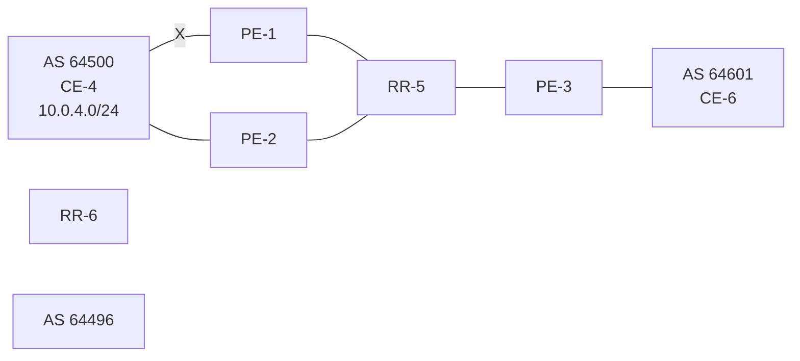

Legend:
* Path A withdrawal
* Path B

If the propagation time of a BGP update message between RR-5 and any of its clients is X, the convergence time is four times X, plus processing, transmission, and queuing delays.

With the use of add-paths on all BGP routers in AS 64496, the convergence time can be reduced considerably, because PE-3 has more than one path for prefix 10.0.4.0/24 in its RIB-IN before the failure takes place. When there are no failures, PE-2 decides that path A is best, and PE-2 also advertises its second-best path (B)—which is its best external path—to RR-5. With add-paths enabled, the RR has knowledge of two paths for prefix 10.0.4.0/24 and advertises both to its clients. PE-3 receives two routes for prefix 10.0.4.0/24, reruns the BGP decision process, and updates its forwarding table based on the results. The following options are possible:

• Path A is the best path, whereas path B is maintained in the RIB-IN. The FIB entry for destination 10.0.4.0/24 points at path {A} only.

• When BGP FRR is enabled as described in chapter BGP Fast Reroute, path A is the best path and path B is the second-best path. The FIB entry for destination 10.0.4.0/24 points to path {A,B}. If path A is available, it is used for all traffic to the destination; if path A is unavailable but path B is available, then all traffic to the destination is directed to path B. In this case, path B is effectively a pre-computed, pre-installed backup path for the destination.

• When Equal Cost Multi-Path (ECMP) and BGP multipath are enabled and the paths have an equal cost, both paths A and B represent the best path. The FIB entry for destination 10.0.4.0/24 points to multipath entry {A,B}. When both paths are available, traffic to the destination is load-shared across paths A and B. If only one path is available, traffic is directed to that available path.

Figure 15: Advertised paths when BGP add-paths is enabled in PEs and RR shows the BGP update messages when there are no failures. RR-5 receives path A from PE-1 and path B from PE-2, whereas it advertises path B to PE-1, path A to PE-2, and both path A and path B to PE-3. Path B has the default

3HE 22247 AAAB TQZZA **© 2026 Nokia.** 86
Use subject to Terms available at: www.nokia.com/terms.

Advanced Configuration Guide Release 26.7    BGP Add-Paths

LP 100, whereas path A gets LP 200 as per import policy on PE-1. However, in case of ECMP, both paths keep the default LP 100.

*Figure 15: Advertised paths when BGP add-paths is enabled in PEs and RR*

engineering_drawing: Network topology diagram showing AS 64500, AS 64496, AS 64600, and AS 64601 with routers CE-4, PE-1, RR-5, PE-2, PE-3, and CE-6.

*Figure 16: Reconvergence after path failure when BGP add-paths is enabled* shows the BGP update messages that are sent after a link failure between CE-4 and PE-1. With add-paths, fewer steps are required for convergence:

**1.** PE-1 sends a BGP update message withdrawing path A.

**2.** RR-5 receives the withdrawal and propagates it to its clients PE-2 and PE-3.

**3.** PE-2 and PE-3 receive the withdrawal, rerun the BGP decision process, and update the forwarding entry for destination 10.0.4.0/24: path B is best.

3HE 22247 AAAB TQZZA    **© 2026 Nokia.**    87
Use subject to Terms available at: [www.nokia.com/terms](http://www.nokia.com/terms).

Advanced Configuration Guide Release 26.7 BGP Add-Paths

Figure 16: Reconvergence after path failure when BGP add-paths is enabled

engineering_drawing: Network diagram showing AS 64500, AS 64496, AS 64601, and AS 64501 with routers CE-4, PE-1, RR-5, PE-2, PE-3, and CE-6. The diagram illustrates path failure and reconvergence.

The convergence time with add-paths is much shorter than without add-paths. If X is the propagation time of a BGP update message between RR and any of the PEs, then the convergence time is the time required for the BGP update from PE-1 to RR-5 (X) plus the time required for the BGP update propagation from RR-5 to the other PEs (X), in addition to delays for processing, transmission, and queuing. The convergence with add-paths is twice as fast as without add-paths.

For some types of failures, the convergence can be even faster:

• When PE-1 becomes unreachable, the next-hop tracking by PE-3 invalidates path A before the BGP withdrawal message is received from RR-5.

• If PE-3 implements BGP FRR and path A has been marked as unusable, PE-3 can switch traffic destined for 10.0.4.0/24 to path B.

• When Bidirectional Forwarding Detection (BFD) is enabled on the EBGP sessions and on the IGP protocol, the failure is detected faster and BGP convergence can be sped up when BGP FRR is enabled.

## 6.2.2 Enhanced load-sharing

When paths A and B are equal in cost or preference, and ECMP and BGP multipath are enabled on all PEs, load-sharing can be done for traffic with destination 10.0.4.0/24. With BGP add-paths, both paths A and B are advertised to the PEs. PE-3 runs the BGP decision process and determines that paths A and B are both best paths to destination 10.0.4.0/24, so paths A and B are combined into one multipath forwarding entry: {A,B}.

The benefits of load-sharing for traffic to destination 10.0.4.0/24 are the following:

3HE 22247 AAAB TQZZA 88
**© 2026 Nokia.**
Use subject to Terms available at: [www.nokia.com/terms](http://www.nokia.com/terms).

Advanced Configuration Guide Release 26.7 BGP Add-Paths

* More even bandwidth utilization of the links in AS 64496

* More even bandwidth utilization for traffic across peering points PE-1 and PE-2 with AS 64500

* Faster reaction to some failures; for example, the BGP next hop for one of the paths becomes unreachable in the IGP and next hop tracking is enabled.

## 6.2.3 Reduced routing churn

Routing churn refers to repeated advertisements and withdrawals of a prefix and path. Some degree of routing churn is normal and expected in most networks. However, it should be contained as much as possible to avoid overloading router CPUs. Routing churn can be caused by:

* Flapping links (links that repeatedly transition between up and down state)

* Route oscillation (networks that use RRs or AS confederations and BGP path selection relies on Multi Exit Discriminator (MED) and IGP cost comparisons)

Add-paths helps to reduce routing churn by constraining the effect of some failures to the local AS where they occur. For example, the link between CE-4 and PE-1 could repeatedly cycle up and down because of a misconfiguration. When the link goes down, a BGP withdrawal message is sent by PE-1 to RR-5 and from RR-5 to the other RR clients (PE-2 and PE-3). PE-3 withdraws and advertises path A to its EBGP peer CE-6 in AS 64501, but path B is constantly advertised to CE-6 (when add-paths has been negotiated between PE-3 and CE-6).

Without add-paths, PE-2 would be affected by the instability in AS 64496 and there would be periods of time when AS 64501 has no paths to destination 10.0.4.0/24 (between the withdrawal of path A and the advertisement of path B).

## 6.2.4 Add-paths implementation

BGP add-paths is configured in the default routing instance, for IBGP or EBGP, per address family at different levels: in the global **bgp** context, per **group**, and per **neighbor**. BGP add path is configured per address family.

Up to 16 paths are configurable per address family per peer (send-limit):

```
--{ +* candidate shared default }--[ network-instance default protocols bgp group grp-IBGP afi- safi ipv4-unicast add-paths ]-- 
A:admin@PE-1# send-max ? 
usage: send-max <1..16> 
Send the N best paths for a single NLRI, or as many as possible until there are no more valid paths to send. 
This ensures the best path is advertised but does not limit the additional paths to being 'used' paths. 
Positional arguments: 
 value          [number, range 1..16]
```

Only the number of advertised routes per prefix is controlled, not the number of received routes. All routes advertised by an add-paths peer are accepted; otherwise, routing loops may occur. If a BGP speaker is configured with <send-limit> n, but has more than n paths available in the LOC-RIB, it selects the n best paths with unique BGP next hops following the Add-n path selection algorithm described in draft-ietf-idr- add-paths-guidelines.

3HE 22247 AAAB TQZZA 89 **© 2026 Nokia.**
Use subject to Terms available at: [www.nokia.com/terms](http://www.nokia.com/terms).

Advanced Configuration Guide Release 26.7    BGP Add-Paths

When BGP add-paths is configured for an address family, the BGP capability is announced to the BGP peer as part of the BGP open message, as follows:

```
# Enable debugging for BGP open messages on PE-1:
enter candidate
  network-instance default {
    protocols {
      bgp {
        trace-options {
          flag open {
          }
        }
```

```
2026-06-17T11:39:14.371457+00:00 PE-1 sr_bgp_mgr: bgp|388029|388061|00096|TR||D: VR default (1)
BGP OPEN: Peer 1: 172.16.14.2 - Send (Active) BGP OPEN: Version 4
  AS Num 64496: Holdtime 90: BGP_ID 192.0.2.1: Opt Length 26 (ExtOpt F)
  Opt Para: Type CAPABILITY: Length = 24: Data:
    Cap_Code GRACEFUL-RESTART: Length 2
    Bytes: 0x1 0x2c
    Cap_Code MP-BGP: Length 4
    Bytes: 0x0 0x1 0x0 0x1
    Cap_Code ROUTE-REFRESH: Length 0
    Cap_Code 4-OCTET-ASN: Length 4
    Bytes: 0x0 0x0 0xfb 0xf0
    **Cap_Code ADD-PATH: Length 4**
    **Bytes: 0x0 0x1 0x1 0x3**
```

The BGP add-paths capability code value typically consists of one or more blocks of four bytes; two octets for the Address Family Identifier (AFI), one octet for the Subsequent Address Family Identifier (SAFI), and one octet for send/receive. In this example, AFI/SAFI bytes point to an IPv4 address family and send/ receive value 3 means that the sender is able to receive and send multiple paths from/to its BGP peer.

In BGP update messages, a 4-octet path identifier (ID) is added to the Network Layer Reachability Information (NLRI) field. The combination of both prefix and path ID identifies a BGP path. SR OS allocates path IDs sequentially on a per address family basis, not per prefix. The path ID is only locally significant, which means that when a BGP speaker re-advertises a route with path IDs, it must generate its own path ID.

```
# Enable debugging for BGP UPDATE messages on RR-5:
enter candidate
  network-instance default {
    protocols {
      bgp {
        trace-options {
          flag update {
          }
        }
```

RR-5 received the following BGP update for prefix 10.0.4.0/24 with path ID.

```
2026-06-17T11:39:19.072811+00:00 RR-5 sr_bgp_mgr: bgp|384120|384153|00102|TR||D: VR default (1)
Peer 1: 192.0.2.2 UPDATE: Peer 1: 192.0.2.2 - Received BGP UPDATE:
  Withdrawn Length = 0
  Total Path Attr Length = 34
  Flag: 0x40 Type: 1 Len: 1 Origin: 0
  Flag: 0x40 Type: 2 Len: 6 AS Path:
    Type: 2 Len: 1 < 64500 >
  Flag: 0x40 Type: 3 Len: 4 Nexthop: 192.0.2.2
  Flag: 0x40 Type: 5 Len: 4 Local Preference: 100
```

3HE 22247 AAAB TQZZA    **© 2026 Nokia.**    90
Use subject to Terms available at: [www.nokia.com/terms](http://www.nokia.com/terms).

Advanced Configuration Guide Release 26.7    BGP Add-Paths

```
Flag: 0xc0 Type: 8 Len: 4 Community:
4:0
NLRI: Length = 8
**10.0.4.0/24 Path-ID 2**
--
```

When routers have negotiated to advertise (and receive) routes with path identifiers, all BGP updates (advertisements or withdrawals) without path identifier are rejected. This results in an NLRI parsing error—because the BGP update has an incorrect length—and a notification is sent.

## 6.3 Configuration

The following configuration examples are in this section:

* BGP without add-paths
* BGP with add-paths for address family IPv4: no BGP FRR, no ECMP
* BGP with add-paths for address family IPv4 and BGP FRR enabled
* BGP with add-paths for address family IPv4 and ECMP enabled
* BGP with add-paths for address family VPN-IPv4 and BGP FRR enabled
* BGP with add-paths for address family VPN-IPv4 and ECMP enabled

Figure 17: Example topology shows the example topology with CE-4 in AS 64500 advertising route 10.0.4.0/24 to its EBGP peers PE-1 and PE-2 in AS 64496. PE-1 has an import policy that sets the LP for this route to 200, whereas PE-2 keeps the default local preference of 100. RR-5 is RR for all PEs in AS 64496. CE-6 in AS 64501 peers with PE-3 in AS 64496 and can send traffic to CE-4 in AS 64500.

3HE 22247 AAAB TQZZA    **© 2026 Nokia.**    91
Use subject to Terms available at: [www.nokia.com/terms](http://www.nokia.com/terms).

Advanced Configuration Guide Release 26.7 BGP Add-Paths

*Figure 17: Example topology*

engineering_drawing: Example topology diagram showing AS 64496, AS 64600, and AS 64501 with various nodes and connections

## 6.3.1 Initial configuration

The initial configuration on all nodes includes:

* Interfaces

* IS-IS as IGP on all interfaces within AS 64496

* LDP on all interfaces between the PEs in AS 64496, but not toward RR-5

BGP is configured on all the nodes. CE-4 peers with PE-1 and PE-2 and exports prefix 10.0.4.0/24 to both EBGP peers, as follows:

```
# on CE-4:
enter candidate
 routing-policy {
  prefix-set ps-10.0.4.0 {
           prefix 10.0.4.0/24 mask-length-range exact {
           }
  }
  standard-community-set scs-4:0 {
           member [
               4:0
           ]
```

3HE 22247 AAAB TQZZA 92 © **2026 Nokia.** Use subject to Terms available at: [www.nokia.com/terms](http://www.nokia.com/terms).

Advanced Configuration Guide Release 26.7 BGP Add-Paths

```
}
standard-community-set scs-6:0 {
 member [
  6:0
 ]
}
policy rp-comm-6:0 {
 default-action {
  policy-result reject
 }
 statement stmt-10 {
  match {
   bgp {
    standard-community {
     standard-community-set scs-6:0
    }
   }
  }
  action {
   policy-result accept
  }
 }
}
policy rp-export-10.0.4.0 {
 statement stmt-10 {
  match {
   prefix {
    prefix-set ps-10.0.4.0
   }
  }
  action {
   policy-result accept
   bgp {
    standard-community {
     operation add
     method reference
     referenced-sets [
      scs-4:0
     ]
    }
    origin {
     set igp
    }
   }
  }
 }
}
}
network-instance default {
 protocols {
  bgp {
   admin-state enable
   router-id 192.0.2.4
   autonomous-system 64500
   afi-safi ipv4-unicast {
    admin-state enable
   }
   group grp-EBGP {
    peer-as 64496
    export-policy [
     rp-export-10.0.4.0
    ]
    import-policy [
     rp-comm-6:0
    ]
   }
  }
 }
}
```

SPACER TEXT

3HE 22247 AAAB TQZZA **© 2026 Nokia.** 93
Use subject to Terms available at: [www.nokia.com/terms](http://www.nokia.com/terms).

Advanced Configuration Guide Release 26.7

<page_header>Advanced Configuration Guide Release 26.7

Advanced Configuration Guide Release 26.7 BGP Add-Paths

```
peer-group grp-IBGP
}
neighbor 192.0.2.3 {
     peer-group grp-IBGP
}
}
```

PE-1 advertises a route for prefix 10.0.4.0/24 with LP 200 to RR-5. RR-5 propagates this route to its other clients: PE-2 and PE-3. When PE-2 learns this route, it does not advertise its own route for 10.0.4.0/24 with LP 100 to RR-5 anymore. PE-3 only learns the route for prefix 10.0.4.0/24 with LP 200, as follows:

```
--{ + running }--[ ]--
A:admin@PE-3# show / network-instance default protocols bgp routes ipv4 prefix 10.0.4.0/24
-------------------------------------------------------------------------------------------
Show report for the BGP routes to network "10.0.4.0/24" network-instance "default"
-------------------------------------------------------------------------------------------
Network: 10.0.4.0/24
Received Paths: 1
Path 1: <Best,Valid,Used,>
 Route source       : neighbor 192.0.2.5
 Route Preference: MED is -, LocalPref is 200
 BGP next-hop       : 192.0.2.1
 Path               : i [64500]
 Communities        : 4:0
Path 1 was advertised to:
[ 172.16.36.2 ]
-------------------------------------------------------------------------------------------
```

## 6.3.2 Reconvergence without add-paths

A failure of the link between CE-4 and PE-1 is simulated as follows:

```
# on CE-4:
enter candidate
 interface ethernet-1/1 {
 subinterface 1 {
          admin-state disable
```

The following four BGP update messages are received or sent by RR-5.

RR-5 receives the following withdrawal message from PE-1:

```
# on RR-5:
2026-06-17T11:26:19.101796+00:00 RR-5 sr_bgp_mgr: bgp|384120|384153|00059|TR||D: VR default (1)
Peer 1: 192.0.2.1 UPDATE: Peer 1: 192.0.2.1 - Received BGP UPDATE:
 Withdrawn Length = 4
 10.0.4.0/24
 Total Path Attr Length = 0
```

RR-5 propagates this withdrawal to its other clients, for example to PE-2, as follows:

```
# on RR-5:
2026-06-17T11:26:22.643609+00:00 RR-5 sr_bgp_mgr: bgp|384120|384154|00004|TR||D: VR default (1)
Peer 1: 192.0.2.2 UPDATE: Peer 1: 192.0.2.2 - Send BGP UPDATE:
 Withdrawn Length = 4
 10.0.4.0/24
 Total Path Attr Length = 0
```

3HE 22247 AAAB TQZZA **© 2026 Nokia.** 96
Use subject to Terms available at: [www.nokia.com/terms](http://www.nokia.com/terms).

Advanced Configuration Guide Release 26.7 BGP Add-Paths

When PE-2 receives this withdrawal, it reruns the BGP decision process and decides that its route for prefix 10.0.4.0/24 with LP 100 is the best route. PE-2 advertises this route to RR-5; it is received by RR-5 as follows:

```
# on RR-5:
2026-06-17T11:26:23.364813+00:00 RR-5 sr_bgp_mgr: bgp|384120|384153|00060|TR||D: VR default (1) Peer 1: 192.0.2.2 UPDATE: Peer 1: 192.0.2.2 - Received BGP UPDATE:
    Withdrawn Length = 0
    Total Path Attr Length = 34
    Flag: 0x40 Type: 1 Len: 1 Origin: 0
    Flag: 0x40 Type: 2 Len: 6 AS Path:
    Type: 2 Len: 1 < 64500 >
    Flag: 0x40 Type: 3 Len: 4 Nexthop: 192.0.2.2
    Flag: 0x40 Type: 5 Len: 4 Local Preference: 100
    Flag: 0xc0 Type: 8 Len: 4 Community: 4:0
    NLRI: Length = 4 10.0.4.0/24
```

RR-5 propagates this message to its other clients: PE-1 and PE-3. The following BGP update is sent to PE-3:

```
# on RR-5:
2026-06-17T11:26:26.646051+00:00 RR-5 sr_bgp_mgr: bgp|384120|384154|00006|TR||D: VR default (1) Peer 1: 192.0.2.3 UPDATE: Peer 1: 192.0.2.3 - Send BGP UPDATE:
    Withdrawn Length = 0
    Total Path Attr Length = 48
    Flag: 0x40 Type: 1 Len: 1 Origin: 0
    Flag: 0x40 Type: 2 Len: 6 AS Path:
    Type: 2 Len: 1 < 64500 >
    Flag: 0x40 Type: 3 Len: 4 Nexthop: 192.0.2.2
    Flag: 0x40 Type: 5 Len: 4 Local Preference: 100
    Flag: 0xc0 Type: 8 Len: 4 Community: 4:0
    Flag: 0x80 Type: 9 Len: 4 Originator ID: 192.0.2.2
    Flag: 0x80 Type: 10 Len: 4 Cluster ID: 192.0.2.5
    NLRI: Length = 4 10.0.4.0/24
```

Again, PE-3 has only one route for prefix 10.0.4.0/24, but this time with next hop 192.0.2.2, as follows:

```
--{ + running }--[ ]-- A:admin@PE-3# show / network-instance default protocols bgp routes ipv4 prefix 10.0.4.0/24
------------------------------------------------------------------------------------------
Show report for the BGP routes to network "10.0.4.0/24" network-instance "default"
------------------------------------------------------------------------------------------
Network: 10.0.4.0/24
Received Paths: 1
Path 1: <Best,Valid,Used,>
    Route source     : neighbor 192.0.2.5
    Route Preference: MED is -, LocalPref is 100
    BGP next-hop     : 192.0.2.2
    Path             : i [64500]
    Communities      : 4:0
Path 1 was advertised to:
[ 172.16.36.2 ]
------------------------------------------------------------------------------------------
```

3HE 22247 AAAB TQZZA **© 2026 Nokia.** 97
Use subject to Terms available at: [www.nokia.com/terms](http://www.nokia.com/terms).

Advanced Configuration Guide Release 26.7 BGP Add-Paths

The configuration is restored as follows:

```
# on CE-4:
enter candidate
interface ethernet-1/1 {
    subinterface 1 {
          admin-state enable
```

## 6.3.3 Add-paths enabled: no BGP FRR, no ECMP

Before add-paths is enabled, the following information is displayed on PE-1 for BGP neighbor RR-5:

```
--{ + running }--[  ]--
A:admin@PE-1# **info from state** network-instance default protocols bgp neighbor 192.0.2.5 afi-
safi ipv4-unicast add-paths
 receive false
 send false
```

Add-paths is enabled on PE-1 and PE-2 with a send path limit of two for groups grp-EBGP and grp-IBGP and no limit on the receive path, as follows:

```
# on PE-1 and PE-2:
enter candidate
 network-instance default {
      protocols {
      bgp {
               group grp-EBGP {
                    afi-safi ipv4-unicast {
                       **add-paths {**
                           **receive true**
                           **send true**
                           **send-max 2**
                       }
                    }
               }
               group grp-IBGP {
                    afi-safi ipv4-unicast {
                       **add-paths {**
                           **receive true**
                           **send true**
                           **send-max 2**
                       }
                    }
               }
```

When the preceding **info from state** command is repeated on PE-1 or PE-2, the local BGP add-paths capabilities are specified for address family IPv4: a maximum of two paths can be sent for a specific IPv4 prefix.

```
--{ + running }--[  ]--
A:admin@PE-1# **info from state** network-instance default protocols bgp group grp-EBGP afi-safi
ipv4-unicast **add-paths**
 receive **true**
 send **true**
 send-max **2**
--{ + running }--[  ]--
```

3HE 22247 AAAB TQZZA 98
**© 2026 Nokia.**
Use subject to Terms available at: [www.nokia.com/terms](http://www.nokia.com/terms).

Advanced Configuration Guide Release 26.7    BGP Add-Paths

```
A:admin@PE-1# info from state network-instance default protocols bgp group grp-IBGP afi-safi
 ipv4-unicast add-paths
  receive true
  send true
  send-max 2
```

The remote peer RR-5 does not have add-paths enabled yet, so PE-1 did not receive the add-paths capability from RR-5:

```
--{ + running }--[  ]--
 A:admin@PE-1# info from state network-instance default protocols bgp neighbor 192.0.2.5
 received-capabilities
  received-capabilities [
         ROUTE_REFRESH
         4-OCTET_ASN
         MP_BGP
         GRACEFUL_RESTART
  ]                                        ## ADD_PATH capability is not included in the list
```

Initially, add-paths remains disabled on PE-3. On the RR, add-paths is enabled for neighbors 192.0.2.1 and 192.0.2.2, but not for 192.0.2.3 yet. For neighbor 192.0.2.1, the **receive false** option implies that the add-paths receive capability is not negotiated.

```
# on RR-5:
 enter candidate
  network-instance default {
         protocols {
           bgp {
                neighbor 192.0.2.1 {
                     afi-safi ipv4-unicast {
                        **add-paths {**
                            **receive false**   # add-path receive capability not negotiated
                            **send true**
                            **send-max 2**
                        }
                     }
                }
                neighbor 192.0.2.2 {
                     afi-safi ipv4-unicast {
                        **add-paths {**
                            **receive true**    # add-path receive capability negotiated
                            **send true**
                            **send-max 2**
                        }
                     }
                }
```

The following output shows that add-paths is enabled locally on RR-5 for address family IPv4. RR-5 can send a maximum of two paths for a specific prefix toward PE-1 and PE-2; toward PE-3, add-paths remains disabled.

```
--{ + running }--[  ]--
 A:admin@RR-5# info from state network-instance default protocols bgp neighbor 192.0.2.1 afi-
 safi ipv4-unicast add-paths
  receive false
  send true
  send-max 2
```

```
--{ + running }--[  ]--
```

3HE 22247 AAAB TQZZA    99    **© 2026 Nokia.**
                        Use subject to Terms available at: [www.nokia.com/terms](http://www.nokia.com/terms).

Advanced Configuration Guide Release 26.7 BGP Add-Paths

```
A:admin@RR-5# info from state network-instance default protocols bgp neighbor 192.0.2.2 afi- safi ipv4-unicast add-paths
  receive true
  send true
  send-max 2
```

```
--{ + running }--[ ]--
A:admin@RR-5# info from state network-instance default protocols bgp neighbor 192.0.2.3 afi- safi ipv4-unicast add-paths
  receive false
  send false
```

The **receive false** option indicates that RR-5 does not negotiate the add-paths receive capability with its peer, so RR-5 is not willing to receive multiple paths from PE-1 for IPv4 unicast. PE-1 knows that peer 192.0.2.5 may send IPv4 routes with a path ID because the add-paths capability is negotiated, but PE-1 has no information about what RR-5 receives. The following shows that PE-1 received the add-paths capability from RR-5:

```
--{ + running }--[ ]--
A:admin@PE-1# info from state network-instance default protocols bgp neighbor 192.0.2.5 received-capabilities
  received-capabilities [
   ROUTE_REFRESH
   4-OCTET_ASN
   MP_BGP
   GRACEFUL_RESTART
   **ADD_PATH**
  ]
```

With BGP add-paths enabled, PE-2 advertises its second-best route for prefix 10.0.4.0/24 with LP 100 to RR-5. RR-5 has two valid routes for prefix 10.0.4.0/24 in its RIB-IN, but only the route with LP 200 is best and used, as follows:

```
--{ + running }--[ ]--
A:admin@RR-5# show / network-instance default protocols bgp routes ipv4 prefix 10.0.4.0/24
------------------------------------------------------------------------------------------
Show report for the BGP routes to network "10.0.4.0/24" network-instance "default"
------------------------------------------------------------------------------------------
Network: 10.0.4.0/24
Received Paths: 2
 Path 1: <**Best**,**Valid**,**Used**,>
  Route source      : neighbor 192.0.2.1
  Route Preference: MED is -, **LocalPref is 200**
  BGP next-hop      : 192.0.2.1
  Path              : i [64500]
  Communities       : 4:0
 Path 2: <**Valid**,>
  Route source      : neighbor 192.0.2.2
  Route Preference: MED is -, **LocalPref is 100**
  BGP next-hop      : 192.0.2.2
  Path              : i [64500]
  Communities       : 4:0
Path 1 was advertised to:
[ 192.0.2.1, 192.0.2.2, 192.0.2.3 ]
------------------------------------------------------------------------------------------
```

3HE 22247 AAAB TQZZA **© 2026 Nokia.** 100
Use subject to Terms available at: [www.nokia.com/terms](http://www.nokia.com/terms).

Advanced Configuration Guide Release 26.7    BGP Add-Paths

Even though RR-5 has two routes for this prefix, it only advertises its best route to PE-3, because add-paths is not enabled for this BGP session. Therefore, PE-3 only has the route for 10.0.4.0/24 with LP 200, as follows:

```
--{ + running }--[ ]-- A:admin@PE-3# show / network-instance default protocols bgp routes ipv4 prefix 10.0.4.0/24 
------------------------------------------------------------------------------------------ 
Show report for the BGP routes to network "10.0.4.0/24" network-instance "default" 
------------------------------------------------------------------------------------------ 
Network: 10.0.4.0/24
Received Paths: 1
Path 1: <**Best,Valid,Used,**>
 Route source       : neighbor 192.0.2.5
 Route Preference: MED is -, **LocalPref is 200**
 BGP next-hop       : 192.0.2.1
 Path               : i [64500]
 Communities        : 4:0
Path 1 was advertised to:
[ 172.16.36.2 ]
------------------------------------------------------------------------------------------
```

When add-paths is enabled on the session between PE-3 and RR-5, the second route is advertised, as follows:

```
# on PE-3:
enter candidate
 network-instance default {
       protocols {
          bgp {
               group grp-IBGP {
                    afi-safi ipv4-unicast {
                       add-paths {
                         receive true
                         send true
                         send-max 2
                       }
                    }
               }
          }
     }
```

```
# on RR-5:
enter candidate
 network-instance default {
       protocols {
          bgp {
               neighbor 192.0.2.3 {
                    afi-safi ipv4-unicast {
                       add-paths {
                         receive true
                         send true
                         send-max 2
                       }
                    }
               }
          }
     }
```

```
--{ + running }--[ ]-- A:admin@PE-3# show / network-instance default protocols bgp routes ipv4 prefix 10.0.4.0/24 
------------------------------------------------------------------------------------------- 
Show report for the BGP routes to network "10.0.4.0/24" network-instance "default" 
-------------------------------------------------------------------------------------------
```

3HE 22247 AAAB TQZZA    **© 2026 Nokia.**    101
Use subject to Terms available at: [www.nokia.com/terms](http://www.nokia.com/terms).

Advanced Configuration Guide Release 26.7 BGP Add-Paths

```
Network: 10.0.4.0/24
Received Paths: 2
 Path 1: <**Best,Valid,Used,**>
  Route source      : neighbor 192.0.2.5
  Route Preference: MED is -, **LocalPref is 200**
  BGP next-hop      : 192.0.2.1
  Path              : i [64500]
  Communities       : 4:0
 Path 2: <Valid,>
  Route source      : neighbor 192.0.2.5
  Route Preference: MED is -, LocalPref is 100
  BGP next-hop      : 192.0.2.2
  Path              : i [64500]
  Communities       : 4:0
Path 1 was advertised to:
[ 172.16.36.2 ]
-------------------------------------------------------------------------------------------
```

BGP add-paths is enabled, but BGP FRR or ECMP are disabled. The routing table on PE-3 only contains one entry for prefix 10.0.4.0/24:

<table>
<thead>
<tr><th>Prefix</th><th>Route Type</th><th>Metric</th><th>Pref</th><th>Flags</th><th>Next-Hop(s)</th></tr>
</thead>
<tbody>
<tr><td>10.0.4.0/24</td><td>bgp</td><td>10</td><td>170</td><td>></td><td>192.0.2.1(route:isis)</td></tr>
</tbody>
</table>

## 6.3.4 Reconverge with add-paths: no BGP FRR, no ECMP

A link failure between CE-4 and PE-1 is simulated as follows:

```
# on CE-4:
enter candidate
interface ethernet-1/1 {
    subinterface 1 {
          admin-state disable
```

PE-1 sends a withdrawal message for route 10.0.4.0/24 with LP 200 to RR-5 and reruns the BGP decision process. RR-5 propagates this withdrawal message to its other clients that rerun the BGP decision process. As a result, the route for prefix 10.0.4.0/24 with LP 100 is used on all nodes; for example, on PE-3:

```
--{ + running }--[ ]--
A:admin@PE-3# show / network-instance default protocols bgp routes ipv4 prefix 10.0.4.0/24
-----------------------------------------------------------------------------------------------
---------------
Show report for the BGP routes to network "10.0.4.0/24" network-instance "default"
-----------------------------------------------------------------------------------------------
---------------
```

3HE 22247 AAAB TQZZA    **© 2026 Nokia.**    102
Use subject to Terms available at: [www.nokia.com/terms](http://www.nokia.com/terms).

Advanced Configuration Guide Release 26.7 BGP Add-Paths

```
Network: 10.0.4.0/24
Received Paths: 1
   Path 1: <**Best,Valid,Used**,>
    Route source      : neighbor 192.0.2.5
    Route Preference: MED is -, **LocalPref is 100**
    BGP next-hop      : 192.0.2.2
    Path              : i [64500]
    Communities       : 4:0
Path 1 was advertised to:
[ 172.16.36.2 ]
```

The routing table contains a route to 10.0.4.0/24 with PE-2 as next hop, as follows:

```
--{ + running }--[ ]-- A:admin@PE-3# show / network-instance default ipv4 route 10.0.4.0/24
===============================================================================================
===============
IPv4-unicast route table for default network-instance
-----------------------------------------------------------------------------------------------
---------------
Flags: > (best), * (unviable), ! (failed)
     : L (leaked route from another network-instance)
     : B (backup NHG active and displayed)
     : S (statistics supported)
     : D (dynamic LB), R (resilient LB)
-----------------------------------------------------------------------------------------------
---------------
Prefix                Route Type   Metric  Pref   Flags   Next-Hop(s)
-----------------------------------------------------------------------------------------------
---------------
10.0.4.0/24           bgp          10      170    >       192.0.2.2(route:isis)
```

The convergence with add-paths enabled is twice as fast as without BGP add-paths. With BGP add-paths disabled, four sequential messages are sent:

**1.** PE-1 sends a withdrawal to RR-5.

**2.** RR-5 propagates withdrawal.

**3.** PE-2 advertises its route.

**4.** RR-5 propagates the route.

In the scenario with add-paths, the last two messages are already sent before the failure happened. During convergence, only two withdrawal messages are sent: PE-1 sends a withdrawal to RR-5; RR-5 propagates this to its clients.

## 6.3.5 Add-path and BGP FRR

The convergence time can be further reduced by enabling BGP FRR, where the BGP decision process runs for the best route and the backup path before any failure happens, as described in chapter BGP Fast Reroute. On all PEs, BGP FRR is enabled for the IPv4 address family, as follows:

```
# on all PEs:
enter candidate
   network-instance default {
           protocols {
             bgp {
```


Use subject to Terms available at: www.nokia.com/terms.
</page_footer>

<page_footer>3HE 22247 AAAB TQZZA © 2026 Nokia. 103

Advanced Configuration Guide Release 26.7

Advanced Configuration Guide Release 26.7    BGP Add-Paths

### 6.3.6 Add-paths and ECMP

On PE-1, the import policy is replaced by a policy that does not modify the local preference value of 100 (default), as follows. The paths via PE-1 and PE-2 have an equal cost.

```
# on PE-1:
enter candidate
routing-policy {
  policy rp-comm-4:0 {
          default-action {
               policy-result reject
          }
          statement stmt-10 {
               match {
                bgp {
                        standard-community {
                           standard-community-set scs-4:0
                        }
                }
               }
               action {
                policy-result accept        # the local preference is not changed
               }
          }
  }
  info
  commit stay
 }
 network-instance default {
  protocols {
          bgp {
               group grp-EBGP {
                import-policy [
                        rp-comm-4:0
                ]
```

ECMP is enabled in IS-IS instance 0 on all PEs with a value of two, as follows:

```
# on all PEs:
enter candidate
 network-instance default {
  protocols {
          isis {
               instance 0 {
                max-ecmp-paths 2
```

On all PEs, BGP multipath is configured with the maximum number of paths equal to two for AFI-SAFI ipv4-unicast, as follows:

```
# on all PEs:
enter candidate
 network-instance default {
  protocols {
          bgp {
               afi-safi ipv4-unicast {
                multipath {
                        ebgp {
                           maximum-paths 2
                        }
                        ibgp {
```

3HE 22247 AAAB TQZZA    105    **© 2026 Nokia.**
Use subject to Terms available at: [www.nokia.com/terms](http://www.nokia.com/terms).

Advanced Configuration Guide Release 26.7 BGP Add-Paths

```
maximum-paths 2
    }
}
```

All PEs have two routes for prefix 10.0.4.0/24 and both are active when ECMP is enabled; for example, for PE-3, as follows:

```
--{ + running }--[ ]--
A:admin@PE-3# show / network-instance default protocols bgp routes ipv4 prefix 10.0.4.0/24
-------------------------------------------------------------------------------------------
Show report for the BGP routes to network "10.0.4.0/24" network-instance "default"
-------------------------------------------------------------------------------------------
Network: 10.0.4.0/24
Received Paths: 2
 Path 1: <Best,Valid,Used,>
  Route source      : neighbor 192.0.2.5
  Route Preference: MED is -, LocalPref is 100
  BGP next-hop      : 192.0.2.2
  Path              : i [64500]
  Communities       : None
 Path 2: <Best,Valid,Used,>
  Route source      : neighbor 192.0.2.5
  Route Preference: MED is -, LocalPref is 100
  BGP next-hop      : 192.0.2.1
  Path              : i [64500]
  Communities       : None
Path 2 was advertised to:
[ 172.16.36.2 ]
-------------------------------------------------------------------------------------------
```

```
--{ + running }--[ ]--
A:admin@PE-3# show / network-instance default ipv4 route 10.0.4.0/24
===========================================================================================
IPv4-unicast route table for default network-instance
-------------------------------------------------------------------------------------------
Flags: > (best), * (unviable), ! (failed)
   : L (leaked route from another network-instance)
   : B (backup NHG active and displayed)
   : S (statistics supported)
   : D (dynamic LB), R (resilient LB)
-------------------------------------------------------------------------------------------
Prefix              Route Type   Metric   Pref   Flags     Next-Hop(s)
-------------------------------------------------------------------------------------------
10.0.4.0/24         bgp          10       170    >         192.0.2.1(route:isis)
                                                           192.0.2.2(route:isis)
```

Traffic flows with destination 10.0.4.0/24 are sprayed over the two active paths.

## 6.3.7 Add-path for family VPN-IPv4 with BGP FRR

Figure 18: Example topology with IP-VRFs shows the example topology with IP-VRF-1 configured on the PEs in AS 64496. CE-4 exports prefix 172.31.0.0/16 to IP-VRF-1 on PE-1 and PE-2.

3HE 22247 AAAB TQZZA 106
**© 2026 Nokia.**
Use subject to Terms available at: [www.nokia.com/terms](http://www.nokia.com/terms).

Advanced Configuration Guide Release 26.7 BGP Add-Paths

Figure 18: Example topology with IP-VRFs

illustration: network topology diagram showing AS 64496, AS 64600, and AS 64601 with various PE, CE, and RR nodes connected by IP-VRF-1, EBGP IPv4, and IBGP VPN-IPv4 links

IP-VRF-1 is configured on all PEs in AS 64496, but not on the RR. BGP FRR is enabled in the IP-VRF. The configuration of IP-VRF-1 is similar on all PEs; for example, for PE-1, the IP-VRF configuration is as follows:

```
# on PE-1:
enter candidate
 system {
       mpls {
          label-ranges {
               dynamic dlb-services {
                  start-label 30000
                  end-label 39999
               }
          }
          services {
               network-instance {
                  dynamic-label-block dlb-services
               }
          }
       }
 }
 routing-policy {
       standard-community-set scs-4:1 {
          member [
               4:1
```

3HE 22247 AAAB TQZZA **© 2026 Nokia.** 107
Use subject to Terms available at: [www.nokia.com/terms](http://www.nokia.com/terms).

Advanced Configuration Guide Release 26.7

Advanced Configuration Guide Release 26.7

Advanced Configuration Guide Release 26.7    BGP Add-Paths

```
policy rp-import-bgpipvpn-4:1-LP100 {
        statement stmt-10 {
             match {
                bgp {
                    standard-community {
                     standard-community-set scs-4:1
                    }
                }
             }
             action {
                policy-result accept
                bgp {
                    local-preference {
                     value 100
                     operation set
                    }
                }
             }
        }
}
network-instance default {
 protocols {
        bgp {
             group grp-IBGP {
                afi-safi l3vpn-ipv4-unicast {
                    admin-state enable
                    import-policy [
                     rp-import-bgpipvpn-4:1-LP100
                    ]
                }
```

On the CEs, the configuration is either in the base routing instance—with additional router interfaces and BGP neighbors—or in an IP-VRF. In this example, the following IP-VRF is configured on CE-4:

```
# on CE-4:
enter candidate
routing-policy {
  standard-community-set scs-4:1 {
          member [
               4:1
          ]
  }
  standard-community-set scs-6:1 {
          member [
               6:1
          ]
  }
  prefix-set ps-172.31.0.0 {
          prefix 172.31.0.0/24 mask-length-range exact {
          }
  }
  policy rp-export-4:1-ip-vrf {
          statement stmt-10 {
               match {
                  prefix {
                      prefix-set ps-172.31.0.0
                  }
               }
               action {
                  policy-result accept
                  bgp {
                      standard-community {
```

3HE 22247 AAAB TQZZA    **© 2026 Nokia.**    110
Use subject to Terms available at: [www.nokia.com/terms](http://www.nokia.com/terms).

Advanced Configuration Guide Release 26.7

Advanced Configuration Guide Release 26.7 BGP Add-Paths

```
]
import-policy [
      rp-import-6:1-ip-vrf
]
afi-safi ipv4-unicast {
      admin-state enable
}
}
neighbor 172.16.114.1 {
peer-group grp-EBGP-1
}
neighbor 172.16.124.1 {
peer-group grp-EBGP-1
}
}
```

The configuration on CE-6 is similar.

For all BGP speakers in AS 64496, BGP must be configured for address family VPN-IPv4 and BGP add-paths can be enabled for VPN-IPv4, for example, at group level:

```
# on PE-1, PE-2, PE-3:
enter candidate
network-instance default {
protocols {
          bgp {
               afi-safi l3vpn-ipv4-unicast {
                admin-state enable
               }
               group grp-IBGP {
                **afi-safi l3vpn-ipv4-unicast {**
                      **admin-state enable**
                      **add-paths {**
                       **receive true**
                       **send true**
                       **send-max 2**
                      **}**
                }
               }
```

In this example, BGP add-paths is enabled at neighbor level on RR-5, as follows:

```
# on RR-5:
enter candidate
network-instance default {
protocols {
          bgp {
               neighbor 192.0.2.1 {
                **afi-safi l3vpn-ipv4-unicast {**
                      **admin-state enable**
                      **add-paths {**
                       **receive true**
                       **send true**
                       **send-max 2**
                      **}**
                }
               }
               neighbor 192.0.2.2 {
                **afi-safi l3vpn-ipv4-unicast {**
                      **admin-state enable**
                      **add-paths {**
                       **receive true**
```

3HE 22247 AAAB TQZZA 112 **© 2026 Nokia.**
Use subject to Terms available at: [www.nokia.com/terms](http://www.nokia.com/terms).

Advanced Configuration Guide Release 26.7    BGP Add-Paths

```
send true
send-max 2
}
}
}
neighbor 192.0.2.3 {
afi-safi l3vpn-ipv4-unicast {
admin-state enable
add-paths {
receive true
send true
send-max 2
}
}
}
```

With add-paths enabled for address family VPN-IPv4, PE-1 and PE-2 advertise their route for prefix 172.31.0.0/16 as VPN-IPv4 route to RR-5. RR-5 advertises both routes to its other RR clients. PE-3 receives two VPN-IPv4 routes for prefix 172.31.0.0/16, as follows:

```
--{ + running }--[ ]--
A:admin@PE-3# show / network-instance default protocols bgp routes l3vpn-ipv4-unicast prefix 172.31.0.0/24
-----------------------------------------------------------------------------------------------
-----------
Show report for the BGP routes to network "172.31.0.0/24" network-instance "default"
-----------------------------------------------------------------------------------------------
-----------
Route-distinguisher: 192.0.2.1:1  Network: 172.31.0.0/24
Received Paths: 1
Path 1: <**Best,Valid,Used,**>
 Route source       : neighbor 192.0.2.5
 Route Preference: MED is -, **LocalPref is 200**
 BGP next-hop       : 192.0.2.1
 Path               : i [64500]
 Communities        : 4:1, target:64496:1
Path 1 was advertised to:
[ ]
-----------------------------------------------------------------------------------------------
-----------
-----------------------------------------------------------------------------------------------
-----------
Show report for the BGP routes to network "172.31.0.0/24" network-instance "default"
-----------------------------------------------------------------------------------------------
-----------
Route-distinguisher: 192.0.2.2:1  Network: 172.31.0.0/24
Received Paths: 1
Path 1: <**Best,Valid,Used,**>
 Route source       : neighbor 192.0.2.5
 Route Preference: MED is -, **LocalPref is 100**
 BGP next-hop       : 192.0.2.2
 Path               : i [64500]
 Communities        : 4:1, target:64496:1
Path 1 was advertised to:
[ ]
-----------------------------------------------------------------------------------------------
-----------
```

Both routes are used: the route via PE-1 has local preference 200 and the route via PE-2 has local preference 100.

3HE 22247 AAAB TQZZA    **© 2026 Nokia.**    113
Use subject to Terms available at: [www.nokia.com/terms](http://www.nokia.com/terms).

Advanced Configuration Guide Release 26.7 BGP Add-Paths

The routing table for IP-VRF 1 on PE-3 shows the active and the backup route for prefix 172.31.0.0/16, as follows:

```
--{ + running }--[ ]--
A:admin@PE-3# show / network-instance IP-VRF-1 ipv4 route 172.31.0.0/24
===============================================================================================
========
IPv4-unicast route table for ip-vrf network-instance: IP-VRF-1
-----------------------------------------------------------------------------------------------
--------
Flags: > (best), * (unviable), ! (failed)
 : L (leaked route from another network-instance)
 : B (backup NHG active and displayed)
 : S (statistics supported)
 : D (dynamic LB), R (resilient LB)
-----------------------------------------------------------------------------------------------
--------
Prefix              Route Type   Metric  Pref   Flags   Next-Hop(s)
-----------------------------------------------------------------------------------------------
--------
172.31.0.0/24       bgp-ipvpn    10      170    >       192.0.2.1(tunnel:ldp, label:30000)
                                                        backup:192.0.2.2(tunnel:ldp,
label:30000)
```

### 6.3.8 Add-paths for family VPN-IPv4 with ECMP

The import policy is replaced in IP-VRF 1 on PE-1 to make the cost of the paths via PE-1 and PE-2 equal, as follows:

```
# on PE-1:
enter candidate
routing-policy {
  policy rp-import-4:1-LP100 {
          default-action {
               policy-result reject
          }
          statement stmt-10 {
               match {
                bgp {
                      standard-community {
                          standard-community-set scs-4:1
                      }
                }
               }
               action {
                policy-result accept      # local preference 100 is not modified
               }
          }
  }
 }
 network-instance IP-VRF-1 {
  protocols {
          bgp {
               group grp-EBGP-1 {
                import-policy [
                      rp-import-4:1-LP100
                ]
```

3HE 22247 AAAB TQZZA **© 2026 Nokia.** 114
Use subject to Terms available at: [www.nokia.com/terms](http://www.nokia.com/terms).

Advanced Configuration Guide Release 26.7    BGP Add-Paths

ECMP is enabled in IP-VRF 1 on all PEs, as follows:

```
# on PE-1, PE-2, PE-3:
enter candidate
network-instance IP-VRF-1 {
   protocols {
           bgp-ipvpn {
                 bgp-instance 1 {
                    ecmp 2
```

BGP multipath needs to be enabled in the base routing context, but that already happened.

With ECMP enabled, the two routes that are received on PE-3 from RR-5 are both active, as follows:

```
--{ + running }--[  ]--
A:admin@PE-3# show / network-instance default protocols bgp routes l3vpn-ipv4-unicast prefix
172.31.0.0/24
-----------------------------------------------------------------------------------------------
-----------
Show report for the BGP routes to network "172.31.0.0/24" network-instance "default"
-----------------------------------------------------------------------------------------------
-----------
Route-distinguisher: 192.0.2.1:1  Network: 172.31.0.0/24
Received Paths: 1
Path 1: <Best,Valid,Used,>
 Route source       : neighbor 192.0.2.5
 Route Preference: MED is -, LocalPref is 100
 BGP next-hop       : 192.0.2.1
 Path               : i [64500]
 Communities        : 4:1, target:64496:1
Path 1 was advertised to:
[ ]
-----------------------------------------------------------------------------------------------
-----------
-----------------------------------------------------------------------------------------------
-----------
Show report for the BGP routes to network "172.31.0.0/24" network-instance "default"
-----------------------------------------------------------------------------------------------
-----------
Route-distinguisher: 192.0.2.2:1  Network: 172.31.0.0/24
Received Paths: 1
Path 1: <Best,Valid,Used,>
 Route source       : neighbor 192.0.2.5
 Route Preference: MED is -, LocalPref is 100
 BGP next-hop       : 192.0.2.2
 Path               : i [64500]
 Communities        : 4:1, target:64496:1
Path 1 was advertised to:
[ ]
-----------------------------------------------------------------------------------------------
-----------
```

ECMP is enabled with a value of two, so traffic flows in IP-VRF-1 on PE-3 with destination 172.31.0.0/16 are distributed over two paths: one via PE-1 and another via PE-2, as follows:

```
--{ + running }--[  ]--
A:admin@PE-3# show / network-instance IP-VRF-1 ipv4 route 172.31.0.0/24
==============================================================================================
IPv4-unicast route table for ip-vrf network-instance: IP-VRF-1
----------------------------------------------------------------------------------------------
Flags: > (best), * (unviable), ! (failed)
   : L (leaked route from another network-instance)
```

3HE 22247 AAAB TQZZA    **© 2026 Nokia.**    115
                        Use subject to Terms available at: [www.nokia.com/terms](http://www.nokia.com/terms).

Advanced Configuration Guide Release 26.7 BGP Add-Paths

```
<table>
<thead>
<tr><th>Prefix</th><th>Route Type</th><th>Metric</th><th>Pref</th><th>Flags</th><th>Next-Hop(s)</th></tr>
</thead>
<tbody>
<tr><td>172.31.0.0/24</td><td>bgp-ipvpn</td><td>10</td><td>170</td><td>&gt;</td><td>192.0.2.1(tunnel:ldp, label:30000)<br/>192.0.2.2(tunnel:ldp, label:30000)</td></tr>
</tbody>
</table>
```

## 6.4 Conclusion

BGP add-paths allows BGP speakers to advertise multiple distinct paths for the same prefix. The potential benefits of BGP add-paths include reduced routing churn, faster convergence, and better load-sharing.

3HE 22247 AAAB TQZZA **© 2026 Nokia.** 116
Use subject to Terms available at: [www.nokia.com/terms](http://www.nokia.com/terms).

Advanced Configuration Guide Release 26.7 BGP Add-paths Policy Control

# 7 BGP Add-paths Policy Control

This chapter provides information about BGP add-paths policy control.

Topics in this chapter include:

• Applicability

• Overview

• Configuration

• Conclusion

## 7.1 Applicability

The CLI in the latest update corresponds to SR Linux Release 26.3.3.

## 7.2 Overview

BGP add-paths allows for advertising multiple paths per prefix for faster convergence, load sharing, and reduction of routing churn. See the BGP Add-Paths chapter for more information.

The BGP add-paths policy control feature extends the functionality of BGP add-paths and allows to control the number of advertised paths per prefix per address family. With BGP add-paths, all prefixes that belong to an address family (such as IPv4, IPv6, and so on) are subject to the same sending limit imposed by the **add-paths send-max <number>** command configured at the BGP instance, group, or neighbor level.

BGP add-paths policy control adds the capability to configure the number of advertised paths on a per prefix per address family basis. The **eligible-prefix-policy <routing-policy>** allows specifying per address family the prefixes for which add-paths send-max <number> as configured at the BGP instance, group, or neighbor level applies. This adds finer granularity to BGP add-paths, where a global path limit is defined per address family at the relevant BGP level and specific policies specify per address family what prefixes it is applied for.

As an example, Figure 19: BGP add-paths before policy control shows a topology for BGP add-paths before policy control.

3HE 22247 AAAB TQZZA 117
**© 2026 Nokia.**
Use subject to Terms available at: [www.nokia.com/terms](http://www.nokia.com/terms).

Advanced Configuration Guide Release 26.7 BGP Add-paths Policy Control

Figure 19: BGP add-paths before policy control

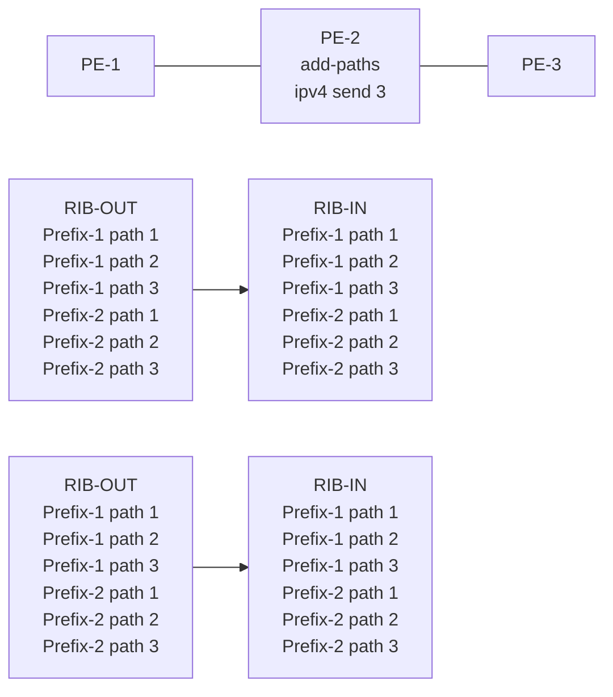

26774

In Figure 19: BGP add-paths before policy control, PE-2 receives two prefixes with three diverse paths from PE-1. PE-2 has a sending limit with a value of 3 configured at a BGP level that is applicable to PE-3. Therefore, PE-2 sends both prefixes with three different path IDs to PE-3.

Figure 20: BGP add-paths after policy control shows a topology for BGP add-paths after policy control.

3HE 22247 AAAB TQZZA **© 2026 Nokia.** 118
Use subject to Terms available at: [www.nokia.com/terms](http://www.nokia.com/terms).

Advanced Configuration Guide Release 26.7 BGP Add-paths Policy Control

Figure 20: BGP add-paths after policy control


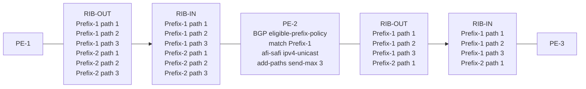


26775b

In Figure 20: BGP add-paths after policy control, a BGP **eligible-prefix-policy <policy>** is applied on PE-2. The policy selectively applies add-paths only for Prefix-1, so PE-2 sends Prefix 1 with three different path IDs to PE-3 . However, PE-2 sends only one path for Prefix-2 to PE-3, because the add-paths sending limit of 3 only applies for Prefix-1.

icon: note

**Note:** The routing policy only controls the eligibility of the prefix-set for the add-paths control, not the number of advertised paths or the set of paths.

## **7.3 Configuration**

The following configuration examples are in this section:

• BGP add-paths for address family IPv4 without policy control

• BGP add-paths for address family IPv4 with policy control

• BGP add-paths for address family VPN-IPv4 with policy control

## **7.3.1 Example topology**

Figure 21: Example topology - IPv4 shows the example topology used for the BGP add-paths policy control feature for the IPv4 address family. The topology used is similar to the one in the BGP Add-Paths chapter, with the following characteristics:

3HE 22247 AAAB TQZZA **© 2026 Nokia.** 119
Use subject to Terms available at: www.nokia.com/terms.

Advanced Configuration Guide Release 26.7 BGP Add-paths Policy Control

• CE-4 in AS 64500 advertises both prefixes 10.1.0.0/16 and 10.2.0.0/16 in the default network instance to its eBGP peers PE-1 and PE-2 in AS 64496.

• RR-5 is route reflector for all PEs in AS 64496.

• add-paths is configured for the IPv4 address family on all PE routers and RR-5 with a sending limit of 2.

• CE-6 in AS 64501 peers with PE-3 in AS 64496 and can send traffic to CE-4 in 64500.

Figure 21: Example topology - IPv4

engineering_drawing: Example topology - IPv4

## 7.3.1.1 Initial configuration

The initial configuration on all nodes includes:

• Interfaces

• IS-IS as IGP on all interfaces within AS 64496

• LDP on all interfaces between the PEs in AS 64496, but not toward RR-5. LDP is used to create the transport tunnels that bind to the IP-VRF in the VPN-IPv4 address family section.

BGP is configured on all the nodes. CE-4 peers with PE-1 and PE-2 and exports prefixes 10.1.0.0/16 and 10.2.0.0/16 to both eBGP peers, as follows:

# on CE-4:
enter candidate

3HE 22247 AAAB TQZZA 120 **© 2026 Nokia.**
Use subject to Terms available at: www.nokia.com/terms.

Advanced Configuration Guide Release 26.7    BGP Add-paths Policy Control

```
network-instance default {
 protocols {
  bgp {
   admin-state enable
   autonomous-system 64500
   router-id 192.0.2.4
   afi-safi ipv4-unicast {
               admin-state enable
   }
   trace-options {
               flag update {
               }
   }
   group grp-EBGP {
               peer-as 64496
               export-policy [
                rp-export-bgp
               ]
   }
   neighbor 172.16.14.1 {
               peer-group grp-EBGP
   }
   neighbor 172.16.24.1 {
               peer-group grp-EBGP
   }
  }
 }
 interface loopback1 {
  interface-ref {
   interface lo0
   subinterface 1
  }
 }
 interface loopback2 {
  interface-ref {
   interface lo0
   subinterface 2
  }
 }
}
interface lo0 {
 admin-state enable
 subinterface 1 {
  description loopback1
  admin-state enable
  ipv4 {
   admin-state enable
   address 10.1.1.1/16 {
               primary
   }
  }
 }
 subinterface 2 {
  description loopback2
  admin-state enable
  ipv4 {
   admin-state enable
   address 10.2.1.1/16 {
               primary
   }
  }
 }
}
routing-policy {
```


SPACER TEXT

3HE 22247 AAAB TQZZA    **© 2026 Nokia.**    121
                        Use subject to Terms available at: [www.nokia.com/terms](http://www.nokia.com/terms).

Advanced Configuration Guide Release 26.7    BGP Add-paths Policy Control

```
standard-community-set scs-1:0 {
 member [
  1:0
 ]
}
prefix-set ps-10.1.0.0 {
 prefix 10.1.0.0/16 mask-length-range exact {
 }
}
prefix-set ps-10.2.0.0 {
 prefix 10.2.0.0/16 mask-length-range exact {
 }
}
policy rp-export-bgp {
 statement stmt-10 {
  match {
     prefix {
         prefix-set ps-10.1.0.0
     }
  }
  action {
     policy-result accept
     bgp {
         standard-community {
          operation add
          method reference
          referenced-sets [
                        scs-1:0
          ]
         }
         origin {
          set igp
         }
     }
  }
 }
 statement stmt-20 {
  match {
     prefix {
         prefix-set ps-10.2.0.0
     }
  }
  action {
     policy-result accept
     bgp {
         standard-community {
          operation add
          method reference
          referenced-sets [
                        scs-1:0
          ]
         }
         origin {
          set igp
         }
     }
  }
 }
}
```

The BGP configuration on CE-6 is similar.

3HE 22247 AAAB TQZZA    **© 2026 Nokia.**    122
                        Use subject to Terms available at: [www.nokia.com/terms](http://www.nokia.com/terms).

Advanced Configuration Guide Release 26.7    BGP Add-paths Policy Control

PE-1 peers with CE-4 in AS 64500 and RR-5 in AS 64496. The BGP configuration on PE-1 is as follows:

```
# on PE-1:
enter candidate
network-instance default {
  protocols {
          bgp {
               admin-state enable
               autonomous-system 64496
               router-id 192.0.2.1
               **afi-safi ipv4-unicast {**
                  admin-state enable
               }
               trace-options {
                  flag update {
                  }
               }
               group grp-EBGP {
                  peer-as 64500
                  import-policy [
                      rp-import-1:0
                  ]
               }
               group grp-IBGP {
                  next-hop-self true
                  peer-as 64496
                  **afi-safi ipv4-unicast {**
                      admin-state enable
                      **add-paths {**
                       **receive true**
                       **send true**
                       **send-max 2**
                      }
                  }
               }
               neighbor 172.16.14.2 {
                  peer-group grp-EBGP
               }
               neighbor 192.0.2.5 {
                  peer-group grp-IBGP
               }
          }
  }
 }
 routing-policy {
  standard-community-set scs-1:0 {
          member [
               1:0
          ]
  }
  policy rp-import-1:0 {
          default-action {
               policy-result reject
          }
          statement stmt-10 {
               match {
                  bgp {
                      standard-community {
                          standard-community-set scs-1:0
                      }
                  }
               }
               action {
                  policy-result accept
```

3HE 22247 AAAB TQZZA    **© 2026 Nokia.**    123
Use subject to Terms available at: [www.nokia.com/terms](http://www.nokia.com/terms).

Advanced Configuration Guide Release 26.7    BGP Add-paths Policy Control

```
} } } }
```

The BGP configuration on PE-2 and PE-3 is similar to that of PE-1.

RR-5 acts as a route reflector to all the PEs in AS 64496 with a cluster ID of 192.0.2.5. The configuration on RR-5 is as follows:

```
# on RR-5:
enter candidate
network-instance default {
 protocols {
          bgp {
               admin-state enable
               autonomous-system 64496
               router-id 192.0.2.5
               afi-safi ipv4-unicast {
                     admin-state enable
               }
               route-reflector {
                     client true
                     cluster-id 192.0.2.5
               }
               trace-options {
                     flag update {
                     }
               }
               group grp-IBGP {
                     peer-as 64496
                     **afi-safi ipv4-unicast {**
                      admin-state enable
                      **add-paths {**
                       **receive true**
                       **send true**
                       **send-max 2**
                      }
                     }
               }
               neighbor 192.0.2.1 {
                     peer-group grp-IBGP
               }
               neighbor 192.0.2.2 {
                     peer-group grp-IBGP
               }
               neighbor 192.0.2.3 {
                     peer-group grp-IBGP
               }
```

## 7.3.1.2 BGP add-paths for address family IPv4 without policy control

RR-5 receives both the 10.1.0.0/16 and 10.2.0.0/16 prefixes with two paths from PE-1 and PE-2:

```
A:admin@RR-5# show / network-instance default protocols bgp routes ipv4 summary
-----------------------------------------------------------------------------------------------
----------------------------------------------------------
Show report for the BGP route table of network-instance "default"
-----------------------------------------------------------------------------------------------
----------------------------------------------------------
```

3HE 22247 AAAB TQZZA    **© 2026 Nokia.**    124
                        Use subject to Terms available at: [www.nokia.com/terms](http://www.nokia.com/terms).

Advanced Configuration Guide Release 26.7 BGP Add-paths Policy Control

Status codes: u=used, *=valid, >=best, x=stale, b=backup, w=unused-weight-only
Origin codes: i=IGP, e=EGP, ?=incomplete

<table>
<thead>
<tr><th>Status</th><th>Network</th><th>Next Hop</th><th>MED</th><th>LocPre</th><th>Path Val</th></tr>
</thead>
<tbody>
<tr><td>u*></td><td>10.1.0.0/16</td><td>192.0.2.1</td><td></td><td>100</td><td>i[64500]</td></tr>
<tr><td>*</td><td>10.1.0.0/16</td><td>192.0.2.2</td><td></td><td>100</td><td>i[64500]</td></tr>
<tr><td>u*></td><td>10.2.0.0/16</td><td>192.0.2.1</td><td></td><td>100</td><td>i[64500]</td></tr>
<tr><td>*</td><td>10.2.0.0/16</td><td>192.0.2.2</td><td></td><td>100</td><td>i[64500]</td></tr>
<tr><td>---snip---</td><td></td><td></td><td></td><td></td><td></td></tr>
</tbody>
</table>

13 received BGP routes: 11 used, 13 valid, 0 stale
11 available destinations: 2 with ECMP multipaths

RR-5 propagates these updates to its clients, for example to PE-3, as follows:

# on RR-5:
2026-06-17T21:18:02.087858+00:00 RR-5 sr_bgp_mgr: bgp|181370|181403|00023|TR||D: VR default (1)
Peer 1: 192.0.2.3 UPDATE: Peer 1: 192.0.2.3 - Send BGP UPDATE:
    Withdrawn Length = 0
    Total Path Attr Length = 48
    Flag: 0x40 Type: 1 Len: 1 Origin: 0
    Flag: 0x40 Type: 2 Len: 6 AS Path:
            Type: 2 Len: 1 < 64500 >
    Flag: 0x40 Type: 3 Len: 4 Nexthop: 192.0.2.2
    Flag: 0x40 Type: 5 Len: 4 Local Preference: 100
    Flag: 0xc0 Type: 8 Len: 4 Community:
            1:0
    Flag: 0x80 Type: 9 Len: 4 Originator ID: 192.0.2.2
    Flag: 0x80 Type: 10 Len: 4 Cluster ID:
            192.0.2.5
    NLRI: Length = 14
            10.1.0.0/16 Path-ID 8
            10.2.0.0/16 Path-ID 10

# on RR-5:
2026-06-17T21:18:02.087881+00:00 RR-5 sr_bgp_mgr: bgp|181370|181403|00024|TR||D: VR default (1)
Peer 1: 192.0.2.3 UPDATE: Peer 1: 192.0.2.3 - Send BGP UPDATE:
    Withdrawn Length = 0
    Total Path Attr Length = 48
    Flag: 0x40 Type: 1 Len: 1 Origin: 0
    Flag: 0x40 Type: 2 Len: 6 AS Path:
            Type: 2 Len: 1 < 64500 >
    Flag: 0x40 Type: 3 Len: 4 Nexthop: 192.0.2.1
    Flag: 0x40 Type: 5 Len: 4 Local Preference: 100
    Flag: 0xc0 Type: 8 Len: 4 Community:

3HE 22247 AAAB TQZZA **© 2026 Nokia.** 125
Use subject to Terms available at: [www.nokia.com/terms](http://www.nokia.com/terms).

Advanced Configuration Guide Release 26.7    BGP Add-paths Policy Control

```
1:0
Flag: 0x80 Type: 9 Len: 4 Originator ID: 192.0.2.1
Flag: 0x80 Type: 10 Len: 4 Cluster ID: 192.0.2.5
NLRI: Length = 14
      10.1.0.0/16 Path-ID 7
      10.2.0.0/16 Path-ID 9
```

PE-3 receives both prefixes in its BGP routing table with two different paths (also, optionally, has ECMP and BGP multipath enabled as described in the BGP Add-Paths chapter):

```
# on PE-3:
enter candidate
    network-instance default {
          protocols {
                      bgp {
                       afi-safi ipv4-unicast {
                            multipath {
                                 ibgp {
                                   maximum-paths 2
                                 }
                            }
                       }
                      }
                      isis {
                       instance 0 {
                            max-ecmp-paths 2
                       }
                      }
```

<table>
<thead>
<tr><th>Status</th><th>Network</th><th>Next Hop</th><th>MED</th><th>LocPre</th><th>Path Val</th></tr>
</thead>
<tbody>
<tr><td colspan="6">A:admin@PE-3# show / network-instance default protocols bgp routes ipv4 summary</td></tr>
<tr><td colspan="6">-----------------------------------------------------------------------------------------------</td></tr>
<tr><td colspan="6">----------------------------------------------------------</td></tr>
<tr><td colspan="6">Show report for the BGP route table of network-instance "default"</td></tr>
<tr><td colspan="6">-----------------------------------------------------------------------------------------------</td></tr>
<tr><td colspan="6">----------------------------------------------------------</td></tr>
<tr><td colspan="6">Status codes: u=used, *=valid, >=best, x=stale, b=backup, w=unused-weight-only</td></tr>
<tr><td colspan="6">Origin codes: i=IGP, e=EGP, ?=incomplete</td></tr>
<tr><td colspan="6">-----------------------------------------------------------------------------------------------</td></tr>
<tr><td colspan="6">----------------------------------------------------------</td></tr>
<tr><td>u*></td><td>10.1.0.0/16</td><td>192.0.2.1</td><td></td><td>100</td><td>i[64500]</td></tr>
<tr><td>u*></td><td>10.1.0.0/16</td><td>192.0.2.2</td><td></td><td>100</td><td>i[64500]</td></tr>
<tr><td>u*></td><td>10.2.0.0/16</td><td>192.0.2.1</td><td></td><td>100</td><td>i[64500]</td></tr>
<tr><td>u*></td><td>10.2.0.0/16</td><td>192.0.2.2</td><td></td><td>100</td><td>i[64500]</td></tr>
<tr><td>---snip---</td><td></td><td></td><td></td><td></td><td></td></tr>
</tbody>
</table>

3HE 22247 AAAB TQZZA    **© 2026 Nokia.**    126
                        Use subject to Terms available at: www.nokia.com/terms.

Advanced Configuration Guide Release 26.7 BGP Add-paths Policy Control

```
14 received BGP routes: 14 used, 14 valid, 0 stale
14 available destinations: 0 with ECMP multipaths
-----------------------------------------------------------------------------------------------
----------------------------------------------------------
```

Or, with a grep to reduce output:

```
A:admin@PE-3# show / network-instance default protocols bgp routes ipv4 summary | grep -E '10. (1|2)'
u*> | 10.1.0.0/16 | 192.0.2.1 | | 100 | i[64500] |
u*> | 10.1.0.0/16 | 192.0.2.2 | | 100 | i[64500] |
u*> | 10.2.0.0/16 | 192.0.2.1 | | 100 | i[64500] |
u*> | 10.2.0.0/16 | 192.0.2.2 | | 100 | i[64500] |
```

## 7.3.1.3 BGP add-paths for address family IPv4 with policy control

The following routing policy is enabled on RR-5 and applied as eligible for the IPv4 address family. This policy allows add-paths only for the matching prefixes. So, the number of advertised paths for the non-matching prefix 10.2.0.0/16 falls back to one:

```
# on RR-5:
enter candidate
routing-policy {
  prefix-set ps-10.1.0.0 {
    prefix 10.1.0.0/16 mask-length-range exact { }
  }
  policy rp-add-paths-eligible-10.1 {
    default-action {
      policy-result reject
    }
    statement stmt-10 {
      match {
        prefix {
          prefix-set ps-10.1.0.0
        }
      }
      action {
        policy-result accept
      }
    }
  }
}
network-instance default {
  protocols {
    bgp {
      **afi-safi ipv4-unicast {**
        **add-paths {**
          **send true**
          **eligible-prefix-policy rp-add-paths-eligible-10.1**
        **}**
      **}**
    }
  }
}
```

3HE 22247 AAAB TQZZA 127
**© 2026 Nokia.**
Use subject to Terms available at: [www.nokia.com/terms](http://www.nokia.com/terms).

Advanced Configuration Guide Release 26.7 BGP Add-paths Policy Control

RR-5 sends the following withdrawal message to PE-3:

```
# on RR-5:
2026-06-17T21:38:45.285816+00:00 RR-5 sr_bgp_mgr: bgp|181370|181403|00026|TR||D: VR default (1)
Peer 1: 192.0.2.3 UPDATE: Peer 1: 192.0.2.3 - Send BGP UPDATE:
  Withdrawn Length = 7
          10.2.0.0/16 Path-ID 10
  Total Path Attr Length = 0
```

PE-3 deletes the route with path ID 10 for prefix 10.2.0.0/16:

```
A:admin@PE-3# show / network-instance default protocols bgp routes ipv4 summary | grep -E '10. (1|2)'
| u*> | 10.1.0.0/16 | 192.0.2.1 | | 100 | i[64500] |
| u*> | 10.1.0.0/16 | 192.0.2.2 | | 100 | i[64500] |
| u*> | 10.2.0.0/16 | 192.0.2.1 | | 100 | i[64500] |
```

## 7.3.1.4 BGP add-paths for address family VPN-IPv4 with policy control

Figure 22: Example topology - VPN-IPv4 shows the example topology used for the BGP add-paths policy control feature for VPN-IPv4 address family. The topology used is similar to the one used in the BGP Add- Paths chapter, with the following characteristics:

* CE-4 in AS 64500 advertises both prefixes 172.31.1.0/24 and 172.31.2.0/24 in IP-VRF-1 to its eBGP peers PE-1 and PE-2 in AS 64496.

* RR-5 is route reflector for all PEs in AS 64496.

* add-paths is configured for the VPN-IPv4 address family on all PE routers and RR-5 with a sending limit of 2.

* CE-6 in AS 64501 peers with PE-3 in AS 64496 and can send traffic to CE-4 in 64500.

3HE 22247 AAAB TQZZA 128
**© 2026 Nokia.**
Use subject to Terms available at: [www.nokia.com/terms](http://www.nokia.com/terms).

Advanced Configuration Guide Release 26.7 BGP Add-paths Policy Control

Figure 22: Example topology - VPN-IPv4

illustration: network topology diagram showing AS 64500, AS 64496, and AS 64501 with various routers (CE-4, PE-1, PE-2, PE-3, RR-5, CE-6) and IP-VRF-1 configurations connected by eBGP and iBGP links

IP-VRF-1 is configured on all PEs in AS 64496. The configuration of IP-VRF-1 is similar on all PEs; for example, for PE-1, the IP-VRF configuration is as follows:

```
# on PE-1:
enter candidate
 network-instance IP-VRF-1 {
  type ip-vrf
  admin-state enable
  protocols {
          bgp-ipvpn {
                  bgp-instance 1 {
                   admin-state enable
                   mpls {
                              next-hop-resolution {
                                    allowed-tunnel-types [
                                      ldp
                                    ]
                              }
                   }
                  }
          }
          bgp {
                  admin-state enable
                  autonomous-system 64496
                  router-id 192.0.2.1
                  afi-safi ipv4-unicast {
```

3HE 22247 AAAB TQZZA **© 2026 Nokia.** 129
Use subject to Terms available at: www.nokia.com/terms.

Advanced Configuration Guide Release 26.7    BGP Add-paths Policy Control

```
admin-state enable
}
group grp-EBGP-1 {
 peer-as 64500
 import-policy [
       rp-import-1:0
 ]
}
neighbor 172.16.114.2 {
 peer-group grp-EBGP-1
}
}
bgp-vpn {
 bgp-instance 1 {
       route-distinguisher {
             rd 64496:1
       }
       route-target {
             export-rt target:64496:1
             import-rt target:64496:1
       }
 }
}
}
interface int-PE-1-CE-4-in-IP-VRF-1 {
 interface-ref {
       interface ethernet-1/4
       subinterface 2
 }
}
}
interface ethernet-1/4 {
 admin-state enable
 vlan-tagging true
 ethernet {
       port-speed 100G
 }
 subinterface 2 {
       type routed
       description int-PE-1-CE-4-in-IP-VRF-1
       admin-state enable
       ipv4 {
             admin-state enable
             address 172.16.114.1/30 {
             }
       }
       vlan {
             encap {
             single-tagged {
                   vlan-id 1
             }
             }
       }
 }
}
```

On the CEs, the configuration is either in the base routing instance, with additional router interfaces and BGP neighbors, or in an IP-VRF. In this example, IP-VRF-1 is configured on CE-4 and exports prefixes 172.31.1.0/24 and 172.31.1.0/24 to its eBGP peers, as follows:

```
# on CE-4:
enter candidate
 network-instance IP-VRF-1 {
```

3HE 22247 AAAB TQZZA    **© 2026 Nokia.**    130
                        Use subject to Terms available at: [www.nokia.com/terms](http://www.nokia.com/terms).

Advanced Configuration Guide Release 26.7    BGP Add-paths Policy Control

```
type ip-vrf
admin-state enable
protocols {
        bgp {
             admin-state enable
             autonomous-system 64500
             router-id 172.20.2.4
             afi-safi ipv4-unicast {
              admin-state enable
             }
             group grp-EBGP-1 {
              peer-as 64496
              export-policy [
               rp-export-ip-vrf-1
              ]
             }
             neighbor 172.16.114.1 {
              peer-group grp-EBGP-1
             }
             neighbor 172.16.124.1 {
              peer-group grp-EBGP-1
             }
        }
}
interface loopback1-in-IP-VRF-1 {
        interface-ref {
             interface lo1
             subinterface 1
        }
}
interface loopback2-in-IP-VRF-1 {
        interface-ref {
             interface lo1
             subinterface 2
        }
}
}
interface lo1 {
admin-state enable
subinterface 1 {
        description loopback1-in-IP-VRF-1
        admin-state enable
        ipv4 {
             admin-state enable
             address 172.31.1.1/24 {
             }
        }
}
subinterface 2 {
        description loopback2-in-IP-VRF-1
        admin-state enable
        ipv4 {
             admin-state enable
             address 172.31.2.1/24 {
             }
        }
}
}
```

The export policy to export prefixes 172.31.1.0/24 and 172.31.2.0/24 is defined as follows:

```
# on CE-4:
enter candidate
```

3HE 22247 AAAB TQZZA    **© 2026 Nokia.**    131
                        Use subject to Terms available at: [www.nokia.com/terms](http://www.nokia.com/terms).

Advanced Configuration Guide Release 26.7    BGP Add-paths Policy Control

```
routing-policy {
 prefix-set ps-172.31.1.0 {
  prefix 172.31.1.0/24 mask-length-range exact {
  }
 }
 prefix-set ps-172.31.2.0 {
  prefix 172.31.2.0/24 mask-length-range exact {
  }
 }
 policy rp-export-ip-vrf-1 {
  statement stmt-10 {
   match {
    prefix {
     prefix-set ps-172.31.1.0
    }
   }
   action {
    policy-result accept
    **bgp** {
     standard-community {
      operation add
      method reference
      referenced-sets [
       scs-1:0
      ]
     }
     origin {
      set igp
     }
    }
   }
  }
  statement stmt-20 {
   match {
    prefix {
     prefix-set ps-172.31.2.0
    }
   }
   action {
    policy-result accept
    **bgp** {
     standard-community {
      operation add
      method reference
      referenced-sets [
       scs-1:0
      ]
     }
     origin {
      set igp
     }
    }
   }
  }
 }
}
```

The configuration on CE-6 is similar.

BGP add-paths cannot be enabled in the **bgp** context within an IP-VRF. However, it can be enabled in the default network instance for address family VPN-IPv4. So, for all BGP speakers in AS 64496, BGP must


SPACER TEXT

3HE 22247 AAAB TQZZA    132    **© 2026 Nokia.**
                        Use subject to Terms available at: [www.nokia.com/terms](http://www.nokia.com/terms).

Advanced Configuration Guide Release 26.7    BGP Add-paths Policy Control

be configured for address family VPN-IPv4 as well as for IPv4. This is done on all PEs and RR-5 at group level with the following configuration:

```
# on PE-1, PE-2, PE-3, RR-5:
enter candidate
network-instance default {
    protocols {
        bgp {
            group grp-IBGP {
                ---snip---
                afi-safi ipv4-unicast {
                    admin-state enable
                    ---snip---
                }
                **afi-safi l3vpn-ipv4-unicast {**
                    admin-state enable
                    **add-paths {**
                        **receive true**
                        **send true**
                        **send-max 2**
                    }
                }
            }
        }
    }
}
```

The BGP configuration on PE-1 is as follows:

```
# on PE-1:
enter candidate
network-instance default {
    protocols {
        bgp {
            admin-state enable
            autonomous-system 64496
            router-id 192.0.2.1
            afi-safi ipv4-unicast {
                admin-state enable
            }
            trace-options {
                flag update {
                }
            }
            group grp-EBGP {
                peer-as 64500
                import-policy [
                    rp-import-1:0
                ]
            }
            group grp-IBGP {
                next-hop-self true
                peer-as 64496
                afi-safi ipv4-unicast {
                    admin-state enable
                    **add-paths {**
                        **receive true**
                        **send true**
                        **send-max 2**
                    }
                }
                **afi-safi l3vpn-ipv4-unicast {**
                    admin-state enable
                    **add-paths {**
                        **receive true**
                        **send true**
                        **send-max 2**
                    }
                }
            }
        }
    }
}
```

3HE 22247 AAAB TQZZA    **© 2026 Nokia.**    133
Use subject to Terms available at: [www.nokia.com/terms](http://www.nokia.com/terms).

Advanced Configuration Guide Release 26.7 BGP Add-paths Policy Control

```
}
}
}
neighbor 172.16.14.2 {
   peer-group grp-EBGP
}
neighbor 192.0.2.5 {
   peer-group grp-IBGP
}
```

With add-paths enabled for address family VPN-IPv4, PE-1 and PE-2 advertise their routes for prefixes 172.31.1.0/24 and 172.31.2.0/24 as VPN-IPv4 routes to RR-5. RR-5 advertises both routes to its other BGP clients. PE-3 receives two VPN-IPv4 routes for each of the prefixes 172.31.1.0/24 and 172.31.2.0/24, as follows:

<table>
<thead>
<tr><th>Status</th><th>Route Distinguisher</th><th>Network</th><th>Next Hop</th><th>MED</th><th>LocPref</th><th>Path Val</th></tr>
</thead>
<tbody>
<tr><td>---snip---</td><td></td><td></td><td></td><td></td><td></td><td></td></tr>
<tr><td>u*></td><td>64496:1</td><td>172.31.1.0/24</td><td>192.0.2.1</td><td></td><td>100</td><td>i[64500]</td></tr>
<tr><td>u*></td><td>64496:1</td><td>172.31.1.0/24</td><td>192.0.2.2</td><td></td><td>100</td><td>i[64500]</td></tr>
<tr><td>u*></td><td>64496:1</td><td>172.31.2.0/24</td><td>192.0.2.1</td><td></td><td>100</td><td>i[64500]</td></tr>
<tr><td>u*></td><td>64496:1</td><td>172.31.2.0/24</td><td>192.0.2.2</td><td></td><td>100</td><td>i[64500]</td></tr>
</tbody>
</table>

All routes are used because of the ECMP setting in IP-VRF-1:

```
# on PE-3:
enter candidate
      network-instance IP-VRF-1 {
          type ip-vrf
          admin-state enable
          protocols {
           bgp-ipvpn {
                     bgp-instance 1 {
```

134 3HE 22247 AAAB TQZZA **© 2026 Nokia.**
Use subject to Terms available at: [www.nokia.com/terms](http://www.nokia.com/terms).

Advanced Configuration Guide Release 26.7 BGP Add-paths Policy Control

```
admin-state enable
**ecmp 2**
}
}
}
```

Alternatively, BGP FRR can be enabled for IP-VRF-1, as described in the BGP Add-Paths chapter.

To limit the advertisement of prefix 172.31.2.0/24 to a single path, the following routing policy is configured on RR-5:

```
# on RR-5:
enter candidate
routing-policies {
       prefix-set ps-172.31.1.0 {
          prefix 172.31.1.0/24 mask-length-range exact {
          }
       }
       policy rp-add-paths-eligible-172.31.1.0 {
          default-action {
               policy-result reject
          }
          statement stmt-10 {
               match {
                  prefix {
                      prefix-set ps-172.31.1.0
                  }
               }
               action {
                  policy-result accept
               }
          }
       }
```

The policy entry for prefix 172.31.1.0/24 can be configured in a new routing policy or be added to an existing routing policy (used for the previous IPv4 add-paths policy section, for example).

If this is a new routing policy, apply the policy in the **bgp afi-safi l3vpn-ipv4-unicast** context on RR-5:

```
# on RR-5:
enter candidate
 network-instance default {
       protocols {
          bgp {
               **afi-safi l3vpn-ipv4-unicast {**
                  **add-paths {**
                      **send true**
                      **eligible-prefix-policy rp-add-paths-eligible-172.31.1.0**
```

Upon application of this configuration, RR-5 sends the following withdrawal to PE-3:

```
# on RR-5:
2026-06-17T17:18:31.499789+00:00 RR-5 sr_bgp_mgr: bgp|181370|181403|00021|TR||D: VR default (1) Peer 1: 192.0.2.3 UPDATE: Peer 1: 192.0.2.3 - Send BGP UPDATE: Withdrawn Length = 0 Total Path Attr Length = 26 Flag: 0x90 Type: 15 Len: 22 Multiprotocol Unreachable NLRI: Address Family VPN_IPV4 172.31.2.0/24 RD 64496:1 Label 0 (Raw label 0x1) Path-ID 15
```

3HE 22247 AAAB TQZZA **© 2026 Nokia.** 135
Use subject to Terms available at: [www.nokia.com/terms](http://www.nokia.com/terms).

Advanced Configuration Guide Release 26.7 BGP Add-paths Policy Control

PE-3 now has a single route for prefix 172.31.2.0/24 in its BGP routing table:

```
A:admin@PE-3# show / network-instance default protocols bgp routes l3vpn-ipv4-unicast summary | grep '172.31.'
| u*> | 64496:1 | 172.31.1.0/24 | 192.0.2.1 |
| 100 | i[64500] |
| u*> | 64496:1 | 172.31.1.0/24 | 192.0.2.2 |
| 100 | i[64500] |
| u*> | 64496:1 | 172.31.2.0/24 | 192.0.2.1 |
| 100 | i[64500] |
```

IP-VRF-1 on PE-3 has installed a single route for prefix 172.31.2.0/24 in its route table:

<table>
<thead>
<tr><th>Prefix</th><th>Route Type</th><th>Metric</th><th>Pref</th><th>Flags</th><th>Next-Hop(s)</th></tr>
</thead>
<tbody>
<tr><td>---snip---</td><td></td><td></td><td></td><td></td><td></td></tr>
<tr><td>172.31.1.0/24</td><td>bgp-ipvpn</td><td>10</td><td>170</td><td>></td><td>192.0.2.1(tunnel:ldp, label:30000)<br />192.0.2.2(tunnel:ldp, label:30000)</td></tr>
<tr><td>172.31.2.0/24</td><td>bgp-ipvpn</td><td>10</td><td>170</td><td>></td><td>192.0.2.1(tunnel:ldp, label:30000)</td></tr>
</tbody>
</table>

## 7.4 Conclusion

The BGP add-paths policy control feature allows BGP speakers to advertise multiple distinct paths for the same prefix. The potential benefits of using BGP add-paths policy control are increased granularity and flexibility in advertising multiple paths to BGP neighbors.

3HE 22247 AAAB TQZZA 136
**© 2026 Nokia.**
Use subject to Terms available at: [www.nokia.com/terms](http://www.nokia.com/terms).

Advanced Configuration Guide Release 26.7    BGP Fast Reroute

# 8 BGP Fast Reroute

This chapter provides information about BGP Fast Reroute.

Topics in this chapter include:

• Applicability
• Overview
• Configuration
• Conclusion

## 8.1 Applicability

The CLI in the latest update of this chapter is based on SR Linux Release 26.3.3.

## 8.2 Overview

Border Gateway Protocol (BGP) is a key protocol for ISPs, supporting inter-Autonomous System (inter-AS) and intra-Autonomous System (intra-AS) applications with many address families. Additionally, ISPs need to maintain the service level agreements with their customers, even in case of network failures.

MPLS Fast Reroute (FRR) is often used to provide resiliency to intra-AS services, and relies on alternate label switched paths being established through the network. Traffic is switched to alternate paths in case of a failure of primary paths.

However, the traffic for inter-AS services crosses the boundaries of multiple ASs, so to provide resiliency, BGP FRR can be used. Before a network failure occurs, multiple paths must be received for a prefix to take advantage of this feature. When a prefix has a backup path and its primary paths fail, the affected traffic is rapidly diverted to the backup path without waiting for the control plane to reconverge. When many prefixes share the same primary paths, and in some cases also the same backup path, the time to divert traffic to the backup path is independent of the number of prefixes; this is also known as Prefix Independent Convergence (PIC). The traffic goes back to the primary paths when those paths are restored. Multiple primary paths can be active simultaneously when Equal Cost Multi Path (ECMP) applies.

Two BGP FRR functions are supported: Core PIC and Edge PIC. Core PIC describes a scenario where a link or node on the path to the BGP next-hop fails, but the BGP next-hop remains reachable; see Figure 23: Core PIC. Edge PIC describes a scenario where an edge node or edge link fails, which results in a change of the BGP next-hop; see Figure 24: Edge PIC.

3HE 22247 AAAB TQZZA    **© 2026 Nokia.**    137
Use subject to Terms available at: [www.nokia.com/terms](http://www.nokia.com/terms).

Advanced Configuration Guide Release 26.7 BGP Fast Reroute

Figure 23: Core PIC

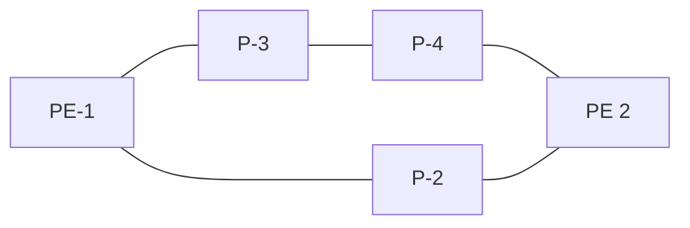

* BGP

26255

3HE 22247 AAAB TQZZA **© 2026 Nokia.** 138
Use subject to Terms available at: www.nokia.com/terms.

Advanced Configuration Guide Release 26.7
BGP Fast Reroute

Figure 24: Edge PIC

illustration: Network topology diagram showing PE-1, PE-2, and PE-3 routers within AS1 and AS2, with BGP connections indicated by dashed lines and a failure marked with an X.

26256

Core PIC is enabled by default and cannot be disabled. Therefore, this chapter describes the use of Edge PIC.

BGP FRR is supported for different BGP address families in the default network instance or within a specific IP-VRF network instance. This chapter focuses on the IPv4 address family within the default network instance.

BGP add-paths can be used to allow BGP to maintain multiple paths through an autonomous system.

Convergence goes through several phases, which also apply to BGP:

• detect the network failure

• distribute updated routing information, and update the network topology

• calculate new routes, and optionally change next-hops

• update the forwarding plane

Several mechanisms are available to enhance BGP network convergence, such as Bidirectional Forwarding Detection (BFD) and Minimum Router Advertisement Interval (MRAI).

## **8.3 Configuration**

The example topology used in this chapter is shown in Figure 25: BGP FRR topology, and has the following characteristics:

• IBGP sessions are established between AS 65537 routers using RR-6 as route reflector (RR) with P-2, P-3, P-4, and PE-5 as RR clients.

• EBGP sessions are established between P-2 and P-3 of AS 65537 and PE-1 of AS 65536.

3HE 22247 AAAB TQZZA
**© 2026 Nokia.**
139
Use subject to Terms available at: [www.nokia.com/terms](http://www.nokia.com/terms).

Advanced Configuration Guide Release 26.7 BGP Fast Reroute

• PE-1 advertises a BGP route for prefix 172.16.1.0/24 with community "1:0" to P-2 and P-3.

• P-2 changes the local preference to 150 for the route advertised to RR-6. Import policy rp-import-LP150 on P-2 accepts routes with community "1:0" and modifies the local preference to 150; import policy rp-comm-1:0 on P-3 accepts routes with community "1:0" without modifications.

• PE-5 advertises a BGP route for prefix 172.16.5.0/24 with community "1:0" to RR-6. This route is re-advertised to the other RR clients and eventually, by P-2 and P-3 to PE-1.

Figure 25: BGP FRR topology

illustration: BGP FRR topology diagram

26257

These characteristics enforce traffic for destination 172.16.1.0/24 to leave AS 65537 via P-2. P-2 (and also PE-5) learns the destination and the local preference via RR-6. But because P-3's own local preference is lower (default LP=100), it stops advertising prefix 172.16.1.0/24 toward RR-6, so that P-4 is aware of the path via P-2 only.

The objective is for P-4 to receive multiple alternate paths for the 172.16.1.0/24 prefix with redundant next-hops, to provide for faster convergence under failure. BGP must have at least one valid alternate path candidate with a different next-hop.

BGP add-paths is needed if the topology would otherwise hide alternate paths, for example, nodes only learn one path because the upstream only advertises one path. The BGP add-paths feature is required in scenarios with route reflectors.

In this example, multiple exit paths for prefix 172.16.1.0/24 leaving AS 65537 are available, improving the convergence time on the IBGP peers because they only need to update their FIBs if they lose the primary route.

## 8.3.1 BGP add-paths

P-2, P-3, P-4 and RR-6 are configured with the BGP add-paths feature. PE-5 does not require the add-paths feature, because the alternate path to 172.16.1.0/24 starts in P-4.

`# on P-2, P-3, P-4, RR-6:`

3HE 22247 AAAB TQZZA © 2026 Nokia. 140
Use subject to Terms available at: [www.nokia.com/terms](http://www.nokia.com/terms).

Advanced Configuration Guide Release 26.7

Advanced Configuration Guide Release 26.7 BGP Fast Reroute

```
network-instance default {
      protocols {
      bgp {
               admin-state enable
               autonomous-system 65537
               router-id 192.0.2.6
               best-path-selection {
                 advertise-inactive true
               }
               afi-safi ipv4-unicast {
                 admin-state enable
               }
               group grp-IBGP {
                 peer-as 65537
                 afi-safi ipv4-unicast {
                    **add-paths {**
                     **receive true**
                     **send true**
                     **send-max 2**
                    }
                 }
                 route-reflector {
                    client true
                    cluster-id 192.0.2.6
                 }
               }
               neighbor 192.0.2.2 {
                 peer-group grp-IBGP
               }
               neighbor 192.0.2.3 {
                 peer-group grp-IBGP
               }
               neighbor 192.0.2.4 {
                 peer-group grp-IBGP
               }
               neighbor 192.0.2.5 {
                 peer-group grp-IBGP
               }
```

The default behavior of a route reflector is to only consider the best path. By enabling the add-paths feature on RR-6, multiple paths are considered.

Both P-2 and P-3 advertise route 172.16.1.0/24 to RR-6, as follows:

<table>
<thead>
<tr><th>Network</th><th>**Path-id**</th><th>Next Hop</th><th>MED</th><th>**LocPref**</th><th>AsPath</th><th>Origin</th></tr>
</thead>
<tbody>
</tbody>
</table>


</page_footer>

<page_footer>3HE 22247 AAAB TQZZA © **2026 Nokia.** 142
Use subject to Terms available at: [www.nokia.com/terms](http://www.nokia.com/terms).

Advanced Configuration Guide Release 26.7 BGP Fast Reroute

```
| 172.16.1.0/24 1 192.0.2.2 - **150** [65536] i |
+----------------------------------------------------------------------------------------------+
-----------------------------------------------------------------------------------------------
1 advertised BGP routes
-----------------------------------------------------------------------------------------------
```

```
--{ + running }--[ ]--
A:admin@P-3# show network-instance default protocols bgp neighbor 192.0.2.6 advertised-routes ipv4
-----------------------------------------------------------------------------------------------
Peer : 192.0.2.6, remote AS: 65537, local AS: 65537
Type : static
Description : None
Group : grp-IBGP
-----------------------------------------------------------------------------------------------
Origin codes: i=IGP, e=EGP, ?=incomplete
+----------------------------------------------------------------------------------------------+
| Network **Path-id** Next Hop MED **LocPref** AsPath Origin |
+==============================================================================================+
| 172.16.1.0/24 1 192.0.2.3 - **100** [65536] i |
+----------------------------------------------------------------------------------------------+
-----------------------------------------------------------------------------------------------
1 advertised BGP routes
-----------------------------------------------------------------------------------------------
```

For more examples of the BGP add-paths feature, see the BGP Add-Paths chapter.

## 8.3.2 Backup paths

P-4 is the place in the topology where an alternate path is created. The data plane part of the Edge PIC configuration is performed by configuring **backup-paths** for **afi-safi ipv4-unicast** in the **bgp** context. In the following, **backup-paths** are considered for the IPv4 address family only, but the IPv6, label-IPv4, and label- IPv6 address families are allowed too.

```
# on PE-1, P-4:
enter candidate
    network-instance default {
          protocols {
              bgp {
                   **afi-safi ipv4-unicast** {
                        admin-state enable
                        **ipv4-unicast** {
                           **backup-paths** {
                                 **install true**
                           }
                        }
```

3HE 22247 AAAB TQZZA 143 **© 2026 Nokia.**
Use subject to Terms available at: [www.nokia.com/terms](http://www.nokia.com/terms).

Advanced Configuration Guide Release 26.7 BGP Fast Reroute

In this way, BGP considers all alternate paths which are present through the BGP add-paths feature. The BGP configuration on P-4 is as follows:

```
# on P-4:
enter candidate
 network-instance default {
   protocols {
           bgp {
               admin-state enable
               autonomous-system 65537
               router-id 192.0.2.4
               **afi-safi ipv4-unicast {**
                    admin-state enable
                    **ipv4-unicast {**
                       **backup-paths {**
                         **install true**
                       }
                    }
               }
               group grp-IBGP {
                    peer-as 65537
                    **afi-safi ipv4-unicast {**
                       **add-paths {**
                         **receive true**
                         **send true**
                         **send-max 2**
                       }
                    }
               }
               neighbor 192.0.2.6 {
                    peer-group grp-IBGP
               }
```

In the default BGP behavior, without the **backup-paths install true** configuration, two BGP routes exist. Both routes are valid, but only the first one is the best path, as follows:

```
--{ + running }--[  ]--
A:admin@P-4# show network-instance default protocols bgp routes ipv4 prefix 172.16.1.0/24
-----------------------------------------------------------------------------------------
Show report for the BGP routes to network "172.16.1.0/24" network-instance "default"
-----------------------------------------------------------------------------------------
Network: 172.16.1.0/24
Received Paths: 2
 Path 1: <**Best**,Valid,**Used**,>
  Route source      : neighbor 192.0.2.6
  Route Preference: MED is -, LocalPref is 150
  BGP next-hop      : 192.0.2.2
  Path              : i [65536]
  Communities       : 1:0
 Path 2: <Valid,>
  Route source      : neighbor 192.0.2.6
  Route Preference: MED is -, LocalPref is 100
  BGP next-hop      : 192.0.2.3
  Path              : i [65536]
  Communities       : 1:0
Path 1 was advertised to:
[ ]
-----------------------------------------------------------------------------------------
```

3HE 22247 AAAB TQZZA 144
**© 2026 Nokia.**
Use subject to Terms available at: [www.nokia.com/terms](http://www.nokia.com/terms).

Advanced Configuration Guide Release 26.7 BGP Fast Reroute

In the routing table, route 172.16.1.0/24 has next hop 192.0.2.2, as follows:

```
--{ + running }--[  ]--
A:admin@P-4# show network-instance default ipv4 route 172.16.1.0/24
=========================================================================================
IPv4-unicast route table for default network-instance
-----------------------------------------------------------------------------------------
Flags: > (best), * (unviable), ! (failed)
   : L (leaked route from another network-instance)
   : B (backup NHG active and displayed)
   : S (statistics supported)
   : D (dynamic LB), R (resilient LB)
-----------------------------------------------------------------------------------------
Prefix              Route Type   Metric  Pref   Flags   Next-Hop(s)
-----------------------------------------------------------------------------------------
172.16.1.0/24       bgp          10      170    >       **192.0.2.2(route:isis)**
```

With the **backup-paths install true** configuration, both BGP routes are valid and used; the first route is the **Best** path, and the second route is explicitly marked to be a **Backup** path, as follows:

```
--{ + running }--[  ]--
A:admin@P-4# show network-instance default protocols bgp routes ipv4 prefix 172.16.1.0/24
-----------------------------------------------------------------------------------------
Show report for the BGP routes to network "172.16.1.0/24" network-instance "default"
-----------------------------------------------------------------------------------------
Network: 172.16.1.0/24
Received Paths: 2
 Path 1: <**Best**,Valid,**Used**,>
  Route source      : neighbor 192.0.2.6
  Route Preference: MED is -, LocalPref is 150
  BGP next-hop      : 192.0.2.2
  Path              : i [65536]
  Communities       : 1:0
 Path 2: <Valid,**Used**,**Backup**,>
  Route source      : neighbor 192.0.2.6
  Route Preference: MED is -, LocalPref is 100
  BGP next-hop      : 192.0.2.3
  Path              : i [65536]
  Communities       : 1:0
Path 1 was advertised to:
[ ]
-----------------------------------------------------------------------------------------
```

In the routing table, route 172.16.1.0/24 has next-hop 192.0.2.2 for the best path and next-hop 192.0.2.3 for the backup:.

```
--{ + running }--[  ]--
A:admin@P-4# show network-instance default ipv4 route 172.16.1.0/24
=============================================================================================
IPv4-unicast route table for default network-instance
---------------------------------------------------------------------------------------------
Flags: > (best), * (unviable), ! (failed)
   : L (leaked route from another network-instance)
   : B (backup NHG active and displayed)
   : S (statistics supported)
   : D (dynamic LB), R (resilient LB)
---------------------------------------------------------------------------------------------
Prefix              Route Type   Metric  Pref   Flags   Next-Hop(s)
---------------------------------------------------------------------------------------------
172.16.1.0/24       bgp          10      170    >       **192.0.2.2(route:isis)**
```

3HE 22247 AAAB TQZZA    **© 2026 Nokia.**    145
                        Use subject to Terms available at: [www.nokia.com/terms](http://www.nokia.com/terms).

Advanced Configuration Guide Release 26.7    BGP Fast Reroute

**backup:192.0.2.3(route:isis)**

The detailed route information for prefix 172.16.1.0/24 includes next-hop-group 93479432 with primary next-hop 934794322 with IP address 192.0.2.2 and backup next-hop 934794321 with IP address 192.0.2.3, as follows:

```
--{ + running }--[ ]--
A:admin@P-4# show / network-instance default ipv4 route 172.16.1.0/24 detail
============================================================================================
Prefix: 172.16.1.0/24
--------------------------------------------------------------------------------------------
Active                  : yes
Route Type              : bgp
Route Owner             : bgp_mgr, 2026-06-15T09:32:24.389Z (56 seconds ago)
Id                      : 0
Leakable                : no
Leaked                  : no
Metric                  : 10
Preference              : 170
Internal Tags           : none
Dynamic LB              : no
Resilient Hash          : no
FIB Suppressed          : no
FIB Failed              : no
**Next-Hop-Group**          : 934794321
  Net-Instance          : default
  FIB Failed            : no
  Primary NH Count      : 1
  Backup NH Count       : 1
  **Primary NH**            : 934794322
       LB Weight        : 1
       Type             : indirect
       IP Address       : 192.0.2.2
       Resolved         : yes
       Resolving Route  : 192.0.2.2/32(isis)
  **Backup NH**             : 934794321
       Type             : indirect
       IP Address       : 192.0.2.3
       Resolved         : yes
       Resolving Route  : 192.0.2.3/32(isis)
```

The active and standby selection is also visible in the following command that shows what is actually programmed in the FIB for next-hop-group 934794321:

```
--{ + running }--[ ]--
A:admin@P-4# info from state with-context / network-instance default route-table next-hop-group 934794321
      network-instance default {
          route-table {
               **next-hop-group 934794321 {**
                     backup-next-hop-group 0
                     backup-active false
                     **fib-programming {**
                      last-successful-operation-type add
                      last-successful-operation-timestamp "2026-06-15T09:32:24.390Z (2 minutes ago)"
                      pending-operation-type none
                      last-failed-operation-type none
                     }
                     **next-hop 0 {**
                      next-hop 934794322
                      resolved true
```

3HE 22247 AAAB TQZZA    **© 2026 Nokia.**    146
Use subject to Terms available at: [www.nokia.com/terms](http://www.nokia.com/terms).

Advanced Configuration Guide Release 26.7 BGP Fast Reroute

```
resource-allocation-failed false
}
backup-next-hop 0 {
    next-hop 934794321
    resolved true
    resource-allocation-failed false
}
}
}
}
```

In summary, two paths are available out of P-4 and leading to 172.16.1.0/24 in the remote AS, but only one is installed in the forwarding plane. The active route is P-4-P-2-PE-1; the backup route is P-4-P-3-PE-1. A **traceroute** command confirms the active path, as follows:

```
--{ + running }--[ ]--
A:admin@PE-5# traceroute network-instance default 172.16.1.1 -n
Using network instance default
traceroute to 172.16.1.1 (172.16.1.1), 30 hops max, 60 byte packets
 1 192.168.45.1 2.141 ms 2.119 ms 2.105 ms
 2 **192.168.24.1** 3.054 ms 3.036 ms 3.024 ms # on P-2
 3 172.16.1.1 4.017 ms 4.008 ms 3.994 ms
```

## 8.3.3 Faster convergence through BFD

As already described, BFD can help speed up BGP convergence, mainly when detecting network failures. In the following, BFD is enabled on the EBGP sessions and on the IS-IS protocol.

The BFD parameters are defined at subinterface level, enabling BFD for a protocol is done in the protocol context. Because PE-1 only has EBFD sessions toward P-2 and P-3, it is enabled at the BGP global level, but it can also be enabled at the BGP group or neighbor level.

```
# on PE-1:
enter candidate
  bfd {
   subinterface ethernet-1/2.1 {
        admin-state enable
   }
   subinterface ethernet-1/3.1 {
        admin-state enable
   }
  }
  network-instance default {
   protocols {
          bgp {
               failure-detection {
                    enable-bfd true
               }
```

Because the BFD configuration for P-2 and P-3 is similar, it is only shown for P-2, as follows:

```
# for P-2:
enter candidate
  bfd {
   subinterface ethernet-1/1.1 {
          admin-state enable
   }
   subinterface ethernet-1/4.1 {
```

3HE 22247 AAAB TQZZA 147
**© 2026 Nokia.**
Use subject to Terms available at: [www.nokia.com/terms](http://www.nokia.com/terms).

Advanced Configuration Guide Release 26.7

Advanced Configuration Guide Release 26.7 BGP Fast Reroute

### 8.3.5 Switchover

To demonstrate a switchover scenario, a failure is introduced by disabling subinterface ethernet-1/2.1 on PE-1, as follows:

```
# on PE-1:
enter candidate
   interface ethernet-1/2 {
       subinterface 1 {
           admin-state disable
```

The path through the network is PE-5-P-4-P-3-PE-1, as follows:

```
--{ + running }--[  ]--
A:admin@PE-5# traceroute network-instance default 172.16.1.1 -n
Using network instance default
traceroute to 172.16.1.1 (172.16.1.1), 30 hops max, 60 byte packets
 1 192.168.45.1 2.796 ms     2.766 ms  2.750 ms
 2 **192.168.34.1**    2.676 ms  2.674 ms  2.662 ms              # on P-3
 3 172.16.1.1 3.640 ms       3.636 ms  3.622 ms
```

On P-4, traffic is now diverted to P-3, and the BGP routes are as follows:

```
--{ + running }--[  ]--
A:admin@P-4# show network-instance default protocols bgp routes ipv4 prefix 172.16.1.0/24
-----------------------------------------------------------------------------------------
Show report for the BGP routes to network "172.16.1.0/24" network-instance "default"
-----------------------------------------------------------------------------------------
Network: 172.16.1.0/24
Received Paths: 1
 Path 1: <Best,Valid,Used,>
  Route source      : neighbor 192.0.2.6
  Route Preference: MED is -, LocalPref is 100
  **BGP next-hop**      : **192.0.2.3**
  Path              : i [65536]
  Communities       : 1:0
Path 1 was advertised to:
[ ]
-----------------------------------------------------------------------------------------
```

The route table is as follows:

<table>
<thead>
<tr><th>Prefix</th><th>Route Type</th><th>Metric</th><th>Pref</th><th>Flags</th><th>Next-Hop(s)</th></tr>
</thead>
<tbody>
<tr><td>172.16.1.0/24</td><td>bgp</td><td>10</td><td>170</td><td>></td><td>192.0.2.3(route:isis)</td></tr>
</tbody>
</table>

3HE 22247 AAAB TQZZA    **© 2026 Nokia.**    149
                        Use subject to Terms available at: [www.nokia.com/terms](http://www.nokia.com/terms).

Advanced Configuration Guide Release 26.7    BGP Fast Reroute

The forwarding plane is reprogrammed to send traffic for the 172.16.1.0/24 subnet to P-3, as follows:

```
--{ + running }--[    ]--
 A:admin@P-4# show network-instance default ipv4 route 172.16.1.0/24 detail
 =========================================================================================
 Prefix: 172.16.1.0/24
 -----------------------------------------------------------------------------------------
 Active                  : yes
 Route Type              : bgp
 Route Owner             : bgp_mgr, 2026-06-15T09:38:46.662Z (33 seconds ago)
 Id                      : 0
 Leakable                : no
 Leaked                  : no
 Metric                  : 10
 Preference              : 170
 Internal Tags           : none
 Dynamic LB              : no
 Resilient Hash          : no
 FIB Suppressed          : no
 FIB Failed              : no
 Next-Hop-Group          : 934794322
  Net-Instance           : default
  FIB Failed             : no
  Primary NH Count       : 1
  Backup NH Count        : 0
  Primary NH             : 934794321
        LB Weight        : 1
        Type             : indirect
        IP Address       : 192.0.2.3
        Resolved         : yes
        Resolving Route  : 192.0.2.3/32(isis)
```

Bringing subinterface ethernet-1/2.1 on PE-1 up again results in the path PE-5-P-4-P-2-PE-1 being reactivated. Switchback takes longer, because the external BGP session needs to be re-established, and routes have to be relearned.

## 8.4 Conclusion

BGP FRR provides ISPs the means to offer backup paths with fast switchover times when used in combination with short failure detection times and short advertisement intervals. By guaranteeing service in case of network failures, ISPs can provide enhanced service offerings to their customers.

3HE 22247 AAAB TQZZA    **© 2026 Nokia.**    150
                        Use subject to Terms available at: [www.nokia.com/terms](http://www.nokia.com/terms).

Advanced Configuration Guide Release 26.7 BGP Replace Peer Autonomous System

# 9 BGP Replace Peer Autonomous System

This chapter describes BGP replace peer AS.

Topics in this chapter include:

* Applicability

* Overview

* Configuration

* Conclusion

## 9.1 Applicability

The CLI in the latest update of this chapter corresponds to SR Linux Release 26.3.1.

## 9.2 Overview

In some network designs, the same Autonomous System Number (ASN) is reused at different sites or regions that are interconnected by a common service or backbone. This can occur when an enterprise buys an IP-VRF service to connect various sites that, in the past, were operated as a single ASN. This can also occur when a service provider builds a common backbone to interconnect regional networks that, for simplicity, reuse the same ASN.

This type of interconnectivity creates a problem because a BGP route originated by one of the sites and propagated through the backbone appears as an AS path loop when advertised into another site. Routes with an AS loop are invalid; Figure 26: PE-2 detects AS path loop and advertises invalid route to PE-3 shows an example. PE-2 in AS 64501 receives a BGP route from PE-1 in AS 64496. PE-2 detects that the ASN 64496 in the BGP AS path attribute equals the ASN of its peer PE-3, so it detects an AS loop and advertises this route to PE-3 as an invalid route.

3HE 22247 AAAB TQZZA **© 2026 Nokia.** 151
Use subject to Terms available at: [www.nokia.com/terms](http://www.nokia.com/terms).

Advanced Configuration Guide Release 26.7

BGP Replace Peer Autonomous System

Figure 26: PE-2 detects AS path loop and advertises invalid route to PE-3

engineering_drawing: PE-1, PE-2, and PE-3 network diagram

36187

There are different solutions to this problem:

• Use different ASNs per site or region. From an operational point of view, this is a major change in an existing network.

• Disable AS path loop detection within each region. This is not encouraged in case you have external peering to the outside world. Any loops formed between these paths would be undetected.

• Configure the default network instance or the IP-VRF instance with BGP AS path option **replace-peer-as**.

Most operators prefer to use BGP AS path option **replace-peer-as**. A router configured to use **replace-peer-as** on a BGP session monitors outbound routes toward that peer. Whenever a route has the ASN of the peer in its AS path, all occurrences of this ASN are replaced by the local ASN of the router. Figure 27: PE-2 replaces peer ASN in the AS path with the local ASN shows that PE-2 has replaced ASN 64496 in the AS path attribute of the BGP route toward PE-3 with its own ASN 64501.

3HE 22247 AAAB TQZZA

**© 2026 Nokia.**

152

Use subject to Terms available at: [www.nokia.com/terms](http://www.nokia.com/terms).

Advanced Configuration Guide Release 26.7 BGP Replace Peer Autonomous System

Figure 27: PE-2 replaces peer ASN in the AS path with the local ASN

flow_chart: PE-1, PE-2, and PE-3 network diagram

The BGP AS path option **replace-peer-as** applies to all supported address families.

The **replace-peer-as** command is configurable in the BGP group or neighbor context, both for the default network instance and the IP-VRFs.

In SRL, AS path loop detection is enabled by default. Several actions can be configured when detecting an AS path loop, but those actions are out of the scope of this chapter.

## 9.3 Configuration

Figure 28: Example topology shows the example topology with five routers: PE-1, PE-3, and PE-5 in AS 64496, PE-2 in AS 64501, and PE-4 in AS 64502.

Figure 28: Example topology

flow_chart: Example topology network diagram

The initial configuration includes:

• Cards, MDAs, ports

3HE 22247 AAAB TQZZA **© 2026 Nokia.** 153
Use subject to Terms available at: www.nokia.com/terms.

Advanced Configuration Guide Release 26.7 BGP Replace Peer Autonomous System

• Router interfaces

• EBGP sessions between the nodes

The initial BGP configuration on PE-2 is as follows.

```
# on PE-2:
 routing-policy {
   community-set scs-1:1 {
          member [
           1:1
          ]
   }
   policy rp-1:1 {
          default-action {
           policy-result reject
          }
          statement stmt-10 {
           match {
                  bgp {
                   community-set scs-1:1
                  }
           }
           action {
                  policy-result accept
           }
          }
   }
  }
  network-instance default {
   admin-state enable
   router-id 192.0.2.2
   interface int-PE-2-PE-1 {
          interface-ref {
           interface ethernet-1/1
           subinterface 1
          }
   }
   interface int-PE-2-PE-3 {
          interface-ref {
           interface ethernet-1/3
           subinterface 1
          }
   }
   interface system0.0 {
   }
   protocols {
          bgp {
           admin-state enable
           autonomous-system 64501
           router-id 192.0.2.2
           afi-safi ipv4-unicast {
                  admin-state enable
           }
           route-advertisement {
                  rapid-withdrawal true
           }
           group EBGP {
                  admin-state enable
                  export-policy [
                   rp-1:1
                  ]
                  import-policy [
                   rp-1:1
```

3HE 22247 AAAB TQZZA **© 2026 Nokia.** 154
Use subject to Terms available at: [www.nokia.com/terms](http://www.nokia.com/terms).

Advanced Configuration Guide Release 26.7    BGP Replace Peer Autonomous System

```
]
}
neighbor 192.168.12.1 {
         admin-state enable
         peer-as 64496
         peer-group EBGP
}
neighbor 192.168.23.2 {
         admin-state enable
         peer-as 64496
         peer-group EBGP
}
}
}
```

The BGP configuration on the other nodes is similar.

In this chapter, two examples are shown:

• BGP **replace-peer-as** in the default network instance

• BGP **replace-peer-as** in an IP-VRF

## 9.3.1 Default: peer AS is not replaced in the default network instance

The default BGP AS path options are the following:

```
--{ + running }--[ ]--
A:admin@PE-2# info from state network-instance default protocols bgp group EBGP as-path-options
  allow-own-as 0
  **replace-peer-as false**
  remove-private-as {
   mode disabled
   leading-only false
   ignore-peer-as false
  }
```

PE-1 exports BGP route 10.1.0.0/16, defined as a loopback interface in the default routing instance. The configuration is as follows:

```
# on PE-1:
routing-policy {
   community-set scs-1:1 {
          member [
           1:1
          ]
   }
   prefix-set ps-10.1.0.0 {
          prefix 10.1.0.0/16 mask-length-range 16..32 {
          }
   }
   policy rp-export-10.1.0.0 {
          default-action {
           policy-result reject
          }
          statement stmt-10 {
           match {
                    prefix {
                       prefix-set ps-10.1.0.0
                    }
           }
```

3HE 22247 AAAB TQZZA    **© 2026 Nokia.**    155
Use subject to Terms available at: [www.nokia.com/terms](http://www.nokia.com/terms).

Advanced Configuration Guide Release 26.7    BGP Replace Peer Autonomous System

```
action {
         policy-result accept
         bgp {
             communities {
                 add scs-1:1
             }
         }
}
}
}
policy rp-1:1 {
 default-action {
  policy-result reject
 }
 statement stmt-10 {
  match {
           bgp {
               community-set scs-1:1
           }
  }
  action {
           policy-result accept
  }
 }
}
}
network-instance default {
 admin-state enable
 router-id 192.0.2.1
 interface int-PE-1-PE-2 {
  interface-ref {
   interface ethernet-1/2
   subinterface 1
  }
 }
 interface loop0 {
  interface-ref {
   interface lo0
   subinterface 0
  }
 }
 interface system0.0 {
 }
 protocols {
  bgp {
   admin-state enable
   autonomous-system 64496
   router-id 192.0.2.1
   afi-safi ipv4-unicast {
            admin-state enable
   }
   route-advertisement {
            rapid-withdrawal true
   }
   group EBGP {
            admin-state enable
            export-policy [
                rp-export-10.1.0.0
            ]
            import-policy [
                rp-1:1
            ]
   }
   neighbor 192.168.12.2 {
```


SPACER TEXT

3HE 22247 AAAB TQZZA    **© 2026 Nokia.**    156
                        Use subject to Terms available at: [www.nokia.com/terms](http://www.nokia.com/terms).

Advanced Configuration Guide Release 26.7

Advanced Configuration Guide Release 26.7    BGP Replace Peer Autonomous System

```
10.1.0.0/16 0 192.168.23.1 - [64501, **64496**] i
10.1.0.1/32 0 192.168.23.1 - [64501, **64496**] i
2 advertised BGP routes
```

The following command on PE-3 shows that path 1 is not best, valid, and used as on PE-2.

```
--{ + running }--[ ]-- A:admin@PE-3# show / network-instance default protocols bgp routes ipv4 prefix 10.1.0.0/16
Show report for the BGP routes to network "10.1.0.0/16" network-instance "default"
Network: 10.1.0.0/16
Received Paths: 1
**Path 1: <>**
    Route source          : neighbor 192.168.23.1
    Route Preference: MED is -, No LocalPref
    BGP next-hop          : 192.168.23.1
    Path                  : i [64501, 64496]
    Communities           : 1:1
**Path 0 was advertised to:**
[ ]
```

The reason why this route is invalid, is an AS loop, as follows:

```
--{ + running }--[ ]-- A:admin@PE-3# show / network-instance default protocols bgp routes ipv4 prefix 10.1.0.0/16 detail | grep Invalid
    Invalid Reason        : **As_Loop**
```

PE-3 does not advertise any routes to PE-4:

```
--{ + running }--[ ]-- A:admin@PE-3# show network-instance default protocols bgp neighbor 192.168.34.2 advertised-routes ipv4
Peer         : 192.168.34.2, remote AS: 64502, local AS: 64496
Type         : static
Description : None
Group        : EBGP
Origin codes: i=IGP, e=EGP, ?=incomplete
```

3HE 22247 AAAB TQZZA    **© 2026 Nokia.**    158
Use subject to Terms available at: [www.nokia.com/terms](http://www.nokia.com/terms).

Advanced Configuration Guide Release 26.7 BGP Replace Peer Autonomous System

`0 advertised BGP routes ----------------------------------------------------------------------------------------------- ------------------------------------------------------`

Figure 29: PE-2 detects AS path loop and advertises invalid route to PE-3 shows the BGP routes advertised by PE-1 and PE-2 with the corresponding AS path.

Figure 29: PE-2 detects AS path loop and advertises invalid route to PE-3

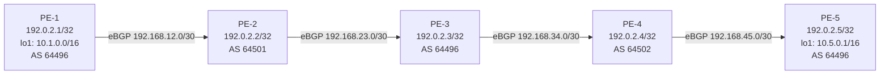

36190 36100 36190

## **9.3.2 Replace BGP peer AS in default network instance on PE-2 and PE-4**

On PE-2 and PE-4, the following command configures BGP AS path option **replace-peer-as true** in the group "EBGP":

```
# on PE-2, PE-4:
 network-instance default {
        protocols {
               bgp {
                group "EBGP" {
                    as-path-options {
                               replace-peer-as true
                    }
```

With this configuration, BGP AS path options are as follows:

```
--{ + running }--[ ]-- A:admin@PE-2# info from state network-instance default protocols bgp group EBGP as-path-options
 allow-own-as 0
 replace-peer-as true
 remove-private-as {
        mode disabled
        leading-only false
        ignore-peer-as false
 }
```

PE-2 receives the route from PE-1 with ASN 64496, as follows:

```
--{ + running }--[ ]--
```

3HE 22247 AAAB TQZZA **© 2026 Nokia.** 159
Use subject to Terms available at: www.nokia.com/terms.

Advanced Configuration Guide Release 26.7    BGP Replace Peer Autonomous System

```
A:admin@PE-2# show / network-instance default protocols bgp routes ipv4 prefix 10.1.0.0/16
--------------------------------------------------------------------------------------------
Show report for the BGP routes to network "10.1.0.0/16" network-instance "default"
--------------------------------------------------------------------------------------------
Network: 10.1.0.0/16
Received Paths: 1
Path 1: <**Best,Valid,Used**,>
  Route source      : neighbor 192.168.12.1
  Route Preference: MED is -, No LocalPref
  BGP next-hop      : 192.168.12.1
  Path              : i [**64496**]
  Communities       : 1:1
Path 1 was advertised to:
[ 192.168.23.2 ]
--------------------------------------------------------------------------------------------
```

Instead of advertising a route with an AS loop, PE-2 replaces ASN **64496** in the AS path attribute with its own ASN **64501**, so PE-3 receives the following valid route:

```
--{ + running }--[  ]--
A:admin@PE-3# show / network-instance default protocols bgp routes ipv4 prefix 10.1.0.0/16
--------------------------------------------------------------------------------------------
Show report for the BGP routes to network "10.1.0.0/16" network-instance "default"
--------------------------------------------------------------------------------------------
Network: 10.1.0.0/16
Received Paths: 1
Path 1: <**Best,Valid,Used**,>
  Route source      : neighbor 192.168.23.1
  Route Preference: MED is -, No LocalPref
  BGP next-hop      : 192.168.23.1
  Path              : i [**64501**, **64501**]
  Communities       : 1:1
Path 1 was advertised to:
[ 192.168.34.2 ]
--------------------------------------------------------------------------------------------
```

PE-4 receives the following BGP route from PE-3:

```
--{ + running }--[  ]--
A:admin@PE-4# show / network-instance default protocols bgp routes ipv4 prefix 10.1.0.0/16
-----------------------------------------------------------------------------------------------
--
Show report for the BGP routes to network "10.1.0.0/16" network-instance "default"
-----------------------------------------------------------------------------------------------
--
Network: 10.1.0.0/16
Received Paths: 1
Path 1: <**Best,Valid,Used**,>
  Route source      : neighbor 192.168.34.1
  Route Preference: MED is -, No LocalPref
  BGP next-hop      : 192.168.34.1
  Path              : i [**64496**, **64501**, **64501**]
  Communities       : 1:1
Path 1 was advertised to:
[ 192.168.45.2 ]
-----------------------------------------------------------------------------------------------
--
```

3HE 22247 AAAB TQZZA    **© 2026 Nokia.**    160
                        Use subject to Terms available at: [www.nokia.com/terms](http://www.nokia.com/terms).

Advanced Configuration Guide Release 26.7    BGP Replace Peer Autonomous System

PE-4 detects an AS loop when advertising this route to its peer PE-5 in AS 64496, so it replaces ASN 64496 in the AS path with its own ASN 64502. PE-5 receives the following valid route from PE-4:

```
--{ + running }--[ ]--
A:admin@PE-5# show / network-instance default protocols bgp routes ipv4 prefix 10.1.0.0/16
-----------------------------------------------------------------------------------------------
--
Show report for the BGP routes to network "10.1.0.0/16" network-instance "default"
-----------------------------------------------------------------------------------------------
--
Network: 10.1.0.0/16
Received Paths: 1
Path 1: <**Best**,**Valid**,**Used**,>
  Route source      : neighbor 192.168.45.1
  Route Preference: MED is -, No LocalPref
  BGP next-hop      : 192.168.45.1
  Path              : i [**64502**, **64502**, 64501, 64501]
  Communities       : 1:1
Path 1 was advertised to:
[ ]
-----------------------------------------------------------------------------------------------
--
```

Figure 30: No AS loop when peer AS is replaced for group "EBGP" on PE-2 and PE-4 shows the BGP routes advertised by the PEs with the corresponding AS path.

Figure 30: No AS loop when peer AS is replaced for group "EBGP" on PE-2 and PE-4

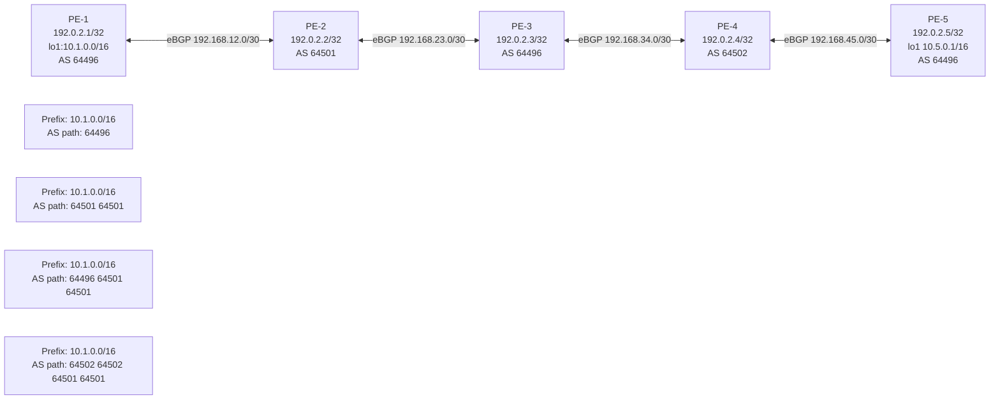

## 9.3.3 Default: no peer AS is replaced in IP-VRF

Figure 31: Example topology with IP-VRF-1 on all PEs shows the example topology with IP-VRF-1 configured on all PEs.

3HE 22247 AAAB TQZZA    **© 2026 Nokia.**    161
Use subject to Terms available at: www.nokia.com/terms.

<layout_regions> xcvc wkch </layout_regions>
Advanced Configuration Guide Release 26.7    BGP Replace Peer Autonomous System

Figure 31: Example topology with IP-VRF-1 on all PEs

diagram: Example topology with IP-VRF-1 on all PEs

36192

On PE-2, IP-VRF-1 is configured as follows. By default, **replace-peer-as** is not configured for any BGP group or BGP neighbor.

```
# on PE-2:
network-instance "IP-VRF-1" {
        type ip-vrf
        admin-state enable
        interface int-VRF1onPE-2-VRF1onPE-1 {
                 interface-ref {
                       interface ethernet-1/1
                       subinterface 2
                 }
        }
        interface int-VRF1onPE-2-VRF1onPE-3 {
                 interface-ref {
                       interface ethernet-1/3
                       subinterface 2
                 }
        }
        protocols {
                 bgp {
                       admin-state enable
                       autonomous-system 64503
                       router-id 172.31.0.2
                       afi-safi ipv4-unicast {
                               admin-state enable
                       }
                       group grp-EBGP-1 {
                               export-policy [
                               rp-1:1
                               ]
                               import-policy [
                               rp-1:1
                               ]
                       }
                       neighbor 172.16.12.1 {
                               peer-as 64497
                               peer-group grp-EBGP-1
                       }
                       neighbor 172.16.23.2 {
                               peer-as 64497
                               peer-group grp-EBGP-1
                       }
                 }
        }
}
```

<layout_regions> vdam jvjh muin jhed </layout_regions>
3HE 22247 AAAB TQZZA    **© 2026 Nokia.**    162
                        Use subject to Terms available at: www.nokia.com/terms.

Advanced Configuration Guide Release 26.7 BGP Replace Peer Autonomous System

}

The service configuration on the other nodes is similar. The IP addresses and ASNs are shown in Figure 31: Example topology with IP-VRF-1 on all PEs.

IP-VRF-1 on PE-1 exports BGP route 172.31.0.1/32, defined as a loopback interface within the IP-VRF-1 routing instance. The configuration is as follows:

```
# on PE-1:
routing-policy {
  prefix-set ps-172.31.0.0 {
          prefix 172.31.0.0/16 mask-length-range 16..32 {
          }
  }
  community-set scs-1:1 {
          member [
           1:1
          ]
  }
  policy rp-export-172.31.0.0 {
          default-action {
           policy-result reject
          }
          statement stmt-10 {
           match {
               prefix {
                  prefix-set ps-172.31.0.0
               }
           }
           action {
               policy-result accept
               bgp {
                  communities {
                          add scs-1:1
                  }
               }
           }
          }
  }
 }
 network-instance "IP-VRF-1" {
  type ip-vrf
  admin-state enable
  interface int-VRF1onPE-1-VRF1onPE-2 {
          interface-ref {
           interface ethernet-1/2
           subinterface 2
          }
  }
  interface loop1-172.31.0.1 {
          interface-ref {
           interface lo0
           subinterface 1
          }
  }
  protocols {
          bgp {
           admin-state enable
           autonomous-system 64497
           router-id 172.31.0.1
           afi-safi ipv4-unicast {
               admin-state enable
```

3HE 22247 AAAB TQZZA **© 2026 Nokia.** 163
Use subject to Terms available at: [www.nokia.com/terms](http://www.nokia.com/terms).

Advanced Configuration Guide Release 26.7    BGP Replace Peer Autonomous System

```
}
group grp-EBGP-1 {
 export-policy [
    rp-export-172.31.0.0
 ]
 import-policy [
    rp-1:1
 ]
}
neighbor 172.16.12.2 {
 peer-as 64503
 peer-group grp-EBGP-1
}
}
```

IP-VRF-1 on PE-1 exports route 172.31.0.1/32 with ASN **64497** to IP-VRF-1 on PE-2. On PE-2, the following route is received in IP-VRF-1:

```
--{ + running }--[ ]--
A:admin@PE-2# show network-instance IP-VRF-1 protocols bgp neighbor 172.16.12.1 received-routes ipv4
-----------------------------------------------------------------------------------------------
------------------------------------
Peer             : 172.16.12.1, remote AS: 64497, local AS: 64503
Type             : static
Description : None
Group            : grp-EBGP-1
-----------------------------------------------------------------------------------------------
------------------------------------
Status codes: u=used, *=valid, >=best, x=stale, b=backup, w=unused-weight-only
Origin codes: i=IGP, e=EGP, ?=incomplete
+----------------------------------------------------------------------------------------------
---------------------------------+
|        Status          Network       Path-id   Next Hop        MED          LocPref
         AsPath         Origin      |
+==============================================================================================
=================================+
|         **u*>**         172.31.0.1/32   0          172.16.12.1     -
   [**64497**]                  i       |
+----------------------------------------------------------------------------------------------
---------------------------------+
-----------------------------------------------------------------------------------------------
------------------------------------
1 received BGP routes : 1 used 1 valid
-----------------------------------------------------------------------------------------------
------------------------------------
```

ASN **64497** equals the peer AS of IP-VRF-1 on PE-3, so IP-VRF-1 on PE-2 detects an AS loop and advertises the following route to IP-VRF-1 on PE-3 as invalid:

```
--{ + running }--[ ]--
A:admin@PE-3# show network-instance IP-VRF-1 protocols bgp routes ipv4 prefix 172.31.0.1/32
-----------------------------------------------------------------------------------------------
--
Show report for the BGP routes to network "172.31.0.1/32" network-instance "IP-VRF-1"
-----------------------------------------------------------------------------------------------
--
Network: 172.31.0.1/32
Received Paths: 1
Path 1: <>
    Route source      : neighbor 172.16.23.1
```

3HE 22247 AAAB TQZZA    **© 2026 Nokia.**    164
                        Use subject to Terms available at: [www.nokia.com/terms](http://www.nokia.com/terms).

Advanced Configuration Guide Release 26.7 BGP Replace Peer Autonomous System

```
Route Preference: MED is -, No LocalPref
BGP next-hop           : 172.16.23.1
Path                   : i [64503, **64497**]
Communities            : 1:1
Path 0 was advertised to:
[ ]
-----------------------------------------------------------------------------------------------
--
```

The reason why this route is invalid on PE-3, is an AS loop:

```
--{ + running }--[ ]--
A:admin@PE-3# show network-instance IP-VRF-1 protocols bgp routes ipv4 prefix 172.31.0.1/32 detail | grep
Invalid
  Invalid Reason            : As_Loop
```

Figure 32: AS loop when BGP **replace-peer-as** is not configured in IP-VRF-1 on PE-2 shows the routes sent by IP-VRF-1 on PE-1 and PE-2. IP-VRF-1 on PE-3 receives an invalid route with an AS loop and it does not re-advertise this route to IP-VRF-1 on PE-4.

Figure 32: AS loop when BGP **replace-peer-as** is not configured in IP-VRF-1 on PE-2

diagram: flow chart of BGP AS loop

36193 36193

## 9.3.4 Replace BGP peer AS in IP-VRF on PE-2 and PE-4

On PE-2 and PE-4, AS path option **replace-peer-as** true is configured in IP-VRF-1 for group "EBGP", as follows:

```
# on PE-2, PE-4:
  network-instance IP-VRF-1 {
          protocols {
                bgp {
                      group grp-EBGP-1 {
                           as-path-options {
                                   replace-peer-as true
```

3HE 22247 AAAB TQZZA © 2026 Nokia. 165
Use subject to Terms available at: www.nokia.com/terms.

<layout_regions> irqi prgt </layout_regions>
Advanced Configuration Guide Release 26.7    BGP Replace Peer Autonomous System

Figure 33: Routes advertised when BGP **replace-peer-as** is enabled in IP-VRF-1 on the PEs shows the routes advertised in IP-VRF-1 on the PEs when BGP **replace-peer-as** is enabled on PE-2 and PE-4.

Figure 33: Routes advertised when BGP **replace-peer-as** is enabled in IP-VRF-1 on the PEs

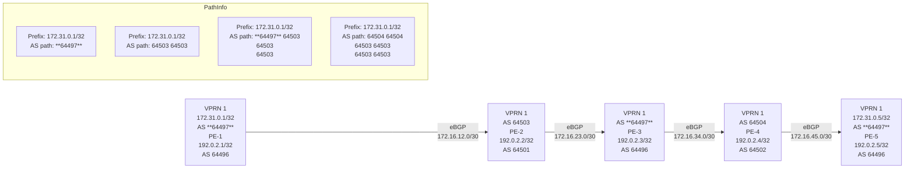
36194

IP-VRF-1 on PE-2 receives the route with ASN **64497**:

```
--{ + running }--[ ]-- A:admin@PE-2# show network-instance IP-VRF-1 protocols bgp routes ipv4 prefix 172.31.0.1/32 
------------------------------------------------------------------------------------------- Show report for the BGP routes to networ ... 72.16.12.1 Route Preference: MED is -, No LocalPref BGP next-hop : 172.16.12.1 Path : i [64497] Communities : 1:1 Path 1 was advertised to: [ 172.16.23.2 ] -------------------------------------------------------------------------------------------
```

IP-VRF-1 on PE-2 replaces the peer AS **64497** with its own ASN 64503 and IP-VRF-1 on PE-3 receives the following valid route:

```
--{ + running }--[ ]-- A:admin@PE-3# show network-instance IP-VRF-1 protocols bgp routes ipv4 prefix 172.31.0.1/32 
------------------------------------------------------------------------------------------- Show report for the BGP routes to network "172.31.0.1/32" network-instance "IP-VRF-1" ------------------------------------------------------------------------------------------- Network: 172.31.0.1/32 Received Paths: 1 Path 1: <Best,Valid,Used,> Route source : neighbor 172.16.23.1
```

<layout_regions> jtbj xzdf ipve odrt </layout_regions>
3HE 22247 AAAB TQZZA    166
© **2026 Nokia.**
Use subject to Terms available at: [www.nokia.com/terms](http://www.nokia.com/terms).

Advanced Configuration Guide Release 26.7    BGP Replace Peer Autonomous System

```
Route Preference: MED is -, No LocalPref
BGP next-hop       : 172.16.23.1
Path               : i [**64503**, **64503**]
Communities        : 1:1
Path 1 was advertised to:
[ 172.16.34.2 ]
-------------------------------------------------------------------------------------------
```

IP-VRF-1 on PE-4 receives the following route:

```
--{ + running }--[  ]--
A:admin@PE-4# show network-instance IP-VRF-1 protocols bgp routes ipv4 prefix 172.31.0.1/32
-------------------------------------------------------------------------------------------
Show report for the BGP routes to network "172.31.0.1/32" network-instance "IP-VRF-1"
-------------------------------------------------------------------------------------------
Network: 172.31.0.1/32
Received Paths: 1
Path 1: <Best,Valid,Used,>
 Route source       : neighbor 172.16.34.1
 Route Preference: MED is -, No LocalPref
 BGP next-hop       : 172.16.34.1
 Path               : i [**64497**, **64503**, **64503**]
 Communities        : 1:1
Path 1 was advertised to:
[ 172.16.45.2 ]
-------------------------------------------------------------------------------------------
```

IP-VRF-1 on PE-4 replaces ASN **64497** with its own ASN **64504**, so IP-VRF-1 on PE-5 receives the following valid route with AS path <**64504** **64504** **64503** **64503**>:

```
--{ + running }--[  ]--
A:admin@PE-5# show network-instance IP-VRF-1 protocols bgp routes ipv4 prefix 172.31.0.1/32
-------------------------------------------------------------------------------------------
Show report for the BGP routes to network "172.31.0.1/32" network-instance "IP-VRF-1"
-------------------------------------------------------------------------------------------
Network: 172.31.0.1/32
Received Paths: 1
Path 1: <Best,Valid,Used,>
 Route source       : neighbor 172.16.45.1
 Route Preference: MED is -, No LocalPref
 BGP next-hop       : 172.16.45.1
 Path               : i [**64504**, **64504**, **64503**, **64503**]
 Communities        : 1:1
Path 1 was advertised to:
[ ]
-------------------------------------------------------------------------------------------
```

## 9.4 Conclusion

Replacing the peer AS can prevent AS loops in network designs where different sites or regions are interconnected by a common service or backbone. BGP replace peer AS can be enabled for BGP groups or BGP neighbors, both in the base router and in IP-VRFs.

3HE 22247 AAAB TQZZA    **© 2026 Nokia.**    167
                        Use subject to Terms available at: [www.nokia.com/terms](http://www.nokia.com/terms).

Advanced Configuration Guide Release 26.7    BGP Segment Routing Using the Prefix SID Attribute

# 10 BGP Segment Routing Using the Prefix SID Attribute

This chapter describes BGP Segment Routing using the prefix SID attribute.

Topics in this chapter include:

* Applicability
* Overview
* Configuration
* Conclusion

## 10.1 Applicability

The information and configuration in this chapter are based on SR Linux Release 25.10.R1. BGP Segment Routing (SR) is supported in SR Linux Release 24.10.R6, and later.

## 10.2 Overview

Segment Routing (SR) has become a foundational technology for Software-Defined Networking (SDN) in Wide Area Networks (WANs). Also, SR is being extended beyond WAN borders into Data Centers (DCs).

SR allows an ingress node to route a packet from the source, by prepending an SR header containing an ordered list of segment identifiers (SIDs). A SID represents a topological or service-based instruction. A SID can have a local meaning for one specific node, or a global meaning within the SR domain, such as the instruction to forward a packet on the Equal-Cost Multipath (ECMP) aware shortest path to reach some prefix.

In WAN networks, infrastructure IP reachability is nearly always conveyed by an IGP protocol, such as IS- IS and OSPF, but in large-scale DCs, BGP has become the protocol of choice. In a typical DC design, BGP is used for endpoint reachability, as follows:

* Each node (Top of Rack (TOR), leaf, spine, and so on) has its own Autonomous System (AS).
* Each node has an eBGP session to each of its directly connected peers.
* Each node originates the IPv4 (or IPv6) address of its loopback interface into BGP and announces it to its neighbors.

To extend SR-MPLS into DCs that use this type of BGP design, the SR Linux nodes must advertise their loopback IP prefix in a BGP ipv4-labeled-unicast (BGP-LU) IPv4 route with a prefix SID attribute. The prefix SID attribute is ignored when attached to other types of BGP routes, including BGP-LU IPv6 routes, but it is still propagated.

A BGP prefix SID is always a global SID within the SR domain and identifies an instruction to forward the packet along the ECMP-aware BGP-computed best paths to reach the prefix. The BGP prefix SID attribute can also help to create SR paths that transit across multiple administrative domains that do not share IGP SR topology information.

3HE 22247 AAAB TQZZA    **© 2026 Nokia.**    168
Use subject to Terms available at: [www.nokia.com/terms](http://www.nokia.com/terms).

Advanced Configuration Guide Release 26.7 BGP Segment Routing Using the Prefix SID Attribute

Figure 34: BGP-LU IPv4 route with prefix SID BGP path attribute shows a node in AS 64501 advertising a BGP-LU IPv4 route for prefix 10.0.1.1/32 with SID 20101. The SR-capable nodes forward packets with SID 20101 via the best BGP path to 10.0.1.1, using any of the available multipaths computed by BGP.

Figure 34: BGP-LU IPv4 route with prefix SID BGP path attribute

illustration: BGP-LU IPv4 route with prefix SID BGP path attribute diagram

35886b

The BGP prefix SID attribute is an optional and transitive BGP path attribute, meaning that the attribute is expected to be propagated by routers that do not recognize the type value. When SR is deployed using an MPLS dataplane (SR-MPLS), the BGP prefix SID encodes:

• A 32-bit label-index Type-Length-Value (TLV) (mandatory TLV)

• An originator Segment Routing Global Block (SRGB) TLV containing one or more SRGB fields (optional TLV). If the SRGB field occurs multiple times in the SRGB TLV, the SRGB space of the ingress node consists of multiple ranges that are concatenated.

Figure 35: BGP signaling overview shows that node PE-1 exports a BGP-LU IPv4 route with prefix 10.0.1.1/32 and label 20101. The BGP prefix SID attribute contains an SR label index of 101 and the originator SRGB with start label 20000 and size 1000 (from 20000 to 20999). Node PE-2 imports the BGP- LU IPv4 route and exports it to the next node.

Figure 35: BGP signaling overview

illustration: BGP signaling overview diagram

35887b

To add, replace, or process a BGP prefix SID, SR must be administratively enabled in the **bgp** context. The BGP prefix SID range is equal to the SRGB that is also used by SR-ISIS or SR-OSPF and that is defined in the **system mpls label-ranges** context. All BGP prefix SID label values must reside within the global SRGB.

To originate BGP SR prefixes, two policies are required with action **action bgp label-allocation prefix-sid**, which may or may not be identical:

3HE 22247 AAAB TQZZA **© 2026 Nokia.** Use subject to Terms available at: [www.nokia.com/terms](http://www.nokia.com/terms). 169

Advanced Configuration Guide Release 26.7 BGP Segment Routing Using the Prefix SID Attribute

• **export policy [<policy-name>]** to advertise a prefix to a neighbor with an SR label index

• **route-table-import <policy-name>** used to populate a local BGP-SR table with an SR label index

In the example topology used in this chapter, the export policy and the route-table-import policy are identical and have an **action** entry with **policy-result accept** and **bgp label-allocation prefix-sid**, so on PE-1, the prefix SID for the prefix 10.0.1.1/32 equals 20101, which is the sum of the start label for the prefix SID range 20000 and the SR label index 101.

A unique SR label index value must be assigned to each different IPv4 prefix that is advertised with a BGP prefix SID. However, in case of a conflict with another SR-programmed Label Forwarding Instance Base (LFIB) entry, the conflict situation is addressed as follows:

• If the conflict is with another BGP-LU IPv4 route for a different prefix with a prefix SID attribute, all the conflicting BGP-LU IPv4 routes for both prefixes are advertised with normal BGP-LU labels from the dynamic label range, not from the dedicated SR label range.

• If the conflict is with an IGP route and the route-table-import policy action contains **reuse-igp false** in the **bgp label-allocation prefix-sid** command, the BGP-LU IPv4 route loses to the IGP route and is advertised with a normal BGP-LU label from the dynamic SR label range.

• If the conflict is with an IGP route and the route-table-import policy action contains **reuse-igp true** in the **bgp label-allocation prefix-sid** command, this is not considered a conflict and BGP uses the IGP- signaled SR label index to derive its advertised label. This stitches the BGP SR tunnel to the IGP SR tunnel.

Stitching of SR-ISIS or SR-OSPF to SR-BGP is one of the main advantages of implementing SR-BGP.

Any /32 BGP-LU IPv4 route containing a prefix SID attribute is resolvable and usable in the same way as /32 BGP-LU IPv4 routes without prefix SID attribute. The routes can be installed in the route table and tunnel table, have ECMP next hops or FRR backup next hops, and can be used as transport tunnels.

Receiving a /32 BGP-LU IPv4 route with prefix SID attribute does not create a tunnel in the SR database; it only creates a label swap entry when the route is re-advertised with a new next hop. This means that the first SID in any SID list of an SR policy should not be based on a BGP prefix SID because the data path would not be programmed correctly. However, the BGP prefix SID can be used as a non-first SID in any SR policy.

Each node capable of receiving and propagating the BGP prefix SID attribute can be configured with the **optional-attributes block-prefix-sid** command at the BGP group or neighbor configuration levels to:

• block the propagation of the attribute outside its local SR domain

• block inbound propagation of the attribute from another SR domain

When **optional-attributes block-prefix-sid** applies to a BGP session, the prefix SID attribute is stripped from all sent and received routes on that session, even if the prefix SID attribute was added to the outbound routes by the local router. By default, this feature is not configured, so the prefix SID is propagated freely to and from all BGP peers.

## 10.3 Configuration

Figure 36: Example topology shows the example topology with four nodes in different ASs. The loopback addresses 10.0.1.1/32 on PE-1 and 10.0.4.1/32 on PE-4 are exported in BGP-LU IPv4 routes with prefix SID attribute.

3HE 22247 AAAB TQZZA **© 2026 Nokia.** 170
Use subject to Terms available at: [www.nokia.com/terms](http://www.nokia.com/terms).

Advanced Configuration Guide Release 26.7 BGP Segment Routing Using the Prefix SID Attribute

Figure 36: Example topology

diagram: network topology showing PE routers connected via eBGP across AS 64501, 64502, 64503, and 64504

35888b

The initial configuration includes:

• cards, MDAs, ports

• interfaces

• PE-3 and PE-4 have **ecmp** and **multipath ebgp max-paths** set to 2 for BGP address family **ipv4-** **labeled-unicast**

No IGP is configured, so SR-ISIS or SR-OSPF cannot be used.

## 10.3.1 Configure eBGP

Configure eBGP on all PEs for the **ipv4-labeled-unicast** address family, as follows. PE-3 and PE-4 have **multipath ebgp max-paths** set to 2 for BGP address family **ipv4-labeled-unicast**.

```
# on all PEs:
enter candidate
 network-instance default {
 protocols {
           bgp {
                   admin-state enable
                   autonomous-system 64501             # 64504 on PE-4
                   router-id 192.0.2.1                 # 192.0.4.1 on PE-4
                   ebgp-default-policy {
                       import-reject-all false
                       export-reject-all false
                   }
                   **afi-safi ipv4-labeled-unicast {**
                       admin-state enable
                       multipath {                     # only between PE-3 and PE-4
                        ebgp {
                         maximum-paths 2
                        }
                       }
                   }
```

3HE 22247 AAAB TQZZA 171
**© 2026 Nokia.**
Use subject to Terms available at: [www.nokia.com/terms](http://www.nokia.com/terms).

Advanced Configuration Guide Release 26.7 BGP Segment Routing Using the Prefix SID Attribute

```
group grp-EBGP {
 admin-state enable
}
neighbor 192.168.12.2 {   # 192.168.34.1 and 192.168.34.5 on PE-4
 admin-state enable
 peer-as 64502            # 64503 on PE-4
 peer-group grp-EBGP
}
```

The configuration is similar on PE-2 and PE-3. PE-3 and PE-4 have two interfaces toward each other.

## 10.3.2 Configure BGP segment routing using prefix SID

Configure the SRGB and enable BGP SR on all PEs, as follows:

```
# on all PEs:
enter candidate
 system {
  mpls {
   label-ranges {
    static srgb-static {
     shared true
     start-label 20000
     end-label 20999
    }
   }
  }
 }
 network-instance default {
  segment-routing {
   mpls {
    global-block {
     label-range srgb-static
    }
   }
  }
  protocols {
   bgp {
    segment-routing-mpls {
     admin-state enable
    }
   }
  }
 }
```

Configure a loopback interface for network instance default, with IP address 10.0.1.1/32 on PE-1 and with IP address 10.0.4.1/32 on PE-4, as follows:

```
# on PE-1, PE-4:
enter candidate
 interface lo0 {
  admin-state enable
  subinterface 0 {
   admin-state enable
   ipv4 {
    admin-state enable
    address 10.0.1.1/32 { }   # 10.0.4.1/32 on PE-4
```

172 3HE 22247 AAAB TQZZA © 2026 Nokia. Use subject to Terms available at: [www.nokia.com/terms](http://www.nokia.com/terms).

Advanced Configuration Guide Release 26.7 BGP Segment Routing Using the Prefix SID Attribute

```
}
}
}
network-instance default {
 interface lo0.0 {
  interface-ref {
   interface lo0
   subinterface 0
  }
 }
}
```

Assign a local prefix SID label index **ipv4-label-index** to each loopback interface, as follows:

```
# on PE-1, PE-4:
enter candidate
 network-instance default {
  segment-routing {
   mpls {
    local-prefix-sid 1 {
     interface lo0.0
     ipv4-label-index 101  # 104 on PE-4
    }
   }
  }
 }
```

Define policies with **action bgp label-allocation prefix-sid** for exporting and importing the prefixes. It is possible to define different policies for exporting and importing the prefixes. In this example, PE-1 and PE-4 have no explicit import policy. PE-1 an PE-4 each use a single policy as an export policy and as a route-table-import policy. Define the following policy on PE-1 for exporting prefix 10.0.1.1/32 and importing it in the local route table:

```
# on PE-1, PE-4:
enter candidate
 routing-policy {
  prefix-set ps-10 {
   prefix 10.0.1.1/32 mask-length-range exact { }       # 10.0.4.1/32 on PE-4
  }
  policy pol-10 {
   statement 10 {
    match {
     prefix {
      prefix-set ps-10
     }
    }
    action {
     policy-result accept
     bgp {
      label-allocation {
       prefix-sid {
        reuse-igp false
       }
      }
     }
    }
   }
  }
 }
```

3HE 22247 AAAB TQZZA 173
**© 2026 Nokia.**
Use subject to Terms available at: [www.nokia.com/terms](http://www.nokia.com/terms).

Advanced Configuration Guide Release 26.7    BGP Segment Routing Using the Prefix SID Attribute

Configure the export policy in the BGP group, as follows:

```
# on PE-1, PE-4:
enter candidate
      network-instance default {
       protocols {
              bgp {
                  group grp-EBGP {
                   **export-policy [ pol-10 ]**
                  }
              }
       }
      }
```

Populate a local BGP-SR table for the **ipv4-labeled-unicast** address family with the **route-table-import** **<policy-name>** command in the **bgp rib-management** context, as follows:

```
# on PE-1, PE-4:
enter candidate
      network-instance default {
       protocols {
              bgp {
                  **rib-management {**
                   **table ipv4-labeled-unicast {**
                        **route-table-import pol-10**
                   }
                  }
              }
       }
      }
```

As a result, PE-1 exports prefix 10.0.1.1/32 with SR label index 101, corresponding with a BGP prefix SID 20101 (start label 20000 + index 101 = 20101).

Likewise, PE-4 exports prefix 10.0.4.1/32 with SR label index 104, corresponding with a BGP prefix SID 20104 (start label 20000 + index 104 = 20104).

The following info from state commands display the BGP-SR table on the different PEs. Two labels are allocated from the SR label range on each PE.

PE-1 advertises SR label 20101 for its local prefix 10.0.1.1/32 to its neighbor on PE-2. PE-1 receives SR label 20104 for remote prefix 10.0.4.1/32 from its neighbor on PE-2.

<table>
<thead>
<tr><th>Network-instance</th><th>Afi-safi</th><th>Prefix</th><th>Neighbor</th><th>Path-id</th><th>Attr-id</th><th>Advertised-mpls- <br />label</th></tr>
</thead>
<tbody>
<tr><td>default</td><td>**ipv4-labeled-unicast**</td><td>**10.0.1.1/32**</td><td>**192.168.12.2**</td><td>0</td><td>65</td><td>**20101**</td></tr>
</tbody>
</table>

A:admin@PE-1# **info from state** with-context / network-instance default bgp-rib afi-safi **ipv4- labeled-unicast**

174 3HE 22247 AAAB TQZZA    **© 2026 Nokia.**
Use subject to Terms available at: www.nokia.com/terms.

Advanced Configuration Guide Release 26.7 BGP Segment Routing Using the Prefix SID Attribute

<table>
<thead>
<tr><th>Network-instance</th><th>Afi-safi</th><th>Prefix</th><th>Neighbor</th><th>Path-id</th><th>Attr-id</th><th>**Received-mpls-label**</th></tr>
</thead>
<tbody>
<tr><td>default</td><td>ipv4-labeled-unicast</td><td>**10.0.4.1/32**</td><td>**192.168.12.2**</td><td>0</td><td>66</td><td>**20104**</td></tr>
</tbody>
</table>

<table>
<thead>
<tr><th>Name</th><th>Shared</th><th>Start-label</th><th>End-label</th><th>**Allocated-labels**</th><th>Free-labels</th><th>Status</th></tr>
</thead>
<tbody>
<tr><td>srgb-static</td><td>true</td><td>20000</td><td>20999</td><td>2</td><td>998</td><td>ready</td></tr>
</tbody>
</table>

PE-2 receives SR label 20101 for remote prefix **10.0.1.1/32** from its neighbor on PE-1. PE-2 advertises that SR label 20101 to its neighbor on PE-3.

PE-2 receives SR label 20104 for remote prefix **10.0.4.1/32** from its neighbor on PE-3. PE-2 advertises that SR label 20104 to its neighbor on PE-1.

A:admin@PE-2# info from state with-context / network-instance default bgp-rib afi-safi ipv4-labeled-unicast

<table>
<thead>
<tr><th>Network-instance</th><th>Afi-safi</th><th>Prefix</th><th>Neighbor</th><th>Path-id</th><th>Attr-id</th><th>**Advertised-mpls-** <br />**label**</th></tr>
</thead>
<tbody>
<tr><td>default</td><td>ipv4-labeled-unicast</td><td>**10.0.1.1/32**</td><td>**192.168.23.2**</td><td>0</td><td>51</td><td>**20101**</td></tr>
<tr><td>default</td><td>ipv4-labeled-unicast</td><td>**10.0.4.1/32**</td><td>**192.168.12.1**</td><td>0</td><td>53</td><td>**20104**</td></tr>
</tbody>
</table>

A:admin@PE-2# info from state with-context / network-instance default bgp-rib afi-safi ipv4-labeled-unicast

<table>
<thead>
<tr><th>Network-instance</th><th>Afi-safi</th><th>Prefix</th><th>Neighbor</th><th>Path-id</th><th>Attr-id</th><th>**Received-mpls-label**</th></tr>
</thead>
<tbody>
<tr><td>default</td><td>ipv4-labeled-unicast</td><td>**10.0.1.1/32**</td><td>**192.168.12.1**</td><td>0</td><td>50</td><td>**20101**</td></tr>
</tbody>
</table>

3HE 22247 AAAB TQZZA **© 2026 Nokia.** 175
Use subject to Terms available at: [www.nokia.com/terms](http://www.nokia.com/terms).

Advanced Configuration Guide Release 26.7    BGP Segment Routing Using the Prefix SID Attribute

<table>
<thead>
<tr><th>Network-instance</th><th>Afi-safi</th><th>Prefix</th><th>Neighbor</th><th>Path-id</th><th>Attr-id</th><th>Advertised-mpls-label</th></tr>
</thead>
<tbody>
<tr><td>default</td><td>ipv4-labeled-unicast</td><td>**10.0.4.1/32**</td><td>**192.168.23.2**</td><td>0</td><td>52</td><td>**20104**</td></tr>
</tbody>
</table>

<table>
<thead>
<tr><th>Name</th><th>Shared</th><th>Start-label</th><th>End-label</th><th>**Allocated-labels**</th><th>Free-labels</th><th>Status</th></tr>
</thead>
<tbody>
<tr><td>srgb-static</td><td>true</td><td>20000</td><td>20999</td><td>2</td><td>998</td><td>ready</td></tr>
</tbody>
</table>

Because PE-3 and PE-4 have BGP multipath configured, traffic flows can be sprayed over two links.

PE-3 receives SR label 20101 for remote prefix **10.0.1.1/32** from its neighbor on PE-2. PE-3 advertises that SR label 20101 to two neighbors on PE-4. PE-3 also receives SR label 20101 for remote prefix **10.0.1.1/32** from one neighbor on PE-4 but does not use it.

PE-3 receives SR label 20104 for remote prefix **10.0.4.1/32** from two neighbors on PE-4 but uses SR label **20104** from only one neighbor on PE-4. PE-3 advertises that SR label **20104** to its neighbor on PE-2 and to the other neighbor on PE-4.

<table>
<thead>
<tr><th>Network-instance</th><th>Afi-safi</th><th>Prefix</th><th>Neighbor</th><th>Path-id</th><th>Attr-id</th><th>**Advertised-mpls-** <br />**label**</th></tr>
</thead>
<tbody>
<tr><td>default</td><td>ipv4-labeled-unicast</td><td>**10.0.1.1/32**</td><td>**192.168.34.2**</td><td>0</td><td>67</td><td>20101</td></tr>
<tr><td>default</td><td>ipv4-labeled-unicast</td><td>**10.0.1.1/32**</td><td>**192.168.34.6**</td><td>0</td><td>67</td><td>20101</td></tr>
<tr><td>default</td><td>ipv4-labeled-unicast</td><td>**10.0.4.1/32**</td><td>**192.168.23.1**</td><td>0</td><td>71</td><td>**20104**</td></tr>
<tr><td>default</td><td>ipv4-labeled-unicast</td><td>**10.0.4.1/32**</td><td>**192.168.34.6**</td><td>0</td><td>71</td><td>**20104**</td></tr>
</tbody>
</table>

<table>
<thead>
<tr><th>Network-instance</th><th>Afi-safi</th><th>Prefix</th><th>Neighbor</th><th>Path-id</th><th>Attr-id</th><th>**Received-mpls-label**</th></tr>
</thead>
<tbody>
<tr><td>default</td><td>ipv4-labeled-unicast</td><td>**10.0.1.1/32**</td><td>**192.168.23.1**</td><td>0</td><td>66</td><td>20101</td></tr>
</tbody>
</table>

3HE 22247 AAAB TQZZA    **© 2026 Nokia.**    176
Use subject to Terms available at: [www.nokia.com/terms](http://www.nokia.com/terms).

Advanced Configuration Guide Release 26.7    BGP Segment Routing Using the Prefix SID Attribute

<table>
<thead>
<tr><th></th><th></th><th></th><th></th><th></th><th></th><th></th></tr>
</thead>
<tbody>
<tr><td>default</td><td>ipv4-labeled-unicast</td><td>10.0.1.1/32</td><td>**192.168.34.6**</td><td>0</td><td>68</td><td>20101</td></tr>
<tr><td>default</td><td>ipv4-labeled-unicast</td><td>**10.0.4.1/32**</td><td>**192.168.34.2**</td><td>0</td><td>70</td><td>**20104**</td></tr>
<tr><td>default</td><td>ipv4-labeled-unicast</td><td>**10.0.4.1/32**</td><td>**192.168.34.6**</td><td>0</td><td>69</td><td>**20104**</td></tr>
</tbody>
</table>

A:admin@PE-3# info from state with-context / system mpls label-ranges static * | as table | filter fields *
<table>
<thead>
<tr><th>Name</th><th>Shared</th><th>Start-label</th><th>End-label</th><th>**Allocated-labels**</th><th>Free-labels</th><th>Status</th></tr>
</thead>
<tbody>
<tr><td>srgb-static</td><td>true</td><td>20000</td><td>20999</td><td>2</td><td>998</td><td>ready</td></tr>
</tbody>
</table>

Because PE-3 and PE-4 have BGP multipath configured, traffic flows can be sprayed over two links.

PE-4 advertises SR label **20104** for its local prefix **10.0.4.1/32** to two neighbors on PE-3. PE-4 also receives SR label **20104** for its local prefix **10.0.4.1/32** from one neighbor on PE-3 but does not use it.

PE-4 receives SR label 20101 for remote prefix 10.0.1.1/32 from two neighbors on PE-3 but uses SR label 20101 from only one neighbor on PE-3. PE-4 advertises that SR label 20101 to the other neighbor on PE-3.

A:admin@PE-4# info from state with-context / network-instance default bgp-rib afi-safi ipv4-labeled-unicast
ipv4-labeled-unicast rib-in-out rib-out-post route * neighbor * path-id 0 | as table |filter fields attr-id **advertised-mpls-label**
<table>
<thead>
<tr><th>Network-instance</th><th>Afi-safi</th><th>Prefix</th><th>Neighbor</th><th>Path-id</th><th>Attr-id</th><th>**Advertised-mpls-** <br />**label**</th></tr>
</thead>
<tbody>
<tr><td>default</td><td>ipv4-labeled-unicast</td><td>10.0.1.1/32</td><td>**192.168.34.5**</td><td>0</td><td>82</td><td>20101</td></tr>
<tr><td>default</td><td>ipv4-labeled-unicast</td><td>**10.0.4.1/32**</td><td>**192.168.34.1**</td><td>0</td><td>84</td><td>**20104**</td></tr>
<tr><td>default</td><td>ipv4-labeled-unicast</td><td>**10.0.4.1/32**</td><td>**192.168.34.5**</td><td>0</td><td>84</td><td>**20104**</td></tr>
</tbody>
</table>

A:admin@PE-4# info from state with-context / network-instance default bgp-rib afi-safi ipv4-labeled-unicast
ipv4-labeled-unicast rib-in-out rib-in-pre route * neighbor * path-id 0 | as table |filter fields attr-id **Received-mpls-label**
<table>
<thead>
<tr><th>Network-instance</th><th>Afi-safi</th><th>Prefix</th><th>Neighbor</th><th>Path-id</th><th>Attr-id</th><th>**Received-mpls-label**</th></tr>
</thead>
<tbody>
</tbody>
</table>

3HE 22247 AAAB TQZZA    **© 2026 Nokia.**    177
Use subject to Terms available at: www.nokia.com/terms.

Advanced Configuration Guide Release 26.7    BGP Segment Routing Using the Prefix SID Attribute

```
<table>
<tbody>
<tr><td>default</td><td>ipv4-labeled-unicast</td><td>**10.0.1.1/32**</td><td>**192.168.34.1**</td><td>0</td><td>83</td><td>**20101**</td></tr>
<tr><td>default</td><td>ipv4-labeled-unicast</td><td>**10.0.1.1/32**</td><td>192.168.34.5</td><td>0</td><td>81</td><td>**20101**</td></tr>
<tr><td>default</td><td>ipv4-labeled-unicast</td><td>10.0.4.1/32</td><td>192.168.34.5</td><td>0</td><td>85</td><td>20104</td></tr>
</tbody>
</table>
```

A:admin@PE-4# info from state with-context / system mpls label-ranges static * | as table | filter fields *

```
<table>
<tbody>
<tr><td>Name</td><td>Shared</td><td>Start-label</td><td>End-label</td><td>Allocated-labels</td><td>Free-labels</td><td>Status</td></tr>
<tr><td>srgb-static</td><td>true</td><td>20000</td><td>20999</td><td>2</td><td>998</td><td>ready</td></tr>
</tbody>
</table>
```

The tunnel table on PE-1 shows that a BGP tunnel with ID 262145 is available toward destination 10.0.4.1/32:

A:admin@PE-1# show / network-instance default tunnel-table ipv4
------------------------------------------------------------------------------------------------------------------------------------------------------
IPv4 tunnel table of network-instance "default"
------------------------------------------------------------------------------------------------------------------------------------------------------

<table>
<thead>
<tr><th>IPv4 Prefix</th><th>Tunnel Type</th><th>Tunnel ID</th><th>FIB</th><th>Metric</th><th>Preference</th><th>Last Update</th><th>Backup Nexthops</th><th>Next-hop (Type)</th><th>Next-hop</th></tr>
</thead>
<tbody>
<tr><td>10.0.4.1/32</td><td>bgp</td><td>262145</td><td>Y</td><td>1000</td><td>12</td><td>2026-01-21T22:09:31.623Z</td><td></td><td>(mpls)</td><td>192.168.12.2<br />ethernet-1/2.1</td></tr>
</tbody>
</table>

------------------------------------------------------------------------------------------------------------------------------------------------------
1 BGP tunnels, 1 active, 0 inactive
------------------------------------------------------------------------------------------------------------------------------------------------------

The detail provides more information on the label (20104) and the next hop (192.168.12.2):

A:admin@PE-1# show / network-instance default tunnel-table ipv4 detail
------------------------------------------------------------------------------------------------------------------------------------------------------
Show report for network instance "default" tunnel table
------------------------------------------------------------------------------------------------------------------------------------------------------

3HE 22247 AAAB TQZZA    **© 2026 Nokia.**    178
Use subject to Terms available at: [www.nokia.com/terms](http://www.nokia.com/terms).

Advanced Configuration Guide Release 26.7 BGP Segment Routing Using the Prefix SID Attribute

```
===============================================================================================
=========================================================
Destination : **10.0.4.1/32**
Tunnel Type : bgp
Tunnel ID : 262145
Metric : 1000
Preference : 12
Last Update : 2026-01-21T22:09:31.623Z
FIB Status : active
**Next-hops**
**192.168.12.2 (mpls) via [ethernet-1/2.1]**
**pushed MPLS labels : [20104]**
===============================================================================================
=========================================================
```

On PE-2, two BGP tunnels are available: one toward destination **10.0.1.1/32** with SR label 20101 and another toward destination 10.0.4.1/32 with SR label 20104:

<table>
<thead>
<tr><th>IPv4 Prefix</th><th>Tunnel Type</th><th>Tunnel ID</th><th>FIB</th><th>Metric</th><th>Preference</th><th>Last Update</th><th>Backup Nexthops</th><th>Next-hop (Type)</th><th>Next-hop</th></tr>
<tr><th></th><th></th><th></th><th></th><th></th><th></th><th></th><th></th><th></th><th></th></tr>
</thead>
<tbody>
<tr><td>10.0.1.1/32</td><td>bgp</td><td>262145</td><td>Y</td><td>1000</td><td>12</td><td>2026-01-<br />21T22:09:09.<br />618Z</td><td></td><td>192.168.12.1<br />(mpls)</td><td>ethernet-<br />1/1.1</td></tr>
<tr><td>10.0.4.1/32</td><td>bgp</td><td>262146</td><td>Y</td><td>1000</td><td>12</td><td>2026-01-<br />21T22:09:30.<br />161Z</td><td></td><td>192.168.23.2<br />(mpls)</td><td>ethernet-<br />1/3.1</td></tr>
</tbody>
</table>

A:admin@PE-2# show / network-instance default tunnel-table ipv4 detail

Show report for network instance "default" tunnel table

===============================================================================================
=========================================================
Destination : **10.0.1.1/32**
Tunnel Type : bgp
Tunnel ID : 262145

3HE 22247 AAAB TQZZA **© 2026 Nokia.** 179
Use subject to Terms available at: [www.nokia.com/terms](http://www.nokia.com/terms).

<layout_regions> nzzj pfjz </layout_regions>
Advanced Configuration Guide Release 26.7    BGP Segment Routing Using the Prefix SID Attribute

```
Metric                    : 1000
Preference                : 12
Last Update               : 2026-01-21T22:09:09.618Z
FIB Status                : active
Next-hops
192.168.12.1 (mpls) via [ethernet-1/1.1]
      **pushed MPLS labels : [20101]**
===============================================================================================
=========================================================
**Destination               : 10.0.4.1/32**
Tunnel Type               : bgp
Tunnel ID                 : 262146
Metric                    : 1000
Preference                : 12
Last Update               : 2026-01-21T22:09:30.161Z
FIB Status                : active
Next-hops
192.168.23.2 (mpls) via [ethernet-1/3.1]
      **pushed MPLS labels : [20104]**
===============================================================================================
=========================================================
```

On PE-3, two BGP tunnels are available: one toward destination 10.0.1.1/32 with SR label 20101 and one toward destination 10.0.4.1/32 with SR label 20104. The BGP tunnel toward destination 10.0.4.1/32 has two next hops.

<table>
<thead>
<tr><th>IPv4 Prefix</th><th>Tunnel Type</th><th>Tunnel ID</th><th>FIB</th><th>Metric</th><th>Preference</th><th>Last Update</th><th>Backup Next-hop</th><th>Next-hop Nexthops</th><th>Next-hop (Type)</th></tr>
<tr><th></th><th></th><th></th><th></th><th></th><th></th><th></th><th></th><th></th><th></th></tr>
</thead>
<tbody>
<tr><td>10.0.1.1/32</td><td>bgp</td><td>262145</td><td>Y</td><td>1000</td><td>12</td><td>2026-01-21T22:09:25.951Z</td><td></td><td>192.168.23.1</td><td>ethernet-1/2.1 (mpls)</td></tr>
<tr><td>10.0.4.1/32</td><td>bgp</td><td>262146</td><td>Y</td><td>1000</td><td>12</td><td>2026-01-21T22:09:27.953Z</td><td></td><td>192.168.34.2</td><td>ethernet-1/4.1 (mpls)</td></tr>
<tr><td></td><td></td><td></td><td></td><td></td><td></td><td></td><td></td><td>192.168.34.6</td><td>ethernet-1/6.1 (mpls)</td></tr>
</tbody>
</table>

A:admin@PE-3# show / network-instance default tunnel-table ipv4
IPv4 tunnel table of network-instance "default"
2 BGP tunnels, 2 active, 0 inactive


SPACER TEXT

<layout_regions> aiwn wukd xrmn bepl </layout_regions>
3HE 22247 AAAB TQZZA    **© 2026 Nokia.**    180
Use subject to Terms available at: [www.nokia.com/terms](http://www.nokia.com/terms).

Advanced Configuration Guide Release 26.7    BGP Segment Routing Using the Prefix SID Attribute

```
A:admin@PE-3# show / network-instance default tunnel-table ipv4 detail
-----------------------------------------------------------------------------------------------
---------------------------------------------------------
Show report for network instance "default" tunnel table
-----------------------------------------------------------------------------------------------
---------------------------------------------------------
===============================================================================================
=========================================================
Destination               : 10.0.1.1/32
Tunnel Type               : bgp
Tunnel ID                 : 262145
Metric                    : 1000
Preference                : 12
Last Update               : 2026-01-21T22:09:25.951Z
FIB Status                : active
Next-hops
 192.168.23.1 (mpls) via [ethernet-1/2.1]
         pushed MPLS labels : [20101]
===============================================================================================
=========================================================
Destination               : 10.0.4.1/32
Tunnel Type               : bgp
Tunnel ID                 : 262146
Metric                    : 1000
Preference                : 12
Last Update               : 2026-01-21T22:09:27.953Z
FIB Status                : active
Next-hops
 192.168.34.2 (mpls) via [ethernet-1/4.1]
         pushed MPLS labels : [20104]
 192.168.34.6 (mpls) via [ethernet-1/6.1]
         pushed MPLS labels : [20104]
===============================================================================================
=========================================================
```

On PE-4, one BGP tunnel is available toward destination 10.0.1.1/32 with SR label 20101. The BGP tunnel toward destination 10.0.1.1/32 has two next hops.

```
A:admin@PE-4# show / network-instance default tunnel-table ipv4
+--------------+--------------+--------------+--------------+--------------+--------------+----
----------+--------------+--------------+--------------+
| IPv4 Prefix | Tunnel Type |  Tunnel ID  |     FIB     |    Metric    | Preference |
Last Update |      Backup      |   Next-hop   |   Next-hop   |
|             |             |             |             |              |        |
              |    Nexthops     |    (Type)    |              |
+==============+==============+==============+==============+==============+==============+====
==========+==============+==============+==============+
| 10.0.1.1/32 | bgp                     | 262145           | Y                     | 1000           | 12     |
2026-01-            |                  | 192.168.34.1 | ethernet-                 |
|                   |                   |                      |                   |                |        |
21T22:09:17. |                         | (mpls)            | 1/3.1                |
|                   |                   |                      |                   |                |        |
151Z                |                  |                   |                      |
|                   |                   |                      |                   |                |        |
              |                  | 192.168.34.5 | ethernet-            |
|                   |                   |                      |                   |                |        |
              |                  | (mpls)           | 1/5.1            |
+--------------+--------------+--------------+--------------+--------------+--------------+----
----------+--------------+--------------+--------------+
-----------------------------------------------------------------------------------------------
---------------------------------------------------------
1 BGP tunnels, 1 active, 0 inactive
```

3HE 22247 AAAB TQZZA    181    **© 2026 Nokia.**
Use subject to Terms available at: [www.nokia.com/terms](http://www.nokia.com/terms).

Advanced Configuration Guide Release 26.7 BGP Segment Routing Using the Prefix SID Attribute

```
A:admin@PE-4# show / network-instance default tunnel-table ipv4 detail
Show report for network instance "default" tunnel table
Destination        : 10.0.1.1/32
Tunnel Type        : bgp
Tunnel ID          : 262145
Metric             : 1000
Preference         : 12
Last Update        : 2026-01-21T22:09:17.151Z
FIB Status         : active
Next-hops
 192.168.34.1 (mpls) via [ethernet-1/3.1]
  pushed MPLS labels : [20101]
 192.168.34.5 (mpls) via [ethernet-1/5.1]
  pushed MPLS labels : [20101]
```

PE-1 advertises a BGP-LU IPv4 route for prefix 10.0.1.1/32 with label 20101 to PE-2. The following command on PE-2 shows the received route:

```
A:admin@PE-2# show / network-instance default protocols bgp routes ipv4-labeled-unicast prefix 10.0.1.1/32
Show report for the BGP routes to network "10.0.1.1/32" network-instance "default"
Network: 10.0.1.1/32
Received Paths: 1
 Path 1: <Best,Valid,Used,>
  Route source      : neighbor 192.168.12.1
  Route Preference: MED is -, No LocalPref
  BGP next-hop      : 192.168.12.1
  Path              : i [64501]
  Communities       : None
Path 1 was advertised to:
[ 192.168.23.2 ]
```

The detail shows the label, as follows:

```
A:admin@PE-2# show / network-instance default protocols bgp routes ipv4-labeled-unicast prefix 10.0.1.1/32 detail
Show report for the BGP routes to network "10.0.1.1/32" network-instance "default"
Network: 10.0.1.1/32
Received Paths: 1
 Path 1: <Best,Valid,Used,>
 Route source       : neighbor 192.168.12.1
```

3HE 22247 AAAB TQZZA **© 2026 Nokia.** 182
Use subject to Terms available at: [www.nokia.com/terms](http://www.nokia.com/terms).

Advanced Configuration Guide Release 26.7    BGP Segment Routing Using the Prefix SID Attribute

```
Route Preference : MED is -, No LocalPref
BGP next-hop        : 192.168.12.1
Path                : i [64501]
**Received Label      : [20101]**
Communities         : None
RR Attributes       : No Originator-ID, Cluster-List is [ - ]
Aggregation         : Not an aggregate route
Unknown Attr        : None
Invalid Reason      : None
Tie Break Reason : none
Route Flap Damping: None
 Path 1 was advertised to:
 [ 192.168.23.2 ]
 Route Preference: MED is -, No LocalPref
 Path             : i [64502, 64501]
 Communities      : None
 RR Attributes    : No Originator-ID, Cluster-List is [ - ]
 Aggregation      : Not an aggregate route
 Unknown Attr     : None
 -----------------------------------------------------------------------------------------------
 ---------------------------------------------------------
```

PE-2 advertises this route to PE-3 and PE-3 advertises it further to PE-4. The following command on PE-4 shows two BGP-LU IPv4 routes for prefix 10.0.1.1/32 with label 20101: one with next hop 192.168.34.1 and another one with next hop 192.168.34.5.

```
 A:admin@PE-4# show / network-instance default protocols bgp routes ipv4-labeled-unicast prefix
 10.0.1.1/32
 -----------------------------------------------------------------------------------------------
 ---------------------------------------------------------
 Show report for the BGP routes to network "10.0.1.1/32" network-instance "default"
 -----------------------------------------------------------------------------------------------
 ---------------------------------------------------------
 Network: 10.0.1.1/32
 **Received Paths: 2**
  Path 1: <Best,Valid,Used,>
   **Route source       : neighbor 192.168.34.1**
   Route Preference: MED is -, No LocalPref
   BGP next-hop       : 192.168.34.1
   Path               : i [64503, 64502, 64501]
   Communities        : None
  Path 2: <Best,Valid,Used,>
   **Route source       : neighbor 192.168.34.5**
   Route Preference: MED is -, No LocalPref
   BGP next-hop       : 192.168.34.5
   Path               : i [64503, 64502, 64501]
   Communities        : None
 Path 2 was advertised to:
 [ 192.168.34.5 ]
 -----------------------------------------------------------------------------------------------
 ---------------------------------------------------------
```

The detailed output for the BGP-LU IPv4 routes on PE-4 shows the label, as follows:

```
 A:admin@PE-4# show / network-instance default protocols bgp routes ipv4-labeled-unicast prefix
 10.0.1.1/32 detail
 -----------------------------------------------------------------------------------------------
 ---------------------------------------------------------
 Show report for the BGP routes to network "10.0.1.1/32" network-instance "default"
 -----------------------------------------------------------------------------------------------
 ---------------------------------------------------------
```

3HE 22247 AAAB TQZZA    **© 2026 Nokia.**    183
                            Use subject to Terms available at: www.nokia.com/terms.

Advanced Configuration Guide Release 26.7    BGP Segment Routing Using the Prefix SID Attribute

```
Network: 10.0.1.1/32
Received Paths: 2
 Path 1: <Best,Valid,Used,>
       Route source                : neighbor 192.168.34.1
       Route Preference : MED is -, No LocalPref
       BGP next-hop                : 192.168.34.1
       Path                        : i [64503, 64502, 64501]
       **Received Label              : [20101]**
       Communities                 : None
       RR Attributes               : No Originator-ID, Cluster-List is [ - ]
       Aggregation                 : Not an aggregate route
       Unknown Attr                : None
       Invalid Reason              : None
       Tie Break Reason : none
       Route Flap Damping: None
 Path 2: <Best,Valid,Used,>
       Route source                : neighbor 192.168.34.5
       Route Preference : MED is -, No LocalPref
       BGP next-hop                : 192.168.34.5
       Path                        : i [64503, 64502, 64501]
       **Received Label              : [20101]**
       Communities                 : None
       RR Attributes               : No Originator-ID, Cluster-List is [ - ]
       Aggregation                 : Not an aggregate route
       Unknown Attr                : None
       Invalid Reason              : None
       Tie Break Reason : peer-ip
       Route Flap Damping: None
Path 2 was advertised to:
[ 192.168.34.5 ]
Route Preference: MED is -, No LocalPref
Path                  : i [64504, 64503, 64502, 64501]
Communities           : None
RR Attributes         : No Originator-ID, Cluster-List is [ - ]
Aggregation           : Not an aggregate route
Unknown Attr          : None
-----------------------------------------------------------------------------------------------
---------------------------------------------------------
```

The route table for network instance default on PE-4 is as follows. It shows that prefix 10.0.1.1/32 has two active ECMP routes (two next hops).

<table>
<thead>
<tr><th>Prefix</th><th>ID</th><th>Route Type</th><th>Route Owner</th><th>Active</th><th>Origin Network</th><th>Metric</th><th>Pref</th><th>Next-hop</th><th>Next-hop (Type)</th></tr>
<tr><th></th><th></th><th></th><th></th><th></th><th></th><th></th><th></th><th>Next-hop (Type)</th><th>Next-hop Interface</th></tr>
</thead>
<tbody>
<tr><td>10.0.1.1/32</td><td>0</td><td>bgp-label</td><td>bgp_label_mgr</td><td>True</td><td>default</td><td>0</td><td>170</td><td>192.168.3</td><td>ethernet-</td></tr>
</tbody>
</table>

3HE 22247 AAAB TQZZA    **© 2026 Nokia.**    184
                        Use subject to Terms available at: [www.nokia.com/terms.](http://www.nokia.com/terms.)

Advanced Configuration Guide Release 26.7 BGP Segment Routing Using the Prefix SID Attribute

```
| 4.1 | 1/3.1 | | | | | | |
| (mpls) | ethernet- | | | | | | |
| 192.168.3 | 1/5.1 | | | | | | |
| 4.5 | | | | | | | |
| (mpls) | | | | | | | |
| 10.0.4.1/32 | 14 | host | net_inst_mgr | True | default | 0 | 0
| None | None | | | | | |
| 192.0.2.4/32 | 13 | host | net_inst_mgr | True | default | 0 | 0
| None | None | | | | | |
| 192.168.34.0/3 | 11 | local | net_inst_mgr | True | default | 0 | 0
| 192.168.3 | ethernet- | | | | | |
| 0 | | | | | | | |
| 4.2 | 1/3.1 | | | | | | |
| (direct) | | | | | | | |
| 192.168.34.2/3 | 11 | host | net_inst_mgr | True | default | 0 | 0
| None | None | | | | | |
| 2 | | | | | | | |
| 192.168.34.3/3 | 11 | host | net_inst_mgr | True | default | 0 | 0
| None | None | | | | | |
| 2 | | | | | | | |
| 192.168.34.4/3 | 12 | local | net_inst_mgr | True | default | 0 | 0
| 192.168.3 | ethernet- | | | | | |
| 0 | | | | | | | |
| 4.6 | 1/5.1 | | | | | | |
| (direct) | | | | | | | |
| 192.168.34.6/3 | 12 | host | net_inst_mgr | True | default | 0 | 0
| None | None | | | | | |
| 2 | | | | | | | |
| 192.168.34.7/3 | 12 | host | net_inst_mgr | True | default | 0 | 0
| None | None | | | | | |
| 2 | | | | | | | |
+-------+-------+-------+-------+-------+-------+-------+-------+
```

IPv4 routes total : 9
IPv4 prefixes with active routes : 9
IPv4 prefixes with active ECMP routes: 1

The following **info from state** commands show how the prefix SID attribute is advertised in BGP:

A:admin@PE-1# info from state with-context / network-instance default bgp-rib afi-safi ipv4-labeled-unicast
network-instance default {
    bgp-rib {
        afi-safi ipv4-labeled-unicast {
            ---snip---
            rib-in-out {
                ---snip---

3HE 22247 AAAB TQZZA
185
**© 2026 Nokia.**
Use subject to Terms available at: www.nokia.com/terms.

Advanced Configuration Guide Release 26.7    BGP Segment Routing Using the Prefix SID Attribute

```
rib-out-post {
   route 10.0.1.1/32 neighbor 192.168.12.2 path-id 0 {
         **attr-id 65**
         **advertised-mpls-label [**
                  **20101**
         ]
   }
}
}
}
}
}
}
A:admin@PE-1# info from state with-context / network-instance default bgp-rib attr-sets attr-
set *
      network-instance default {
       bgp-rib {
                 attr-sets {
                       ---snip---
                       **attr-set 65 {**
                        ---snip---
                        prefix-sid {
                              **tlv label-index {**
                                 label-index {
                                       **label-index 101**
                                 }
                              }
                              **tlv srgb-originator {**
                                 srgb-originator {
                                       **srgb [**
                                                **20000:1000**
                                       ]
                                 }
                              }
                        }
                       }
                 }
       }
       }
```

The following **show** command gives information about the BGP session establishment. Only the **ipv4-**
**labeled-unicast** address family (via inheritance from the BGP level) is configured for BGP group grp-
**EBGP**.

```
A:admin@PE-4# show / network-instance default protocols bgp neighbor *
-----------------------------------------------------------------------------------------------
---------------------------------------------------------
BGP neighbor summary for network-instance "default"
Flags: S static, D dynamic, L discovered by LLDP, B BFD enabled, - disabled, * slow
-----------------------------------------------------------------------------------------------
---------------------------------------------------------
-----------------------------------------------------------------------------------------------
---------------------------------------------------------
+-----------------+------------------------+-----------------+------+---------+--------------+-
-------------+------------+------------------------+
|      Net-Inst         |              Peer          |    Group     | Flag | Peer-AS |   State     |
      Uptime     | AFI/SAFI |          [Rx/Active/Tx]      |
|                       |                            |              | s  |   |                     |
                 |               |                         |
+=================+========================+=================+======+=========+==============+=
=============+============+========================+
```

3HE 22247 AAAB TQZZA    186
**© 2026 Nokia.**
Use subject to Terms available at: [www.nokia.com/terms](http://www.nokia.com/terms).

Advanced Configuration Guide Release 26.7    BGP Segment Routing Using the Prefix SID Attribute

<table>
<thead>
<tr><th></th><th></th><th></th><th></th><th></th><th></th><th></th><th></th><th></th></tr>
</thead>
<tbody>
<tr><td>default</td><td>192.168.34.1</td><td>grp-EBGP</td><td>S</td><td>64503</td><td>established</td><td>0d:0h:10m:39</td><td>**ipv4-**</td><td>**[1/1/1]**</td></tr>
<tr><td>s</td><td>**labeled-**</td><td>**unicast**</td><td></td><td></td><td></td><td></td><td></td><td></td></tr>
<tr><td>default</td><td>192.168.34.5</td><td>grp-EBGP</td><td>S</td><td>64503</td><td>established</td><td>0d:0h:10m:39</td><td>**ipv4-**</td><td>**[2/1/2]**</td></tr>
<tr><td>s</td><td>**labeled-**</td><td>**unicast**</td><td></td><td></td><td></td><td></td><td></td><td></td></tr>
</tbody>
</table>

Summary:
2 configured neighbors, 2 configured sessions are established, 0 disabled peers
0 dynamic peers

The following **show** command gives more detailed information per BGP group neighbor:

A:admin@PE-4# **show** / network-instance default protocols bgp neighbor * detail
-----------------------------------------------------------------------------------------------
---------------------------------------------------------
**Peer : 192.168.34.1, remote AS: 64503, local AS: 64504, peer-type : ebgp**
Type : static
Description : None
**Group : grp-EBGP**
**Export policies : ['pol-10']**
**Import policies: []**
---snip---
Admin-state is enable, session-state is established, up for 0d:0h:10m:39s
**TCP connection is 192.168.34.2 [179] -> 192.168.34.1 [44365]**
---snip---
**Ipv4-labeled-unicast AFI/SAFI**
      End of RIB                        : sent, received
      Received routes                   : 1
      Rejected routes                   : None
      Active routes                     : 1
      Advertised routes                 : 1
      Prefix-limit-received             : None
      Prefix-limit-accepted             : None
      Default originate                 : disabled
      Advertise with IPv6 next-hops     : False
      Peer requested GR helper          : None
      Peer preserved forwarding state: None
-----------------------------------------------------------------------------------------------
---------------------------------------------------------
-----------------------------------------------------------------------------------------------
---------------------------------------------------------
**Peer : 192.168.34.5, remote AS: 64503, local AS: 64504, peer-type : ebgp**
Type : static
Description : None
**Group : grp-EBGP**
**Export policies : ['pol-10']**
**Import policies: []**
---snip---
Admin-state is enable, session-state is established, up for 0d:0h:10m:39s
**TCP connection is 192.168.34.6 [179] -> 192.168.34.5 [41361]**
---snip---
**Ipv4-labeled-unicast AFI/SAFI**
      ---snip---

3HE 22247 AAAB TQZZA    187
                        **© 2026 Nokia.**
                        Use subject to Terms available at: [www.nokia.com/terms](http://www.nokia.com/terms).

Advanced Configuration Guide Release 26.7    BGP Segment Routing Using the Prefix SID Attribute

## 10.3.3 Configure an IP VRF

Figure 37: Example topology with network instance IP-VRF shows the example topology with a basic IP VRF to demonstrate the end-to-end control plane signaling and data plane verification.

Figure 37: Example topology with network instance IP-VRF

diagram: network topology showing PE-1, PE-2, PE-3, and PE-4 connected via eBGP-VPN

35889b

Configure an eBGP multi-hop session for address family **l3vpn-ipv4-unicast** between the GRT loopback addresses 10.0.1.1/32 on PE-1 and 10.0.4.1/32 on PE-4. The additional BGP configuration is as follows:

```
# on PE-1, PE-4:
enter candidate
         network-instance default {
         protocols {
                    bgp {
                     **group grp-EBGP-VPN {**
                              admin-state enable
                              **afi-safi l3vpn-ipv4-unicast {**
                                       admin-state enable
                              }
                     }
                     **neighbor 10.0.4.1 {**                               # 10.0.1.1 on PE-4
                              admin-state enable
                              peer-as 64504                            # 64501 on PE-4
                              peer-group grp-EBGP-VPN
                              **multihop {**
                                       admin-state enable
                                       **maximum-hops 64**
                              }
                             }
                              transport {
                                       local-address 10.0.1.1          # 10.0.4.1 on PE-4
                              }
                             }
                     }
                    }
         }
```

3HE 22247 AAAB TQZZA    **© 2026 Nokia.**    188
Use subject to Terms available at: [www.nokia.com/terms](http://www.nokia.com/terms).

Advanced Configuration Guide Release 26.7 BGP Segment Routing Using the Prefix SID Attribute

```
}
```

Configure a dynamic label range for non-default network instances on all PEs, as follows:

```
# on all PEs:
enter candidate
 system {
  mpls {
   **label-ranges {**
    **dynamic dynamic-vrfs {**
     start-label 40000
     end-label 40099
    }
   }
   services {
    **network-instance {**
     **dynamic-label-block dynamic-vrfs**
    }
   }
  }
```

In addition, configure a loopback interface for network instance IP-VRF, with IP address 172.16.1.1/32 on PE-1 and with IP address 172.16.4.1/32 on PE-4, as follows:

```
# on PE-1, PE-4:
enter candidate
 **interface lo0 {**
  admin-state enable
  **subinterface 1 {**
   admin-state enable
   description "loopback interface in IP-VRF"
   **ipv4 {**
    admin-state enable
    **address 172.16.1.1/32 {**     # 172.16.4.1/32 on PE-4
     primary
    }
   }
  }
 }
 network-instance IP-VRF {
  type ip-vrf
  admin-state enable
  router-id 10.0.1.1                       # 10.0.4.1 on PE-4
  **interface lo0.1 {**
   interface-ref {
    interface lo0
    subinterface 1
   }
  }
```

Configure BGP VPN and BGP IP VPN with **ecmp 2** and **allowed-tunnel-types [ bgp ]** for network instance IP-VRF, as follows:

```
# on PE-1, PE-4:
enter candidate
 network-instance IP-VRF {
  protocols {
   **bgp-ipvpn {**
    bgp-instance 1 {
     admin-state enable
     **ecmp 2**
```

3HE 22247 AAAB TQZZA 189
**© 2026 Nokia.**
Use subject to Terms available at: [www.nokia.com/terms](http://www.nokia.com/terms).

Advanced Configuration Guide Release 26.7    BGP Segment Routing Using the Prefix SID Attribute

```
mpls {
    next-hop-resolution {
              **allowed-tunnel-types [ bgp ]**
    }
}
}
}
**bgp-vpn** {
    bgp-instance 1 {
     route-distinguisher {
         rd 10.0.1.1:0                 # 10.0.4.1:0 on PE-4
     }
     route-target {
         export-rt target:64501:0      # target:64504:0 on PE-4
         import-rt target:64504:0      # target:64501:0 on PE-4
     }
    }
}
}
}
```

PE-1 receives the following **l3vpn-ipv4-unicast** route:

```
A:admin@PE-1# show / network-instance default protocols bgp neighbor 10.0.4.1 received-routes
l3vpn-ipv4-unicast
-----------------------------------------------------------------------------------------------
---------------------------------------------------------
Peer            : 10.0.4.1, remote AS: 64504, local AS: 64501
Type            : static
Description : None
Group           : grp-EBGP-VPN
-----------------------------------------------------------------------------------------------
---------------------------------------------------------
Status codes: u=used, *=valid, >=best, x=stale, b=backup, w=unused-weight-only
Origin codes: i=IGP, e=EGP, ?=incomplete
+----------------------------------------------------------------------------------------------
-------------------------------------------------+
|        Status         Route-      Network                 Path-id   Next Hop     MED
          LocPref        AsPath            Origin     |
|                    distinguisher
                                                      |
+==============================================================================================
=================================================+
|         u*>        10.0.4.1:0     172.16.4.1/32     0               10.0.4.1     -
                     [64504]               i          |
+----------------------------------------------------------------------------------------------
-------------------------------------------------+
-----------------------------------------------------------------------------------------------
---------------------------------------------------------
1 received BGP routes : 1 used 1 valid
-----------------------------------------------------------------------------------------------
---------------------------------------------------------
```

The route table for IP-VRF on PE-1 is as follows:

```
A:admin@PE-1# network-instance IP-VRF route-table ipv4-unicast summary
-----------------------------------------------------------------------------------------------
---------------------------------------------------------
IPv4 unicast route table of network instance IP-VRF
-----------------------------------------------------------------------------------------------
---------------------------------------------------------
+----------------+------+-----------+--------------------+---------+---------+--------+--------
---+-----------+-----------+-----------+-----------+
```

3HE 22247 AAAB TQZZA    **© 2026 Nokia.**    190
                        Use subject to Terms available at: [www.nokia.com/terms](http://www.nokia.com/terms).

Advanced Configuration Guide Release 26.7 BGP Segment Routing Using the Prefix SID Attribute

<table>
<thead>
<tr><th>Prefix</th><th>ID</th><th>Route</th><th>Route Owner</th><th>Active</th><th>Origin</th><th>Metric</th><th>Pref</th></tr>
</thead>
<tbody>
<tr><td>172.16.1.1/32</td><td>12</td><td>host</td><td>net_inst_mgr</td><td>True</td><td>IP-VRF</td><td>0</td><td>0</td></tr>
<tr><td>172.16.4.1/32</td><td>0</td><td>bgp-ipvpn</td><td>bgp_ipvpn_mgr</td><td>True</td><td>IP-VRF</td><td>1000</td><td>170</td></tr>
</tbody>
</table>

IPv4 routes total : 2
IPv4 prefixes with active routes : 2
IPv4 prefixes with active ECMP routes: 0

The following **show** command gives information about the BGP session establishment. Both the **ipv4-** **labeled-unicast** (via inheritance from the BGP level) and **l3vpn-ipv4-unicast** address families are configured for BGP group **grp-EBGP-VPN**.

A:admin@PE-4# **show** / network-instance default protocols bgp neighbor *
BGP neighbor summary for network-instance "default"
Flags: S static, D dynamic, L discovered by LLDP, B BFD enabled, - disabled, * slow

<table>
<thead>
<tr><th>Net-Inst Uptime</th><th>Peer AFI/SAFI</th><th>Peer [Rx/Active/Tx]</th><th>Group</th><th>Flag s</th><th>Peer-AS</th><th>State</th><th></th></tr>
</thead>
<tbody>
<tr><td>default 0d:0h:8m:19s</td><td>**ipv4-**<br />**labeled-**<br />**unicast**<br />**l3vpn-ipv4**<br />**-unicast**</td><td>**[1/0/1]**<br />**[1/1/1]**</td><td>**grp-EBGP-VPN**</td><td>S</td><td>64501</td><td>established</td><td></td></tr>
<tr><td>default 0d:0h:24m:38</td><td>**ipv4-**<br />**labeled-**<br />s</td><td>**[1/1/1]**</td><td>grp-EBGP</td><td>S</td><td>64503</td><td>established</td><td></td></tr>
</tbody>
</table>

3HE 22247 AAAB TQZZA **© 2026 Nokia.** 191
Use subject to Terms available at: [www.nokia.com/terms](http://www.nokia.com/terms).

Advanced Configuration Guide Release 26.7    BGP Segment Routing Using the Prefix SID Attribute

```
| unicast |
| default | 192.168.34.5 | grp-EBGP | S | 64503 | established |
0d:0h:24m:38 | ipv4- | [2/1/2] |
| | | | | | |
s | labeled- | |
| | | | | | |
| unicast | |
+-----------------+------------------------+-----------------+------+---------+--------------+-
-------------+------------+------------------------+
-----------------------------------------------------------------------------------------------
---------------------------------------------------------
Summary:
3 configured neighbors, 3 configured sessions are established, 0 disabled peers
0 dynamic peers
```

The following **show** command gives more detailed information per BGP neighbor:

A:admin@PE-4# **show** / network-instance default protocols bgp neighbor * detail
-----------------------------------------------------------------------------------------------
---------------------------------------------------------
**Peer : 10.0.1.1, remote AS: 64501, local AS: 64504, peer-type : ebgp**
Type : static
Description : None
**Group : grp-EBGP-VPN**
**Export policies : []**
**Import policies: []**
---snip---
Admin-state is enable, session-state is established, up for 0d:0h:8m:19s
**TCP connection is 10.0.4.1 [179] -> 10.0.1.1 [38165]**
---snip---
**L3vpn-ipv4-unicast AFI/SAFI**
      End of RIB                        : sent, received
      Received routes                   : 1
      Rejected routes                   : None
      Active routes                     : 1
      Advertised routes                 : 1
      Prefix-limit-received             : 4294967295 routes, warning at 90, prevent-teardown False
      Prefix-limit-accepted             : None
      Default originate                 : disabled
      Advertise with IPv6 next-hops     : False
      Peer requested GR helper          : None
      Peer preserved forwarding state: None
-----------------------------------------------------------------------------------------------
---------------------------------------------------------
**Ipv4-labeled-unicast AFI/SAFI**
      End of RIB                        : sent, received
      Received routes                   : 1
      Rejected routes                   : None
      Active routes                     : None
      Advertised routes                 : 1
      Prefix-limit-received             : None
      Prefix-limit-accepted             : None
      Default originate                 : disabled
      Advertise with IPv6 next-hops     : False
      Peer requested GR helper          : None
      Peer preserved forwarding state: None
-----------------------------------------------------------------------------------------------
---------------------------------------------------------
-----------------------------------------------------------------------------------------------
---------------------------------------------------------
**Peer : 192.168.34.1, remote AS: 64503, local AS: 64504, peer-type : ebgp**
Type : static

3HE 22247 AAAB TQZZA    **© 2026 Nokia.**    192
Use subject to Terms available at: [www.nokia.com/terms](http://www.nokia.com/terms).

Advanced Configuration Guide Release 26.7    BGP Segment Routing Using the Prefix SID Attribute

Description : None
**Group : grp-EBGP**
**Export policies : ['pol-10']**
**Import policies: []**
---snip---
Admin-state is enable, session-state is established, up for 0d:0h:24m:38s
**TCP connection is 192.168.34.2 [179] -> 192.168.34.1 [44365]**
---snip---
**Ipv4-labeled-unicast AFI/SAFI**
---snip---
-----------------------------------------------------------------------------------------------
---------------------------------------------------------
-----------------------------------------------------------------------------------------------
---------------------------------------------------------
Peer : 192.168.34.5, remote AS: 64503, local AS: 64504, peer-type : ebgp
Type : static
Description : None
**Group : grp-EBGP**
**Export policies : ['pol-10']**
**Import policies: []**
---snip---
Admin-state is enable, session-state is established, up for 0d:0h:24m:38s
**TCP connection is 192.168.34.6 [179] -> 192.168.34.5 [41361]**
---snip---
**Ipv4-labeled-unicast AFI/SAFI**
---snip---
-----------------------------------------------------------------------------------------------
---------------------------------------------------------

## 10.4 Conclusion

With BGP SR, it is possible to use SR without the use of an IGP protocol (for example, to cross AS boundaries). It is also possible to stitch SR-IGP and SR-BGP tunnels together. BGP SR uses the prefix SID attribute.

3HE 22247 AAAB TQZZA    **© 2026 Nokia.**    193
                        Use subject to Terms available at: [www.nokia.com/terms](http://www.nokia.com/terms).

Advanced Configuration Guide Release 26.7 BGP Signaled Segment Routing Policy

# 11 BGP Signaled Segment Routing Policy

This chapter describes BGP Signaled Segment Routing Policy.

Topics in this chapter include:

* Applicability

* Overview

* Configuration

* Conclusion

## 11.1 Applicability

The CLI in the latest update of this chapter is based on SR Linux Release 26.3.1.

## 11.2 Overview

Segment Routing (SR) allows a head-end node to steer a packet flow along a source-routed path. SR TE policy is a generic framework that describes the procedures and processes that a head-end node carries out when instantiating such a path. The SR TE policy consists of an ordered list of segments on a node, sufficient to implement a traffic-engineered path. The segments can have any type of Segment Identifier (SID), including Adjacency-SIDs, Node-SIDs, Anycast-SIDs, or Binding SIDs. The head-end can then steer traffic, using the SR TE policy as appropriate.

An SR TE policy can define one or multiple candidate paths. When explicit candidate paths are used, each path contains one or more segment lists, where each segment list contains the ordered set of segments (identified by their unique SID) required to provide the source-routed path from head-end to destination. When a candidate path contains multiple segment lists, each is assigned a weight for the purpose of weighted load-balancing. Candidate paths can be instantiated using a variety of ways, including Path Computation Element Protocol (PCEP), BGP, or local configuration. This chapter describes the use of BGP to advertise SR TE policy candidate paths.

### 11.2.1 SR TE policy overview

An SR TE policy is identified through the tuple {head-end, color, endpoint}.

* The head-end is the node where the SR TE policy is instantiated, and the node that is responsible for steering traffic, using the SR TE policy with the relevant SID stack. From the perspective of the head-end, the SR TE policy can be identified using the {color, endpoint} tuple.

* The color is a fundamental part of the SR TE policy and forms part of the Network Layer Reachability Information (NLRI). The color is a 32-bit numerical value that a head-end uses to associate the SR TE policy with a characteristic, such as low-latency or high-throughput.

3HE 22247 AAAB TQZZA      **© 2026 Nokia.**      194
Use subject to Terms available at: [www.nokia.com/terms](http://www.nokia.com/terms).

Advanced Configuration Guide Release 26.7 BGP Signaled Segment Routing Policy

* The endpoint is the destination in the SR TE policy specified as an IPv4 or IPv6 address, although "wildcard" destinations can be used and are described later in this chapter.

Color is also a 32-bit transitive extended community originally defined in *draft-ietf-idr-tunnel-encaps* that can be attached to a BGP update message, to associate it with a corresponding SR TE policy. For example, if head-end H learns a BGP route R with {next-hop N, color extended community C, and VPN label V} and head-end H has a valid SR TE policy P to {endpoint N, color C}, it can associate BGP route R with the SR TE policy P. When H receives packets with a destination matching BGP route R, it forwards them using the instructions contained within SR TE policy P.

## 11.2.2 SR TE policy NLRI

The BGP address family **srte-policy-ipv4** or **srte-policy-ipv6** (SAFI 73) is defined to advertise a candidate path for an SR TE policy in BGP and is carried in an update message using BGP multiprotocol extensions. The AFI must be IPv4 (AFI=1) or IPv6 (AFI=2). An SR TE policy candidate path may be advertised from a centralized controller, or it may be advertised by a router; for example, an egress router advertising paths to itself. Figure 38: SR TE policy NLRI shows the structure of the SR TE policy NLRI.

Figure 38: SR TE policy NLRI

<table>
<thead>
<tr><th>Path Attribute:</th><th colspan="2">MP_REACH_NLRI &#x3C;Distinguisher, Policy Color, Endpoint></th></tr>
<tr><th>Path Attribute:</th><th colspan="2">Origin, AS_PATH, Local_PREF, and so on</th></tr>
<tr><th>Path Attribute:</th><th colspan="2">Tunnel_Encapsulation_Attribute: Tunnel Type SR Policy</th></tr>
</thead>
<tbody>
<tr><td></td><td>Sub-TLV:</td><td>Binding SID</td></tr>
<tr><td></td><td>Sub-TLV:</td><td>Preference</td></tr>
<tr><td></td><td>Sub-TLV:</td><td>Segment List</td></tr>
<tr><td></td><td>Sub-TLV:</td><td>Segment</td></tr>
<tr><td></td><td>Sub-TLV:</td><td>Segment</td></tr>
</tbody>
</table>

36648

The SR TE policy NLRI is used to identify an SR TE policy candidate path and, because it uses MP-BGP, it is carried in an MP_REACH/UNREACH_NLRI path attribute. The NLRI contains the color and endpoint values described previously, and a discriminator. The discriminator is an integer value in the range 1 to 4294967295 that serves to make the SR TE policy unique from an NLRI perspective. The SR TE policy NLRI uses standard BGP propagation and best-path selection; a unique discriminator ensures that best-path selection does not unnecessarily suppress SR TE policy advertisements.

Multiple candidate paths can exist for an SR TE policy, although only one path can be selected as the best path of the SR TE policy and become the active path. If several candidate paths of the same SR TE policy (endpoint, color) are advertised via BGP SR TE policy to the same head-end, unique discriminators for each NLRI are recommended.

3HE 22247 AAAB TQZZA **© 2026 Nokia.** 195
Use subject to Terms available at: www.nokia.com/terms.

Advanced Configuration Guide Release 26.7 BGP Signaled Segment Routing Policy

The other parameters of the SR TE policy candidate path are carried as sub-TLVs of the Tunnel Encapsulation Attribute (draft-ietf-idr-tunnel-encaps) using a tunnel encapsulation type known as SR TE policy (**srte-policy**), and are described following.

## 11.2.2.1 Binding SID

The SR architecture defines the use of a Binding SID (BSID). A BSID is bound to an SR TE policy, and packets arriving at a node with an active label equal to the BSID are steered using that SR TE policy. This action may mean swapping the incoming active label with one or more outgoing labels representing the SR TE policy path.

When used in this manner, the Binding SID serves as an anchor point, sometimes referred to as a BSID anchor, that allows one domain to be isolated from another domain. This is shown in Figure 39: Binding SID (BSID) anchor, where ABR-3 is acting as a BSID anchor between the aggregation domain and the core domain. ABR-3 has an SR TE policy to PE-7 with the path P-4-P-5-P-6 and with a BSID of 1000. The PE-1 resulting SR TE policy to PE-7 consists of the path {Node-SID ABR-3, 1000, Node-SID PE-7} and a BSID of 500. When a packet is forwarded by the SR TE policy on PE-1 and arrives at ABR-3, it pops the Node-SID ABR-3 label, and swaps label 1000 for the label stack {P-4, P-5, P-6} of the SR TE policy on ABR-3.

Figure 39: Binding SID (BSID) anchor

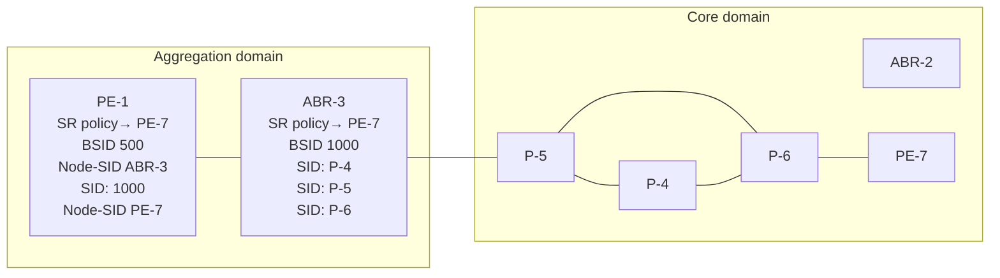

36649

The BSID serves as an anchor point, which allows one domain to be isolated from the churn of another domain. If something changes in the path P-4-P-5-P-6, ABR-3 can repair the path locally without needing to change the BSID value known at PE-1. PE-1 is therefore protected from the churn in the core domain.

3HE 22247 AAAB TQZZA 196
**© 2026 Nokia.**
Use subject to Terms available at: [www.nokia.com/terms](http://www.nokia.com/terms).

Advanced Configuration Guide Release 26.7    BGP Signaled Segment Routing Policy

The BSID also serves to reduce the number of segments/labels that the head-end needs to impose an end-to-end traffic-engineered path.

### 11.2.2.2 Segment list

A segment list sub-TLV encodes a single path toward the endpoint. Multiple segment list sub-TLVs may be included in each SR TE policy. Each segment list sub-TLV may contain multiple segment sub-TLVs and may carry a weight sub-TLV. Each segment sub-TLV describes a single segment in a segment list, and multiple segments may be concatenated to constitute an end-to-end path of the SR TE policy.

There are several types of the segment sub-TLV, allowing for the segment to be expressed as a variant of IPv4/IPv6 node address or local/remote address, and with a SID in the form of an MPLS label or IPv6 address. This chapter focuses only on the Type A encoding, which is represented as a SID in the form of an MPLS label. The SID contained within each segment sub-TLV can be any type of SID, including Node-SID, Adjacency-SID, Anycast-SID, or Binding SID.

The optional weight sub-TLV is used to implement (weighted) load-balancing in the presence of multiple segment lists. By default, SR Linux assigns a weight value of 1 to each segment list.

### 11.2.2.3 Preference

The preference sub-TLV is used to indicate the preference of a candidate path in relation to other candidate paths. Multiple candidate paths can exist in an SR TE policy, but only one candidate path can be selected as the best and active path. When multiple candidate paths exist that are considered valid, the candidate path with the highest preference is selected. The default value of the preference is 100. If multiple paths have the same preference, the protocol origin (PCEP, BGP, local configuration) may be considered, followed by the lower value of originator, followed by the higher value of discriminator.

### 11.2.2.4 SR TE policy candidate path

The symbolic name associated with an SR TE policy candidate path

### 11.2.3 Example topology

The topology in Figure 40: Example topology shows the use of BGP SR TE policy within this chapter. All PE routers within the example topology and the Route Reflector (RR-7) form part of Autonomous System 64496 and belong to the same IS-IS Level-2 area. All IGP link metrics are 100 and are symmetric. SR is enabled within the domain, and the associated Node-SIDs are shown in Figure 40: Example topology (Adj-SIDs are not shown for the purpose of clarity). The SRGB in use is {50000-54999}. All PE routers are clients of the Route Reflector for multiple address families including **srte-policy-ipv4**.

The example topology also has an additional router simulating a controller, which uses static routing for IP connectivity. This is the point from which SR TE policies are advertised into BGP, although as previously described, SR TE policies can be advertised into BGP by a controller or a router. The controller peers in the **srte-policy-ipv4** address family with the Route Reflector, which in turn reflects those routes to its clients.

3HE 22247 AAAB TQZZA    **© 2026 Nokia.**    197
Use subject to Terms available at: www.nokia.com/terms.

Advanced Configuration Guide Release 26.7 BGP Signaled Segment Routing Policy

Figure 40: Example topology

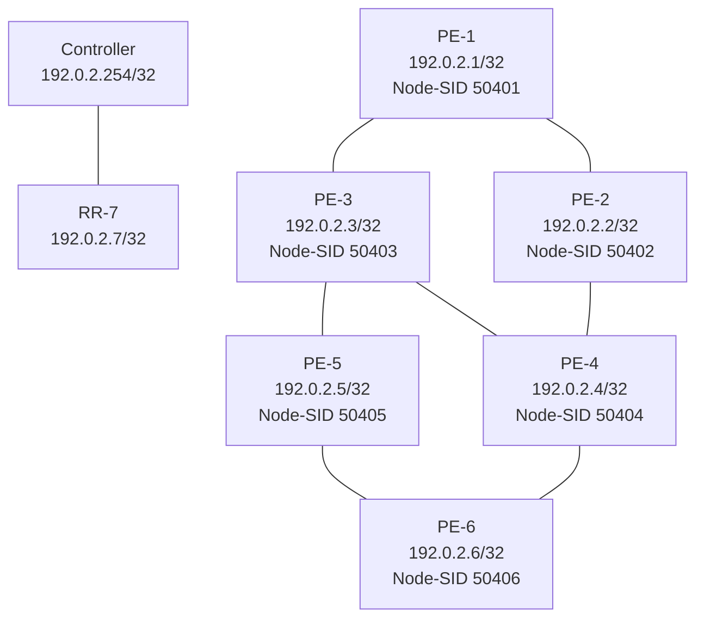

## 11.3 Configuration

An SR TE policy can be statically (CLI) configured locally on a head-end or dynamically learned by a head-end through a BGP SR TE policy route. For SR Linux to obtain an SR TE policy route, that route needs to be configured locally as a static SR TE policy. This chapter provides an example of the instantiation of an SR TE policy using static configuration on the head-end, but thereafter focuses on the instantiation of SR TE policies learned by it through BGP SR TE policy. The same static SR TE policy configuration is used regardless of whether it is for advertising that SR TE policy into BGP to the head-end, or applying it at that local head-end to forward traffic.

## 11.3.1 Segment Routing Local Block

A BSID may be either a local SID or a global SID. In general, and for the use-cases in this chapter, BSIDs are local SIDs, so a BSID needs to be within the range of a locally-configured Segment Routing Local Block (SRLB). SRLBs are reserved label blocks used for specific local purposes, such as SR TE policy BSIDs, Adjacency Set SIDs, and static Adjacency SIDs. A dedicated SRLB is required per application and has only local significance, so the same values can be used on all SR routers in the domain. Ranges for

3HE 22247 AAAB TQZZA **© 2026 Nokia.** 198
Use subject to Terms available at: [www.nokia.com/terms](http://www.nokia.com/terms).

Advanced Configuration Guide Release 26.7 BGP Signaled Segment Routing Policy

each SRLB are taken from the dynamic label range. The following configuration allocates labels 100000 to109999 to the SRLB SRLB-BSID:

```
# on all nodes:
enter candidate
   system {
       mpls {
          label-ranges {
               **static SRLB-BSID {**
                   shared false
                   start-label 100000
                   end-label 109999
               }
```

After the SRLB is defined, it is dedicated to the specific application, which in this case is SR TE policies, as follows:

```
# on all nodes:
enter candidate
   network-instance default {
       **traffic-engineering-policies {**
          binding-sid {
               static-label-block SRLB-BSID
          }
```

The preceding configuration is applied to all SR routers in the domain.

## 11.3.2 Static SR TE policy

As previously described, SR TE policies can be statically (CLI) configured locally on a head-end or dynamically learned by a head-end through a BGP SR TE policy route. In this section, the necessary steps are shown for the instantiation of an SR TE policy using static configuration locally on PE-1 as the head-end.

The following output shows the configuration of a static SR TE policy at PE-1 (192.0.2.1) with an endpoint of PE-5 (192.0.2.5).

```
# on PE-1:
enter candidate
   network-instance default {
       traffic-engineering-policies {
          explicit-paths {
               path p-PE-1-PE-5-c600 {
                   hop 1 {
                    mpls-label **50402**         # **node-SID** PE-2
                   }
                   hop 2 {
                       mpls-label **150024**     # **adj-SID** int-PE-2-PE-4
                   }
                   hop 3 {
                       mpls-label **150046**     # **adj-SID** int-PE-4-PE-6
                   }
                   hop 4 {
                    mpls-label **50405**         # **node-SID** PE-5
                   }
               }
          }
          policy pol-PE-1-PE-5-c600 {
```

3HE 22247 AAAB TQZZA **© 2026 Nokia.** 199
Use subject to Terms available at: [www.nokia.com/terms](http://www.nokia.com/terms).

Advanced Configuration Guide Release 26.7 BGP Signaled Segment Routing Policy

```
admin-state enable         # enable static SR TE policy
policy-type sr-mpls-colored
**color 600**
**endpoint 192.0.2.5**
**discriminator 600001005**
**head-end local**
**binding-sid {**
 **mpls-label 100002**
}
segment-list 1 {
 **admin-state enable**        # enable segment list
 explicit-path p-PE-1-PE-5-c600
}
```

The static SR TE policy is initially created within the **network-instance default** traffic-engineering-**policies** context and has an assigned **binding-sid** of 100002. In this example, the SR TE policy is local to PE-1, and the BSID value is therefore within the range of the PE-1 SRLB. If this static SR TE policy were to be advertised into BGP, the advertised BSID value must be in the range of the SRLB configured on the target head-end.

Three other parameters are the **color**, **discriminator**, and **endpoint** that constitute the SR TE policy NLRI. The SR TE policy **color** is 600, and is a 4-octet value that can be configured in the range 1 to 4294967295. The **discriminator** is also a 4-octet value with the same range and is configured as 600001005 (representing the color plus the last octet of the head-end and endpoint addresses). As previously described, the purpose of the **discriminator** is to make the SR TE policy unique from an NLRI perspective, such that if multiple candidate paths of the same SR TE policy (**endpoint**, **color**) are advertised, they are not suppressed by any BGP best-path selection algorithm. The **endpoint** is the IPv4 or IPv6 address of the destination for the SR TE policy and is configured as the PE-5 address 192.0.2.5.

The **head-end** is the target node where the SR TE policy is to be instantiated. If the SR TE policy is statically configured on the head-end for forwarding of traffic locally using that SR TE policy, the value **local** is used, as shown in this example. If the SR TE policy is configured somewhere other than on the **head-end**, and advertised into BGP toward the **head-end**, the value of the **head-end** parameter is the IPv4 address of that head-end. When the SR TE policy is advertised into BGP, the **head-end** address is also encoded as an IPv4 address-specific Route-Target Extended Community, which allows for potential constraining of route propagation.

The final parameter is the segment list. The preceding configuration output shows the segment list consisting of an explicit path with four hops, which represent the path using the following SIDs:

• Hop 1 SID is 50402, which is the Node-SID of PE-2
• Hop 2 SID is 150024, representing the PE-2 Adj-SID for the link PE-2-PE-4
• Hop 3 SID is 150046, representing the PE-4 Adj-SID for the link PE-4-PE-6
• Hop 4 SID is 50405, which is the Node-SID of PE-5.

A more optimal SID stack is achievable in this topology, but the configured segment list shows the use of both Node- and Adj-SIDs on a loose or strict hop basis. The segment list has an optional weight parameter used for load-balancing across multiple segment lists. In this example, only a single segment list exists, so the default weight value of 1 is retained.

Finally, both the segment list and the static SR TE policy are enabled (**admin-state enable**).

The following output shows the operational state of the static SR TE policy. The active-candidate-path-**name** field shows which candidate path is the selected path in the presence of multiple candidate paths. The selected candidate path has **oper-state up** and a non-zero **operational-segment-list-count**. The

3HE 22247 AAAB TQZZA **© 2026 Nokia.** 200
Use subject to Terms available at: [www.nokia.com/terms](http://www.nokia.com/terms).

Advanced Configuration Guide Release 26.7    BGP Signaled Segment Routing Policy

segment list has **oper-state up** and **computed-segments** for the corresponding **explicit-path**, indicating that this is a valid segment list.

```
A:admin@PE-1# info from state with-context / network-instance default traffic-engineering-
 policies policy-database
 network-instance default {
 traffic-engineering-policies {
 policy-database {
      active-te-policies 1
      total-te-policies 1
      sr-colored {
      policy 600 endpoint 192.0.2.5 {
       policy-type sr-mpls-colored
       tunnel-id 1
       metric 200
       created-time "2026-04-02T12:37:18.421Z (43 seconds ago)"
       candidate-path-count 1
       active-candidate-path-name pol-PE-1-PE-5-c600
       oper-state up
       oper-state-change-count 1
       last-oper-state-change "2026-04-02T12:37:18.423Z (43 seconds ago)"
       binding-sid {
                                  mpls-label 100002
                                  allocation-status true
       }
       candidate-path local originator-asn 0 originator-address 0.0.0.0
 discriminator 600001005 {
                                  candidate-path-preference 100
                                  forwarding-state active
                                  oper-state up
                                  last-oper-state-change "2026-04-02T12:37:18.423Z (43 seconds ago)"
                                  oper-state-change-count 1
                                  candidate-path-name pol-PE-1-PE-5-c600
                                  segment-list-count 1
                                  operational-segment-list-count 1
                                  protection {
                                   threshold 1
                                  }
                                  binding-sid {
                                   mpls-label 100002
                                   allocation-status true
                                  }
                                  segment-list 1 {
                                   oper-state up
                                   forwarding-state active
                                   last-oper-state-change "2026-04-02T12:37:18.423Z (43 seconds
 ago)"
                                   oper-state-change-count 1
                                   weight 1
                                   explicit-path p-PE-1-PE-5-c600
                                   metric 200
                                   lsp-id 1
                                   last-retry-attempt "2026-04-02T12:37:18.422Z (43 seconds ago)"
                                   computed-segments {
                                    segment 1 {
                                     sid-value {
                                                  mpls-label 50402
                                     }
                                    }
                                    segment 2 {
                                     sid-value {
                                                  mpls-label 150024
                                     }
```

3HE 22247 AAAB TQZZA    **© 2026 Nokia.**    201
                        Use subject to Terms available at: [www.nokia.com/terms](http://www.nokia.com/terms).

Advanced Configuration Guide Release 26.7    BGP Signaled Segment Routing Policy

```
}
segment 3 {
     sid-value {
             mpls-label 150046
     }
}
segment 4 {
     sid-value {
             mpls-label 50405
     }
}
}
}
}
}
}
}
```

If the SR TE policy is considered valid, it is populated in the tunnel table with tunnel type **te-policy-sr-** **mpls-colored** and a **tunnel-id** that corresponds with the **tunnel-id** for the SR TE policy. The entry indicates the destination and the next hop that the tunnel uses for reaching it. The tunnel to the destination is shown as follows:

<table>
<thead>
<tr><th>IPv4 Prefix</th><th>Tunnel Type</th><th>Tunnel ID</th><th>FIB</th><th>Metric</th><th>Preference</th><th>Last Update</th><th>Backup</th><th>Next-hop</th><th>Next-hop (Type)</th></tr>
</thead>
<tbody>
<tr><td>**192.0.2.5/32**</td><td>sr-isis</td><td>50405</td><td>Y</td><td>200</td><td>11</td><td>2026-04-02T12:08:19.944Z</td><td></td><td>192.168.13.2</td><td>ethernet-1/3.1 (mpls)</td></tr>
<tr><td>**192.0.2.5/32**</td><td>**te-policy-**<br />**sr-mpls-**<br />**colored**</td><td>1</td><td>Y</td><td>200</td><td>14</td><td>2026-04-02T12:37:18.424Z</td><td></td><td>**192.0.2.2/32**</td><td>ethernet-1/2.1 (sr-isis)</td></tr>
</tbody>
</table>

1 SR-ISIS tunnels, 1 active, 0 inactive
**1 TE-POLICY-SR-MPLS-COLORED tunnels, 1 active**, 0 inactive

3HE 22247 AAAB TQZZA    **© 2026 Nokia.**    202
Use subject to Terms available at: [www.nokia.com/terms](http://www.nokia.com/terms).

Advanced Configuration Guide Release 26.7 BGP Signaled Segment Routing Policy

The detail of the show command indicates the SID stack that the head-end pushes for traffic along the tunnel, as follows. The SIDs are ordered from lowest to highest in the SID stack, corresponding with the consecutive SIDs in the computed segment list.

```
A:admin@PE-1# show / network-instance default tunnel-table ipv4 192.0.2.5/32 detail
-----------------------------------------------------------------------------------------------
----------------------------------------------------------
Show report for network instance "default" tunnel table
-----------------------------------------------------------------------------------------------
----------------------------------------------------------
===============================================================================================
==========================================================
Destination     : 192.0.2.5/32
Tunnel Type     : sr-isis
Tunnel ID       : 50405
Metric          : 200
Preference      : 11
Last Update     : 2026-04-02T12:08:19.944Z
FIB Status      : active
Next-hops
 192.168.13.2 (mpls) via [ethernet-1/3.1]
 pushed MPLS labels : [50405]
===============================================================================================
==========================================================
Destination     : 192.0.2.5/32
Tunnel Type     : te-policy-sr-mpls-colored
Tunnel ID       : 1
Metric          : 200
Preference      : 14
Last Update     : 2026-04-02T12:37:18.424Z
FIB Status      : active
Next-hops
 192.0.2.2/32 (mpls)
 pushed MPLS labels : [50405, 150046, 150024]
===============================================================================================
==========================================================
```

## 11.3.3 Traffic steering using SR TE policies

A head-end can potentially steer traffic using an SR TE policy as a midpoint (or BSID anchor) or as an ingress router using color-based traffic steering:

* At a midpoint or BSID anchor, if an incoming packet has an active label that matches the BSID of a valid SR TE policy, the incoming label is swapped for the labels contained in the active path of that SR TE policy, and traffic is forwarded along that path.

* At an ingress router, if a BGP or service route is received containing a Color Extended Community with a value corresponding to a valid local SR TE policy, and the endpoint of that SR TE policy matches the next hop of the BGP/service route, traffic is forwarded into the associated SR TE policy.

The Color Extended Community has two flags, known as the Color-Only (CO) bits. This chapter focuses on CO bits = 00 only; other values for the CO bits are out of scope. Table 3: Use of CO bits=00 describes the destination steering options based on the setting of the Color-Only (CO) bits=00.

3HE 22247 AAAB TQZZA 203
**© 2026 Nokia.**
Use subject to Terms available at: [www.nokia.com/terms](http://www.nokia.com/terms).

Advanced Configuration Guide Release 26.7 BGP Signaled Segment Routing Policy

Table 3: Use of CO bits=00

<table>
<thead>
<tr><th>**CO bits=00**</th></tr>
</thead>
<tbody>
<tr><td>If there is a valid SR TE policy (N, C), where N is the IPv4 or IPv6 endpoint address and C is a color, steer using SR TE policy (N, C);</td></tr>
<tr><td>Else, steer on the IGP path to the next-hop N</td></tr>
</tbody>
</table>

## 11.3.3.1 Per-destination traffic steering

When incoming packets match a BGP/service route with a next hop that resolves to an SR TE policy, it is referred to as per-destination traffic steering. The previously configured static SR TE policy at PE-1 with color 600 is used to show how it is applied.

An IP VRF network-instance ni_600 is extended between PE-1 and PE-5 with import/export route target set to 64496:600, and with the **allowed tunnel types** at PE-1 set to **te-policy-sr-mpls-colored** (the complete IP-VRF configuration is not shown for conciseness).

```
# on PE-1:
enter candidate
**network-instance ni_600 {**
 **type ip-vrf**
 admin-state enable
 router-id 192.0.2.1
 interface ni_600-PE-1-CE-1 {
          interface-ref {
               interface ethernet-1/11
               subinterface 1
          }
 }
 protocols {
          bgp-ipvpn {
               bgp-instance 1 {
                admin-state enable
                mpls {
                        next-hop-resolution {
                         **allowed-tunnel-types [**
                               **te-policy-sr-mpls-colored**
                         ]
                        }
                }
               }
          }
          bgp {
               ---snip---
          }
          bgp-vpn {
               bgp-instance 1 {
                export-policy [
                        rp-ni_600-export
                ]
                import-policy [
                        rp-ni_600-import
                ]
                route-distinguisher {
                        rd 64496:600
                }
```

3HE 22247 AAAB TQZZA **© 2026 Nokia.** 204
Use subject to Terms available at: [www.nokia.com/terms](http://www.nokia.com/terms).

Advanced Configuration Guide Release 26.7    BGP Signaled Segment Routing Policy

```
}
}
}
```

A CE router is locally connected to PE-5 and advertises prefix 10.148.5.0/24 to IPv4 BGP, which PE-5 subsequently advertises as an l3vpn-ipv4-unicast route. In addition to attaching the Route-Target Extended Community to the l3vpn-ipv4-unicast route, PE-5 also attaches a Color Extended Community with value color:00:600. The PE-5 VRF export policy is shown following. When configuring the Color Extended Community, the syntax "color:co:value" is used. Therefore, in the example configuration, the CO bits are 00 and the color value is 600.

```
# on PE-5:
enter candidate
       routing-policy {
           extended-community-set ecs-ni_600-export {
               member [
                target:64496:600
               ]
           }
           **extended-community-set ecs-ni_600-sr-policy {**
               **member [**
                **color:00:600**
               **]**
           }
           policy rp-ni_600-export {
               statement stmt {
                match {
                 protocol bgp
                }
                action {
                 policy-result accept
                 bgp {
                          extended-community {
                            operation add
                            referenced-sets [
                                ecs-ni_600-export
                                **ecs-ni_600-sr-policy**
                            ]
                          }
                 }
                }
               }
           }
```

At PE-1, the l3vpn-ipv4-unicast route with {next-hop PE-5, color extended community 600} resolves to the PE-1 static SR TE policy with {endpoint PE-5, color 600}. It is imported into the IP VRF ni_600 route-table with an indication that it is resolved to the SR TE policy tunnel with tunnel ID 1, which is the tunnel ID of the previously configured static SR TE policy. Traffic from PE-1 to PE-5 is therefore forwarded into the SR TE policy using the label stack defined in the segment list.

```
A:admin@PE-1# show / network-instance ni_600 ipv4 route 10.148.5.0/24 detail
===============================================================================================
==========================================================
**Prefix: 10.148.5.0/24**
--------------------------------------------------------------------------
----------------------------------------------------------
Active                 : yes
Route Type             : bgp-ipvpn
Route Owner            : bgp_ipvpn_mgr, 2026-04-02T12:46:51.094Z (18 minutes ago)
Id                     : 0
```

3HE 22247 AAAB TQZZA    **© 2026 Nokia.**    205
                        Use subject to Terms available at: [www.nokia.com/terms](http://www.nokia.com/terms).

Advanced Configuration Guide Release 26.7    BGP Signaled Segment Routing Policy

```
Leakable             : no
Leaked               : no
Metric               : 200
Preference           : 170
Internal Tags        : none
Dynamic LB           : no
Resilient Hash       : no
FIB Suppressed       : no
FIB Failed           : no
Next-Hop-Group       : 41837916
 **Net-Instance**        : ni_600
 FIB Failed          : no
 **Primary NH**          : 41837908
  LB Weight          : 1
  **Type**               : **indirect**
  **IP Address**         : 192.0.2.5
  Resolved           : yes
  **Resolving Tunnel** : 192.0.2.5/32(te-policy-sr-mpls-colored, 1)
  MPLS Lbl Stack     : 40001
```

### 11.3.4 Advertising SR TE policies into BGP

Before advertising SR TE policies into BGP, all previous static SR TE policy configuration is removed. The simulated controller acts as the source of BGP advertised SR TE policies, and when an SR Linux router advertises SR TE policies into BGP they must first be statically configured to provide the relevant information to populate the BGP path attributes. The following static SR TE policy is applied at the controller representing a similar SR TE policy to that previously configured at PE-1. The SR TE policy has a head-end of PE-1 (192.0.2.1), an endpoint of PE-5 (192.0.2.5), and a color of 600. The segment list is modified slightly to represent a list of strict hops using Adj-SIDs along the path PE-1-PE-2-PE-4-PE-6- PE-5.

```
# on controller:
enter candidate
    network-instance default {
    traffic-engineering-policies {
    explicit-paths {
               path p-c600-PE-1-PE-5 {
                hop 1 {
                    mpls-label 150012     # adj-SID int-PE-1-PE-2
                }
                hop 2 {
                    mpls-label 150024     # adj-SID int-PE-2-PE-4
                }
                hop 3 {
                    mpls-label 150046     # adj-SID int-PE-4-PE-6
                }
                hop 4 {
                    mpls-label 150065     # adj-SID int-PE-6-PE-5
                }
               }
    }
    policy pol-c600-PE-1-PE-5 {
               admin-state enable
               policy-type sr-mpls-colored
               **color 600**
               **endpoint 192.0.2.5**
               **discriminator 600001005**
               **head-end 192.0.2.1**
               **binding-sid {**
```

3HE 22247 AAAB TQZZA    **© 2026 Nokia.**    206
Use subject to Terms available at: [www.nokia.com/terms](http://www.nokia.com/terms).

Advanced Configuration Guide Release 26.7 BGP Signaled Segment Routing Policy

```
mpls-label 100002
}
segment-list 1 {
 admin-state enable
 explicit-path p-c600-PE-1-PE-5
}
```

To advertise the preceding SR TE policy into BGP, two steps are required at the controller. First, the **srte-policy-ipv4 import-static true** command must be configured under the **bgp afi-safi ipv4-unicast** context. This command instructs BGP to import all statically configured non-local SR TE policies from the SR database into the BGP RIB, such that they can be advertised toward BGP peers supporting the SR TE policy address family. Second, a BGP peering is established with the Route Reflector RR-7 (192.0.2.7) for the SR TE policy address family, using the keyword **afi-safi srte-policy-ipv4**. Although not shown, the relevant configuration is made on all routers for RR-7 to peer to all its clients for the same address family.

```
# on controller:
enter candidate
network-instance default {
 protocols {
  bgp {
   admin-state enable
   autonomous-system 64496
   router-id 192.0.2.254
   afi-safi ipv4-unicast {
    admin-state enable
    srte-policy-ipv4 {
     import-static true
    }
   }
   afi-safi srte-policy-ipv4 {
    admin-state enable
   }
   group iPCE {
    admin-state enable
    peer-as 64496
    afi-safi ipv4-unicast {
     admin-state enable
    }
    afi-safi srte-policy-ipv4 {
     admin-state enable
    }
   }
   neighbor 192.0.2.7 {
    admin-state enable
    peer-group iPCE
   }
   ---snip---
  }
  ---snip---
```

icon: note **Note:**
SR Linux Release 26.3.R1 supports propagation of SR TE policy routes across internal BGP peers. SR TE policy routes are not advertised to external BGP peers.

The following output shows the BGP RIB-Out for the SR TE policy address family at the controller and shows the SR TE policy advertised to RR-7 (192.0.2.7). The presence of an IPv4 address-specific

3HE 22247 AAAB TQZZA **© 2026 Nokia.** 207
Use subject to Terms available at: [www.nokia.com/terms](http://www.nokia.com/terms).

Advanced Configuration Guide Release 26.7 BGP Signaled Segment Routing Policy

Route-Target Extended Community encoding the head-end PE-1 address (192.0.2.1) allows for potential constraining of route propagation if required.

```
A:admin@PCE# info from state with-context / network-instance default bgp-rib afi-safi srte-
policy-ipv4
network-instance default {
    bgp-rib {
        afi-safi srte-policy-ipv4 {
            **srte-policy-ipv4** {
                rib-in-out {
                    **rib-out-post {**
                        **route 600001005 color 600 endpoint 192.0.2.5 neighbor 192.0.2.7**
                        **path-id 0 {**
                            **attr-id 15**
                        }
                    }
                }
            }
        }
    }
}

A:admin@PCE# info from state with-context / network-instance default bgp-rib attr-sets
network-instance default {
    bgp-rib {
        attr-sets {
            **attr-set 15 {**
                origin igp
                atomic-aggregate false
                next-hop 0.0.0.0
                local-pref 100
                communities {
                    **ext-community [**
                        **target:192.0.2.1:0**
                    ]
                }
                tunnel-encapsulation {
                    **srte-policy {**
                        sub-tlvs {
                            subtlv binding-sid {
                                binding-sid {
                                    length 6
                                    specified-bsid-only false
                                    drop-upon-invalid false
                                    mpls {
                                        label-value 100002
                                        traffic-class 0
                                        bottom-of-stack false
                                        time-to-live 0
                                    }
                                }
                            }
                            subtlv preference {
                                preference {
                                    value 100
                                }
                            }
                            subtlv segment-list {
                                segment-list 1 {
                                    length 41
                                    sub-tlvs {
                                        weight {
                                            value 1
                                        }
                                        segment 1 {
                                            type a
                                            segment-type-a {
                                                sid-verification false
                                            }
                                        }
                                    }
                                }
                            }
                        }
                    }
                }
            }
        }
    }
}
```

3HE 22247 AAAB TQZZA **© 2026 Nokia.** 208
Use subject to Terms available at: [www.nokia.com/terms](http://www.nokia.com/terms).

Advanced Configuration Guide Release 26.7 BGP Signaled Segment Routing Policy

```
mpls {
         label-value 150012
         traffic-class 0
         bottom-of-stack false
         time-to-live 255
}
}
}
segment 2 {
 type a
 segment-type-a {
  sid-verification false
  mpls {
           label-value 150024
           traffic-class 0
           bottom-of-stack false
           time-to-live 255
  }
 }
}
segment 3 {
 type a
 segment-type-a {
  sid-verification false
  mpls {
           label-value 150046
           traffic-class 0
           bottom-of-stack false
           time-to-live 255
  }
 }
}
segment 4 {
 type a
 segment-type-a {
  sid-verification false
  mpls {
           label-value 150065
           traffic-class 0
           bottom-of-stack false
           time-to-live 255
  }
 }
}
}
}
}
subtlv **srte-policy-candidate-path-name** {
 **srte-policy-candidate-path-name** {
  **name pol-c600-PE-1-PE-5**
 }
}
}
}
}
}
---snip---
```

The following output shows the operational state of the imported SR TE policy on PE-1. The **active-candidate-path-name** field shows which candidate path is the selected path in the presence of multiple candidate paths. The selected candidate path has **oper-state up** and a non-zero operational-segment-

3HE 22247 AAAB TQZZA 209
**© 2026 Nokia.**
Use subject to Terms available at: [www.nokia.com/terms](http://www.nokia.com/terms).

Advanced Configuration Guide Release 26.7    BGP Signaled Segment Routing Policy

**list-count**. The segment list has **oper-state up** and **computed-segments** for the corresponding explicit-**path**, indicating that this is a valid segment list.

```
A:admin@PE-1# info from state with-context / network-instance default traffic-engineering-
 policies policy-database
 network-instance default {
 traffic-engineering-policies {
 policy-database {
      active-te-policies 1
      total-te-policies 1
      sr-colored {
      policy 600 endpoint 192.0.2.5 {
       policy-type sr-mpls-colored
       tunnel-id 2
       metric 200
       created-time "2026-04-02T13:30:06.560Z (9 minutes ago)"
       candidate-path-count 1
       active-candidate-path-name pol-c600-PE-1-PE-5
       oper-state up
       oper-state-change-count 1
       last-oper-state-change "2026-04-02T13:30:06.561Z (9 minutes ago)"
       binding-sid {
                          mpls-label 100002
                          allocation-status true
       }
       candidate-path bgp originator-asn 64496 originator-address 192.0.2.254
 discriminator 600001005 {
                          candidate-path-preference 100
                          forwarding-state active
                          oper-state up
                          last-oper-state-change "2026-04-02T13:30:06.561Z (9 minutes ago)"
                          oper-state-change-count 1
                          candidate-path-name pol-c600-PE-1-PE-5
                          segment-list-count 1
                          operational-segment-list-count 1
                          protection {
                           threshold 1
                          }
                          binding-sid {
                           mpls-label 100002
                           allocation-status true
                          }
                          segment-list 1 {
                           oper-state up
                           forwarding-state active
                           last-oper-state-change "2026-04-02T13:30:06.561Z (9 minutes
 ago)"
                           oper-state-change-count 1
                           weight 1
                           metric 200
                           lsp-id 2
                           last-retry-attempt "2026-04-02T13:30:06.560Z (9 minutes ago)"
                           computed-segments {
                            segment 1 {
                               sid-value {
                                         mpls-label 150012
                               }
                            }
                            segment 2 {
                               sid-value {
                                         mpls-label 150024
                               }
                            }
```

3HE 22247 AAAB TQZZA    **© 2026 Nokia.**    210
                        Use subject to Terms available at: [www.nokia.com/terms](http://www.nokia.com/terms).

Advanced Configuration Guide Release 26.7    BGP Signaled Segment Routing Policy

```
segment 3 {
    sid-value {
             mpls-label 150046
    }
}
segment 4 {
    sid-value {
             mpls-label 150065
    }
}
```

Verification is also made at PE-1 that the SR TE policy tunnel is correctly populated in the tunnel table.

<table>
<thead>
<tr><th>IPv4 Prefix</th><th>Tunnel Type</th><th>Tunnel ID</th><th>FIB</th><th>Metric</th><th>Preference</th><th>Last Update</th><th>Backup</th><th>Next-hop</th><th>Next-hop (Type)</th></tr>
</thead>
<tbody>
<tr><td>**192.0.2.5/32**</td><td>**te-policy-**<br />**sr-mpls-**<br />**colored**</td><td>2</td><td>Y</td><td>200</td><td>14</td><td>2026-04-<br />02T13:30:06.<br />562Z</td><td></td><td>192.168.12.2</td><td>ethernet-<br />1/2.1<br />/32 (sr-<br />isis)</td></tr>
</tbody>
</table>

The procedure for traffic steering using an SR TE policy learned through BGP SR TE policy is the same as traffic steering using a statically configured SR TE policy, and is therefore not repeated here.

## 11.3.5 BSID anchor

The statically configured and BGP advertised SR TE policies used so far in this chapter have been instantiated on a head-end that uses the Color Extended Community to steer traffic. An alternative method of steering traffic using an SR TE policy is through the use of the BSID. If an incoming packet has an active label that matches the BSID of a valid SR TE policy, the packet is forwarded using that SR TE policy and the incoming label is swapped for the labels that the SR TE policy contains.

3HE 22247 AAAB TQZZA    **© 2026 Nokia.**    211
                        Use subject to Terms available at: www.nokia.com/terms.

Advanced Configuration Guide Release 26.7 BGP Signaled Segment Routing Policy

Using a BSID in this way is considered useful at domain interconnects such as ABRs or ASBRs. It provides opacity between the domains and protects the churn from one domain from entering another domain. In large networks, it has the additional benefit of reducing the number of labels an ingress router needs to impose, because the BSID can expand a single incoming SID/label stack (the BSID) into a much larger outgoing SID/label stack.

The example topology in Figure 40: Example topology is entirely IS-IS Level 2, so not constructed of multiple domains. However, it is still sufficient to show the use of BSID traffic steering. In the following example, PE-3 becomes a BSID anchor for an SR TE policy path extended between PE-1 and PE-5. This requires the instantiation of two SR TE policies:

• An SR TE policy at PE-3 with a segment list that constructs the required path to PE-5. Like every SR TE policy, it requires a BSID, but in this case the BSID is programmed in the Incoming Label Map (ILM) table and has a next hop Label Forwarding Entry (NHLFE) that includes the segments (labels) in the segment list.

• An SR TE policy at PE-1 with a segment list specifying a path to PE-3, followed by a segment that references the relevant BSID programmed at PE-3.

The following output shows the SR TE policy advertised in BGP to PE-3. It uses color 700 and has an endpoint of PE-5 (192.0.2.5). Because traffic steering at PE-3 using the SR TE policy is achieved using the BSID, any color value could be used (although different colors may be needed to represent different path characteristics). Packets are classified upstream of PE-3 at PE-1, and the result of that classification selects the relevant BSID to meet the path requirements. The segment list programs a path to PE-5 using Adj-SIDs along the path PE-3-PE-4-PE-6-PE-5. The BSID value is 100001.

```
A:admin@PE-3# info from state with-context / network-instance default traffic-engineering-
policies policy-database
 network-instance default {
 traffic-engineering-policies {
 policy-database {
              **active-te-policies 1**
              total-te-policies 1
              **sr-colored {**
              **policy 700 endpoint 192.0.2.5 {**
                    policy-type sr-mpls-colored
                    **tunnel-id 1**
                    metric 100
                    created-time "2026-04-02T13:44:20.380Z (a minute ago)"
                    candidate-path-count 1
                    **active-candidate-path-name pol-c700-PE-3-PE-5**
                    **oper-state up**
                    oper-state-change-count 1
                    last-oper-state-change "2026-04-02T13:44:20.382Z (a minute ago)"
                    **binding-sid {**
                         **mpls-label 100001**
                         **allocation-status true**
                    }
                    **candidate-path bgp originator-asn 64496 originator-address 192.0.2.254**
**discriminator 700003005 {**
                         candidate-path-preference 100
                         forwarding-state active
                         oper-state up
                         last-oper-state-change "2026-04-02T13:44:20.382Z (a minute ago)"
                         oper-state-change-count 1
                         **candidate-path-name pol-c700-PE-3-PE-5**
                         segment-list-count 1
                         **operational-segment-list-count 1**
                         protection {
                           threshold 1
                         }
```

3HE 22247 AAAB TQZZA **© 2026 Nokia.** 212
Use subject to Terms available at: www.nokia.com/terms.

Advanced Configuration Guide Release 26.7    BGP Signaled Segment Routing Policy

```
binding-sid {
     mpls-label 100001
     allocation-status true
}
**segment-list 1 {**
     **oper-state up**
     forwarding-state active
     last-oper-state-change "2026-04-02T13:44:20.382Z (a minute ago)"
     oper-state-change-count 1
     weight 1
     metric 100
     lsp-id 1
     last-retry-attempt "2026-04-02T13:44:20.380Z (a minute ago)"
     **computed-segments {**
      segment 1 {
            sid-value {
             mpls-label 150034
            }
      }
      segment 2 {
            sid-value {
             mpls-label 150046
            }
      }
      segment 3 {
            sid-value {
             mpls-label 150065
            }
      }
     }
}
```

The following output shows the SR TE policy advertised in BGP to PE-1. It uses color 700 and has an endpoint of PE-5 (192.0.2.5). The segment list programs a path that contains the following:

• The Node-SID of PE-3 (50403)

• The BSID programmed at PE-3 for the path to PE-5 (100001). When PE-3 pops its Node-SID and this label is exposed at PE-3, it swaps label 100001 for the label stack contained in the SR TE policy of that BSID.

• The Node-SID of PE-5 (50405)

```
A:admin@PE-1# info from state with-context / network-instance default traffic-engineering- policies policy-database
 network-instance default {
      traffic-engineering-policies {
      policy-database {
       **active-te-policies 2**
       total-te-policies 2
       **sr-colored {**
        policy 600 endpoint 192.0.2.5 {
         ---snip---
        }
        **policy 700 endpoint 192.0.2.5 {**
         policy-type sr-mpls-colored
         **tunnel-id 3**
         metric 200
```

3HE 22247 AAAB TQZZA    **© 2026 Nokia.**    213
                        Use subject to Terms available at: [www.nokia.com/terms](http://www.nokia.com/terms).

Advanced Configuration Guide Release 26.7    BGP Signaled Segment Routing Policy

```
created-time "2026-04-02T13:44:21.407Z (a minute ago)"
candidate-path-count 1
**active-candidate-path-name pol-c700-PE-1-PE-3**
**oper-state up**
oper-state-change-count 1
last-oper-state-change "2026-04-02T13:44:21.407Z (a minute ago)"
**binding-sid {**
                   **mpls-label 100003**
                   **allocation-status true**
}
**candidate-path bgp originator-asn 64496 originator-address 192.0.2.254**
**discriminator 700001003 {**
                   candidate-path-preference 100
                   forwarding-state active
                   **oper-state up**
                   last-oper-state-change "2026-04-02T13:44:21.407Z (a minute ago)"
                   oper-state-change-count 1
                   **candidate-path-name pol-c700-PE-1-PE-3**
                   segment-list-count 1
                   **operational-segment-list-count 1**
                   protection {
                    threshold 1
                   }
                   **binding-sid {**
                    **mpls-label 100003**
                    **allocation-status true**
                   }
                   **segment-list 1 {**
                    oper-state up
                    forwarding-state active
                    last-oper-state-change "2026-04-02T13:44:21.407Z (a minute ago)"
                    oper-state-change-count 1
                    weight 1
                    metric 200
                    lsp-id 3
                    last-retry-attempt "2026-04-02T13:44:21.407Z (a minute ago)"
                    **computed-segments {**
                     segment 1 {
                      sid-value {
                                   mpls-label 50403
                      }
                     }
                     segment 2 {
                      sid-value {
                                   mpls-label 100001
                      }
                     }
                     segment 3 {
                      sid-value {
                                   mpls-label 50405
                      }
                     }
                    }
                   }
}
```


SPACER TEXT

3HE 22247 AAAB TQZZA    **© 2026 Nokia.**    214
Use subject to Terms available at: [www.nokia.com/terms](http://www.nokia.com/terms).

Advanced Configuration Guide Release 26.7 BGP Signaled Segment Routing Policy

An IP VRF network instance ni_700 is extended between PE-1 and PE-5 with with import/export route target set to 64496:700, and with the **allowed tunnel types** at PE-1 set to **te-policy-sr-mpls-colored** (the complete IP VRF configuration is not shown for conciseness).

```
# on PE-1:
enter candidate
 network-instance ni_700 {
  **type ip-vrf**
  admin-state enable
  router-id 172.31.1.1
  interface loopback0-ni_700 {
           interface-ref {
                interface lo1
                subinterface 0
           }
  }
  protocols {
           bgp-ipvpn {
                bgp-instance 1 {
                 admin-state enable
                 mpls {
                      next-hop-resolution {
                          **allowed-tunnel-types [**
                                **te-policy-sr-mpls-colored**
                          ]
                      }
                 }
                }
           }
           bgp-vpn {
                bgp-instance 1 {
                 export-policy [
                      rp-ni_700-export
                 ]
                 import-policy [
                      rp-ni_700-import
                 ]
                 route-distinguisher {
                      rd 64496:700
                 }
                }
           }
  }
```

PE-5 advertises prefix 172.31.5.1/32 as an l3vpn-ipv4-unicast route. In addition to the Route-Target Extended Community attached to the l3vpn-ipv4-unicast route, PE-5 also attaches a Color Extended Community with value color:00:700. PE-5's VRF export policy is as follows:

```
# on PE-5:
enter candidate
 routing-policy {
  extended-community-set ecs-ni_700-export {
           member [
                target:64496:700
           ]
  }
  extended-community-set ecs-ni_700-import {
           member [
                target:64496:700
           ]
  }
  extended-community-set ecs-ni_700-sr-policy {
```

3HE 22247 AAAB TQZZA 215
**© 2026 Nokia.**
Use subject to Terms available at: [www.nokia.com/terms](http://www.nokia.com/terms).

Advanced Configuration Guide Release 26.7    BGP Signaled Segment Routing Policy

```
member [
   color:00:700
]
}
prefix-set ps-ni_700-prefixes {
prefix 172.31.5.1/32 mask-length-range exact {
}
}
policy rp-ni_700-export {
statement stmt {
   match {
         prefix {
              prefix-set ps-ni_700-prefixes
         }
   }
   action {
         policy-result accept
         bgp {
              extended-community {
                    operation add
                    referenced-sets [
                       ecs-ni_700-export
                       ecs-ni_700-sr-policy
                    ]
              }
         }
   }
}
}
policy rp-ni_700-import {
statement stmt {
   match {
         bgp {
              extended-community {
                    extended-community-set ecs-ni_700-import
              }
         }
   }
   action {
         policy-result accept
   }
}
}
```

PE-1 also advertises prefix 172.31.1.1/32 as an l3vpn-ipv4-unicast route to allow for connectivity to be validated end-to-end through both SR TE policies. The first of the following outputs shows PE-1s tunnel-table containing the advertised SR TE policy to PE-5 with tunnel ID 3 and next hop 192.0.2.3.

<table>
<thead>
<tr><th colspan="10">A:admin@PE-1# show / network-instance default tunnel-table ipv4 type te-policy-sr-mpls-colored</th></tr>
<tr><th colspan="10">IPv4 tunnel table of network-instance "default"</th></tr>
<tr><th>IPv4 Prefix</th><th>Tunnel Type</th><th>Tunnel ID</th><th>FIB</th><th>Metric</th><th>Preference</th><th>Last Update</th><th>Backup</th><th>Next-hop</th><th>Next-hop (Type)</th></tr>
<tr><th></th><th></th><th></th><th></th><th></th><th></th><th></th><th>Nexthops</th><th></th><th></th></tr>
</thead>
<tbody>
</tbody>
</table>

3HE 22247 AAAB TQZZA    **© 2026 Nokia.**    216
                        Use subject to Terms available at: [www.nokia.com/terms](http://www.nokia.com/terms).

Advanced Configuration Guide Release 26.7 BGP Signaled Segment Routing Policy

```
| **192.0.2.5/32** | **te-policy-** | 2 | Y | 200 | 14 |
| 2026-04- | | | 192.168.12.2 | **ethernet-** | | |
| | **sr-mpls-** | | | | |
| 02T13:30:06. | | | /32 (sr- | 1/2.1 | |
| | **colored** | | | | |
| 562Z | | | isis) | | |
| **192.0.2.5/32** | **te-policy-** | 3 | Y | 200 | 14 |
| 2026-04- | | | **192.0.2.3/32** | **ethernet-** | |
| | **sr-mpls-** | | | | |
| 02T13:44:21. | | | (sr-isis) | 1/3.1 | |
| | **colored** | | | | |
| 408Z | | | | | |
```
2 TE-POLICY-SR-MPLS-COLORED tunnels, 2 active, 0 inactive

The next output shows the IP VRF ni_700 route table at PE-1 where the l3vpn-ipv4-unicast prefix **172.31.5.1/32** advertised by PE-5 is resolved to an SR TE policy tunnel with tunnel ID 3. As in the previous output, this is the SR TE policy advertised in BGP containing the BSID at PE-3.

A:admin@PE-1# show / network-instance ni_700 ipv4 route all
===============================================================================================
==========================================================
IPv4-unicast route table for ip-vrf network-instance: ni_700
-----------------------------------------------------------------------------------------------
----------------------------------------------------------
Flags: > (best), * (unviable), ! (failed)
       : L (leaked route from another network-instance)
       : B (backup NHG active and displayed)
       : S (statistics supported)
       : D (dynamic LB), R (resilient LB)
-----------------------------------------------------------------------------------------------
----------------------------------------------------------
Prefix                Route Type       Metric   Pref    Flags    Next-Hop(s)
-----------------------------------------------------------------------------------------------
----------------------------------------------------------
**172.31.5.1/32**         bgp-ipvpn        200      170     >        192.0.2.5(tunnel:**te‐policy‐sr‐mpls‐**
**colored**, label:40002)

A:admin@PE-1# show / network-instance ni_700 ipv4 route **172.31.5.1/32** detail
===============================================================================================
==========================================================
Prefix: **172.31.5.1/32**
-----------------------------------------------------------------------------------------------
----------------------------------------------------------
Active                : yes
Route Type            : bgp-ipvpn
Route Owner           : bgp_ipvpn_mgr, 2026-04-02T14:01:39.721Z (8 minutes ago)
Id                    : 0
Leakable              : no
Leaked                : no
Metric                : 200
Preference            : 170
Internal Tags         : none
Dynamic LB            : no
Resilient Hash        : no
FIB Suppressed        : no
FIB Failed            : no

3HE 22247 AAAB TQZZA **© 2026 Nokia.** 217
Use subject to Terms available at: [www.nokia.com/terms](http://www.nokia.com/terms).

Advanced Configuration Guide Release 26.7 BGP Signaled Segment Routing Policy

```
Next-Hop-Group       : 41837924
 Net-Instance        : ni_700
 FIB Failed          : no
 Primary NH          : 41837916
  LB Weight          : 1
  Type               : indirect
  IP Address         : 192.0.2.5
  Resolved           : yes
  Resolving Tunnel : 192.0.2.5/32(te-policy-sr-mpls-colored, 3)
  MPLS Lbl Stack     : 40002
```

The datapath between PE-1 and PE-5 is verified using a ping:

```
A:admin@PE-1# ping 172.31.5.1 network-instance ni_700 -4 -c 5 -I 172.31.1.1 -s 56
Using network instance ni_700
PING 172.31.5.1 (172.31.5.1) from 172.31.1.1 : 56(84) bytes of data.
64 bytes from 172.31.5.1: icmp_seq=1 ttl=64 time=47.9 ms
64 bytes from 172.31.5.1: icmp_seq=2 ttl=64 time=7.98 ms
64 bytes from 172.31.5.1: icmp_seq=3 ttl=64 time=8.31 ms
64 bytes from 172.31.5.1: icmp_seq=4 ttl=64 time=41.3 ms
64 bytes from 172.31.5.1: icmp_seq=5 ttl=64 time=8.06 ms
--- 172.31.5.1 ping statistics ---
5 packets transmitted, 5 received, 0% packet loss, time 4005ms
rtt min/avg/max/mdev = 7.984/22.711/47.905/17.998 ms
```

## 11.3.6 Weighted Equal Cost Multipath

Support for weighted Equal Cost Multipath (ECMP) is provided with SR TE policies using multiple segment lists. Each segment list contains a path from the head-end to the endpoint, and each segment list contains a weight used to influence ECMP forwarding. The following output at the controller shows the use of multiple segment lists for an SR TE policy with a head-end of PE-1 (192.0.2.1), an endpoint of PE-6 (192.0.2.6), and a color of 800. Segment list 1 encodes a path consisting of Node-SIDs along the path PE-1-PE-3-PE-5-PE-6 and has a weight of 40. Segment list 2 encodes a path consisting of Node-SIDs along the path PE-1-PE-2-PE-4-PE-6 and has a weight of 60.

```
# on controller:
enter candidate
network-instance default {
traffic-engineering-policies {
explicit-paths {
         path p-c800-PE-1-PE-6-1 {
                 hop 1 {
                 mpls-label 50403     # node-SID PE-3
                 }
                 hop 2 {
                 mpls-label 50405     # node-SID PE-5
                 }
                 hop 3 {
                 mpls-label 50406     # node-SID PE-6
                 }
                }
         path p-c800-PE-1-PE-6-2 {
                 hop 1 {
                 mpls-label 50402     # node-SID PE-2
                 }
                 hop 2 {
                 mpls-label 50404     # node-SID PE-4
                 }
```

3HE 22247 AAAB TQZZA    **© 2026 Nokia.**    218
Use subject to Terms available at: [www.nokia.com/terms](http://www.nokia.com/terms).

Advanced Configuration Guide Release 26.7    BGP Signaled Segment Routing Policy

```
hop 3 {
 mpls-label 50406          # node-SID PE-6
}
}
}
policy pol-c800-PE-1-PE-6 {
 admin-state enable
 policy-type sr-mpls-colored
 color 800
 endpoint 192.0.2.6
 discriminator 800001006
 head-end 192.0.2.1
 binding-sid {
  mpls-label 100001
 }
 **segment-list 1** {
  admin-state enable
  **explicit-path p-c800-PE-1-PE-6-1**
  **weight 40**
 }
 **segment-list 2** {
  admin-state enable
  **explicit-path p-c800-PE-1-PE-6-2**
  **weight 60**
 }
}
```

The following output shows the SR TE policy advertised in BGP to PE-1. It uses color 800 and has an endpoint of PE-6 (192.0.2.6). The selected candidate path has **oper-state up** and a non-zero operational-**segment-list-count**. The two segment lists have **oper-state up** and **computed-segments** for the corresponding **explicit-path**, indicating that these are valid segment lists.

```
A:admin@PE-1# info from state with-context / network-instance default traffic-engineering-
 policies policy-database
 network-instance default {
 traffic-engineering-policies {
  policy-database {
   active-te-policies 3
   total-te-policies 3
   sr-colored {
    policy 600 endpoint 192.0.2.5 {
     ---snip---
    }
    policy 700 endpoint 192.0.2.5 {
     ---snip---
    }
    **policy 800 endpoint 192.0.2.6** {
     policy-type sr-mpls-colored
     tunnel-id 4
     metric 300
     created-time "2026-04-02T14:15:42.190Z (15 seconds ago)"
     candidate-path-count 1
     **active-candidate-path-name pol-c800-PE-1-PE-6**
     oper-state up
     oper-state-change-count 1
     last-oper-state-change "2026-04-02T14:15:42.191Z (15 seconds ago)"
     binding-sid {
                          mpls-label 100001
                          allocation-status true
     }
     **candidate-path bgp originator-asn 64496 originator-address 192.0.2.254**
 **discriminator 800001006** {
                          candidate-path-preference 100
```

3HE 22247 AAAB TQZZA    219    **© 2026 Nokia.**
                        Use subject to Terms available at: [www.nokia.com/terms](http://www.nokia.com/terms).

Advanced Configuration Guide Release 26.7    BGP Signaled Segment Routing Policy

```
 forwarding-state active
 **oper-state up**
 last-oper-state-change "2026-04-02T14:15:42.191Z (15 seconds ago)"
 oper-state-change-count 1
 **candidate-path-name pol-c800-PE-1-PE-6**
 segment-list-count 2
 **operational-segment-list-count 2**
 protection {
  threshold 1
 }
 binding-sid {
  mpls-label 100001
  allocation-status true
 }
 **segment-list 1 {**
  oper-state up
  forwarding-state active
  last-oper-state-change "2026-04-02T14:15:42.191Z (15 seconds ago)"
  oper-state-change-count 1
  **weight 40**
  metric 300
  lsp-id 4
  last-retry-attempt "2026-04-02T14:15:42.190Z (15 seconds ago)"
  **computed-segments {**
   segment 1 {
    sid-value {
           mpls-label 50403
    }
   }
   segment 2 {
    sid-value {
           mpls-label 50405
    }
   }
   segment 3 {
    sid-value {
           mpls-label 50406
    }
   }
  }
 }
 **segment-list 2 {**
  oper-state up
  forwarding-state active
  last-oper-state-change "2026-04-02T14:15:42.191Z (15 seconds ago)"
  oper-state-change-count 1
  **weight 60**
  metric 300
  lsp-id 5
  last-retry-attempt "2026-04-02T14:15:42.190Z (15 seconds ago)"
  computed-segments {
   segment 1 {
    sid-value {
           mpls-label 50402
    }
   }
   segment 2 {
    sid-value {
           mpls-label 50404
    }
   }
   segment 3 {
```


SPACER TEXT

3HE 22247 AAAB TQZZA    **© 2026 Nokia.**    220
Use subject to Terms available at: [www.nokia.com/terms](http://www.nokia.com/terms).

Advanced Configuration Guide Release 26.7    BGP Signaled Segment Routing Policy

```
sid-value {
           mpls-label 50406
  }
 }
}
```

The tunnel table at PE-1 shows one SR TE policy tunnel to PE-6 (192.0.2.6), with tunnel ID 4 and two next hops: a next hop to PE-3 (192.0.2.3) and a next hop to PE-2 (192.0.2.2).

<table>
<thead>
<tr><th>IPv4 Prefix</th><th>Tunnel Type</th><th>Tunnel ID</th><th>FIB Next-hop</th><th>Metric</th><th>Preference</th><th>Last Update</th><th>Backup Nexthops</th><th>Next-hop (Type)</th><th></th></tr>
<tr><th>Last Update</th><th>Backup Nexthops</th><th>Next-hop (Type)</th><th></th><th></th><th></th><th></th><th></th><th></th><th></th></tr>
</thead>
<tbody>
<tr><td>**192.0.2.6/32**</td><td>**te-policy-**<br />**sr-mpls-**<br />**colored**</td><td>4</td><td>Y</td><td>300</td><td>14</td><td>2026-04-<br />02T14:15:42.<br />191Z</td><td></td><td>**192.0.2.3/32**</td><td>ethernet-<br />1/3.1</td></tr>
<tr><td></td><td></td><td></td><td></td><td></td><td></td><td></td><td></td><td>**192.0.2.2/32**</td><td>ethernet-<br />(sr-isis) 1/2.1</td></tr>
</tbody>
</table>

## 11.4 Conclusion

SR TE policies provide an effective way for instantiating traffic engineered SR tunnels that may be statically configured or advertised into BGP from either a controller or a router. Segments of paths constructed using SR TE policies can be loose or strict, using any combination of SIDs. The use of BSIDs also provides a way to interconnect domains and reduces the label stack imposition required at ingress routers. BGP can be used to advertise and instantiate SR TE policies that can be used as a method of steering traffic.

3HE 22247 AAAB TQZZA    221
                        **© 2026 Nokia.**
                        Use subject to Terms available at: [www.nokia.com/terms](http://www.nokia.com/terms).

Advanced Configuration Guide Release 26.7 BGP for underlay routing

## 12 BGP for underlay routing

A routing protocol is needed to dynamically discover the shortest loop-free path through the underlay of a DC fabric to reach every destination IP subnet. The Border Gateway Protocol (BGP) is one of the leading technologies for this purpose as a result of its simplicity, scalability, and ease of multi-vendor interoperability.

BGP also provides policy mechanisms to perform hop-by-hop traffic engineering, leveraging functionality originally designed for this same purpose in the public Internet.

## 12.1 BGP underlay routing example

The following figure shows a 3-stage Clos fabric design using only BGP for underlay routing.

*Figure 41: BGP underlay routing example*

illustration: BGP underlay routing example diagram

This design example shows the following:

• Each Top-of-Rack (TOR) switch is a BGP router assigned with its own unique Autonomous System Number (ASN).

• Each TOR switch is dual-homed to the two leaf switches in its same POD or container and adding more leaf switches later can achieve scale capacity.

• Each TOR forms one single-hop External Border Gateway Protocol (EBGP) session to each of its upstream leaf switches. From a TOR perspective, these sessions are single-hop because each leaf switch is a BGP neighbor in the same IP subnet as its interface address toward the leaf switch.

• Each leaf switch is a BGP router. All of the leaf switches in one POD or container belong to the same ASN, but this ASN is unique in the data center.

• Each leaf switch has two uplinks into the spine layer. More uplinks could be added later to achieve scale capacity. Each leaf switch forms one single-hop EBGP session with each of its upstream spine switches.

• Each spine switch is a BGP router. All of the spine switches in one data center belong to the same ASN but this ASN is unique in the network.

3HE 22247 AAAB TQZZA **© 2026 Nokia.** 222
Use subject to Terms available at: [www.nokia.com/terms](http://www.nokia.com/terms).

Advanced Configuration Guide Release 26.7 BGP for underlay routing

### 12.1.1 Advantages of BGP for underlay routing

Using BGP as shown in Figure 41: BGP underlay routing example has the following advantages:

* Standard operation of the BGP best-path selection algorithm chooses the route to each destination with the AS_PATH length. This equates to the lowest hop count when each device prepends one ASN to the AS_PATH.

* Standard operation of the BGP multipath algorithm sprays traffic across all paths with the same shortest AS_PATH length.

* When a link goes down in the topology, the BGP session is taken down immediately if fast-failover is enabled. This may cause a new BGP best path to be advertised by the routers at each end of the failed session. Other routers may also advertise their own new best paths, but typically the failure does not propagate beyond routers that do not change their best path.

* Traffic can be rerouted around any node in the topology by having it prepend extra AS numbers to the AS_PATH.

* The best path or set of multipaths available to reach a destination TOR are visible in any device by looking at the AS_PATH attribute. This can be helpful with troubleshooting.

### 12.2 BGP configuration for underlay routing

The following examples define how to bring up a static, preconfigured EBGP session between Router 3 and Router 5 (as shown in Figure 41: BGP underlay routing example). Use the following two examples to define the minimum configuration required for each router:

* Example: Configure Router 3 for static EBGP session

* Example: Configure Router 5 for static EBGP session

### 12.2.1 Example: Configure Router 3 for static EBGP session

**About this task**

Use the following example to configure Router 3 for the static EBGP session.

**Procedure**

**Step 1.** In candidate mode, create a network-instance that owns the IP subinterface toward Router 5.

**Example**

```
--{ candidate shared default}--[ network-instance default ]--
# info detail
 type default
 admin-state enable
 ip-load-balancing {
 }
 interface ethernet-1/1.0 {
 }
 protocols {
 }
```

3HE 22247 AAAB TQZZA © **2026 Nokia.** 223
Use subject to Terms available at: [www.nokia.com/terms](http://www.nokia.com/terms).

Advanced Configuration Guide Release 26.7 BGP for underlay routing

Ensure the following:

* The network-instance is operationally enabled.

* The subinterface is operationally enabled.

* The subinterface has at least one IPv4 or IPv6 address assigned.

**Step 2.** Add the BGP protocol to the network-instance.

By default, it is administratively enabled when the configuration is committed.

**Example**

```
--{ candidate shared default}--[ network-instance default ]--
# **protocols bgp**
```

**Step 3.** Assign a global ASN to the BGP instance.

This is the ASN reported to peers when this network-instance opens a BGP session toward another router (unless it is overridden by a local-as configuration).

Router 3 has a global ASN of 65201.

**Example**

```
--{ candidate shared default}--[ network-instance default protocols bgp ]--
# **autonomous-system 65201**
```

**Step 4.** Assign a router-ID to the BGP instance.

This is the BGP identifier reported to peers when this network-instance opens a BGP session toward another router. This overrides the router-id configuration at the network-instance level. Router 3 has a router-id of 192.0.3.1.

**Example**

```
--{ candidate shared default}--[ network-instance default protocols bgp ]--
# **router-id 192.0.3.1**
```

**Step 5.** Enable all address families that should be enabled globally as a default for all peers of the BGP instance.

When you later configure individual neighbors or groups, you can override the enabled families at those levels.

**Example**

```
--{ candidate shared default}--[ network-instance default protocols bgp ]--
# **afi-safi ipv4-unicast admin-state enable**
--{ candidate shared default}--[ network-instance default protocols bgp ]--
# **afi-safi ipv6-unicast admin-state enable**
```

**Step 6.** Create a peer group to contain the neighbor session with Router 5.

A peer-group should include sessions that have a similar or almost identical configuration.

In this example, the peer group is named "spine" because it is used to contain all spine layer peers. New groups are administratively enabled by default.

**Example**

```
--{ candidate shared default}--[ network-instance default protocols bgp ]--
```

3HE 22247 AAAB TQZZA      **© 2026 Nokia.**      224
Use subject to Terms available at: [www.nokia.com/terms](http://www.nokia.com/terms).

Advanced Configuration Guide Release 26.7    BGP for underlay routing

`# group spine`

**Step 7.** All of the configuration that is common to all peers in the group must be configured at the group level.

In this example, this includes:

• peer-as (of the spine peers)

• export-policy

The export policy (named ‟pass-all” in the example) in the configuration output below was previously created in this work flow (if it does not exist, the commit fails). The export policy is required to advertise any routes to R5. This is because R5 is an EBGP peer, and by default, no routes are advertised to EBGP peers without an export policy. Note: this can be controlled by a setting in the network-instance protocols ‟bgp ebgp-default-policy” container.

The "pass-all" export policy matches and accepts all BGP routes, while rejecting all non-BGP routes.

**Example**

```
--{ candidate shared default }--[ network-instance default protocols bgp group spine ]
# **info**
  peer-as 65301
  export-policy pass-all
```

```
--{ candidate shared default }--[ ]
# **info from running routing-policy**
  routing-policy {
      policy pass-all {
          default-action {
              reject {
              }
          }
          statement 10 {
              match {
                  protocol bgp
              }
              action {
                  accept
              }
          }
      }
  }
```

**Step 8.** Configure the BGP session with router R5.

In this example, router R5 is reachable to R3 through the ethernet-1/1.0 subinterface. On this subnet, router R5 has the global-unicast IPv6 address 2001:db8::c11.

In this minimal configuration example, the only required configuration for the neighbor is its association with the group "spine" that was previously created. New neighbors are administratively enabled by default.

**Example**

```
--{ candidate shared default}--[ network-instance default protocols bgp ]--
# **neighbor 2001:db8::c11 peer-group spine**
```

**Step 9.** Review all changes and, if everything appears correct, commit the changes:

3HE 22247 AAAB TQZZA    **© 2026 Nokia.**    225
Use subject to Terms available at: [www.nokia.com/terms](http://www.nokia.com/terms).

Advanced Configuration Guide Release 26.7 BGP for underlay routing

### Example

```
# **commit stay**
```

## 12.2.2 Example: Configure Router 5 for static EBGP session

### About this task

Use the following example to configure Router 5 for the static EBGP session.

### Procedure

**Step 1.** In candidate mode, create a network-instance that owns the IP subinterface toward Router 3. Ensure that:

• The network-instance is operationally enabled.

• The subinterface is operationally enabled.

• The subinterface has at least one IPv4 or IPv6 address assigned.

### Example

```
--{ candidate shared default}--[ network-instance default ]--
# **info detail**
 type default
 admin-state enable
 ip-forwarding {
  receive-ipv4-check true
  receive-ipv6-check true
 }
 ip-load-balancing {
 }
 interface ethernet-3/1.1 {
 }
 protocols {
 }
 mtu {
  path-mtu-discovery true
 }
```

**Step 2.** Add the BGP protocol to the network-instance. By default, it is administratively enabled when the configuration is committed.

### Example

```
--{ candidate shared default}--[ network-instance default ]--
# **protocols bgp**
```

**Step 3.** Assign a global autonomous system number to the BGP instance.

Router 5 has a global autonomous system number of 65301.

### Example

```
--{ candidate shared default}--[ network-instance default protocols bgp ]--
# **autonomous-system 65301**
```

**Step 4.** Assign a router-ID to the BGP instance.

3HE 22247 AAAB TQZZA **© 2026 Nokia.** 226
Use subject to Terms available at: [www.nokia.com/terms](http://www.nokia.com/terms).

Advanced Configuration Guide Release 26.7 <span style="float: right;">BGP for underlay routing</span>

This is the BGP identifier reported to peers when this network-instance opens a BGP session toward another router. This overrides the router-ID configuration at the network-instance level.

Router 5 has a router-ID of 192.0.5.1.

**Example**

```
--{ candidate shared default}--[ network-instance default protocols bgp ]--
# router-id 192.0.5.1
```

**Step 5.** Enable all address families that should be enabled globally as a default for all peers of the BGP instance.

When you later configure individual neighbors or groups, you can override the enabled families at those levels.

**Example**

```
--{ candidate shared default}--[ network-instance default protocols bgp ]--
# afi-safi ipv4-unicast admin-state enable
--{ candidate shared default}--[ network-instance default protocols bgp ]--
# afi-safi ipv6-unicast admin-state enable
```

**Step 6.** Create a peer-group to contain the neighbor session with Router 3. A peer-group should include sessions that have a similar or almost identical configuration.

In this example, the peer-group is named "leaf-pod1" because it is used to contain all leaf peers in POD1. New groups are administratively enabled by default.

**Example**

```
--{ candidate shared default}--[ network-instance default protocols bgp ]--
# group leaf-pod1
```

**Step 7.** All of the configuration that is common to all peers in the group must be configured at the group level.

In this example, this includes:

• peer-as (of the leaf peers in POD1)

• export-policy

The export policy (named ‟pass-all” in the example) is shown in the following running configuration output, and is required to advertise any routes to R3. This is because R3 is an EBGP peer and, by default, no routes are advertised to EBGP peers without an export policy.

icon: note **Note:** This can be controlled by a setting in the network-instance protocols ‟bgp ebgp-default-policy” container.

The "pass-all" export policy is a simple policy that matches all BGP routes and accepts them, while rejecting all non-BGP routes.

**Example**

```
--{ candidate Shared default}--[ network-instance default protocols bgp group leaf-
pod1 ]--
# info
  peer-as 65201
  export-policy pass-all
--{ candidate }--[ network-instance default protocols bgp group leaf-pod1 ]--
# exit all
```

3HE 22247 AAAB TQZZA <span style="float: right;">© 2026 Nokia. 227</span>
Use subject to Terms available at: [www.nokia.com/terms](http://www.nokia.com/terms).

Advanced Configuration Guide Release 26.7 BGP for underlay routing

```
--{ candidate shared default}--[ ]
# **info from running routing-policy**
   routing-policy {
      policy pass-all {
       default-action {
            reject {
            }
       }
       statement 10 {
            match {
             protocol bgp
            }
            action {
             accept
            }
       }
   }
```

**Step 8.** Configure the BGP session with router R3.

In this example, router R3 is reachable to R5 through the ethernet-3/1.1 subinterface. On this subnet, router R5 has the global-unicast IPv6 address 2001:db8::c12.

In this minimal configuration example, the only required configuration for the neighbor is its association with the group ‟leaf-pod1” that was previously created. New neighbors are administratively enabled by default.

**Example**

```
--{ candidate shared default}--[ network-instance default protocols bgp ]--
# **neighbor 2001:db8::c12 peer-group leaf-pod1**
```

**Step 9.** Review all changes and if everything looks correct, commit the changes.

**Step 10.** From Router 3, verify that the session is up (State is established) using the **show neighbor** command under the network-instance protocols BGP hierarchy.

**Example**

<table>
<thead>
<tr><th>Net-Inst</th><th>Peer</th><th>Group</th><th>Flags</th><th>Peer-AS</th><th>State</th><th>Uptime</th><th>AFI/SAFI</th><th>RX/Active/TX</th></tr>
</thead>
<tbody>
<tr><td>default</td><td>2001:db8::cli</td><td>spine</td><td>S</td><td>65301</td><td>established</td><td>0d:0h: 34min 7s</td><td>ipv4-unicast<br />ipv6-unicast</td><td>[4/3/1]<br />[1/1/1]</td></tr>
</tbody>
</table>

Summary:

1 configured neighbors, 1 configured sessions are established, 0 disabled peers
None dynamic sessions are established

3HE 22247 AAAB TQZZA © 2026 Nokia. 228
Use subject to Terms available at: www.nokia.com/terms.

Advanced Configuration Guide Release 26.7 BGP for underlay routing

## 12.3 Advanced configuration: BGP timers

When two BGP routers form a session, they each propose a value for the session hold-time in their OPEN messages. The lowest of the two proposed values becomes the operational hold-time for the lifetime of the session. If the operational hold-time is greater than zero, both routers are agreeing to send keepalive messages to each other. This ensures that any loss of connectivity between them can be detected.

Each router restarts its hold-timer every time it receives a message from the other peer. If the operational hold-timer reaches zero without receiving any keepalive or related message from the peer, the session is torn down (returned to the Idle state). Each router sends a keepalive message to its peer no more than one message every keepalive interval. The default value for the keepalive interval is one third of the operational hold-time, but it possible to configure a different interval.

In a data center environment, an EBGP session failure is usually caused by an interface going down. Interface events are propagated to BGP if fast-failover is enabled. The hold-timer expiry is not the usual mechanism for detecting connectivity problems. However, there may be some circumstances where some adjustment of the hold-time and the keepalive interval can be used.

## 12.3.1 Modifying timer-related defaults

### About this task

With SR Linux, the default hold-time is 90 seconds and the default keepalive interval is 30 seconds.

### Procedure

To change the hold-time on a session to 24 seconds with a keepalive interval of 8 seconds (1/3 of 24), you only need to change the hold-time value to 24, as shown in the following example:

### Example: Change hold-time

```
--{ candidate shared default}--[ network-instance default protocols bgp neighbor 2001:db8::c11 ]-- # **timers hold-time 24**
```

After this change is committed, the affected session flaps and the new operational timer values are shown in the output of the **show network-instance protocols bgp neighbor detail** command. For example:

```
srlinux# **show network-instance default protocols bgp neighbor 2001:db8::c11 detail**
----------------------------------------------------------------------------------
Peer : 2001:db8::c11, remote AS: 65301, local AS: 65201
Type : static
Description : None
Group : spine
Export policies : pass-all
Import policies: pass-all
---------------------------------------------------------------------------------
Admin-state is enable, session-state is established, up for 0d:0h:6m:37s
TCP connection is 2001:db8::c12 [45492] -> 2001:db8::c11 [179]
0 messages in input queue, 0 messages in output queue
--------------------------------------------------------------------------------
Last-state was active, last-event was recvOpen, 24 peer-flaps
Last received Notification was Error:Message Header Error SubError: Bad Message Type
Failure detection: BFD is False, fast-failover is False
```

3HE 22247 AAAB TQZZA 229
**© 2026 Nokia.**
Use subject to Terms available at: www.nokia.com/terms.

Advanced Configuration Guide Release 26.7 BGP for underlay routing

<table>
<thead>
<tr><th>Timer</th><th>Configured/Operational</th><th>Next</th></tr>
</thead>
<tbody>
<tr><td>connect-retry</td><td>120</td><td>—</td></tr>
<tr><td>keepalive-interval</td><td>30/8</td><td>—</td></tr>
<tr><td>hold-time</td><td>24/24</td><td>—</td></tr>
<tr><td>minimum-advertisement-interval</td><td>5</td><td>—</td></tr>
</tbody>
</table>

<table>
<thead>
<tr><th>Messages</th><th>Sent</th><th>Received</th></tr>
</thead>
<tbody>
<tr><td>Non Updates</td><td>55</td><td>52</td></tr>
<tr><td>Updates</td><td>424</td><td>2</td></tr>
<tr><td>Malformed updates</td><td>0</td><td>0</td></tr>
</tbody>
</table>

<table>
<thead>
<tr><th>AFI/SAFI</th><th>Status</th></tr>
</thead>
<tbody>
<tr><td>Ipv4-unicast</td><td></td></tr>
<tr><td>End of RIB</td><td>sent, not received</td></tr>
<tr><td>Received routes</td><td>4</td></tr>
<tr><td>Rejected routes</td><td>None</td></tr>
<tr><td>Active routes</td><td>3</td></tr>
<tr><td>Advertised routes</td><td>1</td></tr>
<tr><td>Prefix-Limit</td><td>None</td></tr>
<tr><td>Default originate</td><td>disabled</td></tr>
<tr><td>Advertise with IPv6 next-hops</td><td>False</td></tr>
<tr><td>Peer requested GR helper</td><td>None</td></tr>
<tr><td>Peer preserved forwarding state</td><td>None</td></tr>
<tr><td>Ipv6-unicast</td><td></td></tr>
<tr><td>End of RIB</td><td>sent, not received</td></tr>
<tr><td>Received routes</td><td>1</td></tr>
<tr><td>Rejected routes</td><td>None</td></tr>
<tr><td>Active routes</td><td>1</td></tr>
<tr><td>Advertised routes</td><td>1</td></tr>
<tr><td>Prefix-Limit</td><td>None</td></tr>
<tr><td>Default originate</td><td>disabled</td></tr>
<tr><td>Advertise with IPv6 next-hops</td><td>N/A</td></tr>
<tr><td>Peer requested GR helper</td><td>None</td></tr>
<tr><td>Peer preserved forwarding state</td><td>None</td></tr>
</tbody>
</table>

## 12.4 Advanced configuration: BGP convergence optimization

By default, the SR Linux BGP process (running the BGP control plane) does not advertise a route for an IPv4 or IPv6 prefix until it has positive confirmation from the FIB manager process that the route is in the FIB of all installed line cards. This ensures that the router does not attract traffic destined for an IP prefix until all line cards have the ability to forward the traffic.

3HE 22247 AAAB TQZZA **© 2026 Nokia.** 230
Use subject to Terms available at: [www.nokia.com/terms](http://www.nokia.com/terms).

Advanced Configuration Guide Release 26.7 231 BGP for underlay routing

icon: note

**Note:**
The BGP process does not delay route withdrawals until it knows that all line cards have removed the FIB state as this is not needed.

## 12.4.1 **Configuring wait-for-fib-install**

### About this task

Nokia recommends that the **wait-for-fib-install** functionality remain enabled on routers that are in the datapath (that is, routers that set BGP next-hop-self). However, this does cause the rate of RIB-OUT route advertisements to slow to the rate of FIB programming.

### Procedure

If the objective of a BGP performance test is to reach the highest possible route advertisement rate, set the **wait-for-fib-install** configuration leaf to **false**. For example:

### Example: Set wait-for-fib-install leaf to false

```
--{ candidate shared default}--[network-instance default protocols bgp route-
advertisement]--
# **wait-for-fib-install false**
```

## 12.4.2 **Convergence process optimization after restarts**

The BGP protocol and its state machine must attempt to reconverge whenever the following occurs:

• the router starts up

• the BGP manager (control plane) application restarts

• all peers of a network-instance are hard-reset by a **tools reset-peer** command

When any of these conditions are met, the router resynchronizes its BGP RIB with the BGP RIB of other routers in the network. When resynchronization completes, BGP has "converged". During convergence, the following occurs to the restarting router:

• It must reestablish its sessions with configured (and discovered) BGP neighbors.

• It must relearn all BGP routes advertised by its direct BGP neighbors (their best paths, plus potentially some additional paths).

• It must advertise to its direct neighbors, its own locally originated BGP routes plus the received routes that it considers its own set of best paths.

The default behavior of SR Linux BGP is to execute all of the preceding steps in parallel. As soon as the first BGP session has reestablished, the restarting router begins to advertise its own best paths to that BGP neighbor (even though it is still in the early stages of rebuilding its RIB-IN database).

As more sessions come up and more routes are learned, it is likely that routes previously considered best are no longer best, leading to multiple route advertisements for the same prefix with each incrementally better than the previous one. The best route is not determined until the last advertisement. The intermediate route advertisements can substantially increase the processing workload on the restarting router as well as its BGP neighbors. This can lengthen the overall convergence time and cause short term inefficiencies in traffic forwarding.

3HE 22247 AAAB TQZZA **© 2026 Nokia.**
Use subject to Terms available at: [www.nokia.com/terms](http://www.nokia.com/terms).

Advanced Configuration Guide Release 26.7 BGP for underlay routing

## 12.4.2.1 Configuring min-wait-to-advertise to delay BGP route advertisement

### About this task

Instead of reconverging as previously described, SR Linux BGP can also be configured to delay the advertisement of BGP routes in a particular address family until convergence has occurred for that address family or until a configured time limit has expired.

### Procedure

To activate this behavior, configure a non-zero value for the **min-wait-to-advertise** configuration leaf. For example:

### Example: Set min-wait-to-advertise

```
--{ candidate shared default}--[ network- instance default protocols bgp convergence ]-- # min-wait-to-advertise 600
```

## 12.4.2.2 Configuring max-wait-to-advertise

### Procedure

You can configure the **max-wait-to-advertise** leaf value for the IPv4-unicast and IPv6-unicast address families, or you can accept their default values (3x the **min-wait-to-advertise** value). To configure a **max-wait-to-advertise** leaf with a non-default value, the value must be greater than the configured **min-wait-to-advertise** timer. In the following example, the **max-wait-to-advertise** timer is set to 900 seconds for IPv4-unicast and set to 800 seconds for IPv6-unicast.

### Example: Set max-wait-to-advertise

```
--{ candidate shared default}--[ network-instance default protocols bgp ]-- # afi-safi ipv4-unicast ipv4-unicast convergence max-wait-to-advertise max‐wait‐to‐ advertise 900 # afi-safi ipv6-unicast ipv6-unicast convergence max-wait-to-advertise 800
```

## 12.4.2.3 BGP min-/max-wait-to-advertise timers behavior

The **min-wait-to-advertise** timer begins after one of the following triggers occurs and the first BGP session becomes established.

* BGP instance admin state set to enable or disable

* Running **tools clear network-instance protocols bgp reset-peer**

* BGP application restart

* Node reboot

When the first session that supports the exchange of IPv4-unicast routes is established, the **max-wait-to-advertise** timer of the IPv4 address family starts. Likewise, when the first session that supports the exchange of IPv6-unicast routes is established, the **max-wait-to-advertise** timer of the IPv6 address family starts.

3HE 22247 AAAB TQZZA **© 2026 Nokia.** 232
Use subject to Terms available at: [www.nokia.com/terms](http://www.nokia.com/terms).

Advanced Configuration Guide Release 26.7 BGP for underlay routing

While the **min-wait-to-advertise** timer is running, BGP sessions come up, and routes are learned and sorted according to preference by the BGP decision process. However, no routes are advertised to any of the peers.

When the **min-wait-to-advertise** expires, BGP makes a list of IPv4 and IPv6 peers (that is, peers that support the exchange of IPv4-unicast routes and IPv6-unicast routes). It expects to receive the IPv4- unicast End of RIB (EOR) marker from each neighbor in the list of IPv4 peers, and it expects to receive the IPv6-unicast EOR from each neighbor in the list of IPv6 peers.

When BGP in the restarting router receives the last expected IPv4-unicast EOR, it declares that address family as converged and starts to advertise its best IPv4-unicast routes. Likewise, when BGP receives the last expected IPv6-unicast EOR, it declares that address family as converged and starts to advertise its best IPv6-unicast routes.

If the max-wait-to-advertise timer expires before the last expected EOR, is received for an address family, the convergence state for the address family moves to ‟timeout” and a RIB-OUT advertisement is triggered. This occurs even though convergence is not complete. The max-wait-to-advertise timers are fail- safe. They handle the scenario when one or more peers come up within the **min-wait-to-advertise** window, but their EORs are not sent.

### 12.4.2.4 Displaying convergence snapshot

**Procedure**

Use the **show network-instance protocols bgp summary** command to display a snapshot of the BGP convergence process. In the example that follows, the BGP convergence process is triggered by a hard reset of all peers of the BGP instance:

### Example: Trigger BGP convergence using reset-peer

```
--{ * candidate shared default}--[ ]--
# tools network-instance default protocols bgp reset-peer
/network-instance[name=default]/protocols/bgp:
        Successfully executed the tools clear command.
```

If the **show network-instance protocols bgp summary** command is issued a few minutes after the session restarts, a snapshot of the convergence process can be viewed. For example, in the following output example, ten IPv4-unicast sessions are established when the **min-wait-to-advertise** timer expires and IPv4-unicast convergence takes 517 seconds.

### Example: Display convergence snapshot

```
# show network-instance default protocols bgp summary
-----------------------------------------------------------------------------
BGP is enabled and up in network-instance "default"
Global AS number : 65201
BGP identifier         : 192.0.3.1
-----------------------------------------------------------------------------
 Total paths              : 27
 Received routes          : 200000
 Received and active routes: 200000
 Total UP peers           : 20
 Configured peers         : 20, 0 are disabled
 Dynamic peers            : None
-----------------------------------------------------------------------------
Default preferences
 BGP Local Preference attribute: 100
```

3HE 22247 AAAB TQZZA **© 2026 Nokia.** 233
Use subject to Terms available at: [www.nokia.com/terms](http://www.nokia.com/terms).

Advanced Configuration Guide Release 26.7 BGP for underlay routing

**EBGP route-table preference**: 170
**IBGP route-table preference**: 170

**Wait for FIB install to advertise**: True
**Send rapid withdrawals**: False

### Ipv4-unicast AFI/SAFI
**Received routes**: 100000
**Received and active routes**: 100000
**Max number of multipaths**: 8, 1
**Multipath can transit multi AS**: True

**Min adv delay after restart(slow peer thresh)**: 600s
**Currently established sessions**: 10
**Sessions established at slow peer thresh**: 10
**First session establishment after restart**: 5s
**Last session established after restart**: 252s

**Max advertisement delay after first peer UP**: 900s
**Max adv delay exceeded after last restart**: None
**Current convergence state**: converged
**Converged peers**: 10
**Convergence time after last restart**: 517s

### Ipv6-unicast AFI/SAFI
**Received routes**: 100000
**Received and active routes**: 100000
**Max number of multipaths**: 1,1
**Multipath can transit multi AS**: True

**Min adv delay after restart(slow peer thresh)**: 600s
**Currently established sessions**: 10
**Sessions established at slow peer thresh**: 10
**First session establishment after restart**: 8s
**Last session established after restart**: 312s

**Max advertisement delay after first peer UP**: 800s
**Max adv delay exceeded after last restart**: None
**Current convergence state**: converged
**Converged peers**: 10
**Convergence time after last restart**: 705s

## 12.5 Advanced configuration: IPv4 route advertisement with IPv6 next-hops

Some data centers are migrating away from an IPv4/IPv6 dual-stack infrastructure and moving toward an IPv6-only infrastructure. In an IPv6-only design, each interface in the fabric (such as the leaf-spine, leaf-TOR) is assigned one or more IPv6 addresses, but no IPv4 addresses.

To route and forward IPv4 packets over an IPv6-only fabric, the leaf and spine switches must support the following:

* The ability to advertise a BGP route for IPv4 Network Level Reachability Information (NLRI) with an IPv6 BGP next-hop address.
* The ability to receive a BGP route for IPv4 NLRI with an IPv6 BGP next-hop address.
* The ability to accept IPv4 packets on an IPv6-only interface.

3HE 22247 AAAB TQZZA 234
**© 2026 Nokia.**
Use subject to Terms available at: [www.nokia.com/terms](http://www.nokia.com/terms).

Advanced Configuration Guide Release 26.7 BGP for underlay routing

## 12.5.1 **Advertising a BGP route for IPv4 NLRI with an IPv6 BGP next-hop address**

### About this task

On SR Linux, the ability to advertise a BGP route for IPv4 NLRI with an IPv6 BGP next-hop address is not enabled by default.

### Procedure

To enable this functionality, use the **advertise-ipv6-next-hops** command, which is available on a per-session basis. The following is a sample configuration:

### Example: Advertise BGP route for IPv4 NLRI with IPv6 BGP next-hop

```
--{ candidate shared default}--[ network-instance default protocols bgp ]--
# **afi-safi ipv4-unicast ipv4-unicast advertise-ipv6-next-hops true**
```

## 12.5.2 **Receiving a BGP route for IPv4 NLRI with an IPv6 BGP next-hop address**

### About this task

On SR Linux, the ability to receive a BGP route for IPv4 NLRI with an IPv6 BGP next-hop address is not enabled by default. To enable this functionality, use the **receive-ipv6-next-hops** command, which is available on a per-session basis.

This command allows SR Linux to advertise the extended-next-hop-encoding BGP capability, defined in RFC 5549, to the peers included in the scope of the command. This BGP capability encodes NLRI AFI 1, NLRI SAFI 1, and next-hop AFI 2. It informs peers that they can advertise MP-BGP encoded IPv4 routes with IPv6 next-hops. When the routes are received, the router then attempts to resolve them using IPv6 routes.

If the router receives an IPv4 route with an IPv6 next-hop that is resolved by a static or direct IPv6 route (and an IPv6 neighbor entry for the next-hop host address), the IPv4 route is programmed in the FIB so that matching IPv4 packets are sent without additional encapsulation. Packets are sent through the indicated interface with a MAC destination address provided by the IPv6 neighbor entry.

### Procedure

To enable receipt of BGP routes for IPv4 NLRI with an IPv6 BGP next-hop address, use the **receive-ipv6-** **next-hops** command.

### Example: Receive BGP route for IPv4 NLRI with IPv6 BGP next-hop

```
--{ candidate shared }--[ network-instance default protocols bgp ]--
# **afi-safi ipv4-unicast ipv4-unicast receive-ipv6-next-hops true**
```

## 12.5.3 **Accepting IPv4 packets on an IPv6-only interface**

### About this task

The datapath of the SR Linux checks for and discards all IPv4 packets that are received on an IPv6-only subinterface (that is, a subinterface with no configured IPv4 addresses). This is done for security reasons.

3HE 22247 AAAB TQZZA 235
**© 2026 Nokia.**
Use subject to Terms available at: [www.nokia.com/terms](http://www.nokia.com/terms).

Advanced Configuration Guide Release 26.7    BGP for underlay routing

However, if the router has advertised IPv4 routes with IPv6 next-hops to a peer, the check should be disabled on all subinterfaces that could be used by the peer when it installs the IPv4 route.

**Procedure**

To disable this check on all subinterfaces bound to a specific network-instance, set the **ipv4-receive-check** **leaf** to **false**.

**Example: Accept IPv4 packets on an IPv6-only interface**

```
--{ candidate shared default}--[ network-instance default ]--
# ip-forwarding receive-ipv4-check false
```


SPACER TEXT

3HE 22247 AAAB TQZZA    **© 2026 Nokia.**    236
Use subject to Terms available at: [www.nokia.com/terms](http://www.nokia.com/terms).

Advanced Configuration Guide Release 26.7 Configuring IP-VPN services

# 13 Configuring IP-VPN services

IP-VPN services use a combination of MP-BGP and MPLS to distribute IPv4/v6 routing information and provide Layer 3 VPN services.

Each IP-VPN consists of a set of customer end points connected to one or more PE routers. Each associated PE router maintains a separate IP forwarding table for each IP-VPN instance. Additionally, the PE routers exchange the routing information configured or learned from all customer sites via MP-BGP peering. Each route exchanged via the MP-BGP protocol includes a Route Distinguisher (RD), which identifies the IP-VPN association and handles any potential IP address overlap.

Multi-Protocol BGP (MP-BGP) is used to exchange the routes of a particular VPN among the PE routers that are attached to that VPN. This route exchange is done in a way that ensures that routes from different VPNs remain distinct and separate, even if two VPNs have an overlapping address space. When BGP distributes a VPN route it also distributes an MPLS label for that route to identify the advertising IP-VPN instance.

Before a customer data packet travels across the service provider's backbone, it is encapsulated with the MPLS label that corresponds, in the customer's IP-VPN, to the route that best matches the packet's destination address. The MPLS packet is further encapsulated with one or more MPLS labels corresponding to the resolving MPLS path to deliver the packet to the intended egress PE router. The following figure displays an IP-VPN network diagram example.


SPACER TEXT

3HE 22247 AAAB TQZZA **© 2026 Nokia.** 237
Use subject to Terms available at: [www.nokia.com/terms](http://www.nokia.com/terms).

Advanced Configuration Guide Release 26.7 Configuring IP-VPN services

*Figure 42: IP Virtual Private Network*

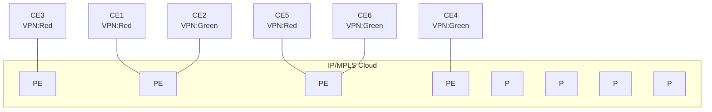

OSSG024

## Example: IP-VPN configuration

The following is an example of an IP-VPN configuration.

```
--{ * candidate shared default }--[  ]--
A:srl1# **info interface ethernet-1/2**
 interface ethernet-1/2 {
  admin-state enable
  subinterface 1 {
   type routed
   admin-state enable
   ipv4 {
    address 10.30.30.1/24 {
    }
   }
  }
 }
A:srl1# **info network-instance Base**
 network-instance Base {
  type default
  protocols {
   bgp {
    admin-state enable
    autonomous-system 65550
    router-id 10.10.10.1
    afi-safi l3vpn-ipv4-unicast {
             admin-state enable
    }
    group base-group {
```

3HE 22247 AAAB TQZZA **© 2026 Nokia.** 238
Use subject to Terms available at: [www.nokia.com/terms](http://www.nokia.com/terms).

Advanced Configuration Guide Release 26.7 Configuring IP-VPN services

```
       }
       neighbor 10.10.10.2 {
                peer-group base-group
       }
      }
     }
    }
    --{ * candidate shared default }--[  ]--
    A:srl1# **info network-instance ip-vrf-red**
    network-instance ip-vrf-red {
     type ip-vrf
     interface ethernet-1/2 {
      interface-ref {
       interface ethernet-1/2
       subinterface 1
      }
     }
     protocols {
      bgp-ipvpn {
       bgp-instance 1 {
                admin-state enable
                ecmp 8
                mpls {
                 next-hop-resolution {
                      allowed-tunnel-types [
                             ldp
                             sr-isis
                      ]
                 }
                }
       }
      }
      bgp {
       admin-state enable
       autonomous-system 65551
       router-id 10.10.10.1
       afi-safi ipv4-unicast {
                admin-state enable
       }
       group ip-vrf-red-peers {
                admin-state enable
                afi-safi ipv4-unicast {
                }
       }
       neighbor 10.10.10.3 {
                peer-group ip-vrf-red-peers
                }
       }
      }
      bgp-vpn {
       bgp-instance 1 {
                route-distinguisher {}
                route-target {}
       }
      }
     }
```


SPACER TEXT

3HE 22247 AAAB TQZZA    **© 2026 Nokia.**    239
Use subject to Terms available at: [www.nokia.com/terms](http://www.nokia.com/terms).

Advanced Configuration Guide Release 26.7 EVPN-VXLAN for layer-2 and multi-homing

# 14 EVPN-VXLAN for layer-2 and multi-homing

Ethernet Virtual Private Network (EVPN) is a standard technology in multi-tenant Data Centers (DCs). EVPN provides a control frame framework for many functions. This chapter details the configuration and operation of an EVPN and VXLAN (EVPN-VXLAN) solution for the following components:

* Bridged sub-Interfaces associated with a specific vlan-id or default sub-interfaces, that capture untagged and non-explicitly configured vlan-tagged frames in tagged sub-interfaces.

* MAC-VRF type network-instances that are EVPN-enabled so that they can use Virtual Extended LAN (VXLAN) tunnels to connect to other MAC-VRFs of the same Broadcast Domains (BD).

* EVPN-VXLAN control and data plane extensions as in [RFC8365], including EVPN route type 2 (MAC/ IP) and route type 2 (Inclusive Multicast Ethernet Tag [IMET]).

* Distributed security and protection for static-macs.

* The MAC duplication mechanism, extended to support EVPN, to provide loop protection.

* EVPN L2 multi-homing, including Ethernet Segment (ES) model configuration for all-active multi- homing.

## 14.1 Overview

EVPN-VXLAN provides Layer-2 connectivity in multi-tenant DCs. EVPN-VXLAN Broadcast Domains (BD) can span several leaf routers connected to the same IP fabric, allowing hosts attached to the same BD to communicate as though they were connected to the same layer-2 switch. VXLAN tunnels bridge the layer-2 frames between leaf routers with EVPN providing the control plane to automatically setup tunnels and use them efficiently.

The following diagram shows this concept. In this example, four leaf routers are attached to the same BD that is instantiated by a MAC-VRF on each leaf. SR Linux leaf routers support standard-based EVPN- VXLAN [RFC8365]; therefore third-party leaf routers (LEAF-4 in this example) can be attached to the same BD as the SR Linux leaf routers as long as they follow standard [RFC8365].

3HE 22247 AAAB TQZZA 240 **© 2026 Nokia.**
Use subject to Terms available at: [www.nokia.com/terms](http://www.nokia.com/terms).

Advanced Configuration Guide Release 26.7 EVPN-VXLAN for layer-2 and multi-homing

Figure 43: EVPN broadcast domain in a multi-tenant DCs

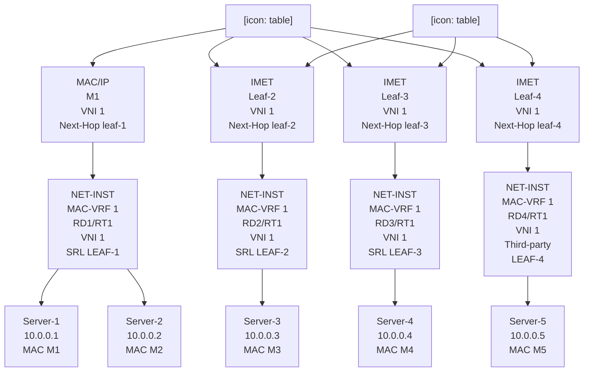

## 14.2 Configuration of EVPN-VXLAN broadcast domains

The following figure shows a configuration example of an EVPN-VXLAN BD that is distributed in multiple leaf nodes in the same DC. The BD is instantiated by MAC-VRF-1 in each of the three leaf nodes. The sections that follow describe how to configure and operate MAC-VRF-1 in each node.

3HE 22247 AAAB TQZZA     **© 2026 Nokia.**     241
Use subject to Terms available at: [www.nokia.com/terms](http://www.nokia.com/terms).

Advanced Configuration Guide Release 26.7 EVPN-VXLAN for layer-2 and multi-homing

Figure 44: Example of EVPN-VXLAN broadcast domain

diagram: EVPN-VXLAN broadcast domain

**14.2.1 Configuring the underlay network**

**About this task**

Before configuring the overlay BD, the underlay connectivity must be configured. In Figure 44: Example of EVPN-VXLAN broadcast domain, the leaf routers are connected to the spines using routed links. A routing protocol is enabled in the default network-instance of each leaf and spine node, so that reachability of all the leaf VXLAN Termination End Point (VTEP) addresses is distributed throughout the IP fabric. In SR Linux, you can use the following for the underlay routing protocol:

• ISIS

• OSPF

• eBGP

The EVPN family must also be enabled for the distribution of EVPN routes among leaf routers of the same tenant. EVPN is enabled using iBGP and typically a Route Reflector (RR), or eBGP.

**Procedure**

To configure the underlay network in this example, configure an eBGP-underlay BGP group to enable the IPv4 and IPv6 unicast families, and configure an iBGP-evpn group for the distribution of the EVPN routes, as shown in the following configuration on LEAF-3. In this case, a full mesh of iBGP EVPN sessions is established among the three leaf routers, but a pair of RRs is typical.

3HE 22247 AAAB TQZZA **© 2026 Nokia.** 242
Use subject to Terms available at: www.nokia.com/terms.

Advanced Configuration Guide Release 26.7 EVPN-VXLAN for layer-2 and multi-homing

**Example: Underlay Configuration**

```
--{ [FACTORY] + candidate shared default }--[ network-instance default ]--
A:dut3# **info**
 type default
 admin-state enable
 description "Default network instance"
 router-id 3.3.3.3
 interface ethernet-1/1.1 {
 }
 interface ethernet-1/3.1 {
 }
 interface system0.0 {
 }
 protocols {
  bgp {
  admin-state enable
  afi-safi ipv4-unicast {
            admin-state enable
  }
  autonomous-system 3333
  router-id 3.3.3.3
  group eBGP-underlay {
            admin-state enable
            export-policy export-all
            import-policy import-all
            timers {
             connect-retry 5
             hold-time 5
             keepalive-interval 2
             minimum-advertisement-interval 2
            }
  }
  group iBGP-evpn {
            admin-state enable
            export-policy export-all
            import-policy import-all
            afi-safi evpn {
             admin-state enable
            }
            local-as as-number 1234 {
            }
            timers {
             minimum-advertisement-interval 1
            }
  }
  afi-safi ipv4-unicast {
            admin-state enable
  }
  afi-safi ipv6-unicast {
            admin-state enable
  }
  neighbor 1.1.1.1 {
            admin-state enable
            peer-as 1234
            peer-group iBGP-evpn
            transport {
             local-address 3.3.3.3
            }
  }
  neighbor 2.2.2.2 {
            admin-state enable
            peer-as 1234
            peer-group iBGP-evpn
```


SPACER TEXT

3HE 22247 AAAB TQZZA    **© 2026 Nokia.**    243
                        Use subject to Terms available at: [www.nokia.com/terms](http://www.nokia.com/terms).

Advanced Configuration Guide Release 26.7 EVPN-VXLAN for layer-2 and multi-homing

```
transport {
      local-address 3.3.3.3
}
}
neighbor 4.4.4.4 {
      admin-state enable
      peer-as 1234
      peer-group iBGP-evpn
      transport {
            local-address 3.3.3.3
      }
}
neighbor 10.2.3.2 {
      admin-state enable
      peer-as 2222
      peer-group eBGP-underlay
}
neighbor 10.3.4.4 {
      admin-state enable
      peer-as 4444
      peer-group eBGP-underlay
}
trace-options {
      flag packets {
         modifier detail
      }
      flag update {
         modifier detail
      }
      flag route {
         modifier detail
      }
      flag socket {
         modifier detail
      }
      flag notification {
         modifier detail
      }
}
}
linux {
export-routes true
export-neighbors true
}
}
```

In the example above, eBGP is used for underlay reachability, and iBGP for overlay EVPN route distribution. The command **local-as** overrides the configuration of the bgp>autonomous-system so that the overlay BGP sessions are established using the same autonomous system in the three leaf routers.

The system0.0 interface hosts the loopback address used to originate and typically terminate VXLAN packets. This address is also used by default as the next-hop of all EVPN routes.

### Example: system0.0 interface configuration

The following example shows the configuration of the system0.0 interface in LEAF-3.

```
--{ [FACTORY] + candidate shared default }--[ interface system0 ]--
A:dut3# **info**
 admin-state enable
 subinterface 0 {
       admin-state enable
```

3HE 22247 AAAB TQZZA 244
**© 2026 Nokia.**
Use subject to Terms available at: [www.nokia.com/terms](http://www.nokia.com/terms).

Advanced Configuration Guide Release 26.7 EVPN-VXLAN for layer-2 and multi-homing

```
ipv4 {
 admin-state enable
 address 3.3.3.3/32 {
 }
}
```

## 14.2.2 Configuring LEAF-3 with an EVPN-VXLAN enabled MAC-VRF

### About this task

After LEAF-3 is configured as defined in Configuring the underlay network, use the following steps to enable EVPN-VXLAN on LEAF-3.

In this example, Ethernet-1/2 connects HOST-3 to LEAF-3. Although this interface could be defined untagged, this example configures the interface as tagged and using vlan-id (vlan-tagging true).

A subinterface with index 1 is created under the interface. The subinterface must be configured as type bridged. Bridged subinterfaces can be associated with MAC-VRF instances so that MAC learning and layer-2 forwarding can be enabled on each.

### Procedure

Step 1. In candidate mode, create the interfaces and bridged subinterfaces to connect LEAF-3 to HOST-3.

**Example**

creation of interfaces/bridged subinterfaces

```
--{ [FACTORY] + candidate shared default }--[ interface ethernet-1/2 ]--
A:dut3# info
   description dut3_host3
   admin-state enable
   vlan-tagging true
   subinterface 1 {
    type bridged
    admin-state enable
    vlan {
         encap {
             single-tagged {
                vlan-id 1
             }
         }
    }
   }
```

In the above example, the subinterface uses vlan-id 1 since this is the VLAN ID used by HOST-3 to send and receive frames. If you wanted HOST-3 to sent and received untagged traffic, the vlan encap command can be configured with either of these options:

• **vlan encap single-tagged vlan-id optional** - where 'optional' captures all traffic when no specific vlan-id has been defined.

• **vlan encap untagged** - where 'untagged' captures traffic with no tags or vlan-tag 0.

Step 2. After creating the access subinterfaces, create the vxlan-interfaces.

This allows MC-VRFs of the same BD to be connected throughout the IP fabric.

3HE 22247 AAAB TQZZA 245
© 2026 Nokia.
Use subject to Terms available at: [www.nokia.com/terms](http://www.nokia.com/terms).

Advanced Configuration Guide Release 26.7

Advanced Configuration Guide Release 26.7 EVPN-VXLAN for layer-2 and multi-homing

**Example**

mac-vrf configuration and bridged interface association

```
--{ [FACTORY] + candidate shared default }--[ network-instance MAC-VRF-1 ]--
A:dut3# **info**
   type mac-vrf
   admin-state enable
   interface ethernet-1/2.1 {
   }
   vxlan-interface vxlan1.1 {
   }
```

**Step 4.** Enable EVPN in the mac-vrf by configuring the bgp-vpn and the bgp-evpn protocol containers:

• bgp-vpn - Provides the configuration of the bgp-instances where the route-distinguisher and the import/export route-targets used for the EVPN routes exist. Import and export policies can be used instead of explicit route-targets. In the current release, only one bgp-instance per network-instance is supported.

• bgp-evpn - Hosts all the commands required to enable EVPN in the network-instance. At a minimum, a reference to bgp-instance 1 is configured, along with the reference to the vxlan- interface (where EVPN is enabled) and the EVI. The EVI or EVPN Instance identifier is a two- byte value that is mandatory, and is used for:

– The auto-derivation of the route-distinguisher (RD). If a manual RD is not configured, the RD is auto-derived as system-ip:evi. Where the system-ip is the IP address configured in the system0.0 subinterface.

– The auto-derivation of the route-target (RT). If a manual RT is not configured, the RT is auto-derived as autonomous-system:evi. The autonomous-system is configured in the default network-instance.

– The value used to represent the MAC-VRF in the DF Election algorithm. See Multi-homing configuration for EVPN broadcast domains.

**Example**

Configure bgp-vpn and bgp-evpn protocol containers

```
--{ [FACTORY] + candidate shared default }--[ network-instance MAC-VRF-1 ]--
A:dut3# **info**
   type mac-vrf
   admin-state enable
   interface ethernet-1/2.1 {
   }
   vxlan-interface vxlan1.1 {
   }
   protocols {
     bgp-evpn {
      bgp-instance 1 {
              admin-state enable
              vxlan-interface vxlan1.1
              evi 1
              ecmp 2
      }
     }
     bgp-vpn {
      bgp-instance 1 {
              route-target {
               export-rt target:1234:1
               import-rt target:1234:1
```

247 3HE 22247 AAAB TQZZA © 2026 Nokia. Use subject to Terms available at: [www.nokia.com/terms](http://www.nokia.com/terms).

Advanced Configuration Guide Release 26.7 EVPN-VXLAN for layer-2 and multi-homing

```
}
}
}
}
```

Each leaf routers is configured with a different autonomous-system number. Therefore, EVI- based auto-derived RTs cannot be used or the three leaf routers would not produce the same import and export route-targets for the MAC-VRFs of the same BD. Therefore, RTs are configured manually.

**Step 5.** Review the changes. If correct, commit the changes.

### Example

```
A:dut2# **commit stay**
--{ candidate shared default }--[ ]--
```

## 14.2.3 Checking the EVPN-VXLAN operation in MAC-VRFs

After all leaf routers attached to the same BD are configured, check the state of the MAC-VRF and connectivity to LEAF-2 and LEAF-3.

## 14.2.3.1 Checking vxlan-interface configuration

### Procedure

Use the **show tunnel-interface vxlan-interface** and **show network-instance vxlan-interface** commands to check that the vxlan-interface is properly configured and associated with the network-instance. If the network-instance vxlan-interface is oper-down, a reason is shown. The egress source-ip shown in the output should match the IPv4 address configured in the subinterface system0.0.

### Example: Check vxlan-interface configuration

<table>
<thead>
<tr><th>Tunnel Interface</th><th>VxLAN Interface</th><th>Type</th><th>Ingress VNI</th><th>Egress source-ip</th></tr>
</thead>
<tbody>
<tr><td>vxlan1</td><td>vxlan1.1</td><td>bridged</td><td>1</td><td>3.3.3.3/32</td></tr>
</tbody>
</table>

A:dut3# **show network-instance MAC-VRF-1 vxlan-interface vxlan1.1**
------------------------------------------------------------------------------------
Show report for network instance "MAC-VRF-1" VxLAN interface table
------------------------------------------------------------------------------------
====================================================================================
Network-instance: MAC-VRF-1
VxLAN-Interface : vxlan1.1

248 3HE 22247 AAAB TQZZA © 2026 Nokia.
Use subject to Terms available at: [www.nokia.com/terms](http://www.nokia.com/terms).

Advanced Configuration Guide Release 26.7 EVPN-VXLAN for layer-2 and multi-homing

Type : bridged
Oper state : up
Oper-down-reason: None
====================================================================================

## 14.2.3.2 Checking mac-vrf, bgp-vpn, and bgp-evpn parameters

**Procedure**

Use the **show network-instance protocols bgp-vpn** and **show network-instance protocols bgp-** **evpn** commands to check that the mac-vrf, bgp-vpn, and bgp-evpn parameters are properly configured. A manual or auto-derived RD/RT must exist, or the bgp-evpn bgp-instance will be oper-down.

### Example: Check mac-vrf, bgp-vpn, and bgp-evpn parameters

**A:dut3# show network-instance MAC-VRF-1 protocols bgp-vpn bgp-instance 1**
===================================================================================
Net Instance : MAC-VRF-1
bgp Instance 1
--------------------------------------------------
route-distinguisher: 3.3.3.3:1, auto-derived-from-evi
export-route-target: target:1234:1, manual
import-route-target: target:1234:1, manual
====================================================================================
================================================================================
--{ [FACTORY] + candidate shared default }--[ ]--
**A:dut3# show network-instance MAC-VRF-1 protocols bgp-evpn bgp-instance 1**
====================================================================================
Net Instance : MAC-VRF-1
bgp Instance 1 is enabled and None
------------------------------------------------------------------------------------
VXLAN-Interface : vxlan1.1
evi : 1
ecmp : 2
default-admin-tag : 0
oper-down-reason : N/A
EVPN Routes
Next hop : None
MAC/IP Routes : None
IMET Routes : None, originating-ip None
====================================================================================
--{ [FACTORY] + candidate shared default }--[ ]--

## 14.2.3.3 Checking VXLAN tunnels

**Procedure**

Use the **show tunnel vxlan-tunnel** command to check for the creation of VXLAN tunnels to the remote VTEPs. After receiving EVPN routes from the remote leaf routers with VXLAN encapsulation, the vxlan_mgr creates VTEPs from the EVPN routes next-hops. Each VTEP gets an index allocated by the fib_mgr (per source and destination tunnel IP addresses) if the next-hop is resolved in the default network-instance. The state of the two remote VTEPs is shown with their own indexes. EVPN routes are received with Next Hops 2.2.2.2 and 4.4.4.4 respectively.

3HE 22247 AAAB TQZZA 249
© 2026 Nokia.
Use subject to Terms available at: [www.nokia.com/terms](http://www.nokia.com/terms).

Advanced Configuration Guide Release 26.7 EVPN-VXLAN for layer-2 and multi-homing

## Example: Check VXLAN tunnels

```
--{ [FACTORY] + candidate shared default }--[ ]--
A:dut3# show tunnel vxlan-tunnel all
---------------------------------------------------------------------------------
Show report for vxlan-tunnels
--------------------------------------------------------------------------------
+--------------+--------------+--------------------------+
| VTEP Address | Index        | Last Change              |
+==============+==============+==========================+
| 2.2.2.2      | 278779228830 | 2021-02-15T11:07:23.000Z |
| 4.4.4.4      | 278779228829 | 2021-02-15T18:15:28.000Z |
+--------------+--------------+--------------------------+
2 VXLAN tunnels, 2 active, 0 inactive
-----------------------------------------------------------
```

## 14.2.3.4 Checking tunnel-table entries

### Procedure

Use the **show network-instance tunnel-table all** command to display all tunnel-table entries. When a VTEP is created in the vxlan-tunnel table and a non-zero index is allocated, a tunnel-table entry is created in the tunnel-table of the default network-instance.

If the next hop is not resolved to a route in the default network-instance route-table, the index in the vxlan-tunnel table shows as 0 for the VTEP and no tunnel-table is created. If the tunnel prefix in the tunnel-table is resolved, but the system runs out of hardware index resources, the tunnel shows in the tunnel-table, but is not programmed. A non-programmed-reason is displayed.

## Example: Check tunnel-table entries

```
--{ [FACTORY] + candidate shared default }--[    ]--
A:dut3# show network-instance default tunnel-table all
-------------------------------------------------------
Show report for network instance "default" tunnel table
------------------------------------------------------------------------------------------------------
+-------------+-----------+-------+-------+--------+------------+----------+-------------------------+
| IPv4 Prefix | Owner     | Type  | Index | Metric | Preference | Fib-prog | Last Update             |
+=============+===========+=======+=======+========+============+==========+=========================+
| 2.2.2.2/32  | vxlan_mgr | vxlan | 4     | 0      | 0          | Y        | 2021-03-01T10:41:38.590Z|
| 4.4.4.4/32  | vxlan_mgr | vxlan | 5     | 0      | 0          | Y        | 2021-03-01T10:45:08.633Z|
+-------------+-----------+-------+-------+--------+------------+----------+-------------------------+
2 VXLAN tunnels, 2 active, 0 inactive
-----------------------------------------------------------------------------------------------------
-----------------------------------------------------------------------------------------------------
Show report for network instance "default" tunnel table
-----------------------------------------------------------------------------------------------------
```

## 14.2.3.5 Checking statistics

### About this task

When the three leaf routers exchange packets over the VXLAN, LEAF-3 displays statistics for all individual VTEPs. Statistics include:

3HE 22247 AAAB TQZZA 250 **© 2026 Nokia.**
Use subject to Terms available at: [www.nokia.com/terms](http://www.nokia.com/terms).

Advanced Configuration Guide Release 26.7 EVPN-VXLAN for layer-2 and multi-homing

* Global-level ingress/egress packets and octets. Global in/out octets and packets are aggregations of the individual statistics per VTEP. ‟in-discarded-packets” are vxlan packets discarded as a result of a non-existent local VNI, packets from a source VTEP are not discovered in the control plan, and packets are not aggregations of individual per VTEP dropped packets

* Per VTEP packets and octets with in/out discarded packets.

**Procedure**

Use the **info from state tunnel vxlan-tunnel** command to check the VTEP statistics.

To clear statistics, use the following command: **tools tunnel vxlan-tunnel vtep 2.2.2.2 statistics clear**

**Example: Check statistics**

```
--{ [FACTORY] + candidate shared default }--[ ]--
A:dut3# info from state tunnel vxlan-tunnel
tunnel {
  vxlan-tunnel {
        vtep 2.2.2.2 {
         index 278779228830
         last-change "8 hours ago"
         statistics {
          in-octets 0
          in-packets 0
          in-discarded-packets 0
          out-octets 0
          out-packets 0
          out-discarded-packets 0
         }
        }
        vtep 4.4.4.4 {
         index 278779228829
         last-change "an hour ago"
         statistics {
          in-octets 555720
          in-packets 5052
          in-discarded-packets 0
          out-octets 0
          out-packets 0
          out-discarded-packets 0
         }
        }
        statistics {
         in-octets 555720
         in-packets 5052
         in-discarded-packets 0
         out-octets 0
         out-packets 0
        }
  }
}
```

## 14.2.3.6 Checking for received IMET routes and multicast destination creation

**About this task**

IMET routes are used for auto-discovery and the creation of the default flood list for vxlan in the MAC-VRF. When LEAF-3 receives and imports the IMET routes from LEAF-2 and LEAF-4, it creates a VXLAN default flood list. BUM frames received on a bridged subinterface are ingress-replicated to the VTEPs on the list.

3HE 22247 AAAB TQZZA    **© 2026 Nokia.**    251
Use subject to Terms available at: [www.nokia.com/terms](http://www.nokia.com/terms).

Advanced Configuration Guide Release 26.7    EVPN-VXLAN for layer-2 and multi-homing

## Procedure

Use the **show** and **info from state** commands shown in the following example to check that the IMET routes for the BD from LEAF-2 and LEAF-4 have been received and they have created multicast destinations in the MAC-VRF. Note that the VNI is received in the PMSI tunnel attribute and not in the route’s Network Layer Reachability Information (NLRI).

## Example: Check for received IMET routes and multicast destination creation

```
--{ [FACTORY] + candidate shared default }--[ ]--
A:dut3# **show network-instance default protocols bgp routes evpn route-type 3 detail**
------------------------------------------------------------------------------------
Show report for the EVPN routes to network "*" network-instance "default"
------------------------------------------------------------------------------------
Route Distinguisher: 2.2.2.2:1
Tag-ID              : 0
Originating router : 2.2.2.2
neighbor            : 2.2.2.2
Received paths      : 1
     Path 1: <Best,Valid,Used,>
 VNI                 : 1
 Route source        : neighbor 2.2.2.2 (last modified 9h11m44s ago)
 Route preference: No MED, LocalPref is 100
 Atomic Aggr         : false
 BGP next-hop        : 2.2.2.2
 AS Path             : i
 Communities         : [target:1234:1, bgp-tunnel-encap:VXLAN]
 RR Attributes       : No Originator-ID, Cluster-List is []
 Aggregation         : None
 Unknown Attr        : None
 Invalid Reason : None
 Tie Break Reason: none
------------------------------------------------------------------------------------
Route Distinguisher: 4.4.4.4:1
Tag-ID              : 0
Originating router : 4.4.4.4
neighbor            : 4.4.4.4
Received paths      : 1
     Path 1: <Best,Valid,Used,>
 VNI                 : 1
 Route source        : neighbor 4.4.4.4 (last modified 9h11m44s ago)
 Route preference: No MED, LocalPref is 100
 Atomic Aggr         : false
 BGP next-hop        : 4.4.4.4
 AS Path             : i
 Communities         : [target:1234:1, bgp-tunnel-encap:VXLAN]
 RR Attributes       : No Originator-ID, Cluster-List is []
 Aggregation         : None
 Unknown Attr        : None
 Invalid Reason : None
 Tie Break Reason: none
------------------------------------------------------------------------------------
--{ [FACTORY] + candidate shared default }--[        ]--
--{ [FACTORY] + candidate shared default }--[        ]--
A:dut3# **info from state network-instance default bgp-rib evpn rib-in-out rib-in-post imet‐**
**routes * originating-router * ethernet-tag-id * neighbor ***
 network-instance default {
           bgp-rib {
             evpn {
                   rib-in-out {
                     rib-in-post {
                        imet-routes 2.2.2.2:1 originating-router 2.2.2.2 ethernet- tag-id
0 neighbor 2.2.2.2 {
```

3HE 22247 AAAB TQZZA    **© 2026 Nokia.**    252
                        Use subject to Terms available at: [www.nokia.com/terms](http://www.nokia.com/terms).

Advanced Configuration Guide Release 26.7 EVPN-VXLAN for layer-2 and multi-homing

```
                       attr-id 193
                       last-modified 2021-02-15T11:07:21.500Z
                       used-route true
                       valid-route true
                       best-route true
                       stale-route false
                       pending-delete false
                       tie-break-reason none
                       invalid-reason {
                              rejected-route false
                              as-loop false
                              next-hop-unresolved false
                              cluster-loop false
                       }
                    }
                    imet-routes 4.4.4.4:1 originating-router 4.4.4.4 ethernet-tag-id 0
neighbor 4.4.4.4 {
                       attr-id 197
                       last-modified 2021-02-15T11:07:21.500Z
                       used-route true
                       valid-route true
                       best-route true
                       stale-route false
                       pending-delete false
                       tie-break-reason none
                       invalid-reason {
                              rejected-route false
                              as-loop false
                              next-hop-unresolved false
                              cluster-loop false
                       }
                    }
                  }
}
}
}
}
--{ [FACTORY] + candidate shared default }--[  ]--
A:dut3# **info from state network-instance default bgp-rib attr-sets attr-set rib-in index**
**{193,197}**
network-instance default {
 bgp-rib {
         attr-sets {
         attr-set rib-in index 193 {
                  origin igp
                  atomic-aggregate false
                  next-hop 2.2.2.2
                  med 0
                  local-pref 100
                  aggregator {
                  }
                  pmsi-tunnel {
                    tunnel-type ingress-replication
                    vni 1
                    tunnel-endpoint 2.2.2.2
                  }
                  communities {
                    ext-community [
                       target:1234:1
                       bgp-tunnel-encap:VXLAN
                    ]
                  }
                  unknown-attributes {
                  }
```


</page_footer>

SPACER TEXT

<page_footer>3HE 22247 AAAB TQZZA    **© 2026 Nokia.**    253
Use subject to Terms available at: [www.nokia.com/terms](http://www.nokia.com/terms).

Advanced Configuration Guide Release 26.7 EVPN-VXLAN for layer-2 and multi-homing

```
}
attr-set rib-in index 197 {
 origin igp
 atomic-aggregate false
 next-hop 4.4.4.4
 med 0
 local-pref 100
 aggregator {
 }
 pmsi-tunnel {
  tunnel-type ingress-replication
  vni 1
  tunnel-endpoint 4.4.4.4
 }
 communities {
  ext-community [
      target:1234:1
      bgp-tunnel-encap:VXLAN
  ]
 }
 unknown-attributes {
 }
}
}
}
}
```

### 14.2.3.7 Checking for multicast-destinations

### About this task

If the IMET routes from LEAF-2 and LEAF-4 are imported for MAC-VRF-1, the corresponding multicast VXLAN destinations are added.

### Procedure

Use the **show tunnel-interface vxlan-interface bridge-table multicast-destinations** command to check the multicast VXLAN destinations are added.

### Example: Check for multicast-destinations

<table>
<thead>
<tr><th>VTEP Address</th><th>Egress VNI</th><th>Destination-index</th><th>Multicast-forwarding</th></tr>
</thead>
<tbody>
<tr><td>2.2.2.2</td><td>1</td><td>278779228840</td><td>BUM</td></tr>
<tr><td>4.4.4.4</td><td>1</td><td>278779228838</td><td>BUM</td></tr>
</tbody>
</table>

3HE 22247 AAAB TQZZA 254
© 2026 Nokia.
Use subject to Terms available at: [www.nokia.com/terms](http://www.nokia.com/terms).

Advanced Configuration Guide Release 26.7 EVPN-VXLAN for layer-2 and multi-homing

## 14.2.3.8 Checking mac-table and MAC/IP routes

### Procedure

When traffic is exchanged between HOST-3 and HOST-12, the MACs are learned on the access bridged sub-interfaces and advertised in MAC/IP routes. The MAC/IP routes are imported, and the MACs programmed in the mac-table. Use the **show network-instance bridge-table mac-table all** and **show network-instance protocols bgp routes evpn route-type summary** commands to check the MAC/IP routes and the programmed MACs.

### Example: Check mac-table and MAC/IP routes

<table>
<thead>
<tr><th>Address</th><th>Destination</th><th>Dest Index</th><th>Type</th><th>Active</th><th>Aging</th><th>Last Update</th></tr>
<tr><th>Address</th><th>Destination</th><th>Dest Index</th><th>Type</th><th>Active</th><th>Aging</th><th>Last Update</th></tr>
</thead>
<tbody>
<tr><td>00:00:00:00:00:01</td><td>vxlan-interface:vxlan1.1<br />esi:01:24:24:24:24:24:24:00:00:01</td><td>2787792288<br />46</td><td>evpn</td><td>true</td><td>N/A</td><td>2021-02-16T10:54:54.000Z</td></tr>
<tr><td>00:00:00:00:00:02</td><td>vxlan-interface:vxlan1.1<br />vtep:2.2.2.2 vni:1</td><td>2787792288<br />40</td><td>evpn</td><td>true</td><td>N/A</td><td>2021-02-16T10:54:54.000Z</td></tr>
<tr><td>00:00:00:00:00:03</td><td>ethernet-1/2.1</td><td>12</td><td>learnt</td><td>true</td><td>300</td><td>2021-02-16T10:54:54.000Z</td></tr>
<tr><td>00:00:00:00:00:04</td><td>vxlan-interface:vxlan1.1<br />vtep:4.4.4.4 vni:1</td><td>2787792288<br />38</td><td>evpn</td><td>true</td><td>N/A</td><td>2021-02-16T10:54:54.000Z</td></tr>
</tbody>
</table>

<table>
<thead><tr><th rowspan="2">Status</th><th>Route-dis-</th><th>Tag</th><th rowspan="2">MAC-address</th><th>IP-</th><th rowspan="2">Neighbor</th><th>Next-</th><th rowspan="2">VNI</th><th rowspan="2">ESI</th><th>MAC</th></tr><tr><th>tinguisher</th><th>ID</th><th>address</th><th>Hop</th><th>Mob.</th></tr></thead>
<tbody>
<tr><td>u*></td><td>2.2.2.2:1</td><td>0</td><td>00:00:00:00:00:02</td><td>0.0.0.0</td><td>2.2.2.2</td><td>2.2.2.2</td><td>1</td><td>00:00:00:00:00:00:00:00:00:00</td><td>-</td></tr>
<tr><td>u*></td><td>4.4.4.4:1</td><td>0</td><td>00:00:00:00:00:01</td><td>0.0.0.0</td><td>4.4.4.4</td><td>4.4.4.4</td><td>1</td><td>01:24:24:24:24:24:24:00:00:01</td><td>-</td></tr>
<tr><td>u*></td><td>4.4.4.4:1</td><td>0</td><td>00:00:00:00:00:04</td><td>0.0.0.0</td><td>4.4.4.4</td><td>4.4.4.4</td><td>1</td><td>00:00:00:00:00:00:00:00:00:0</td><td>-</td></tr>
</tbody>
</table>

3HE 22247 AAAB TQZZA © 2026 Nokia. Use subject to Terms available at: www.nokia.com/terms. 255

Advanced Configuration Guide Release 26.7 EVPN-VXLAN for layer-2 and multi-homing

```
3 MAC-IP Advertisement routes 3 used, 3 valid
------------------------------------------------------------------------------------------------------
--{ [FACTORY] + candidate shared default }--[  ]--
```

## 14.2.3.9 Checking unicast destinations

### About this task

The reception of MAC/IP routes also creates unicast destinations in the vxlan-interface. In some cases, the unicast destinations are Ethernet Segment (ES) destinations if the MAC/IP routes are advertised from an ES. See Multi-homing configuration for EVPN broadcast domains for details.

### Procedure

Use the **show tunnel-interface vxlan-interface bridge-table unicast-destinations** command to display the unicast destinations.

### Example: Check unicast destinations

<table>
<thead>
<tr><th>VTEP Address</th><th>Egress VNI</th><th>Destination-index</th><th>Number MACs (Active/Failed)</th></tr>
</thead>
<tbody>
<tr><td>2.2.2.2</td><td>1</td><td>278779228840</td><td>1(1/0)</td></tr>
<tr><td>4.4.4.4</td><td>1</td><td>278779228838</td><td>1(1/0)</td></tr>
</tbody>
</table>

<table>
<thead>
<tr><th>ESI</th><th>Destination-index</th><th>VTEPs</th><th>Number MACs (Active/Failed)</th></tr>
</thead>
<tbody>
<tr><td>01:24:24:24:24:24:24:00:00:01</td><td></td><td>2.2.2.2, 4.4.4.4</td><td>0(0/0)</td></tr>
</tbody>
</table>

## 14.2.4 Checking MAC mobility, MAC protection and MAC loop protection in EVPN-VXLAN BDs

MAC mobility and MAC protection are implemented following [RFC7432]. MAC loop protection follows [draft-ietf-bess-rfc7432bis].

3HE 22247 AAAB TQZZA 256
© 2026 Nokia.
Use subject to Terms available at: www.nokia.com/terms.

Advanced Configuration Guide Release 26.7 EVPN-VXLAN for layer-2 and multi-homing

# 14.2.4.1 Checking MAC mobility

## About this task

MAC Mobility is an event that triggers the fast move and re-learn of a MAC in a different leaf router. Mobility is common in DCs with some workloads moving between racks in the same DC. EVPN provides tools for fast mobility because MAC/IP routes are advertised with a sequence number that indicates the latest location of a MAC. This sequence number is used by the leaf routers to program the MAC with the correct VXLAN destination.

## Procedure

To check MAC mobility, use the **show network-instance bridge-table mac-table** command.

## Example: MAC mobility (1 of 2)

Using Figure 44: Example of EVPN-VXLAN broadcast domain as reference, if HOST-2 moves from LEAF-2 to LEAF-3, and you review the programming of the MAC in LEAF-4, MAC 00:00:00:00:00:02 is learned against VXLAN destination vtep:2.2.2.2 vni:1:

<table>
<thead>
<tr><th>Address</th><th>Destination</th><th>Dest Index</th><th>Type</th><th>Active</th><th>Aging</th><th>Last Update</th></tr>
</thead>
<tbody>
<tr><td>00:00:00:00:00:01</td><td>lag1.1</td><td>11</td><td>learnt</td><td>true</td><td>300</td><td>2021-02-16T11:<br />32:14.000Z</td></tr>
<tr><td>00:00:00:00:00:02</td><td>vxlan-interface:vxlan1.1<br />vtep:2.2.2.2 vni:1</td><td>2787793311<br />82</td><td>evpn</td><td>true</td><td>N/A</td><td>2021-02-16T11:<br />32:15.000z</td></tr>
<tr><td>00:00:00:00:00:03</td><td>vxlan-interface:vxlan1.1<br />vtep:3.3.3.3 vni:1</td><td>2787793311<br />84</td><td>evpn</td><td>true</td><td>N/A</td><td>2021-02-16T11:<br />32:15.000Z</td></tr>
<tr><td>00:00:00:00:00:04</td><td>ethernet-1/13.1</td><td>13</td><td>learnt</td><td>true</td><td>300</td><td>2021-02-16T11:<br />32:14.000Z</td></tr>
<tr><td>00:CA:FE:CA:FE:04</td><td>ethernet-1/13.1</td><td>13</td><td>static</td><td>true</td><td>N/A</td><td>2021-02-16T11:<br />10:26.000Z</td></tr>
<tr><td colspan="7">Total Irb Macs : 0 Total 0 Active</td></tr>
<tr><td colspan="7">Total Static Macs : 1 Total 1 Active</td></tr>
<tr><td colspan="7">Total Duplicate Macs : 0 Total 0 Active</td></tr>
<tr><td colspan="7">Total Learnt Macs : 2 Total 2 Active</td></tr>
<tr><td colspan="7">Total Evpn Macs : 2 Total 2 Active</td></tr>
<tr><td colspan="7">Total Evpn static Macs : 0 Total 0 Active</td></tr>
<tr><td colspan="7">Total Irb anycast Macs : 0 Total 0 Active</td></tr>
<tr><td colspan="7">Total Macs : 5 Total 5 Active</td></tr>
</tbody>
</table>

## Example: MAC mobility (2 of 2)

After the mobility event, LEAF-4 receives the MAC with a higher sequence number. This makes LEAF-4 reprogram the MAC against LEAF-3 as shown below:

```
2021-02-16T03:33:53.505253-08:00 dut4 local6|DEBU sr_bgp_mgr: bgp|4959|5178|402506|D: VR default (1) Peer 1: 3.3.3.3 UPDATE: Peer 1: 3.3.3.3 - Received BGP UPDATE: Withdrawn Length = 0 Total Path Attr Length = 96 Flag: 0x90 Type: 14 Len: 44 Multiprotocol Reachable NLRI: Address Family EVPN
```

3HE 22247 AAAB TQZZA © **2026 Nokia.** Use subject to Terms available at: www.nokia.com/terms. 257

Advanced Configuration Guide Release 26.7 EVPN-VXLAN for layer-2 and multi-homing

NextHop len 4 NextHop 3.3.3.3
Type: EVPN-MAC Len: 33 RD: 3.3.3.3:1 ESI: ESI-0, tag: 0, mac len: 48 mac: 00:00:00:00:00:02,
IP len: 0, IP: NULL, label1: 1
Flag: 0x40 Type: 1 Len: 1 Origin: 0
Flag: 0x40 Type: 2 Len: 0 AS Path:
Flag: 0x80 Type: 4 Len: 4 MED: 0
Flag: 0x40 Type: 5 Len: 4 Local Preference: 100
Flag: 0xc0 Type: 16 Len: 24 Extended Community:
target:1234:1
bgp-tunnel-encap:VXLAN
mac-mobility:Seq:1
--{ [FACTORY] + candidate shared default }--[ ]--

**A:dut4# show network-instance MAC-VRF-1 bridge-table mac-table all**

Mac-table of network instance MAC-VRF-1

<table>
<thead>
<tr><th>Address</th><th>Destination</th><th>Dest Index</th><th>Type</th><th>Active</th><th>Aging</th><th>Last Update</th></tr>
</thead>
<tbody>
<tr><td>00:00:00:00:00:01</td><td>lag1.1</td><td>11</td><td>learnt</td><td>true</td><td>180</td><td>2021-02-16T11:32:14.000Z</td></tr>
<tr><td>00:00:00:00:00:02</td><td>vxlan-interface:vxlan1.1<br />vtep:3.3.3.3 vni:1</td><td>2787793311<br />84</td><td>evpn</td><td>true</td><td>N/A</td><td>2021-02-16T11:33:54.000Z</td></tr>
<tr><td>00:00:00:00:00:03</td><td>vxlan-interface:vxlan1.1<br />vtep:3.3.3.3 vni:1</td><td>2787793311<br />84</td><td>evpn</td><td>true</td><td>N/A</td><td>2021-02-16T11:32:15.000Z</td></tr>
<tr><td>00:00:00:00:00:04</td><td>ethernet-1/13.1</td><td>13</td><td>learnt</td><td>true</td><td>180</td><td>2021-02-16T11:32:14.000Z</td></tr>
<tr><td>00:CA:FE:CA:FE:04</td><td>ethernet-1/13.1</td><td>13</td><td>static</td><td>true</td><td>N/A</td><td>2021-02-16T11:10:26.000Z</td></tr>
</tbody>
</table>

<table>
<thead>
<tr><th></th><th>Total</th><th>Active</th></tr>
</thead>
<tbody>
<tr><td>Total Irb Macs</td><td>0</td><td>0</td></tr>
<tr><td>Total Static Macs</td><td>1</td><td>1</td></tr>
<tr><td>Total Duplicate Macs</td><td>0</td><td>0</td></tr>
<tr><td>Total Learnt Macs</td><td>2</td><td>2</td></tr>
<tr><td>Total Evpn Macs</td><td>3</td><td>3</td></tr>
<tr><td>Total Evpn static Macs</td><td>0</td><td>0</td></tr>
<tr><td>Total Irb anycast Macs</td><td>0</td><td>0</td></tr>
<tr><td>Total Macs</td><td>5</td><td>5</td></tr>
</tbody>
</table>

--{ [FACTORY] + candidate shared default }--[ ]--

# 14.2.4.2 Checking MAC protection
## About this task

MAC protection refers to the property of a MAC that does not move between leaf routers. It is always learned against a bridged subinterface. You can configure this MAC as static, but be aware of the following:

• When a MAC is programmed as static, the same MAC cannot be learned in another sub-interace or via EVPN. If frames arriving on an interface are different than the ones associated with the static MAC, they are discarded.

• The MAC is now advertised as static in EVPN and installed as evpn-static in the leaf routers attached to the same BD. If programmed, evpn-static MACs are also protected. Therefore, frames arriving on a local subinterface are discarded if their source MAC matches an evpn-static MAC.

3HE 22247 AAAB TQZZA 258 **© 2026 Nokia.**
Use subject to Terms available at: www.nokia.com/terms.

Advanced Configuration Guide Release 26.7 EVPN-VXLAN for layer-2 and multi-homing

## Procedure

To program a MAC as static, use the **network-instance bridge-table static-mac** command.

## Example: MAC protection (1 of 2)

Using Figure 44: Example of EVPN-VXLAN broadcast domain as reference, the following example shows MAC 00:ca:fe:ca:fe:04 configured as static in LEAF-4.

```
--{ [FACTORY] +* candidate shared default }--[ network-instance MAC-VRF-1 bridge-table ]--
A:dut4# **info**
    static-mac {
       mac 00:CA:FE:CA:FE:04 {
               destination ethernet-1/13.1
       }
    }
--{ [FACTORY] +* candidate shared default }--[ network-instance MAC-VRF-1 bridge-table ]--
A:dut4# **commit stay**
All changes have been committed. Starting new transaction.
--{ [FACTORY] + candidate shared default }--[ network-instance MAC-VRF-1 bridge-table ]--
A:dut4#
--{ [FACTORY] + candidate shared default }--[ network-instance MAC-VRF-1 bridge-table ]--
A:dut4# **/show network-instance MAC-VRF-1 bridge-table mac-table all**
-----------------------------------------------------------------------------------------
Mac-table of network instance MAC-VRF-1
--------------------------------------------------------------------------------------------
```

<table>
<thead>
<tr><th>Address</th><th>Destination</th><th>Dest Index</th><th>Type</th><th>Active</th><th>Aging</th><th>Last Update</th></tr>
</thead>
<tbody>
<tr><td>00:00:00:00:00:01</td><td>lag1.1</td><td>11</td><td>learnt</td><td>true</td><td>180</td><td>2021-02-16T11:08:10.000Z</td></tr>
<tr><td>00:00:00:00:00:02</td><td>vxlan-interface:vxlan1.1<br />vtep:2.2.2.2 vni:1</td><td>2787793311<br />82</td><td>evpn</td><td>true</td><td>N/A</td><td>2021-02-16T11:08:11.000Z</td></tr>
<tr><td>00:00:00:00:00:03</td><td>vxlan-interface:vxlan1.1<br />vtep:3.3.3.3 vni:1</td><td>2787793311<br />84</td><td>evpn</td><td>true</td><td>N/A</td><td>2021-02-16T11:08:11.000Z</td></tr>
<tr><td>00:00:00:00:00:04</td><td>ethernet-1/13.1</td><td>13</td><td>learnt</td><td>true</td><td>180</td><td>2021-02-16T11:08:10.000Z</td></tr>
<tr><td>00:CA:FE:CA:FE:04</td><td>ethernet-1/13.1</td><td>13</td><td>static</td><td>true</td><td>N/A</td><td>2021-02-16T11:10:26.000Z</td></tr>
</tbody>
</table>
```
Total Irb Macs              :     0 Total     0 Active
Total Static Macs           :     1 Total     1 Active
Total Duplicate Macs        :     0 Total     0 Active
Total Learnt Macs           :     2 Total     2 Active
Total Evpn Macs             :     2 Total     2 Active
Total Evpn static Macs      :     0 Total     0 Active
Total Irb anycast Macs      :     0 Total     0 Active
Total Macs                  :     5 Total     5 Active
---------------------------------------------------------------------------------------------------
--{ [FACTORY] + candidate shared default }--[ network-instance MAC-VRF-1 bridge-table ]--
```

## Example: MAC protection (2 of 2)

On the remote leaf routers, the MAC is received as evpn-static and programmed this way. For example, LEAF-4 receives the route and programs it as follows:

```
2021-02-16T03:10:27.402653-08:00 dut3 local6|DEBU sr_bgp_mgr: bgp|4628|4789|270039|D:
VR default (1) Peer 1: 4.4.4.4 UPDATE: Peer 1: 4.4.4.4 - Received BGP UPDATE:
    Withdrawn Length = 0
    Total Path Attr Length = 96
    Flag: 0x90 Type: 14 Len: 44 Multiprotocol Reachable NLRI:
       Address Family EVPN
       NextHop len 4 NextHop 4.4.4.4
```


3HE 22247 AAAB TQZZA      **© 2026 Nokia.**      259

Advanced Configuration Guide Release 26.7 EVPN-VXLAN for layer-2 and multi-homing

```
Type: EVPN-MAC Len: 33 RD: 4.4.4.4:1 ESI: ESI-0, tag: 0, mac len: 48 mac:
   00:ca:fe:ca:fe:04, IP len: 0, IP: NULL, label1: 1
Flag: 0x40 Type: 1 Len: 1 Origin: 0
Flag: 0x40 Type: 2 Len: 0 AS Path:
Flag: 0x80 Type: 4 Len: 4 MED: 0
Flag: 0x40 Type: 5 Len: 4 Local Preference: 100
Flag: 0xc0 Type: 16 Len: 24 Extended Community:
   target:1234:1
   bgp-tunnel-encap:VXLAN
   mac-mobility:Seq:0/Static
--{ [FACTORY] + candidate shared default }--[ ]--
A:dut3# **show network-instance MAC-VRF-1 bridge-table mac-table all**
------------------------------------------------------------------------------------------------------
-
Mac-table of network instance MAC-VRF-1
------------------------------------------------------------------------------------------------------
-
```

<table>
<thead>
<tr><th>Address</th><th>Destination</th><th>Dest Index</th><th>Type</th><th>Active</th><th>Aging</th><th>Last Update</th></tr>
</thead>
<tbody>
<tr><td>00:CA:FE:CA:<br />FE:04</td><td>vxlan-interface:vxlan1.1<br />vtep:4.4.4.4 vni:1</td><td>2787792288<br />38</td><td>evpn-static</td><td>true</td><td></td><td>2021-02-16T11:<br />10:27.000Z</td></tr>
</tbody>
</table>

```
Total Irb Macs                   :     0 Total     0 Active
Total Static Macs                :     0 Total     0 Active
Total Duplicate Macs             :     0 Total     0 Active
Total Learnt Macs                :     0 Total     0 Active
Total Evpn Macs                  :     0 Total     0 Active
Total Evpn static Macs           :     1 Total     1 Active
Total Irb anycast Macs           :     0 Total     0 Active
Total Macs                       :     1 Total     1 Active
-----------------------------------------------------------------------------------------------------
--{ [FACTORY] + candidate shared default }--[
```

Note that the static MACs state depends on the state of the subinterface which they are configured against. If the subinterface goes oper-down, the static MAC and EVPN route are removed. Static Blackhole MACs (where the configured destination is blackhole) also behave as static MACs and are advertised as evpn-static.

## 14.2.4.3 MAC loop protection

MAC loop protection in EVPN BDs is based on the SR Linux MAC Duplication feature. This feature detects MAC duplication for MACs moving:

• among bridge sub-interfaces of the same MAC-VRF

• between bridge sub-interfaces and EVPN (in the same MAC-VRF)

It does not detect MAC duplication for MACs moving from one VTEP to a different VTEP in the same MAC- VRF. In addition, when a MAC is declared as a duplicate:

• If the blackhole configuration option is added to the interface, incoming frames on bridged sub- interfaces are discarded if their MAC SA or DA match the blackhole MAC. Frames encapsulated in VXLAN packets are discarded if their inner source MAC or destination MAC match the blackhole MAC in the mac-table.

• The "duplicate" MAC can be overwritten by a higher priority type (for example, static or evpn-static) or flushed by a tools command. Blackhole MACs that result out of duplicate MACs are advertised as regular MACs (non-static).

3HE 22247 AAAB TQZZA **© 2026 Nokia.** 260
Use subject to Terms available at: www.nokia.com/terms.

Advanced Configuration Guide Release 26.7 EVPN-VXLAN for layer-2 and multi-homing

# 14.3 Multi-homing configuration for EVPN broadcast domains

SR Linux supports all-active multi-homing for multi-homed peers connected using VXLAN, as per RFC8365.

Using Figure 44: Example of EVPN-VXLAN broadcast domain as a reference, LEAF-2 and LEAF-3 are multi-homed to server-1 using all-active multi-homing. The representation of the multi-homed device in the EVPN control plane is referred to as an Ethernet Segment (ES). It is considered "all-active" and not "active-active", because SR Linux supports up to four leaf routers multi-homed to the same CE or server with all links being active (not just two).

The all-active multi-homing function relies on three different procedures to handle multi-homing in the ES:

• Designated Forwarder (DF) election

• Split-Horizon (also known as Local-Bias)

• Aliasing

The DF is the leaf that forwards BUM traffic received from the VXLAN into the ES (to the server). Only one DF exists per ES and network-instance, and it is elected based on the exchange of ES routes (EVPN routes type 4) and the subsequent DF election algorithm. All leaf routers, DF and non-DF, forward known-unicast traffic to the multi-homed server.

The split-horizon or local bias is the procedure that avoids looped packets on the server. If server-1 hashes the BUM traffic to the non-DF leaf (for example, LEAF-2), without any split-horizon technique, the flooded BUM packets move to the DF (LEAF-4) and back to server-1. Split-horizon prevents these flooded packets from forwarding back to server-1. When the data plane is VXLAN, the split-horizon mechanism is based on a "local-bias" forwarding mode as defined in RFC8365. This implies that:

• BUM traffic from a local subinterface is always forwarded to the ES, irrespective of the PE being DF. For example, if HOST-2 sends a broadcast frame, it is sent to the ES (lag1.1) even though LEAF- is non-DF for ES-1.

• BUM traffic received over VXLAN is never be forwarded to the ES if the source VTEP matches a leaf that is attached to the same ES. For example, BUM traffic from HOST-2 that is forwarded via VXLAN to LEAF-4 is not forwarded to lag1.1, only to Ethernet-1/13.1.

Aliasing is the procedure that allows ecmp (load-balancing) from remote leaf routers (LEAF-3) to all leaf routers attached to the same ES, even though the MAC is only advertised by one of the leaf routers in the ES. For example, in Figure 44: Example of EVPN-VXLAN broadcast domain, flows from 00:00:00:00:00:01 can only be hashed to LEAF-2. LEAF-2 is the only router in the ES advertising the MAC. However, because LEAF-2 and LEAF-4 advertise the association to the same Ethernet Segment Identifier (ESI), and the MAC/IP route for 00:00:00:00:00:01 is tagged with ESI-1, LEAF-3 can "alias" the unicast traffic to both leaf routers.

Note that a leaf advertises its association to an ES via AD per ES routes, and its association to an ES for a specified MAC-VRF via AD per EVI routes. Both are EVPN routes type 1.

# 14.3.1 All-active multi-homing configurations

Configuration of all-active multi-homing involves four major steps:

• Configuring the server/CE with a single LAG that connects it to the leaf routers.

• Configuring an ES (ES-1) on the leaf routers (LEAF-2 and LEAF-4)

3HE 22247 AAAB TQZZA      **© 2026 Nokia.**      261
Use subject to Terms available at: [www.nokia.com/terms](http://www.nokia.com/terms).

Advanced Configuration Guide Release 26.7 EVPN-VXLAN for layer-2 and multi-homing

* Associating the ES interface with the MAC-VRF.

* Optional: Configuring the ecmp with a value greater than 1 in all the leaf routers attached to the same BD (for aliasing). This step is only required if multi-homing is used in an EVPN-VXLAN BD distributed among multiple leaf routers.

## 14.3.1.1 Ethernet segment configuration details

With SR Linux, ESs are control plane entities that reside in the system network-instance. The system network-instance contains a BGP-VPN instance similar to the one in mac-vrfs. This instance hosts the bgp information used by EVPN for multi-homing routes, and the ES configuration and state.

The following example provides ES configuration details.

```
--{ [FACTORY] + candidate shared default }--
   [ system network-instance protocols evpn ethernet-segments ]--
A:dut4# **tree detail**
ethernet-segments!+     evpn_mgr
+-- timers   evpn_mgr
|  +-- boot-timer?      evpn_mgr
|  +-- activation-timer?        evpn_mgr
+-- bgp-instance* [id]    evpn_mgr
   +-- ethernet-segment* [name]   evpn_mgr
    +-- admin-state?         evpn_mgr
    +-- esi?            evpn_mgr
    +-- interface?        evpn_mgr
    +-- multi-homing-mode?        evpn_mgr
    +-- df-election        evpn_mgr
    |        +-- timers   evpn_mgr
    |        |  +-- activation-timer?   evpn_mgr
```

The ES model uses a BGP-VPN instance where the route-distinguisher and export/import route-targets are taken by BGP and used for the ES routes. Only one instance is allowed, and all ESs live under this BGP instance. The default route-distinguisher for the instance is automatically derived from system-ip:0 and used in ES routes.

The default import/export route-target is automatically derived from the ESI (bytes 1 to 6; from the second highest order byte up to the seventh byte). This route-target is of type ESI-import route-target (as per [RFC7432]) and is used in ES routes to ensure they are imported on Leaf routers attached to the ES.

ESs have an admin-state this is disabled by default. It must be toggled to change any of the parameters affecting the EVPN control plane.

The following timers can be configures for ESs: general boot, per ES boot, and activation:

* The boot-timer is configured globally for all ESs. This allows the system to synchronize with the rest of the network at reboot, and before the ES is brought up and its route is advertised.

* Before a boot-timer expires, the ES subinterfaces are oper-up and the AD routes advertised. In all- active mode, they forward unicast traffic; BUM is not forwarded until the ES subinterfaces become DF. When the boot-timer expires, the ES route is advertised, and the DF election takes place.

* The boot-timer can be configured with a value of 0-6000 seconds. Because it is linked to the evpn_mgr application, the boot-timer kicks in when the evpn_mgr restarts. It is recommended that you configure a timer that is long enough for the node to establish its BGP sessions and underlay connectivity before it expires, use some transient BUM duplication).and ES routes are exchanged.

* The ES activation timer allows collecting ES routes for the same ES from other leaf routers before promoting a node subinterface as DF. This prevents multiple transient DF leaf routers on the same ES,

3HE 22247 AAAB TQZZA 262 **© 2026 Nokia.**
Use subject to Terms available at: www.nokia.com/terms.

Advanced Configuration Guide Release 26.7 EVPN-VXLAN for layer-2 and multi-homing

and BUM duplication to the server/CE. The ES activation timer defaults to 3 seconds, but can be set to 0 if fast convergence is needed (although this may cause some transient BUM duplication).

The ES requires a manual 10-byte ESI configuration. Reserved ESI values such as ESI-0 or MAX-ESI (0xFF..FF) are not allowed. ESI values with 00-00-00-00-00-00 in bytes 1-6 are not allowed. This prevents the auto-derivation of ESI-import route-targets as all 0s.

SR Linux supports the default DF election algorithm, as per [RFC8584]. No configuration is required.

• The algorithm (also known as type Default or type 0) is a modulo-based operation that uses the number of leafs in the ES and the configured EVI values in the contained mac-vrfs.

• The default alg orders the candidate list from lowest to highest IP address (where the IP address is taken from the originating-ip of the ES routes), and picks up an ordinal of the list based on the outcome of the modulo operation.

• If the mac-vrf instances in the ES have consecutive EVI values, load balancing of the DF function occurs. For example, if mac-vrf-1 has a value of EVI=1, mac-vrf-2 is EVI=2. Both have subinterfaces in lag1 that belong to ES-1; one of the mac-vrfs is DF and the other is non-DF for ES-1.

The ES association to an interface must be configured. The interface type can be Ethernet or LAG. If LACP is used on the CE, as shown in Figure 44: Example of EVPN-VXLAN broadcast domain, only a LAG can be associated.

## 14.3.2 Configuring LEAF-2 and LEAF-4 as multi-homed nodes to server-1

### About this task

LEAF-2 and LEAF-4 behave as a single system to server-1. Therefore, they must be configured with the same LACP parameters for the LAG on server-1 to come up. The admin-key, system-id-mac, and system-priority must match on both leaf routers so that the LAG comes up.

### Procedure

**Step 1.** In candidate mode, configure the LAG that connects to server-1.

The LAG can be LACP enabled or static. In this example, LACP is used.

### Example

LAG configuration (LAG1 on LEAF-4)

```
--{ [FACTORY] + candidate shared default }--[  ]--
A:dut4# **interface ethernet-1/4**
--{ [FACTORY] + candidate shared default }--[ interface ethernet-1/4 ]--
A:dut4# **info**
 description ES-1
 ethernet {
      aggregate-id lag1
 }
--{ [FACTORY] + candidate shared default }--[ interface ethernet-1/4 ]--
A:dut4# **/interface lag1**
--{ [FACTORY] + candidate shared default }--[ interface lag1 ]--
A:dut4# **info**
 admin-state enable
 vlan-tagging true
 subinterface 1 {
      type bridged
      vlan {
      encap {
                 single-tagged {
```

3HE 22247 AAAB TQZZA 263 **© 2026 Nokia.**
Use subject to Terms available at: www.nokia.com/terms.

Advanced Configuration Guide Release 26.7 EVPN-VXLAN for layer-2 and multi-homing

```
vlan-id 1
}
}
}
}
lag {
lag-type lacp
member-speed 100G
lacp {
interval FAST
lacp-mode ACTIVE
admin-key 24
system-id-mac 00:00:00:00:00:24
system-priority 24
}
}
```

**Example**

LAG configuration (LAG1 on LEAF-2)

```
--{ [FACTORY] + candidate shared default }--[ interface ethernet-1/11 ]--
A:dut2# **info**
description ES-1
ethernet {
aggregate-id lag1
}
--{ [FACTORY] + candidate shared default }--[ interface ethernet-1/11 ]--
A:dut2# **/interface lag1**
--{ [FACTORY] + candidate shared default }--[ interface lag1 ]--
A:dut2# **info**
admin-state enable
vlan-tagging true
subinterface 1 {
type bridged
vlan {
encap {
single-tagged {
vlan-id 1
}
}
}
}
lag {
lag-type lacp
member-speed 100G
lacp {
interval FAST
lacp-mode ACTIVE
admin-key 24
system-id-mac 00:00:00:00:00:24
system-priority 24
}
}
```

**Step 2.** Configure Ethernet Segment (ES-1) on LEAF-2 and LEAF-4.

See Ethernet segment configuration details for an in-depth overview of ES functionality and configuration.

3HE 22247 AAAB TQZZA 264 © 2026 Nokia.
Use subject to Terms available at: [www.nokia.com/terms](http://www.nokia.com/terms).

Advanced Configuration Guide Release 26.7 EVPN-VXLAN for layer-2 and multi-homing

**Example**

ES configuration (ES-1 on LEAF-2)

```
--{ [FACTORY] + candidate shared default }--[ interface lag1 ]--
A:dut2# **/**system network-instance
--{ [FACTORY] + candidate shared default }--[ system network-instance ]--
A:dut2# **info**
protocols {
      evpn {
       ethernet-segments {
            bgp-instance 1 {
               ethernet-segment ES-1 {
                admin-state enable
                esi 01:24:24:24:24:24:24:00:00:01
                interface lag1
                multi-homing-mode all-active
               }
            }
       }
      }
      bgp-vpn {
       bgp-instance 1 {
       }
      }
}
```

The ESI and mode must match on both Leaf routers. The following is the minimum configuration for ES-1 to function across the two leaf routers.

**Example**

ES configuration (ES-1 on LEAF-4)

```
--{ [FACTORY] + candidate shared default }--[ interface lag1 ]--
A:dut4# **/**system network-instance
--{ [FACTORY] + candidate shared default }--[ system network-instance ]--
A:dut4# **info**
protocols {
      evpn {
       ethernet-segments {
            bgp-instance 1 {
               ethernet-segment ES-1 {
                admin-state enable
                esi 01:24:24:24:24:24:24:00:00:01
                interface lag1
                multi-homing-mode all-active
               }
            }
       }
      }
      bgp-vpn {
       bgp-instance 1 {
       }
      }
}
```

**Step 3.** Configure the association of the ES interface with the MAC-VRF.

In this example, interface lag1.1 is added to the MAC-VRF. The association is based on the configuration under the ES and no further configuration is needed at the MAC-VRF level.

3HE 22247 AAAB TQZZA 265
**© 2026 Nokia.**
Use subject to Terms available at: [www.nokia.com/terms](http://www.nokia.com/terms).

Advanced Configuration Guide Release 26.7 EVPN-VXLAN for layer-2 and multi-homing

**Example**

ES interface association with the MAC-VRF

```
A:dut2# /network-instance MAC-VRF-1
--{ [FACTORY] + candidate shared default }--[ network-instance MAC-VRF-1 ]--
A:dut2# **info**
 type mac-vrf
 admin-state enable
 interface ethernet-1/12.1 {
 }
 interface lag1.1 {
 }
 vxlan-interface vxlan1.1 {
 }
 protocols {
      bgp-evpn {
       bgp-instance 1 {
            admin-state enable
            vxlan-interface vxlan1.1
            evi 1
       }
      }
      bgp-vpn {
       bgp-instance 1 {
            route-target {
                export-rt target:1234:1
                import-rt target:1234:1
            }
       }
      }
 }
A:dut4# /network-instance MAC-VRF-1
--{ [FACTORY] + candidate shared default }--[ network-instance MAC-VRF-1 ]--
A:dut4# **info**
 type mac-vrf
 admin-state enable
 interface ethernet-1/13.1 {
 }
 interface lag1.1 {
 }
 vxlan-interface vxlan1.1 {
 }
 protocols {
      bgp-evpn {
       bgp-instance 1 {
            admin-state enable
            vxlan-interface vxlan1.1
            evi 1
       }
      }
      bgp-vpn {
       bgp-instance 1 {
            route-target {
                export-rt target:1234:1
                import-rt target:1234:1
            }
       }
      }
 }
 bridge-table {
      static-mac {
       mac 00:CA:FE:CA:FE:04 {
            destination ethernet-1/13.1
```

3HE 22247 AAAB TQZZA **© 2026 Nokia.** 266
Use subject to Terms available at: [www.nokia.com/terms](http://www.nokia.com/terms).

Advanced Configuration Guide Release 26.7 EVPN-VXLAN for layer-2 and multi-homing

```
}
}
}
```

**Step 4.** Configure the ecmp with a value greater than 1 in all the leaf routers attached to the same BD to allow for aliasing.

icon: note

**Note:**

This step is only required if Multi-Homing is used in an EVPN-VXLAN BD distributed among multiple Leaf routers. If the Multi-Homing ES is used locally as a Layer-2 MLAG (Multi-chassis Link Aggregation Group) technique, this step can be skipped.

In the following example, LEAF-3 is configured with ecmp 2.

**Example**

Configure ecmp

```
--{ [FACTORY] + candidate shared default }--[ network-instance MAC-VRF-1 ]--
A:dut3# info detail flat | grep ecmp
set / network-instance MAC-VRF-1 protocols bgp-evpn bgp-instance 1 ecmp 2
```

**Step 5.** Review the configuration and commit the changes.

**Example**

```
--{ candidate shared default }--[  ]--
A:dut2# commit stay
```

## 14.3.2.1 Use of multi-homing as all-active MLAG for non-EVPN layer-2 BDs

An example of ESs in a non-EVPN layer-2 BD is shown in the following diagram. In this scenario, EVPN only runs locally between the leaf routers of the two pairs, but not globally in the network. The two leaf tiers (LEAF-4/5 and LEAF-2/3) are connected via layer-2 sub-interfaces, and not VXLAN. Each leaf is configured with two ESs. LEAF-4 is configured with ES-6 for multi-homing to server-6, and ES-45 for multi-homing to the LEAF-2/3 tier. The configuration of the ES previously described also apply to these topologies, with the exception that each ES would use a different name, ESI, and lag interface.

As noted in the multi-homing configuration procedure, configuring the ecmp with a value greater than 1 in all the leaf routers attached to the same BD is not required If the multi-homing ES is used locally as a layer-2 MLAG.

3HE 22247 AAAB TQZZA 267
© 2026 Nokia.
Use subject to Terms available at: [www.nokia.com/terms](http://www.nokia.com/terms).

Advanced Configuration Guide Release 26.7 EVPN-VXLAN for layer-2 and multi-homing

Figure 45: Use of ES for layer-2 MLAG scenarios

```mermaid
graph TD
    S6["Server-6"]
    L4["LEAF-4<br/>mac-vrf-1"]
    L5["LEAF-5<br/>mac-vrf-1"]
    L2["LEAF-2<br/>mac-vrf-1"]
    L3["LEAF-3<br/>mac-vrf-1"]
    S1["Server-1"]

    S6 -->|lag-6 (LACP)| L4
    S6 -->|lag-6 (LACP)| L5
    L4 <-->|BGP-EVPN LAG45| L5
    L4 -->|lag-5 (LACP)| L2
    L4 -->|lag-5 (LACP)| L3
    L5 -->|lag-5 (LACP)| L2
    L5 -->|lag-5 (LACP)| L3
    L2 <-->|BGP-EVPN LAG23| L3
    L2 -->|lag-1 (LACP)| S1
    L3 -->|lag-1 (LACP)| S1
    L4 -->|lag-2 (LACP)| L2
    L5 -->|lag-2 (LACP)| L3
```

## 14.3.3 Checking the multi-homing operation

After the multi-homed leaf routers and the remote leaf are configured, the ES operation must be checked.

## 14.3.3.1 Checking the ES status

**Procedure**

Use the **show system network-instance ethernet-segments** command to check the status of the ES on LEAF-2 and LEAF-4. The output from this command must show the same DF for the same mac-vrf on both leaf routers, and the same candidate list for the ES on both leaf routers. The detail form of this command also provides information about timers and the DF election.

**Example: Check the ES status**

```
// Leaf-4
--{ [FACTORY] + candidate shared default }--[  ]--
A:dut4# **show system network-instance ethernet-segments ES-1**
-------------------------------------------------------------------------------
```

3HE 22247 AAAB TQZZA **© 2026 Nokia.** 268
Use subject to Terms available at: www.nokia.com/terms.

Advanced Configuration Guide Release 26.7 EVPN-VXLAN for layer-2 and multi-homing

```
ES-1 is up, all-active
  ESI     : 01:24:24:24:24:24:24:00:00:01
  Alg     : default
  Peers: 2.2.2.2
  Interface: lag1
  Network-instances:
         MAC-VRF-1
         Candidates : 2.2.2.2, 4.4.4.4 (DF)
         Interface : lag1.1
-------------------------------------------------------------------------------
Summary
 1 Ethernet Segments Up
 0 Ethernet Segments Down
--------------------------------------------------------------------------------
--{ [FACTORY] + candidate shared default }--[ ]--
A:dut4# **show system network-instance ethernet-segments ES-1 detail**
=================================================================================
Ethernet Segment
=================================================================================
Name                 : ES-1
4.4.4.4 (DF)
Admin State          : enable              Oper State        : up
ESI                  : 01:24:24:24:24:24:24:00:00:01
Multi-homing         : all-active          Oper Multi-homing : all-active
Interface            : lag1
ES Activation Timer : None
DF Election          : default             Oper DF Election  : default
Last Change          : 2021-02-15T11:07:01.412Z
=================================================================================
```

<table>
<thead>
<tr><th>MAC-VRF</th><th>Actv Timer Rem</th><th>DF</th></tr>
</thead>
<tbody>
<tr><td>ES-1</td><td>0</td><td>Yes</td></tr>
</tbody>
</table>

<table>
<thead>
<tr><th>Network-instance</th><th>ES Peers</th></tr>
</thead>
<tbody>
<tr><td>MAC-VRF-1</td><td>2.2.2.2</td></tr>
<tr><td>MAC-VRF-1</td><td>4.4.4.4 (DF)</td></tr>
</tbody>
</table>

// Leaf-2

```
--{ [FACTORY] + candidate shared default }--[  ]--
A:dut2# **show system network-instance ethernet-segments ES-1**
--------------------------------------------------------------------------------
ES-1 is up, all-active
  ESI     : 01:24:24:24:24:24:24:00:00:01
  Alg     : default
  Peers: 4.4.4.4
show system network-instance ethernet-segments ES-1
  Network-instances:
         MAC-VRF-1
         Candidates : 2.2.2.2, 4.4.4.4 (DF)
         Interface : lag1.1
--------------------------------------------------------------------------------
Summary
 1 Ethernet Segments Up
 0 Ethernet Segments Down
--------------------------------------------------------------------------------
--{ [FACTORY] + candidate shared default }--[  ]--
```

269 3HE 22247 AAAB TQZZA © 2026 Nokia. Use subject to Terms available at: www.nokia.com/terms.

Advanced Configuration Guide Release 26.7 EVPN-VXLAN for layer-2 and multi-homing

## 14.3.3.2 Checking ES and EVI routes

### Procedure

Use the **show network-instance protocols bgp routes evpn route-type summary** command to check the exchange of ES routes (used for DF election and ES discovery) and AD per ES/EVI routes (used to indicate the association of Leaf services to ES).

Note that LEAF-2 should have a type 4 route for the ES originating from LEAF-4. There should also be one AD per EVI and one AD per ES route from LEAF-4 for MAC-VRF-1. AD routes are advertised for each MAC-VRF that are part of the ES.

### Example: Check ES and EVI routes

```
// Received ES routes or routes type 4 on Leaf-2
--{ [FACTORY] + candidate shared default }--[ ]--
A:dut2# show network-instance default protocols bgp routes evpn route-type 4 summary
---------------------------------------------------------------
Show report for the BGP route table of network-instance "default"
---------------------------------------------------------------
Status codes: u=used, *=valid, >=best, x=stale
Origin codes: i=IGP, e=EGP, ?=incomplete
---------------------------------------------------------------
BGP Router ID: 2.2.2.2  AS: 2222  Local AS: 2222
---------------------------------------------------------------
Type 4 Ethernet Segment Routes
```

<table>
<thead>
<tr><th>Status</th><th>Route- <br />distinguisher</th><th>ESI</th><th>originating <br />-router</th><th>neighbor</th><th>Next-Hop</th></tr>
</thead>
<tbody>
<tr><td>u*></td><td>4.4.4.4:0</td><td>01:24:24:24:24:<br />24:00:00:01</td><td>4.4.4.4</td><td>4.4.4.4</td><td>4.4.4.4</td></tr>
</tbody>
</table>

1 Ethernet Segment routes 1 used, 1 valid

--{ [FACTORY] + candidate shared default }--[ ]-- A:dut2#

/* Received AD routes or routes type 1 on Leaf-2. The AD per ES route uses Eth-Tag= MAX-ET (all FFs). */

--{ [FACTORY] + candidate shared default }--[ ]--
A:dut2# **show network-instance default protocols bgp routes evpn route-type 1 summary**
Show report for the BGP route table of network-instance "default"

Status codes: u=used, *=valid, >=best, x=stale
Origin codes: i=IGP, e=EGP, ?=incomplete

BGP Router ID: 2.2.2.2 AS: 2222 Local AS: 2222

### Type 1 Ethernet Auto-Discovery Routes

<table>
<thead>
<tr><th>Status</th><th>Route- <br />distinguisher</th><th>ESI</th><th>Tag-ID</th><th>neighbor</th><th>Next-hop</th><th>VNI</th></tr>
</thead>
<tbody>
<tr><td>u*></td><td>4.4.4.4:1</td><td>01:24:24:24:24:<br />24:24:00:00:01</td><td>0</td><td>4.4.4.4</td><td>4.4.4.4</td><td>-</td></tr>
<tr><td>u*></td><td>4.4.4.4:1</td><td>01:24:24:24:24:<br />24:24:00:00:01</td><td>4294967295</td><td>4.4.4.4</td><td>4.4.4.4</td><td>-</td></tr>
</tbody>
</table>

270 3HE 22247 AAAB TQZZA © 2026 Nokia. Use subject to Terms available at: www.nokia.com/terms.

Advanced Configuration Guide Release 26.7    EVPN-VXLAN for layer-2 and multi-homing

```
+--------+---------------+------------------+------------+---------+---------+-----+
2 Ethernet Auto-Discovery routes 2 used, 2 valid
------------------------------------------------------------------------------------
--{ [FACTORY] + candidate shared default }--[     ]--
--{ [FACTORY] + candidate shared default }--[     ]--
A:dut2# **show network-instance default protocols bgp routes evpn route-type 1 detail**
-------------------------------------------------------------------------------------
Show report for the EVPN routes to network "*" network-instance "default"
------------------------------------------------------------------------------------
Route Distinguisher: 4.4.4.4:1
Tag-ID                   : 0
ESI                      : 01:24:24:24:24:24:24:00:00:01
neighbor                 : 4.4.4.4
Received paths           : 1
        Path 1: <Best,Valid,Used,>
        ESI               : 01:24:24:24:24:24:24:00:00:01
        Route source      : neighbor 4.4.4.4 (last modified 4h38m27s ago)
        Route preference: No MED, LocalPref is 100
        Atomic Aggr       : false
        BGP next-hop      : 4.4.4.4
        AS Path           : i
        Communities       : [target:1234:1, bgp-tunnel-encap:VXLAN]
        RR Attributes     : No Originator-ID, Cluster-List is []
        Aggregation       : None
        Unknown Attr      : None
        Invalid Reason : None
        Tie Break Reason: none
------------------------------------------------------------------------------------
Route Distinguisher: 4.4.4.4:1
Tag-ID                   : 4294967295
ESI                      : 01:24:24:24:24:24:24:00:00:01
neighbor                 : 4.4.4.4
Received paths           : 1
        Path 1: <Best,Valid,Used,>
        ESI               : 01:24:24:24:24:24:24:00:00:01
        Route source      : neighbor 4.4.4.4 (last modified 4h38m27s ago)
        Route preference: No MED, LocalPref is 100
        Atomic Aggr       : false
        BGP next-hop      : 4.4.4.4
        AS Path           : i
        Communities       : [target:1234:1, esi-label:0/All-Active]
        RR Attributes     : No Originator-ID, Cluster-List is []
        Aggregation       : None
        Unknown Attr      : None
        Invalid Reason : None
        Tie Break Reason: none
------------------------------------------------------------------------------------
--{ [FACTORY] + candidate shared default }--[     ]--
```

### 14.3.3.3 Checking the MAC/IP route

#### About this task

MAC/IP routes advertised for MACs learned on the ES sub-interfaces are advertised with the ESI of ES-1. The RIB state for the MAC/IP routes can be used to check this.

#### Procedure

Use the **show network-instance protocols bgp routes evpn route-type summary** command to check the MAC/IP route for MAC 00:00:00:00:00:01 on LEAF-3:


SPACER TEXT

3HE 22247 AAAB TQZZA    **© 2026 Nokia.**    271
                        Use subject to Terms available at: [www.nokia.com/terms](http://www.nokia.com/terms).

Advanced Configuration Guide Release 26.7 EVPN-VXLAN for layer-2 and multi-homing

## Example: Check the MAC/IP route

```
--{ [FACTORY] + candidate shared default }--[ ]--
A:dut3# show network-instance default protocols bgp routes evpn route-type 2 summary
-----------------------------------------------------------------------------------------------------
Show report for the BGP route table of network-instance "default"
-----------------------------------------------------------------------------------------------------
Status codes: u=used, *=valid, >=best, x=stale
Origin codes: i=IGP, e=EGP, ?=incomplete
-----------------------------------------------------------------------------------------------------
BGP Router ID: 3.3.3.3 AS: 3333 Local AS: 3
-----------------------------------------------------------------------------------------------------
Type 2 MAC-IP Advertisement Routes
```

<table>
<thead>
<tr><th>Status</th><th>Route-dis- tinguisher</th><th>Tag -ID</th><th>MAC-address</th><th>IP- address</th><th>neighbor</th><th>Next-Hop</th><th>VNI</th><th>ESI</th><th>MAC Mob.</th></tr>
</thead>
<tbody>
<tr><td>u*></td><td>2.2.2.2:1</td><td>0</td><td>00:00:00:00: 00:02</td><td>0.0.0.0</td><td>2.2.2.2</td><td>2.2.2.2</td><td>1</td><td>00:00:00:00: 00:00:00:00:0 0</td><td>-</td></tr>
<tr><td>u*></td><td>4.4.4.4:1</td><td>0</td><td>00:00:00:00: 00:01</td><td>0.0.0.0</td><td>4.4.4.4</td><td>4.4.4.4</td><td>1</td><td>01:24:24:24:24: 24:24:00:00:01</td><td>-</td></tr>
<tr><td>u*></td><td>4.4.4.4:1</td><td>0</td><td>00:00:00:00: 00:0 4</td><td>0.0.0.0</td><td>4.4.4.4</td><td>4.4.4.4</td><td>1</td><td>00:00:00:00:00: 00:00:00:00:00</td><td>-</td></tr>
<tr><td>u*></td><td>4.4.4.4:1</td><td>0</td><td>00:CA:FE:CA: FE:04</td><td>0.0.0.0</td><td>4.4.4.4</td><td>4.4.4.4</td><td>1</td><td>00:00:00:00:00: 00:00:00:00:00</td><td>Seq:0/ Static</td></tr>
</tbody>
</table>

```
4 MAC-IP Advertisement routes 4 used, 4 valid
-----------------------------------------------------------------------------------------------------
--{ [FACTORY] + candidate shared default }--[ ]--
```

## 14.3.3.4 Checking the ES destination

### About this task

When AD routes are received from LEAF-2 and LEAF-4, and the MAC/IP route is tagged with the ESI, LEAF-3 creates an ES destination resolved to as many VTEPs as leafs advertising the AD routes (up to a maximum of the ecmp setting on LEAF-3).

### Procedure

Use the **show tunnel-interface vxlan-interface bridge-table unicast-destinations** command to check the ES destination for ES-1 created on LEAF-3.

### Example: Check the ES destination

```
--{ [FACTORY] + candidate shared default }--[ ]--
A:dut3# show tunnel-interface vxlan1 vxlan-interface 1 bridge-table unicast-destinations destination *
------------------------------------------------------------------------------------------------------
Show report for vxlan-interface vxlan1.1 unicast destinations
------------------------------------------------------------------------------------------------------
Destinations
------------------------------------------------------------------------------
```

<table>
<thead>
<tr><th>VTEP Address</th><th>Egress VNI</th><th>Destination-index</th><th>Number MACs (Active/Failed)</th></tr>
</thead>
<tbody>
<tr><td>2.2.2.2</td><td>1</td><td>278779228840</td><td>1(1/0)</td></tr>
<tr><td>4.4.4.4</td><td>1</td><td>278779228838</td><td>2(2/0)</td></tr>
</tbody>
</table>


</page_footer>

SPACER TEXT

<page_footer>3HE 22247 AAAB TQZZA © 2026 Nokia. Use subject to Terms available at: www.nokia.com/terms. 272

Advanced Configuration Guide Release 26.7 EVPN-VXLAN for layer-2 and multi-homing

<table>
    <tr>
        <td colspan="2">&#x3C;table></td>
    </tr>
    <tr>
        <td colspan="2">&#x3C;thead></td>
    </tr>
    <tr>
        <td colspan="2">&#x3C;tr>&#x3C;th>ESI&#x3C;/th>&#x3C;th>Destination-index&#x3C;/th>&#x3C;th>VTEPs&#x3C;/th>&#x3C;th>Number MACs (Active/Failed)&#x3C;/th>&#x3C;/tr></td>
    </tr>
    <tr>
        <td colspan="2">&#x3C;/thead></td>
    </tr>
    <tr>
        <td colspan="2">&#x3C;tbody></td>
    </tr>
    <tr>
        <td>&#x3C;tr>&#x3C;td>01:24:24:24:24:24:24:00:00:01&#x3C;/td>&#x3C;td>&#x3C;/td>&#x3C;td>2.2.2.2</td>
        <td>4.4.4.4&#x3C;/td>&#x3C;td>0(0/0)&#x3C;/td>&#x3C;/tr></td>
    </tr>
    <tr>
        <td colspan="2">&#x3C;/tbody></td>
    </tr>
    <tr>
        <td colspan="2">&#x3C;/table></td>
    </tr>
</table>

Summary
3 unicast-destinations, 2 non-es, 1 es
3 MAC addresses, 3 active, 0 non-active
--{ [FACTORY] + candidate shared default }--[ ]--

## 14.3.3.5 **Checking MAC programming**

**Procedure**

Use the **show network-instance bridge-table mac-table mac** command to show how LEAF-3 programs the MACs received for the ES as associated with an ES destination

**Example: Check MAC programming**

```
--{ [FACTORY] + candidate shared default }--[ ]--
A:dut3# **show network-instance MAC-VRF-1 bridge-table mac-table mac 00:00:00:00:00:01**
------------------------------------------------------------------------------------
Mac-table of network instance MAC-VRF-1
-----------------------------------------------------------------------------------
Mac                       : 00:00:00:00:00:01
Destination               : vxlan-interface:vxlan1.1 esi:01:24:24:24:24:24:24:00:00:01
Dest Index                : 278779228850
Type                      : evpn
Programming Status        : Success
Aging                     : N/A
Last Update               : 2021-02-16T15:51:09.000Z
Duplicate Detect time     : N/A
Hold down time remaining: N/A
-----------------------------------------------------------------------------------
--{ [FACTORY] + candidate shared default }--[ ]--
```

## 14.3.3.6 **Checking subinterface ES association (LEAF-2)**

**About this task**

On the non-DF (in this example, LEAF-2), the MAC-VRF interface included in ES-1 (lag1.1) shows the **multicast-forwarding** flag as none. This means that the interface does not forward BUM traffic to the CE/ server when it is received on the VXLAN.

**Procedure**

Use the **info from state** command for the subinterface itself to show the association with ES-1 and the DF state.

**Example: Check subinterface ES association (LEAF-2)**

```
--{ [FACTORY] + candidate shared default }--[ ]--
A:dut2# **info from state network-instance MAC-VRF-1 interface lag1.1**
```

3HE 22247 AAAB TQZZA 273
**© 2026 Nokia.**
Use subject to Terms available at: [www.nokia.com/terms](http://www.nokia.com/terms).

Advanced Configuration Guide Release 26.7 EVPN-VXLAN for layer-2 and multi-homing

```
network-instance MAC-VRF-1 {
 interface lag1.1 {
  oper-state up
  oper-mac-learning up
  index 12
  multicast-forwarding none
 }
}
--{ [FACTORY] + candidate shared default }--[ ]--
--{ [FACTORY] + candidate shared default }--[ ]--
A:dut2# **info from state interface lag1 subinterface 1 ethernet-segment-association**
 interface lag1 {
  subinterface 1 {
   ethernet-segment-association {
    ethernet-segment ES-1
    es-managed true
    designated-forwarder false
   }
  }
 }
```

### 14.3.3.7 Checking subinterface ES association (LEAF-4)

**About this task**

On the DF (in this example, LEAF-4), the MAC-VRF interface in ES-1 (lag1.1) shows the multicast-**forwarding** flag as BUM.

**Procedure**

Use the **info from state** command for the subinterface itself to show the association with ES-1 and the DF state.

**Example: Check subinterface ES association (LEAF-4)**

```
--{ [FACTORY] + candidate shared default }--[ ]--
A:dut4# **info from state network-instance MAC-VRF-1 interface lag1.1**
network-instance MAC-VRF-1 {
  interface lag1.1 {
        oper-state up
        oper-mac-learning up
        index 11
        multicast-forwarding BUM
  }
}
--{ [FACTORY] + candidate shared default }--[ ]--
--{ [FACTORY] + candidate shared default }--[ ]--
A:dut4# **info from state interface lag1 subinterface 1 ethernet-segment-association**
 interface lag1 {
   subinterface 1 {
         ethernet-segment-association {
          ethernet-segment ES-1
          es-managed true
          designated-forwarder true
         }
   }
 }
```

3HE 22247 AAAB TQZZA 274 © 2026 Nokia.
Use subject to Terms available at: [www.nokia.com/terms](http://www.nokia.com/terms).

Advanced Configuration Guide Release 26.7    EVPN-VXLAN for layer-2 and multi-homing

### 14.3.3.8 EVPN related logs

The evpn_mgr application has logs that are triggered when the DF state changes on an ES as shown in the following example:

### Example: EVPN related logs

```
[root@dut2 srlinux]#
2021-02-15T02:59:41.888505-08:00 dut2 local6|NOTI sr_evpn_mgr: evpn|1905|1905|00086|N: BGP-EVPN attachment circuit on ethernet segment ES-1 on network instance MAC-VRF-1 and bgp instance 1 is now a non-designated forwarder.

2021-02-15T02:59:44.859295-08:00 dut2 local6|NOTI sr_evpn_mgr: evpn|1905|1905|00087|N: BGP-EVPN attachment circuit on ethernet segment ES-1 on network instance MAC-VRF-1 and bgp instance 1 is now a designated forwarder.
```

3HE 22247 AAAB TQZZA    **© 2026 Nokia.**    275
                        Use subject to Terms available at: [www.nokia.com/terms](http://www.nokia.com/terms).

Advanced Configuration Guide Release 26.7    EVPN-VXLAN for layer 3

## 15 EVPN-VXLAN for layer 3

The EVPN Layer 3 configuration model builds on the model for EVPN routes described in EVPN-VXLAN for layer-2 and multi-homing. Understanding the concepts in the EVPN-VXLAN Layer-2 chapter is required to understand this chapter.

This chapter addresses connectivity between subnets across multiple Broadcast Domains (BDs) of the same tenant as defined in the EVPN Interface-less (IFL) model [draft-ietf-bess-evpn-prefix-advertisement]. It is based on the advertisement and processing of IP prefixes using EVPN type 5 routes. This chapter defines how CEs or servers can be multi-homed to multiple leaf nodes in an EVPN IFL network. It also describes other EVPN L3 topics such as:

* IRB subinterface extensions for EVPN-VXLAN Layer 3

* unicast routing PE-CE

* layer 3 host mobility

## 15.1 Overview

Figure 46: EVPN IP-VRF domain in a multi-tenant DC shows four leaf routers attached to the same tenant or IP-VRF domain. Servers are connected to different subnets and, therefore, different BDs. The leaf routers provide inter-subnet forwarding by using the EVPN IFL model as defined in [draft-ietf-bess-evpn-prefix-advertisement]. The SR Linux implementation is fully standard and third-party routers, such as LEAF-4, can be connected to the same IP-VRF domain as SR Linux routers.

3HE 22247 AAAB TQZZA    **© 2026 Nokia.**    276
                        Use subject to Terms available at: www.nokia.com/terms.

<layout_regions> hjai fiau </layout_regions>
Advanced Configuration Guide Release 26.7 EVPN-VXLAN for layer 3

Figure 46: EVPN IP-VRF domain in a multi-tenant DC

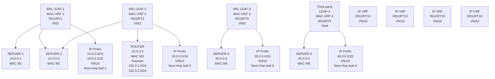

The procedures in this chapter define the configuration and operation for:
* the EVPN IFL model for EVPN-VXLAN Layer 3 and the EVPN IP prefix routes
* multi-homing in an EVPN-VXLAN Layer 3 solution
* host route mobility aspects
* PE-CE unicast routing on EVPN-VXLAN Layer 3 networks
* EVPN-VXLAN Layer 3 feature parity for IPv6 prefixes

## 15.2 Configuration of EVPN-VXLAN IP-VRF domains

The following figure shows the configuration of an EVPN-VXLAN IP-VRF-10 distributed in three leaf routers, with different subnets, and multi-homing for SERVER-1.

<layout_regions> dzwo grof vnms axbe </layout_regions>
3HE 22247 AAAB TQZZA 277 **© 2026 Nokia.**
Use subject to Terms available at: www.nokia.com/terms.

Advanced Configuration Guide Release 26.7 EVPN-VXLAN for layer 3

Figure 47: Example of EVPN-VXLAN IP-VRF domain

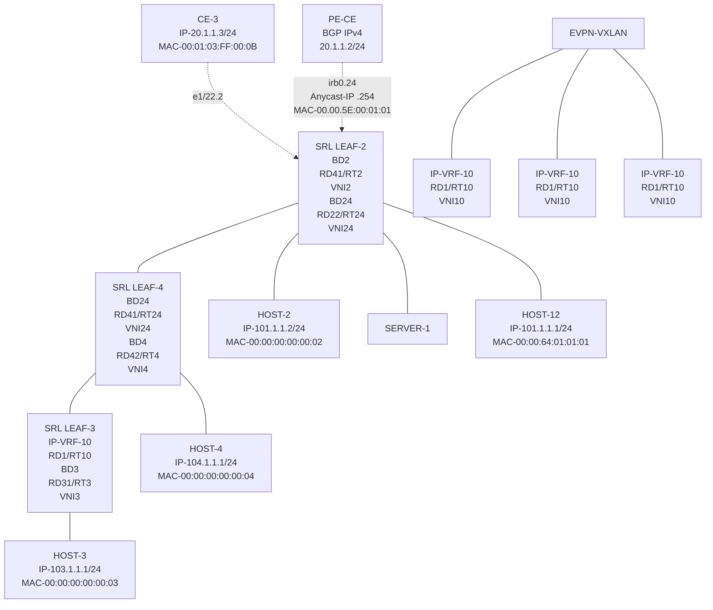

## 15.2.1 Preconfiguring the underlay network

Before configuring the overlay BD, the underlay connectivity must be configured.

This chapter uses the same underlay configuration defined for EVPN-VXLAN Layer-2 and Multi-Homing. See Configuring the underlay network and review this section to understand the underlay configuration before proceeding.

## 15.2.2 Configuring the LEAF-3 IP-VRF domain

### About this task

After LEAF-3 is pre-configured as defined in Configuring the underlay network, use the following steps to enable EVPN-VXLAN on LEAF-3.

As shown in Figure 47: Example of EVPN-VXLAN IP-VRF domain, LEAF-3 is attached to IP-VRF-10 and HOST-3 is connected to BD3. BD3 is mapped to subnet 103.1.1.0/24 and its IRB subinterface is the default-gateway to all hosts in BD3.

### Procedure

**Step 1.** In candidate mode, create the interfaces and bridged subinterfaces that connect LEAF-3 BD3 to HOST-3.

3HE 22247 AAAB TQZZA **© 2026 Nokia.** 278
Use subject to Terms available at: www.nokia.com/terms.

Advanced Configuration Guide Release 26.7 EVPN-VXLAN for layer 3

In this example:

* Ethernet-1/2 connects HOST-3 to LEAF-3. Although this interface could be defined untagged, this example configures the interface as tagged (**vlan-tagging true**).

* A subinterface with index 3 is created under the interface and must be configured as **type** **bridged**. Bridged subinterfaces can be associated with MAC-VRF instances as described in EVPN-VXLAN for layer-2 and multi-homing.

* The subinterface uses **vlan-id optional**, which captures any traffic that is not specified in other subinterfaces of the same interface.

icon: note **Note:** The IRB subinterface expects no vlan tags so that traffic forwarded from HOST-3 can be routed. If HOST-3 sends frames tagged with a vlan-id, the frames would be classified in the BD3 context, but the subinterface does not strip off the vlan tag, and frames are not routed.

**Example**

```
--{ [FACTORY] + candidate shared default }--[ interface ethernet-1/2 ]--
# info
  admin-state enable
  vlan-tagging true
  subinterface 3 {
      type bridged
      admin-state enable
      vlan {
       encap {
            single-tagged {
               vlan-id optional
            }
       }
      }
  }
```

**Step 2.** After creating the access subinterfaces, create the vxlan-interfaces.

This allows MAC-VRFs of the same BD to be connected throughout the IP fabric.

In this example, no other leaf router is attached to BD3, so no vxlan-interface is needed in BD3. The configuration of the vxlan-interface is only shown for completeness. See EVPN-VXLAN for layer-2 and multi-homing for details on vxlan-interfaces and their characteristics.

**Example**

vxlan1 vxlan-interface 3 configuration

```
--{ [FACTORY] + candidate shared default }--[ tunnel-interface vxlan1 ]--
# info
  vxlan-interface 3 {
      type bridged
      ingress {
       vni 3
      }
  }
```

**Step 3.** IP-VRF instances in the leaf routers are also connected by VXLAN tunnels, therefore, vxlan- interfaces of type routed must be created.

In this example, tunnel-interface vxlan2 vxlan-interface 10 is configured. While the configuration of the routed vxlan-interface is similar to the bridged vxlan-interface, this type ensures a routed

3HE 22247 AAAB TQZZA © 2026 Nokia. 279
Use subject to Terms available at: www.nokia.com/terms.

Advanced Configuration Guide Release 26.7

Advanced Configuration Guide Release 26.7 EVPN-VXLAN for layer 3

```
bgp-evpn {
 bgp-instance 1 {
  admin-state enable
  vxlan-interface vxlan1.3
  evi 3
  ecmp 2
 }
}
bgp-vpn {
 bgp-instance 1 {
  route-target {
   export-rt target:64500:3
   import-rt target:64500:3
  }
 }
}
```

Step 6. Configure IP-VRF-10 with bgp-evpn enabled using the EVPN IFL model.

In this example, IP-VRF is configured with the irb0.3 interface for connectivity to BD3 and vxlan2.10. This allows the extension of IP-VRF-10 to remote leaf routers. A loopback interface is configured in the IP-VRF to test connectivity among IP-VRFs of the same tenant.

When configured, all local routes learned on IP-VRF-10 route-table are advertised in IP Prefix routes (or IPv6 Prefix routes for local IPv6 routes).

**Example**

Enable EVPN IFL model on IP-VRF-10

```
--{ [FACTORY] + candidate shared default }--[ network-instance IP-VRF* ]--
# **info**
network-instance IP-VRF-10 {
      type ip-vrf
      interface irb0.3 {
      }
      interface lo10.2 {
      }
      vxlan-interface vxlan2.10 {
      }
      protocols {
       bgp-evpn {
        bgp-instance 1 {
                 vxlan-interface vxlan2.10
                 evi 10
                 ecmp 2
        }
       }
       bgp-vpn {
        bgp-instance 1 {
                 route-target {
                  export-rt target:64500:10
                  import-rt target:64500:10
                 }
        }
       }
      }
}
```

The bgp-vpn instance is configured as described in Chapter EVPN-VXLAN for layer-2 and multi-homing (with a network-instance of type ip-vrf). Likewise, the bgp-evpn container enables EVPN in the ip-vrf and associates it to the routed vxlan-interface. The RD and RT can be auto-derived

3HE 22247 AAAB TQZZA 281
**© 2026 Nokia.**
Use subject to Terms available at: [www.nokia.com/terms](http://www.nokia.com/terms).

Advanced Configuration Guide Release 26.7 EVPN-VXLAN for layer 3

from the evi just like they can in mac-vrfs. Explicitly configured RD/RTs can override the auto- configured ones. Import and export policies are supported.

**Step 7.** Review the changes. If correct, commit the changes.

**Example**

```
# commit stay
--{ candidate shared default }--[ ]--
```

## 15.2.3 Configuring the IP-VRF Domain on LEAF-2 and LEAF-4

### About this task

LEAF-2 and LEAF-4 are configured in the same way as LEAF-3, but with the addition of multi-homing, anycast-gw interfaces, and related configurations.

Use the following procedure to enable EVPN-VXLAN Layer 3 on LEAF-2 and LEAF-4. Considerations for configuring the IRB subinterfaces (Step 4) are provided in IRB subinterface considerations, if needed.

### Procedure

**Step 1.** In candidate mode, create the interfaces, and bridged subinterfaces (including LAG) to connect HOST-2, HOST-4, SERVER-1, and CE-3.

In this example, Ethernet Segment ES-1 is associated with lag1 and is multi-homed to SERVER-1 lag. LACP is enabled on lag1 (but can be disabled) and the admin-key, system-id- mac, and system-priority match on both LEAF-2 and LEAF-4.

**Example**

Interfaces and bridged subinterfaces configuration (LEAF-2)

```
// interfaces in Leaf-2
--{ [FACTORY] + candidate shared default }--[ interface * ]--
# **info**
 interface ethernet-1/11 {
      description ES-1
      ethernet {
           aggregate-id lag1
      }
 }
 interface ethernet-1/12 {
      description to-host-2
      admin-state enable
      vlan-tagging true
      subinterface 24 {
           type bridged
           vlan {
                 encap {
                    single-tagged {
                           vlan-id optional
                    }
                 }
           }
      }
 }
 interface ethernet-1/22 {
      description to-CE-3
      vlan-tagging true
      subinterface 2 {
```

3HE 22247 AAAB TQZZA 282
**© 2026 Nokia.**
Use subject to Terms available at: [www.nokia.com/terms](http://www.nokia.com/terms).

Advanced Configuration Guide Release 26.7 EVPN-VXLAN for layer 3

```
type bridged
admin-state enable
vlan {
   encap {
        single-tagged {
               vlan-id 2
        }
   }
}
}
}
}
interface lag1 {
   admin-state enable
   vlan-tagging true
   subinterface 24 {
     type bridged
     vlan {
        encap {
             single-tagged {
                    vlan-id 24
             }
        }
     }
   }
   lag {
     lag-type lacp
     member-speed 100G
     lacp {
        interval FAST
        lacp-mode ACTIVE
        admin-key 24
        system-id-mac 00:00:00:00:00:24
        system-priority 24
     }
   }
}
```

**Example**

Interfaces and bridged subinterfaces configuration (LEAF-4)

```
// Interfaces in Leaf-4
--{ [FACTORY] + candidate shared default }--[ interface * ]--
# **info**
 interface ethernet-1/4 {
      description ES-1
      ethernet {
        aggregate-id lag1
      }
 }
 interface ethernet-1/13 {
      description to-host-4
      admin-state enable
      vlan-tagging true
      subinterface 4 {
        type bridged
        admin-state enable
        vlan {
           encap {
                single-tagged {
                       vlan-id optional
                }
           }
        }
      }
 }
```

3HE 22247 AAAB TQZZA 283
**© 2026 Nokia.**
Use subject to Terms available at: [www.nokia.com/terms](http://www.nokia.com/terms).

Advanced Configuration Guide Release 26.7    EVPN-VXLAN for layer 3

```
}
}
interface lag1 {
     admin-state enable
     vlan-tagging true
     subinterface 24 {
      type bridged
      vlan {
               encap {
                single-tagged {
                      vlan-id 24
                }
               }
      }
     }
     lag {
      lag-type lacp
      member-speed 100G
      lacp {
               interval FAST
               lacp-mode ACTIVE
               admin-key 24
               system-id-mac 00:00:00:00:00:24
               system-priority 24
      }
     }
}
```

**Step 2.** Create the all-active Ethernet Segment ES-1 that is attached to LEAF-2 and LEAF-4.

Details about the ES configuration and operation can be found in EVPN-VXLAN for layer-2 and multi-homing. Note that the following example only shows the Ethernet Segment configuration. The bgp-vpn>bgp-instance 1 must also be configured as described in EVPN-VXLAN for layer-2 and multi-homing.

**Example**

ES configuration

```
// ES-1 on Leaf-2
--{ [FACTORY] + candidate shared default }--[ system network-instance protocols
evpn ethernet-segments ]--
# info
 bgp-instance 1 {
     ethernet-segment ES-1 {
      admin-state enable
      esi 01:24:24:24:24:24:24:00:00:01
      interface lag1
      multi-homing-mode all-active
     }
}
// ES-1 on Leaf-4
--{ [FACTORY] + candidate shared default }--[ system network-instance protocols
evpn ethernet-segments ]--
A:dut4# info
 bgp-instance 1 {
     ethernet-segment ES-1 {
      admin-state enable
      esi 01:24:24:24:24:24:24:00:00:01
      interface lag1
      multi-homing-mode all-active
     }
}
```

3HE 22247 AAAB TQZZA    **© 2026 Nokia.**    284
Use subject to Terms available at: www.nokia.com/terms.

Advanced Configuration Guide Release 26.7 EVPN-VXLAN for layer 3

**Step 3.** After the access bridged subinterfaces are created, create the vxlan-interfaces to facilitate connectivity between network-instances across the IP fabric.

The mac-vrf network-instances require both vxlan-interfaces of type bridged and ip-vrfs of type routed.

In the following example, all the vxlan-interfaces for all network-instances on LEAF-2 and LEAF-4 nodes are configured as follows:

**Example**

vxlan-interface configuration

```
// vxlan-interfaces on Leaf-2
--{ [FACTORY] + candidate shared default }--[ tunnel-interface * ]--
# **info**
 tunnel-interface vxlan1 {
      vxlan-interface 2 {
       type bridged
       ingress {
       vni 2
       }
      }
      vxlan-interface 24 {
       type bridged
       ingress {
        vni 24
       }
      }
 }
 tunnel-interface vxlan2 {
      vxlan-interface 10 {
       type routed
       ingress {
        vni 10
       }
      }
 }
// vxlan-interfaces on Leaf-4
--{ [FACTORY] + candidate shared default }--[ tunnel-interface * ]--
# **info**
 tunnel-interface vxlan1 {
      vxlan-interface 4 {
       type bridged
       ingress {
       vni 4
       }
      }
      vxlan-interface 24 {
       type bridged
       ingress {
        vni 24
       }
      }
 }
 tunnel-interface vxlan2 {
      vxlan-interface 10 {
       type routed
       ingress {
        vni 10
       }
      }
 }
```

3HE 22247 AAAB TQZZA 285
**© 2026 Nokia.**
Use subject to Terms available at: [www.nokia.com/terms](http://www.nokia.com/terms).

Advanced Configuration Guide Release 26.7 EVPN-VXLAN for layer 3

**Step 4.** Configure the IRB subinterfaces that link the mac-vrf and ip-vrf network-instances for inter-subnet-forwarding.

See IRB subinterface considerations, for details on configuring IRB subinterfaces.

**Example**

IRB subinterface configuration

```
// IRB interfaces in Leaf-2
--{ [FACTORY] + candidate shared default }--[ interface irb* ]--
# **info**
interface irb0 {
      subinterface 2 {
       ipv4 {
        admin-state enable
        address 20.1.1.2/24 {
        }
        arp {
                 learn-unsolicited true
                 ]
        }
       }
       anycast-gw {
       }
      }
      subinterface 24 {
       ipv4 {
        admin-state enable
        address 101.1.1.2/24 {
        }
        address 101.1.1.254/24 {
                 anycast-gw true
                 primary
        }
        address 102.1.1.254/24 {
        }
        arp {
                 learn-unsolicited true
                 debug [
                  messages
                 ]
                 host-route {
                  populate dynamic {
                  }
                 }
                 evpn {
                  advertise dynamic {
                  }
                 }
        }
       }
       anycast-gw {
       }
      }
}
// IRB interfaces in Leaf-4
--{ [FACTORY] + candidate shared default }--[ interface irb* ]--
# **info**
interface irb0 {
      subinterface 4 {
       ipv4 {
        admin-state enable
        address 104.1.1.4/24 {
        }
```


SPACER TEXT

3HE 22247 AAAB TQZZA **© 2026 Nokia.** 286
Use subject to Terms available at: [www.nokia.com/terms](http://www.nokia.com/terms).

Advanced Configuration Guide Release 26.7 EVPN-VXLAN for layer 3

```
address 104.1.1.254/24 {
         anycast-gw true
         primary
}
arp {
         learn-unsolicited true
         debug [
             messages
         ]
}
}
anycast-gw {
}
}
subinterface 24 {
 ipv4 {
  admin-state enable
  address 101.1.1.4/24 {
  }
  address 101.1.1.254/24 {
         anycast-gw true
         primary
  }
  arp {
         learn-unsolicited true
         debug [
             messages
         ]
         host-route {
             populate dynamic {
             }
         }
         evpn {
             advertise dynamic {
             }
         }
  }
 }
 anycast-gw {
 }
}
```

**Step 5.** Configure the network-instances of type mac-vrf and associate the bridged subinterfaces, irb subinterfaces, and vxlan-interfaces. Then enable bgp-evpn.

**Example**

network instance configuration and association

```
// MAC-VRFs in Leaf-2
--{ [FACTORY] + candidate shared default }--[ network-instance BD* ]--
# **info**
network-instance BD2 {
      type mac-vrf
      interface ethernet-1/22.2 {
      }
      interface irb0.2 {
      }
      vxlan-interface vxlan1.2 {
      }
      protocols {
       bgp-evpn {
        bgp-instance 1 {
                 admin-state enable
```

3HE 22247 AAAB TQZZA 287 **© 2026 Nokia.**
Use subject to Terms available at: [www.nokia.com/terms](http://www.nokia.com/terms).

Advanced Configuration Guide Release 26.7

EVPN-VXLAN for layer 3

```
vxlan-interface vxlan1.2
evi 2
ecmp 2
}
}
bgp-vpn {
bgp-instance 1 {
route-target {
export-rt target:64500:2
import-rt target:64500:2
}
}
}
}
}
network-instance BD24 {
type mac-vrf
interface ethernet-1/12.24 {
}
interface irb0.24 {
}
interface lag1.24 {
}
vxlan-interface vxlan1.24 {
}
protocols {
bgp-evpn {
bgp-instance 1 {
admin-state enable
vxlan-interface vxlan1.24
evi 24
ecmp 2
}
}
bgp-vpn {
bgp-instance 1 {
route-target {
export-rt target:64500:24
import-rt target:64500:24
}
}
}
}
}
// MAC-VRFs in Leaf-4
--{ [FACTORY] + candidate shared default }--[ network-instance BD* ]--
**# info**
network-instance BD24 {
type mac-vrf
interface irb0.24 {
}
interface lag1.24 {
}
vxlan-interface vxlan1.24 {
}
protocols {
bgp-evpn {
bgp-instance 1 {
admin-state enable
vxlan-interface vxlan1.24
evi 24
ecmp 2
}
}
```

3HE 22247 AAAB TQZZA

**© 2026 Nokia.**

288

Use subject to Terms available at: [www.nokia.com/terms](http://www.nokia.com/terms).

Advanced Configuration Guide Release 26.7 EVPN-VXLAN for layer 3

```
bgp-vpn {
 bgp-instance 1 {
          route-target {
               export-rt target:64500:24
               import-rt target:64500:24
          }
 }
}
}
}
network-instance BD4 {
 type mac-vrf
 interface ethernet-1/13.4 {
 }
 interface irb0.4 {
 }
 vxlan-interface vxlan1.4 {
 }
 protocols {
  bgp-evpn {
   bgp-instance 1 {
            admin-state enable
            vxlan-interface vxlan1.4
            evi 4
            ecmp 2
   }
  }
  bgp-vpn {
   bgp-instance 1 {
            route-target {
                 export-rt target:64500:4
                 import-rt target:64500:4
            }
   }
  }
 }
}
```

**Step 6.** Configure IP-VRF-10 with bgp-evpn enabled with the EVPN IFL model.

The IP-VRF is configured with the IRB subinterfaces previously created for BD2, BD4, and BD24. The IP-VRF instances are connected VXLAN tunnels, so routed vxlan-interfaces need to be associated with IP-VRF-10. A loopback interface is configured in the IP-VRF to test connectivity among IP-VRFs of the same tenant.

In the following example, LEAF-2's IP-VRF is configured with a BGP PE-CE neighbor to CE-3.

**Example**

IP-VRF-10 configuration

```
// IP-VRF-10 in Leaf-2
--{ [FACTORY] + candidate shared default }--[ network-instance IP-VRF* ]--
# **info**
network-instance IP-VRF-10 {
      type ip-vrf
      interface irb0.2 {
      }
      interface irb0.24 {
      }
      interface lo10.2 {
      }
      vxlan-interface vxlan2.10 {
      }
```

3HE 22247 AAAB TQZZA 289
**© 2026 Nokia.**
Use subject to Terms available at: [www.nokia.com/terms](http://www.nokia.com/terms).

Advanced Configuration Guide Release 26.7
EVPN-VXLAN for layer 3

```
protocols {
 bgp-evpn {
  bgp-instance 1 {
           vxlan-interface vxlan2.10
           evi 10
           ecmp 2
  }
 }
 bgp {
  admin-state enable
  afi-safi ipv4-unicast {
           admin-state enable
  }
  autonomous-system 645002
  router-id 2.2.2.2
  group eBGP-PE-CE {
           admin-state enable
           export-policy export-all
           import-policy import-all
           afi-safi ipv4-unicast {
                admin-state enable
           }
  }
  neighbor 20.1.1.3 {
           peer-as 645003
           peer-group eBGP-PE-CE
           local-as as-number 645002 {
           }
           transport {
                local-address 20.1.1.2
           }
  }
 }
 bgp-vpn {
  bgp-instance 1 {
           route-target {
                export-rt target:64500:10
                import-rt target:64500:10
           }
  }
 }
}
```
// IP-VRF-10 in Leaf-4
--{ [FACTORY] + candidate shared default }--[ network-instance IP-VRF* ]--
**# info**
network-instance IP-VRF-10 {
      type ip-vrf
      interface irb0.4 {
      }
      interface irb0.24 {
      }
      interface lo10.2 {
      }
      vxlan-interface vxlan2.10 {
      }
      protocols {
       bgp-evpn {
        bgp-instance 1 {
                 vxlan-interface vxlan2.10
                 evi 10
                 ecmp 2
        }
       }
      }
}


SPACER TEXT

3HE 22247 AAAB TQZZA    **© 2026 Nokia.**    290
Use subject to Terms available at: [www.nokia.com/terms](http://www.nokia.com/terms).

Advanced Configuration Guide Release 26.7 EVPN-VXLAN for layer 3

```
bgp-vpn {
 bgp-instance 1 {
            route-target {
               export-rt target:64500:10
               import-rt target:64500:10
            }
 }
}
```

**Step 7.** Review the changes, and if correct, commit the changes.

**Example**

```
A:dut2# commit stay
--{ candidate shared default }--[  ]--
```

## 15.2.3.1 IRB subinterface considerations

The following are considerations for configuring IRB subinterfaces (performed in Step 4).

IRB subinterfaces on BDs that are distributed to multiple leaf nodes must be configured with at least one anycast-gw IP address and an anycast-gw MAC address. When the anycast-gw container is configured, the anycast-gw MAC address is auto-derived as 00:00:5E:00:01:01 in all the leaf nodes. The MAC address can also be explicitly configured if needed. In addition:

• The same anycast-gw IP and MAC address must be configured on all IRBs of the same BD.

• All the hosts attached to the same BD use the same default-gateway (that is, the anycast-gw IP) irrespective of the leaf they are connected to. For example, irb0 subinterfaces 24 are configured with the same anycast-gw IP on LEAF-2 and LEAF-4 (101.1.1.254) in the configuration example.

• Default gateway redundancy in DCs is realized using anycast-gws, and not VRRP. Anycast-gws avoid upstream tromboning for hosts that are multi-homed to multiple leaf nodes or for single-homed hosts that move to other leaf nodes of the same BD.

IRB subinterfaces on BDs that are distributed may also be configured with non-anycast-gw IP addresses. This is only done when separate IPs are needed to check connectivity per leaf. For example, when LEAF-2 is configured with non-anycast-gw IPs 101.1.1.2 and 102.1.1.254, and LEAF-4 is configured with 104.1.1.4. and anycast-gw IPs exist in multiple nodes, the anycast-gw IPs should not be used in ICMP tools to check the availability of a leaf. Non-anycast-gw IPs should be used instead.

IRB subinterfaces on distributed BDs should be configured with the following commands, as shown for subinterface 24 in LEAF-2 and LEAF-4 in the configuration example:

• **arp learn-unsolicited true** - Triggers the learning of ARP entries out of any ARP packet arriving at the IRB subinterface, regardless of whether there was an ARP-Request issued from the IRB.

• **arp host-route populate dynamic** - Creates host routes (arp-nd) in the IP-VRF route-table from learned dynamic ARP entries in the IRB. The arp-nd host routes are then advertised to the remote leaf nodes. This assists the routing of downstream traffic to a specified host without hair-pinning traffic via another leaf connected to the same BD of the host, but not connected to the host directly.

• **arp evpn advertise dynamic** - Advertises EVPN MAC/IP routes that include the MAC and the IP of the dynamic ARP entries. The advertisement of these routes synchronizes the ARP caches in all the IRB subinterfaces of the same BD.

3HE 22247 AAAB TQZZA 291 **© 2026 Nokia.**
Use subject to Terms available at: [www.nokia.com/terms](http://www.nokia.com/terms).

Advanced Configuration Guide Release 26.7 EVPN-VXLAN for layer 3

IRB subinterfaces on BDs that are not distributed (that is, BDs attached to only one Leaf node) do not need to be configured with the following:

* **arp host-route-populate dynamic** as downstream routing is always direct to the connected leaf

* **arp evpn advertise dynamic** as ARP entries do not need to be synchronized with any other node

Examples of non-distributed BDs are BD2, BD4, and BD3 as shown in Figure 47: Example of EVPN- VXLAN IP-VRF domain. Their corresponding IRB subinterfaces do not create host-routes or advertise EVPN MAC/IP routes for the ARP entries.

## 15.2.4 Configuring EVPN IFL interoperability to EVPN IFF unnumbered model

### About this task

While EVPN IFL for VXLAN is supported by most DC vendors, Nuage WBX or VSC/VRS use the EVPN IFF Unnumbered model. By default, the SR Linux EVPN IFL (interface-less) model does not inter-operate with the EVPN IFF (interface-full) model. However, it is possible to configure the SR Linux EVPN IFL model to inter-operate with the EVPN IFF model.

For more information about EVPN IFL vs EVPN IFF models, see the SR Linux VPN Services Guide and draft-ietf-bess-evpn-prefix-advertisement.

### Procedure

To configure inter-operability in IP-VRF-10, configure the **advertise-gateway-mac** command as shown in the following example.

### Example: EVPN IFF inter-operability in IP-VRF-10 configuration

```
--{ [FACTORY] + candidate shared default }--[ network-instance IP-VRF-10 ]--
# **protocols bgp-evpn bgp-instance 1 routes route-table mac-ip advertise-gateway-mac**
**<value> ?**
usage: advertise-gateway-mac <true|false>
If set to true in an ip-vrf where bgp-evpn is enabled, a MAC/IP route
containing the gateway-MAC is advertised.

This gateway-MAC matches the MAC advertised along with the EVPN IFL routes
type 5 for the ip-vrf network-instance. This advertisement is needed so that
the EVPN IFL (Interface-Less) model in the ip-vrf can interoperate with a remote
system working in EVPN IFF (Interface-ful) Unnumbered mode.

Positional arguments:
 value        [true|false, default false]
```

When set to true, the node advertises a MAC/IP route using all of the following:

* Gateway-mac for IP-VRF-10 (that is, the system-mac)

* RD/RT, next-hop, and VNI of IP-VRF-10

* Null IP address, ESI or Ethernet Tag ID

### Example: MAC/IP route advertisement

In the following example, the MAC/IP route advertised is from LEAF-3. The MAC address matches the system-mac advertised in any local RT5s.

```
--{ [FACTORY] + candidate shared default }--[ network-instance IP-VRF-10 ]--
```

3HE 22247 AAAB TQZZA 292
**© 2026 Nokia.**
Use subject to Terms available at: [www.nokia.com/terms](http://www.nokia.com/terms).

Advanced Configuration Guide Release 26.7 EVPN-VXLAN for layer 3

```
# protocols bgp-evpn bgp-instance 1 routes route-table mac-ip advertise-gateway-mac true

--{ [FACTORY] +* candidate shared default }--[ network-instance IP-VRF-10 ]--
# commit stay
All changes have been committed. Starting new transaction.
2021-04-15T01:18:24.688185-07:00 dut3 local6|DEBU sr_bgp_mgr: bgp|4942|5135|1393922|D:
VR default (1) Peer 1: 1.1.1.1 UPDATE: Peer 1: 1.1.1.1 - Send BGP UPDATE:
      Withdrawn Length = 0
      Total Path Attr Length = 81
      Flag: 0x90 Type: 14 Len: 44 Multiprotocol Reachable NLRI:
       Address Family EVPNandidate shared default
       root (8)               Thu 01:18AM
       NextHop len 4 NextHop 3.3.3.3
       Type: EVPN-MAC Len: 33 RD: 3.3.3.3:10 ESI: ESI-0, tag: 0, mac len: 48 mac:
             00:01:03:ff:00:00, IP len: 0, IP: NULL, label1: 10
      Flag: 0x40 Type: 1 Len: 1 Origin: 0
      Flag: 0x40 Type: 2 Len: 0 AS Path:
      Flag: 0x40 Type: 5 Len: 4 Local Preference: 100
      Flag: 0xc0 Type: 16 Len: 16 Extended Community:
       target:64500:10
       bgp-tunnel-encap:VXLAN
```

For IPv6, Nuage WBX devices support two EVPN L3 IPv6 modes: IFF unnumbered and IFF numbered. The SR Linux interoperability mode enabled by the advertise-gateway-mac command only works with devices that use EVPN IFF unnumbered. This is because EVPN IFL and EVPN IFF unnumbered models both use the same format in the IP prefix route, and differ only in the additional MAC/IP route for the gateway-mac. EVPN IFL and EVPN IFF numbered models have different IP prefix route formats, and cannot inter-operate.

## 15.2.5 Checking the EVPN IFL model in IP-VRFs

When configured, the state of the IP-VRF-10 on the three leaf nodes and basic connectivity should be checked.

When the leaf nodes attached to IP-VRF-10 exchange at least one EVPN IP-Prefix route on all leaf nodes of the tenant, the bgp_mgr requests the fib_mgr to create a VXLAN tunnel to each next-hop of the received EVPN routes type 5 (RT5s). This assumes the tunnel had not already been created.

When a VXLAN tunnel to the remote VTEP exists, the bgp_mgr requests the next-hop resolution to the fib_mgr, and if it resolves, the RT5 is installed in the IP-VRF route-table. Using LEAF-3 as a reference, you can check that RT5s are received from the two remote leaf nodes, and then verify that VXLAN tunnels exist to their VTEPs and the RT5s are installed in the route-table. Loopbacks are configured on each IP-VRF-10 instance to verify reachability.

## 15.2.5.1 Checking IP-VRF-10 state and connectivity

### Procedure

Use the **show network-instance protocols bgp routes evpn route-type prefix** command to check RT5s for the loopbacks 22.22.22.22 and 44.44.44.44 advertised by the remote leaf nodes. You can check that the routes contain the expected IP-VRF-10 VNI, route-target, and the mac-nh which is used as the inner destination MAC when sending VXLAN packets to the prefix.

3HE 22247 AAAB TQZZA    **© 2026 Nokia.**    293
Use subject to Terms available at: [www.nokia.com/terms](http://www.nokia.com/terms).

Advanced Configuration Guide Release 26.7 EVPN-VXLAN for layer 3

## Example: Check IP-VRF-10 state and connectivity

```
--{ [FACTORY] + candidate shared default }--[  ]--
# **show network-instance default protocols bgp routes evpn route-type 5 prefix 22.22.22.22/32 detail**
--------------------------------------------------------------------------------------------------
Show report for the EVPN routes in network-instance "default"
-------------------------------------------------------------------------------------------------
Route Distinguisher: 2.2.2.2:10
Tag-ID               : 0
ip-prefix-len        : 32
ip-prefix            : 22.22.22.22/32
neighbor             : 2.2.2.2
Gateway IP           : 0.0.0.0
Received paths       : 1
Path 1: <Best,Valid,Used,>
    ESI               : 00:00:00:00:00:00:00:00:00:00
    VNI               : 10
    Route source      : neighbor 2.2.2.2 (last modified 46m16s ago)
    Route preference: No MED, LocalPref is 100
    Atomic Aggr       : false
    BGP next-hop      : 2.2.2.2
    AS Path           : i
    Communities       : [target:64500:10, mac-nh:00:01:02:ff:00:00, bgp-tunnel-encap:VXLAN]
    RR Attributes     : No Originator-ID, Cluster-List is []
    Aggregation       : None
    Unknown Attr      : None
    Invalid Reason : None
    Tie Break Reason: none
---------------------------------------------------------------------------------------------------
--{ [FACTORY] + candidate shared default }--[  ]--
# **show network-instance default protocols bgp routes evpn route-type 5 prefix 44.44.44.44/32 summary**
---------------------------------------------------------------------------------------------------
Show report for the BGP route table of network-instance "default"
--------------------------------------------------------------------------------------------------
Status codes: u=used, *=valid, >=best, x=stale
Origin codes: i=IGP, e=EGP, ?=incomplete
-------------------------------------------------------------------------------------------------
BGP Router ID: 3.3.3.3        AS: 3333   Local AS: 3333
------------------------------------------------------------------------------------------------
Type 5 IP Prefix Routes
```

<table>
<thead>
<tr><th>Status</th><th>Route- <br />distinguisher</th><th>Tag <br />-ID</th><th>IP-address</th><th>neighbor</th><th>Next-Hop</th><th>VNI</th><th>Gateway</th></tr>
</thead>
<tbody>
<tr><td>u*></td><td>4.4.4.4:10</td><td>0</td><td>44.44.44.44/32</td><td>4.4.4.4</td><td>4.4.4.4</td><td>10</td><td>0.0.0.0</td></tr>
</tbody>
</table>

```
---------------------------------------------------------------------------------------
1 IP Prefix routes 1 used, 1 valid
---------------------------------------------------------------------------------------
--{ [FACTORY] + candidate shared default }--[    ]--
```

## 15.2.5.2 Checking for VXLAN tunnel creation

### Procedure

When the routes are correct, the VXLAN tunnels are created. Use the **show network-instance** **tunnel-table all** command to verify that the VXLAN tunnels are created.


</page_footer>

<page_footer>3HE 22247 AAAB TQZZA    **© 2026 Nokia.**    294
Use subject to Terms available at: [www.nokia.com/terms](http://www.nokia.com/terms).

Advanced Configuration Guide Release 26.7 EVPN-VXLAN for layer 3

### Example: Check for VXLAN tunnel creation

```
--{ [FACTORY] + candidate shared default }--[    ]--
# show network-instance default tunnel-table all
-----------------------------------------------------------------------------------------------------
Show report for network instance "default" tunnel table
------------------------------------------------------------------------------------------------------
```

<table>
<thead>
<tr><th>IPv4 Prefix</th><th>Owner</th><th>Type</th><th>Index</th><th>Metric</th><th>Preference</th><th>Fib-prog</th><th>Last Update</th></tr>
</thead>
<tbody>
<tr><td>2.2.2.2/32</td><td>vxlan_mgr</td><td>vxlan</td><td>7</td><td>0</td><td>0</td><td>Y</td><td>2021-04-13T10:43:09.483Z</td></tr>
<tr><td>4.4.4.4/32</td><td>vxlan_mgr</td><td>vxlan</td><td>6</td><td>0</td><td>0</td><td>Y</td><td>2021-04-13T10:43:09.144Z</td></tr>
</tbody>
</table>
```
------------------------------------------------------------------------------------------------------
2 VXLAN tunnels, 2 active, 0 inactive
-----------------------------------------------------------------------------------------------------
-----------------------------------------------------------------------------------------------------
Show report for network instance "default" tunnel table
-----------------------------------------------------------------------------------------------------
-----------------------------------------------------------------------------------------------------
--{ [FACTORY] + candidate shared default }--[    ]--
```

### 15.2.5.3 **Checking for remote VTEPS and associated destinations**

#### Procedure

Use the **show tunnel vxlan-tunnel vtep** command to show the remote VTEPs and the associated destinations. A destination is the combination of the VTEP and VNI that is created when the EVPN routes are received and the VXLAN tunnel is created. IP destinations are created from RT5s.

### Example: Check for remote VTEPs and associated destinations

```
# show tunnel vxlan-tunnel vtep 2.2.2.2
----------------------------------------------------------------------------
Show report for vxlan-tunnels vtep
---------------------------------------------------------------------------
VTEP Address: 2.2.2.2
Index        : 202418627561
Last Change : 2021-04-13T11:47:09.000Z
---------------------------------------------------------------------------
Destinations
---------------------------------------------------------------------------
```

<table>
<thead>
<tr><th>Tunnel Interface</th><th>VXLAN Interface</th><th>Egress VNI</th><th>Type</th></tr>
</thead>
<tbody>
<tr><td>vxlan1</td><td>1</td><td>1</td><td>multicast-destination</td></tr>
<tr><td>vxlan2</td><td>10</td><td>10</td><td>ip-destination</td></tr>
</tbody>
</table>
```
---------------------------------------------------------------------------
1 bridged destinations, 1 multicast, 0 unicast, 0 es
1 routed destinations
--------------------------------------------------------------------------
--{ [FACTORY] + candidate shared default }--[  ]--
# show tunnel vxlan-tunnel vtep 4.4.4.4
---------------------------------------------------------------------------
Show report for vxlan-tunnels vtep
---------------------------------------------------------------------------
VTEP Address: 4.4.4.4
Index        : 202418627553
Last Change : 2021-04-14T15:40:23.000Z
```


SPACER TEXT

3HE 22247 AAAB TQZZA **© 2026 Nokia.** 295
Use subject to Terms available at: [www.nokia.com/terms](http://www.nokia.com/terms).

Advanced Configuration Guide Release 26.7 EVPN-VXLAN for layer 3

<table>
<thead>
<tr><th>Tunnel Interface</th><th>VXLAN Interface</th><th>Egress VNI</th><th>Type</th></tr>
</thead>
<tbody>
<tr><td>vxlan1</td><td>1</td><td>1</td><td>multicast-destination</td></tr>
<tr><td>vxlan1</td><td>1</td><td>1</td><td>unicast-destination</td></tr>
<tr><td>vxlan2</td><td>10</td><td>10</td><td>ip-destination</td></tr>
</tbody>
</table>

2 bridged destinations, 1 multicast, 1 unicast, 0 es
1 routed destinations

--{ [FACTORY] + candidate shared default }--[ ]--

## 15.2.5.4 Checking IP-VRF-10 route table

### Procedure

Use the **show route-table ipv4-unicast summary** command to check the IP-VRF-10 route table to ensure all the remote subnets and hosts are received and installed. All interface and local routes are automatically advertised in RT5s. Because ECMP=2 is configured in the IP-VRF-10, there are two ECMP paths for the 101.1.1.0/24 subnet, which is attached to both LEAF-2 and LEAF-4.

### Example: Check IP-VRF-10 route table

--{ [FACTORY] + candidate shared default }--[ network-instance IP-VRF-10 ]-- # **show route-table ipv4-unicast summary**
IPv4 Unicast route table of network instance IP-VRF-10

<table>
<thead>
<tr><th>Prefix</th><th>ID</th><th>Active</th><th>Route Type</th><th>Metric</th><th>Pref</th><th>Next-hop (Type)</th><th>Next-hop Interface</th></tr>
</thead>
<tbody>
<tr><td>31.31.31.31/32</td><td>0</td><td>true</td><td>bgp-evpn</td><td>0</td><td>170</td><td>2.2.2.2 (indirect)</td><td>None</td></tr>
<tr><td>20.1.1.0/24</td><td>0</td><td>true</td><td>bgp-evpn</td><td>0</td><td>170</td><td>2.2.2.2 (indirect)</td><td>None</td></tr>
<tr><td>20.1.1.3/32</td><td>0</td><td>true</td><td>bgp-evpn</td><td>0</td><td>170</td><td>2.2.2.2 (indirect)</td><td>None</td></tr>
<tr><td>22.22.22.22/32</td><td>0</td><td>true</td><td>bgp-evpn</td><td>0</td><td>170</td><td>2.2.2.2 (indirect)</td><td>None</td></tr>
<tr><td>33.33.33.33/32</td><td>0</td><td>true</td><td>host</td><td>0</td><td>0</td><td>None (extract)</td><td>None</td></tr>
<tr><td>44.44.44.44/32</td><td>0</td><td>true</td><td>bgp-evpn</td><td>0</td><td>170</td><td>4.4.4.4 (indirect)</td><td>None</td></tr>
<tr><td>101.1.1.0/24</td><td>0</td><td>true</td><td>bgp-evpn</td><td>0</td><td>170</td><td>2.2.2.2 (indirect)</td><td>None</td></tr>
<tr><td></td><td></td><td></td><td></td><td></td><td></td><td>4.4.4.4 (indirect)</td><td>None</td></tr>
<tr><td>101.1.1.1/32</td><td>0</td><td>true</td><td>bgp-evpn</td><td>0</td><td>170</td><td>2.2.2.2 (indirect)</td><td>None</td></tr>
<tr><td>102.1.1.0/24</td><td>0</td><td>true</td><td>bgp-evpn</td><td>0</td><td>170</td><td>2.2.2.2 (indirect)</td><td>None</td></tr>
<tr><td>103.1.1.0/24</td><td>0</td><td>true</td><td>local</td><td>0</td><td>0</td><td>103.1.1.3 (direct)</td><td>irb0.3</td></tr>
<tr><td>103.1.1.1/32</td><td>0</td><td>true</td><td>arp-nd</td><td>0</td><td>1</td><td>103.1.1.1 (direct)</td><td>irb0.3</td></tr>
<tr><td>103.1.1.3/32</td><td>0</td><td>true</td><td>host</td><td>0</td><td>0</td><td>None (extract)</td><td>None</td></tr>
<tr><td>103.1.1.254/32</td><td>0</td><td>true</td><td>host</td><td>0</td><td>0</td><td>None (extract)</td><td>None</td></tr>
<tr><td>103.1.1.255/32</td><td>0</td><td>true</td><td>host</td><td>0</td><td>0</td><td>None (broadcast)</td><td>None</td></tr>
<tr><td>104.1.1.0/24</td><td>0</td><td>true</td><td>bgp-evpn</td><td>0</td><td>170</td><td>4.4.4.4 (indirect)</td><td>None</td></tr>
</tbody>
</table>

15 IPv4 routes total
15 IPv4 prefixes with active routes
1 IPv4 prefixes with active ECMP routes

--{ [FACTORY] + candidate shared default }--[ network-instance IP-VRF-10 ]--

3HE 22247 AAAB TQZZA **© 2026 Nokia.** Use subject to Terms available at: [www.nokia.com/terms](http://www.nokia.com/terms). 296

Advanced Configuration Guide Release 26.7 EVPN-VXLAN for layer 3

## 15.2.5.5 Checking route-table state for a RT5

### Procedure

Use the **info from state route-table** command to check the route-table state for a RT5. This can be useful to understand how the RT5 is resolved to a vxlan tunnel and what vxlan VNI, inner source, and destination MACs are be used when sending VXLAN packets to that route. The following uses ECMP route 101.1.1.0/24 on LEAF-3. The route's next-hop group has two separate next-hops pointing at the remote LEAF-2 and LEAF-4 VTEPs:

### Example: Check route-table state for a RT5

```
--{ [FACTORY] + candidate shared default }--[ network-instance IP-VRF-10 ]--
# **info from state route-table ipv4-unicast route 101.1.1.0/24 id 0**
 route-table {
        ipv4-unicast {
         route 101.1.1.0/24 id 0 {
          route-type bgp-evpn
          route-owner bgp_evpn_mgr
          metric 0
          preference 170
          active true
          last-app-update "a day ago"
          next-hop-group 202418627581
          resilient-hash false
          fib-programming {
                       status success
          }
         }
        }
 }
--{ [FACTORY] + candidate shared default }--[ network-instance IP-VRF-10 ]--
# **info from state route-table next-hop-group 202418627581 next-hop ***
 route-table {
        next-hop-group 202418627581 {
         next-hop 0 {
          next-hop 202418627569
          resolved true
         }
         next-hop 1 {
          next-hop 202418627565
          resolved true
         }
        }
 }
--{ [FACTORY] + candidate shared default }--[ network-instance IP-VRF-10 ]--
# **info from state route-table next-hop 202418627569**
 route-table {
        next-hop 202418627569 {
         type indirect
         ip-address 2.2.2.2
         resolving-tunnel {
          ip-prefix 2.2.2.2/32
          tunnel-type vxlan
          tunnel-owner vxlan_mgr
         }
         vxlan {
          vni 10
          source-mac 00:01:03:FF:00:00
          destination-mac 00:01:02:FF:00:00
         }
```

3HE 22247 AAAB TQZZA    **© 2026 Nokia.**    297
Use subject to Terms available at: [www.nokia.com/terms](http://www.nokia.com/terms).

Advanced Configuration Guide Release 26.7 EVPN-VXLAN for layer 3

## 15.2.5.6 Monitoring pings

**Procedure**

Use the **tools system traffic-monitor** command to monitor pings between the local LEAF-3 loopback and LEAF-2's loopback (22.22.22.22), the inner source, and destination MACs that are associated to the RT5's next-hop that are used in the actual packets. Note that the source-mac is the chassis MAC advertised in the mac-nh of the local RT5s:

**Example: Monitor pings**

```
--{ [FACTORY] + candidate shared default }--[ network-instance IP-VRF-10 ]--
// a ping is sent from Leaf-3 to 22.22.22.22 (the loopback on Leaf-2’s IP-VRF-10)
# **network-instance IP-VRF-10**
--{ [FACTORY] + candidate shared default }--[ network-instance IP-VRF-10 ]--
# **ping 22.22.22.22**
Using network instance IP-VRF-10
PING 22.22.22.22 (22.22.22.22) 56(84) bytes of data.
64 bytes from 22.22.22.22: icmp_seq=1 ttl=64 time=4.88 ms
64 bytes from 22.22.22.22: icmp_seq=2 ttl=64 time=4.76 ms
^C
--- 22.22.22.22 ping statistics ---
2 packets transmitted, 2 received, 0% packet loss, time 1000ms
rtt min/avg/max/mdev = 4.767/4.827/4.888/0.092 ms
// the monitor command catches the inner packet sent on VXLAN
--{ [FACTORY] +! candidate shared default }--[ network-instance IP-VRF-10 ]--
# **/tools system traffic-monitor destination-address 33.33.33.33 protocol icmp**
Running as user "root" and group "root". This could be dangerous.
Capturing on 'monit'
1          0.000000000    ethernet-1/1     00:01:02:ff:00:00    00:01:03:ff:00:00
            22.22.22.22   33.33.33.33      ICMP   146   Echo (ping) reply    id=0x580c,
            seq=1/256, ttl=64
// the source MAC is the local chassis mac:
--{ [FACTORY] + candidate shared default }--[     ]--
# **info from state platform chassis mac-address**
         platform {
           chassis {
            mac-address 00:01:03:FF:00:00
           }
         }
// that source MAC is also advertised in the RT5’s mac-nh
--{ [FACTORY] + candidate shared default }--[     ]--
# **info from state network-instance default bgp-rib evpn rib-in-out rib-out-post ip-prefix-routes**
**3.3.3.3:10 ethernet-tag-id 0 ip-prefix-length 32 ip-prefix 33.33.33.33/32 neighbor 2.2.2.2**
         network-instance default {
           bgp-rib {
            evpn {
                   rib-in-out {
                    rib-out-post {
                          ip-prefix-routes 3.3.3.3:10 ethernet-tag-id 0 ip-prefix-length 32
                          ip-prefix 33.33.33.33/32 neighbor 2.2.2.2 {
                               esi 00:00:00:00:00:00:00:00:00:00
```

3HE 22247 AAAB TQZZA **© 2026 Nokia.** 298
Use subject to Terms available at: [www.nokia.com/terms](http://www.nokia.com/terms).

Advanced Configuration Guide Release 26.7 EVPN-VXLAN for layer 3

```
gateway-ip 0.0.0.0
vni 10
attr-id 132
next-hop 3.3.3.3
}
}
}
}
}
}
--{ [FACTORY] + candidate shared default }--[ ]--
# **info from state network-instance default bgp-rib attr-sets attr-set rib-out index 132**
network-instance default {
 bgp-rib {
       attr-sets {
        attr-set rib-out index 132 {
          origin igp
          atomic-aggregate false
          next-hop 3.3.3.3
          med 0
          local-pref 100
          aggregator {
          }
          pmsi-tunnel {
          }
          communities {
                   ext-community [
                     target:64500:10
                     mac-nh:00:01:03:ff:00:00
                     bgp-tunnel-encap:VXLAN
                   ]
          }
          unknown-attributes {
          }
        }
       }
 }
}
```

The received EVPN IFL IP Prefix routes are only installed in the IP-VRF-10 route-table if:

• the import route-target matches the RT5 route-target

• the RT5's VNI matches the VNI of the vxlan-interface in the IP-VRF-10

• the RT5's gateway-ip is zero

Additional guidelines:

• Importing an RT5 into multiple ip-vrf network-instances is not supported due to the VNI restriction: an ip-vrf can only use a single VNI for ingress and egress VXLAN packets. This is a TD3 limitation.

• The route next-hop cannot be changed in ip-vrf network-instances. It is always the system-ip in this release.

• The ip-vrf bgp-evpn bgp instance can be oper-down for the same reasons as the bgp-evpn bgp instance can be down in mac-vrfs. See EVPN-VXLAN for layer-2 and multi-homing for details.

• VXLAN statistics are also accounted for when EVPN-IFL is used.

• No MTU checks are done for VXLAN in EVPN-IFL. If the routed packet plus the VXLAN overhead exceeds the underlay interface MTU of the egress interface in the default network-instance, the packet is still encapsulated and sent to the remote leaf. No statistics increment or drops occur.

3HE 22247 AAAB TQZZA 299 **© 2026 Nokia.**
Use subject to Terms available at: [www.nokia.com/terms](http://www.nokia.com/terms).

Advanced Configuration Guide Release 26.7 EVPN-VXLAN for layer 3

* Outer TTL for VXLAN packets is always initialized to 255 and not copied or propagated from or to the inner IP packet.

## 15.2.6 Checking PE-CE routing on an IP-VRF with EVPN-IFL

In an EVPN-VXLAN Layer 3 network, PE-CE routing refers to the unicast routing between a CE connected to a BD in a leaf node and the IRB subinterface of the IP-VRF connected to the same BD. Static or BGP routing is supported in SR Linux. BFD can also be used between the IRB and the CE.

## 15.2.6.1 Checking PC-CE routing on IP-VRF

**Procedure**

Figure 47: Example of EVPN-VXLAN IP-VRF domain depicts a PE-CE BGP session between CE-3 and IP- VRF-10 in LEAF-2. Use the following configuration in IP-VRF-10 to enable a PE-CE BGP session to CE-3.

### Example: Check PE-CE routing on IP-VRF

```
// IP-VRF-10 in Leaf-2
--{ [FACTORY] + candidate shared default }--[ network-instance IP-VRF* ]--
# **info**
         network-instance IP-VRF-10 {
           type ip-vrf
           interface irb0.2 {
           }
           interface irb0.24 {
           }
           interface lo10.2 {
           }
           vxlan-interface vxlan2.10 {
           }
           protocols {
                 bgp-evpn {
                   bgp-instance 1 {
                      vxlan-interface vxlan2.10
                      evi 10
                      ecmp 2
                   }
                 }
                 bgp {
                   admin-state enable
                   afi-safi ipv4-unicast {
                      admin-state enable
                   }
                   autonomous-system 645002
                   router-id 2.2.2.2
                   group eBGP-PE-CE {
                      admin-state enable
                      export-policy export-all
                      import-policy import-all
                      afi-safi ipv4-unicast {
                           admin-state enable
                      }
                   }
                   neighbor 20.1.1.3 {
                      peer-as 645003
                      peer-group eBGP-PE-CE
                      local-as as-number 645002 {
```

3HE 22247 AAAB TQZZA 300
**© 2026 Nokia.**
Use subject to Terms available at: [www.nokia.com/terms](http://www.nokia.com/terms).

Advanced Configuration Guide Release 26.7 EVPN-VXLAN for layer 3

```
<table>
<thead>
<tr><th>Net-Inst</th><th>Peer</th><th>Group</th><th>Flags</th><th>Peer-AS</th><th>State</th><th>Uptime</th><th>AFI/ SAFI</th><th>[Rx/Active /Tx]</th></tr>
</thead>
<tbody>
<tr><td>IP-VRF-10</td><td>20.1.1.3</td><td>eBGP-PE-CE</td><td>S</td><td>645003</td><td>established</td><td>1d:21h: 46m:56s</td><td>ipv4- unicast</td><td>[2/1/11]</td></tr>
</tbody>
</table>
```

## 15.2.6.2 PE-CE EBGP session: import and export policies

By default, all local routes to the IP-VRF route-table are automatically advertised in EVPN-IFL routes. This includes static routes, local routes, IGP routes, arp-nd host routes, and so on. Consider the following for routes coming from or going to a PE-CE EBGP session.

• EVPN-IFL to PE-CE EBGP: An export policy must be configured so that EVPN IFL routes can be re- advertised to a CE on the PE-CE BGP session.

• PE-CE EBGP to EVPN-IFL: Either an import policy to accept the routes or **ebgp-default-policy** import-**reject-all false** must be configured so that the BGP routes are re-advertised to EVPN-IFL.

For example, the following two policies are configured to import and export all routes:

## Example: PE-CE EBGP session: import and export policies

```
--{ [FACTORY] + candidate shared default }--[ network-instance IP-VRF-10 ]--
# /info routing-policy policy import-all
routing-policy {
 policy import-all {
  statement 1 {
   action {
    accept {
    }
   }
  }
 }
}
```

3HE 22247 AAAB TQZZA **© 2026 Nokia.** 301
Use subject to Terms available at: [www.nokia.com/terms](http://www.nokia.com/terms).

Advanced Configuration Guide Release 26.7 EVPN-VXLAN for layer 3

```
} --{ [FACTORY] + candidate shared default }--[ network-instance IP-VRF-10 ]--
# **/info routing-policy policy export-all**
 routing-policy {
  policy export-all {
   statement 1 {
    action {
     accept {
     }
    }
   }
  }
 }
```

### 15.2.6.3 Additional PE-CE considerations

BGP PE-CE sessions can only be established with primary IP addresses. Therefore, in an IRB with both an anycast-gw-ip and a non-anycast-gw-ip, the BGP session can be setup against the non-anycast-gw-ip only if it is configured as primary.

A BGP session is not established if the configured BGP local-address for that session is a non-primary address. Adding a secondary address on an interface where the primary address has established a BGP session is supported.

### Example: BGP PE-CE sessions and primary IP addresses

In the following, the local IP address is primary, but not an anycast-gw IP:

```
--{ [FACTORY] + candidate shared default }--[ network-instance IP-VRF-10 ]--
# **/info from state interface irb0 subinterface 2**
interface irb0 {
subinterface 2 {
 admin-state enable
 ip-mtu 1500
 name irb0.2
 ifindex 1082130435
 oper-state up
 last-change "a day ago"
 ipv4 {
               allow-directed-broadcast false
               address 20.1.1.2/24 {
                         anycast-gw false
                         origin static
                         primary
                         status preferred
               }
               arp {
                         duplicate-address-detection true
                         timeout 14400
                         learn-unsolicited true
                         debug [
                          messages
                         ]
                         neighbor 20.1.1.3 {
                          link-layer-address 00:01:03:FF:00:0B
                          origin dynamic
                          expiration-time "an hour from now"
                         }
                         host-route {
                          populate dynamic {
                          }
```

3HE 22247 AAAB TQZZA 302
**© 2026 Nokia.**
Use subject to Terms available at: [www.nokia.com/terms](http://www.nokia.com/terms).

Advanced Configuration Guide Release 26.7 EVPN-VXLAN for layer 3

```
      }
      evpn {
      }
     }
    }
    anycast-gw {
     virtual-router-id 1
     anycast-gw-mac 00:00:5E:00:01:01
     anycast-gw-mac-origin vrid-auto-derived
    }
```

### 15.2.6.3.1 Changing the route preference

**Procedure**

In SR Linux, the route selection across BGP families (EVPN-IFL vs PE-CE IPv4/v6) occurs based on the route-table preference. For example, if the same prefix 31.31.31.31/32 is received on the IP- VRF-10's route-table via BGP PE-CE (ipv4 family) and via EVPN-IFL, the route with the lowest route-table preference wins. By default, the preference for both EVPN-IFL and BGP PE-CE is set to 170. Therefore, for the PE-CE route to be selected, use the **protocols bgp preference ebgp** command to change the preference for the PE-CE routes to a value lower than 170 as shown in the following example.

**Example: Changing the route preference**

```
 --{ [FACTORY] +* candidate shared default }--[ network-instance IP-VRF-10 ]--
 # **diff**
        protocols {
            bgp {
                preference {
 +                 ebgp 160
                }
            }
        }
 --{ [FACTORY] +* candidate shared default }--[ network-instance IP-VRF-10 ]--
 # **commit stay**
 All changes have been committed. Starting new transaction.
 --{ [FACTORY] + candidate shared default }--[ network-instance IP-VRF-10 ]--
 # **show route-table ipv4-unicast prefix 31.31.31.31/32 detail**
 ---------------------------------------------------------------------------
 IPv4 Unicast route table of network instance IP-VRF-10
 ---------------------------------------------------------------------------
 Destination     : 31.31.31.31/32
 ID              : 0
 Route Type      : bgp
 Metric          : 0
 Preference      : 160
 Active          : true
 Last change     : 2021-04-15T09:05:53.745Z
 Resilient hash: false
 --------------------------------------------------------------------------
 Next hops: 1 entries
 20.1.1.3 (indirect) resolved by 20.1.1.3/32 (arp-nd)
 via 20.1.1.3 (direct) via [irb0.2]
 --------------------------------------------------------------------------
 Destination     : 31.31.31.31/32
 ID              : 1
 Route Type      : bgp-evpn
 Metric          : 0
 Preference      : 170
 Active          : false
```

3HE 22247 AAAB TQZZA **© 2026 Nokia.** 303
Use subject to Terms available at: [www.nokia.com/terms](http://www.nokia.com/terms).

Advanced Configuration Guide Release 26.7 EVPN-VXLAN for layer 3

```
Last change : 2021-04-15T08:58:50.600Z
Resilient hash: false
-----------------------------------------------------------------------------
Next hops: 1 entries
3.3.3.3 (indirect) resolved by None (None)
-----------------------------------------------------------------------------
--{ [FACTORY] + candidate shared default }--[ network-instance IP-VRF-10 ]--
```

In the current release, there is no ECMP across different owners (for instance across EVPN-IFL and PE-CE BGP), only within the same routing owner.

## 15.2.7 Checking multi-homing in an EVPN-VXLAN Layer 3 network

An EVPN-VXLAN Layer 3 network needs to provide a multi-homing solution where upstream and downstream traffic is always routed efficiently, without hair-pinning. As shown in Figure 48: Example of EVPN-VXLAN layer 3 multi-homing, LEAF-2 and LEAF-4 are all-active multi-homed to SERVER-1. The use of IRB anycast-gw IP and MAC addresses, along with the synchronization of MACs and ARPs on the multi-homed leaf nodes, provides efficient routing.

Figure 48: Example of EVPN-VXLAN layer 3 multi-homing

diagram: EVPN-VXLAN layer 3 multi-homing network topology

## 15.2.7.1 Consistency check for anycast-gw IPs

The configuration of the anycast-gw must be consistent in the IRB sub-interfaces of LEAF-2 and LEAF-4.

3HE 22247 AAAB TQZZA **© 2026 Nokia.** 304
Use subject to Terms available at: [www.nokia.com/terms](http://www.nokia.com/terms).

Advanced Configuration Guide Release 26.7 EVPN-VXLAN for layer 3

## 15.2.7.1.1 Checking anycast-gw IP address consistency

### Procedure

Use the **info from state** command for the subinterface to check the consistency of the anycast-gw configuration.

### Example: Check configuration consistency

```
// Leaf-2 irb0.24 subinterface
--{ [FACTORY] + candidate shared default }--[  ]--
# **info from state interface irb0 subinterface 24**
           interface irb0 {
            subinterface 24 {
              admin-state enable
              ip-mtu 1500
              name irb0.24
              ifindex 1082130457
              oper-state up
              last-change "2 days ago"
              ipv4 {
               allow-directed-broadcast false
               address 101.1.1.254/24 {
                          anycast-gw true
                          origin static
                          primary
                          status preferred
               }
              anycast-gw {
               virtual-router-id 1
               anycast-gw-mac 00:00:5E:00:01:01
               anycast-gw-mac-origin vrid-auto-derived
              }
// Leaf-4 irb.024 subinterface
--{ [FACTORY] + candidate shared default }--[  ]--
# **info from state interface irb0 subinterface 24**
           interface irb0 {
            subinterface 24 {
              admin-state enable
              ip-mtu 1500
              name irb0.24
              ifindex 1082130457
              oper-state up
              last-change "2 days ago"
              ipv4 {
               allow-directed-broadcast false
               address 101.1.1.254/24 {
                          anycast-gw true
                          origin static
                          primary
                          status preferred
               }
              anycast-gw {
               virtual-router-id 1
               anycast-gw-mac 00:00:5E:00:01:01
               anycast-gw-mac-origin vrid-auto-derived
              }
```

The anycast-gw-mac address is automatically derived by default as 00:00:5e:00:01:VRID per draft-ietf-bess-evpn-inter-subnet-forwarding. It can also be manually configured. Either way, the anycast-gw IP and MAC must match in the two leaf nodes.

3HE 22247 AAAB TQZZA    **© 2026 Nokia.**    305
Use subject to Terms available at: [www.nokia.com/terms](http://www.nokia.com/terms).

Advanced Configuration Guide Release 26.7 EVPN-VXLAN for layer 3

## 15.2.7.1.2 Checking anycast-gw IP address resolution

**About this task**

In the next example, HOST-12 is configured with default-gw 101.1.1.254 (the anycast-gw IP address of BD24). When HOST-12 ARPs for the default-gw IP, the ARP Request can be hashed to either leaf. Regardless which leaf gets the ARP Request, the ARP reply contains the anycast-gw MAC. Unicast traffic from HOST-12 can now be hashed to either leaf (for example, LEAF-2 in Figure 48: Example of EVPN-VXLAN layer 3 multi-homing) and the receiving leaf node always routes the traffic directly to LEAF-3 without sending it to the peer leaf first (LEAF-4 in the example). Using no anycast-gw IPs or MAC addresses causes hair-pinning and uses unnecessary spine bandwidth.

**Procedure**

Use the **arp** and **ping** commands to show the resolution of the anycast-gw IP from HOST-12 and upstream routed traffic.

**Example: anycast-gw IP address resolution**

```
[:host-12]$ arp -n -I veth2
[:host-12]$
[:host-12]$
[:host-12]$ ping 33.33.33.33
PING 33.33.33.33 (33.33.33.33) 56(84) bytes of data.
02:58:15.782587 00:00:64:01:01:01 > Broadcast, ethertype ARP (0x0806), length 42:
Request who-has 101.1.1.254 tell 101.1.1.1, length 28
02:58:15.787404 00:00:5e:00:01:01 > 00:00:64:01:01:01, ethertype ARP (0x0806),
length 60: Reply 101.1.1.254 is-at 00:00:5e:00:01:01, length 46
02:58:15.787436 00:00:64:01:01:01 > 00:00:5e:00:01:01, ethertype IPv4 (0x0800),
length 98: 101.1.1.1 > 33.33.33.33: ICMP echo request, id 3140, seq 1, length 64
02:58:15.791393 00:00:5e:00:01:01 > 00:00:64:01:01:01, ethertype IPv4 (0x0800),
length 98: 33.33.33.33 > 101.1.1.1: ICMP echo reply, id 3140, seq 1, length 64
64 bytes from 33.33.33.33: icmp_seq=1 ttl=63 time=8.96 ms
--- 33.33.33.33 ping statistics ---
9 packets transmitted, 9 received, 0% packet loss, time 8008ms
rtt min/avg/max/mdev = 2.362/3.792/8.962/1.907 ms
[:host-12]$ arp -n -i veth2
Address                    HWtype HWaddress          Flags Mask                Iface
101.1.1.254                ether  00:00:5e:00:01:01  C                         veth2
```

## 15.2.7.1.3 Checking synchronization in both multi-home leaf nodes

**About this task**

As shown in Figure 48: Example of EVPN-VXLAN layer 3 multi-homing, downstream routed traffic from LEAF-3 to HOST-12 is routed directly by LEAF-2 or LEAF-4 without hair-pinning, regardless of who gets the packets. This occurs because HOST-12's ARP and the MAC entries are synchronized in both multi-homed leaf nodes. LEAF-2 learns 101.1.1.1->00:00:64:01:01:01 (host-12 ip and mac) as dynamic and advertises both in MAC/IP routes that are imported by LEAF-4. LEAF-4 installs the HOST-12 ARP and MAC entries as evpn. However, the MAC points at the local ES lag interface, and forwarding is direct to HOST-12.

3HE 22247 AAAB TQZZA    **© 2026 Nokia.**    306
Use subject to Terms available at: [www.nokia.com/terms](http://www.nokia.com/terms).

Advanced Configuration Guide Release 26.7 EVPN-VXLAN for layer 3

## Procedure

To verify the synchronization in both multi-home leaf nodes, show the ARP entries for the IRB subinterface and show the MAC table report for the network-instance.

## Example: Synchronization in both multi-home leaf nodes

<table>
<thead>
<tr><th>Interface</th><th>Subinterf <br />ace</th><th>Neighbor</th><th>Origin</th><th>Link layer address</th><th>Expiry</th></tr>
</thead>
<tbody>
<tr><td>irb0</td><td>24</td><td>101.1.1.1</td><td>dynamic</td><td>00:00:64:01:01:01</td><td>3 hours from now</td></tr>
<tr><td>irb0</td><td>24</td><td>101.1.1.4</td><td>evpn</td><td>00:01:04:FF:00:41</td><td></td></tr>
</tbody>
</table>

Total entries : 2 (0 static, 2 dynamic)

<table>
<thead>
<tr><th>Address</th><th>Destination</th><th>Dest- <br />Index</th><th>Type</th><th>Active</th><th>Aging</th><th>Last Update</th></tr>
</thead>
<tbody>
<tr><td>00:00:5E:00:<br />01:01</td><td>irb</td><td>0</td><td>irb-int<br />erface-<br />anycast</td><td>true</td><td>N/A</td><td>2021-04-13T10:42:14.000Z</td></tr>
<tr><td>00:00:64:01:<br />01:01</td><td>lag1.24</td><td>20</td><td>learnt</td><td>true</td><td>285</td><td>2021-04-15T10:13:11.000Z</td></tr>
<tr><td>00:00:66:01:<br />01:01</td><td>ethernet-1/12.24</td><td>17</td><td>learnt</td><td>true</td><td>285</td><td>2021-04-15T10:13:11.000Z</td></tr>
<tr><td>00:01:02:FF:<br />00:41</td><td>irb</td><td>0</td><td>irb-int<br />erface</td><td>true</td><td>N/A</td><td>2021-04-13T10:42:14.000Z</td></tr>
<tr><td>00:01:04:FF:<br />00:41</td><td>vxlan-interface:<br />vxlan1.24<br />vtep:4.4.4.4 vni:24</td><td>202418<br />653897</td><td>evpn-<br />static</td><td>true</td><td>N/A</td><td>2021-04-13T10:42:54.000Z</td></tr>
</tbody>
</table>

Total Irb Macs : 1 Total 1 Active
Total Static Macs : 0 Total 0 Active
Total Duplicate Macs : 0 Total 0 Active
Total Learnt Macs : 2 Total 2 Active
Total Evpn Macs : 0 Total 0 Active
Total Evpn static Macs : 1 Total 1 Active
Total Irb anycast Macs : 1 Total 1 Active
Total Macs : 5 Total 5 Active

// ARP and MAC entries for Leaf-4

<table>
<thead>
<tr><th>Interface</th><th>Subinterf <br />ace</th><th>Neighbor</th><th>Origin</th><th>Link layer address</th><th>Expiry</th></tr>
</thead>
<tbody>
<tr><td>irb0</td><td>24</td><td>101.1.1.1</td><td>evpn</td><td>00:00:64:01:01:01</td><td></td></tr>
<tr><td>irb0</td><td>24</td><td>101.1.1.2</td><td>evpn</td><td>00:01:02:FF:00:41</td><td></td></tr>
</tbody>
</table>

3HE 22247 AAAB TQZZA **© 2026 Nokia.** Use subject to Terms available at: [www.nokia.com/terms](http://www.nokia.com/terms). 307

Advanced Configuration Guide Release 26.7 EVPN-VXLAN for layer 3

<table>
<thead>
<tr><th>Address</th><th>Destination</th><th>Dest Index</th><th>Type</th><th>Active</th><th>Aging</th><th>Last Update</th></tr>
<tr><th>Address</th><th>Destination</th><th>Dest Index</th><th>Type</th><th>Active</th><th>Aging</th><th>Last Update</th></tr>
</thead>
<tbody>
<tr><td>00:00:5E:00:01:01</td><td>irb</td><td>0</td><td>irb-interface-anycast</td><td>true</td><td>N/A</td><td>2021-04-13T10:42:38.000Z</td></tr>
<tr><td>00:00:64:01:01:01</td><td>lag1.24</td><td>18</td><td>evpn</td><td>true</td><td>N/A</td><td>2021-04-15T10:04:12.000Z</td></tr>
<tr><td>00:00:66:01:01:01</td><td>vxlan-interface:vxlan1.24<br />vtep:2.2.2.2 vni:24</td><td>202418654989</td><td>evpn</td><td>true</td><td>N/A</td><td>2021-04-15T10:13:12.000Z</td></tr>
<tr><td>00:01:02:FF:00:41</td><td>vxlan-interface:vxlan1.24<br />vtep:2.2.2.2 vni:24</td><td>202418654989</td><td>evpn-static</td><td>true</td><td>N/A</td><td>2021-04-13T10:42:54.000Z</td></tr>
<tr><td>00:01:04:FF:00:41</td><td>irb</td><td>0</td><td>irb-interface</td><td>true</td><td>N/A</td><td>2021-04-13T10:42:38.000Z</td></tr>
</tbody>
</table>

Total Irb Macs : 1 Total 1 Active
Total Static Macs : 0 Total 0 Active
Total Duplicate Macs : 0 Total 0 Active
Total Learnt Macs : 0 Total 0 Active
Total Evpn Macs : 2 Total 2 Active
Total Evpn static Macs : 1 Total 1 Active
Total Irb anycast Macs : 1 Total 1 Active
Total Macs : 5 Total 5 Active

## 15.2.7.2 Non-anycast-gw IP addresses

In addition to using anycast-gw IPs for the routed traffic, the multi-homed leaf nodes also have non- anycast-gw IPs that can be used for ICMP. The examples that follow check the availability of each individual Leaf IRB (LEAF-2 and LEAF-4).

## 15.2.7.2.1 Checking LEAF-2 IRB availability

### Procedure

Use the **show interfaces** command to check the LEAF-2 IRB availability. LEAF-2 has a non-anycast-gw IP of 101.1.1.2.

### Example: Check LEAF-2 IRB availability

<table>
<thead>
<tr><th>Net instance</th><th>Origin</th><th>Status</th></tr>
</thead>
<tbody>
<tr><td>IP-VRF-10</td><td></td><td></td></tr>
<tr><td>Interface : irb0.24</td><td></td><td></td></tr>
<tr><td>Oper state : up</td><td></td><td></td></tr>
<tr><td>Ip mtu : 1500</td><td></td><td></td></tr>
<tr><td>Prefix</td><td></td><td></td></tr>
</tbody>
</table>

308
3HE 22247 AAAB TQZZA
© 2026 Nokia.
Use subject to Terms available at: www.nokia.com/terms.

Advanced Configuration Guide Release 26.7 EVPN-VXLAN for layer 3

```
<table>
<tbody>
<tr><td>101.1.1.2/24</td><td>static</td><td>preferred</td></tr>
<tr><td>101.1.1.254/24</td><td>static</td><td>preferred, primary, anycast</td></tr>
<tr><td>102.1.1.254/24</td><td>static</td><td>preferred</td></tr>
<tr><td>2001:db8:24::254/64</td><td>static</td><td>preferred, primary, anycast</td></tr>
<tr><td>fe80::200:5eff:fe00:101/64</td><td>link-layer</td><td>preferred, anycast</td></tr>
<tr><td>fe80::201:2ff:feff:41/64</td><td>link-layer</td><td>preferred</td></tr>
</tbody>
</table>
```

## 15.2.7.2.2 Checking LEAF-4 IRB availability

### Procedure

Use the **show interfaces** command to check the LEAF-4 IRB availability. LEAF-4 has a non-anycast-gw IP of 101.1.1.4 in the same IRB:

### Example: Check LEAF-4 IRB availability

```
--{ [FACTORY] + candidate shared default }--[ network-instance IP-VRF-10 ]--
# show interfaces irb0.24
=====================================================================================
Net instance : IP-VRF-10
Interface : irb0.24
Oper state : up
Ip mtu : 1500
Prefix | Origin | Status
===================================================================================
<table>
<tbody>
<tr><td>101.1.1.4/24</td><td>static</td><td>preferred</td></tr>
<tr><td>101.1.1.254/24</td><td>static</td><td>preferred, primary, anycast</td></tr>
<tr><td>fe80::200:5eff:fe00:101/64</td><td>link-layer</td><td>preferred, anycast</td></tr>
<tr><td>fe80::201:4ff:feff:41/64</td><td>link-layer</td><td>preferred</td></tr>
</tbody>
</table>
====================================================================================
--{ [FACTORY] + candidate shared default }--[ network-instance IP-VRF-10 ]--
```

## 15.2.7.2.3 Checking non-anycast-gw IPs reachability

### Procedure

Use the **arp** and **ping** commands to check the non-anycast-gw IPs reachability.

Both non-anycast-gw IPs are reachable from HOST-12. ARP Requests to non-anycast-gw IPs reply with the chassis MAC of the leaf and not with the anycast-gw MAC of the IRB. This allows using the non-anycast-gw IPs for troubleshooting purposes when there are anycast-gw IPs on the same IRBs. The example output from HOST-12 demonstrates this:

### Example: non-anycast-gw IPs reachability from host

```
[:host-12]$ arp -n -i veth2
<table>
<tbody>
<tr><td>Address</td><td>HWtype</td><td>HWaddress</td><td>Flags</td><td>Mask</td><td>Iface</td></tr>
<tr><td>101.1.1.254</td><td>ether</td><td>00:00:5e:00:01:01</td><td>C</td><td></td><td>veth2</td></tr>
</tbody>
</table>
[:host-12]$ ping 101.1.1.2
PING 101.1.1.2 (101.1.1.2) 56(84) bytes of data.
03:25:41.291765 00:00:64:01:01:01 > Broadcast, ethertype ARP (0x0806), length 42:
Request who-has 101.1.1.2 tell 101.1.1.1, length 28
```

3HE 22247 AAAB TQZZA 309
**© 2026 Nokia.** Use subject to Terms available at: [www.nokia.com/terms](http://www.nokia.com/terms). 309

Advanced Configuration Guide Release 26.7 EVPN-VXLAN for layer 3

```
03:25:41.295105 00:01:02:ff:00:41 > 00:00:64:01:01:01, ethertype ARP (0x0806), length 60: Reply 101.1.1.2 is-at 00:01:02:ff:00:41, length 46
03:25:41.295130 00:00:64:01:01:01 > 00:01:02:ff:00:41, ethertype IPv4 (0x0800), length 98:101.1.1.1 > 101.1.1.2: ICMP echo request, id 3307, seq 1, length 64
03:25:41.299204 00:01:02:ff:00:41 > 00:00:64:01:01:01, ethertype IPv4 (0x0800), length 98: 101.1.1.2 > 101.1.1.1: ICMP echo reply, id 3307, seq 1, length 64
64 bytes from 101.1.1.2: icmp_seq=1 ttl=64 time=7.59 ms
--- 101.1.1.2 ping statistics ---
4 packets transmitted, 4 received, 0% packet loss, time 3003ms
rtt min/avg/max/mdev = 2.073/3.684/7.596/2.269 ms
```

<table>
<thead>
<tr><th>Address</th><th>HWtype</th><th>HWaddress</th><th>Flags Mask</th><th>Iface</th></tr>
</thead>
<tbody>
<tr><td>101.1.1.254</td><td>ether</td><td>00:00:5e:00:01:01</td><td>C</td><td>veth2</td></tr>
<tr><td>101.1.1.2</td><td>ether</td><td>00:01:02:ff:00:41</td><td>C</td><td>veth2</td></tr>
</tbody>
</table>

**[:host-12]$ ping 101.1.1.4**

PING 101.1.1.4 (101.1.1.4) 56(84) bytes of data.

```
03:25:52.696934 00:00:64:01:01:01 > Broadcast, ethertype ARP (0x0806), length 42: Request who-has 101.1.1.4 tell 101.1.1.1, length 28
03:25:52.700615 00:01:04:ff:00:41 > 00:00:64:01:01:01, ethertype ARP (0x0806), length 60: Reply 101.1.1.4 is-at 00:01:04:ff:00:41, length 46
03:25:52.700649 00:00:64:01:01:01 > 00:01:04:ff:00:41, ethertype IPv4 (0x0800), length 98: 101.1.1.1 > 101.1.1.4: ICMP echo request, id 3318, seq 1, length 64
03:25:52.703463 00:01:04:ff:00:41 > 00:00:64:01:01:01, ethertype IPv4 (0x0800), length 98: 101.1.1.4 > 101.1.1.1: ICMP echo reply, id 3318, seq 1, length 64
64 bytes from 101.1.1.4: icmp_seq=1 ttl=64 time=6.64 ms
--- 101.1.1.4 ping statistics ---
3 packets transmitted, 3 received, 0% packet loss, time 2003ms
rtt min/avg/max/mdev = 2.200/3.821/6.648/2.006 ms
```

**[:host-12]$ arp -n -i veth2**

<table>
<thead>
<tr><th>Address</th><th>HWtype</th><th>HWaddress</th><th>Flags Mask</th><th>Iface</th></tr>
</thead>
<tbody>
<tr><td>101.1.1.4</td><td>ether</td><td>00:01:04:ff:00:41</td><td>C</td><td>veth2</td></tr>
<tr><td>101.1.1.254</td><td>ether</td><td>00:00:5e:00:01:01</td><td>C</td><td>veth2</td></tr>
<tr><td>101.1.1.2</td><td>ether</td><td>00:01:02:ff:00:41</td><td>C</td><td>veth2</td></tr>
</tbody>
</table>

## 15.2.7.3 Additional anycast gateway considerations

The following guidelines also apply for using anycast-gw in SR Linux.

In a bgp-evpn-enabled MAC-VRF with an IRB subinterface, the following applies whether the IPs are configured as primary, anycast-gw, or neither of these.

• All IPv4 and IPv6 addresses associated with the IRB subinterface are advertised in separate MAC/IP routes.

• The anycast-gw-mac and its corresponding anycast-gw IP address are advertised in a MAC/IP route.

• Any other existing non-anycast-gw IP is advertised along with the interface MAC (hw-mac) in a MAC/IP route.

3HE 22247 AAAB TQZZA **© 2026 Nokia.** 310
Use subject to Terms available at: www.nokia.com/terms.

Advanced Configuration Guide Release 26.7 EVPN-VXLAN for layer 3

For example, if irb0.24 is configured in LEAF-2 with anycast-gw (ip,mac)=(101.1.1.254/24, 00:5e:00:00:01:01), and 101.1.1.2/24 is also configured as non-anycast-gw IP, two MAC/IP routes are advertised in the context of BD24: MAC/IP route (101.1.1.254, 00:5e:00:00:01:01), and MAC/IP route (101.1.1.2, hw-mac-1).

For IPv6, Local Link Addresses (LLDs) are also advertised in addition to global addresses.

When the IRB subinterface is admin disabled, the IRB MAC addresses are removed from the mac-table (and withdrawn from EVPN). ARP Requests and Neighbor Solicitation messages for the IRB subinterface IP addresses from the hosts connected to the Broadcast Domain are only processed when coming from local subinterfaces. These messages cannot be processed when received over VXLAN, so each of the Leaf routers attached to the same BD need to have their anycast IRB subinterface operationally up to process the requests for the local hosts.

## 15.2.7.3.1 Checking protection flags per MAC address

**About this task**

The IRB MAC addresses are protected in the mac-table if they are not anycast-gw-MACs. Protection means that received frames are dropped if their MAC SA match a protected MAC. The mac-table state shows the protection flag per MAC.

**Procedure**

Use the **info from state network-instance bridge-table mac-table** to check the protection flags per MAC address.

**Example: mac-table state**

```
--{ [FACTORY] + candidate shared default }--[  ]--
# info from state network-instance BD24 bridge-table mac-table mac *
      network-instance BD24 {
       bridge-table {
              mac-table {
               mac 00:00:5E:00:01:01 {
                      destination-type irb-interface
                      destination-index 0
                      type irb-interface-anycast
                      last-update "2 days ago"
                      destination irb
                      is-protected false
               }
               mac 00:01:02:FF:00:41 {
                      destination-type irb-interface
                      destination-index 0
                      type irb-interface
                      last-update "2 days ago"
                      destination irb
                      is-protected true
               }
               mac 00:01:04:FF:00:41 {
                      destination-type vxlan
                      destination-index 202418653897
                      type evpn-static
                      last-update "2 days ago"
                      destination "vxlan-interface:vxlan1.24 vtep:4.4.4.4 vni:24"
                      is-protected true
               }
              }
```

3HE 22247 AAAB TQZZA 311
**© 2026 Nokia.**
Use subject to Terms available at: [www.nokia.com/terms](http://www.nokia.com/terms).

Advanced Configuration Guide Release 26.7 EVPN-VXLAN for layer 3

## 15.3 Testing and checking Layer 3 host mobility

In EVPN-VXLAN Layer 3 networks, multiple leaf nodes are attached to the same BD. Hosts of the same subnet can be connected to any of those leaf nodes. They can also move between leaf nodes of the same BD. In either case, the upstream and downstream traffic must be efficient and avoid hair-pinning. This is shown in the following figure, where LEAF-2 and LEAF-4 configurations are modified (no ES) and HOST-12 was originally connected to LEAF-2.

Upstream traffic from HOST-12 to HOST-3 must be routed by LEAF-2 to LEAF-3 directly. If HOST-12 later moves to LEAF-4, upstream traffic to HOST-3 must be routed by LEAF-4 to LEAF-3 directly. This is accomplished using anycast-gw IPs and MACs on the IRB interfaces.

When HOST-12 is attached to LEAF-2, downstream traffic from HOST-3 must be sent from LEAF-3 to LEAF-2 directly. If HOST-12 later moves to LEAF-4, the routers need to update their tables quickly so that LEAF-3 routes the traffic to LEAF-4 directly, and no bandwidth is wasted on the spines because of unnecessary hair-pinning. This is achieved by learning HOST-12's IP address in the route-table of the connected leaf as a /32 route and advertising that host route in an EVPN IFL route.

Upon a mobility event to LEAF-4, LEAF-2 withdraws the host route as fast as possible and LEAF-4 then advertises the HOST-12 host route in an EVPN IFL route.

Figure 49: Example of L3 host mobility

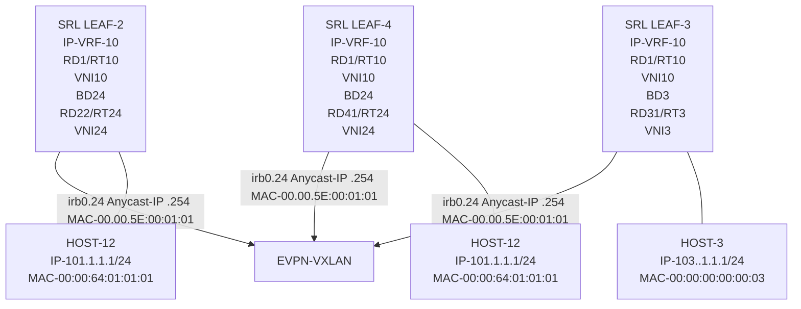

3HE 22247 AAAB TQZZA **© 2026 Nokia.** 312
Use subject to Terms available at: [www.nokia.com/terms](http://www.nokia.com/terms).

Advanced Configuration Guide Release 26.7 EVPN-VXLAN for layer 3

## 15.3.1 Configuring efficient host routing

### About this task

In the initial configuration, HOST-12 is connected to LEAF-2. For LEAF-3 to route traffic (to HOST-12) directly to LEAF-2, LEAF-2 needs to learn HOST-12's IP and advertise its host route in an EVPN-IFL route.

### Procedure

To configure efficient host routing, set the following parameter definitions as shown in the example.

• **learn-unsolicited true** - Triggers the node to snoop/process all solicited and unsolicited ARP messages received on sub-interfaces (no vxlan) and learns the corresponding ARP/ND entries as 'dynamic'. By default, the command is false and only solicited entries are learned, which does not guarantee host mobility.

When enabled, dynamic ARP/ND entries are learned from the following messages received on the sub- interfaces (if the IPs fall into the local subnets):

– ARP and Neighbor Solicitation requests

– Gratuitous ARP requests and unsolicited neighbor advertisements

• **host-route populate dynamic** -Triggers the creation of arp-nd host routes in the IP-VRF-10 route-table out of dynamic ARP entries. These are disabled by default. The arp-nd host routes are *not* installed in the FIB. They are only used in the control plane and advertised to the EVPN-IFL network to attract traffic from LEAF-3. The arp-nd host routes can be exported in any routing protocol, such as EVPN- IFL routes, BGP IPv4/IPv6 routes, OSPF, and ISIS. They are supported in network-instances ip-vrf and default.

• **evpn advertise dynamic** - Triggers the advertisement of EVPN MAC/IP routes for the dynamic learned ARP entries and allows the synchronization of the ARP entries in all IRB sub-interfaces of the same BD. This is only supported on IRB sub-interfaces.

The MAC/IP routes that are advertised for ARP/ND entries contain the S bit set if the corresponding MAC entry in the mac-table is static.

Note that an equivalent command can be used for ND entries.

### Example: Efficient host routing model

```
# subinterface 24
--{ [FACTORY] + candidate shared default }--[ interface irb0 subinterface 24 ]--
# **info**
    ipv4 {
      admin-state enable
      address 101.1.1.2/24 {
      }
      address 101.1.1.254/24 {
          anycast-gw true
          primary
      }
      arp {
          learn-unsolicited true
          debug [
           messages
          ]
          host-route {
           populate dynamic {
           }
          }
```

3HE 22247 AAAB TQZZA 313 **© 2026 Nokia.**
Use subject to Terms available at: [www.nokia.com/terms](http://www.nokia.com/terms).

Advanced Configuration Guide Release 26.7 EVPN-VXLAN for layer 3

```
evpn {
    advertise dynamic {
    }
}
}
}
anycast-gw {
}
```

The next examples show how an ARP Request from HOST-12 to a random IP in the subnet is enough for the irb0.24 to learn the dynamic ARP. It can then create a host route that is advertised as an EVPN IFL route, and imported by LEAF-3.

**Example: LEAF-2 - HOST-12 unsolicited ARP Request**

```
--{ [FACTORY] + candidate shared default }--[ ]--
# show arpnd arp-entries interface irb0 subinterface 24
+-----------+--------------+----------+-------+--------------------+------+
| Interface | Subinterface | Neighbor | Origin| Link layer address |Expiry|
+===========+==============+==========+=======+====================+======+
| irb0      | 24           |101.1.1.4 | evpn  | 00:01:04:FF:00:41 |      |
+-----------+--------------+----------+-------+--------------------+------+
--------------------------------------------------------------------------
 Total entries : 1 (0 static, 1 dynamic)
--------------------------------------------------------------------------
```

**Example: Debug messages - ARP request received**

```
2021-04-15T04:58:05.651861-07:00 dut2 local6|INFO sr_arp_nd_mgr: arpnd|1773|1773|19334|I: Received ARP request on interface irb0.24 (10247 - 22) from datapath. Source Mac : 00:00:64:01:01:01 Source IP : 101.1.1.1 Target Mac : 00:00:00:00:00:00 Target IP : 101.1.1.200
```

**Example: Triggered learning of RT5 and RT2 advertisements**

```
2021-04-15T04:58:06.019955-07:00 dut2 local6|DEBU sr_bgp_mgr: bgp|4933|5176|2128215|D: VR default (1) Peer 1: 3.3.3.3 UPDATE: Peer 1: 3.3.3.3 - Send BGP UPDATE:
 Withdrawn Length = 0
 Total Path Attr Length = 85
 Flag: 0x90 Type: 14 Len: 48 Multiprotocol Reachable NLRI:
        Address Family EVPN
        NextHop len 4 NextHop 2.2.2.2
        Type: EVPN-IP-PREFIX Len: 34 RD: 2.2.2.2:10, tag: 0, ip_prefix: 101.1.1.1/32
         gw_ip 0.0.0.0 Label: 10
 Flag: 0x40 Type: 1 Len: 1 Origin: 0
 Flag: 0x40 Type: 2 Len: 0 AS Path:
 Flag: 0x80 Type: 4 Len: 4 MED: 0
 Flag: 0x40 Type: 5 Len: 4 Local Preference: 100
 Flag: 0xc0 Type: 16 Len: 24 Extended Community:
        target:64500:10
        mac-nh:00:01:02:ff:00:00
        bgp-tunnel-encap:VXLAN
2021-04-15T04:58:06.020003-07:00 dut2 local6|DEBU sr_bgp_mgr: bgp|4933|5176|2128216|D: VR default (1) Peer 1: 3.3.3.3 UPDATE: Peer 1: 3.3.3.3 - Send BGP UPDATE:
 Withdrawn Length = 0
 Total Path Attr Length = 97
 Flag: 0x90 Type: 14 Len: 45 Multiprotocol Reachable NLRI:
        Address Family EVPN
        NextHop len 4 NextHop 2.2.2.2
        Type: EVPN-MAC Len: 37 RD: 2.2.2.2:24 ESI: ESI-0, tag: 0, mac len: 48 mac: 00:00:64:01:01:01, IP len: 4, IP: 101.1.1.1, label1: 24
```

3HE 22247 AAAB TQZZA **© 2026 Nokia.** 314
Use subject to Terms available at: [www.nokia.com/terms](http://www.nokia.com/terms).

Advanced Configuration Guide Release 26.7 EVPN-VXLAN for layer 3

```
Flag: 0x40 Type: 1 Len: 1 Origin: 0
Flag: 0x40 Type: 2 Len: 0 AS Path:
Flag: 0x40 Type: 5 Len: 4 Local Preference: 100
Flag: 0xc0 Type: 16 Len: 16 Extended Community:
target:64500:24
bgp-tunnel-encap:VXLAN
--{ [FACTORY] + candidate shared default }--[ ]--
# **show arpnd arp-entries interface irb0 subinterface 24**
+---------+----------+----------+---------+-------------------+------------------+
|Interface| Sub-     | Neighbor | Origin  | Link layer        | Expiry           |
|         |interface |          |         | address           |                  |
+=========+==========+==========+=========+===================+==================+
| irb0    | 24       |101.1.1.1 | dynamic | 00:00:64:01:01:01 | 3 hours from now |
| irb0    | 24       |101.1.1.4 | evpn    | 00:01:04:FF:00:41 |                  |
+---------+----------+----------+---------+-------------------+------------------+
Total entries : 2 (0 static, 2 dynamic)
---------------------------------------------------------------------------------
--{ [FACTORY] + candidate shared default }--[ ]--
--{ [FACTORY] + candidate shared default }--[ network-instance IP-VRF-10 ]--
# **show route-table ipv4-unicast prefix 101.1.1.1/32 detail**
--------------------------------------------------------------------------------
IPv4 Unicast route table of network instance IP-VRF-10
-----------------------------------------------------------------------------
Destination : 101.1.1.1/32
ID : 0
Route Type : arp-nd
Metric : 0
Preference : 1
Active : true
Last change : 2021-04-15T11:58:05.653Z
Resilient hash: false
---------------------------------------------------------------------------------
Next hops: 1 entries
101.1.1.1 (direct) via [irb0.24]
----------------------------------------------------------------------------------
--{ [FACTORY] + candidate shared default }--[ network-instance IP-VRF-10 ]—
```

### Example: LEAF-3 imports routes as bgp-evpn host route

```
--{ [FACTORY] + candidate shared default }--[ network-instance IP-VRF-10 ]--
# **show route-table ipv4-unicast summary**
------------------------------------------------------------------------------------------
IPv4 Unicast route table of network instance IP-VRF-10
------------------------------------------------------------------------------------------
```

<table>
<thead>
<tr><th>Prefix</th><th>ID</th><th>Active</th><th>Route Type</th><th>Metric</th><th>Pref</th><th>Next-hop (Type)</th><th>Next-hop Interface</th></tr>
</thead>
<tbody>
<tr><td>20.1.1.0/24</td><td>0</td><td>true</td><td>bgp-evpn</td><td>0</td><td>170</td><td>2.2.2.2 (indirect)</td><td>None</td></tr>
<tr><td>20.1.1.3/32</td><td>0</td><td>true</td><td>bgp-evpn</td><td>0</td><td>170</td><td>2.2.2.2 (indirect)</td><td>None</td></tr>
<tr><td>22.22.22.22/32</td><td>0</td><td>true</td><td>bgp-evpn</td><td>0</td><td>170</td><td>2.2.2.2 (indirect)</td><td>None</td></tr>
<tr><td>31.31.31.31/32</td><td>0</td><td>true</td><td>host</td><td>0</td><td>0</td><td>None (extract)</td><td>None</td></tr>
<tr><td>31.31.31.31/32</td><td>1</td><td>false</td><td>bgp-evpn</td><td>0</td><td>170</td><td>2.2.2.2 (indirect)</td><td>None</td></tr>
<tr><td>33.33.33.33/32</td><td>0</td><td>true</td><td>host</td><td>0</td><td>0</td><td>None (extract)</td><td>None</td></tr>
<tr><td>44.44.44.44/32</td><td>0</td><td>true</td><td>bgp-evpn</td><td>0</td><td>170</td><td>4.4.4.4 (indirect)</td><td>None</td></tr>
<tr><td>101.1.1.0/24</td><td>0</td><td>true</td><td>bgp-evpn</td><td>0</td><td>170</td><td>2.2.2.2 (indirect)</td><td>None</td></tr>
<tr><td></td><td></td><td></td><td></td><td></td><td></td><td>4.4.4.4 (indirect)</td><td>None</td></tr>
<tr><td>101.1.1.1/32</td><td>0</td><td>true</td><td>bgp-evpn</td><td>0</td><td>170</td><td>2.2.2.2 (indirect)</td><td>None</td></tr>
<tr><td>102.1.1.0/24</td><td>0</td><td>true</td><td>bgp-evpn</td><td>0</td><td>170</td><td>2.2.2.2 (indirect)</td><td>None</td></tr>
<tr><td>103.1.1.0/24</td><td>0</td><td>true</td><td>local</td><td>0</td><td>0</td><td>103.1.1.3 (direct)</td><td>irb0.3</td></tr>
<tr><td>103.1.1.1/32</td><td>0</td><td>true</td><td>arp-nd</td><td>0</td><td>1</td><td>103.1.1.1 (direct)</td><td>irb0.3</td></tr>
<tr><td>103.1.1.3/32</td><td>0</td><td>true</td><td>host</td><td>0</td><td>0</td><td>None (extract)</td><td>None</td></tr>
</tbody>
</table>

315
3HE 22247 AAAB TQZZA
**© 2026 Nokia.**
Use subject to Terms available at: www.nokia.com/terms.

Advanced Configuration Guide Release 26.7 EVPN-VXLAN for layer 3

```
<table>
<tbody>
<tr><td>103.1.1.254/32</td><td>0</td><td>true</td><td>host</td><td>0</td><td>0</td><td>None (extract)</td><td>None</td></tr>
<tr><td>103.1.1.255/32</td><td>0</td><td>true</td><td>host</td><td>0</td><td>0</td><td>None (broadcast)</td><td>None</td></tr>
<tr><td>104.1.1.0/24</td><td>0</td><td>true</td><td>bgp-evpn</td><td>0</td><td>170</td><td>4.4.4.4 (indirect)</td><td>None</td></tr>
</tbody>
</table>
+----------------+------+-------+-----------+------+-----+--------------------+----------+
-----------------------------------------------------------------------------------------
16 IPv4 routes total
15 IPv4 prefixes with active routes
1 IPv4 prefixes with active ECMP routes
----------------------------------------------------------------------------------------
--{ [FACTORY] + candidate shared default }--[ network-instance IP-VRF-10 ]--
```

## 15.3.2 Mobility event - efficient host routing

When HOST-12 is attached to LEAF-2, the ARP entry must be maintained even if HOST-12 does not send any traffic. If the entry is removed or ages out, the associated arp-nd host route in IP-VRF-10 is removed and the EVPN-IFL route withdrawn. This can cause hair-pinning for traffic routed from LEAF-3. To maintain the HOST-12 ARP entry (and other dynamic ARP/ND entries), the system supports timer-based ARP/ND refreshes (ARP-Request for the host IP).

Timer-based refreshes are triggered 30 seconds before the ARP age-out timer expires, and irrespective of the arrival of packets requiring resolution for the entry. Note that in SR OS, the **arp-proactive-refresh** command is needed so that entries are always refreshed irrespective of the arrival of packets that hit the entry. In SR Linux, this is the default behavior, so there is no command to enable the timer-based refreshes.

When HOST-12 moves from LEAF-2 to LEAF-4, LEAF-4 must advertise the host route for 101.1.1.1/32 in EVPN-IFL as fast as possible and LEAF-2 withdraws its EVPN-IFL route for it. The process used by LEAF-2 and LEAF-4 to update their ARP/route-tables when HOST-12 moves between them is called "EVPN Layer 3 host mobility". SR Linux provides this support per section 4 of draft-ietf-bess-evpn-inter- subnet-forwarding. EVPN Layer 3 host mobility supports the three cases specified in the draft:

• HOST-12 moves to LEAF-4 and generates a GARP

• HOST-12 moves to LEAF-4 and generates traffic, but not ARP

• HOST-12 moves to LEAF-4 and remains silent

To support fast mobility, SR Linux supports triggered refreshes. Triggered refreshes (ARP-Requests on events and not based on timer expiration) are issued from irb0.24 leaf nodes, for the existing dynamic ARP entry 101.1.1.1>00:00:64:01:01:01. The following events apply:

• an EVPN MAC/IP route for 101.1.1.1-> 00:00:64:01:01:01 is received

• an EVPN route for 00:00:64:01:01:01 (no IP) is received

• 00:00:64:01:01:01 ages out in the mac-table (or the entry in the MAC table is cleared manually)

As shown in Figure 49: Example of L3 host mobility, when HOST-12 moves to LEAF-4, and if it issues a GARP or ethernet traffic, the advertised routes immediately updates the ARP/route tables on both leaf nodes. LEAF-3 then changes its next-hop for HOST-12 from LEAF-2 to LEAF-4.

## Example: Silent move - HOST-2 initially attached to LEAF-2

```
--{ [FACTORY] + candidate shared default }—[ ]--
# **show arpnd arp-entries interface irb0 subinterface 24 ipv4-address 101.1.1.1**
+---------+----------+-----------+---------+-------------------+-----------------+
|Interface| Sub-     | Neighbor  | Origin  | Link layer        | Expiry          |
|         |interface |           |         | address           |                 |
```

3HE 22247 AAAB TQZZA 316 **© 2026 Nokia.**
Use subject to Terms available at: [www.nokia.com/terms](http://www.nokia.com/terms).

Advanced Configuration Guide Release 26.7 EVPN-VXLAN for layer 3

```
+=========+==========+===========+=========+===================+=================+
| irb0    | 24       | 101.1.1.1 | dynamic | 00:00:64:01:01:01 | 3 hours from now|
+---------+----------+-----------+---------+-------------------+-----------------+
```

Total entries : 1 (0 static, 1 dynamic)

--{ [FACTORY] + candidate shared default }--[ ]--

# show network-instance BD24 bridge-table mac-table mac 00:00:64:01:01:01

Mac-table of network instance BD24

Mac : 00:00:64:01:01:01
Destination : lag1.24
Dest Index : 20
Type : learnt
Programming Status : Success
Aging : 2680
Last Update : 2021-04-15T14:32:45.000Z
Duplicate Detect time : N/A
Hold down time remaining: N/A

--{ [FACTORY] + candidate shared default }--[ ]--

### Example: Silent move - initial LEAF-4

--{ [FACTORY] + candidate shared default }--[ ]--

# show arpnd arp-entries interface irb0 subinterface 24 ipv4-address 101.1.1.1

```
+---------+----------+-----------+---------+-------------------+-----------------+
|Interface| Sub-     | Neighbor  | Origin  | Link layer        | Expiry          |
|         |interface |           |         | address           |                 |
+=========+==========+===========+=========+===================+=================+
| irb0    | 24       | 101.1.1.1 | evpn    | 00:00:64:01:01:01 |                 |
+---------+----------+-----------+---------+-------------------+-----------------+
```

Total entries : 1 (0 static, 1 dynamic)

--{ [FACTORY] + candidate shared default }--[ ]--

# show network-instance BD24 bridge-table mac-table mac 00:00:64:01:01:01

Mac-table of network instance BD24

Mac : 00:00:64:01:01:01
Destination : vxlan-interface:vxlan1.24 vtep:2.2.2.2 vni:24
Dest Index : 202418654989
Type : evpn
Programming Status : Success
Aging : N/A
Last Update : 2021-04-15T14:15:00.000Z
Duplicate Detect time : N/A
Hold down time remaining: N/A

--{ [FACTORY] + candidate shared default }--[ ]—

### Example: Silent move - watch command output for LEAF-3

Every 2.0s: show route-table ipv4-unicast prefix 101.1.1.1/32 detail (Executions 903, Thu 07:41:40AM)
---------------------------------------------------------------------
IPv4 Unicast route table of network instance IP-VRF-10
---------------------------------------------------------------------
Destination : 101.1.1.1/32

3HE 22247 AAAB TQZZA 317
**© 2026 Nokia.**
Use subject to Terms available at: [www.nokia.com/terms](http://www.nokia.com/terms).

Advanced Configuration Guide Release 26.7 EVPN-VXLAN for layer 3

```
ID             : 0
Route Type     : bgp-evpn
Metric         : 0
Preference     : 170
Active         : true
Last change    : 2021-04-15T14:15:00.450Z
Resilient hash: false
------------------------------------------------------------------
Next hops: 1 entries
2.2.2.2 (indirect) resolved by None (None)
------------------------------------------------------------------
```

## Example: Silent move - move HOST-12 to LEAF-2

In this example, HOST-12 is moved to LEAF-4 to simulate a silent move. Immediately after flushing MAC 00:00:64:01:01:01 in LEAF-2, the MAC/IP routes are withdrawn and LEAF-2 issues three triggered refreshes.

```
--{ [FACTORY] + candidate shared default }--[  ]--
# 2021-04-15T07:43:16.422816-07:00 dut2 local6|INFO sr_arp_nd_mgr: arpnd|1773|1773|20438|
 I: Sending ARP request on interface irb0.24 (10247 - 22). Source Mac : 00:00:5E:00:01:01
 Source IP : 101.1.1.254 Target Mac : 00:00:00:00:00:00 Target IP : 101.1.1.1 Ethernet
 SA 00:00:5E:00:01:01 Ethernet DA FF:FF:FF:FF:FF:FF
2021-04-15T07:43:16.422816-07:00 dut2 local6|INFO sr_arp_nd_mgr: arpnd|1773|1773|20438|I:
 Sending ARP request on interface irb0.24 (10247 - 22). Source Mac : 00:00:5E:00:01:01
 Source IP : 101.1.1.254 Target Mac : 00:00:00:00:00:00 Target IP : 101.1.1.1 Ethernet
 SA 00:00:5E:00:01:01 Ethernet DA FF:FF:FF:FF:FF:FF
2021-04-15T07:43:16.422816-07:00 dut2 local6|INFO sr_arp_nd_mgr: arpnd|1773|1773|20438|I:
 Sending ARP request on interface irb0.24 (10247 - 22). Source Mac : 00:00:5E:00:01:01
 Source IP : 101.1.1.254 Target Mac : 00:00:00:00:00:00 Target IP : 101.1.1.1 Ethernet
 SA 00:00:5E:00:01:01 Ethernet DA FF:FF:FF:FF:FF:FF
Flag: 0x90 Type: 15 Len: 77 Multiprotocol Unreachable NLRI:
    Address Family EVPN
    Type: EVPN-MAC Len: 37 RD: 2.2.2.2:24 ESI: ESI-0, tag: 0, mac len: 48 mac:
        00:00:64:01:01:01, IP len: 4, IP: 101.1.1.1, label1: 0
    Type: EVPN-MAC Len: 33 RD: 2.2.2.2:24 ESI: ESI-0, tag: 0, mac len: 48 mac:
        00:00:64:01:01:01, IP len: 0, IP: NULL, label1: 0
```

## Example: Silent move - LEAF-2 updates

When the refreshes arrive at HOST-12 in LEAF-4, the ARP reply is consumed by LEAF-4 (since the MAC destination address matches the anycast-gw MAC address). LEAF-4 then advertises the MAC/ IP routes and IP Prefix route for HOST-12.

```
Type: EVPN-IP-PREFIX Len: 34 RD: 4.4.4.4:10, tag: 0, ip_prefix: 101.1.1.1/32
    gw_ip 0.0.0.0 Label: 10
Flag: 0x40 Type: 1 Len: 1 Origin: 0
Flag: 0x40 Type: 2 Len: 0 AS Path:
Flag: 0x80 Type: 4 Len: 4 MED: 0
Flag: 0x40 Type: 5 Len: 4 Local Preference: 100
Flag: 0xc0 Type: 16 Len: 24 Extended Community:
    target:64500:10
    mac-nh:00:01:04:ff:00:00
    bgp-tunnel-encap:VXLAN
2021-04-15T07:43:18.763551-07:00 dut2 local6|DEBU sr_bgp_mgr: bgp|4933|5176|2169872|D:
    VR default (1) Peer 1: 4.4.4.4 UPDATE: Peer 1: 4.4.4.4 - Received BGP UPDATE:
    Withdrawn Length = 0
    Total Path Attr Length = 97
```

3HE 22247 AAAB TQZZA **© 2026 Nokia.** 318
Use subject to Terms available at: [www.nokia.com/terms](http://www.nokia.com/terms).

Advanced Configuration Guide Release 26.7 EVPN-VXLAN for layer 3

```
Flag: 0x90 Type: 14 Len: 45 Multiprotocol Reachable NLRI:
  Address Family EVPN
  NextHop len 4 NextHop 4.4.4.4
  Type: EVPN-MAC Len: 37 RD: 4.4.4.4:24 ESI: ESI-0, tag: 0, mac len: 48 mac:
  00:00:64:01:01:01, IP len: 4, IP: 101.1.1.1, label1: 24
  Type: EVPN-MAC Len: 33 RD: 4.4.4.4:24 ESI: ESI-0, tag: 0, mac len: 48 mac:
  00:00:64:01:01:01, IP len: 0, IP: NULL, label1: 24
Flag: 0x40 Type: 1 Len: 1 Origin: 0
Flag: 0x40 Type: 2 Len: 0 AS Path:
Flag: 0x40 Type: 5 Len: 4 Local Preference: 100
Flag: 0xc0 Type: 16 Len: 16 Extended Community:
  target:64500:24
  bgp-tunnel-encap:VXLAN
  Type: EVPN-IP-PREFIX Len: 34 RD: 4.4.4.4:10, tag: 0, ip_prefix:
  101.1.1.1/32 gw_ip 0.0.0.0 Label: 10
Flag: 0x40 Type: 1 Len: 1 Origin: 0
Flag: 0x40 Type: 2 Len: 0 AS Path:
Flag: 0x80 Type: 4 Len: 4 MED: 0
Flag: 0x40 Type: 5 Len: 4 Local Preference: 100
Flag: 0xc0 Type: 16 Len: 24 Extended Community:
  target:64500:10
  mac-nh:00:01:04:ff:00:00
  bgp-tunnel-encap:VXLAN
2021-04-15T07:43:18.766923-07:00 dut2 local6|INFO sr_arp_nd_mgr:
    arpnd|1773|1773|20450|I: The ARP entry for 101.1.1.1 has been updated.
```

After the move, LEAF-2 and LEAF-4 tables are updated, and LEAF-3 points at LEAF-4 as the next-hop for the HOST-12 route.

### Example: Silent move - LEAF-2 tables

--{ [FACTORY] + candidate shared default }--[ ]--
# show arpnd arp-entries interface irb0 subinterface 24 ipv4-address 101.1.1.1

<table>
<thead>
<tr><th>Interface</th><th>Sub-interface</th><th>Neighbor</th><th>Origin</th><th>Link layer address</th><th>Expiry</th></tr>
</thead>
<tbody>
<tr><td>irb0</td><td>24</td><td>101.1.1.1</td><td>evpn</td><td>00:00:64:01:01:01</td><td></td></tr>
</tbody>
</table>

Total entries : 1 (0 static, 1 dynamic)

--{ [FACTORY] + candidate shared default }--[ ]--
# show network-instance BD24 bridge-table mac-table mac 00:00:64:01:01:01

Mac-table of network instance BD24
--------------------------------------------------------------------------------
Mac : 00:00:64:01:01:01
Destination : vxlan-interface:vxlan1.24 vtep:4.4.4.4 vni:24
Dest Index : 202418653897
Type : evpn
Programming Status : Success
Aging : N/A
Last Update : 2021-04-15T14:43:18.000Z
Duplicate Detect time : N/A
Hold down time remaining: N/A
--------------------------------------------------------------------------------
--{ [FACTORY] + candidate shared default }--[ ]--

3HE 22247 AAAB TQZZA **© 2026 Nokia.** 319
Use subject to Terms available at: [www.nokia.com/terms](http://www.nokia.com/terms).

Advanced Configuration Guide Release 26.7 EVPN-VXLAN for layer 3

**Example: Silent move - LEAF-4 tables**

```
--{ [FACTORY] + candidate shared default }--[  ]--
# show arpnd arp-entries interface irb0 subinterface 24 ipv4-address 101.1.1.1
+---------+----------+-----------+---------+------------------+------------------+
|Interface| Sub-     | Neighbor  | Origin  | Link layer       | Expiry           |
|         |interface |           |         | address          |                  |
+=========+==========+===========+=========+==================+==================+
| irb0    | 24       | 101.1.1.1 | dynamic | 00:00:64:01:01:01 | 3 hrs from now   |
+---------+----------+-----------+---------+------------------+------------------+
-----------------------------------------------------------------------------------
Total entries : 1 (0 static, 1 dynamic)
-----------------------------------------------------------------------------------
--{ [FACTORY] + candidate shared default }--[  ]--
--{ [FACTORY] + candidate shared default }--[  ]--
# show network-instance BD24 bridge-table mac-table mac 00:00:64:01:01:01
-----------------------------------------------------------------------------------
Mac-table of network instance BD24
-----------------------------------------------------------------------------------
Mac                         : 00:00:64:01:01:01
Destination                 : lag1.24
Dest Index                  : 18
Type                        : learnt
Programming Status          : Success
Aging                       : 2875
Last Update                 : 2021-04-15T14:43:18.000Z
Duplicate Detect time       : N/A
Hold down time remaining: N/A
-----------------------------------------------------------------------------------
--{ [FACTORY] + candidate shared default }--[  ]--
```

**Example: Silent move - watch command output for LEAF-3**

```
Every 2.0s: show route-table ipv4-unicast prefix 101.1.1.1/32 detail
(Executions 976, Thu 07:44:30AM)
-------------------------------------------------------------------
IPv4 Unicast route table of network instance IP-VRF-10
-------------------------------------------------------------------
Destination     : 101.1.1.1/32
ID              : 0
Route Type      : bgp-evpn
Metric          : 0
Preference      : 170
Active          : true
Last change     : 2021-04-15T14:43:19.767Z
Resilient hash: false
-------------------------------------------------------------------
Next hops: 1 entries
4.4.4.4 (indirect) resolved by None (None)
-------------------------------------------------------------------
```

## 15.4 EVPN-VXLAN Layer 3 feature parity for IPv6 prefixes

All the features discussed in this chapter are supported for IPv6 prefixes and hosts. EVPN IFL works for Prefix IPv6 routes without enabling a separate BGP family. EVPN supports IPv4 and IPv6 routes. In

3HE 22247 AAAB TQZZA **© 2026 Nokia.** 320
Use subject to Terms available at: [www.nokia.com/terms](http://www.nokia.com/terms).

Advanced Configuration Guide Release 26.7 EVPN-VXLAN for layer 3

addition, all IRB sub-interfaces must be configured with the IPv6 container using the same commands used earlier in this chapter, but performed under ‟neighbor-discovery”.

## 15.4.1 Configuring IPv6 Container

### Procedure

See the following example to configure the IPv6 container.

### Example: IPv6 container configuration

```
--{ [FACTORY] + candidate shared default }--[ interface irb0 subinterface 24 ]--
# **info**
ipv4 {
        admin-state enable
        address 101.1.1.2/24 {
        }
        address 101.1.1.254/24 {
         anycast-gw true
         primary
        }
        address 102.1.1.254/24 {
        }
        arp {
         learn-unsolicited true
         debug [
             messages
         ]
         host-route {
             populate dynamic {
             }
         }
         evpn {
             advertise dynamic {
             }
         }
        }
 }
 ipv6 {
        admin-state enable
        address 2001:db8:24::254/64 {
         anycast-gw true
        }
        neighbor-discovery {
         learn-unsolicited both
         host-route {
             populate dynamic {
             }
         }
         evpn {
             advertise dynamic {
             }
         }
        }
 anycast-gw {
 }
```

3HE 22247 AAAB TQZZA 321
© 2026 Nokia.
Use subject to Terms available at: [www.nokia.com/terms](http://www.nokia.com/terms).

Advanced Configuration Guide Release 26.7 EVPN-VXLAN for layer 3

## 15.4.2 Additional feature parity considerations

The anycast-gw container is common for IPv4 and IPv6. Therefore, the anycast-gw mac is the same for both families. Only one anycast-gw MAC is programmed in the interface, and IPv4 and IPv6 packets use this anycast-gw-mac as MAC SA when sourcing packets to the BD.

LLA and global addresses are advertised in EVPN. The command **neighbor-discovery learn-unsolicited** **both** includes global and link local addresses.

The following example shows that when anycast-gw is enabled, an anycast-gw LLA is automatically generated. The anycast-gw ipv6 link local address is based off the anycast-gw-mac when the anycast-gw and the ipv6 containers are present. The logic to compute this new anycast-gw ipv6 link local address is the same as is used for computing the regular ipv6 LLA except the anycast-gw-mac is used instead of the interface mac. This new ipv6 LLA appears in the list of ipv6 addresses associated with the subinterface, but with the attribute **anycast-gw true**.

Multicast NS messages use the anycast-gw LLA and anycast-gw MAC. Unicast NS use the global IPv6 and hw-address.

### Example: LLA generation

```
--{ [FACTORY] + candidate shared default }--[ interface irb0 subinterface 24 ipv6 ]--
# **info from state**
 address 2001:db8:24::254/64 {
  **anycast-gw true**
  origin static
  primary
  status preferred
 }
 **address fe80::200:5eff:fe00:101/64**          {
  **anycast-gw true**
  origin link-layer
  status preferred
 }
 address fe80::201:2ff:feff:41/64 {
  origin link-layer
  status preferred
 }
 neighbor-discovery {
  duplicate-address-detection true
  reachable-time 30
  stale-time 14400
  learn-unsolicited both
  neighbor fe80::201:4ff:feff:41 {
              link-layer-address 00:01:04:FF:00:41
              origin evpn
  }
  host-route {
              populate dynamic {
              }
  }
  evpn {
              advertise dynamic {
               admin-tag 0
              }
  }
 }
 router-advertisement {
  router-role {
              current-hop-limit 64
```

3HE 22247 AAAB TQZZA    **© 2026 Nokia.**    322
Use subject to Terms available at: [www.nokia.com/terms](http://www.nokia.com/terms).

Advanced Configuration Guide Release 26.7

Advanced Configuration Guide Release 26.7 LDP Point-to-Point LSPs

# 16 LDP Point-to-Point LSPs

This chapter provides information about Label Distribution Protocol (LDP) point-to-point Label Switched Paths (LSPs)

Topics in this chapter include:

* Applicability
* Overview
* Configuration
* Conclusion

## 16.1 Applicability

This chapter is applicable to SR Linux 25.7.R1. There are no prerequisites or conditions on the hardware for this configuration.

## 16.2 Overview

Because of the connectionless nature of the network layer protocol, IP packets travel through the network on a hop-by-hop basis with routing decisions made at each node. As a result, hyper aggregation of data on specific links may occur and it may impact the provider's ability to provide guaranteed service levels across the network end-to-end. To address these shortcomings, Multi-Protocol Label Switching (MPLS) was developed.

MPLS provides the capability to establish connection-oriented paths, called Label Switched Paths (LSPs), over a connectionless (IP) network. The LSP offers a mechanism to engineer network traffic independently from the underlying network routing protocol (mostly IP) to improve the network resiliency and recovery options and to permit delivery of services that are not readily supported by conventional IP routing techniques, such as Layer 2 Virtual Private Networks (VPNs). These benefits are essential for today's communication network explaining the wide deployment base of the MPLS technology.

RFC 3031 specifies the MPLS architecture whereas this chapter describes the configuration and troubleshooting of point-to-point LSPs on SR Linux.

## 16.2.1 Packet forwarding

When a packet of a connectionless network layer protocol travels from one router to the next, each router in the network makes an independent forwarding decision by performing the following basic tasks:

**1.** analyzing the packet header

**2.** referencing the local routing table to find the longest prefix match based on the destination address in the IP header

**3.** sending out the packet on the corresponding interface

3HE 22247 AAAB TQZZA 324
**© 2026 Nokia.**
Use subject to Terms available at: [www.nokia.com/terms](http://www.nokia.com/terms).

Advanced Configuration Guide Release 26.7 LDP Point-to-Point LSPs

The first function partitions the entire set of incoming packets into a set of Forwarding Equivalence Classes (FECs). All packets mapped to a particular FEC are forwarded along the same path to the same destination. The second function maps each FEC to a next hop destination router. Each router along the path performs these actions.

In MPLS, the assignment of a packet to a particular FEC is done only when the packet enters the network. The FEC is mapped to an LSP, which must be established before the packets can be forwarded.

An MPLS egress label, representing the FEC to which the packet is assigned, is attached to the packet (push operation) and the labeled packet is forwarded to the next hop router along that LSP path.

At subsequent hops, the packet IP header is not analyzed. Instead, the ingress label is used as an index into a table which specifies the next hop and a new egress label. The ingress label is replaced with the new egress label (swap operation), and the packet is forwarded to the specified next hop.

At the MPLS network egress, the ingress label is removed from the packet (pop operation). If this router is the destination of the packet (based on the remaining packet), the packet is handed to the receiving application, such as a MAC VRF. If this router is not the destination of the packet, the packet is sent into a new MPLS tunnel or forwarded by conventional IP forwarding toward the Layer 3 destination.

## 16.2.2 Terminology

*Figure 50: Generic MPLS network, MPLS label operations*

illustration: Generic MPLS network, MPLS label operations

Figure 50: Generic MPLS network, MPLS label operations shows a general network topology clarifying the MPLS-related terms. A Label Edge Router (LER) is a device at the edge of an MPLS network, with at

3HE 22247 AAAB TQZZA 325
© 2026 Nokia.
Use subject to Terms available at: [www.nokia.com/terms](http://www.nokia.com/terms).

Advanced Configuration Guide Release 26.7    LDP Point-to-Point LSPs

least one interface outside the MPLS domain. A router is usually defined as an LER based on its position relative to a particular LSP:

• The MPLS router at the head-end of an LSP is called the ingress Label Edge Router (ILER)

• The MPLS router at the tail-end of an LSP is called the egress Label Edge Router (ELER)

The ILER receives unlabeled packets from outside the MPLS domain, applies MPLS egress labels to the packets, and forwards the labeled packets into the MPLS domain.

The ELER receives labeled packets from the MPLS domain, removes the ingress labels, and forwards unlabeled packets outside the MPLS domain. The ELER can signal an implicit-null label. This informs the previous hop to send MPLS packets without an outer egress label. This is known as Penultimate Hop Popping (PHP).

A Label Switching Router (LSR) is a device internal to an MPLS network, with all interfaces inside the MPLS domain. These devices switch labeled packets inside the MPLS domain. In the core of the network, LSRs ignore the packet IP header and simply forward the packet using the MPLS label swapping mechanism.

## 16.2.3 LSP establishment

The LSP must be established before any packets can be forwarded. To set up an LSP, labels need to be distributed for the path. Labels are usually distributed by a downstream router in the upstream direction (relative to the data flow). Label distribution can be static or via a protocol such as LDP. For static P2P LSPs, see Static MPLS LSPs.

LDP (RFC 5036) can be considered as an extension to the network Interior Gateway Protocol (IGP). As routers become aware of new destination networks, they advertise labels in the upstream direction that allow upstream routers to reach the destination.

LDP loopfree alternate (LFA) allows for computing backup paths and advertising the backup labels before a failure takes place. In this way traffic can flow almost continuously, without waiting for routing protocol convergence; see MPLS LDP LFA using ISIS as IGP.

## 16.2.4 Example topology

Figure 51: MPLS example topology shows the example topology consisting of six SR Linux nodes located in a single autonomous system.

3HE 22247 AAAB TQZZA    **© 2026 Nokia.**    326
Use subject to Terms available at: www.nokia.com/terms.

Advanced Configuration Guide Release 26.7    LDP Point-to-Point LSPs

Figure 51: MPLS example topology

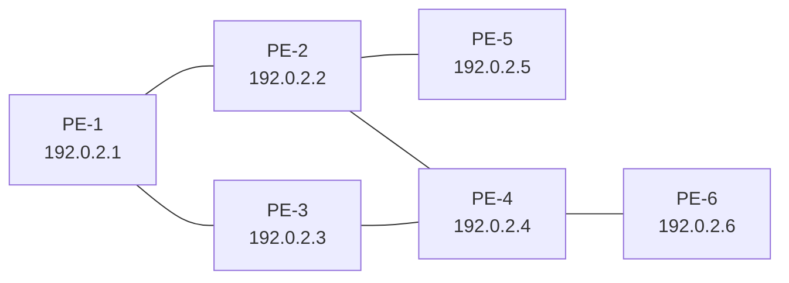

## 16.3 Configuration

The configuration of dynamic MPLS LSPs requires a correctly working Interior Gateway Protocol (IGP). Intermediate System to Intermediate System (IS-IS) or Open Shortest Path First (OSPF) can be used as IGP.

LDP is a simple Label Distribution Protocol with basic MPLS functionality (no traffic engineering). It supports LFA for fast rerouting; see MPLS LDP LFA using ISIS as IGP. LDP relies on the underlying routing information provided by an IGP to forward labeled packets. Each LDP configured LSR originates a label for its system address and a label for each FEC for which it has a next hop that is external to the MPLS domain, without the explicit need to manually configure the LSPs. When deviations from this default behavior are needed, import and export policies can be applied.

The configuration is as simple as enabling the LDP protocol instance and adding all network interfaces, for each node. The configuration for IPv4 on node PE-1 is as follows; similar configurations apply on the other nodes. Configuration for IPv6 is also supported, but not described in this chapter.

```
# on PE-1:
enter candidate
  system mpls label-ranges {
               **dynamic dlb-ldp** {
                start-label 20000
                end-label 29999
               }
enter candidate
  network-instance default protocols ldp {
               admin-state enable
               **dynamic-label-block dlb-ldp**
               fec-resolution {
                **longest-prefix true**       # optional; default: exact match
               }
               discovery {
```

3HE 22247 AAAB TQZZA    **© 2026 Nokia.**    327
                        Use subject to Terms available at: [www.nokia.com/terms](http://www.nokia.com/terms).

Advanced Configuration Guide Release 26.7 LDP Point-to-Point LSPs

```
interfaces {
     interface ethernet-1/31.1 {
          ipv4 {
            admin-state enable
          }
     }
     interface ethernet-1/32.1 {
          ipv4 {
            admin-state enable
          }
     }
}
```

The LDP label range must be explicitly configured on all nodes as **dynamic** in the **system mpls label-**
**ranges context**. The FEC resolution is based on the longest prefix match, with **longest-prefix true** in the
**network-instance default protocols ldp fec-resolution** context. By default, SR Linux supports /32 IPv4
and /128 IPv6 FEC resolution using IGP routes. When longest-prefix match is enabled for IPv4 and IPv6
FEC resolution, IPv4 and IPv6 prefix FECs can be resolved by less-specific routes in the route table, as
long as the prefix bits of the route match the prefix bits of the FEC. The IP route with the longest prefix
match is the route that is used to resolve the FEC.

On each node, the local network interfaces that are part of the MPLS network must be configured in the
**network-instance default protocols ldp discovery interfaces** context.

The LDP configuration can be verified as follows:

```
# On PE-1:
--{ running }--[     ]--
A:admin@PE-1# show / network-instance default protocols ldp summary
===============================================================================================
==========================================================
Net-Inst default LDP Summary
-----------------------------------------------------------------------------------------------
----------------------------------------------------------
Admin State                      : enable
**FEC Match Longest Prefix**         : **true**
**Dynamic Label Block**              : **dlb-ldp**
**Dynamic Label Block Status**       : **available**
Graceful Restart Enabled         : false
GR Max Reconnect Time            : 120
GR Max Recovery Time             : 120
Max Multipaths                   : 1
**IPv4 Oper State**                  : **up**
IPv4 Last oper state change      : 2025-08-25T11:58:41.600Z
**IPv4 LSR ID**                      : **192.0.2.1**      # different for each node
IPv6 Oper State                  : down           # this setup does not have IPv6 configuration
IPv6 Oper Down Reason            : no-system-ipv6-address
IPv6 Last oper state change      : 2025-08-25T11:58:39.900Z
IPv6 LSR ID                      : ::
Session Keepalive Holdtime       : 180
Session Keepalive Interval       : 60
-----------------------------------------------------------------------------------------------
----------------------------------------------------------
===============================================================================================
==========================================================
```

The LDP adjacencies can be verified as follows:

```
# On PE-1:
--{ running }--[     ]--
```

3HE 22247 AAAB TQZZA 328
**© 2026 Nokia.**
Use subject to Terms available at: [www.nokia.com/terms](http://www.nokia.com/terms).

Advanced Configuration Guide Release 26.7 LDP Point-to-Point LSPs

A:admin@PE-1# show / network-instance default protocols ldp neighbor

<table>
<thead>
<tr><th>Interface</th><th>Peer LDP ID</th><th>Nbr Address</th><th>Local Address</th><th>Proposed Holdtime</th><th>Negotiated Holdtime</th><th>Remaining Holdtime</th></tr>
</thead>
<tbody>
<tr><td>ethernet-1/31.1</td><td>192.0.2.2:0</td><td>192.168.12.2</td><td>192.168.12.1</td><td>15</td><td>15</td><td>12</td></tr>
<tr><td>ethernet-1/32.1</td><td>192.0.2.3:0</td><td>192.168.13.2</td><td>192.168.13.1</td><td>15</td><td>15</td><td>11</td></tr>
</tbody>
</table>

The LDP tunnels that are automatically set up to the remote destinations can be verified as follows:

# On PE-1:
--{ running }--[ ]--
A:admin@PE-1# show / network-instance default tunnel-table all

IPv4 tunnel table of network-instance "default"

<table>
<thead>
<tr><th>IPv4 Prefix</th><th>Encaps Type</th><th>Tunnel Type</th><th>Tunnel ID</th><th>FIB</th><th>Metric</th><th>Preference</th><th>Last Update</th><th>Next-hop (Type)</th><th>Next-hop</th></tr>
</thead>
<tbody>
<tr><td>192.0.2.2/32</td><td>mpls</td><td>ldp</td><td>65537</td><td>Y</td><td>10</td><td>9</td><td>2025-08-25T11:59:08.272Z</td><td>192.168.12.2 (mpls)</td><td>ethernet-1/31.1</td></tr>
<tr><td>192.0.2.3/32</td><td>mpls</td><td>ldp</td><td>65538</td><td>Y</td><td>10</td><td>9</td><td>2025-08-25T11:59:27.962Z</td><td>192.168.13.2 (mpls)</td><td>ethernet-1/32.1</td></tr>
<tr><td>192.0.2.4/32</td><td>mpls</td><td>ldp</td><td>65539</td><td>Y</td><td>20</td><td>9</td><td>2025-08-25T11:59:55.797Z</td><td>192.168.12.2 (mpls)</td><td>ethernet-1/31.1</td></tr>
<tr><td>192.0.2.5/32</td><td>mpls</td><td>ldp</td><td>65540</td><td>Y</td><td>20</td><td>9</td><td>2025-08-25T12:00:14.802Z</td><td>192.168.12.2 (mpls)</td><td>ethernet-1/31.1</td></tr>
<tr><td>**192.0.2.6/32**</td><td>**mpls**</td><td>**ldp**</td><td>**65541**</td><td>**Y**</td><td>**30**</td><td>**9**</td><td>**2025-08-25T12:00:32.542Z**</td><td>**192.168.12.2** **(mpls)**</td><td>**ethernet-1/31.1**</td></tr>
</tbody>
</table>

3HE 22247 AAAB TQZZA © **2026 Nokia.** 329
Use subject to Terms available at: [www.nokia.com/terms](http://www.nokia.com/terms).

Advanced Configuration Guide Release 26.7    LDP Point-to-Point LSPs

```
-----------------------------------------------------------------------------------------------
----------------------------------------------------------
**5 LDP tunnels**, **5 active**, 0 inactive
-----------------------------------------------------------------------------------------------
----------------------------------------------------------
-----------------------------------------------------------------------------------------------
----------------------------------------------------------
```

IPv6 tunnel table of network-instance "default"
-----------------------------------------------------------------------------------------------
----------------------------------------------------------
<no_entries>
-----------------------------------------------------------------------------------------------
----------------------------------------------------------
-----------------------------------------------------------------------------------------------
----------------------------------------------------------

Five LDP tunnels start on each node, one to each remote node. A node does not have an LDP tunnel to itself. As a result of the SPF computation on PE-1, only the LDP tunnel from PE-1 to PE-3 (IPv4 prefix 192.0.2.3/32) starts at the ethernet-1/32.1 subinterface on PE-1 (to PE-3). The LDP tunnels from PE-1 to all other nodes start at the ethernet-1/31.1 subinterface on PE-1 (to PE-2). The SPF computation on the other nodes governs the LDP tunnels that start on them.

The LDP tunnel from PE-1 to PE-6 (tunnel ID 65541) uses egress label 20005 and passes through PE-2. This can be verified as follows:

# On PE-1:
--{ running }--[          ]--
A:admin@PE-1# info from state with-context / network-instance default tunnel-table ipv4 tunnel
 * type * owner * id * |
 as table | filter fields encapsulation-type metric preference next-hop-group
+-------------+-------------------+--------------------------+-------------+-----------+--------------------+-----------+-----------+--------------------+
<table>
    <tr>
        <th>Network-</th>
        <th>Ipv4-prefix</th>
        <th>Type</th>
        <th>Owner</th>
        <th>Id</th>
        <th>Encapsulation-</th>
        <th>Metric</th>
        <th>Preferenc</th>
        <th>Next-hop-group</th>
    </tr>
    <tr>
        <td>instance</td>
        <td></td>
        <td></td>
        <td></td>
        <td></td>
        <td>type</td>
        <td></td>
        <td>e</td>
        <td></td>
    </tr>
</table>
+=============+===================+==========================+=============+===========+====================+===========+===========+====================+
<table>
    <tr>
        <th>default</th>
        <th>192.0.2.2/32</th>
        <th>**ldp**</th>
        <th>**ldp_mgr**</th>
        <th>**65537**</th>
        <th>**mpls**</th>
        <th>**10**</th>
        <th>**9**</th>
        <th>**28227483**</th>
    </tr>
    <tr>
        <td>default</td>
        <td>192.0.2.3/32</td>
        <td>**ldp**</td>
        <td>**ldp_mgr**</td>
        <td>**65538**</td>
        <td>**mpls**</td>
        <td>**10**</td>
        <td>**9**</td>
        <td>**28227484**</td>
    </tr>
    <tr>
        <td>default</td>
        <td>192.0.2.4/32</td>
        <td>**ldp**</td>
        <td>**ldp_mgr**</td>
        <td>**65539**</td>
        <td>**mpls**</td>
        <td>**20**</td>
        <td>**9**</td>
        <td>**28227485**</td>
    </tr>
    <tr>
        <td>default</td>
        <td>192.0.2.5/32</td>
        <td>**ldp**</td>
        <td>**ldp_mgr**</td>
        <td>**65540**</td>
        <td>**mpls**</td>
        <td>**20**</td>
        <td>**9**</td>
        <td>**28227486**</td>
    </tr>
    <tr>
        <td>default</td>
        <td>192.0.2.6/32</td>
        <td>**ldp**</td>
        <td>**ldp_mgr**</td>
        <td>**65541**</td>
        <td>**mpls**</td>
        <td>**30**</td>
        <td>**9**</td>
        <td>**28227487**</td>
    </tr>
</table>
+-------------+-------------------+--------------------------+-------------+-----------+--------------------+-----------+-----------+--------------------+
--{ running }--[          ]--
A:admin@PE-1# info from state with-context / network-instance default tunnel-table
 network-instance default {
        tunnel-table {
               ---snip---
               ipv4 {
                     ---snip---
                     **tunnel 192.0.2.6/32 type ldp** owner **ldp_mgr** **id 65541** {
                          encapsulation-type **mpls**
                          **next-hop-group 28227487**
                          metric **30**

3HE 22247 AAAB TQZZA    **© 2026 Nokia.**    330
                        Use subject to Terms available at: [www.nokia.com/terms](http://www.nokia.com/terms).

Advanced Configuration Guide Release 26.7

Advanced Configuration Guide Release 26.7 LDP Point-to-Point LSPs

```
<table>
<tbody>
<tr><td>default</td><td>28227472</td><td>mpls</td><td>192.168.12.2</td><td>ethernet-1/31.1</td><td>20003</td></tr>
<tr><td>default</td><td>28227473</td><td>mpls</td><td>192.168.12.2</td><td>ethernet-1/31.1</td><td>20004</td></tr>
<tr><td>default</td><td>28227474</td><td>mpls</td><td>192.168.12.2</td><td>ethernet-1/31.1</td><td>20005</td></tr>
</tbody>
</table>
```

```
--{ running }--[ ]--
A:admin@PE-1# info from state with-context / network-instance default route-table next-hop *
      network-instance default {
                route-table {
                ---snip---
                next-hop 28227474 {
                     resource-allocation-failed false
                     type mpls
                     ip-address 192.168.12.2
                     subinterface ethernet-1/31.1
                     mpls-encapsulation {
                          entropy-label-transmit false
                          pushed-mpls-label-stack [
                                20005
                          ]
                     }
                }
```

On PE-1, the LDP tunnel to PE-6 (tunnel ID 65541) has **next-hop-group 28227487**, which uses **next-hop 28227474** that specifies **pushed-mpls-label-stack [20005]** and **ip-address 192.168.12.2** via **subinterface ethernet-1/31.1**.

The MPLS ingress label processing on each node through which the LDP tunnel passes can be verified as follows:

# On PE-2:
--{ running }--[ ]--
A:admin@PE-2# show / network-instance default route-table mpls

<table>
<thead>
<tr><th>Label</th><th>Operation</th><th>Type</th><th>Next Net-Inst</th><th>Next-hop IP (Type)</th><th>Next-hop Subinterface</th><th>Next-hop MPLS labels</th></tr>
</thead>
<tbody>
<tr><td>20000</td><td>POP</td><td>ldp</td><td>default</td><td></td><td></td><td></td></tr>
<tr><td>20001</td><td>SWAP</td><td>ldp</td><td>N/A</td><td>192.168.12.1 (mpls)</td><td>ethernet-1/33.1</td><td>20000</td></tr>
<tr><td>20002</td><td>SWAP</td><td>ldp</td><td>N/A</td><td>192.168.12.1 (mpls)</td><td>ethernet-1/33.1</td><td>20002</td></tr>
<tr><td>20003</td><td>SWAP</td><td>ldp</td><td>N/A</td><td>192.168.24.2 (mpls)</td><td>ethernet-1/10.1</td><td>20000</td></tr>
<tr><td>20004</td><td>SWAP</td><td>ldp</td><td>N/A</td><td>192.168.25.2 (mpls)</td><td>ethernet-1/11.1</td><td>20000</td></tr>
<tr><td>20005</td><td>SWAP</td><td>ldp</td><td>N/A</td><td>192.168.24.2 (mpls)</td><td>ethernet-1/10.1</td><td>20005</td></tr>
</tbody>
</table>

--{ running }--[ ]--
A:admin@PE-2# info from state with-context / network-instance default route-table mpls label-entry *

3HE 22247 AAAB TQZZA 332 **© 2026 Nokia.**
Use subject to Terms available at: [www.nokia.com/terms](http://www.nokia.com/terms).

Advanced Configuration Guide Release 26.7 LDP Point-to-Point LSPs

<table>
<thead>
<tr><th>Network-instance</th><th>Label-value</th><th>Operation</th><th>Entry-type</th><th>Next-hop-group</th></tr>
</thead>
<tbody>
<tr><td>**default**</td><td>20000</td><td>pop</td><td>**ldp**</td><td></td></tr>
<tr><td>**default**</td><td>20001</td><td>swap</td><td>**ldp**</td><td>28209398</td></tr>
<tr><td>**default**</td><td>20002</td><td>swap</td><td>**ldp**</td><td>28209399</td></tr>
<tr><td>**default**</td><td>20003</td><td>swap</td><td>**ldp**</td><td>28209400</td></tr>
<tr><td>**default**</td><td>20004</td><td>swap</td><td>**ldp**</td><td>28209401</td></tr>
<tr><td>**default**</td><td>20005</td><td>swap</td><td>**ldp**</td><td>**28209402**</td></tr>
</tbody>
</table>

When PE-2 receives a packet labeled with (ingress) label 20000, PE-2 pops the label and processes the packet locally. When PE-2 receives a packet labeled with (ingress) label 20001, PE-2 swaps the label to the next-hop MPLS (egress) label 20000 and forwards the packet to PE-1 (next-hop IP 192.168.12.1) via next-hop subinterface ethernet-1/33.1. When PE-2 receives a packet labeled with (ingress) label 20003, PE-2 swaps the label to the next-hop MPLS (egress) label 20000 and forwards the packet to PE-4 (next-hop IP 192.168.24.2) via next-hop subinterface ethernet-1/10.1.

PE-2 receives a packet from PE-1, which is labeled with (ingress) label 20005. PE-2 swaps the label to the next-hop MPLS (egress) label 20005 and forwards the packet to PE-4 (next-hop IP 192.168.24.2) via next-hop subinterface ethernet-1/10.1.

# On PE-4:
--{ running }--[ ]-- A:admin@PE-4# show / network-instance default route-table mpls

<table>
<thead>
<tr><th>Label</th><th>Operation</th><th>Type</th><th>Next Net-Inst</th><th>Next-hop IP (Type)</th><th>Next-hop Subinterface</th><th>Next-hop MPLS labels</th></tr>
</thead>
<tbody>
<tr><td>20000</td><td>POP</td><td>**ldp**</td><td>default</td><td></td><td></td><td></td></tr>
<tr><td>20001</td><td>**SWAP**</td><td>**ldp**</td><td>N/A</td><td>192.168.24.1 (mpls)</td><td>ethernet-1/31.1</td><td>20000</td></tr>
<tr><td>20002</td><td>**SWAP**</td><td>**ldp**</td><td>N/A</td><td>192.168.24.1 (mpls)</td><td>ethernet-1/31.1</td><td>20001</td></tr>
<tr><td>20003</td><td>**SWAP**</td><td>**ldp**</td><td>N/A</td><td>192.168.34.1 (mpls)</td><td>ethernet-1/32.1</td><td>20000</td></tr>
<tr><td>20004</td><td>**SWAP**</td><td>**ldp**</td><td>N/A</td><td>192.168.24.1 (mpls)</td><td>ethernet-1/31.1</td><td>20004</td></tr>
<tr><td>**20005**</td><td>**SWAP**</td><td>**ldp**</td><td>N/A</td><td>**192.168.46.2 (mpls)**</td><td>**ethernet-1/6.1**</td><td>**20000**</td></tr>
</tbody>
</table>

3HE 22247 AAAB TQZZA <bold>**© 2026 Nokia.**</bold> 333
Use subject to Terms available at: [www.nokia.com/terms](http://www.nokia.com/terms).

Advanced Configuration Guide Release 26.7 LDP Point-to-Point LSPs

PE-4 receives the packet from PE-2, which is labeled with (ingress) label 20005. PE-4 swaps the label to the next-hop MPLS (egress) label 20000 and forwards the packet to PE-6 (next-hop IP 192.168.46.2) via next-hop subinterface ethernet-1/6.1.

<table>
<thead>
<tr><th>Label</th><th>Operation</th><th>Type</th><th>Next Net-Inst</th><th>Next-hop IP (Type)</th><th>Next-hop Subinterface</th><th>Next-hop MPLS labels</th></tr>
</thead>
<tbody>
<tr><td>**20000**</td><td>**POP**</td><td>**ldp**</td><td>**default**</td><td></td><td></td><td></td></tr>
<tr><td>20001</td><td>SWAP</td><td>ldp</td><td>N/A</td><td>192.168.56.1 (mpls)</td><td>ethernet-1/5.1</td><td>20000</td></tr>
<tr><td>20002</td><td>SWAP</td><td>ldp</td><td>N/A</td><td>192.168.46.1 (mpls)</td><td>ethernet-1/4.1</td><td>20002</td></tr>
<tr><td>20003</td><td>SWAP</td><td>ldp</td><td>N/A</td><td>192.168.46.1 (mpls)</td><td>ethernet-1/4.1</td><td>20001</td></tr>
<tr><td>20004</td><td>SWAP</td><td>ldp</td><td>N/A</td><td>192.168.46.1 (mpls)</td><td>ethernet-1/4.1</td><td>20003</td></tr>
<tr><td>20005</td><td>SWAP</td><td>ldp</td><td>N/A</td><td>192.168.46.1 (mpls)</td><td>ethernet-1/4.1</td><td>20000</td></tr>
</tbody>
</table>

PE-6 receives the packet from PE-4, which is labeled with (ingress) label 20000. PE-6 pops the label and processes the packet locally.

The (egress) next hops can be verified as follows:

<table>
<tr><td>Index</td><td>28227470</td></tr>
<tr><td>Next-hop</td><td>192.168.12.2</td></tr>
<tr><td>Type</td><td>mpls</td></tr>
<tr><td>MPLS label stack</td><td>[20000]</td></tr>
<tr><td>Index</td><td>28227471</td></tr>
<tr><td>Next-hop</td><td>192.168.13.2</td></tr>
<tr><td>Type</td><td>mpls</td></tr>
<tr><td>**MPLS label stack**</td><td>**[20000]**</td></tr>
<tr><td>Index</td><td>28227472</td></tr>
<tr><td>**Next-hop**</td><td>**192.168.12.2**</td></tr>
<tr><td>Type</td><td>mpls</td></tr>
<tr><td>**MPLS label stack**</td><td>**[20003]**</td></tr>
<tr><td>Index</td><td>28227473</td></tr>
<tr><td>**Next-hop**</td><td>**192.168.12.2**</td></tr>
<tr><td>Type</td><td>mpls</td></tr>
<tr><td>**MPLS label stack**</td><td>**[20004]**</td></tr>
<tr><td>Index</td><td>28227474</td></tr>
<tr><td>Next-hop</td><td>192.168.12.2</td></tr>
</table>

3HE 22247 AAAB TQZZA **© 2026 Nokia.** 334
Use subject to Terms available at: [www.nokia.com/terms](http://www.nokia.com/terms).

Advanced Configuration Guide Release 26.7 LDP Point-to-Point LSPs

<table>
<thead>
<tr><th>Network-instance</th><th>Index</th><th>Type</th><th>Ip-address</th><th>Subinterface</th><th>Mpls-encapsulation</th></tr>
<tr><th>Network-instance</th><th>Index</th><th>Type</th><th>Ip-address</th><th>Subinterface</th><th>pushed-mpls-label-stack</th></tr>
<tr><th>Network-instance</th><th>Index</th><th>Type</th><th>Ip-address</th><th>Subinterface</th><th>pushed-mpls-label-stack</th></tr>
</thead>
<tbody>
<tr><td>---snip--- # non MPLS</td><td></td><td></td><td></td><td></td><td></td></tr>
<tr><td>default</td><td>28227470</td><td>mpls</td><td>**192.168.12.2**</td><td>ethernet-1/31.1</td><td>**20000**</td></tr>
<tr><td>default</td><td>28227471</td><td>mpls</td><td>**192.168.13.2**</td><td>ethernet-1/32.1</td><td>**20000**</td></tr>
<tr><td>default</td><td>28227472</td><td>mpls</td><td>**192.168.12.2**</td><td>ethernet-1/31.1</td><td>**20003**</td></tr>
<tr><td>default</td><td>28227473</td><td>mpls</td><td>**192.168.12.2**</td><td>ethernet-1/31.1</td><td>**20004**</td></tr>
<tr><td>default</td><td>28227474</td><td>mpls</td><td>**192.168.12.2**</td><td>ethernet-1/31.1</td><td>**20005**</td></tr>
</tbody>
</table>

In the preceding output, the (egress) next hops that relate with LDP tunnels are those with **MPLS label stack: [<LDP label>]**. PE-1 learns the (egress) labels that it must use to reach a destination, from the FEC prefixes that its LDP peers (**interfaces** on PE-2 and PE-3) advertise. This information can be obtained as follows:

```
# On PE-1:
--{ running }--[ ]--
A:admin@PE-1# info from state with-context / network-instance default protocols ldp ipv4 bindings received-address
          network-instance default {
            protocols {
              ldp {
               ipv4 {
                  bindings {
                       received-address {
                       peer 192.0.2.2 label-space-id 0 {
                             ip-address [
                                192.0.2.2
                                192.168.12.2
                                192.168.24.1
                                192.168.25.1
                             ]
                       }
                       peer 192.0.2.3 label-space-id 0 {
                             ip-address [
                                192.0.2.3
                                192.168.13.2
                                192.168.34.1
                             ]
                       }
--{ running }--[   ]--
```

3HE 22247 AAAB TQZZA **© 2026 Nokia.** 335
Use subject to Terms available at: www.nokia.com/terms.

Advanced Configuration Guide Release 26.7

Advanced Configuration Guide Release 26.7 LDP Point-to-Point LSPs

```
next-hop 1 {
          **next-hop 192.168.12.2**
          next-hop-type primary
          **interface ethernet-1/31.1**
}
}
prefix-fec 192.0.2.5/32 lsr-id 192.0.2.3 label-space-id 0 {
          label 20004
          entropy-label-transmit false
          ingress-lsr-fec true
          used-in-forwarding false
}
**prefix-fec 192.0.2.6/32 lsr-id 192.0.2.2** label-space-id 0 {
          label 20005
          entropy-label-transmit false
          ingress-lsr-fec true
          **used-in-forwarding true**
          next-hop 1 {
                    **next-hop 192.168.12.2**
                    next-hop-type primary
                    **interface ethernet-1/31.1**
          }
}
prefix-fec 192.0.2.6/32 lsr-id 192.0.2.3 label-space-id 0 {
          label 20005
          entropy-label-transmit false
          ingress-lsr-fec true
          used-in-forwarding false
}
```

--{ running }--[    ]--
A:admin@PE-1# info from state with-context / network-instance default protocols ldp ipv4
 bindings received-prefix-fec prefix-fec * lsr-id * label-space-id 0 |
 as table | filter fields *

<table>
<thead>
<tr><th>Network-instance</th><th>Fec</th><th>Lsr-id</th><th>Label-space-id</th><th>Label</th><th>Entropy-label-transmit</th><th>Ingress-lsr-fec</th><th>Used-in-forwarding</th><th>Not-used-reason</th></tr>
</thead>
<tbody>
<tr><td>default</td><td>**192.0.2.2/32**</td><td>**192.0.2.2**</td><td>0</td><td>20000</td><td>false</td><td>**true**</td><td>**true**</td><td></td></tr>
<tr><td>default</td><td>**192.0.2.2/32**</td><td>**192.0.2.3**</td><td>0</td><td>20002</td><td>false</td><td>**true**</td><td>false</td><td></td></tr>
<tr><td>default</td><td>**192.0.2.3/32**</td><td>**192.0.2.2**</td><td>0</td><td>20002</td><td>false</td><td>**true**</td><td>false</td><td></td></tr>
<tr><td>default</td><td>**192.0.2.3/32**</td><td>**192.0.2.3**</td><td>0</td><td>20000</td><td>false</td><td>**true**</td><td>**true**</td><td></td></tr>
<tr><td>default</td><td>**192.0.2.4/32**</td><td>**192.0.2.2**</td><td>0</td><td>20003</td><td>false</td><td>**true**</td><td>**true**</td><td></td></tr>
<tr><td>default</td><td>**192.0.2.4/32**</td><td>**192.0.2.3**</td><td>0</td><td>20003</td><td>false</td><td>**true**</td><td>false</td><td></td></tr>
<tr><td>default</td><td>**192.0.2.5/32**</td><td>**192.0.2.2**</td><td>0</td><td>20004</td><td>false</td><td>**true**</td><td>**true**</td><td></td></tr>
<tr><td>default</td><td>**192.0.2.5/32**</td><td>**192.0.2.3**</td><td>0</td><td>20004</td><td>false</td><td>**true**</td><td>false</td><td></td></tr>
<tr><td>default</td><td>**192.0.2.6/32**</td><td>**192.0.2.2**</td><td>0</td><td>20005</td><td>false</td><td>**true**</td><td>**true**</td><td></td></tr>
<tr><td>default</td><td>**192.0.2.6/32**</td><td>**192.0.2.3**</td><td>0</td><td>20005</td><td>false</td><td>**true**</td><td>false</td><td></td></tr>
</tbody>
</table>


SPACER TEXT

3HE 22247 AAAB TQZZA **© 2026 Nokia.** 337
Use subject to Terms available at: [www.nokia.com/terms](http://www.nokia.com/terms).

Advanced Configuration Guide Release 26.7 LDP Point-to-Point LSPs

<table>
<thead>
<tr><th>Network-instance</th><th>Prefix-fec fec</th><th>Prefix-fec lsr-id</th><th>Prefix-fec label-space-id</th><th>Index</th><th>Next-hop</th><th>Next-hop-type</th><th>Interface</th><th>Outer-label</th></tr>
</thead>
<tbody>
<tr><td>default</td><td>192.0.2.2/32</td><td>192.0.2.2</td><td>0</td><td>1</td><td>**192.168.12.**</td><td>primary</td><td>**ethernet-1/31.1**</td><td></td></tr>
<tr><td></td><td></td><td></td><td></td><td>2</td><td></td><td></td><td></td><td></td></tr>
<tr><td>default</td><td>192.0.2.3/32</td><td>192.0.2.3</td><td>0</td><td>1</td><td>**192.168.13.**</td><td>primary</td><td>**ethernet-1/32.1**</td><td></td></tr>
<tr><td></td><td></td><td></td><td></td><td>2</td><td></td><td></td><td></td><td></td></tr>
<tr><td>default</td><td>192.0.2.4/32</td><td>192.0.2.2</td><td>0</td><td>1</td><td>**192.168.12.**</td><td>primary</td><td>**ethernet-1/31.1**</td><td></td></tr>
<tr><td></td><td></td><td></td><td></td><td>2</td><td></td><td></td><td></td><td></td></tr>
<tr><td>default</td><td>192.0.2.5/32</td><td>192.0.2.2</td><td>0</td><td>1</td><td>**192.168.12.**</td><td>primary</td><td>**ethernet-1/31.1**</td><td></td></tr>
<tr><td></td><td></td><td></td><td></td><td>2</td><td></td><td></td><td></td><td></td></tr>
<tr><td>default</td><td>192.0.2.6/32</td><td>192.0.2.2</td><td>0</td><td>1</td><td>**192.168.12.**</td><td>primary</td><td>**ethernet-1/31.1**</td><td></td></tr>
<tr><td></td><td></td><td></td><td></td><td>2</td><td></td><td></td><td></td><td></td></tr>
</tbody>
</table>

PE-1 receives IP addresses and FEC prefixes from its directly connected (PE-2 and PE-3) LDP **peer** or **lsr-id**. PE-1 may receive the same FEC prefix with (typically) different MPLS labels from all (or some) of its LDP peers. For each FEC prefix, PE-1 uses only the one marked with **used-in-forwarding** **true**: it labels the IP packet with the corresponding (egress) label and sends the labeled packet to the corresponding **next hop 1**.

Each node receives five FEC prefixes (from each of its LDP peers), which correspond with the system addresses of the remote nodes .

```
--{ running }--[ ]-- A:admin@PE-1# info from state with-context / network-instance default protocols ldp peers
      network-instance default {
       protocols {
              ldp {
              peers {
                        session-keepalive-holdtime 180
                        session-keepalive-interval 60
                        **peer 192.0.2.2** label-space-id 0 {
                         ---snip---
                         end-of-lib {
                             ipv4-prefix-fecs {
                                 sent **true**
                                 received **true**
                             }
```

3HE 22247 AAAB TQZZA **© 2026 Nokia.** 338
Use subject to Terms available at: [www.nokia.com/terms](http://www.nokia.com/terms).

Advanced Configuration Guide Release 26.7 LDP Point-to-Point LSPs

```
                            ---snip---
                         }
                         statistics {
                            ---snip---
                            address-statistics {
                               ipv4 {
                                     received-addresses 4       # own system IP + 3 peer
     interface IPs
                                     advertised-addresses 3     # own system IP + 2 peer
     interface IPs
                               }
                               ---snip---
                            }
                            fec-statistics {
                               ipv4-prefix {
                                     **received-fecs 5**            # From each remote PE (5): 1 FEC
     (system)
                                     advertised-fecs 5          # To each remote PE (5): 1 FEC
     (system)
                               }
                               ---snip---
                            }
                         }
                      }
                      **peer 192.0.2.3** label-space-id 0 {
                         ---snip---
                         end-of-lib {
                            ipv4-prefix-fecs {
                               sent true
                               received true
                            }
                            ---snip---
                         }
                         statistics {
                            ---snip---
                            address-statistics {
                               ipv4 {
                                     received-addresses 3       # own system IP + 2 peer
     interface IPs
                                     advertised-addresses 3     # own system IP + 2 peer
     interface IPs
                               }
                               ---snip---
                            }
                            fec-statistics {
                               ipv4-prefix {
                                     **received-fecs 5**            # From each remote PE (5): 1 FEC
     (system)
                                     advertised-fecs 5          # To each remote PE (5): 1 FEC
     (system)
                               }
                               ---snip---
                            }
                         }
                      }
    --{ running }--[  ]--
    A:admin@PE-1# info from state with-context / network-instance default protocols ldp statistics
     ipv4
     network-instance default {
         protocols {
             ldp {
                  statistics {
                      ipv4 {
```


SPACER TEXT

3HE 22247 AAAB TQZZA **© 2026 Nokia.** 339
Use subject to Terms available at: [www.nokia.com/terms](http://www.nokia.com/terms).

<page_header>Advanced Configuration Guide Release 26.7
LDP Point-to-Point LSPs

</page_header>

```
total-discovery-interfaces 2
total-discovery-targets 0
total-interface-hello-adjacencies 2
total-targeted-hello-adjacencies 0
**total-peers 2**  # PE-2 and PE-3
}
--{ running }--[  ]--
A:admin@PE-1# info from state with-context / network-instance default protocols ldp statistics
fec-statistics ipv4-prefix
network-instance default {
protocols {
ldp {
statistics {
fec-statistics {
ipv4-prefix {
**received-fecs 10**
**advertised-fecs 10**
}
```

## 16.3.1 Penultimate hop popping

To signal PHP with LDP, **null-label implicit** must be configured in the **network-instance default** **protocols ldp** context on the ELER, as follows:

```
# on PE-6:
enter candidate
network-instance default protocols ldp {
               **null-label implicit**
```

Before the **null-label implicit** configuration on PE-6, PE-6 advertises label 20000 for FEC prefix 192.0.2.6/32 to all remote nodes that belong to the MPLS network. Only PE-4 and PE-5 use (egress) label 20000 for FEC prefix 192.0.2.6/32 toward PE-6.

```
# On PE-6:
--{ running }--[  ]--
A:admin@PE-6# info from state with-context / network-instance default protocols ldp ipv4
bindings advertised-prefix-fec
network-instance default {
protocols {
             ldp {
               ipv4 {
                bindings {
                     advertised-prefix-fec {
                     ---snip---
                     prefix-fec 192.0.2.6/32 lsr-id 192.0.2.4 label-space-id 0 {
                              egress-lsr-fec true
                              label 20000
                              label-type pop
                     }
                     prefix-fec 192.0.2.6/32 lsr-id 192.0.2.5 label-space-id 0 {
                              egress-lsr-fec true
                              label 20000
                              label-type pop
                     }
```

```
# On PE-4:   # similar on PE-5 with other next-hop 1
--{ running }--[  ]--
```

3HE 22247 AAAB TQZZA

**© 2026 Nokia.**

340

Use subject to Terms available at: [www.nokia.com/terms](http://www.nokia.com/terms).

Advanced Configuration Guide Release 26.7    LDP Point-to-Point LSPs

```
A:admin@PE-4# info from state with-context / network-instance default protocols ldp ipv4
bindings received-prefix-fec
       network-instance default {
          protocols {
              ldp {
               ipv4 {
                       bindings {
                            received-prefix-fec {
                             ---snip---
                             **prefix-fec 192.0.2.6/32 lsr-id 192.0.2.6** label-space-id 0 {
                                  **label 20000**
                                  entropy-label-transmit false
                                  ingress-lsr-fec true
                                  **used-in-forwarding true**
                                  next-hop 1 {
                                   **next-hop 192.168.46.2**
                                   next-hop-type primary
                                   **interface ethernet-1/6.1**
                                  }
                             }
```

```
# On PE-4:     # similar on PE-5 for other next-hop
--{ running }--[   ]--
A:admin@PE-4# show / network-instance default route-table next-hop
-----------------------------------------------------------------------------------------------
----------------------------------------------------------
Next-hop route table of network instance default
-----------------------------------------------------------------------------------------------
----------------------------------------------------------
---snip---
**Index**              **: 28330675**
 **Next-hop          : 192.168.46.2**
 Type              : mpls
 **MPLS label stack: [20000]**
```

```
# On PE-4:     # similar on PE-5 with other next-hop
--{ running }--[   ]--
A:admin@PE-4# info from state with-context / network-instance default route-table next-hop *
 network-instance default {
          route-table {
              ---snip---
              **next-hop 28330675** {
               resource-allocation-failed false
               type mpls
               **ip-address 192.168.46.2**
               **subinterface ethernet-1/6.1**
               mpls-encapsulation {
                     entropy-label-transmit false
                     **pushed-mpls-label-stack [**
                            **20000**
                     ]
               }
              }
```

```
# On PE-4:     # similar on PE-5 with other Next-hop IP and other Next-hop Subinterface
--{ running }--[   ]--
A:admin@PE-4# show / network-instance default route-table mpls
+---------+-----------+-------------+-----------------+------------------------+---------------
-------+------------------+
| Label   | Operation | Type       | Next Net-Inst    | Next-hop IP (Type)   | Next-hop
          | Next-hop MPLS   |
```

3HE 22247 AAAB TQZZA    **© 2026 Nokia.**    341
Use subject to Terms available at: [www.nokia.com/terms](http://www.nokia.com/terms).

Advanced Configuration Guide Release 26.7 LDP Point-to-Point LSPs

<table>
<thead>
<tr><th></th><th>labels</th><th></th><th></th><th></th><th></th><th>Subinterface</th></tr>
<tr><th></th><th></th><th></th><th></th><th></th><th></th><th></th></tr>
</thead>
<tbody>
<tr><td>20000</td><td>POP</td><td>ldp</td><td>default</td><td></td><td></td><td></td></tr>
<tr><td>20001</td><td>SWAP</td><td>ldp</td><td>N/A</td><td>192.168.24.1 (mpls)</td><td>ethernet-1/31.1</td><td>20000</td></tr>
<tr><td>20002</td><td>SWAP</td><td>ldp</td><td>N/A</td><td>192.168.24.1 (mpls)</td><td>ethernet-1/31.1</td><td>20001</td></tr>
<tr><td>20003</td><td>SWAP</td><td>ldp</td><td>N/A</td><td>192.168.34.1 (mpls)</td><td>ethernet-1/32.1</td><td>20000</td></tr>
<tr><td>20004</td><td>SWAP</td><td>ldp</td><td>N/A</td><td>192.168.24.1 (mpls)</td><td>ethernet-1/31.1</td><td>20004</td></tr>
<tr><td>20005</td><td>SWAP</td><td>ldp</td><td>N/A</td><td>192.168.46.2 (mpls)</td><td>ethernet-1/6.1</td><td>20000</td></tr>
</tbody>
</table>

After the **null-label implicit** configuration on PE-6, PE-6 advertises label **IMPLICIT_NULL** for FEC prefix 192.0.2.6/32 to all remote nodes that belong to the MPLS network. Only PE-4 and PE-5 use (egress) label **IMPLICIT_NULL** for FEC prefix 192.0.2.6/32 toward PE-6.

All related labels are withdrawn and re-advertised immediately with label value **IMPLICIT_NULL**. The new label shows up on PE-4 and PE-5 as a swap from the ingress label to an egress label **IMPLICIT_NULL**, although label **IMPLICIT_NULL** is not pushed on to the frame.

```
# On PE-6:
--{ running }--[ ]--
A:admin@PE-6# info from state with-context / network-instance default protocols ldp ipv4
bindings advertised-prefix-fec
             network-instance default {
         protocols {
               ldp {
                         ipv4 {
                             bindings {
                               advertised-prefix-fec {
                                    ---snip---
                                    prefix-fec 192.0.2.6/32 lsr-id 192.0.2.4 label-space-id 0 {
                                        egress-lsr-fec true
                                        label IMPLICIT_NULL
                                        label-type pop
                                    }
                                    prefix-fec 192.0.2.6/32 lsr-id 192.0.2.5 label-space-id 0 {
                                        egress-lsr-fec true
                                        label IMPLICIT_NULL
                                        label-type pop
                                    }
```

```
# On PE-4:           # similar on PE-5 with other next-hop 1
--{ running }--[ ]--
A:admin@PE-4# info from state with-context / network-instance default protocols ldp ipv4
bindings received-prefix-fec
             network-instance default {
         protocols {
               ldp {
                         ipv4 {
                             bindings {
                               received-prefix-fec {
                                    ---snip---
                                    **prefix-fec 192.0.2.6/32 lsr-id 192.0.2.6** label-space-id 0 {
                                        **label IMPLICIT_NULL**
```

3HE 22247 AAAB TQZZA **© 2026 Nokia.** 342
Use subject to Terms available at: www.nokia.com/terms.

Advanced Configuration Guide Release 26.7    LDP Point-to-Point LSPs

```
entropy-label-transmit false
ingress-lsr-fec true
**used-in-forwarding true**
next-hop 1 {
 **next-hop 192.168.46.2**
 next-hop-type primary
 **interface ethernet-1/6.1**
}
}
```

# On PE-4:            # similar on PE-5 for other next-hop
--{ running }--[           ]--
A:admin@PE-4# show / network-instance default route-table next-hop
-----------------------------------------------------------------------------------------------
----------------------------------------------------------
Next-hop route table of network instance default
-----------------------------------------------------------------------------------------------
----------------------------------------------------------
---snip---
**Index**                      **: 28330676**
 **Next-hop : 192.168.46.2**
 Type                      : mpls
 **MPLS label stack: ['IMPLICIT_NULL']**

# On PE-4:            # similar on PE-5 for other next-hop
--{ running }--[           ]--
A:admin@PE-4# info from state with-context / network-instance default route-table next-hop *
      network-instance default {
          route-table {
                 ---snip---
                 **next-hop 28330676** {
                      resource-allocation-failed false
                      type mpls
                      **ip-address 192.168.46.2**
                      **subinterface ethernet-1/6.1**
                      mpls-encapsulation {
                            entropy-label-transmit false
                            **pushed-mpls-label-stack [**
                              **IMPLICIT_NULL**
                            ]
                      }
                 }
          }
      }

# On PE-4:            # similar on PE-5 with other Next-hop IP and other Next-hop Subinterface
--{ running }--[           ]--
A:admin@PE-4# show / network-instance default route-table mpls

<table>
<thead>
<tr><th>Label</th><th>Operation</th><th>Type</th><th>Next Net-Inst</th><th>Next-hop IP (Type)</th><th>Next-hop Subinterface</th><th>Next-hop MPLS labels</th></tr>
</thead>
<tbody>
<tr><td>20000</td><td>POP</td><td>ldp</td><td>default</td><td></td><td></td><td></td></tr>
<tr><td>20001</td><td>SWAP</td><td>ldp</td><td>N/A</td><td>192.168.24.1 (mpls)</td><td>ethernet-1/31.1</td><td>20000</td></tr>
<tr><td>20002</td><td>SWAP</td><td>ldp</td><td>N/A</td><td>192.168.24.1 (mpls)</td><td>ethernet-1/31.1</td><td>20001</td></tr>
<tr><td>20003</td><td>SWAP</td><td>ldp</td><td>N/A</td><td>192.168.34.1 (mpls)</td><td>ethernet-1/32.1</td><td>20000</td></tr>
</tbody>
</table>

3HE 22247 AAAB TQZZA    **© 2026 Nokia.**    343
                        Use subject to Terms available at: [www.nokia.com/terms](http://www.nokia.com/terms).

Advanced Configuration Guide Release 26.7 LDP Point-to-Point LSPs

```
<table>
<tbody>
<tr><td>20004</td><td>SWAP</td><td>ldp</td><td>N/A</td><td>192.168.24.1 (mpls)</td><td>ethernet-1/31.1</td></tr>
<tr><td>20004</td><td></td><td></td><td></td><td></td><td></td></tr>
<tr><td>20005</td><td>SWAP</td><td>ldp</td><td>N/A</td><td>192.168.46.2 (mpls)</td><td>ethernet-1/6.1</td></tr>
<tr><td></td><td>IMPLICIT_NULL</td><td></td><td></td><td></td><td></td></tr>
</tbody>
</table>
```

## 16.3.2 Import and export policies

In each node, the default label handling behavior is to originate label bindings for the system address and to propagate all received FECs. If this is not the desired behavior, import or export policies can be applied. An LDP import policy impacts inbound filtering; an LDP export policy impacts outbound filtering. An export policy may be configured to control the set of LDP label bindings advertised by the LER (sending to LDP peers). As such, export policies are used to include additional FECs rather than filtering FECs from those advertised. An import policy can be used to control for which FECs a router generates labels (accepting from LDP peers). This functionality is not unique to LDP; it can be used for IS-IS and OSPF as well as others.

The policy can be global or LDP peer FEC prefix filtering, both for import and export. LDP peer FEC prefix filtering uses a similar policy context as the LDP global policies and works in addition to these global policies.

```
# On any LDP configured node:
enter candidate
network-instance default protocols ldp {
         tree flat | grep prefix-
network-instance protocols ldp export-prefix-policy
network-instance protocols ldp import-prefix-policy
network-instance protocols ldp peers peer export-prefix-policy
network-instance protocols ldp peers peer import-prefix-policy
```

## 16.3.2.1 Export policy

By default, a node does not generate labels for its directly connected (local) interfaces. To change this behavior, an export policy is created and applied to the LDP instance or to the **peers peer** context of the LDP instance (applicable per peer). There is no configuration difference in defining an import and export policy.

A policy contains a list of statements. A statement typically contains matching criteria (however, it is not required in cases where everything matches) and a corresponding action. Statements without an action are considered incomplete and are rendered inactive. When processing the policy, the router executes the specified action on the first matching statement; it does not process any further matches. For this reason, statements must be sequenced correctly from most to least specific.

As an example, the local interface 192.168.24.0/30 is exported. The configuration of the LDP export policy to include local interface 192.168.24.0/30 is as follows.

```
# on all nodes:
enter candidate
routing-policy {
         prefix-set export-prefix-set-test {
          prefix 192.168.24.0/30 mask-length-range exact { }
         }
```

3HE 22247 AAAB TQZZA © 2026 Nokia. 344
Use subject to Terms available at: [www.nokia.com/terms](http://www.nokia.com/terms).

Advanced Configuration Guide Release 26.7    LDP Point-to-Point LSPs

```
policy export-fec-test {
             default-action {
               policy-result reject       # local prefixes are not avertised, system addresses
are still advertised
             }
             statement export-statement-test {
               match {
                  prefix {
                      prefix-set export-prefix-set-test
                  }
               }
               action {
                  policy-result accept
               }
             }
}
```

The LDP export policy is applied to the LDP instance on the nodes, with the **export-prefix-policy** command in the **network-instance default protocols ldp** context.

```
# on all nodes:
enter candidate
network-instance default {
protocols {
             ldp {
               **export-prefix-policy export-fec-test**
```

The interface 192.168.24.0/30 is only local to PE-2 and PE-4, so only PE-2 and PE-4 advertise it. A node only advertises to its directly connected LDP peers (and to the LDP peers with which it has an LDP target binding). So, PE-2 advertises local interface 192.168.24.0/30 to PE-1, PE-4, and PE-5; PE-4 advertises local interface 192.168.24.0/30 to PE-2, PE-3, and PE-6. Each node propagates the received local interface 192.168.24.0/30 to its LDP peers.

```
# On PE-2:    # similar for PE-4 with other LDP peers
--{ running }--[  ]--
A:admin@PE-2# info from state with-context / network-instance default protocols ldp ipv4
bindings advertised-prefix-fec
   network-instance default {
protocols {
             ldp {
               ipv4 {
                   bindings {
                      advertised-prefix-fec {
                       ---snip---         # FEC prefixes for system addresses
                       **prefix-fec 192.168.24.0/30 lsr-id 192.0.2.1**  label-space-id 0 {
                              egress-lsr-fec true
                              label 20006
                              label-type pop
                       }
                       **prefix-fec 192.168.24.0/30 lsr-id 192.0.2.4**  label-space-id 0 {
                              egress-lsr-fec true
                              label 20006
                              label-type pop
                       }
                       **prefix-fec 192.168.24.0/30 lsr-id 192.0.2.5**  label-space-id 0 {
                              egress-lsr-fec true
                              label 20006
                              label-type pop
                       }
```

3HE 22247 AAAB TQZZA    **© 2026 Nokia.**    345
Use subject to Terms available at: [www.nokia.com/terms](http://www.nokia.com/terms).

Advanced Configuration Guide Release 26.7 LDP Point-to-Point LSPs

When the export policy is applied, the active LDP binding table contains additional entries: the local interfaces of PE-2 or PE-4. In the following output, the entries for the system prefixes are snipped; only the additional prefix is shown:

```
# On PE-1:
--{ running }--[    ]--
A:admin@PE-1# info from state with-context / network-instance default protocols ldp ipv4
 bindings received-prefix-fec
            network-instance default {
      protocols {
             ldp {
                   ipv4 {
                            bindings {
                           received-prefix-fec {
                                   ---snip---    # FEC prefixes for system addresses
                                   **prefix-fec 192.168.24.0/30 lsr-id 192.0.2.2** label-space-id 0 {
                                       **label 20006**
                                       entropy-label-transmit false
                                       ingress-lsr-fec true
                                       used-in-forwarding false
                                       not-used-reason rejected-on-rx
                                   }
```

```
--{ running }--[    ]--
A:admin@PE-1# info from state with-context / network-instance default protocols ldp ipv4
 bindings received-prefix-fec prefix-fec * lsr-id * label-space-id 0
 as table | filter fields *
```

<table>
<thead>
<tr><th>Network-instance</th><th>Fec</th><th>Lsr-id</th><th>Label-space-id</th><th>Label</th><th>Entropy-label-transmit</th><th>Ingress-lsr-fec</th><th>Used-in-forwarding</th><th>Not-used-reason</th></tr>
<tr><th></th><th></th><th></th><th></th><th></th><th></th><th></th><th></th><th></th></tr>
</thead>
<tbody>
<tr><td>default</td><td>192.0.2.2/32</td><td>192.0.2.2</td><td>0</td><td>20000</td><td>false</td><td>true</td><td>true</td><td></td></tr>
<tr><td>default</td><td>192.0.2.2/32</td><td>192.0.2.3</td><td>0</td><td>20002</td><td>false</td><td>true</td><td>false</td><td></td></tr>
<tr><td>default</td><td>192.0.2.3/32</td><td>192.0.2.2</td><td>0</td><td>20002</td><td>false</td><td>true</td><td>false</td><td></td></tr>
<tr><td>default</td><td>192.0.2.3/32</td><td>192.0.2.3</td><td>0</td><td>20000</td><td>false</td><td>true</td><td>true</td><td></td></tr>
<tr><td>default</td><td>192.0.2.4/32</td><td>192.0.2.2</td><td>0</td><td>20003</td><td>false</td><td>true</td><td>true</td><td></td></tr>
<tr><td>default</td><td>192.0.2.4/32</td><td>192.0.2.3</td><td>0</td><td>20003</td><td>false</td><td>true</td><td>false</td><td></td></tr>
<tr><td>default</td><td>192.0.2.5/32</td><td>192.0.2.2</td><td>0</td><td>20004</td><td>false</td><td>true</td><td>true</td><td></td></tr>
<tr><td>default</td><td>192.0.2.5/32</td><td>192.0.2.3</td><td>0</td><td>20004</td><td>false</td><td>true</td><td>false</td><td></td></tr>
<tr><td>default</td><td>192.0.2.6/32</td><td>192.0.2.2</td><td>0</td><td>20005</td><td>false</td><td>true</td><td>true</td><td></td></tr>
<tr><td>default</td><td>192.0.2.6/32</td><td>192.0.2.3</td><td>0</td><td>20005</td><td>false</td><td>true</td><td>false</td><td></td></tr>
<tr><td>**default**</td><td>**192.168.24.0/**<br />**30**</td><td>**192.0.2.2**</td><td>**0**</td><td>**20006**</td><td>**false**</td><td>**true**</td><td>**false**</td><td>**rejected-on-**<br />**rx**</td></tr>
</tbody>
</table>

3HE 22247 AAAB TQZZA © 2026 Nokia. 346
Use subject to Terms available at: [www.nokia.com/terms](http://www.nokia.com/terms).

Advanced Configuration Guide Release 26.7 LDP Point-to-Point LSPs

PE-2 and PE-4 add an MPLS label for the local prefix.

```
# On PE-4:           # similar on PE-2
--{ running }--[          ]--
A:admin@PE-4# network-instance default route-table mpls
```

<table>
<thead>
<tr><th>Label</th><th>Operation</th><th>Type</th><th>Next Net-Inst</th><th>Next-hop IP (Type)</th><th>Next-hop Subinterface</th><th>Next-hop MPLS labels</th></tr>
</thead>
<tbody>
<tr><td>20000</td><td>POP</td><td>ldp</td><td>default</td><td></td><td></td><td></td></tr>
<tr><td>20001</td><td>SWAP</td><td>ldp</td><td>N/A</td><td>192.168.24.1 (mpls)</td><td>ethernet-1/31.1</td><td>20000</td></tr>
<tr><td>20002</td><td>SWAP</td><td>ldp</td><td>N/A</td><td>192.168.24.1 (mpls)</td><td>ethernet-1/31.1</td><td>20001</td></tr>
<tr><td>20003</td><td>SWAP</td><td>ldp</td><td>N/A</td><td>192.168.34.1 (mpls)</td><td>ethernet-1/32.1</td><td>20000</td></tr>
<tr><td>20004</td><td>SWAP</td><td>ldp</td><td>N/A</td><td>192.168.24.1 (mpls)</td><td>ethernet-1/31.1</td><td>20004</td></tr>
<tr><td>20005</td><td>SWAP</td><td>ldp</td><td>N/A</td><td>192.168.46.2 (mpls)</td><td>ethernet-1/6.1</td><td>IMPLICIT_NULL</td></tr>
<tr><td>**20006**</td><td>**POP**</td><td>**ldp**</td><td>**default**</td><td></td><td></td><td></td></tr>
</tbody>
</table>

## 16.3.2.2 Import policy

By default, a node propagates all received FECs. To change this behavior, an import policy is created and applied to the LDP instance or to the **peers peer** context of the LDP instance (applicable per peer). There is no configuration difference in defining an import and export policy.

As an example, the system interface 192.0.2.3/32 is not propagated. The configuration of the LDP import policy to exclude system or local interfaces is as follows:

```
# On all nodes:
enter candidate
routing-policy {
 prefix-set import-prefix-set-test {
          **prefix 192.0.2.3/32 mask-length-range exact { }**
 }
 policy import-fec-test {
          default-action {
               policy-result accept  # received local prefixes and system addresses are propagated
          }
          statement import-statement-test {
               match {
                prefix {
                      prefix-set import-prefix-set-test
                }
               }
               action {
                policy-result reject
               }
          }
```

3HE 22247 AAAB TQZZA **© 2026 Nokia.** 347
Use subject to Terms available at: www.nokia.com/terms.

Advanced Configuration Guide Release 26.7 LDP Point-to-Point LSPs

}

The LDP import policy is applied to the LDP instance on the nodes, with the **import-prefix-policy** command in the **network-instance default protocols ldp** context.

```
# on all nodes:
enter candidate
network-instance default {
    protocols {
        ldp {
            **import-prefix-policy import-fec-test**
```

Only PE-3 originates a label binding for this system interface, so only PE-3 advertises it. A node only advertises to its directly connected LDP peers (and to the LDP peers with which it has an LDP target binding). So, only PE-3 advertises system interface 192.0.2.3/32 to PE-1 and PE-4. Each node does not propagate the received system interface 192.0.2.3/32 to its LDP peers. So, only PE-1 and PE-4 receive it.

```
# On PE-3:
--{ running }--[  ]--
A:admin@PE-3# info from state with-context / network-instance default protocols ldp ipv4
bindings advertised-prefix-fec
network-instance default {
    protocols {
        ldp {
            ipv4 {
                bindings {
                    advertised-prefix-fec {
                    ---snip---
                    **prefix-fec 192.0.2.3/32 lsr-id 192.0.2.1** label-space-id 0 {
                        egress-lsr-fec true
                        label 20000
                        label-type pop
                    }
                    **prefix-fec 192.0.2.3/32 lsr-id 192.0.2.4** label-space-id 0 {
                        egress-lsr-fec true
                        label 20000
                        label-type pop
                    }
```

When the import policy is applied, the active LDP binding table contains less entries: the system interface of PE-3. Before the import policy is applied, the LDP binding table for PE-1 contains the following entries:

```
# On PE-1:
--{ running }--[  ]--
A:admin@PE-1# info from state with-context / network-instance default protocols ldp ipv4
bindings received-prefix-fec prefix-fec
network-instance default {
    protocols {
        ldp {
            ipv4 {
                bindings {
                    received-prefix-fec {
                    ---snip---        # FEC prefixes for other system addresses
                    **prefix-fec 192.0.2.3/32 lsr-id 192.0.2.2** label-space-id 0 {
                        label 20002
                        entropy-label-transmit false
                        ingress-lsr-fec true
                        used-in-forwarding false
                    }
                    **prefix-fec 192.0.2.3/32 lsr-id 192.0.2.3** label-space-id 0 {
                        label 20000
```

3HE 22247 AAAB TQZZA **© 2026 Nokia.** 348
Use subject to Terms available at: [www.nokia.com/terms](http://www.nokia.com/terms).

Advanced Configuration Guide Release 26.7 LDP Point-to-Point LSPs

```
entropy-label-transmit false
ingress-lsr-fec true
**used-in-forwarding true**
next-hop 1 {
          **next-hop 192.168.13.2**
          next-hop-type primary
          **interface ethernet-1/32.1**
}
}
prefix-fec 192.168.24.0/30 lsr-id 192.0.2.2 label-space-id 0 {
label 20006
entropy-label-transmit false
ingress-lsr-fec true
used-in-forwarding false
not-used-reason rejected-on-rx
}
```

--{ running }--[    ]--
A:admin@PE-1# info from state with-context / network-instance default protocols ldp ipv4
 bindings received-prefix-fec prefix-fec * lsr-id * label-space-id 0
 as table | filter fields *

<table>
<thead><tr><th>Network-instance</th><th>Fec</th><th>Lsr-id</th><th>Label-space-id</th><th>Label</th><th>Entropy-label-transmit</th><th>Ingress-lsr-fec<br />Not-used-reason</th><th>Used-in-forwarding</th></tr></thead>
<tbody>
<tr><td>default</td><td>192.0.2.2/32</td><td>192.0.2.2</td><td>0</td><td>20000</td><td>false</td><td>true</td><td>true</td></tr>
<tr><td>default</td><td>192.0.2.2/32</td><td>192.0.2.3</td><td>0</td><td>20002</td><td>false</td><td>true</td><td>false</td></tr>
<tr><td>default</td><td>192.0.2.3/32</td><td>192.0.2.2</td><td>0</td><td>20002</td><td>false</td><td>true</td><td>false</td></tr>
<tr><td>**default**</td><td>**192.0.2.3/32**</td><td>**192.0.2.3**</td><td>**0**</td><td>**20000**</td><td>**false**</td><td>**true**</td><td>**true**</td></tr>
<tr><td>default</td><td>192.0.2.4/32</td><td>192.0.2.2</td><td>0</td><td>20003</td><td>false</td><td>true</td><td>true</td></tr>
<tr><td>default</td><td>192.0.2.4/32</td><td>192.0.2.3</td><td>0</td><td>20003</td><td>false</td><td>true</td><td>false</td></tr>
<tr><td>default</td><td>192.0.2.5/32</td><td>192.0.2.2</td><td>0</td><td>20004</td><td>false</td><td>true</td><td>true</td></tr>
<tr><td>default</td><td>192.0.2.5/32</td><td>192.0.2.3</td><td>0</td><td>20004</td><td>false</td><td>true</td><td>false</td></tr>
<tr><td>default</td><td>192.0.2.6/32</td><td>192.0.2.2</td><td>0</td><td>20005</td><td>false</td><td>true</td><td>true</td></tr>
<tr><td>default</td><td>192.0.2.6/32</td><td>192.0.2.3</td><td>0</td><td>20005</td><td>false</td><td>true</td><td>false</td></tr>
<tr><td>default</td><td>192.168.24.0/30</td><td>192.0.2.2</td><td>0</td><td>20006</td><td>false</td><td>true</td><td>false</td></tr>
</tbody>
</table>

When the import policy is applied, the LDP binding table for PE-1 contains the following entries:

# On PE-1:
--{ running }--[    ]--

3HE 22247 AAAB TQZZA 349
**© 2026 Nokia.**
Use subject to Terms available at: [www.nokia.com/terms](http://www.nokia.com/terms).

Advanced Configuration Guide Release 26.7 LDP Point-to-Point LSPs

```
A:admin@PE-1# info from state with-context / network-instance default protocols ldp ipv4
 bindings received-prefix-fec
           network-instance default {
       protocols {
              ldp {
                    ipv4 {
                           bindings {
                          received-prefix-fec {
                                  ---snip---     # FEC prefixes for other system addresses
                                  **prefix-fec 192.0.2.3/32 lsr-id 192.0.2.3** label-space-id 0 {
                                      label 20000
                                      entropy-label-transmit false
                                      ingress-lsr-fec true
                                      used-in-forwarding false
                                      not-used-reason rejected-on-rx
                                  }
                                  prefix-fec 192.168.24.0/30 lsr-id 192.0.2.2 label-space-id 0 {
                                      label 20006
                                      entropy-label-transmit false
                                      ingress-lsr-fec true
                                      used-in-forwarding false
                                      next-hop 1 {
                                                next-hop 192.168.12.2
                                                next-hop-type primary
                                                interface ethernet-1/31.1
                                      }
                                  }
                                  prefix-fec 192.168.24.0/30 lsr-id 192.0.2.3 label-space-id 0 {
                                      label 20006
                                      entropy-label-transmit false
                                      ingress-lsr-fec true
                                      used-in-forwarding false
                                  }
--{ running }--[    ]--
A:admin@PE-1# info from state with-context / network-instance default protocols ldp ipv4
 bindings received-prefix-fec prefix-fec * lsr-id * label-space-id 0 |
 as table | filter fields *
```

<table>
<thead>
<tr><th>Network-instance</th><th>Fec</th><th>Lsr-id</th><th>Label-space-id</th><th>Label</th><th>Entropy-label-transmit</th><th></th><th></th></tr>
<tr><th>Ingress-lsr-fec</th><th>Used-in-forwarding</th><th>Not-used-reason</th><th></th><th></th><th></th><th></th><th></th></tr>
</thead>
<tbody>
<tr><td>default</td><td>192.0.2.2/32</td><td>192.0.2.2</td><td>0</td><td>20000</td><td>false</td><td>true</td><td>true</td></tr>
<tr><td>default</td><td>192.0.2.2/32</td><td>192.0.2.3</td><td>0</td><td>20002</td><td>false</td><td>true</td><td>false</td></tr>
<tr><td>**default**</td><td>**192.0.2.3/32**</td><td>**192.0.2.3**</td><td>**0**</td><td>**20000**</td><td>**false**</td><td>**true**</td><td>**false**</td></tr>
<tr><td>default</td><td>192.0.2.4/32</td><td>192.0.2.2</td><td>0</td><td>20003</td><td>false</td><td>true</td><td>true</td></tr>
<tr><td>default</td><td>192.0.2.4/32</td><td>192.0.2.3</td><td>0</td><td>20003</td><td>false</td><td>true</td><td>false</td></tr>
<tr><td>default</td><td>192.0.2.5/32</td><td>192.0.2.2</td><td>0</td><td>20004</td><td>false</td><td>true</td><td>true</td></tr>
<tr><td>default</td><td>192.0.2.5/32</td><td>192.0.2.3</td><td>0</td><td>20004</td><td>false</td><td>true</td><td>false</td></tr>
</tbody>
</table>

3HE 22247 AAAB TQZZA **© 2026 Nokia.** 350
Use subject to Terms available at: www.nokia.com/terms.

<layout_regions> zghp oajs </layout_regions>
Advanced Configuration Guide Release 26.7 LDP Point-to-Point LSPs

```
<table>
<tbody>
<tr><td>default</td><td>192.0.2.6/32</td><td>192.0.2.2</td><td>0</td><td>20005</td><td>false</td><td>true</td><td>true</td></tr>
<tr><td>default</td><td>192.0.2.6/32</td><td>192.0.2.3</td><td>0</td><td>20005</td><td>false</td><td>true</td><td>false</td></tr>
<tr><td>default</td><td>192.168.24.0/</td><td>192.0.2.2</td><td>0</td><td>20006</td><td>false</td><td>true</td><td>false</td></tr>
<tr><td></td><td>30</td><td></td><td></td><td></td><td></td><td></td><td></td></tr>
<tr><td>default</td><td>192.168.24.0/</td><td>192.0.2.3</td><td>0</td><td>20006</td><td>false</td><td>true</td><td>false</td></tr>
<tr><td></td><td>30</td><td></td><td></td><td></td><td></td><td></td><td></td></tr>
</tbody>
</table>
```

PE-4 and PE-1 lose the MPLS label (20003) for the 192.0.2.3/32 system address.

<table>
<thead>
<tr><th>Label</th><th>Operation</th><th>Type</th><th>Next Net-Inst</th><th>Next-hop IP (Type)</th><th>Next-hop</th><th>Next-hop MPLS</th></tr>
<tr><th></th><th></th><th></th><th></th><th></th><th>Subinterface</th><th>labels</th></tr>
<tr><th></th><th></th><th></th><th></th><th></th><th></th><th></th></tr>
</thead>
<tbody>
<tr><td>20000</td><td>POP</td><td>ldp</td><td>default</td><td></td><td></td><td></td></tr>
<tr><td>20001</td><td>SWAP</td><td>ldp</td><td>N/A</td><td>192.168.24.1 (mpls)</td><td>ethernet-1/31.1</td><td>20000</td></tr>
<tr><td>20002</td><td>SWAP</td><td>ldp</td><td>N/A</td><td>192.168.24.1 (mpls)</td><td>ethernet-1/31.1</td><td>20001</td></tr>
<tr><td>20004</td><td>SWAP</td><td>ldp</td><td>N/A</td><td>192.168.24.1 (mpls)</td><td>ethernet-1/31.1</td><td>20004</td></tr>
<tr><td>20005</td><td>SWAP</td><td>ldp</td><td>N/A</td><td>192.168.46.2 (mpls)</td><td>ethernet-1/6.1</td><td>IMPLICIT_NULL</td></tr>
<tr><td>20006</td><td>POP</td><td>ldp</td><td>default</td><td></td><td></td><td></td></tr>
</tbody>
</table>

## 16.3.3 OAM

The following operations, administration, and maintenance operations can be launched on an LDP LSP:

• oam lsp-ping

• oam lsp-trace

As an example, an LSP ping is sent from PE-1 to PE-6:

# On PE-1:
--{ running }--[ ]--
A:admin@PE-1# tools oam lsp-ping ldp fec 192.0.2.6/32
/oam/lsp-ping/ldp/fec[prefix=192.0.2.6/32]: Initiated LSP Ping to prefix 192.0.2.6/32 with **session id 49152**

<layout_regions> dail mrrw kwqt eeeb </layout_regions>
3HE 22247 AAAB TQZZA 351
**© 2026 Nokia.**
Use subject to Terms available at: [www.nokia.com/terms](http://www.nokia.com/terms).

Advanced Configuration Guide Release 26.7 LDP Point-to-Point LSPs

The result is not directly visible from the response, but can be verified as follows:

```
# On PE-1:
--{ running }--[  ]--
A:admin@PE-1# info from state with-context / oam lsp-ping ldp fec 192.0.2.6/32
oam {
    lsp-ping {
        ldp {
            fec 192.0.2.6/32 {
                **session-id 49152** {
                    test-active false
                    statistics {
                        round-trip-time {
                            minimum 4520
                            maximum 4520
                            average 4520
                            standard-deviation 0
                        }
                    }
                    path-destination {
                        ip-address 127.0.0.1
                    }
                    sequence 1 {
                        probe-size 48
                        request-sent true
                        out-interface ethernet-1/31.1
                        reply {
                            received true
                            reply-sender 192.0.2.6
                            udp-data-length 40
                            mpls-ttl 255
                            round-trip-time 4520
                            return-code replying-router-is-egress-for-fec-at-stack-depth-n
                            return-subcode 1
                        }
                    }
                }
            }
        }
    }
}
```

The ELER (PE-6) returns a reply. The reply includes the sender of the reply, the MPLS TTL (255), the round trip time (in microseconds), and a return-code.

LSP ping results remain present in the state. They can be cleared with:

```
# On PE-1:
--{ running }--[  ]--
A:admin@PE-1# tools oam lsp-ping ldp clear
/oam/lsp-ping:
LDP Ping data has been cleared
```

As an example, an LSP trace is sent from PE-1 to PE-6:

```
# On PE-1:
--{ running }--[  ]--
A:admin@PE-1# tools oam lsp-trace ldp fec 192.0.2.6/32
/oam/lsp-trace/ldp/fec[prefix=192.0.2.6/32]:
Initiated LSP Trace to prefix 192.0.2.6/32 with **session id 49153**
```

The result can be verified as follows:

```
# On PE-1:
```

3HE 22247 AAAB TQZZA **© 2026 Nokia.** 352
Use subject to Terms available at: [www.nokia.com/terms](http://www.nokia.com/terms).

Advanced Configuration Guide Release 26.7 LDP Point-to-Point LSPs

```
--{ running }--[  ]--
A:admin@PE-1# info from state with-context / oam lsp-trace ldp fec 192.0.2.6/32
oam {
    lsp-trace {
        ldp {
            fec 192.0.2.6/32 {
                **session-id 49153** {
                    test-active false
                    path-destination {
                        ip-address 127.0.0.1
                    }
                    **hop 1** {
                        probe 1 {
                            probe-size 76
                            probes-sent 1
                            reply {
                                received true
                                **reply-sender 192.0.2.2**
                                udp-data-length 60
                                mpls-ttl 1
                                **round-trip-time 4348**
                                **return-code label-switched-at-stack-depth-n**
                                return-subcode 1
                            }
                            downstream-detailed-mapping 1 {
                                mtu 1500
                                address-type ipv4-numbered
                                downstream-router-address 192.168.24.2
                                downstream-interface-address 192.168.24.2
                                mpls-label 1 {
                                    **label 20005**
                                    **protocol ldp**
                                }
                            }
                        }
                    }
                    **hop 2** {
                        probe 1 {
                            probe-size 76
                            probes-sent 1
                            reply {
                                received true
                                **reply-sender 192.0.2.4**
                                udp-data-length 60
                                mpls-ttl 2
                                **round-trip-time 4829**
                                **return-code label-switched-at-stack-depth-n**
                                return-subcode 1
                            }
                            downstream-detailed-mapping 1 {
                                mtu 1500
                                address-type ipv4-numbered
                                downstream-router-address 192.168.46.2
                                downstream-interface-address 192.168.46.2
                                mpls-label 1 {
                                    **label 20000**
                                    **protocol ldp**
                                }
                            }
                        }
                    }
                    **hop 3** {
                        probe 1 {
                            probe-size 76
```

SPACER TEXT

3HE 22247 AAAB TQZZA **© 2026 Nokia.** Use subject to Terms available at: [www.nokia.com/terms](http://www.nokia.com/terms). 353

Advanced Configuration Guide Release 26.7
LDP Point-to-Point LSPs

probes-sent 1
reply {
received true
**reply-sender 192.0.2.6**
udp-data-length 32
mpls-ttl 3
**round-trip-time 5102**
**return-code** **replying-router-is-egress-for-fec-at-stack-** **depth-n**
return-subcode 1
}
}
}

--{ running }--[ ]--
A:admin@PE-1# info from state with-context / oam lsp-trace ldp fec * session-id * hop * probe * | as table

<table>
<thead>
<tr><th>Fec</th><th>Session-id</th><th>Hop</th><th>Probe-index</th><th>Probes-sent</th><th>Last-probe-</th></tr>
<tr><th>Reply sender</th><th>Reply round-trip-time</th><th>Reply return-code</th><th>Reply return-subcode</th><th></th><th>send-failure-reason</th></tr>
</thead>
<tbody>
<tr><td>192.0.2.6/32</td><td>**49153**</td><td>**1**</td><td>1</td><td>1</td><td></td></tr>
<tr><td>192.0.2.2</td><td>**4348**</td><td>**label-**</td><td></td><td></td><td></td></tr>
<tr><td></td><td></td><td>**switched-at-**</td><td></td><td></td><td></td></tr>
<tr><td></td><td></td><td>**stack-**</td><td></td><td></td><td></td></tr>
<tr><td></td><td></td><td>**depth-n**</td><td></td><td></td><td></td></tr>
<tr><td>192.0.2.6/32</td><td>**49153**</td><td>**2**</td><td>1</td><td>1</td><td></td></tr>
<tr><td>192.0.2.4</td><td>**4829**</td><td>**label-**</td><td></td><td></td><td></td></tr>
<tr><td></td><td></td><td>**switched-at-**</td><td></td><td></td><td></td></tr>
<tr><td></td><td></td><td>**stack-**</td><td></td><td></td><td></td></tr>
<tr><td></td><td></td><td>**depth-n**</td><td></td><td></td><td></td></tr>
<tr><td>192.0.2.6/32</td><td>**49153**</td><td>**3**</td><td>1</td><td>1</td><td></td></tr>
<tr><td>192.0.2.6</td><td>**5102**</td><td>**replying-**</td><td></td><td></td><td></td></tr>
<tr><td></td><td></td><td>**router-is-**</td><td></td><td></td><td></td></tr>
<tr><td></td><td></td><td>**egress-for-**</td><td></td><td></td><td></td></tr>
<tr><td></td><td></td><td>**fec-at-**</td><td></td><td></td><td></td></tr>
<tr><td></td><td></td><td>**stack-**</td><td></td><td></td><td></td></tr>
<tr><td></td><td></td><td>**depth-n**</td><td></td><td></td><td></td></tr>
</tbody>
</table>

The LSP trace has three hops: PE-6 is reached from PE-1 via PE-2 and PE-4.

3HE 22247 AAAB TQZZA
354
**© 2026 Nokia.**
Use subject to Terms available at: [www.nokia.com/terms](http://www.nokia.com/terms)

Advanced Configuration Guide Release 26.7 LDP Point-to-Point LSPs

The ELER (PE-6) and the LSRs (PE-2 and PE-4) return a reply. The reply includes the sender of the reply, the MPLS TTL (a sequence number that increases with 1 on each hop along the LSP trace), the round trip time (in microseconds), and a return-code. The ELER has another return-code than the LSRs.

The LSRs have additional downstream (toward the destination) detailed mapping information. The downstream detailed mapping information includes the maximum transfer unit (MTU), the type of IP address, the downstream router address and router interface address, and the label and protocol that is used to reach the next hop.

LSP trace results remain present in the state. They can be cleared with:

```
# On PE-1:
--{ running }--[ ]--
A:admin@PE-1# tools oam lsp-trace ldp clear
/oam/lsp-trace:
LDP Trace data has been cleared
```

## 16.3.4 LDP statistics

LDP related statistics on each node can be verified as follows:

```
# On PE-1:
--{ running }--[ ]--
A:admin@PE-1# show / network-instance default protocols ldp statistics
===============================================================================================
==========================================================
Net-Inst default LDP statistics
-----------------------------------------------------------------------------------------------
----------------------------------------------------------
IPv4 Total Discovery Interfaces            : 2      # PE-2 and PE-3
IPv6 Total Discovery Interfaces            : 0
IPv4 Total Discovery Targets               : 0
IPv6 Total Discovery Targets               : 0
IPv4 Total Interface Hello Adjacencies     : 2
IPv6 Total Interface Hello Adjacencies     : 0
IPv4 Total Targeted Hello Adjacencies      : 0
IPv6 Total Targeted Hello Adjacencies      : 0
IPv4 Total Peers                           : 2
IPv6 Total Peers                           : 0
IPv4 Received Prefix FECs                   : 11    # From PE-2: 4 FECs (system) + 1 FEC (non-
system); From PE-3: 5 FECs (system) + 1 FEC (non-system)
IPv4 Advertised Prefix FECs                 : 11    # To      PE-2: 4 FECs (system) + 1 FEC (non-
system); To     PE-3: 5 FECs (system) + 1 FEC (non-system)
IPv6 Received Prefix FECs                  : 0
IPv6 Advertised Prefix FECs                : 0
Bad Ldp Identifier                         : 0
Bad Protocol Version                       : 0
Bad Pdu Length                             : 0
Bad Message Length                         : 0
Unknown Tlv                                : 0
Bad Tlv Length                             : 0
Malformed Tlv Value                        : 0
Session Rejected No Hello                  : 0
Session Rejected Parameters Adv Mode       : 0
Session Rejected Parameters Max Pdu Length: 0
Session Rejected Parameters Label Range    : 0
-----------------------------------------------------------------------------------------------
----------------------------------------------------------
```

3HE 22247 AAAB TQZZA **© 2026 Nokia.** Use subject to Terms available at: [www.nokia.com/terms](http://www.nokia.com/terms). 355

Advanced Configuration Guide Release 26.7    LDP Point-to-Point LSPs

```
# on PE-1:
--{ running }--[  ]--
A:admin@PE-1# info from state with-context / network-instance default protocols ldp statistics
 network-instance default {
     protocols {
          ldp {
               statistics {
                  ipv4 {
                          total-discovery-interfaces 2       # PE-2 and PE-3
                          total-discovery-targets 0
                          total-interface-hello-adjacencies 2
                          total-targeted-hello-adjacencies 0
                          total-peers 2
                  }
                  ipv6 {
                          total-discovery-interfaces 0
                          total-discovery-targets 0
                          total-interface-hello-adjacencies 0
                          total-targeted-hello-adjacencies 0
                          total-peers 0
                  }
                  fec-statistics {
                          ipv4-prefix {
                           received-fecs 11                  # From PE-2: 4 FECs (system) + 1
 FEC (non-system); From PE-3: 5 FECs (system) + 1 FEC (non-system)
                           advertised-fecs 11                # To   PE-2: 4 FECs (system) + 1
 FEC (non-system); To     PE-3: 5 FECs (system) + 1 FEC (non-system)
                          }
                          ipv6-prefix {
                           received-fecs 0
                           advertised-fecs 0
                          }
                  }
                  protocol-errors {
                          bad-ldp-identifier 0
                          bad-protocol-version 0
                          bad-pdu-length 0
                          bad-message-length 0
                          unknown-tlv 0
                          bad-tlv-length 0
                          malformed-tlv-value 0
                          session-rejected-no-hello 0
                          session-rejected-parameters-adv-mode 0
                          session-rejected-parameters-max-pdu-length 0
                          session-rejected-parameters-label-range 0
                  }
```

Parts can be filtered out with the following commands:

```
# On PE-1:
--{ running }--[  ]--
A:admin@PE-1# info from state with-context / network-instance default protocols ldp statistics
 ipv4
A:admin@PE-1# info from state with-context / network-instance default protocols ldp statistics
 ipv6
A:admin@PE-1# info from state with-context / network-instance default protocols ldp statistics
 fec-statistics
A:admin@PE-1# info from state with-context / network-instance default protocols ldp statistics
 fec-statistics ipv4-prefix
```

3HE 22247 AAAB TQZZA    **© 2026 Nokia.**    356
                        Use subject to Terms available at: www.nokia.com/terms.

Advanced Configuration Guide Release 26.7 LDP Point-to-Point LSPs

```
A:admin@PE-1# info from state with-context / network-instance default protocols ldp statistics fec-statistics ipv6-prefix
```

Each node has additional LDP peer statistics. They can be verified as follows:

```
# On PE-1:
--{ running }--[  ]--
A:admin@PE-1# info from state with-context / network-instance default protocols ldp peers
network-instance default {
    protocols {
        ldp {
            peers {
                session-keepalive-holdtime 180
                session-keepalive-interval 60
                peer 192.0.2.2 label-space-id 0 {
                    fec-limit 0
                    adjacency-type link
                    session-state operational
                    last-oper-state-change "2025-08-25T11:59:07.856Z (20 minutes ago)"
                    ---snip---
                    session-holdtime {
                        peer-proposed 180
                        negotiated 180
                        remaining 142
                    }
                    statistics {
                        received-messages {
                            total-messages 35
                            address 1
                            address-withdraw 0
                            initialization 1
                            keepalive 19
                            label-abort-request 0
                            label-mapping 7     # after applying export policy
                            label-release 2     # after applying export and import policy
                            label-request 0
                            label-withdraw 2 # after applying export and import policy
                            notification 3
                            capability 0
                        }
                        sent-messages {
                            total-messages 35
                            address 1
                            address-withdraw 0
                            initialization 1
                            keepalive 19
                            label-abort-request 0
                            label-mapping 7     # after applying export and import policy
                            label-release 2     # after applying export and import policy
                            label-request 0
                            label-withdraw 2 # after applying export and import policy
                            notification 3
                            capability 0
                        }
                        address-statistics {
                            ipv4 {
                                received-addresses 4
                                advertised-addresses 3
                            }
                            ipv6 {
                                received-addresses 0
                                advertised-addresses 0
                            }
```

3HE 22247 AAAB TQZZA 357 **© 2026 Nokia.**
Use subject to Terms available at: [www.nokia.com/terms](http://www.nokia.com/terms).

Advanced Configuration Guide Release 26.7    LDP Point-to-Point LSPs

```
}
fec-statistics {
 ipv4-prefix {
      received-fecs 5
      advertised-fecs 5
 }
 ipv6-prefix {
      received-fecs 0
      advertised-fecs 0
 }
}
}
}
peer 192.0.2.3 label-space-id 0 {
 ---snip---
}
```

On each node, LDP peer statistics can be filtered out for a single peer with the following command:

```
# On PE-1:
--{ running }--[  ]--
A:admin@PE-1# info from state with-context / network-instance default protocols ldp peers peer
<LSR IS> label-space-id 0
```

## 16.3.5 Debug

Debug logging can be configured for IS-IS and LDP as follows:

```
# On all nodes:
enter candidate
system logging {
    **file isis-log-messages** {
               **directory /var/log/srlinux/file**     # default
               format RSYSLOG_FileFormat           # default
               rotate 4                            # default
               size 10M                            # default
               **subsystem isis** {
                priority {
                 match-above debug
                 match-exact [ debug ]
                }
               }
    }
    **file ldp-log-messages**              {
               **directory /var/log/srlinux/file**     # default
               format RSYSLOG_FileFormat           # default
               rotate 4                            # default
               size 10M                            # default
               **subsystem ldp**  {
                priority {
                 match-above debug
                 match-exact [ debug ]
                }
               }
    }
```

The log file can be verified as follows:

```
# On all nodes:
```

3HE 22247 AAAB TQZZA    **© 2026 Nokia.**    358
Use subject to Terms available at: [www.nokia.com/terms](http://www.nokia.com/terms).

Advanced Configuration Guide Release 26.7

Advanced Configuration Guide Release 26.7    LDP Point-to-Point LSPs

2025-08-25T13:59:27.572245+02:00 PE-1 sr_ldp_mgr: ldp|61030|61062|00005|I: In network- instance default, an LDP session is now up and operational with peer 192.0.2.3:0.

## 16.4 Conclusion

MPLS provides the capability to establish connection-oriented paths over a connectionless network. LDP point-to-point LSPs are dynamically signaled and LDP LFA is supported. This can greatly improve network resiliency. In this chapter, the configuration of several LDP point-to-point LSP features is given together with the associated show output which can be used to verify and troubleshoot.

3HE 22247 AAAB TQZZA    **© 2026 Nokia.**    360
Use subject to Terms available at: [www.nokia.com/terms](http://www.nokia.com/terms).

Advanced Configuration Guide Release 26.7    MAC-VRF network-instances for server aggregation

# 17 MAC-VRF network-instances for server aggregation

MAC-VRF network-instances can provide aggregation for a group of servers into the same subnet. This chapter defines concepts and procedures for configuring MAC-VRF network-instances and Integrated Routing and Bridging (IRB) subinterfaces.

## 17.1 Overview

Data Center (DC) servers or hosts are connected to TOR routers so that they can be reached from other TOR routers in the same IP fabric. The TOR nodes use BGP to learn and propagate subnet reachability in the underlaying routing infrastructure. The servers or hosts connected to these TOR BGP routers use routed subinterfaces on the TOR, and static routes or a PE-CE BGP session, to learn or advertise reachability to the rest of the DC.

Each server requires a separate routed subinterface and subnet on the TOR, and the number of subinterfaces and local routes in the route-table grows linearly as the number of servers increases. The use of a MAC-VRF network-instance provides aggregation for a group of servers into the same subnet. This saves routes and subinterfaces in the TOR. A MAC-VRF is attached to the default network-instance by a single IRB interface and subnet, instead of a separate subinterface and route per server. The following figure shows an example of MAC-VRF network-instances for server aggregation.

3HE 22247 AAAB TQZZA    **© 2026 Nokia.**    361
Use subject to Terms available at: [www.nokia.com/terms](http://www.nokia.com/terms).

Advanced Configuration Guide Release 26.7 MAC-VRF network-instances for server aggregation

Figure 52: MAC-VRF network-instances for server aggregation

diagram: MAC-VRF network-instances for server aggregation

In this example, Leaf-1 and Leaf-2 are configured with MAC-VRF instances that aggregate a group of servers. These servers are assigned IP addresses on the same subnet and are connected to the leaf default network-instance by a single IRB subinterface. The servers use a PE-CE BGP session with the IRB IP address to exchange reachability. The use of the MAC-VRF with an IRB subinterface saves routed subinterfaces on the default network-instance; only one routed subinterface is needed instead of one per server.

## 17.2 Configuration of MAC-VRF network-instances and IRB subinterfaces

The following figure shows an example of how to configure MAC-VRF network-instances and their IRB subinterfaces to the default network-instance, and how EBGP sessions are configured with the servers. In this example, DUT2 is the TOR being configured. DUT1 and DUT3 are servers that are running BGP against the DUT2 IRB subinterface.

3HE 22247 AAAB TQZZA **© 2026 Nokia.** 362
Use subject to Terms available at: www.nokia.com/terms.

Advanced Configuration Guide Release 26.7    MAC-VRF network-instances for server aggregation

Figure 53: MAC-VRF and IRB example in DUT2

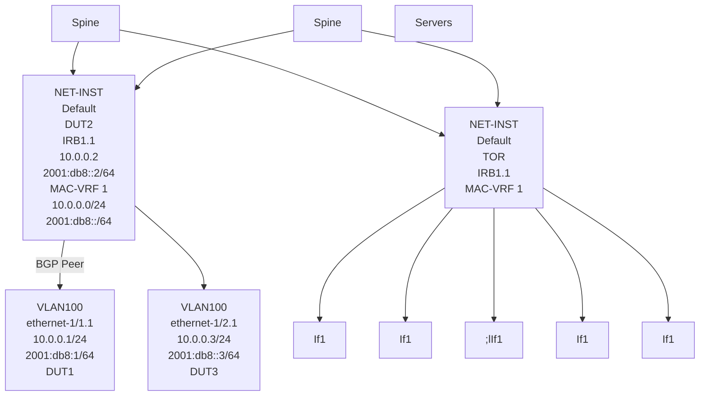

## 17.2.1 Example: Configure DUT2 with MAC-VRF, IRB, and static BGP on IRB

**Prerequisites**

This example assumes DUT2 is pre-configured with a default network-instance that runs BGP sessions to the spine routers, as defined in the section: BGP for underlay routing.

**About this task**

This example shows how to configure the DUT2 with a MAC-VRF, bridged subinterfaces to DUT1 and DUT3, and an IRB subinterface (see Figure 53: MAC-VRF and IRB example in DUT2).

**Procedure**

**Step 1.** In candidate mode, create the interfaces and bridged subinterfaces to connect to DUT1 and DUT3.

In this example:

• Connect ethernet-1/1 and ethernet-1/2 to DUT1 and DUT3, respectively. Although these interfaces could be defined untagged, this example configures them as tagged (vlan-tagging true).

3HE 22247 AAAB TQZZA

**© 2026 Nokia.**

363

Use subject to Terms available at: www.nokia.com/terms.

Advanced Configuration Guide Release 26.7 MAC-VRF network-instances for server aggregation

* Create a subinterface with index 1 under each interface. The subinterface must be configured as type bridged. Bridged subinterfaces can be associated with MAC-VRF instances so that MAC learning and layer-2 forwarding can be enabled on them.
* The subinterfaces use vlan-id 100 because this is the VLAN ID used by the servers (DUT1 and DUT2) to send and receive frames.

**Example**

```
--{ candidate shared default }--[ interface * ]--
A:dut2# **info**
  interface ethernet-1/1 {
   description dut2-dut1
   vlan-tagging true
   subinterface 1 {
    type bridged
    vlan {
            encap {
             single-tagged {
                   vlan-id 100
             }
            }
    }
   }
  }
  interface ethernet-1/2 {
   description dut2-dut3
   vlan-tagging true
   subinterface 1 {
    type bridged
    vlan {
            encap {
             single-tagged {
                   vlan-id 100
             }
            }
    }
   }
  }
```

**Step 2.** Configure an IRB interface and subinterface to connect the MAC-VRF to the existing default network-instance.

The IRB is configured in a similar way to a loopback interface and subinterfaces. The IRB subinterface must be type routed, but does not need to be explicitly configured as routed.

**Example**

```
--{ candidate shared default }--[ interface irb* ]--
A:dut2# **info**
  interface irb1 {
   subinterface 1 {
    ipv4 {
            admin-state enable
            address 10.0.0.2/24 {
            }
    }
    ipv6 {
            admin-state enable
            address 2001:db8::2/64 {
            }
    }
```

3HE 22247 AAAB TQZZA 364
**© 2026 Nokia.**
Use subject to Terms available at: [www.nokia.com/terms](http://www.nokia.com/terms).

Advanced Configuration Guide Release 26.7 MAC-VRF network-instances for server aggregation

```
}
}
```

**Step 3.** Configure the network-instance type mac-vrf and associate it with the bridged and IRB interfaces.

**Example**

```
--{ candidate shared default }--[ network-instance MAC-VRF-1 ]--
A:dut2# info
 type mac-vrf
 admin-state enable
 interface ethernet-1/1.1 {
 }
 interface ethernet-1/2.1 {
 }
 interface irb1.1 {
 }
```

**Step 4.** Associate the same IRB interface with the network-instance default and configure the BGP IPv4 and IPv6 neighbors to DUT1 and DUT3.

See BGP for underlay routing for more information about configuring BGP sessions.

**Example**

```
--{ candidate shared default }--[ network-instance default ]--
A:dut2# info
 type default
 admin-state enable
 router-id 2.2.2.2
 interface irb1.1 {
 }
 interface lo0.1 {
 }
 protocols {
      bgp {
       admin-state enable
       afi-safi ipv4-unicast {
             admin-state enable
       }
       autonomous-system 64502
       router-id 10.0.0.2
       ebgp-default-policy {
             import-reject-all false
       }
       failure-detection {
             enable-bfd true
             fast-failover true
       }
       group tor {
             admin-state enable
             export-policy pass-all
             afi-safi ipv4-unicast {
              admin-state enable
             }
             afi-safi ipv6-unicast {
              admin-state enable
            }
            local-as as-number 64502 {
            }
            timers {
              minimum-advertisement-interval 1
            }
            trace-options {
```

3HE 22247 AAAB TQZZA 365
© 2026 Nokia.
Use subject to Terms available at: [www.nokia.com/terms](http://www.nokia.com/terms).

Advanced Configuration Guide Release 26.7

Advanced Configuration Guide Release 26.7 MAC-VRF network-instances for server aggregation

A:dut2# **commit stay**

**Step 6.** Check the state of the MAC-VRF and the connectivity to DUT1 and DUT3 using the following commands:

• **show network-instance MAC-VRF-1 interfaces**

• **show network-instance default interfaces**

• **show network-instance MAC-VRF-1 bridge-table mac-table all**

• **show arpnd arp-entries interface irb1**

• **show arpnd neighbors interface irb1**

• **show network-instance default protocols bgp neighbor**

**Example**

A:dut2# **show network-instance MAC-VRF-1 interfaces**
====================================================================
Net instance : MAC-VRF-1
Interface : ethernet-1/1.1
Type : bridged
Oper state : up
====================================================================
Net instance : MAC-VRF-1
Interface : ethernet-1/2.1
Type : bridged
Oper state : up
====================================================================
Net instance : MAC-VRF-1
Interface : irb1.1
Oper state : up
Ip mtu : 1500
Prefix Origin Status
==================================================================
10.0.0.2/24 static
2001:db8::2/64 static preferred
fe80::201:2ff:feff:41/64 link-layer preferred
====================================================================

A:dut2# **show network-instance default interfaces**
====================================================================
Net instance : default
Interface : irb1.1
Oper state : up
Ip mtu : 1500
Prefix Origin Status
====================================================================
10.0.0.2/24 static
2001:db8::2/64 static preferred
fe80::201:2ff:feff:41/64 link-layer preferred
=====================================================================
Net instance : default
Interface : lo0.1
Oper state : up
Prefix Origin Status
====================================================================
2.2.2.2/32 static
2001:db8:1::2/128 static preferred

3HE 22247 AAAB TQZZA **© 2026 Nokia.** 367
Use subject to Terms available at: [www.nokia.com/terms](http://www.nokia.com/terms).

Advanced Configuration Guide Release 26.7 MAC-VRF network-instances for server aggregation

**A:dut2# show network-instance MAC-VRF-1 bridge-table mac-table all**

Mac-table of network instance MAC-VRF-1

<table>
<thead>
<tr><th>address</th><th>Destination</th><th>Dest Index</th><th>Type</th><th>Active</th><th>Aging</th><th>Last Update</th></tr>
</thead>
<tbody>
<tr><td>00:01:01:FF:00:00</td><td>ethernet-1/1.1</td><td>16</td><td>learnt</td><td>true</td><td>287</td><td>2020-06-03T13:40:25.000Z</td></tr>
<tr><td>00:01:02:FF:00:41</td><td>irb-interface</td><td>0</td><td>irb-<br />interface</td><td>true</td><td>N/A</td><td>2020-06-02T13:53:50.000Z</td></tr>
<tr><td>00:01:03:FF:00:00</td><td>ethernet-1/2.1</td><td>17</td><td>learnt</td><td>true</td><td>287</td><td>2020-06-03T13:40:25.000Z</td></tr>
</tbody>
</table>

Total Irb Macs : 1 Total 1 Active
Total Static Macs : 0 Total 0 Active
Total Duplicate Macs : 0 Total 0 Active
Total Learnt Macs : 2 Total 2 Active
Total Macs : 3 Total 3 Active

**A:dut2# show arpnd arp-entries interface irb1**

<table>
<thead>
<tr><th>Interface</th><th>Subinterface</th><th>Neighbor</th><th>Origin</th><th>Link layer address</th><th>Expiry</th></tr>
</thead>
<tbody>
<tr><td>irb1</td><td>1</td><td>10.0.0.1</td><td>dynamic</td><td>00:01:01:FF:00:00</td><td>3 hours from now</td></tr>
<tr><td>irb1</td><td>1</td><td>10.0.0.3</td><td>dynamic</td><td>00:01:03:FF:00:00</td><td>3 hours from now</td></tr>
</tbody>
</table>

Total entries : 2 (0 static, 2 dynamic)

**A:dut2# show arpnd neighbors interface irb1**

<table>
<thead>
<tr><th>Interface</th><th>Sub <br />interface</th><th>Neighbor</th><th>Origin</th><th>Link layer address</th><th>Current <br />state</th><th>Next state <br />change</th><th>Is <br />Router</th></tr>
</thead>
<tbody>
<tr><td>irb1</td><td>1</td><td>2001:db8::1</td><td>dynamic</td><td>00:01:01:FF:00:00</td><td>stale</td><td>2 hours<br />from now</td><td>true</td></tr>
<tr><td>irb1</td><td>1</td><td>2001:db8::3</td><td>dynamic</td><td>00:01:03:FF:00:00</td><td>stale</td><td>2 hours<br />from now</td><td>true</td></tr>
<tr><td>irb1</td><td>1</td><td>fe80::201:1ff:<br />feff:0</td><td>dynamic</td><td>00:01:01:FF:00:00</td><td>stale</td><td>2 hours<br />from now</td><td>true</td></tr>
<tr><td>irb1</td><td>1</td><td>fe80::201:3ff:<br />feff:0</td><td>dynamic</td><td>00:01:03:FF:00:00</td><td>stale</td><td>2 hours<br />from now</td><td>true</td></tr>
</tbody>
</table>

Total entries : 4 (0 static, 4 dynamic)

**A:dut2# show network-instance default protocols bgp neighbor**

BGP neighbor summary for network-instance "default"
Flags: S static, D dynamic, L discovered by LLDP, B BFD enabled, - disabled, * slow

<table>
<thead>
<tr><th>Net-Inst</th><th>Peer</th><th>Group</th><th>Flag</th><th>Peer <br />-AS</th><th>State</th><th>Uptime</th><th>AFI/SAFI</th><th>[Rx/Active <br />/Tx]</th></tr>
</thead>
<tbody>
<tr><td>default</td><td>10.0.0.1</td><td>tor</td><td>SB</td><td>64501</td><td>established</td><td>0d:3h:12m:33s</td><td>ipv4-unicast</td><td>[3/2/4]</td></tr>
</tbody>
</table>

3HE 22247 AAAB TQZZA 368 **© 2026 Nokia.** Use subject to Terms available at: [www.nokia.com/terms](http://www.nokia.com/terms).

Advanced Configuration Guide Release 26.7 MAC-VRF network-instances for server aggregation

```
ipv6-unicast | [3/2/4]
default | 10.0.0.3 | tor | SB | 64503 | established | 0d:3h:10m:55s | ipv4-unicast | [3/2/4]
ipv6-unicast | [3/2/4]
default | 2001:db8::1 | tor | SB | 64501 | established | 0d:3h:12m:31s | ipv4-unicast | [0/0/0]
ipv6-unicast | [6/0/6]
default | 2001:db8::3 | tor | SB | 64503 | established | 0d:3h:10m:52s | ipv4-unicast | [0/0/0]
ipv6-unicast | [6/0/6]
Summary: 4 configured neighbors, 4 configured sessions are established,0 disabled peers 0 dynamic peers
```

## 17.3 Advanced configuration: bridge-table settings

A MAC-VRF network-instance uses a bridge-table to forward frames between its subinterfaces. Some bridge-table properties can be configured. For example:

**Example:**

```
--{ * candidate shared default }--[ network-instance MAC-VRF-1 bridge-table ]
A:dut2# **tree detail**
bridge-table! net_inst_mgr
+-- discard-unknown-dest-mac? net_inst_mgr
+-- mac-learning net_inst_mgr
| +-- admin-state? net_inst_mgr
| +-- aging net_inst_mgr
| +-- admin-state? net_inst_mgr
| +-- age-time? net_inst_mgr
+-- mac-duplication net_inst_mgr
| +-- admin-state? net_inst_mgr
| +-- monitoring-window? net_inst_mgr
| +-- num-moves? net_inst_mgr
| +-- hold-down-time? net_inst_mgr
| +-- action? net_inst_mgr
+-- mac-limit net_inst_mgr
| +-- maximum-entries? net_inst_mgr
| +-- warning-threshold-pct? net_inst_mgr
+-- static-mac l2_static_mac_mgr
+-- mac* [address] l2_static_mac_mgr
+-- address l2_static_mac_mgr
+-- destination?M l2_static_mac_mgr
```

Where:

• The ‟mac-learning” container provides control over how MACs are dynamically learned on the subinterfaces, including whether learning is enabled (admin-state) or controlled by the aging timer for the mac-table.

• The ‟mac-duplication” container controls how the system behaves when duplicate MACs are detected.

• The ‟mac-limit” container provides parameters for limiting the maximum number of MACs installed for a specific mac-vrf.

• The ‟static-macs” provides control to configure and associate to either a subinterface destination or with a blackhole. Incoming frames with the source or destination MAC matching a configured "blackholed mac" are discarded by the system.

3HE 22247 AAAB TQZZA **© 2026 Nokia.** 369
Use subject to Terms available at: [www.nokia.com/terms](http://www.nokia.com/terms).

Advanced Configuration Guide Release 26.7 MAC-VRF network-instances for server aggregation

## 17.4 Advanced configuration: MAC-duplication for loop protection

SR Linux supports MAC-duplication detection and associated procedures to protect the system against network loops. The following figure shows a simple loop and describes the associated configuration.

*Figure 54: MAC-Duplication for loop protection*

engineering_drawing: MAC-Duplication for loop protection diagram

sw2012

In this example, MAC-VRF 2 is connected using two bridged subinterfaces to a layer 2 switch. When a host with MAC M1 sends a broadcast frame, a loop is created. MAC-duplication is, by default, enabled in mac- vrf network-instances with the following parameters:

```
--{ * candidate shared default }--[ network-instance MAC-VRF-1 bridge-table mac- duplication ]--
A:dut2# info detail
        admin-state enable
        monitoring-window 3
        num-moves 5
        hold-down-time 10
        action stop-learning
```

The loops shown in this example are resolved in the following sequence:

**1.** MAC-duplication detection.

* A MAC M1 is declared as ‟duplicate” when the number of moves across two or more subinterfaces exceeds the configured num-moves in the configured monitoring-window.

* When M1 is ‟duplicate”, it is kept in a duplicate-entries list and stays associated with the last subinterface where the MAC was learned before the number of moves exceed the num-moves value.

**2.** MAC-duplication action.

3HE 22247 AAAB TQZZA **© 2026 Nokia.** 370
Use subject to Terms available at: www.nokia.com/terms.

Advanced Configuration Guide Release 26.7 <span style="float: right;">MAC-VRF network-instances for server aggregation</span>

* When the MAC M1 is declared "duplicate" in a subinterface, an action is taken in that subinterface. The action is configurable per network-instance and can be overridden on a per-subinterface basis.

* Possible actions on the subinterface are oper-down, blackhole, and stop-learning.

    – oper-down - Brings down the subinterface, breaks the loop, and discards all the frames arriving on the subinterface.

    – blackhole - Discards frames with a source or destination MAC that matches the duplicate MAC. but allows the remaining frames to forward normally on the subinterface.

    – stop-learning - Does not discard any frame on the subinterface and keeps the existing MACs learned against it. No new MACs are learned on the subinterface until the action is cleared.

```
--{ * candidate shared default }--[ network-instance MAC-VRF-1 bridge-table mac-duplication ]--
A:dut2# **action <value>**
usage: action <blackhole|oper-down|stop-learning>
Action to take on the subinterface whose action is use-net-instance-action,
upon detecting one or more mac addresses as duplicate
In particular:
- Oper-down: if configured, upon detecting a duplicate mac on the subinterface, the subinterface
will be brought oper-down.
- Blackhole: upon detecting a duplicate mac on the subinterface, the mac will be blackholed. Any
frame received on this or any other subinterface with MAC SA matching a blackhole mac is discarded.
- Stop-learning: this is the default action, compliant with RFC7432. Upon detecting a duplicate mac
on the subinterface, the mac will not be relearned anymore on this or any subinterface.
Positional arguments: value
```

**3.** MAC-duplication hold-down-time and process restart.

* When the configured hold-down-time expires, the duplicate MAC is flushed from the mac-table and the entire process restarts for the MAC.

* The duplicate action on a subinterface clears when there are no longer duplicate MAC addresses in the subinterface.

As a loop protection mechanism, MAC-duplication is self-contained and does not require a control plane protocol that runs network-wide among network devices.

# 17.4.1 Example: Configure MAC-duplication and troubleshoot loops in DUT2

## About this task

Use this example to assist in configuring MAC-duplication. This example assumes MAC-VRF 1 is connected to a layer 2 switch (not shown) using two bridge subinterfaces (ethernet-1/1.2 and ethernet-1/1.3). This creates a loop.

Configure DUT2 with the following MAC-duplication settings to troubleshoot the loop:

## Procedure

**Step 1.** Use the **mac-duplication** command to configure MAC-duplication settings, as shown in the following example:

### Example

```
--{ candidate shared default }--[ network-instance MAC-VRF-1 ]--
A:dut2# **info**
 type mac-vrf
 admin-state enable
```

3HE 22247 AAAB TQZZA <span style="float: right;">© **2026 Nokia.** 371</span>
Use subject to Terms available at: [www.nokia.com/terms](http://www.nokia.com/terms).

Advanced Configuration Guide Release 26.7 MAC-VRF network-instances for server aggregation

```
interface ethernet-1/1.1 {
}
interface ethernet-1/1.2 {
}
interface ethernet-1/1.3 {
}
interface ethernet-1/2.1 {
}
interface irb1.1 {
}
bridge-table {
   mac-duplication {
      num-moves 3
      hold-down-time 300
      action stop-learning
   }
}
```

**Step 2.** Configure the subinterfaces with the following **mac-duplication** actions:

In this example, the MAC-duplication action configured under the network-instance is overridden by the more specific action under the subinterfaces 2 and 3. When traffic is generated by the remote layer 2 switch, the same MAC address moves between ethernet-1/1.2 and ethernet-1/1.3. After the third move, the MAC is declared a duplicate and appears in the duplicate-entries list:

**Example**

```
--{ * candidate shared default }--[ interface * subinterface * bridge-table mac-
duplication ]--
A:dut2# **info**
 interface ethernet-1/1 {
        subinterface 1 {
           bridge-table {
            mac-duplication {
            }
           }
        }
        subinterface 2 {
           bridge-table {
            mac-duplication {
               action oper-down
            }
           }
        }
        subinterface 3 {
           bridge-table {
            mac-duplication {
               action oper-down
            }
           }
        }
 }
```

**Step 3.** Use the **show network-instance bridge-table mac-table** command to display the duplicate MAC entries.

**Example**

<table>
<thead>
<tr><th>address</th><th>Destination</th><th>Dest Index</th><th>Type</th><th>Active</th><th>Aging</th><th>Last Update</th><th></th></tr>
</thead>
<tbody>
<tr><td></td><td></td><td></td><td></td><td></td><td></td><td></td><td></td></tr>
</tbody>
</table>

3HE 22247 AAAB TQZZA **© 2026 Nokia.** 372
Use subject to Terms available at: www.nokia.com/terms.

Advanced Configuration Guide Release 26.7 MAC-VRF network-instances for server aggregation

<table>
<tr><td>00:01:01:FF:00:00</td><td>ethernet-1/1.1</td><td>16</td><td>learnt</td><td>true</td><td>287</td><td>2020-06-03T13:40:25.000Z</td></tr>
<tr><td>00:01:01:FF:00:41</td><td>ethernet-1/1.3</td><td>20</td><td>duplicate</td><td>true</td><td>N/A</td><td>2020-06-05T20:07:24.000Z</td></tr>
<tr><td>00:01:02:FF:00:41</td><td>irb-interface</td><td>0</td><td>irb-interface</td><td>true</td><td>N/A</td><td>2020-06-02T13:53:50.000Z</td></tr>
<tr><td>00:01:03:FF:00:00</td><td>ethernet-1/2.1</td><td>17</td><td>learnt</td><td>true</td><td>287</td><td>2020-06-03T13:40:25.000Z</td></tr>
</table>

Total Irb Macs : 1 Total 1 Active
Total Static Macs : 0 Total 0 Active
Total Duplicate Macs : 1 Total 1 Active
Total Learnt Macs : 2 Total 2 Active
Total Macs : 4 Total 4 Active

**A:dut2# show network-instance MAC-VRF-1 bridge-table mac-duplication duplicate-entries**

Mac-Duplication in network instance MAC-VRF-1

Admin state : enable
Monitoring window : 3
Number of moves allowed: 3
Hold down time : 300
Action : stop-learning

<table>
<thead>
<tr><th>Duplicate MAC</th><th>Destination</th><th>Dest Index</th><th>Detect Time</th><th>Hold Time Remaining</th></tr>
</thead>
<tbody>
<tr><td>00:01:01:FF:00:41</td><td>ethernet-1/1.3</td><td>20</td><td>2020-06-05T20:07:24.000Z</td><td>270</td></tr>
</tbody>
</table>

Total Duplicate Macs : 1 Total 0 Active

**17.4.2 Using logs to detect duplicate MACs**

**Procedure**

You can use a log event to help troubleshoot when MACs are detected as duplicate, or when they are deleted after the hold-down-timer. For example:

**Example**

```
[root@dut2 srlinux]# **tail -f /var/log/srlinux/debug/sr_l2_mac_mgr.log**
2020-06-06T06:22:48.679070+00:00 dut2 local6|NOTI sr_l2_mac_mgr: bridgetable|2608|2608|00035|N: A duplicate MAC address 00:01:01:FF:00:00 was detected on MAC-VRF-1.
2020-06-06T06:27:48.933312+00:00 dut2 local6|NOTI sr_l2_mac_mgr: bridgetable|2608|2608|00036|N: A duplicate MAC address 00:01:01:FF:00:00 detected on MAC-VRF-1 is now deleted.
```

The network-instance manager logs also show when the subinterfaces go down as a result of MAC- duplication. For example:

**Example**

```
[root@dut2 srlinux]# **tail -f /var/log/srlinux/debug/sr_net_inst_mgr.log**
2020-06-06T06:22:48.680609+00:00 dut2 local6|WARN sr_net_inst_mgr: netinst|2663|2663|00080|W: The interface ethernet-1/1.3 in network-instance MAC-VRF-1 is now down for reason: A duplicate MAC address has been detected
```

3HE 22247 AAAB TQZZA **© 2026 Nokia.** 373
Use subject to Terms available at: [www.nokia.com/terms](http://www.nokia.com/terms).

Advanced Configuration Guide Release 26.7 MPLS LDP LFA using ISIS as IGP

# 18 MPLS LDP LFA using ISIS as IGP

This chapter describes Multi- Protocol Label Switching (MPLS) Label Distribution Protocol (LDP) Loop Free Alternate (LFA) using Intermediate System to Intermediate System (IS-IS) as the Interior Gateway Protocol (IGP).

Topics in this chapter include:

* Applicability
* Overview
* Configuration
* Conclusion

## 18.1 Applicability

The configuration in this chapter corresponds to SR Linux Release 25.7.R1. There are no prerequisites for this configuration.

## 18.2 Overview

LDP LFA improves convergence in case of a single link or single node failure in the network. Convergence times are in the order of tens of milliseconds. This is important to some application services, such as voice over IP (VoIP), which are sensitive to traffic loss when running over the MPLS network.

Without LFA, link or node failures inside an MPLS LDP network result in traffic loss in the order of hundreds of milliseconds. The reason for that is that LDP depends on the convergence of the underlying IGP (IS- IS sending link state PDUs (LSPs) in this case). After IGP convergence, LDP itself needs to compute new primary Next Hop Label Forwarding Entries (NHLFEs) for all affected Forwarding Equivalence Classes (FECs). Finally, the different Label Forwarding Information Bases (LFIBs) are updated.

When LFA is configured on a node, the node computes primary NHLFEs for all FECs and, in addition, the node computes backup NHLFEs for all FECs. The backup NHLFE corresponds to the label received for the same FEC from a Loop-Free Alternate (LFA) next hop, see RFC 5286.

The SR Linux software has implemented inequality 1 (link criterion) and inequality 3 (node criterion) of RFC 5286. The LFA next hop computation is based on the IGP metric, similar to the Shortest Path Tree (SPT) computation that is part of standard link-state routing functionality, .

The underlying LFA formulas appear in the following format:

### Inequality 1:

```
SP(backup NHR, D) < SP(backup NHR, S) + SP(S, D)
```

### Inequality 3:

```
SP(backup NHR, D) < SP(backup NHR, PN) + SP(PN, D)
```

3HE 22247 AAAB TQZZA © 2026 Nokia. 374
Use subject to Terms available at: [www.nokia.com/terms](http://www.nokia.com/terms).

Advanced Configuration Guide Release 26.7 MPLS LDP LFA using ISIS as IGP

In these inequalities:

* SP is shortest IGP metric path

* NHR is next hop router

* D is destination

* S is source node or upstream node doing the actual LFA next-hop computation

* PN is protected node

The inequality 3 rule is stricter than the inequality 1 rule. See Additional topics for a practical example on these inequalities.

## 18.3 Configuration

This section includes the following:

* Configure the IP/MPLS network

* Enable LDP LFA and verify

* Enable synchronization timer

* Verify data path

The subsection Additional topics includes:

* Metric change

* IS-IS overload

Figure 55: Initial example topology shows the example topology with five PEs in the same autonomous system.

3HE 22247 AAAB TQZZA 375
© 2026 Nokia.
Use subject to Terms available at: [www.nokia.com/terms](http://www.nokia.com/terms).

Advanced Configuration Guide Release 26.7

Advanced Configuration Guide Release 26.7 MPLS LDP LFA using ISIS as IGP

IS-IS interfaces are set up as type point-to-point to improve convergence because no Designated Router/ Backup Designated Router (DR/BDR) election process is done. The **show / network-instance default protocols isis adjacency** command on PE-1 verifies that the IS-IS adjacencies are **up**:

`--{ running }--[ ]--`
`A:admin@PE-1# show / network-instance default protocols isis adjacency`
`-----------------------------------------------------------------------------------------------`
`----------------------------------------------------------`
**Network Instance**: default
Instance : 0
Instance Id : 0
`+-----------------+--------------------+-----------------+--------------+--------------+-------`
`+--------------------------+--------------------+`
`| Interface Name | Neighbor System Id | Adjacency Level | Ip Address | Ipv6 Address | State`
`| Last transition | Remaining holdtime |`
`+=================+====================+=================+==============+==============+=======`
`+==========================+====================+`
`| ethernet-1/31.1 | 0100.0000.0002 | L2 | 192.168.12.2 | :: | **up**`
`| 2025-08-29T09:35:15.200Z | 27 |`
`| ethernet-1/32.1 | 0100.0000.0003 | L2 | 192.168.13.2 | :: | **up**`
`| 2025-08-29T09:35:34.000Z | 27 |`
`+-----------------+--------------------+-----------------+--------------+--------------+-------`
`+--------------------------+--------------------+`
Adjacency Count: 2
`-----------------------------------------------------------------------------------------------`
`----------------------------------------------------------`

`--{ running }--[ ]--`
`A:admin@PE-1# show / network-instance default protocols isis adjacency detail`
`-----------------------------------------------------------------------------------------------`
`----------------------------------------------------------`
**Network Instance**: default
Instance : 0
Instance Id : 0
`-----------------------------------------------------------------------------------------------`
`----------------------------------------------------------`

### Neighbor 0100.0000.0002
**Neighbor System Id**: 0100.0000.0002
Adjacency Level : L2
Operational Adjacency Level: L2
Interface Name : ethernet-1/31.1
State : **up**
Hello Interval : 9 Max hold:27, Remaining hold:21
Ip Address : V4:192.168.12.2 V6:::
Hostname : **PE-2**
SNPA : 00:01:02:FF:00:20
Priority : 0
Adjacency Up Time : 2025-08-29T09:35:15.200Z

### Neighbor 0100.0000.0003
**Neighbor System Id**: 0100.0000.0003
Adjacency Level : L2
Operational Adjacency Level: L2
Interface Name : ethernet-1/32.1
State : **up**
Hello Interval : 9 Max hold:27, Remaining hold:22
Ip Address : V4:192.168.13.2 V6:::
Hostname : **PE-3**
SNPA : 00:01:03:FF:00:20
Priority : 0
Adjacency Up Time : 2025-08-29T09:35:34.000Z

3HE 22247 AAAB TQZZA 377 **© 2026 Nokia.**
Use subject to Terms available at: [www.nokia.com/terms](http://www.nokia.com/terms).

Advanced Configuration Guide Release 26.7
MPLS LDP LFA using ISIS as IGP

```
--{ running }--[ ]--
A:admin@PE-1# show / network-instance default route-table all
-------------------------------------------------------------------------------
IPv4 unicast route table of network instance default
-------------------------------------------------------------------------------
```

The **show / network-instance default route-table all** command on PE-1 verifies which IP interface addresses or subnets are known on the PE:

<table>
<thead>
<tr><th>Prefix</th><th>ID</th><th>Route</th><th>Route Owner</th><th>Active</th><th>Origin</th><th>Metric</th><th>Pref</th></tr>
<tr><th>Next-hop</th><th>Next-hop</th><th>Backup Type</th><th>Backup Next-hop</th><th></th><th>Network</th><th></th><th></th></tr>
<tr><th>(Type)</th><th>Interface</th><th>Next-hop (Type)</th><th>Interface</th><th></th><th>Instanc e</th><th></th><th></th></tr>
</thead>
<tbody>
<tr><td>192.0.2.1/32</td><td>15</td><td>host</td><td>net_inst_mgr</td><td>True</td><td>default</td><td>0</td><td>0</td></tr>
<tr><td>None</td><td>None</td><td></td><td></td><td></td><td></td><td></td><td></td></tr>
<tr><td>192.0.2.2/32</td><td>0</td><td>isis</td><td>isis_mgr</td><td>True</td><td>default</td><td>10</td><td>18</td></tr>
<tr><td>192.168.1</td><td>ethernet-</td><td></td><td></td><td></td><td></td><td></td><td></td></tr>
<tr><td>2.2</td><td>1/31.1</td><td></td><td></td><td></td><td></td><td></td><td></td></tr>
<tr><td>(direct)</td><td></td><td></td><td></td><td></td><td></td><td></td><td></td></tr>
<tr><td>192.0.2.3/32</td><td>0</td><td>isis</td><td>isis_mgr</td><td>True</td><td>default</td><td>10</td><td>18</td></tr>
<tr><td>192.168.1</td><td>ethernet-</td><td></td><td></td><td></td><td></td><td></td><td></td></tr>
<tr><td>3.2</td><td>1/32.1</td><td></td><td></td><td></td><td></td><td></td><td></td></tr>
<tr><td>(direct)</td><td></td><td></td><td></td><td></td><td></td><td></td><td></td></tr>
<tr><td>192.0.2.4/32</td><td>0</td><td>isis</td><td>isis_mgr</td><td>True</td><td>default</td><td>20</td><td>18</td></tr>
<tr><td>192.168.1</td><td>ethernet-</td><td></td><td></td><td></td><td></td><td></td><td></td></tr>
<tr><td>3.2</td><td>1/32.1</td><td></td><td></td><td></td><td></td><td></td><td></td></tr>
<tr><td>(direct)</td><td></td><td></td><td></td><td></td><td></td><td></td><td></td></tr>
<tr><td>192.0.2.5/32</td><td>0</td><td>isis</td><td>isis_mgr</td><td>True</td><td>default</td><td>20</td><td>18</td></tr>
<tr><td>192.168.1</td><td>ethernet-</td><td></td><td></td><td></td><td></td><td></td><td></td></tr>
<tr><td>2.2</td><td>1/31.1</td><td></td><td></td><td></td><td></td><td></td><td></td></tr>
<tr><td>(direct)</td><td></td><td></td><td></td><td></td><td></td><td></td><td></td></tr>
<tr><td>192.168.12.0/30</td><td>13</td><td>local</td><td>net_inst_mgr</td><td>True</td><td>default</td><td>0</td><td>0</td></tr>
<tr><td>192.168.1</td><td>ethernet-</td><td></td><td></td><td></td><td></td><td></td><td></td></tr>
<tr><td>2.1</td><td>1/31.1</td><td></td><td></td><td></td><td></td><td></td><td></td></tr>
<tr><td>(direct)</td><td></td><td></td><td></td><td></td><td></td><td></td><td></td></tr>
<tr><td>192.168.12.1/32</td><td>13</td><td>host</td><td>net_inst_mgr</td><td>True</td><td>default</td><td>0</td><td>0</td></tr>
<tr><td>None</td><td>None</td><td></td><td></td><td></td><td></td><td></td><td></td></tr>
</tbody>
</table>

3HE 22247 AAAB TQZZA 378
**© 2026 Nokia.**
Use subject to Terms available at: [www.nokia.com/terms](http://www.nokia.com/terms)

Advanced Configuration Guide Release 26.7 MPLS LPF LFA using ISIS as IGP

```
| 192.168.12.3/32 | 13 | host | net_inst_mgr | True | default | 0 | 0 |
| None | None |
| 192.168.13.0/30 | 14 | local | net_inst_mgr | True | default | 0 | 0 |
| 192.168.1 | ethernet- |
| 3.1 | 1/32.1 |
| (direct) |
| 192.168.13.1/32 | 14 | host | net_inst_mgr | True | default | 0 | 0 |
| None | None |
| 192.168.13.3/32 | 14 | host | net_inst_mgr | True | default | 0 | 0 |
| None | None |
| 192.168.23.0/30 | 0 | isis | isis_mgr | True | default | 20 | 18 |
| 192.168.1 | ethernet- |
| 2.2 | 1/31.1 |
| (direct) |
| 192.168.25.0/30 | 0 | isis | isis_mgr | True | default | 20 | 18 |
| 192.168.1 | ethernet- |
| 2.2 | 1/31.1 |
| (direct) |
| 192.168.34.0/30 | 0 | isis | isis_mgr | True | default | 20 | 18 |
| 192.168.1 | ethernet- |
| 3.2 | 1/32.1 |
| (direct) |
| 192.168.35.0/30 | 0 | isis | isis_mgr | True | default | 20 | 18 |
| 192.168.1 | ethernet- |
| 3.2 | 1/32.1 |
| (direct) |
| 192.168.45.0/30 | 0 | isis | isis_mgr | True | default | 30 | 18 |
| 192.168.1 | ethernet- |
| 2.2 | 1/31.1 |
| (direct) |
+-----------------+----+------+--------------+------+---------+----+----+
```

IPv4 routes total : 16
IPv4 prefixes with active routes : 16
IPv4 prefixes with active ECMP routes: 0

--{ running }--[ ]--
A:admin@PE-1# info from state with-context / network-instance default route-table ipv4-unicast
route * id * route-type * route-owner * origin-network-instance * |
as table | filter fields active metric preference next-hop-group next-hop-group-network-instance
+-----------------+-----------------+-----------------+-----------------+-----------------+-----------------+-----------------+
<table>
    <tr>
        <th>Network-</th>
        <th>Ipv4-</th>
        <th>Id</th>
        <th>Route-type</th>
        <th>Route-</th>
        <th>Origin-</th>
        <th>Active</th>
    </tr>
</table>
Metric | Preference | Next-hop- | Next-hop- | | owner | network- |
<table>
    <tr>
        <th>instance</th>
        <th>prefix</th>
        <th>group</th>
        <th>group-</th>
        <th></th>
        <th></th>
        <th></th>
    </tr>
</table>

3HE 22247 AAAB TQZZA
**© 2026 Nokia.**
Use subject to Terms available at: [www.nokia.com/terms](http://www.nokia.com/terms)
379

Advanced Configuration Guide Release 26.7
MPLS LDP LFA using ISIS as IGP

<table>
<thead>
<tr><th></th><th></th><th></th><th>network-</th><th>instance</th><th></th><th></th><th></th><th></th><th></th></tr>
<tr><th></th><th></th><th></th><th>instance</th><th></th><th></th><th></th><th></th><th></th><th></th></tr>
</thead>
<tbody>
<tr><td>default 0</td><td>192.0.2.1/32</td><td>15</td><td>host</td><td>23775975</td><td>default</td><td>net_inst_m gr</td><td>default</td><td>true</td><td></td></tr>
<tr><td>default 10</td><td>192.0.2.2/32</td><td>0</td><td>isis</td><td>18</td><td>23775981</td><td>default</td><td>isis_mgr</td><td>default</td><td>true</td></tr>
<tr><td>default 10</td><td>192.0.2.3/32</td><td>0</td><td>isis</td><td>18</td><td>23775982</td><td>default</td><td>isis_mgr</td><td>default</td><td>true</td></tr>
<tr><td>default 20</td><td>192.0.2.4/32</td><td>0</td><td>isis</td><td>18</td><td>23775982</td><td>default</td><td>isis_mgr</td><td>default</td><td>true</td></tr>
<tr><td>default 20</td><td>192.0.2.5/32</td><td>0</td><td>isis</td><td>18</td><td>23775981</td><td>default</td><td>isis_mgr</td><td>default</td><td>true</td></tr>
<tr><td>default 0</td><td>192.168.12.0/30</td><td>13</td><td>local</td><td>0</td><td>23775976</td><td>default</td><td>net_inst_m gr</td><td>default</td><td>true</td></tr>
<tr><td>default 0</td><td>192.168.12.1/32</td><td>13</td><td>host</td><td>0</td><td>23775977</td><td>default</td><td>net_inst_m gr</td><td>default</td><td>true</td></tr>
<tr><td>default 0</td><td>192.168.12.3/32</td><td>13</td><td>host</td><td>0</td><td>23775978</td><td>default</td><td>net_inst_m gr</td><td>default</td><td>true</td></tr>
<tr><td>default 0</td><td>192.168.13.0/30</td><td>14</td><td>local</td><td>0</td><td>23775979</td><td>default</td><td>net_inst_m gr</td><td>default</td><td>true</td></tr>
<tr><td>default 0</td><td>192.168.13.1/32</td><td>14</td><td>host</td><td>0</td><td>23775980</td><td>default</td><td>net_inst_m gr</td><td>default</td><td>true</td></tr>
<tr><td>default 0</td><td>192.168.13.3/32</td><td>14</td><td>host</td><td>0</td><td>23775978</td><td>default</td><td>net_inst_m gr</td><td>default</td><td>true</td></tr>
<tr><td>default 20</td><td>192.168.23.0/30</td><td>0</td><td>isis</td><td>18</td><td>23775981</td><td>default</td><td>isis_mgr</td><td>default</td><td>true</td></tr>
<tr><td>default 20</td><td>192.168.25.0/30</td><td>0</td><td>isis</td><td>18</td><td>23775981</td><td>default</td><td>isis_mgr</td><td>default</td><td>true</td></tr>
<tr><td>default 20</td><td>192.168.34.0/30</td><td>0</td><td>isis</td><td>18</td><td>23775982</td><td>default</td><td>isis_mgr</td><td>default</td><td>true</td></tr>
<tr><td>default 20</td><td>192.168.35.0/30</td><td>0</td><td>isis</td><td>18</td><td>23775982</td><td>default</td><td>isis_mgr</td><td>default</td><td>true</td></tr>
</tbody>
</table>

3HE 22247 AAAB TQZZA
**© 2026 Nokia.**
380
Use subject to Terms available at: www.nokia.com/terms.

<layout_regions> chbo vfgx </layout_regions>
Advanced Configuration Guide Release 26.7 MPLS LDP LFA using ISIS as IGP

<table>
    <tr>
        <th></th>
        <th>.0/30</th>
        <th></th>
        <th></th>
        <th></th>
        <th></th>
        <th></th>
        <th></th>
    </tr>
    <tr>
        <td>default</td>
        <td>192.168.45</td>
        <td>0</td>
        <td>isis</td>
        <td>isis_mgr</td>
        <td>default</td>
        <td>true</td>
    </tr>
    <tr>
        <td>30</td>
        <td>18</td>
        <td>23775981</td>
        <td>default</td>
        <td></td>
        <td></td>
        <td></td>
        <td></td>
    </tr>
    <tr>
        <td></td>
        <td>.0/30</td>
        <td></td>
        <td></td>
        <td></td>
        <td></td>
        <td></td>
        <td></td>
    </tr>
</table>

As an example, detail for one node (PE-5) and one link (the link between PE-2 and PE-5) for which LFA protection is verified further on, is shown as follows:

--{ running }--[ ]--

A:admin@PE-1# show / network-instance default route-table ipv4-unicast prefix detail

IPv4 unicast route table of network instance default

---snip---

**Destination**: **192.0.2.5/32**
**ID**: 0
**Route Type**: isis
**Route Owner**: isis_mgr
**Origin Network Instance**: default
**Metric**: 20
**Preference**: 18
**Active**: true
**Last change**: 2025-08-29T09:36:15.658Z
**Resilient hash**: false

Next hops: 1 entries

192.168.12.2 (direct) via [ethernet-1/31.1]

Backup Next hops: 0 entries

Route Programming Status

**Suppressed**: false
**Last successful FIB operation**: add
**Last successful FIB operation time**: 2025-08-29T09:36:15.658Z
**Current FIB operation pending**: none
**Last failed FIB operation**: none

Primary NHG

Backup NHG

---snip---

<layout_regions> qdas aehz luik uoeu </layout_regions>
3HE 22247 AAAB TQZZA 381
© 2026 Nokia.
Use subject to Terms available at: www.nokia.com/terms.

Advanced Configuration Guide Release 26.7 MPLS LDP LFA using ISIS as IGP

**Destination** **: 192.168.25.0/30**
ID : 0
Route Type : isis
Route Owner : isis_mgr
Origin Network Instance: default
Metric : 20
Preference : 18
Active : true
Last change : 2025-08-29T09:35:16.175Z
Resilient hash : false

Next hops: 1 entries
192.168.12.2 (direct) via [ethernet-1/31.1]
Backup Next hops: 0 entries

Route Programming Status

Suppressed : false
Last successful FIB operation : add
Last successful FIB operation time: 2025-08-29T09:35:16.175Z
Current FIB operation pending : none
Last failed FIB operation : none

Primary NHG

Backup NHG

---snip---

The next hops for the routes are verfied as follows:

--{ running }--[ ]--
A:admin@PE-1# show / network-instance default route-table next-hop

Next-hop route table of network instance default

Index : 3
Type : broadcast
Subinterface : N/A
Resolving Route : None (None)
Index : 23775963
Type : extract
Subinterface : N/A
Resolving Route : None (None)
Index : 23775964
Next-hop : 192.168.12.1
Type : direct
Subinterface : ethernet-1/31.1
Index : 23775965
Type : extract

3HE 22247 AAAB TQZZA **© 2026 Nokia.** 382
Use subject to Terms available at: [www.nokia.com/terms](http://www.nokia.com/terms).

Advanced Configuration Guide Release 26.7 MPLS LDP LFA using ISIS as IGP

Subinterface : N/A
Resolving Route : None (None)
Index : 23775966
Next-hop : 192.168.13.1
Type : direct
Subinterface : ethernet-1/32.1
Index : 23775967
Type : extract
Subinterface : N/A
Resolving Route : None (None)
Index : 23775968
Next-hop : 192.168.12.2
Type : direct
Subinterface : ethernet-1/31.1
Index : 23775969
Next-hop : 192.168.13.2
Type : direct
Subinterface : ethernet-1/32.1

The **info from state with-context / network-instance default route-table next-hop-group *** command on PE-1 shows the content of the forwarding information base (FIB):

<table>
<thead>
<tr><th>Network-</th><th>Index</th><th>Group-</th><th>Programme</th><th>Backup-</th><th>Backup-</th><th>Fib-progr</th><th>Fib-progr</th></tr>
<tr><th>Fib-progr</th><th>Fib-progr</th><th>Fib-progr</th><th>Fib-progr</th><th>next-hop-</th><th>active</th><th>amming su</th><th>amming</th></tr>
<tr><th>instance</th><th>amming</th><th>amming</th><th>d-index</th><th>group</th><th></th><th>ppressed</th><th>last-succ</th></tr>
</thead>
<tbody>
<tr><td>amming</td><td>amming</td><td>alias</td><td>last-</td><td>last-</td><td></td><td></td><td>essful-op</td></tr>
<tr><td>last-succ</td><td>pending-o</td><td>last-</td><td>last-</td><td></td><td></td><td></td><td>eration-</td></tr>
<tr><td>essful-op</td><td>peration-</td><td>failed-op</td><td>failed-</td><td></td><td></td><td></td><td>type</td></tr>
<tr><td>eration-</td><td>type</td><td>eration-</td><td>locations</td><td></td><td></td><td></td><td></td></tr>
<tr><td>timestamp</td><td></td><td>type</td><td></td><td></td><td></td><td></td><td></td></tr>
<tr><td>default</td><td>23775975</td><td></td><td></td><td>0</td><td>false</td><td></td><td>add</td></tr>
<tr><td>2025-08-</td><td>none</td><td>none</td><td></td><td></td><td></td><td></td><td></td></tr>
<tr><td>29T09:14:</td><td></td><td></td><td></td><td></td><td></td><td></td><td></td></tr>
<tr><td>29.461Z</td><td></td><td></td><td></td><td></td><td></td><td></td><td></td></tr>
<tr><td>(23</td><td></td><td></td><td></td><td></td><td></td><td></td><td></td></tr>
<tr><td>minutes</td><td></td><td></td><td></td><td></td><td></td><td></td><td></td></tr>
<tr><td>ago)</td><td></td><td></td><td></td><td></td><td></td><td></td><td></td></tr>
<tr><td>default</td><td>23775976</td><td></td><td></td><td>0</td><td>false</td><td></td><td>add</td></tr>
<tr><td>2025-08-</td><td>none</td><td>none</td><td></td><td></td><td></td><td></td><td></td></tr>
<tr><td>29T09:14:</td><td></td><td></td><td></td><td></td><td></td><td></td><td></td></tr>
<tr><td>34.246Z</td><td></td><td></td><td></td><td></td><td></td><td></td><td></td></tr>
<tr><td>(23</td><td></td><td></td><td></td><td></td><td></td><td></td><td></td></tr>
</tbody>
</table>

3HE 22247 AAAB TQZZA **© 2026 Nokia.** 383
Use subject to Terms available at: www.nokia.com/terms.

Advanced Configuration Guide Release 26.7
MPLS LDP LFA using ISIS as IGP

<table>
<tr><td>minutes</td><td></td></tr>
<tr><td>ago)</td><td></td></tr>
<tr><td>default</td><td>23775977</td></tr>
<tr><td>2025-08-</td><td>none</td></tr>
<tr><td>29T09:14:</td><td></td></tr>
<tr><td>34.246Z</td><td></td></tr>
<tr><td>(23</td><td></td></tr>
<tr><td>minutes</td><td></td></tr>
<tr><td>ago)</td><td></td></tr>
<tr><td>default</td><td>23775978</td></tr>
<tr><td>2025-08-</td><td>none</td></tr>
<tr><td>29T09:14:</td><td></td></tr>
<tr><td>34.246Z</td><td></td></tr>
<tr><td>(23</td><td></td></tr>
<tr><td>minutes</td><td></td></tr>
<tr><td>ago)</td><td></td></tr>
<tr><td>default</td><td>23775979</td></tr>
<tr><td>2025-08-</td><td>none</td></tr>
<tr><td>29T09:14:</td><td></td></tr>
<tr><td>34.853Z</td><td></td></tr>
<tr><td>(23</td><td></td></tr>
<tr><td>minutes</td><td></td></tr>
<tr><td>ago)</td><td></td></tr>
<tr><td>default</td><td>23775980</td></tr>
<tr><td>2025-08-</td><td>none</td></tr>
<tr><td>29T09:14:</td><td></td></tr>
<tr><td>34.853Z</td><td></td></tr>
<tr><td>(23</td><td></td></tr>
<tr><td>minutes</td><td></td></tr>
<tr><td>ago)</td><td></td></tr>
<tr><td>default</td><td>23775981</td></tr>
<tr><td>2025-08-</td><td>none</td></tr>
<tr><td>29T09:35:</td><td></td></tr>
<tr><td>16.175Z</td><td></td></tr>
<tr><td>(2</td><td></td></tr>
<tr><td>minutes</td><td></td></tr>
<tr><td>ago)</td><td></td></tr>
</table>

3HE 22247 AAAB TQZZA
**© 2026 Nokia.**
384
Use subject to Terms available at: [www.nokia.com/terms](http://www.nokia.com/terms).

Advanced Configuration Guide Release 26.7 MPLS LDP LFA using ISIS as IGP

Initially, the following default IS-IS Level 2 metric applies to all interfaces.

<table>
<thead>
<tr><th>Network-instance</th><th>Instance</th><th>Interface</th><th>Level-number</th><th>Disable</th><th>Metric</th><th>Priority</th><th>Passive</th></tr>
</thead>
<tbody>
<tr><td>default</td><td>0</td><td>ethernet-1/31.1</td><td>2</td><td>false</td><td>**10**</td><td>64</td><td>false</td></tr>
<tr><td>default</td><td>0</td><td>ethernet-1/32.1</td><td>2</td><td>false</td><td>**10**</td><td>64</td><td>false</td></tr>
<tr><td>default</td><td>0</td><td>system0.0</td><td>2</td><td>false</td><td>0</td><td>64</td><td>false</td></tr>
</tbody>
</table>

The next step in the process of setting up the IP/MPLS network is setting up interface-LDP sessions on all interfaces. The LDP configuration on PE-1 is as follows:

```
# On PE-1:
# Configure LDP dynamic label block - on all nodes
enter candidate
      system mpls label-ranges dynamic dlb-ldp {
                         start-label 20000
                         end-label 29999
# Configure LDP sessions - per node
enter candidate
      network-instance default protocols ldp {
                         admin-state enable
                         dynamic-label-block dlb-ldp
                         fec-resolution { }
                         discovery {
                          interfaces {
                             interface ethernet-1/31.1 {
                                        ipv4 {
                                         admin-state enable
                                        }
                             }
                             interface ethernet-1/32.1 {
                                        ipv4 {
                                         admin-state enable
```

3HE 22247 AAAB TQZZA    **© 2026 Nokia.**    385
                        Use subject to Terms available at: [www.nokia.com/terms](http://www.nokia.com/terms).

Advanced Configuration Guide Release 26.7 MPLS LDP LFA using ISIS as IGP

```
} } } }
```

The routes in the IPv4 route table remain the same. There is now a full mesh of LDP label switched paths (LSPs) set up between all system interfaces of the PEs. The LSPs are visible in the MPLS route table.

```
--{ running }--[ ]-- A:admin@PE-1# show / network-instance default route-table mpls
+---------+-----------+-------------+-----------------+------------------------+-----------------------+------------------+
| Label   | Operation | Type        | Next Net-Inst   | Next-hop IP (Type)     | Next-hop Subinterface | Next-hop MPLS labels |
+=========+===========+=============+=================+========================+=======================+==================+
| 20000   | POP       | ldp         | default         | _                      | _                     | _                |
| 20001   | SWAP      | ldp         | N/A             | 192.168.12.2 (mpls)    | ethernet-1/31.1       | 20000            |
| 20002   | SWAP      | ldp         | N/A             | 192.168.13.2 (mpls)    | ethernet-1/32.1       | 20000            |
| 20003   | SWAP      | ldp         | N/A             | 192.168.13.2 (mpls)    | ethernet-1/32.1       | 20003            |
| 20004   | SWAP      | ldp         | N/A             | 192.168.12.2 (mpls)    | ethernet-1/31.1       | 20004            |
+---------+-----------+-------------+-----------------+------------------------+-----------------------+------------------+
```

There are additional next hops, corresponding with the LSPs.

```
--{ running }--[ ]-- A:admin@PE-1# show / network-instance default route-table next-hop
----------------------------------------------------------------------------------------------------------------------------------------------------------
Next-hop route table of network instance default
----------------------------------------------------------------------------------------------------------------------------------------------------------
---snip---
Index                      : 23775970
 Next-hop                  : 192.168.12.2
 Type                      : mpls
 MPLS label stack: [20000]
Index                      : 23775971
 Next-hop                  : 192.168.13.2
 Type                      : mpls
 MPLS label stack: [20000]
Index                      : 23775972
 Next-hop                  : 192.168.13.2
 Type                      : mpls
 MPLS label stack: [20003]
Index                      : 23775973
 Next-hop                  : 192.168.12.2
 Type                      : mpls
 MPLS label stack: [20004]
```

The tunnel table on PE-1 looks as follows:

```
--{ running }--[ ]-- A:admin@PE-1# show / network-instance default tunnel-table all
```

3HE 22247 AAAB TQZZA **© 2026 Nokia.** 386
Use subject to Terms available at: [www.nokia.com/terms](http://www.nokia.com/terms).

Advanced Configuration Guide Release 26.7 MPLS LDP LFA using ISIS as IGP

```
IPv4 tunnel table of network-instance "default"
```

<table>
<thead><tr><th>IPv4 Prefix</th><th>Encaps Type</th><th>Tunnel Type</th><th>Tunnel ID</th><th>FIB</th><th>Metric</th><th>Preference</th><th>Last Update<br />Next-hop (Type)</th><th>Next-hop</th><th></th></tr></thead>
<tbody>
<tr><td>192.0.2.2/32</td><td>mpls</td><td>ldp</td><td>65537</td><td>Y</td><td>10</td><td>9</td><td>2025-08-29T09:40:58.208Z</td><td>192.168.12.2 (mpls) ethernet-1/31.1</td><td></td></tr>
<tr><td>192.0.2.3/32</td><td>mpls</td><td>ldp</td><td>65538</td><td>Y</td><td>10</td><td>9</td><td>2025-08-29T09:41:21.350Z</td><td>192.168.13.2 (mpls) ethernet-1/32.1</td><td></td></tr>
<tr><td>192.0.2.4/32</td><td>mpls</td><td>ldp</td><td>65539</td><td>Y</td><td>20</td><td>9</td><td>2025-08-29T09:41:32.609Z</td><td>192.168.13.2 (mpls) ethernet-1/32.1</td><td></td></tr>
<tr><td>192.0.2.5/32</td><td>mpls</td><td>ldp</td><td>65540</td><td>Y</td><td>20</td><td>9</td><td>2025-08-29T09:42:08.856Z</td><td>192.168.12.2 (mpls) ethernet-1/31.1</td><td></td></tr>
</tbody>
</table>

4 LDP tunnels, 4 active, 0 inactive

IPv6 tunnel table of network-instance "default"

<no_entries>

Corresponding entries are added to the forwarding information base (FIB):

```
--{ running }--[ ]--
A:admin@PE-1# info from state with-context / network-instance default route-table next-hop-group * | as table | filter fields *
```

<table>
<thead>
<tr><th>Network-instance</th><th>Index</th><th>Group-name-alias</th><th>Programmed-index</th><th>Backup-next-hop-group</th><th>Backup-active</th><th>Fib-programming suppressed</th><th>Fib-programming last-successful-op</th><th>Fib-programming last-successful-op</th><th>Fib-programming pending-operation-</th><th>Fib-programming last-failed-op</th><th>Fib-programming last-failed-</th><th></th></tr>
<tr><th></th><th></th><th></th><th></th><th></th><th></th><th></th><th></th><th></th><th></th><th></th><th></th><th></th></tr>
</thead>
<tbody>
<tr><td></td><td></td><td></td><td></td><td></td><td></td><td></td><td></td><td></td><td></td><td></td><td></td><td></td></tr>
</tbody>
</table>


SPACER TEXT

387 3HE 22247 AAAB TQZZA **© 2026 Nokia.**
Use subject to Terms available at: [www.nokia.com/terms](http://www.nokia.com/terms).

Advanced Configuration Guide Release 26.7
MPLS LDP LFA using ISIS as IGP

<table>
<thead>
<tr><th>eration-</th><th>type</th><th>eration-</th><th>locations</th><th></th><th></th><th></th><th>eration-</th></tr>
<tr><th>timestamp</th><th></th><th>type</th><th></th><th></th><th></th><th></th><th>type</th></tr>
</thead>
<tbody>
<tr><td>default<br />2025-08-<br />29T09:40:<br />58.209Z<br />(3<br />minutes<br />ago)</td><td>23775983</td><td>none</td><td>none</td><td></td><td>0</td><td>false</td><td>add</td></tr>
<tr><td>default<br />2025-08-<br />29T09:41:<br />21.351Z<br />(2<br />minutes<br />ago)</td><td>23775984</td><td>none</td><td>none</td><td></td><td>0</td><td>false</td><td>add</td></tr>
<tr><td>default<br />2025-08-<br />29T09:41:<br />32.610Z<br />(2<br />minutes<br />ago)</td><td>23775985</td><td>none</td><td>none</td><td></td><td>0</td><td>false</td><td>add</td></tr>
<tr><td>default<br />2025-08-<br />29T09:42:<br />08.857Z<br />(a minute<br />ago)</td><td>23775986</td><td>none</td><td>none</td><td></td><td>0</td><td>false</td><td>add</td></tr>
</tbody>
</table>

The LDP LSP metric follows the IGP cost. Optionally, LSP metrics can be applied but that is beyond the scope for this chapter.

3HE 22247 AAAB TQZZA
**© 2026 Nokia.**
388
Use subject to Terms available at: [www.nokia.com/terms](http://www.nokia.com/terms)

Advanced Configuration Guide Release 26.7 MPLS LDP LFA using ISIS as IGP

Without LFA, only an FEC that is learned from the LDP peer with the shortest path to that FEC (primary next hop) can be used in forwarding.

<table>
<thead>
<tr><th>FEC prefix</th><th>Peer LDP ID</th><th>Label</th><th>Ingress LSR</th><th>Used in Forwarding</th></tr>
</thead>
<tbody>
<tr><td>192.0.2.2/32</td><td>**192.0.2.2:0**</td><td>20000</td><td>**true**</td><td>**true**</td></tr>
<tr><td>192.0.2.2/32</td><td>192.0.2.3:0</td><td>20002</td><td>**true**</td><td>false</td></tr>
<tr><td>192.0.2.3/32</td><td>192.0.2.2:0</td><td>20002</td><td>**true**</td><td>false</td></tr>
<tr><td>192.0.2.3/32</td><td>**192.0.2.3:0**</td><td>20000</td><td>**true**</td><td>**true**</td></tr>
<tr><td>192.0.2.4/32</td><td>192.0.2.2:0</td><td>20003</td><td>**true**</td><td>false</td></tr>
<tr><td>192.0.2.4/32</td><td>**192.0.2.3:0**</td><td>20003</td><td>**true**</td><td>**true**</td></tr>
<tr><td>192.0.2.5/32</td><td>**192.0.2.2:0**</td><td>20004</td><td>**true**</td><td>**true**</td></tr>
<tr><td>192.0.2.5/32</td><td>192.0.2.3:0</td><td>20004</td><td>**true**</td><td>false</td></tr>
</tbody>
</table>

Total received FEC prefixes : 8 (**4 used in forwarding**)
Total advertised FEC prefixes: 8

<table>
<thead>
<tr><th>FEC prefix</th><th>Peer LDP ID</th><th>Label</th><th>Label Status</th><th>Egress LSR</th></tr>
</thead>
<tbody>
<tr><td>192.0.2.1/32</td><td>192.0.2.2:0</td><td>20000</td><td>**true**</td><td>true</td></tr>
<tr><td>192.0.2.1/32</td><td>192.0.2.3:0</td><td>20000</td><td>**true**</td><td>true</td></tr>
<tr><td>192.0.2.2/32</td><td>192.0.2.3:0</td><td>20001</td><td>false</td><td>false</td></tr>
<tr><td>192.0.2.3/32</td><td>192.0.2.2:0</td><td>20002</td><td>false</td><td>false</td></tr>
<tr><td>192.0.2.4/32</td><td>192.0.2.2:0</td><td>20003</td><td>false</td><td>false</td></tr>
<tr><td>192.0.2.4/32</td><td>192.0.2.3:0</td><td>20003</td><td>false</td><td>false</td></tr>
<tr><td>192.0.2.5/32</td><td>192.0.2.2:0</td><td>20004</td><td>false</td><td>false</td></tr>
<tr><td>192.0.2.5/32</td><td>192.0.2.3:0</td><td>20004</td><td>false</td><td>false</td></tr>
</tbody>
</table>

--{ running }--[ ]--
A:admin@PE-1# info from state with-context / network-instance default protocols ldp ipv4 bindings received-prefix-fec prefix-fec * lsr-id * label-space-id 0 next-hop * | as table | filter fields *

3HE 22247 AAAB TQZZA 389 **© 2026 Nokia.** Use subject to Terms available at: [www.nokia.com/terms](http://www.nokia.com/terms).

Advanced Configuration Guide Release 26.7 MPLS LDP LFA using ISIS as IGP

```
<table>
<tbody>
<tr><td>default</td><td>192.0.2.2/32</td><td>192.0.2.2</td><td>0</td><td>1</td><td>192.168.12.</td><td>primary</td><td>ethernet-1/31.1</td><td></td><td></td><td></td><td></td><td></td><td></td><td>2</td><td></td><td></td><td></td><td></td></tr>
<tr><td>default</td><td>192.0.2.3/32</td><td>192.0.2.3</td><td>0</td><td>1</td><td>192.168.13.</td><td>primary</td><td>ethernet-1/32.1</td><td></td><td></td><td></td><td></td><td></td><td></td><td>2</td><td></td><td></td><td></td><td></td></tr>
<tr><td>default</td><td>192.0.2.4/32</td><td>192.0.2.3</td><td>0</td><td>1</td><td>192.168.13.</td><td>primary</td><td>ethernet-1/32.1</td><td></td><td></td><td></td><td></td><td></td><td></td><td>2</td><td></td><td></td><td></td><td></td></tr>
<tr><td>default</td><td>192.0.2.5/32</td><td>192.0.2.2</td><td>0</td><td>1</td><td>192.168.12.</td><td>primary</td><td>ethernet-1/31.1</td><td></td><td></td><td></td><td></td><td></td><td></td><td>2</td><td></td><td></td><td></td><td></td></tr>
</tbody>
</table>
```

## 18.3.2 **Enable LDP LFA and verify**

Because LDP LFA is using LFA next-hop computation by the IGP, as described in RFC 5286, LFA must be enabled in the IGP context, as follows:

```
# On PE-1:
enter candidate
network-instance default protocols isis instance 0 **loopfree-alternate {**
**admin-state enable**
augment-route-table true
```

The info from state with-context / network-instance default protocols isis instance 0 loopfree-alternate command on PE-1 verifies that LFA is enabled in IS-IS:

```
<table>
<thead>
<tr><th>Network-instance</th><th>Instance</th><th>Admin-state</th><th>Augment-route-table</th><th>Exclude-prefix-policy</th><th>Multi-homed-prefix-admin-state</th><th>Multi-homed-prefix-preference</th><th>Remote-lfa-admin-state</th><th>Remote-lfa-max-pq-cost</th><th>Remote-lfa-node-protect-admin-state</th><th>Remote-lfa-node-protect-max-pq-nodes</th><th>Ti-lfa-admin-state</th><th>Ti-lfa-max-sr-lfa-labels</th><th>Ti-lfa-node-protect-admin-state</th></tr>
</thead>
<tbody>
<tr><td>default</td><td>0</td><td>enable</td><td>true</td><td></td><td>disable</td><td>none</td><td>disable</td><td>0</td><td>disable</td><td>0</td><td>disable</td><td>0</td><td>disable</td></tr>
</tbody>
</table>
```


SPACER TEXT

390 3HE 22247 AAAB TQZZA © 2026 Nokia. Use subject to Terms available at: www.nokia.com/terms.

Advanced Configuration Guide Release 26.7 MPLS LDP LFA using ISIS as IGP

Remote LFA (RLFA) and Topology-independent LFA (TI-LFA) are disabled (by default), because they are beyond the scope of this chapter.

After enabling LFA inside the IGP context, LFA needs to be enabled within the LDP context, as follows:

```
# On PE-1:
enter candidate
   network-instance default protocols ldp **loopfree-alternate {**
                   **admin-state enable**
```

This chapter describes LFA for unicast LDP.

After these two CLI commands, the software computes for each LDP FEC in the network both a primary and a backup NHLFE. The primary NHLFE corresponds to the label of the FEC received from the primary next-hop as per standard LDP resolution of the FEC prefix in the Routing Table Manager (RTM). The backup NHLFE corresponds to the label received for the same FEC from an LFA next hop.

For point-to-point interfaces, when multiple LFA next hops are found for a primary next hop, the following selection criteria are used:

**1.** SPF selects the node-protect type in favor of the link-protect type.

**2.** If there is more than one LFA next hop within the selected type, then SPF selects an LFA next hop with the lowest cost.

**3.** If there is more than one LFA next hop with the same cost, then SPF selects the first one. This is not a deterministic selection and it varies following each SPF computation.

Several **show** commands are possible to display LFA information:

The **info from state with-context / network-instance default protocols isis instance 0 statistics** command shows the number of LFA runs on a specific node.

```
--{ running }--[ ]--
A:admin@PE-1# info from state with-context / network-instance default protocols isis instance 0 statistics | as table | filter fields *
+-------------+-------------+-----------+---------------------------------------------+---------------------+---------------------------------------------+
| Network-    | Instance    | Spf-runs  | Last-spf                                    | Partial-spf-runs    | Last-partial-spf                            |
| instance    |             |           |                                             |                     |                                             |
+=============+=============+===========+=============================================+=====================+=============================================+
| default     | 0           | 7         | 2025-08-29T09:50:44.500Z (5 minutes ago)    | 0                   |                                             |
+-------------+-------------+-----------+---------------------------------------------+---------------------+---------------------------------------------+
```

In the example topology (see Figure 55: Initial example topology), all IS-IS links have a default level 2 metric of 10. This results in all four nodes and all IS-IS routes learned by PE-1 being LFA protected: the LFA node coverage on PE-1 is 4/4=100%; the LFA link coverage on PE-1 is 9/9=100%. The next hop groups change for the recomputed SPF paths.

```
--{ running }--[ ]--
A:admin@PE-1# show / network-instance default route-table all
-----------------------------------------------------------------------------------------------
----------------------------------------------------------
IPv4 unicast route table of network instance default
```

3HE 22247 AAAB TQZZA 391
**© 2026 Nokia.**
Use subject to Terms available at: www.nokia.com/terms.

Advanced Configuration Guide Release 26.7
MPLS LDP LFA using ISIS as IGP

<table>
<thead>
<tr><th>Prefix</th><th>ID</th><th>Route</th><th>Route Owner</th><th>Active</th><th>Origin</th><th>Metric</th><th>Pref</th></tr>
<tr><th>Next-hop</th><th>Next-hop</th><th>Backup</th><th>Backup</th><th></th><th>Network</th><th></th><th></th></tr>
<tr><th></th><th></th><th>Type</th><th>Next-hop</th><th></th><th>Instanc</th><th></th><th></th></tr>
<tr><th>(Type)</th><th>Interface</th><th>Next-hop</th><th>Next-hop</th><th></th><th>e</th><th></th><th></th></tr>
<tr><th></th><th></th><th>(Type)</th><th>Interface</th><th></th><th></th><th></th><th></th></tr>
</thead>
<tbody>
<tr><td>192.0.2.1/32</td><td>15</td><td>host</td><td>net_inst_mgr</td><td>True</td><td>default</td><td>0</td><td>0</td></tr>
<tr><td>None</td><td>None</td><td></td><td></td><td></td><td></td><td></td><td></td></tr>
<tr><td>192.0.2.2/32</td><td>0</td><td>isis</td><td>isis_mgr</td><td>True</td><td>default</td><td>10</td><td>18</td></tr>
<tr><td>**192.168.1**</td><td>**ethernet-**</td><td>**192.168.1**</td><td>**ethernet-**</td><td></td><td></td><td></td><td></td></tr>
<tr><td>2.2</td><td>1/31.1</td><td>3.2</td><td>1/32.1</td><td></td><td></td><td></td><td></td></tr>
<tr><td>(direct)</td><td></td><td>(direct)</td><td></td><td></td><td></td><td></td><td></td></tr>
<tr><td>192.0.2.3/32</td><td>0</td><td>isis</td><td>isis_mgr</td><td>True</td><td>default</td><td>10</td><td>18</td></tr>
<tr><td>**192.168.1**</td><td>**ethernet-**</td><td>**192.168.1**</td><td>**ethernet-**</td><td></td><td></td><td></td><td></td></tr>
<tr><td>3.2</td><td>1/32.1</td><td>2.2</td><td>1/31.1</td><td></td><td></td><td></td><td></td></tr>
<tr><td>(direct)</td><td></td><td>(direct)</td><td></td><td></td><td></td><td></td><td></td></tr>
<tr><td>192.0.2.4/32</td><td>0</td><td>isis</td><td>isis_mgr</td><td>True</td><td>default</td><td>20</td><td>18</td></tr>
<tr><td>**192.168.1**</td><td>**ethernet-**</td><td>**192.168.1**</td><td>**ethernet-**</td><td></td><td></td><td></td><td></td></tr>
<tr><td>3.2</td><td>1/32.1</td><td>2.2</td><td>1/31.1</td><td></td><td></td><td></td><td></td></tr>
<tr><td>(direct)</td><td></td><td>(direct)</td><td></td><td></td><td></td><td></td><td></td></tr>
<tr><td>192.0.2.5/32</td><td>0</td><td>isis</td><td>isis_mgr</td><td>True</td><td>default</td><td>20</td><td>18</td></tr>
<tr><td>**192.168.1**</td><td>**ethernet-**</td><td>**192.168.1**</td><td>**ethernet-**</td><td></td><td></td><td></td><td></td></tr>
<tr><td>2.2</td><td>1/31.1</td><td>3.2</td><td>1/32.1</td><td></td><td></td><td></td><td></td></tr>
<tr><td>(direct)</td><td></td><td>(direct)</td><td></td><td></td><td></td><td></td><td></td></tr>
<tr><td>192.168.12.0/30</td><td>13</td><td>local</td><td>net_inst_mgr</td><td>True</td><td>default</td><td>0</td><td>0</td></tr>
<tr><td>**192.168.1**</td><td>**ethernet-**</td><td></td><td></td><td></td><td></td><td></td><td></td></tr>
<tr><td>2.1</td><td>1/31.1</td><td></td><td></td><td></td><td></td><td></td><td></td></tr>
<tr><td>(direct)</td><td></td><td></td><td></td><td></td><td></td><td></td><td></td></tr>
<tr><td>192.168.12.1/32</td><td>13</td><td>host</td><td>net_inst_mgr</td><td>True</td><td>default</td><td>0</td><td>0</td></tr>
<tr><td>None</td><td>None</td><td></td><td></td><td></td><td></td><td></td><td></td></tr>
<tr><td>192.168.12.3/32</td><td>13</td><td>host</td><td>net_inst_mgr</td><td>True</td><td>default</td><td>0</td><td>0</td></tr>
<tr><td>None</td><td>None</td><td></td><td></td><td></td><td></td><td></td><td></td></tr>
<tr><td>192.168.13.0/30</td><td>14</td><td>local</td><td>net_inst_mgr</td><td>True</td><td>default</td><td>0</td><td>0</td></tr>
<tr><td>**192.168.1**</td><td>**ethernet-**</td><td></td><td></td><td></td><td></td><td></td><td></td></tr>
<tr><td>3.1</td><td>1/32.1</td><td></td><td></td><td></td><td></td><td></td><td></td></tr>
<tr><td>(direct)</td><td></td><td></td><td></td><td></td><td></td><td></td><td></td></tr>
<tr><td>192.168.13.1/32</td><td>14</td><td>host</td><td>net_inst_mgr</td><td>True</td><td>default</td><td>0</td><td>0</td></tr>
<tr><td>None</td><td>None</td><td></td><td></td><td></td><td></td><td></td><td></td></tr>
<tr><td>192.168.13.3/32</td><td>14</td><td>host</td><td>net_inst_mgr</td><td>True</td><td>default</td><td>0</td><td>0</td></tr>
<tr><td>None</td><td>None</td><td></td><td></td><td></td><td></td><td></td><td></td></tr>
<tr><td>192.168.23.0/30</td><td>0</td><td>isis</td><td>isis_mgr</td><td>True</td><td>default</td><td>20</td><td>18</td></tr>
<tr><td>**192.168.1**</td><td>**ethernet-**</td><td>**192.168.1**</td><td>**ethernet-**</td><td></td><td></td><td></td><td></td></tr>
<tr><td>2.2</td><td>1/31.1</td><td>3.2</td><td>1/32.1</td><td></td><td></td><td></td><td></td></tr>
</tbody>
</table>

3HE 22247 AAAB TQZZA
© 2026 Nokia.
392
Use subject to Terms available at: www.nokia.com/terms.

Advanced Configuration Guide Release 26.7 MPLS LDP LFA using ISIS as IGP

<table>
<thead>
<tr><th></th><th></th><th></th><th></th><th></th><th></th><th></th><th></th><th></th><th></th><th></th><th></th><th></th></tr>
</thead>
<tbody>
<tr><td></td><td>**(direct)**</td><td></td><td colspan="2">**(direct)**</td><td></td><td></td><td></td><td></td><td></td><td></td><td></td><td></td></tr>
<tr><td></td><td>192.168.25.0/30</td><td>0</td><td>isis</td><td>isis_mgr</td><td>True</td><td>default</td><td>20</td><td>18</td><td>**192.168.1**</td><td>**ethernet-**</td><td>**192.168.1**</td><td>**ethernet-**</td></tr>
<tr><td></td><td></td><td></td><td></td><td></td><td></td><td></td><td></td><td></td><td></td><td></td><td></td><td></td></tr>
<tr><td></td><td>**2.2**</td><td>**1/31.1**</td><td>**3.2**</td><td>**1/32.1**</td><td></td><td></td><td></td><td></td><td></td><td></td><td></td><td></td></tr>
<tr><td></td><td>**(direct)**</td><td></td><td colspan="2">**(direct)**</td><td></td><td></td><td></td><td></td><td></td><td></td><td></td><td></td></tr>
<tr><td></td><td>192.168.34.0/30</td><td>0</td><td>isis</td><td>isis_mgr</td><td>True</td><td>default</td><td>20</td><td>18</td><td>**192.168.1**</td><td>**ethernet-**</td><td>**192.168.1**</td><td>**ethernet-**</td></tr>
<tr><td></td><td></td><td></td><td></td><td></td><td></td><td></td><td></td><td></td><td></td><td></td><td></td><td></td></tr>
<tr><td></td><td>**3.2**</td><td>**1/32.1**</td><td>**2.2**</td><td>**1/31.1**</td><td></td><td></td><td></td><td></td><td></td><td></td><td></td><td></td></tr>
<tr><td></td><td>**(direct)**</td><td></td><td colspan="2">**(direct)**</td><td></td><td></td><td></td><td></td><td></td><td></td><td></td><td></td></tr>
<tr><td></td><td>192.168.35.0/30</td><td>0</td><td>isis</td><td>isis_mgr</td><td>True</td><td>default</td><td>20</td><td>18</td><td>**192.168.1**</td><td>**ethernet-**</td><td>**192.168.1**</td><td>**ethernet-**</td></tr>
<tr><td></td><td></td><td></td><td></td><td></td><td></td><td></td><td></td><td></td><td></td><td></td><td></td><td></td></tr>
<tr><td></td><td>**3.2**</td><td>**1/32.1**</td><td>**2.2**</td><td>**1/31.1**</td><td></td><td></td><td></td><td></td><td></td><td></td><td></td><td></td></tr>
<tr><td></td><td>**(direct)**</td><td></td><td colspan="2">**(direct)**</td><td></td><td></td><td></td><td></td><td></td><td></td><td></td><td></td></tr>
<tr><td></td><td>192.168.45.0/30</td><td>0</td><td>isis</td><td>isis_mgr</td><td>True</td><td>default</td><td>30</td><td>18</td><td>**192.168.1**</td><td>**ethernet-**</td><td>**192.168.1**</td><td>**ethernet-**</td></tr>
<tr><td></td><td></td><td></td><td></td><td></td><td></td><td></td><td></td><td></td><td></td><td></td><td></td><td></td></tr>
<tr><td></td><td>**2.2**</td><td>**1/31.1**</td><td>**3.2**</td><td>**1/32.1**</td><td></td><td></td><td></td><td></td><td></td><td></td><td></td><td></td></tr>
<tr><td></td><td>**(direct)**</td><td></td><td colspan="2">**(direct)**</td><td></td><td></td><td></td><td></td><td></td><td></td><td></td><td></td></tr>
</tbody>
</table>

IPv4 routes total : 16
IPv4 prefixes with active routes : 16
IPv4 prefixes with active ECMP routes: 0

--{ running }--[ ]--
A:admin@PE-1# info from state with-context / network-instance default route-table ipv4-unicast route * id * route-type * route-owner * origin-network-instance * | as table | filter fields active metric preference next-hop-group next-hop-group-network-instance

<table>
<thead>
<tr><th>Network-</th><th>Ipv4-</th><th>Id</th><th>Route-type</th><th>Route-</th><th>Origin-</th><th>Active</th><th>Metric</th><th>Preference</th><th>Next-hop-</th><th>Next-hop-</th></tr>
<tr><th>instance</th><th>prefix</th><th></th><th></th><th>owner</th><th>network-</th><th></th><th></th><th></th><th>group</th><th>group-</th></tr>
<tr><th></th><th></th><th></th><th></th><th></th><th>instance</th><th></th><th></th><th></th><th></th><th>network-</th></tr>
<tr><th></th><th></th><th></th><th></th><th></th><th></th><th></th><th></th><th></th><th></th><th>instance</th></tr>
</thead>
<tbody>
<tr><td>default</td><td>192.0.2.1/</td><td>15</td><td>host</td><td>net_inst_m</td><td>default</td><td>true</td><td>0</td><td>0</td><td>23775975</td><td>default</td></tr>
<tr><td></td><td>32</td><td></td><td></td><td>gr</td><td></td><td></td><td></td><td></td><td></td><td></td></tr>
<tr><td>default</td><td>192.0.2.2/</td><td>0</td><td>isis</td><td>isis_mgr</td><td>default</td><td>true</td><td>10</td><td>18</td><td>**23775987**</td><td>default</td></tr>
<tr><td></td><td>32</td><td></td><td></td><td></td><td></td><td></td><td></td><td></td><td></td><td></td></tr>
<tr><td>default</td><td>192.0.2.3/</td><td>0</td><td>isis</td><td>isis_mgr</td><td>default</td><td>true</td><td>10</td><td>18</td><td>**23775988**</td><td>default</td></tr>
</tbody>
</table>

3HE 22247 AAAB TQZZA © **2026 Nokia.** 393
Use subject to Terms available at: www.nokia.com/terms.

Advanced Configuration Guide Release 26.7 MPLS LDP LFA using ISIS as IGP

<table>
<thead>
<tr><th></th><th></th><th></th><th></th><th></th><th></th><th></th><th></th><th></th><th></th><th></th></tr>
</thead>
<tbody>
<tr><td>default 20</td><td></td><td>192.0.2.4/18</td><td></td><td>0</td><td>**23775988**</td><td>isis</td><td>default</td><td>isis_mgr</td><td>default</td><td>true</td></tr>
<tr><td>default 20</td><td></td><td>192.0.2.5/18</td><td></td><td>0</td><td>**23775987**</td><td>isis</td><td>default</td><td>isis_mgr</td><td>default</td><td>true</td></tr>
<tr><td>default 0</td><td></td><td>192.168.120.0/30</td><td></td><td>13</td><td>**23775976**</td><td>local</td><td>default</td><td>net_inst_m</td><td>default</td><td>true</td></tr>
<tr><td>default 0</td><td></td><td>192.168.120.1/32</td><td></td><td>13</td><td>**23775977**</td><td>host</td><td>default</td><td>net_inst_m</td><td>default</td><td>true</td></tr>
<tr><td>default 0</td><td></td><td>192.168.120.3/32</td><td></td><td>13</td><td>**23775978**</td><td>host</td><td>default</td><td>net_inst_m</td><td>default</td><td>true</td></tr>
<tr><td>default 0</td><td></td><td>192.168.130.0/30</td><td></td><td>14</td><td>**23775979**</td><td>local</td><td>default</td><td>net_inst_m</td><td>default</td><td>true</td></tr>
<tr><td>default 0</td><td></td><td>192.168.130.1/32</td><td></td><td>14</td><td>**23775980**</td><td>host</td><td>default</td><td>net_inst_m</td><td>default</td><td>true</td></tr>
<tr><td>default 0</td><td></td><td>192.168.130.3/32</td><td></td><td>14</td><td>**23775978**</td><td>host</td><td>default</td><td>net_inst_m</td><td>default</td><td>true</td></tr>
<tr><td>default 20</td><td></td><td>192.168.2318.0/30</td><td></td><td>0</td><td>**23775987**</td><td>isis</td><td>default</td><td>isis_mgr</td><td>default</td><td>true</td></tr>
<tr><td>default 20</td><td></td><td>192.168.2518.0/30</td><td></td><td>0</td><td>**23775987**</td><td>isis</td><td>default</td><td>isis_mgr</td><td>default</td><td>true</td></tr>
<tr><td>default 20</td><td></td><td>192.168.3418.0/30</td><td></td><td>0</td><td>**23775988**</td><td>isis</td><td>default</td><td>isis_mgr</td><td>default</td><td>true</td></tr>
<tr><td>default 20</td><td></td><td>192.168.3518.0/30</td><td></td><td>0</td><td>**23775988**</td><td>isis</td><td>default</td><td>isis_mgr</td><td>default</td><td>true</td></tr>
<tr><td>default 30</td><td></td><td>192.168.4518.0/30</td><td></td><td>0</td><td>**23775987**</td><td>isis</td><td>default</td><td>isis_mgr</td><td>default</td><td>true</td></tr>
</tbody>
</table>

As an example, detail for one node (PE-5) and one link (the link between PE-2 and PE-5) for which LFA protection is is in place, is shown as follows:

```
--{ running }--[ ]--
A:admin@PE-1# show / network-instance default route-table ipv4-unicast prefix detail
```

3HE 22247 AAAB TQZZA **© 2026 Nokia.** 394
Use subject to Terms available at: www.nokia.com/terms.

Advanced Configuration Guide Release 26.7

Advanced Configuration Guide Release 26.7 MPLS LDP LFA using ISIS as IGP

```
**192.168.13.2 (direct) via [ethernet-1/32.1]**
-----------------------------------------------------------------------------------------------
----------------------------------------------------------
-----------------------------------------------------------------------------------------------
----------------------------------------------------------
Route Programming Status
-----------------------------------------------------------------------------------------------
----------------------------------------------------------
Suppressed                        : false
Last successful FIB operation     : **modify**
Last successful FIB operation time: 2025-08-29T09:50:45.853Z
Current FIB operation pending     : none
Last failed FIB operation         : none
-----------------------------------------------------------------------------------------------
----------------------------------------------------------
Primary NHG
-----------------------------------------------------------------------------------------------
----------------------------------------------------------
-----------------------------------------------------------------------------------------------
----------------------------------------------------------
Backup NHG
-----------------------------------------------------------------------------------------------
----------------------------------------------------------
---snip---
-----------------------------------------------------------------------------------------------
----------------------------------------------------------
```

The LSPs remain the same.

The next hops are recomputed:

```
--{ running }--[  ]--
A:admin@PE-1# show / network-instance default route-table next-hop
-----------------------------------------------------------------------------------------------
----------------------------------------------------------
Next-hop route table of network instance default
-----------------------------------------------------------------------------------------------
----------------------------------------------------------
---snip---
Index             : 23775974
 Next-hop         : 192.168.12.2
 Type             : direct
 Subinterface     : ethernet-1/31.1
Index             : 23775975
 Next-hop         : 192.168.13.2
 Type             : direct
 Subinterface     : ethernet-1/32.1
Index             : 23775976
 Next-hop         : 192.168.13.2
 Type             : mpls
 MPLS label stack: [20002]
Index             : 23775977
 Next-hop         : 192.168.12.2
 Type             : mpls
 MPLS label stack: [20000]
Index             : 23775978
 Next-hop         : 192.168.12.2
 Type             : mpls
 MPLS label stack: [20002]
Index             : 23775979
 Next-hop         : 192.168.13.2
 Type             : mpls
 MPLS label stack: [20000]
Index             : 23775980
```

3HE 22247 AAAB TQZZA 396
**© 2026 Nokia.**
Use subject to Terms available at: [www.nokia.com/terms](http://www.nokia.com/terms).

Advanced Configuration Guide Release 26.7 MPLS LDP LFA using ISIS as IGP

Next-hop : 192.168.12.2
Type : mpls
MPLS label stack: [20003]
Index : 23775981
Next-hop : 192.168.13.2
Type : mpls
MPLS label stack: [20003]
Index : 23775982
Next-hop : 192.168.13.2
Type : mpls
MPLS label stack: [20004]
Index : 23775983
Next-hop : 192.168.12.2
Type : mpls
MPLS label stack: [20004]

The MPLS tunnel table is updated:

<table>
<thead>
<tr><th>IPv4 Prefix</th><th>Encaps Type</th><th>Tunnel Type</th><th>Tunnel ID</th><th>FIB</th><th>Metric</th><th>Preference</th><th>Last Update</th><th>Next-hop</th><th>Next-hop (Type)</th></tr>
</thead>
<tbody>
<tr><td>192.0.2.2/32</td><td>mpls</td><td>ldp</td><td>65537</td><td>Y</td><td>10</td><td>9</td><td>**2025-08-29T09:52:20.354Z**</td><td>192.168.12.2</td><td>ethernet-1/31.1 (mpls)</td></tr>
<tr><td>192.0.2.3/32</td><td>mpls</td><td>ldp</td><td>65538</td><td>Y</td><td>10</td><td>9</td><td>**2025-08-29T09:52:20.354Z**</td><td>192.168.13.2</td><td>ethernet-1/32.1 (mpls)</td></tr>
<tr><td>192.168.2.4/32</td><td>mpls</td><td>ldp</td><td>65539</td><td>Y</td><td>20</td><td>9</td><td>**2025-08-29T09:52:20.354Z**</td><td>192.168.13.2</td><td>ethernet-1/32.1 (mpls)</td></tr>
<tr><td>192.0.2.5/32</td><td>mpls</td><td>ldp</td><td>65540</td><td>Y</td><td>20</td><td>9</td><td>**2025-08-29T09:52:20.354Z**</td><td>192.168.12.2</td><td>ethernet-1/31.1 (mpls)</td></tr>
</tbody>
</table>

--{ running }--[ ]--
A:admin@PE-1# show / network-instance default tunnel-table all
IPv4 tunnel table of network-instance "default"
4 LDP tunnels, 4 active, 0 inactive
IPv6 tunnel table of network-instance "default"
<no_entries>

3HE 22247 AAAB TQZZA 397 **© 2026 Nokia.**
Use subject to Terms available at: [www.nokia.com/terms](http://www.nokia.com/terms).

Advanced Configuration Guide Release 26.7 MPLS LDP LFA using ISIS as IGP

```
--------------------------------------------------------------------------------
--------------------------------------------------------------------------------
```

Corresponding entries are added to the forwarding information base (FIB):

```
--{ running }--[  ]--
A:admin@PE-1# info from state with-context / network-instance default route-table next-hop-group * |
as table | filter fields *
+--------------------------------------------------------------------------------------------------
-+--------------------------------------------------------------------------------------------------
| Network- | Index | Group- | Programme | Backup- | Backup- | Fib-progr | Fib-progr
| Fib-progr | Fib-progr | Fib-progr | d-index | next-hop- | active | amming su | amming
| instance | | name- | | group | | ppressed | last-succ
| amming | | amming | amming | | | | essful-op
| last-succ | pending-o | last- | last- | | | | eration-
| essful-op | peration- | failed-op | failed- | | | | type
| eration- | type | eration- | locations | | | |
| timestamp | | type | | | | |
+==================================================================================================
+==================================================================================================
| ---snip---
|
| default | 23775987 | | | 0 | false | | add
| 2025-08- | none | none | | | | |
| | | | | | | |
| 29T09:50: | | | | | | |
| | | | | | | |
| 45.853Z | | | | | | |
| | | | | | | |
| (4 | | | | | | |
| | | | | | | |
| minutes | | | | | | |
| | | | | | | |
| ago) | | | | | | |
| default | 23775988 | | | 0 | false | | add
| 2025-08- | none | none | | | | |
| | | | | | | |
| 29T09:50: | | | | | | |
| | | | | | | |
| 45.853Z | | | | | | |
| | | | | | | |
| (4 | | | | | | |
| | | | | | | |
| minutes | | | | | | |
| | | | | | | |
| ago) | | | | | | |
| default | 23775989 | | | 0 | false | | add
| 2025-08- | none | none | | | | |
| | | | | | | |
| 29T09:52: | | | | | | |
| | | | | | | |
| 20.355Z | | | | | | |
| | | | | | | |
| (2 | | | | | | |
| | | | | | | |
| minutes | | | | | | |
```

3HE 22247 AAAB TQZZA
**© 2026 Nokia.**
Use subject to Terms available at: [www.nokia.com/terms](http://www.nokia.com/terms).
398

Advanced Configuration Guide Release 26.7
MPLS LDP LFA using ISIS as IGP

<table>
    <tr>
        <td>ago)</td>
        <td>_</td>
        <td>_</td>
        <td>_</td>
        <td>_</td>
        <td>_</td>
        <td>_</td>
        <td>_</td>
    </tr>
    <tr>
        <td>default</td>
        <td>23775990</td>
        <td>_</td>
        <td>_</td>
        <td>0</td>
        <td>false</td>
        <td>_</td>
        <td>add</td>
    </tr>
    <tr>
        <td>2025-08-</td>
        <td>none</td>
        <td>none</td>
        <td>_</td>
        <td>_</td>
        <td>_</td>
        <td>_</td>
        <td>_</td>
    </tr>
    <tr>
        <td>29T09:52:</td>
        <td>_</td>
        <td>_</td>
        <td>_</td>
        <td>_</td>
        <td>_</td>
        <td>_</td>
        <td>_</td>
    </tr>
    <tr>
        <td>20.355Z</td>
        <td>_</td>
        <td>_</td>
        <td>_</td>
        <td>_</td>
        <td>_</td>
        <td>_</td>
        <td>_</td>
    </tr>
    <tr>
        <td>(2</td>
        <td>_</td>
        <td>_</td>
        <td>_</td>
        <td>_</td>
        <td>_</td>
        <td>_</td>
        <td>_</td>
    </tr>
    <tr>
        <td>minutes</td>
        <td>_</td>
        <td>_</td>
        <td>_</td>
        <td>_</td>
        <td>_</td>
        <td>_</td>
        <td>_</td>
    </tr>
    <tr>
        <td>ago)</td>
        <td>_</td>
        <td>_</td>
        <td>_</td>
        <td>_</td>
        <td>_</td>
        <td>_</td>
        <td>_</td>
    </tr>
    <tr>
        <td>default</td>
        <td>23775991</td>
        <td>_</td>
        <td>_</td>
        <td>0</td>
        <td>false</td>
        <td>_</td>
        <td>add</td>
    </tr>
    <tr>
        <td>2025-08-</td>
        <td>none</td>
        <td>none</td>
        <td>_</td>
        <td>_</td>
        <td>_</td>
        <td>_</td>
        <td>_</td>
    </tr>
    <tr>
        <td>29T09:52:</td>
        <td>_</td>
        <td>_</td>
        <td>_</td>
        <td>_</td>
        <td>_</td>
        <td>_</td>
        <td>_</td>
    </tr>
    <tr>
        <td>20.355Z</td>
        <td>_</td>
        <td>_</td>
        <td>_</td>
        <td>_</td>
        <td>_</td>
        <td>_</td>
        <td>_</td>
    </tr>
    <tr>
        <td>(2</td>
        <td>_</td>
        <td>_</td>
        <td>_</td>
        <td>_</td>
        <td>_</td>
        <td>_</td>
        <td>_</td>
    </tr>
    <tr>
        <td>minutes</td>
        <td>_</td>
        <td>_</td>
        <td>_</td>
        <td>_</td>
        <td>_</td>
        <td>_</td>
    </tr>
    <tr>
        <td>ago)</td>
        <td>_</td>
        <td>_</td>
        <td>_</td>
        <td>_</td>
        <td>_</td>
        <td>_</td>
    </tr>
    <tr>
        <td>default</td>
        <td>23775992</td>
        <td>_</td>
        <td>_</td>
        <td>0</td>
        <td>false</td>
        <td>_</td>
        <td>add</td>
    </tr>
    <tr>
        <td>2025-08-</td>
        <td>none</td>
        <td>none</td>
        <td>_</td>
        <td>_</td>
        <td>_</td>
        <td>_</td>
        <td>_</td>
    </tr>
    <tr>
        <td>29T09:52:</td>
        <td>_</td>
        <td>_</td>
        <td>_</td>
        <td>_</td>
        <td>_</td>
        <td>_</td>
        <td>_</td>
    </tr>
    <tr>
        <td>20.355Z</td>
        <td>_</td>
        <td>_</td>
        <td>_</td>
        <td>_</td>
        <td>_</td>
        <td>_</td>
        <td>_</td>
    </tr>
    <tr>
        <td>(2</td>
        <td>_</td>
        <td>_</td>
        <td>_</td>
        <td>_</td>
        <td>_</td>
        <td>_</td>
        <td>_</td>
    </tr>
    <tr>
        <td>minutes</td>
        <td>_</td>
        <td>_</td>
        <td>_</td>
        <td>_</td>
        <td>_</td>
        <td>_</td>
    </tr>
    <tr>
        <td>ago)</td>
        <td>_</td>
        <td>_</td>
        <td>_</td>
        <td>_</td>
        <td>_</td>
        <td>_</td>
        <td>_</td>
    </tr>
</table>

The **show / network-instance default protocols ldp ipv4 fec** command on PE-1 verifies that LFA is enabled in LDP: an FEC that is learned from another LDP peer (LFA next hop) than from the one with the shortest path to that FEC (primary next hop) can also be used in forwarding.

<table>
<thead>
<tr><th>FEC prefix</th><th>Peer LDP ID</th><th>Label</th><th>Ingress LSR</th><th>Used in Forwarding</th></tr>
</thead>
<tbody>
<tr><td>192.0.2.2/32</td><td>**192.0.2.3:0**</td><td>20000</td><td>true</td><td>true</td></tr>
<tr><td>192.0.2.2/32</td><td>**192.0.2.3:0**</td><td>20002</td><td>true</td><td>**true**</td></tr>
<tr><td>192.0.2.3/32</td><td>**192.0.2.2:0**</td><td>20002</td><td>true</td><td>**true**</td></tr>
<tr><td>192.0.2.3/32</td><td>**192.0.2.3:0**</td><td>20000</td><td>true</td><td>true</td></tr>
<tr><td>192.0.2.4/32</td><td>**192.0.2.2:0**</td><td>20003</td><td>true</td><td>true</td></tr>
<tr><td>192.0.2.4/32</td><td>**192.0.2.3:0**</td><td>20003</td><td>true</td><td>true</td></tr>
</tbody>
</table>

3HE 22247 AAAB TQZZA
© 2026 Nokia.
399
Use subject to Terms available at: www.nokia.com/terms.

Advanced Configuration Guide Release 26.7 MPLS LDP LFA using ISIS as IGP

<table>
<thead>
<tr><th></th><th></th><th></th><th></th><th></th><th></th><th></th><th></th></tr>
<tr><th>Network-</th><th>Prefix-fec fec</th><th>Prefix-fec</th><th>Prefix-fec label-</th><th>Index</th><th>Next-hop</th><th></th><th></th></tr>
<tr><th>Next-hop-</th><th>Interface</th><th>Outer-label</th><th>space-id</th><th></th><th></th><th></th><th></th></tr>
<tr><th>instance</th><th>lsr-id</th><th></th><th></th><th></th><th></th><th></th><th></th></tr>
</thead>
<tbody>
<tr><td>default</td><td>192.0.2.2/32</td><td>192.0.2.2</td><td>0</td><td>1</td><td>192.168.12.</td><td>primary</td><td>ethernet-1/31.1</td></tr>
<tr><td></td><td></td><td></td><td></td><td></td><td></td><td></td><td>2</td></tr>
<tr><td>default</td><td>192.0.2.2/32</td><td>192.0.2.3</td><td>0</td><td>1</td><td>192.168.13.</td><td>**alternate**</td><td>ethernet-1/32.1</td></tr>
<tr><td></td><td></td><td></td><td></td><td></td><td></td><td></td><td>2</td></tr>
<tr><td>default</td><td>192.0.2.3/32</td><td>192.0.2.2</td><td>0</td><td>1</td><td>192.168.12.</td><td>**alternate**</td><td>ethernet-1/31.1</td></tr>
<tr><td></td><td></td><td></td><td></td><td></td><td></td><td></td><td>2</td></tr>
<tr><td>default</td><td>192.0.2.3/32</td><td>192.0.2.3</td><td>0</td><td>1</td><td>192.168.13.</td><td>primary</td><td>ethernet-1/32.1</td></tr>
<tr><td></td><td></td><td></td><td></td><td></td><td></td><td></td><td>2</td></tr>
<tr><td>default</td><td>192.0.2.4/32</td><td>192.0.2.2</td><td>0</td><td>1</td><td>192.168.12.</td><td>**alternate**</td><td>ethernet-1/31.1</td></tr>
<tr><td></td><td></td><td></td><td></td><td></td><td></td><td></td><td>2</td></tr>
<tr><td>default</td><td>192.0.2.4/32</td><td>192.0.2.3</td><td>0</td><td>1</td><td>192.168.13.</td><td>primary</td><td>ethernet-1/32.1</td></tr>
<tr><td></td><td></td><td></td><td></td><td></td><td></td><td></td><td>2</td></tr>
<tr><td>default</td><td>192.0.2.5/32</td><td>192.0.2.2</td><td>0</td><td>1</td><td>192.168.12.</td><td>primary</td><td>ethernet-1/31.1</td></tr>
<tr><td></td><td></td><td></td><td></td><td></td><td></td><td></td><td>2</td></tr>
<tr><td>default</td><td>192.0.2.5/32</td><td>192.0.2.3</td><td>0</td><td>1</td><td>192.168.13.</td><td>**alternate**</td><td>ethernet-1/32.1</td></tr>
<tr><td></td><td></td><td></td><td></td><td></td><td></td><td></td><td>2</td></tr>
</tbody>
</table>

3HE 22247 AAAB TQZZA 400
© 2026 Nokia.
Use subject to Terms available at: [www.nokia.com/terms](http://www.nokia.com/terms).

Advanced Configuration Guide Release 26.7 MPLS LDP LFA using ISIS as IGP

On PE-1, node PE-5 (192.0.2.5/32) has a primary SPF next-hop pointing toward PE-2 (192.168.12.2) and an LFA next-hop pointing toward PE-3 (192.168.13.2).

The inequality 3 formula on PE-1 for prefix 192.0.2.5/32 results in the following:

**Inequality 3:**

```
SP(backup NHR, D) < SP(backup NHR, PN) + SP(PN, D) or
SP(PE-3, PE-5) < SP(PE-3, PE-2) + SP(PE-2, PE-5) or
10 < 10 + 10 => OK
```

This means that inequality 3 is met. The calculated LFA next-hop for prefix 192.0.2.5/32 on PE-1 is protecting node PE-2, see Figure 56: LFA computation: inequality 3 for prefix PE-5 (D) on PE-1 (S) for a graphical representation.

Figure 56: LFA computation: inequality 3 for prefix PE-5 (D) on PE-1 (S)

diagram: LFA computation network topology

On PE-1, the link between PE-2 and PE-5 has a primary SPF next-hop pointing toward PE-2 (192.168.12.2) and an LFA next-hop pointing toward PE-3 (192.168.13.2).

The inequality 1 formula on PE-1 for prefix 192.168.25.0/30 results in the following:

**Inequality 1:**

```
SP(backup NHR, D) < SP(backup NHR, S) + SP(S, D) or
SP(PE-3, D) < SP(PE-3, PE-1) + SP(PE-1, D) or
10 + 10 < 10 + (10 + 10) => OK
```

This means that inequality 1 is also met. The calculated LFA next-hop for prefix 192.168.25.0/30 on PE-1 is protecting the link between PE-2 and PE-5, see Figure 57: LFA computation: inequality 1 for prefix NW 192.168.25.0/30 (D) on PE-1 (S) for a graphical representation.

3HE 22247 AAAB TQZZA 401 **© 2026 Nokia.**
Use subject to Terms available at: [www.nokia.com/terms](http://www.nokia.com/terms).

Advanced Configuration Guide Release 26.7 MPLS LDP LFA using ISIS as IGP

Figure 57: LFA computation: inequality 1 for prefix NW 192.168.25.0/30 (D) on PE-1 (S)

diagram: LFA computation network topology

## 18.3.3 Enable synchronization timer

Within an MPLS network using LDP, it is common practice to enable a synchronization timer between LDP and the IGP. Also, when LDP LFA is enabled, a situation can occur in which a synchronization timer between IGP and LDP helps: the revert scenario. When the interface for the previous primary next hop is restored, IGP may re-converge before LDP completed the FEC exchange with its neighbor over that interface. This may cause LDP to remove the LFA next hop from the FEC and blackhole traffic.

To avoid traffic being blackholed, it is recommended to enable IGP-LDP synchronization on the interface. The time is expressed in seconds and can have a value between 1 and 1800 seconds. It is also possible to configure an end-of-LIB option to optimize the synchronization time. On PE-1, the following configures the LDP synchronization timer with a value of 10 seconds on the interfaces to PE-2 and PE-3:

```
# On PE-1:
enter candidate
network-instance default protocols isis instance 0 {
    **interface ethernet-1/31.1** {
        **ldp-synchronization** {
            **hold-down-timer 10**
            end-of-lib true
        }
    }
    **interface ethernet-1/32.1** {
        **ldp-synchronization** {
            **hold-down-timer 10**
            end-of-lib true
        }
    }
}
```

3HE 22247 AAAB TQZZA **© 2026 Nokia.** 402
Use subject to Terms available at: [www.nokia.com/terms](http://www.nokia.com/terms).

Advanced Configuration Guide Release 26.7 MPLS LDP LFA using ISIS as IGP

```
}
```

The configuration on the other nodes is similar.

When this timer is enabled, the IGP advertises a link in the network with an infinite metric, when its interface is restored. When the **ldp-synchronization hold-down-timer** is started, LDP adjacencies are brought up together with a label exchange. When the **ldp-synchronization hold-down-timer** expires, the normal metric is advertised in the network again.

## 18.3.4 Verify data path

As an example, data path verification is performed using LSP traces.

```
# On PE-1:
enter running
tools oam lsp-trace ldp clear
tools oam lsp-trace ldp fec 192.0.2.1/32           # no LDP tunnel to self
tools oam lsp-trace ldp fec 192.0.2.2/32
tools oam lsp-trace ldp fec 192.0.2.3/32
tools oam lsp-trace ldp fec 192.0.2.4/32
tools oam lsp-trace ldp fec 192.0.2.5/32
/oam/lsp-trace:
      LDP Trace data has been cleared
/oam/lsp-trace/ldp/fec[prefix=192.0.2.1/32]:
      No valid SR ISIS / LDP Tunnel to 192.0.2.1/32 found
/oam/lsp-trace/ldp/fec[prefix=192.0.2.2/32]:
            Initiated LSP Trace to prefix 192.0.2.2/32 with session id 49156
/oam/lsp-trace/ldp/fec[prefix=192.0.2.3/32]:
            Initiated LSP Trace to prefix 192.0.2.3/32 with session id 49157
/oam/lsp-trace/ldp/fec[prefix=192.0.2.4/32]:
            Initiated LSP Trace to prefix 192.0.2.4/32 with session id 49158
/oam/lsp-trace/ldp/fec[prefix=192.0.2.5/32]:
            Initiated LSP Trace to prefix 192.0.2.5/32 with session id 49159
```

With the default IS-IS Level 2 metric values for all interfaces on all nodes and LFA enabled, the outcome of the LSP traces indicates that the data paths from PE-1 to PE-2 and to PE-5 go to or via PE-2, while the data paths from PE-1 to PE-3 and to PE-4 go to or via PE-3. Two hops are needed to reach PE-4 (via PE-3) or PE-5 (via PE-2).

<table>
<thead>
<tr><th>Fec</th><th>Session-id</th><th>Hop</th><th>Probe-index</th><th>Probes-sent</th><th>Last-probe-</th><th>Reply reply-</th><th>Reply round-</th><th>Reply</th><th>Reply</th></tr>
<tr><th></th><th></th><th></th><th></th><th></th><th>send-</th><th>sender</th><th>trip-time</th><th>return-code</th><th>return-</th></tr>
<tr><th></th><th></th><th></th><th></th><th></th><th>failure-</th><th></th><th></th><th></th><th>subcode</th></tr>
</thead>
<tbody>
<tr><td></td><td></td><td></td><td></td><td></td><td>reason</td><td></td><td></td><td></td><td></td></tr>
</tbody>
</table>

3HE 22247 AAAB TQZZA 403 **© 2026 Nokia.**
Use subject to Terms available at: [www.nokia.com/terms](http://www.nokia.com/terms).

Advanced Configuration Guide Release 26.7 MPLS LDP LFA using ISIS as IGP

<table>
<thead>
<tr><th></th><th></th><th></th><th></th><th></th><th></th></tr>
</thead>
<tbody>
<tr><td>**192.0.2.2/32**</td><td>49156</td><td>1</td><td>1</td><td>1</td><td></td></tr>
<tr><td>**192.0.2.2**</td><td>3559</td><td colspan="2">replying-</td><td>1</td><td></td></tr>
<tr><td></td><td>router-is-</td><td></td><td></td><td></td><td></td></tr>
<tr><td></td><td>egress-for-</td><td></td><td></td><td></td><td></td></tr>
<tr><td></td><td>fec-at-</td><td></td><td></td><td></td><td></td></tr>
<tr><td></td><td>stack-</td><td></td><td></td><td></td><td></td></tr>
<tr><td></td><td>depth-n</td><td></td><td></td><td></td><td></td></tr>
<tr><td>**192.0.2.3/32**</td><td>49157</td><td>1</td><td>1</td><td>1</td><td></td></tr>
<tr><td>**192.0.2.3**</td><td>2652</td><td colspan="2">replying-</td><td>1</td><td></td></tr>
<tr><td></td><td>router-is-</td><td></td><td></td><td></td><td></td></tr>
<tr><td></td><td>egress-for-</td><td></td><td></td><td></td><td></td></tr>
<tr><td></td><td>fec-at-</td><td></td><td></td><td></td><td></td></tr>
<tr><td></td><td>stack-</td><td></td><td></td><td></td><td></td></tr>
<tr><td></td><td>depth-n</td><td></td><td></td><td></td><td></td></tr>
<tr><td>**192.0.2.4/32**</td><td>49158</td><td>1</td><td>1</td><td>1</td><td></td></tr>
<tr><td>**192.0.2.3**</td><td>2478</td><td>label-</td><td></td><td>1</td><td></td></tr>
<tr><td></td><td>switched-at-</td><td></td><td></td><td></td><td></td></tr>
<tr><td></td><td>stack-</td><td></td><td></td><td></td><td></td></tr>
<tr><td></td><td>depth-n</td><td></td><td></td><td></td><td></td></tr>
<tr><td>**192.0.2.4/32**</td><td>49158</td><td>2</td><td>1</td><td>1</td><td></td></tr>
<tr><td>**192.0.2.4**</td><td>3836</td><td>replying-</td><td></td><td>1</td><td></td></tr>
<tr><td></td><td>router-is-</td><td></td><td></td><td></td><td></td></tr>
<tr><td></td><td>egress-for-</td><td></td><td></td><td></td><td></td></tr>
<tr><td></td><td>fec-at-</td><td></td><td></td><td></td><td></td></tr>
<tr><td></td><td>stack-</td><td></td><td></td><td></td><td></td></tr>
<tr><td></td><td>depth-n</td><td></td><td></td><td></td><td></td></tr>
<tr><td>**192.0.2.5/32**</td><td>49159</td><td>1</td><td>1</td><td>1</td><td></td></tr>
<tr><td>**192.0.2.2**</td><td>3572</td><td>label-</td><td></td><td>1</td><td></td></tr>
<tr><td></td><td>switched-at-</td><td></td><td></td><td></td><td></td></tr>
<tr><td></td><td>stack-</td><td></td><td></td><td></td><td></td></tr>
<tr><td></td><td>depth-n</td><td></td><td></td><td></td><td></td></tr>
<tr><td>**192.0.2.5/32**</td><td>49159</td><td>2</td><td>1</td><td>1</td><td></td></tr>
<tr><td>**192.0.2.5**</td><td>3850</td><td>replying-</td><td></td><td>1</td><td></td></tr>
<tr><td></td><td>router-is-</td><td></td><td></td><td></td><td></td></tr>
<tr><td></td><td>egress-for-</td><td></td><td></td><td></td><td></td></tr>
<tr><td></td><td>fec-at-</td><td></td><td></td><td></td><td></td></tr>
<tr><td></td><td>stack-</td><td></td><td></td><td></td><td></td></tr>
</tbody>
</table>

3HE 22247 AAAB TQZZA 404
**© 2026 Nokia.**
Use subject to Terms available at: [www.nokia.com/terms](http://www.nokia.com/terms)

Advanced Configuration Guide Release 26.7 MPLS LDP LFA using ISIS as IGP

```
+---------------------------------------------------------------------------------------+
|                                       | depth-n                                       |
+---------------------------------------+-----------------------------------------------+
```

## 18.3.4.1 Link failure

Disable the interface between PE-1 and PE-2 to simulate a failure of the link.

```
# On PE-1:
enter candidate
    interface ethernet-1/31 admin-state disable
```

The outcome of the LSP traces now indicates that all destinations are reached from PE-1 via PE-3 only and that two hops are needed also to reach PE-2 (via PE-3).

```
--{ running }--[  ]--
A:admin@PE-1# info from state with-context / oam lsp-trace ldp fec * session-id * hop * probe * | as table
+-------------------------------------------------------------------------------------------------------+
| Fec | Session-id | Hop | Probe-index | Probes-sent | Last-probe- |
Reply reply- | Reply round- | Reply | Reply | | send- |
| | | | | | failure- |
sender | trip-time | return-code | return- | | |
| | | | subcode | | reason |
| | | | | | |
+=======================================================================================================+
| **192.0.2.2/32** | 49160 | 1 | 1 | 1 | |
| **192.0.2.3** | 2750 | label- | | 1 | | |
| | | | | | | |
| | | switched-at- | | | | |
| | | | | | | |
| | | stack- | | | | |
| | | | | | | |
| | | depth-n | | | | |
| **192.0.2.2/32** | 49160 | 2 | 1 | 1 | |
192.0.2.2 | 3730 | replying- | | 1 | | |
| | | | | | | |
| | | router-is- | | | | |
| | | | | | | |
| | | egress-for- | | | | |
| | | | | | | |
| | | fec-at- | | | | |
| | | | | | | |
| | | stack- | | | | |
| | | | | | | |
| | | depth-n | | | | |
| **192.0.2.3/32** | 49161 | 1 | 1 | 1 | |
192.0.2.3 | 3208 | replying- | | 1 | | |
| | | | | | | |
| | | router-is- | | | | |
| | | | | | | |
| | | egress-for- | | | | |
| | | | | | | |
| | | fec-at- | | | | |
```


3HE 22247 AAAB TQZZA

405
**© 2026 Nokia.**
Use subject to Terms available at: [www.nokia.com/terms](http://www.nokia.com/terms).

Advanced Configuration Guide Release 26.7
MPLS LDP LFA using ISIS as IGP

<table>
<tr><td></td><td></td><td>stack-</td><td></td><td></td></tr>
<tr><td></td><td></td><td>depth-n</td><td></td><td></td></tr>
<tr><td>**192.0.2.4/32**</td><td>49162</td><td>1</td><td>1</td><td>1</td></tr>
<tr><td>**192.0.2.3**</td><td>3548</td><td>label-</td><td></td><td>1</td></tr>
<tr><td></td><td></td><td>switched-at-</td><td></td><td></td></tr>
<tr><td></td><td></td><td>stack-</td><td></td><td></td></tr>
<tr><td></td><td></td><td>depth-n</td><td></td><td></td></tr>
<tr><td>**192.0.2.4/32**</td><td>49162</td><td>2</td><td>1</td><td>1</td></tr>
<tr><td>**192.0.2.4**</td><td>3827</td><td>replying-</td><td></td><td>1</td></tr>
<tr><td></td><td></td><td>router-is-</td><td></td><td></td></tr>
<tr><td></td><td></td><td>egress-for-</td><td></td><td></td></tr>
<tr><td></td><td></td><td>fec-at-</td><td></td><td></td></tr>
<tr><td></td><td></td><td>stack-</td><td></td><td></td></tr>
<tr><td></td><td></td><td>depth-n</td><td></td><td></td></tr>
<tr><td>**192.0.2.5/32**</td><td>49163</td><td>1</td><td>1</td><td>1</td></tr>
<tr><td>**192.0.2.3**</td><td>2667</td><td>label-</td><td></td><td>1</td></tr>
<tr><td></td><td></td><td>switched-at-</td><td></td><td></td></tr>
<tr><td></td><td></td><td>stack-</td><td></td><td></td></tr>
<tr><td></td><td></td><td>depth-n</td><td></td><td></td></tr>
<tr><td>**192.0.2.5/32**</td><td>49163</td><td>2</td><td>1</td><td>1</td></tr>
<tr><td>**192.0.2.5**</td><td>3854</td><td>replying-</td><td></td><td>1</td></tr>
<tr><td></td><td></td><td>router-is-</td><td></td><td></td></tr>
<tr><td></td><td></td><td>egress-for-</td><td></td><td></td></tr>
<tr><td></td><td></td><td>fec-at-</td><td></td><td></td></tr>
<tr><td></td><td></td><td>stack-</td><td></td><td></td></tr>
<tr><td></td><td></td><td>depth-n</td><td></td><td></td></tr>
</table>

There are no LFA paths any more from PE-1.

<table>
<thead>
<tr><th>Prefix</th><th>ID</th><th>Route</th><th>Route Owner</th><th>Active</th><th>Origin</th><th>Metric</th><th colspan="2">Pref</th></tr>
<tr><th>Next-hop</th><th>Next-hop</th><th>Backup</th><th>Backup</th><th></th><th></th><th></th><th></th><th></th></tr>
<tr><th>(Type)</th><th>Interface</th><th>Type</th><th>Next-hop</th><th></th><th>Network</th><th></th><th></th><th></th></tr>
</thead>
<tbody>
<tr><td></td><td></td><td></td><td></td><td></td><td></td><td></td><td></td><td></td></tr>
</tbody>
</table>

3HE 22247 AAAB TQZZA
406
406
**© 2026 Nokia.** Use subject to Terms available at: [www.nokia.com/terms](http://www.nokia.com/terms)

Advanced Configuration Guide Release 26.7
MPLS LDP LFA using ISIS as IGP

<table>
<thead>
<tr><th></th><th></th><th></th><th>(Type)</th><th>Interface</th><th></th><th>Instanc</th><th></th></tr>
<tr><th></th><th></th><th></th><th></th><th></th><th></th><th>e</th><th></th></tr>
</thead>
<tbody>
<tr><td>192.0.2.1/32</td><td>15</td><td>host</td><td>net_inst_mgr</td><td>True</td><td>default</td><td>0</td><td>0</td></tr>
<tr><td>None</td><td>None</td><td></td><td></td><td></td><td></td><td></td><td></td></tr>
<tr><td>192.0.2.2/32</td><td>0</td><td>isis</td><td>isis_mgr</td><td>True</td><td>default</td><td>20</td><td>18</td></tr>
<tr><td>192.168.1</td><td>ethernet-</td><td></td><td></td><td></td><td></td><td></td><td></td></tr>
<tr><td>3.2</td><td>1/32.1</td><td></td><td></td><td></td><td></td><td></td><td></td></tr>
<tr><td>(direct)</td><td></td><td></td><td></td><td></td><td></td><td></td><td></td></tr>
<tr><td>192.0.2.3/32</td><td>0</td><td>isis</td><td>isis_mgr</td><td>True</td><td>default</td><td>10</td><td>18</td></tr>
<tr><td>192.168.1</td><td>ethernet-</td><td></td><td></td><td></td><td></td><td></td><td></td></tr>
<tr><td>3.2</td><td>1/32.1</td><td></td><td></td><td></td><td></td><td></td><td></td></tr>
<tr><td>(direct)</td><td></td><td></td><td></td><td></td><td></td><td></td><td></td></tr>
<tr><td>192.0.2.4/32</td><td>0</td><td>isis</td><td>isis_mgr</td><td>True</td><td>default</td><td>20</td><td>18</td></tr>
<tr><td>192.168.1</td><td>ethernet-</td><td></td><td></td><td></td><td></td><td></td><td></td></tr>
<tr><td>3.2</td><td>1/32.1</td><td></td><td></td><td></td><td></td><td></td><td></td></tr>
<tr><td>(direct)</td><td></td><td></td><td></td><td></td><td></td><td></td><td></td></tr>
<tr><td>192.0.2.5/32</td><td>0</td><td>isis</td><td>isis_mgr</td><td>True</td><td>default</td><td>20</td><td>18</td></tr>
<tr><td>192.168.1</td><td>ethernet-</td><td></td><td></td><td></td><td></td><td></td><td></td></tr>
<tr><td>3.2</td><td>1/32.1</td><td></td><td></td><td></td><td></td><td></td><td></td></tr>
<tr><td>(direct)</td><td></td><td></td><td></td><td></td><td></td><td></td><td></td></tr>
<tr><td>192.168.13.0/30</td><td>14</td><td>local</td><td>net_inst_mgr</td><td>True</td><td>default</td><td>0</td><td>0</td></tr>
<tr><td>192.168.1</td><td>ethernet-</td><td></td><td></td><td></td><td></td><td></td><td></td></tr>
<tr><td>3.1</td><td>1/32.1</td><td></td><td></td><td></td><td></td><td></td><td></td></tr>
<tr><td>(direct)</td><td></td><td></td><td></td><td></td><td></td><td></td><td></td></tr>
<tr><td>192.168.13.1/32</td><td>14</td><td>host</td><td>net_inst_mgr</td><td>True</td><td>default</td><td>0</td><td>0</td></tr>
<tr><td>None</td><td>None</td><td></td><td></td><td></td><td></td><td></td><td></td></tr>
<tr><td>192.168.13.3/32</td><td>14</td><td>host</td><td>net_inst_mgr</td><td>True</td><td>default</td><td>0</td><td>0</td></tr>
<tr><td>None</td><td>None</td><td></td><td></td><td></td><td></td><td></td><td></td></tr>
<tr><td>192.168.23.0/30</td><td>0</td><td>isis</td><td>isis_mgr</td><td>True</td><td>default</td><td>20</td><td>18</td></tr>
<tr><td>192.168.1</td><td>ethernet-</td><td></td><td></td><td></td><td></td><td></td><td></td></tr>
<tr><td>3.2</td><td>1/32.1</td><td></td><td></td><td></td><td></td><td></td><td></td></tr>
<tr><td>(direct)</td><td></td><td></td><td></td><td></td><td></td><td></td><td></td></tr>
<tr><td>192.168.25.0/30</td><td>0</td><td>isis</td><td>isis_mgr</td><td>True</td><td>default</td><td>30</td><td>18</td></tr>
<tr><td>192.168.1</td><td>ethernet-</td><td></td><td></td><td></td><td></td><td></td><td></td></tr>
<tr><td>3.2</td><td>1/32.1</td><td></td><td></td><td></td><td></td><td></td><td></td></tr>
<tr><td>(direct)</td><td></td><td></td><td></td><td></td><td></td><td></td><td></td></tr>
<tr><td>192.168.34.0/30</td><td>0</td><td>isis</td><td>isis_mgr</td><td>True</td><td>default</td><td>20</td><td>18</td></tr>
<tr><td>192.168.1</td><td>ethernet-</td><td></td><td></td><td></td><td></td><td></td><td></td></tr>
<tr><td>3.2</td><td>1/32.1</td><td></td><td></td><td></td><td></td><td></td><td></td></tr>
<tr><td>(direct)</td><td></td><td></td><td></td><td></td><td></td><td></td><td></td></tr>
<tr><td>192.168.35.0/30</td><td>0</td><td>isis</td><td>isis_mgr</td><td>True</td><td>default</td><td>20</td><td>18</td></tr>
<tr><td>192.168.1</td><td>ethernet-</td><td></td><td></td><td></td><td></td><td></td><td></td></tr>
<tr><td>3.2</td><td>1/32.1</td><td></td><td></td><td></td><td></td><td></td><td></td></tr>
</tbody>
</table>

3HE 22247 AAAB TQZZA
**© 2026 Nokia.**
407
Use subject to Terms available at: www.nokia.com/terms.

Advanced Configuration Guide Release 26.7 MPLS LDP LFA using ISIS as IGP

```
IPv4 routes total                             : 13
IPv4 prefixes with active routes              : 13
IPv4 prefixes with active ECMP routes: 0
```

The paths from PE-1 to all destinations are primary paths and they all go via PE-3.

<table>
<thead><tr><th>Network-instance</th><th>Prefix-fec fec</th><th>Prefix-fec lsr-id</th><th>Prefix-fec label-space-id</th><th>Index</th><th>Next-hop</th><th>Next-hop-type<br />Outer-label</th><th>Interface</th></tr></thead>
<tbody>
<tr><td>default</td><td>192.0.2.2/32</td><td>192.0.2.3</td><td>0</td><td>1</td><td>192.168.13.</td><td>primary</td><td>ethernet-1/32.1</td></tr>
<tr><td>default</td><td>192.0.2.3/32</td><td>192.0.2.3</td><td>0</td><td>1</td><td>192.168.13.</td><td>primary</td><td>ethernet-1/32.1</td></tr>
<tr><td>default</td><td>192.0.2.4/32</td><td>192.0.2.3</td><td>0</td><td>1</td><td>192.168.13.</td><td>primary</td><td>ethernet-1/32.1</td></tr>
<tr><td>default</td><td>192.0.2.5/32</td><td>192.0.2.3</td><td>0</td><td>1</td><td>192.168.13.</td><td>primary</td><td>ethernet-1/32.1</td></tr>
</tbody>
</table>

Enable the interface between PE-1 and PE-2 again.

# On PE-1: enter candidate interface ethernet-1/31 admin-state enable

3HE 22247 AAAB TQZZA **© 2026 Nokia.** 408
Use subject to Terms available at: [www.nokia.com/terms](http://www.nokia.com/terms).

Advanced Configuration Guide Release 26.7 MPLS LDP LFA using ISIS as IGP

## 18.3.4.2 Node failure

Disable node PE-3 to simulate a failure of the node.

```
# On PE-3:
enter candidate
network-instance default admin-state disable
```

The outcome of the LSP traces now indicates that PE-4 is reached from PE-1 via PE-2 only, needing three hops (PE-2, PE-5, PE-4) and that two hops are needed also to reach PE-5 (via PE-2). Paths to PE-3 are not present, because PE-3 is out.

```
--{ running }--[ ]--
A:admin@PE-1# info from state with-context / oam lsp-trace ldp fec * session-id * hop * probe * | as table
+-----------------+-----------------+-------+-------------+-------------+-------------+
| Fec             | Session-id      | Hop   | Probe-index | Probes-sent | Last-probe- |
| Reply reply-    | Reply round-    | Reply | Reply       |             | send-       |
| sender          | trip-time       | return-code | return-     |             | failure-    |
|                 |                 |       | subcode     |             | reason      |
+=================+=================+=======+=============+=============+=============+
| **192.0.2.2**/32 | 49168 |         | 1 |     | 1 |         | 1 |         |             |
| **192.0.2.2**   | 3423 | replying- |       | 1 |         |             |             |
|                 |                 | router-is- |       |             |             |
|                 |                 | egress-for- |       |             |             |
|                 |                 | fec-at- |       |             |             |
|                 |                 | stack- |       |             |             |
|                 |                 | depth-n |       |             |             |
| **192.0.2.4**/32 | 49169 |         | 1 |     | 1 |         | 1 |         |             |
| **192.0.2.2**   | 3325 | label- |       | 1 |         |             |             |
|                 |                 | switched-at- |       |             |             |
|                 |                 | stack- |       |             |             |
|                 |                 | depth-n |       |             |             |
| **192.0.2.4**/32 | 49169 |         | 2 |     | 1 |         | 1 |         |             |
| **192.0.2.5**   | 3841 | label- |       | 1 |         |             |             |
|                 |                 | switched-at- |       |             |             |
|                 |                 | stack- |       |             |             |
|                 |                 | depth-n |       |             |             |
| **192.0.2.4**/32 | 49169 |         | 3 |     | 1 |         | 1 |         |             |
| **192.0.2.4**   | 3721 | replying- |       | 1 |         |             |             |
|                 |                 | router-is- |       |             |             |
|                 |                 | egress-for- |       |             |             |
```

3HE 22247 AAAB TQZZA 409
**© 2026 Nokia.**
Use subject to Terms available at: [www.nokia.com/terms](http://www.nokia.com/terms)

Advanced Configuration Guide Release 26.7 MPLS LDP LFA using ISIS as IGP

```

```

There are no LFA paths any more from PE-1. The 192.168.23.0/30, 192.168.34.0/30, and 192.168.35.0/30 networks are still reachable from PE-1, via paths through PE-2 (metric 20), through PE-2, PE-5, and PE-4 (metric 40), and through PE-2 and PE-5 (metric 30) respectively.

--{ running }--[ ]--
A:admin@PE-1# show / network-instance default route-table all
-----------------------------------------------------------------------------------------------
----------------------------------------------------------
IPv4 unicast route table of network instance default
-----------------------------------------------------------------------------------------------
----------------------------------------------------------

<table>
<thead>
<tr><th>Prefix</th><th>ID</th><th>Route Type</th><th>Route Owner</th><th>Active</th><th>Origin Network Instanc e</th><th>Metric</th><th>Pref</th><th>Next-hop (Type)</th><th>Next-hop Interface</th><th>Next-hop</th></tr>
</thead>
<tbody>
<tr><td>192.0.2.1/32</td><td>15</td><td>host</td><td>net_inst_mgr</td><td>True</td><td>default</td><td>0</td><td>0</td><td>None</td><td>None</td><td></td></tr>
<tr><td>192.0.2.2/32</td><td>0</td><td>isis</td><td>isis_mgr</td><td>True</td><td>default</td><td>10</td><td>18</td><td>192.168.1 2.2</td><td>ethernet- 1/31.1</td><td>(direct)</td></tr>
<tr><td>192.0.2.4/32</td><td>0</td><td>isis</td><td>isis_mgr</td><td>True</td><td>default</td><td>30</td><td>18</td><td>192.168.1</td><td>ethernet-</td><td></td></tr>
</tbody>
</table>


SPACER TEXT

3HE 22247 AAAB TQZZA **© 2026 Nokia.** 410
Use subject to Terms available at: [www.nokia.com/terms](http://www.nokia.com/terms).

Advanced Configuration Guide Release 26.7 MPLS LDP LFA using ISIS as IGP

<table>
<tr><td></td><td>2.2</td><td>1/31.1</td><td></td><td></td><td></td><td></td><td></td><td></td></tr>
<tr><td></td><td>(direct)</td><td></td><td></td><td></td><td></td><td></td><td></td><td></td></tr>
<tr><td>192.0.2.5/32</td><td>0</td><td>isis</td><td>isis_mgr</td><td></td><td>True</td><td>default</td><td>20</td><td>18</td></tr>
<tr><td></td><td>192.168.1</td><td>ethernet-</td><td></td><td></td><td></td><td></td><td></td><td></td></tr>
<tr><td></td><td>2.2</td><td>1/31.1</td><td></td><td></td><td></td><td></td><td></td><td></td></tr>
<tr><td></td><td>(direct)</td><td></td><td></td><td></td><td></td><td></td><td></td><td></td></tr>
<tr><td>192.168.12.0/30</td><td>13</td><td>local</td><td>net_inst_mgr</td><td></td><td>True</td><td>default</td><td>0</td><td>0</td></tr>
<tr><td></td><td>192.168.1</td><td>ethernet-</td><td></td><td></td><td></td><td></td><td></td><td></td></tr>
<tr><td></td><td>2.1</td><td>1/31.1</td><td></td><td></td><td></td><td></td><td></td><td></td></tr>
<tr><td></td><td>(direct)</td><td></td><td></td><td></td><td></td><td></td><td></td><td></td></tr>
<tr><td>192.168.12.1/32</td><td>13</td><td>host</td><td>net_inst_mgr</td><td></td><td>True</td><td>default</td><td>0</td><td>0</td></tr>
<tr><td></td><td>None</td><td>None</td><td></td><td></td><td></td><td></td><td></td><td></td></tr>
<tr><td>192.168.12.3/32</td><td>13</td><td>host</td><td>net_inst_mgr</td><td></td><td>True</td><td>default</td><td>0</td><td>0</td></tr>
<tr><td></td><td>None</td><td>None</td><td></td><td></td><td></td><td></td><td></td><td></td></tr>
<tr><td>192.168.13.0/30</td><td>14</td><td>local</td><td>net_inst_mgr</td><td></td><td>True</td><td>default</td><td>0</td><td>0</td></tr>
<tr><td></td><td>192.168.1</td><td>ethernet-</td><td></td><td></td><td></td><td></td><td></td><td></td></tr>
<tr><td></td><td>3.1</td><td>1/32.1</td><td></td><td></td><td></td><td></td><td></td><td></td></tr>
<tr><td></td><td>(direct)</td><td></td><td></td><td></td><td></td><td></td><td></td><td></td></tr>
<tr><td>192.168.13.1/32</td><td>14</td><td>host</td><td>net_inst_mgr</td><td></td><td>True</td><td>default</td><td>0</td><td>0</td></tr>
<tr><td></td><td>None</td><td>None</td><td></td><td></td><td></td><td></td><td></td><td></td></tr>
<tr><td>192.168.13.3/32</td><td>14</td><td>host</td><td>net_inst_mgr</td><td></td><td>True</td><td>default</td><td>0</td><td>0</td></tr>
<tr><td></td><td>None</td><td>None</td><td></td><td></td><td></td><td></td><td></td><td></td></tr>
<tr><td>192.168.23.0/30</td><td>0</td><td>isis</td><td>isis_mgr</td><td></td><td>True</td><td>default</td><td>20</td><td>18</td></tr>
<tr><td></td><td>192.168.1</td><td>ethernet-</td><td></td><td></td><td></td><td></td><td></td><td></td></tr>
<tr><td></td><td>2.2</td><td>1/31.1</td><td></td><td></td><td></td><td></td><td></td><td></td></tr>
<tr><td></td><td>(direct)</td><td></td><td></td><td></td><td></td><td></td><td></td><td></td></tr>
<tr><td>192.168.25.0/30</td><td>0</td><td>isis</td><td>isis_mgr</td><td></td><td>True</td><td>default</td><td>20</td><td>18</td></tr>
<tr><td></td><td>192.168.1</td><td>ethernet-</td><td></td><td></td><td></td><td></td><td></td><td></td></tr>
<tr><td></td><td>2.2</td><td>1/31.1</td><td></td><td></td><td></td><td></td><td></td><td></td></tr>
<tr><td></td><td>(direct)</td><td></td><td></td><td></td><td></td><td></td><td></td><td></td></tr>
<tr><td>192.168.34.0/30</td><td>0</td><td>isis</td><td>isis_mgr</td><td></td><td>True</td><td>default</td><td>40</td><td>18</td></tr>
<tr><td></td><td>192.168.1</td><td>ethernet-</td><td></td><td></td><td></td><td></td><td></td><td></td></tr>
<tr><td></td><td>2.2</td><td>1/31.1</td><td></td><td></td><td></td><td></td><td></td><td></td></tr>
<tr><td></td><td>(direct)</td><td></td><td></td><td></td><td></td><td></td><td></td><td></td></tr>
<tr><td>192.168.35.0/30</td><td>0</td><td>isis</td><td>isis_mgr</td><td></td><td>True</td><td>default</td><td>30</td><td>18</td></tr>
<tr><td></td><td>192.168.1</td><td>ethernet-</td><td></td><td></td><td></td><td></td><td></td><td></td></tr>
<tr><td></td><td>2.2</td><td>1/31.1</td><td></td><td></td><td></td><td></td><td></td><td></td></tr>
<tr><td></td><td>(direct)</td><td></td><td></td><td></td><td></td><td></td><td></td><td></td></tr>
<tr><td>192.168.45.0/30</td><td>0</td><td>isis</td><td>isis_mgr</td><td></td><td>True</td><td>default</td><td>30</td><td>18</td></tr>
<tr><td></td><td>192.168.1</td><td>ethernet-</td><td></td><td></td><td></td><td></td><td></td><td></td></tr>
<tr><td></td><td>2.2</td><td>1/31.1</td><td></td><td></td><td></td><td></td><td></td><td></td></tr>
<tr><td></td><td>(direct)</td><td></td><td></td><td></td><td></td><td></td><td></td><td></td></tr>
</table>

3HE 22247 AAAB TQZZA 411
**© 2026 Nokia.**
Use subject to Terms available at: [www.nokia.com/terms](http://www.nokia.com/terms)

Advanced Configuration Guide Release 26.7 MPLS LDP LFA using ISIS as IGP

```
IPv4 routes total                      : 15
IPv4 prefixes with active routes       : 15
IPv4 prefixes with active ECMP routes: 0
-----------------------------------------------------------------------------------------------
----------------------------------------------------------
```

The paths from PE-1 to all destinations are primary paths and they all go via PE-2.

```
--{ running }--[    ]--
A:admin@PE-1# info from state with-context / network-instance default protocols ldp ipv4
 bindings received-prefix-fec prefix-fec * lsr-id * label-space-id 0 next-hop *
 as table | filter fields *
+-------------+------------------+-------------+------------------------+----------+-----------
--+-------------+-----------------------+-------------+
| Network-    | Prefix-fec fec | Prefix-fec | Prefix-fec label-   | Index   | Next-hop
| Next-hop- |        Interface               | Outer-label |
| instance    |                  |     lsr-id         |           space-id    |           |
|    type        |                    |                         |
+=============+==================+=============+========================+==========+===========
==+=============+=======================+=============+
| default     | 192.0.2.2/32     | 192.0.2.2          |                     0 |          1 |
 192.168.12. | primary          | ethernet-1/31.1           |      |
|             |                  |                    |                       |           | 2
 |                |                    |                         |
| default     | 192.0.2.4/32     | 192.0.2.2          |                     0 |          1 |
 192.168.12. | primary          | ethernet-1/31.1           |      |
|             |                  |                    |                       |           | 2
 |                |                    |                         |
| default     | 192.0.2.5/32     | 192.0.2.2          |                     0 |          1 |
 192.168.12. | primary          | ethernet-1/31.1           |      |
|             |                  |                    |                       |           | 2
 |                |                    |                         |
+-------------+------------------+-------------+------------------------+----------+-----------
--+-------------+-----------------------+-------------+
```

Enable node PE-3 again.

```
# On PE-3:
enter candidate
      network-instance default admin-state enable
```

## 18.3.5 Additional topics

## 18.3.5.1 Metric change

Decrease the IS-IS Level 2 metric values on the interfaces between PE-4 and PE-5 to 5, as follows:

```
# On PE-4, PE-5:
enter candidate
network-instance default protocols isis instance 0 {
                interface ethernet-1/5.1 {   # ethernet-1/7.1 for PE-5
                level 2 {
                metric 5
```

3HE 22247 AAAB TQZZA © 2026 Nokia. 412
Use subject to Terms available at: www.nokia.com/terms.

Advanced Configuration Guide Release 26.7
MPLS LDP LFA using ISIS as IGP

The outcome of the LSP traces indicates that two hops are needed only to reach PE-4 (via PE-3) and PE-5 (via PE-2). This is verified as follows:

<table>
<thead>
<tr><th>Fec</th><th>Session-id</th><th>Hop</th><th>Probe-index</th><th>Probes-sent</th><th>Last-probe-</th></tr>
<tr><th>Reply sender</th><th>Reply round-trip-time</th><th>Reply return-code</th><th>Reply return-subcode</th><th></th><th>send-failure-reason</th></tr>
</thead>
<tbody>
<tr><td>192.0.2.2/32</td><td>49175</td><td>1</td><td>1</td><td>1</td><td></td></tr>
<tr><td>192.0.2.2</td><td>3212</td><td>replying-router-is-egress-for-fec-at-stack-depth-n</td><td></td><td>1</td><td></td></tr>
<tr><td>192.0.2.3/32</td><td>49176</td><td>1</td><td>1</td><td>1</td><td></td></tr>
<tr><td>192.0.2.3</td><td>3244</td><td>replying-router-is-egress-for-fec-at-stack-depth-n</td><td></td><td>1</td><td></td></tr>
<tr><td>**192.0.2.4/32**</td><td>49177</td><td>1</td><td>1</td><td>1</td><td></td></tr>
<tr><td>**192.0.2.3**</td><td>2512</td><td>label-switched-at-stack-depth-n</td><td></td><td>1</td><td></td></tr>
<tr><td>**192.0.2.4/32**</td><td>49177</td><td>2</td><td>1</td><td>1</td><td></td></tr>
<tr><td>**192.0.2.4**</td><td>3843</td><td>replying-router-is-egress-for-fec-at-stack-depth-n</td><td></td><td>1</td><td></td></tr>
</tbody>
</table>

3HE 22247 AAAB TQZZA
© 2026 Nokia.
413
Use subject to Terms available at: www.nokia.com/terms.

Advanced Configuration Guide Release 26.7 MPLS LDP LFA using ISIS as IGP

<table>
<thead>
<tr><th></th><th></th><th></th><th></th></tr>
</thead>
<tbody>
<tr><td>**192.0.2.5/32**</td><td>49178</td><td>1</td><td>1</td></tr>
<tr><td>**192.0.2.2**</td><td>3693</td><td>label-</td><td>1</td></tr>
<tr><td></td><td></td><td>switched-at-</td><td></td></tr>
<tr><td></td><td></td><td>stack-</td><td></td></tr>
<tr><td></td><td></td><td>depth-n</td><td></td></tr>
<tr><td>**192.0.2.5/32**</td><td>49178</td><td>2</td><td>1</td></tr>
<tr><td>**192.0.2.5**</td><td>3858</td><td>replying-</td><td>1</td></tr>
<tr><td></td><td></td><td>router-is-</td><td></td></tr>
<tr><td></td><td></td><td>egress-for-</td><td></td></tr>
<tr><td></td><td></td><td>fec-at-</td><td></td></tr>
<tr><td></td><td></td><td>stack-</td><td></td></tr>
<tr><td></td><td></td><td>depth-n</td><td></td></tr>
</tbody>
</table>

All four nodes and all IS-IS routes learned by PE-1 are LFA protected (link or node). The total path metric to reach the 192.168.45.0/30 network (via PE-2 and PE-5) has decrased from 30 (10 + 10 + 10) to 25 (10 + 10 + 5):

--{ running }--[ ]--
A:admin@PE-1# show / network-instance default route-table all
<table>
<thead>
<tr><th>Prefix</th><th>ID</th><th>Route Type</th><th>Route Owner</th><th>Active</th><th>Origin Network</th><th>Metric</th><th>Pref</th><th>Next-hop (Type)</th><th>Next-hop Interface</th><th>Backup Next-hop</th><th>Backup Next-hop (Type)</th></tr>
</thead>
<tbody>
<tr><td>192.0.2.1/32</td><td>15</td><td>host</td><td>net_inst_mgr</td><td>True</td><td>default</td><td>0</td><td>0</td><td>None</td><td>None</td><td></td><td></td></tr>
<tr><td>192.0.2.2/32</td><td>0</td><td>isis</td><td>isis_mgr</td><td>True</td><td>default</td><td>10</td><td>18</td><td>192.168.1 2.2 (direct)</td><td>ethernet-1/31.1</td><td>192.168.1 3.2 (direct)</td><td>ethernet-1/32.1</td></tr>
<tr><td>192.0.2.3/32</td><td>0</td><td>isis</td><td>isis_mgr</td><td>True</td><td>default</td><td>10</td><td>18</td><td>192.168.1 3.2 (direct)</td><td>ethernet-1/32.1</td><td>192.168.1 2.2 (direct)</td><td>ethernet-1/31.1</td></tr>
<tr><td>192.0.2.4/32</td><td>0</td><td>isis</td><td>isis_mgr</td><td>True</td><td>default</td><td>20</td><td>18</td><td>192.168.1 3.2 (direct)</td><td>ethernet-1/32.1</td><td>192.168.1 2.2 (direct)</td><td>ethernet-1/31.1</td></tr>
<tr><td>192.0.2.5/32</td><td>0</td><td>isis</td><td>isis_mgr</td><td>True</td><td>default</td><td>20</td><td>18</td><td>192.168.1</td><td>ethernet-</td><td>192.168.1</td><td>ethernet-</td></tr>
</tbody>
</table>

3HE 22247 AAAB TQZZA 414 **© 2026 Nokia.**
Use subject to Terms available at: [www.nokia.com/terms](http://www.nokia.com/terms).

Advanced Configuration Guide Release 26.7
MPLS LDP LFA using ISIS as IGP

<table>
<tr><td></td><td>2.2</td><td>1/31.1</td><td>3.2</td><td>1/32.1</td><td></td><td></td><td></td><td></td><td></td></tr>
<tr><td></td><td>(direct)</td><td></td><td colspan="2">(direct)</td><td></td><td></td><td></td><td></td><td></td></tr>
<tr><td></td><td>192.168.12.0/30</td><td>13</td><td>local</td><td>net_inst_mgr</td><td>True</td><td>default</td><td>0</td><td>0</td><td></td></tr>
<tr><td></td><td>192.168.1</td><td colspan="2">ethernet-</td><td></td><td></td><td></td><td></td><td></td><td></td></tr>
<tr><td></td><td>2.1</td><td colspan="2">1/31.1</td><td></td><td></td><td></td><td></td><td></td><td></td></tr>
<tr><td></td><td>(direct)</td><td></td><td></td><td></td><td></td><td></td><td></td><td></td><td></td></tr>
<tr><td></td><td>192.168.12.1/32</td><td>13</td><td>host</td><td>net_inst_mgr</td><td>True</td><td>default</td><td>0</td><td>0</td><td></td></tr>
<tr><td></td><td>None</td><td>None</td><td></td><td></td><td></td><td></td><td></td><td></td><td></td></tr>
<tr><td></td><td>192.168.12.3/32</td><td>13</td><td>host</td><td>net_inst_mgr</td><td>True</td><td>default</td><td>0</td><td>0</td><td></td></tr>
<tr><td></td><td>None</td><td>None</td><td></td><td></td><td></td><td></td><td></td><td></td><td></td></tr>
<tr><td></td><td>192.168.13.0/30</td><td>14</td><td>local</td><td>net_inst_mgr</td><td>True</td><td>default</td><td>0</td><td>0</td><td></td></tr>
<tr><td></td><td>192.168.1</td><td colspan="2">ethernet-</td><td></td><td></td><td></td><td></td><td></td><td></td></tr>
<tr><td></td><td>3.1</td><td colspan="2">1/32.1</td><td></td><td></td><td></td><td></td><td></td><td></td></tr>
<tr><td></td><td>(direct)</td><td></td><td></td><td></td><td></td><td></td><td></td><td></td><td></td></tr>
<tr><td></td><td>192.168.13.1/32</td><td>14</td><td>host</td><td>net_inst_mgr</td><td>True</td><td>default</td><td>0</td><td>0</td><td></td></tr>
<tr><td></td><td>None</td><td>None</td><td></td><td></td><td></td><td></td><td></td><td></td><td></td></tr>
<tr><td></td><td>192.168.13.3/32</td><td>14</td><td>host</td><td>net_inst_mgr</td><td>True</td><td>default</td><td>0</td><td>0</td><td></td></tr>
<tr><td></td><td>None</td><td>None</td><td></td><td></td><td></td><td></td><td></td><td></td><td></td></tr>
<tr><td></td><td>192.168.23.0/30</td><td>0</td><td>isis</td><td>isis_mgr</td><td>True</td><td>default</td><td>20</td><td>18</td><td></td></tr>
<tr><td></td><td>192.168.1</td><td>ethernet-</td><td>192.168.1</td><td>ethernet-</td><td></td><td></td><td></td><td></td><td></td></tr>
<tr><td></td><td>2.2</td><td>1/31.1</td><td>3.2</td><td>1/32.1</td><td></td><td></td><td></td><td></td><td></td></tr>
<tr><td></td><td>(direct)</td><td></td><td colspan="2">(direct)</td><td></td><td></td><td></td><td></td><td></td></tr>
<tr><td></td><td>192.168.25.0/30</td><td>0</td><td>isis</td><td>isis_mgr</td><td>True</td><td>default</td><td>20</td><td>18</td><td></td></tr>
<tr><td></td><td>192.168.1</td><td>ethernet-</td><td>192.168.1</td><td>ethernet-</td><td></td><td></td><td></td><td></td><td></td></tr>
<tr><td></td><td>2.2</td><td>1/31.1</td><td>3.2</td><td>1/32.1</td><td></td><td></td><td></td><td></td><td></td></tr>
<tr><td></td><td>(direct)</td><td></td><td colspan="2">(direct)</td><td></td><td></td><td></td><td></td><td></td></tr>
<tr><td></td><td>192.168.34.0/30</td><td>0</td><td>isis</td><td>isis_mgr</td><td>True</td><td>default</td><td>20</td><td>18</td><td></td></tr>
<tr><td></td><td>192.168.1</td><td>ethernet-</td><td>192.168.1</td><td>ethernet-</td><td></td><td></td><td></td><td></td><td></td></tr>
<tr><td></td><td>3.2</td><td>1/32.1</td><td>2.2</td><td>1/31.1</td><td></td><td></td><td></td><td></td><td></td></tr>
<tr><td></td><td>(direct)</td><td></td><td colspan="2">(direct)</td><td></td><td></td><td></td><td></td><td></td></tr>
<tr><td></td><td>192.168.35.0/30</td><td>0</td><td>isis</td><td>isis_mgr</td><td>True</td><td>default</td><td>20</td><td>18</td><td></td></tr>
<tr><td></td><td>192.168.1</td><td>ethernet-</td><td>192.168.1</td><td>ethernet-</td><td></td><td></td><td></td><td></td><td></td></tr>
<tr><td></td><td>3.2</td><td>1/32.1</td><td>2.2</td><td>1/31.1</td><td></td><td></td><td></td><td></td><td></td></tr>
<tr><td></td><td>(direct)</td><td></td><td colspan="2">(direct)</td><td></td><td></td><td></td><td></td><td></td></tr>
<tr><td></td><td>192.168.45.0/30</td><td>0</td><td>isis</td><td>isis_mgr</td><td>True</td><td>default</td><td>25</td><td>18</td><td></td></tr>
<tr><td></td><td>192.168.1</td><td>ethernet-</td><td>192.168.1</td><td>ethernet-</td><td></td><td></td><td></td><td></td><td></td></tr>
<tr><td></td><td>2.2</td><td>1/31.1</td><td>3.2</td><td>1/32.1</td><td></td><td></td><td></td><td></td><td></td></tr>
<tr><td></td><td>(direct)</td><td></td><td colspan="2">(direct)</td><td></td><td></td><td></td><td></td><td></td></tr>
</table>

IPv4 routes total : 16
IPv4 prefixes with active routes : 16
IPv4 prefixes with active ECMP routes: 0

3HE 22247 AAAB TQZZA
**© 2026 Nokia.**
415
Use subject to Terms available at: [www.nokia.com/terms](http://www.nokia.com/terms).

Advanced Configuration Guide Release 26.7
MPLS LFA using ISIS as IGP

Alternate data paths are back in place:

```
--{ running }--[ ]--
A:admin@PE-1# info from state with-context / network-instance default protocols ldp ipv4
 bindings received-prefix-fec prefix-fec * lsr-id * label-space-id 0 next-hop * |
 as table | filter fields *
+-----------------+-----------------+-----------------+-----------------+-----------------+-----------------+
| Network-        | Prefix-fec fec  | Prefix-fec      | Prefix-fec label- | Index         | Next-hop        |
| Next-hop-       | Interface       | Outer-label     |                 |               |                 |
| instance        | lsr-id          | space-id        |                 |               |                 |
| type            |                 |                 |                 |               |                 |
+=================+=================+=================+=================+=================+=================+
| default         | 192.0.2.2/32    | 192.0.2.2       |                 0 |               1 |
 192.168.12. | primary         | ethernet-1/31.1 |                 |               |                 |
 |           |                 |                 |                 |               | 2
| default         | 192.0.2.2/32    | 192.0.2.3       |                 0 |               1 |
 192.168.13. | **alternate**   | ethernet-1/32.1 |                 |               |                 |
 |           |                 |                 |                 |               | 2
| default         | 192.0.2.3/32    | 192.0.2.2       |                 0 |               1 |
 192.168.12. | **alternate**   | ethernet-1/31.1 |                 |               |                 |
 |           |                 |                 |                 |               | 2
| default         | 192.0.2.3/32    | 192.0.2.3       |                 0 |               1 |
 192.168.13. | primary         | ethernet-1/32.1 |                 |               |                 |
 |           |                 |                 |                 |               | 2
| default         | 192.0.2.4/32    | 192.0.2.2       |                 0 |               1 |
 192.168.12. | **alternate**   | ethernet-1/31.1 |                 |               |                 |
 |           |                 |                 |                 |               | 2
| default         | 192.0.2.4/32    | 192.0.2.3       |                 0 |               1 |
 192.168.13. | primary         | ethernet-1/32.1 |                 |               |                 |
 |           |                 |                 |                 |               | 2
| default         | 192.0.2.5/32    | 192.0.2.2       |                 0 |               1 |
 192.168.12. | primary         | ethernet-1/31.1 |                 |               |                 |
 |           |                 |                 |                 |               | 2
| default         | 192.0.2.5/32    | 192.0.2.3       |                 0 |               1 |
 192.168.13. | **alternate**   | ethernet-1/32.1 |                 |               |                 |
 |           |                 |                 |                 |               | 2
+-----------------+-----------------+-----------------+-----------------+-----------------+-----------------+
```

Figure 58: Data verification in the direction from PE-1 to PE-4 shows the primary data path to PE-4 via PE-3 and the LFA alternate data path via PE-2 that is protecting node PE-3.

3HE 22247 AAAB TQZZA
© 2026 Nokia.
416
Use subject to Terms available at: www.nokia.com/terms.

Advanced Configuration Guide Release 26.7

MPLS LDP LFA using ISIS as IGP

Figure 58: Data verification in the direction from PE-1 to PE-4

diagram: network topology showing PE-1, PE-2, PE-3, PE-4, and PE-5 nodes with L2-metric links

OSSG721

Restore the default IS-IS Level 2 metrics on PE-4 and PE-5.

```
# On PE-4, PE-5:
enter candidate
network-instance default protocols isis instance 0 {
                 interface ethernet-1/5.1 {               # ethernet-1/7.1 for PE-5
                        level 2 {
                        **delete metric**
```

Increase the IS-IS Level 2 metric values on the interfaces between PE-2 and PE-3 to 30. LFA paths for some nodes and links are no longer possible.

```
# On PE-2, PE-3:
enter candidate
network-instance default protocols isis instance 0 {
                 interface ethernet-1/34.1 {
                        level 2 {
                        **metric 30**
```

On PE-1, the inequality 3 formula finds LFA next-hop coverages for prefix PE-4 and PE-5. The inequality formula 1 finds LFA next-hop coverages for prefix PE-4, PE-5, and the subnet between PE-4 and PE-5. This can be derived from:

```
A:admin@PE-1# show / network-instance default route-table all | grep isis
| 192.0.2.2/32   | 0  | isis          | isis_mgr           | True          | default | 10      | 18
| 192.168.1 | ethernet- |                 |               |
| 192.0.2.3/32   | 0  | isis          | isis_mgr           | True          | default | 10      | 18
| 192.168.1 | ethernet- |                 |               |
```

3HE 22247 AAAB TQZZA

**© 2026 Nokia.**

417

Use subject to Terms available at: [www.nokia.com/terms](http://www.nokia.com/terms).

Advanced Configuration Guide Release 26.7

MPLS LDP LFA using ISIS as IGP

```
192.0.2.4/32 | 0 | isis | isis_mgr | True | default | 20 | 18
192.168.1 | ethernet- | 192.168.1 | ethernet-
192.0.2.5/32 | 0 | isis | isis_mgr | True | default | 20 | 18
192.168.1 | ethernet- | 192.168.1 | ethernet-
192.168.23.0/30 | 0 | isis | isis_mgr | True | default | 40 | 18
192.168.1 | ethernet-
192.168.25.0/30 | 0 | isis | isis_mgr | True | default | 20 | 18
192.168.1 | ethernet-
192.168.34.0/30 | 0 | isis | isis_mgr | True | default | 20 | 18
192.168.1 | ethernet-
192.168.35.0/30 | 0 | isis | isis_mgr | True | default | 20 | 18
192.168.1 | ethernet-
192.168.45.0/30 | 0 | isis | isis_mgr | True | default | 30 | 18
192.168.1 | ethernet- | 192.168.1 | ethernet-
```

Both inequality formulas are visualized in Figure 59: LFA computation: inequality 3 for prefix PE-4 (D) on PE-1 (S) and Figure 60: LFA computation: inequality 1 for prefix PE-4 (D) on PE-1 (S) for prefix 192.0.2.4/32 (= PE-4) on PE-1 which serves as the source node for LFA next-hop computation.

Figure 59: LFA computation: inequality 3 for prefix PE-4 (D) on PE-1 (S)

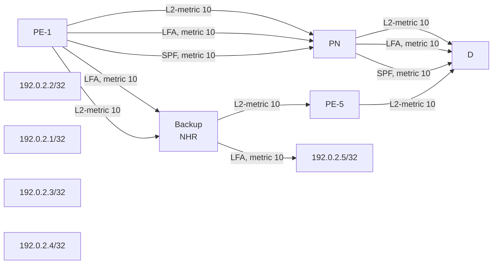

3HE 22247 AAAB TQZZA

**© 2026 Nokia.**

418

Use subject to Terms available at: www.nokia.com/terms.

Advanced Configuration Guide Release 26.7 MPLS LDP LFA using ISIS as IGP

Figure 60: LFA computation: inequality 1 for prefix PE-4 (D) on PE-1 (S)

diagram: network topology showing routers S, Backup NHR, PE-5, PE-3, and D with metric paths

### Inequality 3 formula:

SP(backup NHR, D) < SP(backup NHR, PN) + SP(PN, D)

For a node LFA next-hop computation of prefix 192.0.2.4/32 (D) on PE-1, this means that the shortest path from backup next-hop router PE-2 toward destination PE-4 must be smaller than the sum of the shortest path from backup next-hop router PE-2 toward protected node PE-3 and the shortest path from protected node PE-3 to destination PE-4.

The shortest path from backup next-hop router PE-2 toward destination PE-4 is going via PE-5, using IS-IS level 2 metric 10 for interface int-PE-2-PE-5 and IS-IS level 2 metric 10 for interface int-PE-5-PE-4. The shortest path from backup next-hop router PE-2 toward protected node PE-3 is going via PE-1, using IS-IS level 2 metric 10 for interface int-PE-2-PE-1 and IS-IS level 2 metric 10 for interface int-PE-1-PE-3. The shortest path from protected node PE-3 to destination PE-4 uses IS-IS level 2 metric 10 for interface int-PE-3-PE-4. The computation is as follows:

Prefix 192.0.2.4/32: SP(PE-2, PE-4) < SP(PE-2, PE-3) + SP(PE-3, PE-4)
                     10 + 10       <           (10 + 10) + 10               => **OK**

### Inequality 1 formula:

SP(backup NHR, D) < SP(backup NHR, S) + SP(S, D)

For a link LFA next-hop computation of prefix 192.0.2.4/32 (D) on PE-1, this means that the shortest path from backup next-hop router PE-2 toward destination PE-4 must be smaller than the sum of the shortest

3HE 22247 AAAB TQZZA © 2026 Nokia. 419
Use subject to Terms available at: www.nokia.com/terms.

<page_header>Advanced Configuration Guide Release 26.7

Advanced Configuration Guide Release 26.7 MPLS LDP LFA using ISIS as IGP

```
---snip---
}
**lsp 0100.0000.0002.00-00 {**
     pdu-type level-2
     is-type 3
     ---snip---
     **flags [**
            **overload**
     **]**
     tlvs {
      ---snip---
     }
}
lsp 0100.0000.0003.00-00 {
     ---snip---
}
lsp 0100.0000.0004.00-00 {
     ---snip---
}
lsp 0100.0000.0005.00-00 {
     ---snip---
}
```

The primary path from PE-1 to PE-5 goes via PE-3 instead of via PE-2. This is also the case for the primary path from PE-1 to 192.168.45.0/30. There is no alternate path for the primary paths that go via PE-3. PE-3 still acts as the backup node for the primary paths that go via PE-2.

<table>
<thead>
<tr><th>Network- instance type</th><th>Prefix-fec fec</th><th>Prefix-fec lsr-id</th><th>Prefix-fec label- space-id</th><th>Index</th><th>Next-hop</th><th>Next-hop- Interface</th><th>Outer-label</th></tr>
</thead>
<tbody>
<tr><td>default</td><td>192.0.2.2/32</td><td>192.0.2.2</td><td>0</td><td>1</td><td>192.168.12.</td><td>**primary**</td><td>ethernet-1/31.1</td></tr>
<tr><td></td><td></td><td></td><td></td><td>2</td><td></td><td></td><td></td></tr>
<tr><td>default</td><td>192.0.2.2/32</td><td>192.0.2.3</td><td>0</td><td>1</td><td>192.168.13.</td><td>**alternate**</td><td>ethernet-1/32.1</td></tr>
<tr><td></td><td></td><td></td><td></td><td>2</td><td></td><td></td><td></td></tr>
<tr><td>default</td><td>192.0.2.3/32</td><td>192.0.2.3</td><td>0</td><td>1</td><td>192.168.13.</td><td>**primary**</td><td>ethernet-1/32.1</td></tr>
<tr><td></td><td></td><td></td><td></td><td>2</td><td></td><td></td><td></td></tr>
<tr><td>default</td><td>192.0.2.4/32</td><td>192.0.2.3</td><td>0</td><td>1</td><td>192.168.13.</td><td>**primary**</td><td>ethernet-1/32.1</td></tr>
<tr><td></td><td></td><td></td><td></td><td>2</td><td></td><td></td><td></td></tr>
<tr><td>default</td><td>**192.0.2.5/32**</td><td>192.0.2.3</td><td>0</td><td>1</td><td>**192.168.13.**</td><td>**primary**</td><td>ethernet-1/32.1</td></tr>
<tr><td></td><td></td><td></td><td></td><td>2</td><td></td><td></td><td></td></tr>
</tbody>
</table>


SPACER TEXT

3HE 22247 AAAB TQZZA **© 2026 Nokia.** 421
Use subject to Terms available at: [www.nokia.com/terms](http://www.nokia.com/terms).

Advanced Configuration Guide Release 26.7
MPLS LDP LFA using ISIS as IGP

Only three paths from PE-1 are LFA protected.

<table>
<thead>
<tr><th>Prefix</th><th>ID</th><th>Route</th><th>Route Owner</th><th>Active</th><th>Origin</th><th>Metric</th><th>Pref</th></tr>
<tr><th>Next-hop</th><th>Next-hop</th><th>Backup Type</th><th>Backup Next-hop</th><th></th><th>Network Instanc e</th><th></th><th></th></tr>
<tr><th>(Type)</th><th>Interface</th><th></th><th>(Type)</th><th></th><th></th><th></th><th></th></tr>
<tr><th></th><th></th><th></th><th>Interface</th><th></th><th></th><th></th><th></th></tr>
</thead>
<tbody>
<tr><td>**192.0.2.1/32**</td><td>15</td><td>host</td><td>net_inst_mgr</td><td>True</td><td>default</td><td>0</td><td>0</td></tr>
<tr><td>None</td><td>None</td><td></td><td></td><td></td><td></td><td></td><td></td></tr>
<tr><td>**192.0.2.2/32**</td><td>0</td><td>isis</td><td>isis_mgr</td><td>True</td><td>default</td><td>10</td><td>18</td></tr>
<tr><td>**192.168.1**</td><td>**ethernet-**</td><td>**192.168.1**</td><td>**ethernet-**</td><td></td><td></td><td></td><td></td></tr>
<tr><td>**2.2**</td><td>**1/31.1**</td><td>**3.2**</td><td>**1/32.1**</td><td></td><td></td><td></td><td></td></tr>
<tr><td></td><td>(direct)</td><td></td><td>(direct)</td><td></td><td></td><td></td><td></td></tr>
<tr><td>**192.0.2.3/32**</td><td>0</td><td>isis</td><td>isis_mgr</td><td>True</td><td>default</td><td>10</td><td>18</td></tr>
<tr><td>**192.168.1**</td><td>**ethernet-**</td><td></td><td></td><td></td><td></td><td></td><td></td></tr>
<tr><td></td><td>**3.2**</td><td>**1/32.1**</td><td></td><td></td><td></td><td></td><td></td></tr>
<tr><td></td><td>(direct)</td><td></td><td></td><td></td><td></td><td></td><td></td></tr>
<tr><td>**192.0.2.4/32**</td><td>0</td><td>isis</td><td>isis_mgr</td><td>True</td><td>default</td><td>20</td><td>18</td></tr>
<tr><td>**192.168.1**</td><td>**ethernet-**</td><td></td><td></td><td></td><td></td><td></td><td></td></tr>
<tr><td></td><td>**3.2**</td><td>**1/32.1**</td><td></td><td></td><td></td><td></td><td></td></tr>
<tr><td></td><td>(direct)</td><td></td><td></td><td></td><td></td><td></td><td></td></tr>
<tr><td>**192.0.2.5/32**</td><td>0</td><td>isis</td><td>isis_mgr</td><td>True</td><td>default</td><td>20</td><td>18</td></tr>
<tr><td>**192.168.1**</td><td>**ethernet-**</td><td></td><td></td><td></td><td></td><td></td><td></td></tr>
<tr><td></td><td>**3.2**</td><td>**1/32.1**</td><td></td><td></td><td></td><td></td><td></td></tr>
<tr><td></td><td>(direct)</td><td></td><td></td><td></td><td></td><td></td><td></td></tr>
<tr><td>192.168.12.0/30</td><td>13</td><td>local</td><td>net_inst_mgr</td><td>True</td><td>default</td><td>0</td><td>0</td></tr>
<tr><td>**192.168.1**</td><td>**ethernet-**</td><td></td><td></td><td></td><td></td><td></td><td></td></tr>
<tr><td></td><td>2.1</td><td>1/31.1</td><td></td><td></td><td></td><td></td><td></td></tr>
<tr><td></td><td>(direct)</td><td></td><td></td><td></td><td></td><td></td><td></td></tr>
<tr><td>192.168.12.1/32</td><td>13</td><td>host</td><td>net_inst_mgr</td><td>True</td><td>default</td><td>0</td><td>0</td></tr>
<tr><td>None</td><td>None</td><td></td><td></td><td></td><td></td><td></td><td></td></tr>
<tr><td>192.168.12.3/32</td><td>13</td><td>host</td><td>net_inst_mgr</td><td>True</td><td>default</td><td>0</td><td>0</td></tr>
<tr><td>None</td><td>None</td><td></td><td></td><td></td><td></td><td></td><td></td></tr>
<tr><td>192.168.13.0/30</td><td>14</td><td>local</td><td>net_inst_mgr</td><td>True</td><td>default</td><td>0</td><td>0</td></tr>
<tr><td>**192.168.1**</td><td>**ethernet-**</td><td></td><td></td><td></td><td></td><td></td><td></td></tr>
<tr><td></td><td>3.1</td><td>1/32.1</td><td></td><td></td><td></td><td></td><td></td></tr>
<tr><td></td><td>(direct)</td><td></td><td></td><td></td><td></td><td></td><td></td></tr>
</tbody>
</table>

3HE 22247 AAAB TQZZA
© 2026 Nokia.
422
Use subject to Terms available at: www.nokia.com/terms.

Advanced Configuration Guide Release 26.7
MPLS LDP LFA using ISIS as IGP

```
| 192.168.13.1/32 | 14 | host | net_inst_mgr | True | default | 0 | 0 |
| None | None | | | | | | |
| 192.168.13.3/32 | 14 | host | net_inst_mgr | True | default | 0 | 0 |
| None | None | | | | | | |
| **192.168.23.0/30** | 0 | isis | isis_mgr | True | default | 20 | 18 |
| **192.168.1** | **ethernet-** | **192.168.1** | **ethernet-** | | | | |
| **2.2** | **1/31.1** | **3.2** | **1/32.1** | | | | |
| (direct) | | (direct) | | | | | |
| **192.168.25.0/30** | 0 | isis | isis_mgr | True | default | 20 | 18 |
| **192.168.1** | **ethernet-** | **192.168.1** | **ethernet-** | | | | |
| **2.2** | **1/31.1** | **3.2** | **1/32.1** | | | | |
| (direct) | | (direct) | | | | | |
| 192.168.34.0/30 | 0 | isis | isis_mgr | True | default | 20 | 18 |
| 192.168.1 | ethernet- | | | | | | |
| 3.2 | 1/32.1 | | | | | | |
| (direct) | | | | | | | |
| 192.168.35.0/30 | 0 | isis | isis_mgr | True | default | 20 | 18 |
| 192.168.1 | ethernet- | | | | | | |
| 3.2 | 1/32.1 | | | | | | |
| (direct) | | | | | | | |
| **192.168.45.0/30** | 0 | isis | isis_mgr | True | default | 30 | 18 |
| 192.168.1 | ethernet- | | | | | | |
| 3.2 | 1/32.1 | | | | | | |
| (direct) | | | | | | | |
```

IPv4 routes total : 16

IPv4 prefixes with active routes : 16

IPv4 prefixes with active ECMP routes: 0

With IS-IS **set-bit true** on PE-2 configured and **max-metric false**, the LFA coverage on PE-1 changes as follows.

Considering all inequality 3 computations, only one out of four is valid (OK). So, the LFA node coverage on PE-1 is 1/4=25%.

Considering all inequality 1 computations, only three out of nine are valid (OK). So, the LFA IPv4 link coverage on PE-1 is 3/9=33%.
On PE-1, only three inequality 1 computations are possible, as seen in the previous **show** commands. The inequality 1 computation on PE-1 for destination 192.168.25.0/30 is as follows:

$$SP(backup\ NHR,D) < SP(backup\ NHR,S) + SP(S,D)$$
$$SP(PE-3,D) < SP(PE-3,PE-1) + SP(PE-1,D)$$
$$10 + 10 < 10 + (10 + 10) => OK$$

3HE 22247 AAAB TQZZA
© 2026 Nokia.
423
Use subject to Terms available at: www.nokia.com/terms.

Advanced Configuration Guide Release 26.7 MPLS LDP LFA using ISIS as IGP

Figure 61: IS-IS overload on PE-2, inequality 1 for 192.168.25.0/30 (D) on PE-1 (S)

diagram: IS-IS overload network topology

It is also possible to configure a node as overloaded by advertising the node's transit links with maximum metric (16777214). As an example, configure IS-IS overload on PE-2, as follows:

```
# On PE-2:
enter candidate
network-instance default protocols isis instance 0 {
               overload {
                immediate {
                 set-bit true
                 max-metric true           # set-bit must be true
```

The maximum link metric for each directly connected neighbor is advertised in the IS-IS link state database for LSP 0100.0000.0002.00-00 that corresponds with PE-2. This indicates to the other PEs that PE-2 is still available as a transit node and also as a backup node, but with maximum link metric.

```
network-instance default {
protocols {
          isis {
               instance 0 {
                level 2 {
                metric-style wide
                loopfree-alternate-exclude false
                ---snip---
                link-state-database {
                 lsp 0100.0000.0001.00-00 {
                           ---snip---
                 }
                 **lsp 0100.0000.0002.00-00** {
                           ---snip---
```

3HE 22247 AAAB TQZZA 424 © 2026 Nokia. Use subject to Terms available at: www.nokia.com/terms.

Advanced Configuration Guide Release 26.7 MPLS LDP LFA using ISIS as IGP

```
pdu-type level-2
is-type 3
tlvs {
 ---snip---
 tlv extended-is-reachability {
      extended-is-reachability {
         neighbors {
           **neighbor 0100.0000.0001 {**
                instances {
                    instance 0 {
                     **metric 16777214**
                     subtlvs {
                           subtlv is-reachability-ipv4-
interface-address {
                                ipv4-interface-address {
                                 **address [**
                                    **192.168.12.2**
                                 ]
                                }
                           }
                           subtlv is-reachability-ipv4-
neighbor-address {
                                ipv4-neighbor-address {
                                 **address [**
                                    **192.168.12.1**
                                 ]
                                }
                           }
                     }
                    }
                }
           }
           **neighbor 0100.0000.0003 {**
                instances {
                    instance 0 {
                     **metric 16777214**
                     subtlvs {
                           subtlv is-reachability-ipv4-
interface-address {
                                ipv4-interface-address {
                                 **address [**
                                    **192.168.23.1**
                                 ]
                                }
                           }
                           subtlv is-reachability-ipv4-
neighbor-address {
                                ipv4-neighbor-address {
                                 **address [**
                                    **192.168.23.2**
                                 ]
                                }
                           }
                     }
                    }
                }
           }
           **neighbor 0100.0000.0005 {**
                instances {
                    instance 0 {
                     **metric 16777214**
                     subtlvs {
                           subtlv is-reachability-ipv4-
interface-address {
```


SPACER TEXT

3HE 22247 AAAB TQZZA 425 **© 2026 Nokia.**
Use subject to Terms available at: [www.nokia.com/terms](http://www.nokia.com/terms).

Advanced Configuration Guide Release 26.7 MPLS LDP LFA using ISIS as IGP

```
ipv4-interface-address {
    **address [**
           **192.168.25.1**
    ]
}
}
subtlv is-reachability-ipv4-
neighbor-address {
    ipv4-neighbor-address {
        **address [**
               **192.168.25.2**
        ]
    }
}
}
}
}
}
}
}
}
}
lsp 0100.0000.0003.00-00 {
    ---snip---
}
lsp 0100.0000.0004.00-00 {
    ---snip---
}
lsp 0100.0000.0005.00-00 {
    ---snip---
}
```

The primary path from PE-1 to PE-5 goes via PE-3 instead of via PE-2. This is also the case for the primary path from PE-1 to 192.168.45.0/30. There is no alternate path for the primary paths that go via PE-3. PE-3 still acts as the backup node for the primary paths that go via PE-2.

<table>
<thead>
<tr><th>Network- instance</th><th>Prefix-fec fec</th><th>Prefix-fec lsr-id</th><th>Prefix-fec label- space-id</th><th>Index</th><th>Next-hop</th><th>Next-hop- type</th><th>Interface</th></tr>
<tr><th></th><th></th><th></th><th></th><th></th><th></th><th></th><th></th></tr>
</thead>
<tbody>
<tr><td>default</td><td>192.0.2.2/32</td><td>192.0.2.2</td><td>0</td><td>1</td><td>192.168.12.</td><td>primary</td><td>ethernet-1/31.1</td></tr>
<tr><td></td><td></td><td></td><td></td><td>2</td><td></td><td></td><td></td></tr>
<tr><td>default</td><td>192.0.2.2/32</td><td>192.0.2.3</td><td>0</td><td>1</td><td>192.168.13.</td><td>alternate</td><td>ethernet-1/32.1</td></tr>
<tr><td></td><td></td><td></td><td></td><td>2</td><td></td><td></td><td></td></tr>
<tr><td>default</td><td>192.0.2.3/32</td><td>192.0.2.2</td><td>0</td><td>1</td><td>192.168.12.</td><td>alternate</td><td>ethernet-1/31.1</td></tr>
<tr><td></td><td></td><td></td><td></td><td>2</td><td></td><td></td><td></td></tr>
<tr><td>default</td><td>192.0.2.3/32</td><td>192.0.2.3</td><td>0</td><td>1</td><td>192.168.13.</td><td>primary</td><td>ethernet-1/32.1</td></tr>
</tbody>
</table>

3HE 22247 AAAB TQZZA 426
**© 2026 Nokia.**
Use subject to Terms available at: www.nokia.com/terms.

Advanced Configuration Guide Release 26.7
MPLS LDP LFA using ISIS as IGP

<table>
<thead>
<tr><th></th><th></th><th></th><th></th><th></th><th></th><th></th><th>2</th><th></th><th></th></tr>
</thead>
<tbody>
<tr><td></td><td>default</td><td>**192.0.2.4/32**</td><td>192.0.2.3</td><td></td><td>0</td><td>1</td><td>192.168.13.</td><td>primary</td><td>ethernet-1/32.1</td></tr>
<tr><td></td><td>default</td><td>192.0.2.5/32</td><td>192.0.2.2</td><td></td><td>0</td><td>1</td><td>192.168.12.</td><td>alternate</td><td>ethernet-1/31.1</td></tr>
<tr><td></td><td>default</td><td>192.0.2.5/32</td><td>192.0.2.3</td><td></td><td>0</td><td>1</td><td>192.168.13.</td><td>primary</td><td>ethernet-1/32.1</td></tr>
</tbody>
</table>

When the destination node belongs to the set of direct neighbors of PE-2, the LFA computation uses the configured link metrics. Otherwise, the LFA computation uses the maximum metric value on the links to the transit nodes. In the given example, only PE-4 does not belong to the set of direct neighbors of PE-2. So, the node and link inequalities for PE-4 cannot be fullfilled. On the primary path, the 192.168.45.0/32 network is reached via PE-4. So the link inequality for the 192.168.45.0/32 network can also not be fullfilled.

--{ running }--[ ]--
A:admin@PE-1# show / network-instance default route-table all
-----------------------------------------------------------------------------------------------
----------------------------------------------------------
IPv4 unicast route table of network instance default
-----------------------------------------------------------------------------------------------
----------------------------------------------------------
<table>
<thead>
<tr><th>Prefix</th><th>ID</th><th>Route</th><th>Route Owner</th><th>Active</th><th>Origin</th><th>Metric</th><th>Pref</th><th>Next-hop</th><th>Next-hop</th><th>Backup</th><th>Backup</th></tr>
<tr><th>Next-hop</th><th>Next-hop</th><th>Backup</th><th>Backup</th><th></th><th>Network</th><th></th><th></th><th>(Type)</th><th>Interface</th><th>Next-hop</th><th>Next-hop</th></tr>
<tr><th>(Type)</th><th>Interface</th><th>Next-hop</th><th>Next-hop</th><th></th><th>Instanc</th><th></th><th></th><th></th><th></th><th>(Type)</th><th>Interface</th></tr>
<tr><th></th><th></th><th>(Type)</th><th>Interface</th><th></th><th>e</th><th></th><th></th><th></th><th></th><th></th><th></th></tr>
</thead>
<tbody>
<tr><td>192.0.2.1/32</td><td>15</td><td>host</td><td>net_inst_mgr</td><td>True</td><td>default</td><td>0</td><td>0</td><td>None</td><td>None</td><td></td><td></td></tr>
<tr><td>192.0.2.2/32</td><td>0</td><td>isis</td><td>isis_mgr</td><td>True</td><td>default</td><td>10</td><td>18</td><td>192.168.12.2</td><td>ethernet-1/31.1</td><td>192.168.13.2</td><td>ethernet-1/32.1</td></tr>
<tr><td>192.0.2.3/32</td><td>0</td><td>isis</td><td>isis_mgr</td><td>True</td><td>default</td><td>10</td><td>18</td><td>192.168.13.2</td><td>ethernet-1/32.1</td><td>192.168.12.2</td><td>ethernet-1/31.1</td></tr>
<tr><td>**192.0.2.4/32**</td><td>0</td><td>isis</td><td>isis_mgr</td><td>True</td><td>default</td><td>20</td><td>18</td><td>192.168.13.2</td><td>ethernet-1/32.1</td><td></td><td></td></tr>
</tbody>
</table>

3HE 22247 AAAB TQZZA
<**© 2026 Nokia.**>
427
Use subject to Terms available at: www.nokia.com/terms.

Advanced Configuration Guide Release 26.7 MPLS LDP LFA using ISIS as IGP

<table>
<thead>
<tr><th></th><th>(direct)</th><th></th><th></th><th></th><th></th><th></th><th></th><th></th></tr>
</thead>
<tbody>
<tr><td></td><td>192.0.2.5/32</td><td>0</td><td>isis</td><td>isis_mgr</td><td>True</td><td>default</td><td>20</td><td>18</td></tr>
<tr><td></td><td>**192.168.1**</td><td>ethernet-</td><td>**192.168.1**</td><td>ethernet-</td><td></td><td></td><td></td><td></td></tr>
<tr><td></td><td>**3.2**</td><td>1/32.1</td><td>2.2</td><td>1/31.1</td><td></td><td></td><td></td><td></td></tr>
<tr><td></td><td>(direct)</td><td></td><td>(direct)</td><td></td><td></td><td></td><td></td><td></td></tr>
<tr><td></td><td>192.168.12.0/30</td><td>13</td><td>local</td><td>net_inst_mgr</td><td>True</td><td>default</td><td>0</td><td>0</td></tr>
<tr><td></td><td>**192.168.1**</td><td colspan="2">ethernet-</td><td></td><td></td><td></td><td></td><td></td></tr>
<tr><td></td><td>2.1</td><td colspan="2">1/31.1</td><td></td><td></td><td></td><td></td><td></td></tr>
<tr><td></td><td>(direct)</td><td></td><td></td><td></td><td></td><td></td><td></td><td></td></tr>
<tr><td></td><td>192.168.12.1/32</td><td>13</td><td>host</td><td>net_inst_mgr</td><td>True</td><td>default</td><td>0</td><td>0</td></tr>
<tr><td></td><td>None</td><td>None</td><td></td><td></td><td></td><td></td><td></td><td></td></tr>
<tr><td></td><td>192.168.12.3/32</td><td>13</td><td>host</td><td>net_inst_mgr</td><td>True</td><td>default</td><td>0</td><td>0</td></tr>
<tr><td></td><td>None</td><td>None</td><td></td><td></td><td></td><td></td><td></td><td></td></tr>
<tr><td></td><td>192.168.13.0/30</td><td>14</td><td>local</td><td>net_inst_mgr</td><td>True</td><td>default</td><td>0</td><td>0</td></tr>
<tr><td></td><td>**192.168.1**</td><td colspan="2">ethernet-</td><td></td><td></td><td></td><td></td><td></td></tr>
<tr><td></td><td>3.1</td><td colspan="2">1/32.1</td><td></td><td></td><td></td><td></td><td></td></tr>
<tr><td></td><td>(direct)</td><td></td><td></td><td></td><td></td><td></td><td></td><td></td></tr>
<tr><td></td><td>192.168.13.1/32</td><td>14</td><td>host</td><td>net_inst_mgr</td><td>True</td><td>default</td><td>0</td><td>0</td></tr>
<tr><td></td><td>None</td><td>None</td><td></td><td></td><td></td><td></td><td></td><td></td></tr>
<tr><td></td><td>192.168.13.3/32</td><td>14</td><td>host</td><td>net_inst_mgr</td><td>True</td><td>default</td><td>0</td><td>0</td></tr>
<tr><td></td><td>None</td><td>None</td><td></td><td></td><td></td><td></td><td></td><td></td></tr>
<tr><td></td><td>192.168.23.0/30</td><td>0</td><td>isis</td><td>isis_mgr</td><td>True</td><td>default</td><td>20</td><td>18</td></tr>
<tr><td></td><td>**192.168.1**</td><td>ethernet-</td><td>**192.168.1**</td><td>ethernet-</td><td></td><td></td><td></td><td></td></tr>
<tr><td></td><td>2.2</td><td>1/31.1</td><td>**3.2**</td><td>1/32.1</td><td></td><td></td><td></td><td></td></tr>
<tr><td></td><td>(direct)</td><td></td><td>(direct)</td><td></td><td></td><td></td><td></td><td></td></tr>
<tr><td></td><td>192.168.25.0/30</td><td>0</td><td>isis</td><td>isis_mgr</td><td>True</td><td>default</td><td>20</td><td>18</td></tr>
<tr><td></td><td>**192.168.1**</td><td>ethernet-</td><td>**192.168.1**</td><td>ethernet-</td><td></td><td></td><td></td><td></td></tr>
<tr><td></td><td>2.2</td><td>1/31.1</td><td>**3.2**</td><td>1/32.1</td><td></td><td></td><td></td><td></td></tr>
<tr><td></td><td>(direct)</td><td></td><td>(direct)</td><td></td><td></td><td></td><td></td><td></td></tr>
<tr><td></td><td>192.168.34.0/30</td><td>0</td><td>isis</td><td>isis_mgr</td><td>True</td><td>default</td><td>20</td><td>18</td></tr>
<tr><td></td><td>**192.168.1**</td><td>ethernet-</td><td>**192.168.1**</td><td>ethernet-</td><td></td><td></td><td></td><td></td></tr>
<tr><td></td><td>**3.2**</td><td>1/32.1</td><td>2.2</td><td>1/31.1</td><td></td><td></td><td></td><td></td></tr>
<tr><td></td><td>(direct)</td><td></td><td>(direct)</td><td></td><td></td><td></td><td></td><td></td></tr>
<tr><td></td><td>192.168.35.0/30</td><td>0</td><td>isis</td><td>isis_mgr</td><td>True</td><td>default</td><td>20</td><td>18</td></tr>
<tr><td></td><td>**192.168.1**</td><td>ethernet-</td><td>**192.168.1**</td><td>ethernet-</td><td></td><td></td><td></td><td></td></tr>
<tr><td></td><td>**3.2**</td><td>1/32.1</td><td>2.2</td><td>1/31.1</td><td></td><td></td><td></td><td></td></tr>
<tr><td></td><td>(direct)</td><td></td><td>(direct)</td><td></td><td></td><td></td><td></td><td></td></tr>
<tr><td></td><td>**192.168.45.0/30**</td><td>0</td><td>isis</td><td>isis_mgr</td><td>True</td><td>default</td><td>30</td><td>18</td></tr>
<tr><td></td><td>**192.168.1**</td><td colspan="2">ethernet-</td><td></td><td></td><td></td><td></td><td></td></tr>
<tr><td></td><td>**3.2**</td><td colspan="2">1/32.1</td><td></td><td></td><td></td><td></td><td></td></tr>
<tr><td></td><td>(direct)</td><td></td><td></td><td></td><td></td><td></td><td></td><td></td></tr>
</tbody>
</table>

IPv4 routes total : 16
IPv4 prefixes with active routes : 16

428 **© 2026 Nokia.** Use subject to Terms available at: www.nokia.com/terms.

Advanced Configuration Guide Release 26.7 MPLS LDP LFA using ISIS as IGP

```
IPv4 prefixes with active ECMP routes: 0
-----------------------------------------------------------------------------------------------
----------------------------------------------------------
```

Considering all inequality 3 computations, only three out of four are valid (OK). So, the LFA node coverage on PE-1 is 3/4=75%.

Considering all inequality 1 computations, only seven out of nine are valid (OK). So, the LFA IPv4 link coverage on PE-1 is 7/9=78%.

Remove the overload configuration on PE-2, as follows:

```
# On PE-2:
enter candidate
network-instance default protocols isis instance 0 {
                  delete overload
```

## 18.4 Conclusion

In production MPLS networks where LFA needs to be deployed, LDP LFA improves convergence in case of a single link or single node failure in the network. The two main advantages of using LDP LFA are the simple configuration and the fact that LFA next-hop computation is a local decision, which means there are no interoperability issues when working in a multi-vendor environment. The main disadvantage of using LDP LFA is that LFA next-hop computation has to deal with the source-route paradigm (inequality formulas exclude a path going over the original source router).


SPACER TEXT

3HE 22247 AAAB TQZZA 429
**© 2026 Nokia.**
Use subject to Terms available at: [www.nokia.com/terms](http://www.nokia.com/terms).

Advanced Configuration Guide Release 26.7 Network-instance Route Leaking

# 19 Network-instance Route Leaking

This chapter provides information about route leaking from one network-instance to another.

Topics in this chapter include:

* Applicability

* Overview

* Configuration

* Conclusion

## 19.1 Applicability

The CLI in the latest update corresponds to SR Linux Release 26.3.

## 19.2 Overview

Network-instance route leaking refers to the process of copying a route from one network instance to another. Network administrators may need to leak routes between network instances on the same SRL node.

In the examples in this chapter, only BGP routes are leaked. It is possible to leak a copy of a BGP route (including its path attributes) from one network instance to another on the same node. In this chapter, BGP route leaking is shown for IPv4-unicast and IPv6-unicast. Leaking is supported from the default network- instance to an IP-VRF, from one IP-VRF to another IP-VRF, and from an IP-VRF to the default network- instance.

An IPv4 or IPv6 route becomes a candidate for leaking to another instance when an export policy that matches this route is applied in the **inter-instance-policies** context of the source network instance. Routes that are candidates for leaking to other instances show a **leakable** flag in the IPv4 or IPv6 route table of the source network instance.

To import a **leakable** route, the target network instance must be configured with a policy that matches and accepts the **leakable** route. There are import policies for IPv4 and IPv6 routes. In the target instance, the **show network-instance <..> ipv4 route** command displays **leaked** IPv4 routes in addition to routes learned from neighbors of the network instance. A **leaked** flag is added to the **leaked** entries. Figure 62: Network-instance route leaking process shows the process of network-instance route leaking.

3HE 22247 AAAB TQZZA 430
**© 2026 Nokia.**
Use subject to Terms available at: [www.nokia.com/terms](http://www.nokia.com/terms).

Advanced Configuration Guide Release 26.7 Network-instance Route Leaking

Figure 62: Network-instance route leaking process

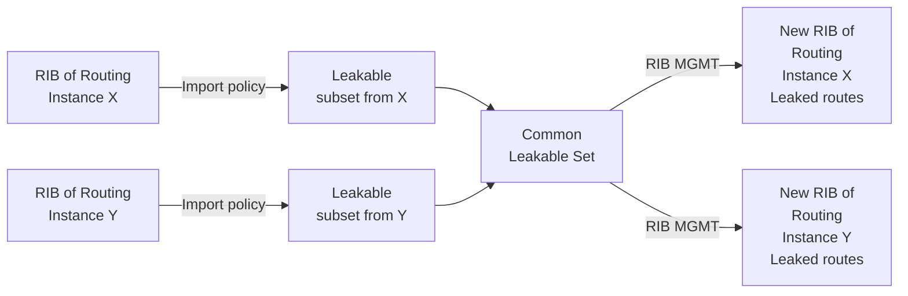

25963

Leaked BGP routes can be advertised to BGP neighbors (peers) of the destination network-instance. The BGP next hop of a leaked route is automatically reset to self whenever it is advertised to a peer of the destination network-instance. For example, for BGP routes leaked into an IP-VRF, the routes can be re-advertised by the IP-VRF as a BGP-IPVPN route when matching the VRF export policy. Normal VPN export rules apply: by default, the leaked route is exported if it is the overall best path and it is used as the active route to the destination.

In contrast, for BGP routes leaked from an IP-VRF to the default network-instance that must be re-advertised using BGP or labeled BGP, the leaked routes must be imported in the BGP RIB first. Without importing to the BGP RIB, the routes can be advertised using IS-IS when accepted by an IS-IS export policy or table-connection policy.

## 19.3 Configuration

Figure 63: Example topology shows the example topology used in this chapter, including the IPv4 addresses. For each of the examples, a dedicated figure shows the specific topology, which is a subset of the topology in Figure 63: Example topology. The interfaces also have IPv6 addresses, which are shown in Figure 68: BGP IPv6 route leaking between IP-VRFs and Figure 69: BGP IPv6 route leaking from default network-instance and IP-VRF to IP-VRF. IP-VRF-2 also has CEs attached, but for simplicity, these are not shown on the figures and no CLI is shown for any CE.

3HE 22247 AAAB TQZZA 431
**© 2026 Nokia.**
Use subject to Terms available at: www.nokia.com/terms.

Advanced Configuration Guide Release 26.7

Advanced Configuration Guide Release 26.7 Network-instance Route Leaking

## 19.3.2 Example 1 - BGP IPv4 route leaking between IP-VRFs

Figure 64: BGP IPv4 route leaking between IP-VRFs shows the topology for this example. CE-11 exports routes such as 192.168.90.2/32 to IP-VRF-1 on PE-1, and CE-12 exports routes such as 192.168.120.2/32 to IP-VRF-1 on PE-1.

Figure 64: BGP IPv4 route leaking between IP-VRFs

engineering_drawing: Network topology diagram showing PE-1, PE-2, CE-11, and CE-12 with associated VPRN and AS numbers

25965

All EBGP routes are by default rejected unless policies are configured. The following import policy is applied in IP-VRF-1.

```
# on PE-1:
enter candidate
routing-policy {
 as-path-set AS-64501-64502 {
          as-path-set-member [
               64501
               64502
          ]
 }
 policy pol_import-bgp {
          statement stmt-10 {
               match {
                   bgp {
                      as-path {
```

433 3HE 22247 AAAB TQZZA © 2026 Nokia. Use subject to Terms available at: [www.nokia.com/terms](http://www.nokia.com/terms).

Advanced Configuration Guide Release 26.7 Network-instance Route Leaking

```
as-path-set AS-64501-64502
         }
      }
}
action {
         policy-result accept
}
}
}
}
network-instance IP-VRF-1 {
         protocols {
          bgp {
          import-policy [
                    pol_import-bgp
          ]
```

The routing table for IP-VRF-1 on PE-1 includes IPv4 routes that are learned from CE-11 and CE-12, as follows:

```
--{ + running }--[ ]--
A:admin@PE-1# show / network-instance IP-VRF-1 ipv4 route
==============================================================================================
IPv4-unicast route table for ip-vrf network-instance: IP-VRF-1
----------------------------------------------------------------------------------------------
Flags: > (best), * (unviable), ! (failed)
  : L (leaked route from another network-instance)
  : B (backup NHG active and displayed)
  : S (statistics supported)
  : D (dynamic LB), R (resilient LB)
-----------------------------------------------------------------------------------------------
Prefix                Route Type     Metric  Pref     Flags     Next-Hop(s)
-----------------------------------------------------------------------------------------------
 172.16.111.0/30      local          0       0        >         172.16.111.1(ethernet-1/11.1)
 172.16.112.0/30      local          0       0        >         172.16.112.1(ethernet-1/12.1)
 192.168.90.2/32      bgp            0       170      >         172.16.111.2(route:local)
 192.168.90.3/32      bgp            0       170      >         172.16.111.2(route:local)
 192.168.90.4/30      bgp            0       170      >         172.16.111.2(route:local)
192.168.120.2/32      bgp            0       170      >         172.16.112.2(route:local)
192.168.120.3/32      bgp            0       170      >         172.16.112.2(route:local)
192.168.120.4/30      bgp            0       170      >         172.16.112.2(route:local)
```

These BGP routes are not leakable, by default, as follows:

```
--{ + running }--[ ]--
A:admin@PE-1# show / network-instance IP-VRF-1 ipv4 route leakable
===============================================================================================
=
IPv4-unicast route table for ip-vrf network-instance: IP-VRF-1
-----------------------------------------------------------------------------------------------
-
Flags: > (best), * (unviable), ! (failed)
  : L (leaked route from another network-instance)
  : B (backup NHG active and displayed)
  : S (statistics supported)
  : D (dynamic LB), R (resilient LB)
-----------------------------------------------------------------------------------------------
-
Prefix                Route Type     Metric  Pref     Flags     Next-Hop(s)
-----------------------------------------------------------------------------------------------
-
```

3HE 22247 AAAB TQZZA 434
**© 2026 Nokia.**
Use subject to Terms available at: [www.nokia.com/terms](http://www.nokia.com/terms).

Advanced Configuration Guide Release 26.7 Network-instance Route Leaking

The routing table for IP-VRF-2 does not include any of these routes because route leaking is disabled by default:

```
--{ + running }--[ ]-- A:admin@PE-1# show / network-instance IP-VRF-2 ipv4 route
===============================================================================================
=
IPv4-unicast route table for ip-vrf network-instance: IP-VRF-2
-----------------------------------------------------------------------------------------------
-
Flags: > (best), * (unviable), ! (failed)
  : L (leaked route from another network-instance)
  : B (backup NHG active and displayed)
  : S (statistics supported)
  : D (dynamic LB), R (resilient LB)
-----------------------------------------------------------------------------------------------
-
Prefix              Route Type      Metric    Pref     Flags     Next-Hop(s)
-----------------------------------------------------------------------------------------------
-
172.16.2.2/32       bgp-ipvpn       10        170      >         192.0.2.2(tunnel:ldp, label:30000)
172.16.12.0/30      local           0         0        >         172.16.12.1(ethernet-1/2.2)
```

To configure inter-instance route leaking, an export policy is configured in IP-VRF-1, as follows:

```
# on PE-1:
enter candidate
 routing-policy {
           policy pol_make-bgp-routes-leakable {
            default-action {
                   policy-result reject
            }
            statement stmt-10 {
                   match {
                    protocol bgp
                   }
                   action {
                    policy-result accept
                   }
            }
           }
 }
 **network-instance IP-VRF-1 {**
           **inter-instance-policies {**
            **apply-policy {**
                   **export-policy [**
                    **pol_make-bgp-routes-leakable**
                   **]**
            **}**
           **}**
 }
```

With the preceding configuration, the routes imported into the IP-VRF are marked as leakable, meaning they are available to be copied to other network instances. The routes originate from CE-11 or CE-12 in this example. The export policy on IP-VRF-1 controls what becomes leakable from IP-VRF-1.

The following command shows which BGP routes in IP-VRF-1 are marked as **leakable**:

```
--{ + candidate shared default }--[ ]-- A:admin@PE-1# show network-instance IP-VRF-1 ipv4 route **leakable**
==============================================================================================
IPv4-unicast route table for ip-vrf network-instance: IP-VRF-1
----------------------------------------------------------------------------------------------
```

3HE 22247 AAAB TQZZA 435
**© 2026 Nokia.**
Use subject to Terms available at: [www.nokia.com/terms](http://www.nokia.com/terms).

Advanced Configuration Guide Release 26.7 <span style="float: right;">Network-instance Route Leaking</span>

```
Flags: > (best), * (unviable), ! (failed)
        : L (leaked route from another network-instance)
        : B (backup NHG active and displayed)
        : S (statistics supported)
        : D (dynamic LB), R (resilient LB)
----------------------------------------------------------------------------------------------
Prefix                  Route Type     Metric  Pref     Flags     Next-Hop(s)
----------------------------------------------------------------------------------------------
 192.168.90.2/32        bgp            0       170      >         172.16.111.2(route:local)
 192.168.90.3/32        bgp            0       170      >         172.16.111.2(route:local)
 192.168.90.4/30        bgp            0       170      >         172.16.111.2(route:local)
192.168.120.2/32        bgp            0       170      >         172.16.112.2(route:local)
192.168.120.3/32        bgp            0       170      >         172.16.112.2(route:local)
192.168.120.4/30        bgp            0       170      >         172.16.112.2(route:local)
```

The following detailed output for one of the routes in the preceding list shows that the route is leakable from IP-VRF-1 to other network-instances (**Leakable**: **yes**) whereas the route is not leaked into IP-VRF-1 (Leaked: no):

```
--{ + running }--[ ]--
A:admin@PE-1# show / network-instance IP-VRF-1 ipv4 route leakable 192.168.90.2/32 detail
===============================================================================================
=================================
Prefix: 192.168.90.2/32
-----------------------------------------------------------------------------------------------
---------------------------------
Active                   : yes
Route Type               : bgp
Route Owner              : bgp_mgr, 2026-05-07T09:17:25.657Z (51 seconds ago)
Id                       : 0
**Leakable**                 : **yes**
Leaked                   : no
Metric                   : 0
Preference               : 170
Internal Tags            : none
Dynamic LB               : no
Resilient Hash           : no
FIB Suppressed           : no
FIB Failed               : no
Next-Hop-Group           : 32082776
 Net-Instance            : IP-VRF-1
 FIB Failed              : no
 Primary NH              : 32082768
       LB Weight         : 1
       Type              : indirect
       IP Address        : 172.16.111.2
       Resolved          : yes
       Resolving Route   : 172.16.111.0/30(local)
```

Leakable routes from IP-VRF-1 can be imported into other network-instances. The import policy on IP-VRF-2 controls which leaked routes are installed into IP-VRF-2. Prefix lists can be used to filter specific routes for BGP leaking, but that is not configured in this example. The following policy to import BGP leakable routes is applied as an inter-instance import policy in IP-VRF-2 on PE-1:

```
# on PE-1:
enter candidate
       routing-policy {
           policy pol_import-leakable-routes {
                default-action {
                      policy-result reject
                }
```

3HE 22247 AAAB TQZZA <span style="float: right;"><span style="float: right;">**© 2026 Nokia.**</span> 436</span>
Use subject to Terms available at: [www.nokia.com/terms](http://www.nokia.com/terms).

Advanced Configuration Guide Release 26.7 Network-instance Route Leaking

```
statement stmt-10 {
 match {
         protocol bgp
 }
 action {
         policy-result accept
 }
}
}
}
**network-instance IP-VRF-2** {
       **inter-instance-policies** {
        **apply-policy** {
         **import-policy** [
                 **pol_import-leakable-routes**
         ]
        }
       }
```

The following command shows that IP-VRF-2 imported **leaked** BGP routes from IP-VRF-1. The L-flag indicates that the route is **leaked**.

```
--{ + running }--[ ]-- A:admin@PE-1# show / network-instance IP-VRF-2 ipv4 route leaked
===============================================================================================
===================
IPv4-unicast route table for ip-vrf network-instance: IP-VRF-2
-----------------------------------------------------------------------------------------------
-------------------
Flags: > (best), * (unviable), ! (failed)
  : L (leaked route from another network-instance)
  : B (backup NHG active and displayed)
  : S (statistics supported)
  : D (dynamic LB), R (resilient LB)
-----------------------------------------------------------------------------------------------
-------------------
Prefix               Route Type     Metric  Pref     Flags     Next-Hop(s)
-----------------------------------------------------------------------------------------------
-------------------
192.168.90.2/32      bgp            0       170      >L        172.16.111.2(**net-instance:IP-VRF-1**,
route:local)
192.168.90.3/32      bgp            0       170      >L        172.16.111.2(**net-instance:IP-VRF-1**,
route:local)
192.168.90.4/30      bgp            0       170      >L        172.16.111.2(**net-instance:IP-VRF-1**,
route:local)
192.168.120.2/32     bgp            0       170      >L        172.16.112.2(**net-instance:IP-VRF-1**,
route:local)
192.168.120.3/32     bgp            0       170      >L        172.16.112.2(**net-instance:IP-VRF-1**,
route:local)
192.168.120.4/30     bgp            0       170      >L        172.16.112.2(**net-instance:IP-VRF-1**,
route:local)
```

The detailed output for a particular **leaked** BGP route shows that this route is not leakable from IP-VRF-2 (Leakable: no), but the route is **leaked** into IP-VRF-2 from IP-VRF-1 (Leaked: from IP-VRF-1), as follows:

```
--{ + running }--[ ]-- A:admin@PE-1# show / network-instance IP-VRF-2 ipv4 route 192.168.90.2/32 detail
===============================================================================================
===================
Prefix: 192.168.90.2/32
-----------------------------------------------------------------------------------------------
-------------------
```

3HE 22247 AAAB TQZZA **© 2026 Nokia.** 437
Use subject to Terms available at: [www.nokia.com/terms](http://www.nokia.com/terms).

Advanced Configuration Guide Release 26.7 Network-instance Route Leaking

```
Active                   : yes
Route Type               : bgp
Route Owner              : bgp_mgr, 2026-04-29T07:22:03.157Z (3 minutes ago)
Id                       : 0
Leakable                 : no
**Leaked**                 : **from IP-VRF-1**
Metric                   : 0
Preference               : 170
Internal Tags            : none
Dynamic LB               : no
Resilient Hash           : no
FIB Suppressed           : no
FIB Failed               : no
Next-Hop-Group           : 35659143
 Net-Instance            : IP-VRF-1
 FIB Failed              : no
 Primary NH              : 35659136
       LB Weight         : 1
       Type              : indirect
       IP Address        : 172.16.111.2
       Resolved          : yes
       Resolving Route   : 172.16.111.0/30(local)
```

PE-1 re-advertises the leaked routes in IP-VRF-2 as BGP-IPVPN routes to PE-2. The route table for IP-VRF-2 in the neighbor PE-2 includes these prefixes, as follows:

<table>
<thead>
<tr><th>Prefix</th><th>Route Type</th><th>Metric</th><th>Pref</th><th>Flags</th><th>Next-Hop(s)</th></tr>
</thead>
<tbody>
<tr><td>172.16.2.1/32</td><td>**bgp-ipvpn**</td><td>10</td><td>170</td><td>></td><td>192.0.2.1(tunnel:ldp, label:30000)</td></tr>
<tr><td>172.16.12.0/30</td><td>local</td><td>0</td><td>0</td><td>></td><td>172.16.12.2(ethernet-1/1.2)</td></tr>
<tr><td>192.168.90.2/32</td><td>**bgp-ipvpn**</td><td>10</td><td>170</td><td>></td><td>192.0.2.1(tunnel:ldp, label:30000)</td></tr>
<tr><td>192.168.90.3/32</td><td>**bgp-ipvpn**</td><td>10</td><td>170</td><td>></td><td>192.0.2.1(tunnel:ldp, label:30000)</td></tr>
<tr><td>192.168.90.4/30</td><td>**bgp-ipvpn**</td><td>10</td><td>170</td><td>></td><td>192.0.2.1(tunnel:ldp, label:30000)</td></tr>
<tr><td>192.168.120.2/32</td><td>**bgp-ipvpn**</td><td>10</td><td>170</td><td>></td><td>192.0.2.1(tunnel:ldp, label:30000)</td></tr>
<tr><td>192.168.120.3/32</td><td>**bgp-ipvpn**</td><td>10</td><td>170</td><td>></td><td>192.0.2.1(tunnel:ldp, label:30000)</td></tr>
<tr><td>192.168.120.4/30</td><td>**bgp-ipvpn**</td><td>10</td><td>170</td><td>></td><td>192.0.2.1(tunnel:ldp, label:30000)</td></tr>
</tbody>
</table>

To restore the original configuration, the inter-instance-policies context is removed from IP-VRF-1 and IP-VRF-2, as follows:

```
# on PE-1:
enter candidate
       network-instance IP-VRF-1 {
               delete inter-instance-policies
       }
       network-instance IP-VRF-2 {
               delete inter-instance-policies
```

3HE 22247 AAAB TQZZA 438 **© 2026 Nokia.**
Use subject to Terms available at: [www.nokia.com/terms](http://www.nokia.com/terms).

Advanced Configuration Guide Release 26.7

Advanced Configuration Guide Release 26.7 Network-instance Route Leaking

```
statement stmt-10 {
   match {
         bgp {
            as-path {
                    as-path-set AS-64501
            }
         }
   }
   action {
         policy-result accept
   }
}
}
**network-instance IP-VRF-1 {**
   **inter-instance-policies {**
    **apply-policy {**
       **export-policy [**
             **pol_make-CE-11-bgp-routes-leakable**
       **]**
    **}**
   **}**
}
```

The routing table for IP-VRF-1 in PE-1 contains the BGP routes exported by CE-11 and CE-12, as follows:

<table>
<thead>
<tr><th>Prefix</th><th>Route Type</th><th>Metric</th><th>Pref</th><th>Flags</th><th>Next-Hop(s)</th></tr>
</thead>
<tbody>
<tr><td>172.16.111.0/30</td><td>local</td><td>0</td><td>0</td><td>></td><td>172.16.111.1(ethernet-1/11.1)</td></tr>
<tr><td>172.16.112.0/30</td><td>local</td><td>0</td><td>0</td><td>></td><td>172.16.112.1(ethernet-1/12.1)</td></tr>
<tr><td>192.168.90.2/32</td><td>bgp</td><td>0</td><td>170</td><td>></td><td>172.16.111.2(route:local)</td></tr>
<tr><td>192.168.90.3/32</td><td>bgp</td><td>0</td><td>170</td><td>></td><td>172.16.111.2(route:local)</td></tr>
<tr><td>192.168.90.4/30</td><td>bgp</td><td>0</td><td>170</td><td>></td><td>172.16.111.2(route:local)</td></tr>
<tr><td>192.168.120.2/32</td><td>bgp</td><td>0</td><td>170</td><td>></td><td>172.16.112.2(route:local)</td></tr>
<tr><td>192.168.120.3/32</td><td>bgp</td><td>0</td><td>170</td><td>></td><td>172.16.112.2(route:local)</td></tr>
<tr><td>192.168.120.4/30</td><td>bgp</td><td>0</td><td>170</td><td>></td><td>172.16.112.2(route:local)</td></tr>
</tbody>
</table>

The routing table of the default network-instance does not include any of the BGP routes exported by the CEs, as follows:

<table>
<thead>
<tr><th>Prefix</th><th>Route Type</th><th>Metric</th><th>Pref</th><th>Flags</th><th>Next-Hop(s)</th></tr>
</thead>
<tbody>
</tbody>
</table>

3HE 22247 AAAB TQZZA **© 2026 Nokia.** 440
Use subject to Terms available at: [www.nokia.com/terms](http://www.nokia.com/terms).

Advanced Configuration Guide Release 26.7 Network-instance Route Leaking

```
172.17.111.0/30     local            0         0       >         172.17.111.1(ethernet-1/11.1000)
172.17.112.0/30     local            0         0       >         172.17.112.1(ethernet-1/12.1000)
192.0.2.2/32        isis            10        15       >         192.168.12.2(ethernet-1/2.1000)
192.168.12.0/30     local            0         0       >         192.168.12.1(ethernet-1/2.1000)
```

The following command shows that the BGP routes from CE-11 are leakable from IP-VRF-1:

```
--{ + running }--[ ]--
A:admin@PE-1# show / network-instance IP-VRF-1 ipv4 route **leakable**
============================================================================================
IPv4-unicast route table for ip-vrf network-instance: IP-VRF-1
--------------------------------------------------------------------------------------------
Flags: > (best), * (unviable), ! (failed)
  : L (leaked route from another network-instance)
  : B (backup NHG active and displayed)
  : S (statistics supported)
  : D (dynamic LB), R (resilient LB)
---------------------------------------------------------------------------------------------
Prefix              Route Type      Metric    Pref     Flags     Next-Hop(s)
---------------------------------------------------------------------------------------------
192.168.90.2/32     bgp             0         170      >         172.16.111.2(route:local)
192.168.90.3/32     bgp             0         170      >         172.16.111.2(route:local)
192.168.90.4/30     bgp             0         170      >         172.16.111.2(route:local)
```

The leakable BGP routes in IP-VRF-1 can be imported into the default network-instance. The import policy is identical to the import policy in the preceding example, as follows:

```
# on PE-1:
enter candidate
 routing-policy {
           policy **pol_import-leakable-routes** {
            default-action {
                 policy-result reject
            }
            statement stmt-10 {
                 match {
                    protocol bgp
                 }
                 action {
                    policy-result accept
                 }
            }
           }
 }
 **network-instance default {**
           **inter-instance-policies {**
            **apply-policy {**
                 **import-policy [**
                    **pol_import-leakable-routes**
                 **]**
            **}**
           **}**
 }
```

As a result, the leakable BGP routes from IP-VRF-1 are leaked to the default network-instance, as follows:

```
--{ + candidate shared default }--[ ]--
A:admin@PE-1# show / network-instance default ipv4 route **leaked**
===============================================================================================
===================
IPv4-unicast route table for default network-instance
```

3HE 22247 AAAB TQZZA 441
**© 2026 Nokia.**
Use subject to Terms available at: [www.nokia.com/terms](http://www.nokia.com/terms).

Advanced Configuration Guide Release 26.7 Network-instance Route Leaking

```
-----------------------------------------------------------------------------------------------
-------------------
Flags: > (best), * (unviable), ! (failed)
        : L (leaked route from another network-instance)
        : B (backup NHG active and displayed)
        : S (statistics supported)
        : D (dynamic LB), R (resilient LB)
-----------------------------------------------------------------------------------------------
-------------------
Prefix                  Route Type     Metric   Pref     Flags     Next-Hop(s)
-----------------------------------------------------------------------------------------------
-------------------
192.168.90.2/32         bgp            0        170      >L        172.16.111.2(**net-instance:IP-VRF-1**,
route:local)
192.168.90.3/32         bgp            0        170      >L        172.16.111.2(**net-instance:IP-VRF-1**,
route:local)
192.168.90.4/30         bgp            0        170      >L        172.16.111.2(**net-instance:IP-VRF-1**,
route:local)
```

The detailed information for any of these leaked routes shows that the route is leaked into the default network-instance (**Leaked**: **from IP-VRF-1**), but it is not leakable from the default network-instance (Leakable: no), as follows:

```
--{ + candidate shared default }--[          ]--
A:admin@PE-1# show network-instance default ipv4 route 192.168.90.2/32 detail
===============================================================================================
===================
Prefix: 192.168.90.2/32
-----------------------------------------------------------------------------------------------
-------------------
Active                   : yes
Route Type               : bgp
Route Owner              : bgp_mgr, 2026-04-29T08:00:05.323Z (5 minutes ago)
Id                       : 0
Leakable                 : no
**Leaked**                   : **from IP-VRF-1**
Metric                   : 0
Preference               : 170
Internal Tags            : none
Dynamic LB               : no
Resilient Hash           : no
FIB Suppressed           : no
FIB Failed               : no
Next-Hop-Group           : 35659143
 Net-Instance            : **net-instance:IP-VRF-1**
 FIB Failed              : no
 Primary NH              : 35659136
       LB Weight         : 1
       Type              : indirect
       IP Address        : 172.16.111.2
       Resolved          : yes
       Resolving Route   : 172.16.111.0/30(local)
```

The route table for the default network-instance includes the leaked routes, as follows:

```
--{ + candidate shared default }--[          ]--
A:admin@PE-1# show network-instance default ipv4 route
===============================================================================================
===================
IPv4-unicast route table for default network-instance
-----------------------------------------------------------------------------------------------
-------------------
```

3HE 22247 AAAB TQZZA **© 2026 Nokia.** 442
Use subject to Terms available at: [www.nokia.com/terms](http://www.nokia.com/terms).

Advanced Configuration Guide Release 26.7 Network-instance Route Leaking

```

<table>
<thead>
<tr><th>Prefix</th><th>Route Type</th><th>Metric</th><th>Pref</th><th>Flags</th><th>Next-Hop(s)</th></tr>
</thead>
<tbody>
<tr><td>172.17.111.0/30</td><td>local</td><td>0</td><td>0</td><td>&gt;</td><td>172.17.111.1(ethernet-1/11.1000)</td></tr>
<tr><td>172.17.112.0/30</td><td>local</td><td>0</td><td>0</td><td>&gt;</td><td>172.17.112.1(ethernet-1/12.1000)</td></tr>
<tr><td>192.0.2.2/32</td><td>isis</td><td>10</td><td>15</td><td>&gt;</td><td>192.168.12.2(ethernet-1/2.1000)</td></tr>
<tr><td>192.168.12.0/30</td><td>local</td><td>0</td><td>0</td><td>&gt;</td><td>192.168.12.1(ethernet-1/2.1000)</td></tr>
<tr><td>192.168.90.2/32</td><td>bgp</td><td>0</td><td>170</td><td>&gt;L</td><td>172.16.111.2(**net-instance:IP-VRF-1**, route:local)</td></tr>
<tr><td>192.168.90.3/32</td><td>bgp</td><td>0</td><td>170</td><td>&gt;L</td><td>172.16.111.2(**net-instance:IP-VRF-1**, route:local)</td></tr>
<tr><td>192.168.90.4/30</td><td>bgp</td><td>0</td><td>170</td><td>&gt;L</td><td>172.16.111.2(**net-instance:IP-VRF-1**, route:local)</td></tr>
</tbody>
</table>
```

When routes are leaked to a destination IP-VRF network-instance, the leaked routes are re-advertised as BGP-VPN routes to neighbor PE-2. However, when routes are leaked to the default network-instance, PE-1 does not re-advertise the leaked routes to its peer PE-2, so the route table for the default network-instance on neighbor PE-2 does not include the corresponding prefixes, as follows:

```

<table>
<thead>
<tr><th>Prefix</th><th>Route Type</th><th>Metric</th><th>Pref</th><th>Flags</th><th>Next-Hop(s)</th></tr>
</thead>
<tbody>
<tr><td>192.0.2.1/32</td><td>isis</td><td>10</td><td>15</td><td>&gt;</td><td>192.168.12.1(ethernet-1/1.1000)</td></tr>
<tr><td>192.168.12.0/30</td><td>local</td><td>0</td><td>0</td><td>&gt;</td><td>192.168.12.2(ethernet-1/1.1000)</td></tr>
</tbody>
</table>
```

The reason is that leaked BGP routes are not added to the BGP RIB unless they are accepted by the relevant route-table-import policy. The following describes two options to re-advertise the leaked BGP routes in the default network-instance:

• Re-advertise leaked BGP routes as BGP routes after import in RIB-IN

• Re-advertise leaked BGP routes as IS-IS routes

### 19.3.3.1 **Re-advertise leaked BGP routes as BGP routes after import in RIB-IN**

Figure 66: Import leaked BGP route into RIB-IN shows the process to make a route leakable in IP-VRF-1, import it into the route table of the default network-instance, and import it into the RIB-IN:

3HE 22247 AAAB TQZZA **© 2026 Nokia.** 443
Use subject to Terms available at: [www.nokia.com/terms](http://www.nokia.com/terms).

<page_header>Advanced Configuration Guide Release 26.7
Network-instance Route Leaking

</page_header>

Figure 66: Import leaked BGP route into RIB-IN

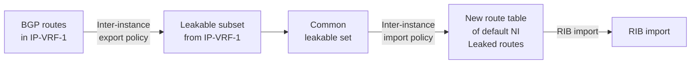

The following policy is configured to import the leaked BGP IPv4 route in the RIB-IN of the default network-instance:

```
# on PE-1:
enter candidate
    routing-policy {
          policy pol_import-BGP-routes-in-RIB {
           default-action {
                     policy-result reject
           }
           statement stmt-10 {
                     match {
                      protocol bgp
                     }
                     action {
                      policy-result accept
                     }
           }
          }
    }
    **network-instance default {**
          **protocols {**
           **bgp {**
                     **rib-management {**
                      **table ipv4-unicast {**
                            **route-table-import pol_import-BGP-routes-in-RIB**
                      **}**
                     **}**
           **}**
    }
```

When imported into the BGP RIB, the best leaked routes are advertised unless rejected by a peer export policy. PE-2 receives the following BGP routes from PE-1:

```
--{ + running }--[ ]--
A:admin@PE-2# show / network-instance default protocols bgp neighbor 192.0.2.1 received-routes
ipv4
-----------------------------------------------------------------------------------------------
----------------------------------------------------------------------------
Peer       : 192.0.2.1, remote AS: 64500, local AS: 64500
Type       : static
Description : None
Group      : IBGP_IPv4
-----------------------------------------------------------------------------------------------
----------------------------------------------------------------------------
Status codes: u=used, *=valid, >=best, x=stale, b=backup, w=unused-weight-only
Origin codes: i=IGP, e=EGP, ?=incomplete
+----------------------------------------------------------------------------------------------
-------------------------------------------------------------------------+
|         Status             Network           Path-id     Next Hop
MED                   LocPref             AsPath           Origin           |
+==============================================================================================
=========================================================================+
```

3HE 22247 AAAB TQZZA

**© 2026 Nokia.**

444

Use subject to Terms available at: [www.nokia.com/terms](http://www.nokia.com/terms).

Advanced Configuration Guide Release 26.7 Network-instance Route Leaking

```
u*> 192.168.90.2/32 0 192.0.2.1 - 0 [64501] i
u*> 192.168.90.3/32 0 192.0.2.1 - 0 [64501] i
u*> 192.168.90.4/30 0 192.0.2.1 - 0 [64501] i
3 received BGP routes : 3 used 3 valid
```

The route table for the default network-instance on PE-2 now includes the three advertised BGP routes, as follows:

```
--{ + running }--[ ]--
A:admin@PE-2# show / network-instance default ipv4 route
===============================================================================================
==============
IPv4-unicast route table for default network-instance
-----------------------------------------------------------------------------------------------
--------------
Flags: > (best), * (unviable), ! (failed)
      : L (leaked route from another network-instance)
      : B (backup NHG active and displayed)
      : S (statistics supported)
      : D (dynamic LB), R (resilient LB)
-----------------------------------------------------------------------------------------------
--------------
Prefix                 Route Type     Metric        Pref     Flags     Next-Hop(s)
-----------------------------------------------------------------------------------------------
--------------
192.0.2.1/32           isis           10             15      >         192.168.12.1(ethernet-1/1.1000)
192.168.12.0/30        local           0              0      >         192.168.12.2(ethernet-1/1.1000)
192.168.90.2/32        **bgp**            10            170      >         192.0.2.1(route:isis)
192.168.90.3/32        **bgp**            10            170      >         192.0.2.1(route:isis)
192.168.90.4/30        **bgp**            10            170      >         192.0.2.1(route:isis)
```

The following removes the RIB-management configuration:

```
enter candidate
      network-instance default {
           protocols {
           **bgp** {
                    delete rib-management
```

## 19.3.3.2 Re-advertise leaked BGP routes as IS-IS routes

When the leaked BGP routes are not imported in the RIB-IN, the leaked routes can be advertised using IS- IS. The following export policy accepts the leaked routes from IP-VRF-1 and is applied in the IS-IS instance 0, as follows:

```
# on PE-1:
enter candidate
routing-policy {
policy pol_re-advertise-routes-leaked-from-IP-VRF-1 {
             default-action {
```

3HE 22247 AAAB TQZZA **© 2026 Nokia.** 445
Use subject to Terms available at: [www.nokia.com/terms](http://www.nokia.com/terms).

Advanced Configuration Guide Release 26.7 Network-instance Route Leaking

```
policy-result reject
}
statement stmt-10 {
     match {
          **origin-network-instance IP-VRF-1**
          **network-instance-leaked-route true**
     }
     action {
          policy-result accept
     }
}
}
}
}
**network-instance default {**
     **protocols {**
          **isis {**
               **instance 0 {**
                    **export-policy pol_re-advertise-routes-leaked-from-IP-VRF-1**
```

The IS-IS export policy on PE-1 re-advertises the three leaked routes to the default network-instance on PE-2, so the route table on PE-2 includes these three prefixes:

<table>
<thead>
<tr><th>Prefix</th><th>Route Type</th><th>Metric</th><th>Pref</th><th>Flags</th><th>Next-Hop(s)</th></tr>
</thead>
<tbody>
<tr><td>192.0.2.1/32</td><td>isis</td><td>10</td><td>15</td><td>></td><td>192.168.12.1(ethernet-1/1.1000)</td></tr>
<tr><td>192.168.12.0/30</td><td>local</td><td>0</td><td>0</td><td>></td><td>192.168.12.2(ethernet-1/1.1000)</td></tr>
<tr><td>192.168.90.2/32</td><td>**isis**</td><td>10</td><td>160</td><td>></td><td>192.168.12.1(ethernet-1/1.1000)</td></tr>
<tr><td>192.168.90.3/32</td><td>**isis**</td><td>10</td><td>160</td><td>></td><td>192.168.12.1(ethernet-1/1.1000)</td></tr>
<tr><td>192.168.90.4/30</td><td>**isis**</td><td>10</td><td>160</td><td>></td><td>192.168.12.1(ethernet-1/1.1000)</td></tr>
</tbody>
</table>

The original configuration is restored by removing the export policy from IS-IS instance 0, as follows:

```
# on PE-1:
enter candidate
 network-instance default {
           protocols {
            isis {
                    instance 0 {
                      delete export-policy
```

Network-instance route leaking is disabled by removing the inter-instance-policies context from IP-VRF-1 and the default network-instance, as follows:

```
# on PE-1:
enter candidate
 network-instance IP-VRF-1 {
```

3HE 22247 AAAB TQZZA **© 2026 Nokia.** 446
Use subject to Terms available at: www.nokia.com/terms.

Advanced Configuration Guide Release 26.7 Network-instance Route Leaking

```
delete inter-instance-policies
}
network-instance default {
 delete inter-instance-policies
}
```

## 19.3.4 Example 3 - BGP IPv4 route leaking from default network-instance to IP-VRF

Figure 67: BGP IPv4 route leaking from default network-instance to IP-VRF shows the topology for this example, and the corresponding IP addresses. CE-11 exports routes such as 192.168.100.2/32 to the default network-instance and CE-12 exports routes such as 192.168.121.2/32 to the default network- instance. The routes are leaked from the default network-instance to IP-VRF-2 if matched by an import policy in the default network-instance of PE-1.

Figure 67: BGP IPv4 route leaking from default network-instance to IP-VRF

engineering_drawing: Network topology diagram showing PE-1 and PE-2 in a Service Provider Network (AS 64500) connected to CE-11 (AS 64501) and CE-12 (AS 64502) respectively, with IP addresses and VPRN/GRT labels.

25966

All EBGP routes are by default rejected unless policies are configured. The following import policy is applied in the default network-instance.

```
# on PE-1:
enter candidate
routing-policy {
as-path-set AS-64501-64502 {
    as-path-set-member [
```

3HE 22247 AAAB TQZZA 447
**© 2026 Nokia.**
Use subject to Terms available at: [www.nokia.com/terms](http://www.nokia.com/terms).

Advanced Configuration Guide Release 26.7    Network-instance Route Leaking

```
64501
64502
]
}
policy pol_import-bgp {
  statement stmt-10 {
      match {
           bgp {
               as-path {
                      as-path-set AS-64501-64502
               }
           }
      }
      action {
           policy-result accept
      }
  }
}
}
network-instance default {
        protocols {
          bgp {
              import-policy [
                   pol_import-bgp
              ]
```

The default network-instance in PE-1 includes BGP IPv4 routes learned from CE-11 and CE-12, as follows:

<table>
<thead>
<tr><th>Prefix</th><th>Route Type</th><th>Metric</th><th>Pref</th><th>Flags</th><th>Next-Hop(s)</th></tr>
</thead>
<tbody>
<tr><td>172.17.111.0/30</td><td>local</td><td>0</td><td>0</td><td>></td><td>172.17.111.1(ethernet-1/11.1000)</td></tr>
<tr><td>172.17.112.0/30</td><td>local</td><td>0</td><td>0</td><td>></td><td>172.17.112.1(ethernet-1/12.1000)</td></tr>
<tr><td>192.0.2.2/32</td><td>isis</td><td>10</td><td>15</td><td>></td><td>192.168.12.2(ethernet-1/2.1000)</td></tr>
<tr><td>192.168.12.0/30</td><td>local</td><td>0</td><td>0</td><td>></td><td>192.168.12.1(ethernet-1/2.1000)</td></tr>
<tr><td>192.168.100.2/32</td><td>bgp</td><td>0</td><td>170</td><td>></td><td>172.17.111.2(route:local)</td></tr>
<tr><td>192.168.100.3/32</td><td>bgp</td><td>0</td><td>170</td><td>></td><td>172.17.111.2(route:local)</td></tr>
<tr><td>192.168.100.4/30</td><td>bgp</td><td>0</td><td>170</td><td>></td><td>172.17.111.2(route:local)</td></tr>
<tr><td>192.168.121.2/32</td><td>bgp</td><td>0</td><td>170</td><td>></td><td>172.17.112.2(route:local)</td></tr>
<tr><td>192.168.121.3/32</td><td>bgp</td><td>0</td><td>170</td><td>></td><td>172.17.112.2(route:local)</td></tr>
<tr><td>192.168.121.4/30</td><td>bgp</td><td>0</td><td>170</td><td>></td><td>172.17.112.2(route:local)</td></tr>
</tbody>
</table>

On PE-1, the following policy accepts BGP routes and is applied as inter-instance export policy in the default network-instance:

```
# on PE-1:
enter candidate
routing-policy {
           policy pol_make-bgp-routes-leakable {
             default-action {
                    policy-result reject
             }
```

3HE 22247 AAAB TQZZA    **© 2026 Nokia.**    448
                        Use subject to Terms available at: www.nokia.com/terms.

Advanced Configuration Guide Release 26.7 Network-instance Route Leaking

```
statement stmt-10 {
   match {
         protocol bgp
   }
   action {
         policy-result accept
   }
}
}
**network-instance default {**
   **inter-instance-policies {**
    **apply-policy {**
       **export-policy [**
         **pol_make-bgp-routes-leakable**
       **]**
    **}**
   **}**
```

The routing table for the default network-instance shows that the BGP IPv4 routes are **leakable**:

<table>
<thead>
<tr><th>Prefix</th><th>Route Type</th><th>Metric</th><th>Pref</th><th>Flags</th><th>Next-Hop(s)</th></tr>
</thead>
<tbody>
<tr><td>192.168.100.2/32</td><td>bgp</td><td>0</td><td>170</td><td>></td><td>172.17.111.2(route:local)</td></tr>
<tr><td>192.168.100.3/32</td><td>bgp</td><td>0</td><td>170</td><td>></td><td>172.17.111.2(route:local)</td></tr>
<tr><td>192.168.100.4/30</td><td>bgp</td><td>0</td><td>170</td><td>></td><td>172.17.111.2(route:local)</td></tr>
<tr><td>192.168.121.2/32</td><td>bgp</td><td>0</td><td>170</td><td>></td><td>172.17.112.2(route:local)</td></tr>
<tr><td>192.168.121.3/32</td><td>bgp</td><td>0</td><td>170</td><td>></td><td>172.17.112.2(route:local)</td></tr>
<tr><td>192.168.121.4/30</td><td>bgp</td><td>0</td><td>170</td><td>></td><td>172.17.112.2(route:local)</td></tr>
</tbody>
</table>

The leakable BGP routes in the default network-instance can be imported into IP-VRF-2. The import policy is identical to the import policy in the preceding examples, as follows:

```
# on PE-1:
enter candidate
routing-policy {
           policy pol_import-leakable-routes {
            default-action {
               policy-result reject
            }
            statement stmt-10 {
               match {
                     protocol bgp
               }
               action {
                     policy-result accept
               }
```

3HE 22247 AAAB TQZZA 449
© 2026 Nokia.
Use subject to Terms available at: [www.nokia.com/terms](http://www.nokia.com/terms).

Advanced Configuration Guide Release 26.7 Network-instance Route Leaking

```
}
    }
}
**network-instance IP-VRF-2 {**
    **inter-instance-policies {**
        **apply-policy {**
            **import-policy [**
                **pol_import-leakable-routes**
            **]**
        **}**
    **}**
}
```

The following command shows the leaked BGP routes in IP-VRF-2. The source of these leaked routes is the default network-instance, not an IP-VRF.

```
--{ + running }--[ ]--
A:admin@PE-1# show network-instance IP-VRF-2 ipv4 route **leaked**
===============================================================================================
============================
IPv4-unicast route table for ip-vrf network-instance: IP-VRF-2
-----------------------------------------------------------------------------------------------
----------------------------
Flags: > (best), * (unviable), ! (failed)
        : L (leaked route from another network-instance)
        : B (backup NHG active and displayed)
        : S (statistics supported)
        : D (dynamic LB), R (resilient LB)
-----------------------------------------------------------------------------------------------
----------------------------
Prefix               Route Type     Metric   Pref     Flags     Next-Hop(s)
-----------------------------------------------------------------------------------------------
----------------------------
192.168.100.2/32     bgp            0        170      >L        172.17.111.2(**net-instance:default**,
route:local)
192.168.100.3/32     bgp            0        170      >L        172.17.111.2(**net-instance:default**,
route:local)
192.168.100.4/30     bgp            0        170      >L        172.17.111.2(**net-instance:default**,
route:local)
192.168.121.2/32     bgp            0        170      >L        172.17.112.2(**net-instance:default**,
route:local)
192.168.121.3/32     bgp            0        170      >L        172.17.112.2(**net-instance:default**,
route:local)
192.168.121.4/30     bgp            0        170      >L        172.17.112.2(**net-instance:default**,
route:local)
```

Any of these leaked BGP routes is leaked into IP-VRF-2 (**Leaked**: **from default**), whereas none of these BGP routes is leakable from IP-VRF-2 (Leakable: no), as follows for prefix 192.168.100.2/32:

```
--{ + running }--[ ]--
A:admin@PE-1# show network-instance IP-VRF-2 ipv4 route 192.168.100.2/32 detail
===============================================================================================
============================
Prefix: 192.168.100.2/32
-----------------------------------------------------------------------------------------------
----------------------------
Active                : yes
Route Type            : bgp
Route Owner           : bgp_mgr, 2026-04-29T13:49:24.484Z (2 minutes ago)
Id                    : 0
Leakable              : no
Leaked                : **from default**
Metric                : 0
```

3HE 22247 AAAB TQZZA 450
**© 2026 Nokia.**
Use subject to Terms available at: [www.nokia.com/terms](http://www.nokia.com/terms).

Advanced Configuration Guide Release 26.7 Network-instance Route Leaking

```
Preference            : 170
Internal Tags         : none
Dynamic LB            : no
Resilient Hash        : no
FIB Suppressed        : no
FIB Failed            : no
Next-Hop-Group        : 35659155
 Net-Instance         : default
 FIB Failed           : no
 Primary NH           : 35659148
  LB Weight           : 1
  Type                : indirect
  IP Address          : 172.17.111.2
  Resolved            : yes
  Resolving Route     : 172.17.111.0/30(local)
```

The leaked routes are re-advertised as BGP-IPVPN routes to IP-VRF-2 on PE-2, as follows:

<table>
<thead>
<tr><th>Prefix</th><th>Route Type</th><th>Metric</th><th>Pref</th><th>Flags</th><th>Next-Hop(s)</th></tr>
</thead>
<tbody>
<tr><td>172.16.2.1/32</td><td>**bgp-ipvpn**</td><td>10</td><td>170</td><td>></td><td>192.0.2.1(tunnel:ldp, label:30000)</td></tr>
<tr><td>172.16.12.0/30</td><td>local</td><td>0</td><td>0</td><td>></td><td>172.16.12.2(ethernet-1/1.2)</td></tr>
<tr><td>192.168.100.2/32</td><td>**bgp-ipvpn**</td><td>10</td><td>170</td><td>></td><td>192.0.2.1(tunnel:ldp, label:30000)</td></tr>
<tr><td>192.168.100.3/32</td><td>**bgp-ipvpn**</td><td>10</td><td>170</td><td>></td><td>192.0.2.1(tunnel:ldp, label:30000)</td></tr>
<tr><td>192.168.100.4/30</td><td>**bgp-ipvpn**</td><td>10</td><td>170</td><td>></td><td>192.0.2.1(tunnel:ldp, label:30000)</td></tr>
<tr><td>192.168.121.2/32</td><td>**bgp-ipvpn**</td><td>10</td><td>170</td><td>></td><td>192.0.2.1(tunnel:ldp, label:30000)</td></tr>
<tr><td>192.168.121.3/32</td><td>**bgp-ipvpn**</td><td>10</td><td>170</td><td>></td><td>192.0.2.1(tunnel:ldp, label:30000)</td></tr>
<tr><td>192.168.121.4/30</td><td>**bgp-ipvpn**</td><td>10</td><td>170</td><td>></td><td>192.0.2.1(tunnel:ldp, label:30000)</td></tr>
</tbody>
</table>

Again, the configuration is restored by removing the inter-instance-policies context from the default network-instance and the IP-VRF-2 network-instance:

```
# on PE-1:
enter candidate
  network-instance default {
            delete inter-instance-policies
  }
  network-instance IP-VRF-2 {
            delete inter-instance-policies
  }
```

3HE 22247 AAAB TQZZA 451
**© 2026 Nokia.**
Use subject to Terms available at: [www.nokia.com/terms](http://www.nokia.com/terms).

Advanced Configuration Guide Release 26.7    Network-instance Route Leaking

## 19.3.5 Example 4 - BGP IPv6 route leaking between IP-VRFs

Figure 68: BGP IPv6 route leaking between IP-VRFs shows the topology and the IP addresses used for this example. CE-11 exports routes such as 2001:db8:90::2/128 to IP-VRF-1 on PE-1, and CE-12 exports routes such as 2001:db8:120::2/128 to IP-VRF-1 on PE-1.

Figure 68: BGP IPv6 route leaking between IP-VRFs

engineering_drawing: BGP IPv6 route leaking topology diagram

25968

The following export policy is applied in the inter-instance-policies context of IP-VRF-1:

```
# on PE-1:
enter candidate
 routing-policy {
  policy pol_make-bgp-routes-leakable {
          statement stmt-10 {
               match {
                protocol bgp
               }
               action {
                policy-result accept
               }
          }
  }
 }
 network-instance IP-VRF-1 {
  inter-instance-policies {
```

3HE 22247 AAAB TQZZA    © 2026 Nokia.    452
                        Use subject to Terms available at: [www.nokia.com/terms](http://www.nokia.com/terms).

Advanced Configuration Guide Release 26.7 Network-instance Route Leaking

```
**apply-policy {**
 **export-policy [**
 **pol_make-bgp-routes-leakable**
 **]**
**}**
```

The following IPv6 route table includes three BGP routes exported by CE-11 and three BGP routes exported by CE-12:

<table>
<tr><td>2001:db8::90:2/128</td><td>bgp</td><td>0</td><td>170</td><td>></td><td>2001:db8::16:111:2(route:local)</td></tr>
<tr><td>2001:db8::90:3/128</td><td>bgp</td><td>0</td><td>170</td><td>></td><td>2001:db8::16:111:2(route:local)</td></tr>
<tr><td>2001:db8::90:4/126</td><td>bgp</td><td>0</td><td>170</td><td>></td><td>2001:db8::16:111:2(route:local)</td></tr>
<tr><td>2001:db8::120:2/128</td><td>bgp</td><td>0</td><td>170</td><td>></td><td>2001:db8::16:112:2(route:local)</td></tr>
<tr><td>2001:db8::120:3/128</td><td>bgp</td><td>0</td><td>170</td><td>></td><td>2001:db8::16:112:2(route:local)</td></tr>
<tr><td>2001:db8::120:4/126</td><td>bgp</td><td>0</td><td>170</td><td>></td><td>2001:db8::16:112:2(route:local)</td></tr>
<tr><td>2001:db8::16:111:0/126</td><td>local</td><td>0</td><td>0</td><td>></td><td>2001:db8::16:111:1(ethernet-1/11.1)</td></tr>
<tr><td>2001:db8::16:112:0/126</td><td>local</td><td>0</td><td>0</td><td>></td><td>2001:db8::16:112:1(ethernet-1/12.1)</td></tr>
</table>

The following command shows that all the received BGP IPv6 routes are marked as **leakable** from IP-VRF-1:

<table>
<tr><td>2001:db8::90:2/128</td><td>bgp</td><td>0</td><td>170</td><td>></td><td>2001:db8::16:111:2(route:local)</td></tr>
<tr><td>2001:db8::90:3/128</td><td>bgp</td><td>0</td><td>170</td><td>></td><td>2001:db8::16:111:2(route:local)</td></tr>
<tr><td>2001:db8::90:4/126</td><td>bgp</td><td>0</td><td>170</td><td>></td><td>2001:db8::16:111:2(route:local)</td></tr>
<tr><td>2001:db8::120:2/128</td><td>bgp</td><td>0</td><td>170</td><td>></td><td>2001:db8::16:112:2(route:local)</td></tr>
<tr><td>2001:db8::120:3/128</td><td>bgp</td><td>0</td><td>170</td><td>></td><td>2001:db8::16:112:2(route:local)</td></tr>
<tr><td>2001:db8::120:4/126</td><td>bgp</td><td>0</td><td>170</td><td>></td><td>2001:db8::16:112:2(route:local)</td></tr>
</table>


SPACER TEXT

3HE 22247 AAAB TQZZA 453
**© 2026 Nokia.**
Use subject to Terms available at: [www.nokia.com/terms](http://www.nokia.com/terms).

Advanced Configuration Guide Release 26.7 <span style="float: right;">Network-instance Route Leaking</span>

The BGP leakable routes can be imported into IP-VRF-2 when the following import policy is configured and applied in IP-VRF-2:

```
# on PE-1:
enter candidate
 routing-policy {
           policy pol_import-leakable-routes {
            default-action {
               policy-result reject
            }
            statement stmt-10 {
               match {
                    protocol bgp
               }
               action {
                    policy-result accept
               }
            }
           }
 }
 **network-instance IP-VRF-2 {**
           **inter-instance-policies {**
            **apply-policy {**
               **import-policy [**
                    **pol_import-leakable-routes**
               **]**
```

The following command shows that IP-VRF-2 is importing the leaked BGP IPv6 routes from IP-VRF-1:

<table>
<thead>
<tr><th>Prefix</th><th>Route Type</th><th>Metric</th><th>Pref</th><th>Flags</th><th>Next-Hop(s)</th></tr>
</thead>
<tbody>
<tr><td>2001:db8::90:2/128</td><td>bgp</td><td>0</td><td>170</td><td>>L</td><td>2001:db8::16:111:2(net‐instance:IP‐**VRF-1**, route:local)</td></tr>
<tr><td>2001:db8::90:3/128</td><td>bgp</td><td>0</td><td>170</td><td>>L</td><td>2001:db8::16:111:2(net‐instance:IP‐**VRF-1**, route:local)</td></tr>
<tr><td>2001:db8::90:4/126</td><td>bgp</td><td>0</td><td>170</td><td>>L</td><td>2001:db8::16:111:2(net‐instance:IP‐**VRF-1**, route:local)</td></tr>
<tr><td>2001:db8::120:2/128</td><td>bgp</td><td>0</td><td>170</td><td>>L</td><td>2001:db8::16:112:2(net‐instance:IP‐**VRF-1**, route:local)</td></tr>
<tr><td>2001:db8::120:3/128</td><td>bgp</td><td>0</td><td>170</td><td>>L</td><td>2001:db8::16:112:2(net‐instance:IP‐**VRF-1**, route:local)</td></tr>
<tr><td>2001:db8::120:4/126</td><td>bgp</td><td>0</td><td>170</td><td>>L</td><td>2001:db8::16:112:2(net‐instance:IP‐**VRF-1**, route:local)</td></tr>
</tbody>
</table>

3HE 22247 AAAB TQZZA <span style="float: right;">**© 2026 Nokia.** 454</span>
Use subject to Terms available at: [www.nokia.com/terms](http://www.nokia.com/terms).

Advanced Configuration Guide Release 26.7 <span style="float: right;">Network-instance Route Leaking</span>

The BGP routes are leaked into IP-VRF-2 (**Leaked**: **from IP-VRF-1**) while they are not leakable from IP-VRF-2 (Leakable: no), as follows:

```
--{ + running }--[ ]--
A:admin@PE-1# show network-instance IP-VRF-2 ipv6 route 2001:db8::90:2/128 detail
=========================================================================================
Prefix: 2001:db8::90:2/128
-----------------------------------------------------------------------------------------
Active                  : yes
Route Type              : bgp
Route Owner             : bgp_mgr, 2026-05-06T12:38:07.390Z (a minute ago)
Id                      : 0
Leakable                : no
Leaked                  : from IP-VRF-1
Metric                  : 0
Preference              : 170
Internal Tags           : none
Dynamic LB              : no
Resilient Hash          : no
FIB Suppressed          : no
FIB Failed              : no
Next-Hop-Group          : 1232896477
 Net-Instance           : IP-VRF-1
 FIB Failed             : no
 Primary NH             : 1232896474
       LB Weight        : 1
       Type             : indirect
       IP Address       : 2001:db8::16:111:2
       Resolved         : yes
       Resolving Route  : 2001:db8::16:111:0/126(local)
```

## 19.3.6 **Example 5 - BGP IPv6 route leaking from default network-instance and from IP-VRF** **to IP-VRF**

Figure 69: BGP IPv6 route leaking from default network-instance and IP-VRF to IP-VRF shows the topology and the IPv6 addresses used in this example. CE-11 exports IPv6 routes such as 2001:db8:90::2/128 to IP-VRF-1 and IPv6 routes such as 2001:db8:100::2/128 to the default network-instance. CE-12 exports IPv6 routes such as 2001:db8:120::2/128 to IP-VRF-1 and IPv6 routes such as 2001:db8:121::2/128 to the default network-instance.

3HE 22247 AAAB TQZZA <span style="float: right;">**© 2026 Nokia.** 455</span>
Use subject to Terms available at: [www.nokia.com/terms](http://www.nokia.com/terms).

Advanced Configuration Guide Release 26.7    Network-instance Route Leaking

Figure 69: BGP IPv6 route leaking from default network-instance and IP-VRF to IP-VRF

diagram: BGP IPv6 route leaking network diagram

25969

The inter-instance export policy to mark BGP routes as leakable can be identical to the policy used in the preceding examples. However, in this case, prefix-lists are added as a filter. IP-VRF-1 may export routes such as 2001:db8:90::2/128 and 2001:db8:120::2/128 as leakable with the following configuration:

```
# on PE-1:
enter candidate
routing-policy {
 prefix-set ps-ipv6-120 {
          prefix 2001:db8::120:0/120 mask-length-range 120..128 {
          }
 }
 prefix-set ps-ipv6-90 {
          prefix 2001:db8::90:0/120 mask-length-range 120..128 {
          }
 }
 policy pol_IP-VRF-1_IPv6_90_120_leakable {
          default-action {
                  policy-result reject
          }
          statement stmt-10 {
                  match {
                    protocol bgp
                    prefix {
                         prefix-set ps-ipv6-90
                    }
                  }
                  action {
                    policy-result accept
                  }
```

3HE 22247 AAAB TQZZA    456
**© 2026 Nokia.**
Use subject to Terms available at: [www.nokia.com/terms](http://www.nokia.com/terms).

Advanced Configuration Guide Release 26.7 Network-instance Route Leaking

```
}
statement stmt-20 {
     match {
          protocol bgp
          prefix {
             prefix-set ps-ipv6-120
          }
     }
     action {
          policy-result accept
     }
}
}
}
**network-instance IP-VRF-1 {**
     **inter-instance-policies {**
        **apply-policy {**
             **export-policy [**
                  **pol_IP-VRF-1_IPv6_90_120_leakable**
             **]**
        }
}
```

In a similar way, the default network-instance may export routes such as 2001:8db:100::2/128 as leakable:

```
# on PE-1:
enter candidate
 routing-policy {
       prefix-set ps-ipv6-100 {
          prefix 2001:db8::100:0/120 mask-length-range 120..128 {
          }
       }
       policy pol_base_IPv6_100_leakable {
          default-action {
               policy-result reject
          }
          statement stmt-10 {
               match {
                    protocol bgp
                    prefix {
                       prefix-set ps-ipv6-100
                    }
               }
               action {
                    policy-result accept
               }
          }
       }
 }
 **network-instance default {**
       inter-instance-policies {
          apply-policy {
               export-policy [
                    **pol_base_IPv6_100_leakable**
               ]
          }
       }
 }
```

The IPv6 routing table in the default network-instance contains routes exported by CE-11 and CE-12, as follows:

```
--{ + running }--[  ]--
```

3HE 22247 AAAB TQZZA 457
**© 2026 Nokia.**
Use subject to Terms available at: [www.nokia.com/terms](http://www.nokia.com/terms).

Advanced Configuration Guide Release 26.7    Network-instance Route Leaking

```
A:admin@PE-1# show / network-instance default ipv6 route
===============================================================================================
=================================
IPv6-unicast route table for default network-instance
-----------------------------------------------------------------------------------------------
---------------------------------
Flags: > (best), * (unviable), ! (failed)
    : L (leaked route from another network-instance)
    : B (backup NHG active and displayed)
    : S (statistics supported)
    : D (dynamic LB), R (resilient LB)
-----------------------------------------------------------------------------------------------
---------------------------------
Prefix                Route Type     Metric  Pref     Flags     Next-Hop(s)
-----------------------------------------------------------------------------------------------
---------------------------------
2001:db8::2:2/128     isis           10      15       >         fe80::201:2ff:feff:0(ethernet-1/
2.1000)
2001:db8::12:0/126    local          0       0        >         2001:db8::12:1(ethernet-1/2.1000)
2001:db8::100:2/12    bgp            0       170      >         2001:db8::17:111:2(route:local)
8
2001:db8::100:3/12    bgp            0       170      >         2001:db8::17:111:2(route:local)
8
2001:db8::100:4/12    bgp            0       170      >         2001:db8::17:111:2(route:local)
6
2001:db8::121:2/12    bgp            0       170      >         2001:db8::17:112:2(route:local)
8
2001:db8::121:3/12    bgp            0       170      >         2001:db8::17:112:2(route:local)
8
2001:db8::121:4/12    bgp            0       170      >         2001:db8::17:112:2(route:local)
6
2001:db8::17:111:0    local          0       0        >         2001:db8::17:111:1(ethernet-1/
11.1000)
/126
2001:db8::17:112:0    local          0       0        >         2001:db8::17:112:1(ethernet-1/
12.1000)
/126
```

The IPv6 routing table for IP-VRF-1 contains other routes exported by CE-11 and CE-12, as follows:

```
--{ + running }--[    ]--
A:admin@PE-1# show / network-instance IP-VRF-1 ipv6 route
===============================================================================================
=================================
IPv6-unicast route table for ip-vrf network-instance: IP-VRF-1
-----------------------------------------------------------------------------------------------
---------------------------------
Flags: > (best), * (unviable), ! (failed)
    : L (leaked route from another network-instance)
    : B (backup NHG active and displayed)
    : S (statistics supported)
    : D (dynamic LB), R (resilient LB)
-----------------------------------------------------------------------------------------------
---------------------------------
Prefix                Route Type     Metric  Pref     Flags     Next-Hop(s)
-----------------------------------------------------------------------------------------------
---------------------------------
2001:db8::90:2/128    bgp            0       170      >         2001:db8::16:111:2(route:local)
2001:db8::90:3/128    bgp            0       170      >         2001:db8::16:111:2(route:local)
2001:db8::90:4/126    bgp            0       170      >         2001:db8::16:111:2(route:local)
2001:db8::120:2/12    bgp            0       170      >         2001:db8::16:112:2(route:local)
8
2001:db8::120:3/12    bgp            0       170      >         2001:db8::16:112:2(route:local)
```

3HE 22247 AAAB TQZZA    **© 2026 Nokia.**    458
                        Use subject to Terms available at: [www.nokia.com/terms](http://www.nokia.com/terms).

Advanced Configuration Guide Release 26.7 Network-instance Route Leaking

```
8 2001:db8::120:4/12 bgp 0 170 > 2001:db8::16:112:2(route:local)
6 2001:db8::16:111:0 local 0 0 > 2001:db8::16:111:1(ethernet-1/11.1) /126
2001:db8::16:112:0 local 0 0 > 2001:db8::16:112:1(ethernet-1/12.1) /126
```

The following command shows which routes are marked as **leakable** in the default network-instance:

```
--{ + candidate shared default }--[ ]-- A:admin@PE-1# show network-instance default ipv6 route **leakable**
===============================================================================================
=================================
IPv6-unicast route table for default network-instance
-----------------------------------------------------------------------------------------------
---------------------------------
Flags: > (best), * (unviable), ! (failed)
    : L (leaked route from another network-instance)
    : B (backup NHG active and displayed)
    : S (statistics supported)
    : D (dynamic LB), R (resilient LB)
-----------------------------------------------------------------------------------------------
---------------------------------
Prefix              Route Type     Metric   Pref     Flags     Next-Hop(s)
-----------------------------------------------------------------------------------------------
---------------------------------
2001:db8::100:2/12  bgp            0        170      >         2001:db8::17:111:2(route:local)
8
2001:db8::100:3/12  bgp            0        170      >         2001:db8::17:111:2(route:local)
8
2001:db8::100:4/12  bgp            0        170      >         2001:db8::17:111:2(route:local)
6
```

The following command shows which routes are marked as **leakable** in IP-VRF-1:

```
--{ + candidate shared default }--[ ]-- A:admin@PE-1# show network-instance IP-VRF-1 ipv6 route **leakable**
===============================================================================================
=================================
IPv6-unicast route table for ip-vrf network-instance: IP-VRF-1
-----------------------------------------------------------------------------------------------
---------------------------------
Flags: > (best), * (unviable), ! (failed)
    : L (leaked route from another network-instance)
    : B (backup NHG active and displayed)
    : S (statistics supported)
    : D (dynamic LB), R (resilient LB)
-----------------------------------------------------------------------------------------------
---------------------------------
Prefix              Route Type     Metric   Pref     Flags     Next-Hop(s)
-----------------------------------------------------------------------------------------------
---------------------------------
2001:db8::90:2/128  bgp            0        170      >         2001:db8::16:111:2(route:local)
2001:db8::90:3/128  bgp            0        170      >         2001:db8::16:111:2(route:local)
2001:db8::90:4/126  bgp            0        170      >         2001:db8::16:111:2(route:local)
2001:db8::120:2/12  bgp            0        170      >         2001:db8::16:112:2(route:local)
8
2001:db8::120:3/12  bgp            0        170      >         2001:db8::16:112:2(route:local)
8
2001:db8::120:4/12  bgp            0        170      >         2001:db8::16:112:2(route:local)
6
```

3HE 22247 AAAB TQZZA 459 **© 2026 Nokia.**
Use subject to Terms available at: [www.nokia.com/terms.](http://www.nokia.com/terms.)

Advanced Configuration Guide Release 26.7 Network-instance Route Leaking

On PE-1, a policy is created to import the BGP leakable routes (the same as in the preceding examples) and applied as inter-instance import policy in IP-VRF-2, as follows:

```
# on PE-1:
enter candidate
 routing-policy {
           policy pol_import-leakable-routes {
            default-action {
               policy-result reject
            }
            statement stmt-10 {
               match {
                    protocol bgp
               }
               action {
                    policy-result accept
               }
            }
           }
 }
 **network-instance IP-VRF-2 {**
           **inter-instance-policies {**
            **apply-policy {**
               **import-policy [**
                    **pol_import-leakable-routes**
               **]**
            **}**
           **}**
 }
```

The following command shows the leaked IPv6 routes in IP-VRF-2:

```
--{ + running }--[ ]--
A:admin@PE-1# show network-instance IP-VRF-2 ipv6 route **leaked**
===============================================================================================
=================================
IPv6-unicast route table for ip-vrf network-instance: IP-VRF-2
-----------------------------------------------------------------------------------------------
---------------------------------
Flags: > (best), * (unviable), ! (failed)
  : L (leaked route from another network-instance)
  : B (backup NHG active and displayed)
  : S (statistics supported)
  : D (dynamic LB), R (resilient LB)
-----------------------------------------------------------------------------------------------
---------------------------------
Prefix              Route Type      Metric    Pref     Flags       Next-Hop(s)
-----------------------------------------------------------------------------------------------
---------------------------------
2001:db8::90:2/128  bgp             0         170      >L          2001:db8::16:111:2(net-instance:IP-**VRF-1**, route:local)
2001:db8::90:3/128  bgp             0         170      >L          2001:db8::16:111:2(net-instance:IP-**VRF-1**, route:local)
2001:db8::90:4/126  bgp             0         170      >L          2001:db8::16:111:2(net-instance:IP-**VRF-1**, route:local)
2001:db8::100:2/12  bgp             0         170      >L          2001:db8::17:111:2(net-**instance:default**, route:local)
8
2001:db8::100:3/12  bgp             0         170      >L          2001:db8::17:111:2(net-**instance:default**, route:local)
8
2001:db8::100:4/12  bgp             0         170      >L          2001:db8::17:111:2(net-**instance:default**, route:local)
6
```

3HE 22247 AAAB TQZZA 460
**© 2026 Nokia.**
Use subject to Terms available at: [www.nokia.com/terms](http://www.nokia.com/terms).

Advanced Configuration Guide Release 26.7    Network-instance Route Leaking

```
2001:db8::120:2/12 bgp 0 170 >L 2001:db8::16:112:2(net‐instance:IP‐ **VRF-1**, route:local) 8
2001:db8::120:3/12 bgp 0 170 >L 2001:db8::16:112:2(net‐instance:IP‐ **VRF-1**, route:local) 8
2001:db8::120:4/12 bgp 0 170 >L 2001:db8::16:112:2(net‐instance:IP‐ **VRF-1**, route:local) 6
```

Some of these routes are leaked from the default network-instance and other routes are leaked from IP- **VRF-1**. The detailed information for route 2001:db8:100::2/128 shows that the route is leaked from the default network-instance, as follows:

```
--{ + running }--[ ]-- A:admin@PE-1# show network-instance IP-VRF-2 ipv6 route 2001:db8::100:2/128 detail
===============================================================================================
=================================
Prefix: 2001:db8::100:2/128
-----------------------------------------------------------------------------------------------
---------------------------------
Active                   : yes
Route Type               : bgp
Route Owner              : bgp_mgr, 2026-05-06T11:28:13.830Z (6 minutes ago)
Id                       : 0
Leakable                 : no
**Leaked**                   : **from default**
Metric                   : 0
Preference               : 170
Internal Tags            : none
Dynamic LB               : no
Resilient Hash           : no
FIB Suppressed           : no
FIB Failed               : no
Next-Hop-Group           : 37108882
 Net-Instance            : default
 FIB Failed              : no
 Primary NH              : 37108874
       LB Weight         : 1
       Type              : indirect
       IP Address        : 2001:db8::17:111:2
       Resolved          : yes
       Resolving Route   : 2001:db8::17:111:0/126(local)
```

Route 2001:db8:90::2/128 is leaked from IP- **VRF-1**, as follows:

```
--{ + running }--[ ]-- A:admin@PE-1# show network-instance IP-VRF-2 ipv6 route 2001:db8::90:2/128 detail
===============================================================================================
=================================
Prefix: 2001:db8::90:2/128
-----------------------------------------------------------------------------------------------
---------------------------------
Active                   : yes
Route Type               : bgp
Route Owner              : bgp_mgr, 2026-05-06T11:29:06.693Z (7 minutes ago)
Id                       : 0
Leakable                 : no
**Leaked**                   : **from IP-VRF-1**
Metric                   : 0
Preference               : 170
Internal Tags            : none
```

3HE 22247 AAAB TQZZA    **© 2026 Nokia.**    461
                        Use subject to Terms available at: [www.nokia.com/terms](http://www.nokia.com/terms).

Advanced Configuration Guide Release 26.7    Network-instance Route Leaking

```
Dynamic LB       : no
Resilient Hash   : no
FIB Suppressed   : no
FIB Failed       : no
Next-Hop-Group   : 37108883
Net-Instance     : IP-VRF-1
FIB Failed       : no
Primary NH       : 37108875
LB Weight        : 1
Type             : indirect
IP Address       : 2001:db8::16:111:2
Resolved         : yes
Resolving Route  : 2001:db8::16:111:0/126(local)
```

## 19.4 Conclusion

In these examples, BGP IPv4/IPv6 routes learned from BGP neighbors could be marked as leakable and imported into other network instances (IP-VRF to IP-VRF, IP-VRF to default network-instance, default network-instance to IP-VRF) without the use of communities in the routing policies.

3HE 22247 AAAB TQZZA    **© 2026 Nokia.**    462
Use subject to Terms available at: [www.nokia.com/terms](http://www.nokia.com/terms).

Advanced Configuration Guide Release 26.7 Security hardening using CPM filters

# 20 Security hardening using CPM filters

Protecting the control and management plane of each routing switch in the data center fabric (access leaf, border leaf, spine) from unauthorized or out-of-profile sources of traffic is important. Without control plane protection policies, routers are vulnerable to attacks on the data center infrastructure and performance degradation can occur because of misconfiguration.

The SR Linux supports a special Access Control List (ACL) type called a cpm-filter for control plane protection. There are separate Control Processing Module (CPM) filters for IPv4 traffic and for IPv6 traffic. The entries of each cpm-filter are installed on each line card and in the Control CPM software. There are different types of cpm-filter actions that can be applied and all actions are not relevant at all locations. ACL configuration for control plane protection defines each action and how to configure it.

## 20.1 ACL configuration for control plane protection

ACLs support the following actions:

* accept - Allows the packet through to the next processing function.

* drop - Discards the packet without Internet Control Message Protocol (ICMP) generation.

* log - Extracts information about each matching packet and sends it to the log application.

* distributed-policer - Sends the packet to a policer instance implemented in the forwarding ASIC of the ingress line card. This policer sends the packet to the CPM only if the policer token bucket does not go into the exceed/violate state. The rate of a distributed-policer is defined in units of kb/s and the bucket depth is defined in units of bytes.

* system-cpu-policer - Sends the packet to a policer instance implemented by CPM software when the packet reaches the CPM from any line card as source. This policer admits the packet to its owner application only if the policer token bucket does not go into the exceed/violate state. The rate of a system-cpu-policer is defined in units of packets-per-second and the bucket depth is defined in units of packets.

## 20.1.1 CPM filter rules

CPM filter rules that apply a system-cpu-policer or distributed-policer action do not directly specify the policer parameters. Instead, the rules refer to a generically defined policer under the ACL configuration tree. This allows different CPM filter entries, even across multiple ACLs, to use the same policer if needed. Optionally, each policer can be configured as entry-specific. This means that a different policer instance is used by each referring filter entry, even if they are part of the same ACL.

CPM filter ACL actions are applied to the following traffic flows:

* IPv4 and IPv6 traffic flows originating by external systems, arriving on any line card port, accepted by the interface ACLs applied to the ingress subinterface (if any), system ACLs applied globally, and determined to be locally terminating by lookup of the IP destination address

* IPv4 and IPv6 traffic flows originating by external systems, arriving on the Out-of-Band (OOB) management port and accepted by the interface ACLs applied to ingress traffic on the OOB port

3HE 22247 AAAB TQZZA **© 2026 Nokia.** 463
Use subject to Terms available at: [www.nokia.com/terms](http://www.nokia.com/terms).

Advanced Configuration Guide Release 26.7 Security hardening using CPM filters

subinterface, and system ACLs applied globally. If the CPM-filter policy has distributed-policer actions, these are ignored for inbound traffic on the OOB management port.

The startup configuration of a new SR Linux router includes a default IPv4 cpm-filter policy and a default IPv6 cpm-filter policy. These default policies block packets associated with any protocol that is not supported by the SR Linux operating system. However, they do not limit the sending sources or enforce any rate limits aside from ICMPv4/ICMPv6 traffic, which is subject to an aggregate rate limit of 1000 pps. The default policies should be modified to add these additional restrictions, and to allow protocols associated with NetOps Development Kit (NDK) applications, if applicable.

## 20.1.2 Restricting source subnets for incoming traffic using CPM filter

### Procedure

Use the **acl cpm-filter** command to define how to restrict the source subnets for incoming SSH traffic associated with remotely originated TCP connections to a specified IP address.

### Example: (IPv4 address of 192.0.2.0/24)

```
--{ candidate shared default }--[ ]--
# **acl cpm-filter ipv4-filter**
--{ candidate shared default }--[ acl cpm-filter ipv4-filter ]--
# **entry 100 match**
--{ candidate shared default }--[ acl cpm-filter ipv4-filter entry 100 match ]--
# **source-ip address 192.0.2.0 mask 255.255.255.0**
--{ * candidate shared default }--[ acl cpm-filter ipv4-filter entry 100 match ]--
# **protocol tcp destination-port value ssh**
--{ * candidate shared default }--[ acl cpm-filter ipv4-filter entry 100 match ]--
# **exit**
--{ * candidate shared default }--[ acl cpm-filter ipv4-filter entry 100 ]--
# **action drop**
--{ * candidate shared default }--[ acl cpm-filter ipv4-filter entry 100 ]--
# **exit all**
--{    candidate shared default }--[  ]--
# **info acl cpm-filter ipv4-filter entry 100**
     acl {
       cpm-filter {
          ipv4-filter {
             entry 100 {
                 description "Restrict the source subets 192.0.2.0/24 for incoming SSH
Traffic"
                 action {
                   drop {
                   }
                 }
                 match {
                   protocol tcp
                   source-ip {
                        address 192.0.2.0
                        mask 255.255.255.0
                   }
                   destination-port {
                        value ssh
                   }
                 }
             }
          }
       }
     }
```

3HE 22247 AAAB TQZZA © 2026 Nokia. 464
Use subject to Terms available at: [www.nokia.com/terms](http://www.nokia.com/terms).

Advanced Configuration Guide Release 26.7    Security hardening using CPM filters

**Example: (IPv6 address of 2001:db8:3200/48)**

```
--{  candidate shared default }--[  ]--
# **acl cpm-filter ipv6-filter entry 140**
--{ candidate shared default }--[ acl cpm-filter ipv6-filter entry 140]--
# **match next-header tcp destination-port value ssh operator eq**
--{ candidate shared default }--[ acl cpm-filter ipv6-filter entry 140]--
# **match source-ip address 2001:db8::1 mask FFFF:FFFF:FFFF:FFF8:FFFF:FFFF:FFFF:FFFF**
--{ candidate shared default }--[ acl cpm-filter ipv6-filter entry 140]--
# **action drop**
--{ candidate shared default }--[ acl cpm-filter ipv6-filter entry 140]--
# **exit all**
--{  candidate shared default }--[  ]--
# **info acl cpm-filter ipv6-filter entry 140**
     acl {
     cpm-filter {
          ipv6-filter {
             entry 140 {
              description "Restrict the source subets 2001:db8:32::/48 for incoming
SSH Traffic"
              action {
                 drop {
                 }
              }
              match {
                 next-header tcp
                 source-ip {
                        address 2001:db8::1
                        mask ffff:ffff:ffff:fff8:ffff:ffff:ffff:ffff
                 }
                 destination-port {
                        operator eq
                        value ssh
                 }
              }
             }
          }
     }
     }
```


SPACER TEXT

3HE 22247 AAAB TQZZA    465    **© 2026 Nokia.**
                        Use subject to Terms available at: [www.nokia.com/terms](http://www.nokia.com/terms).

Advanced Configuration Guide Release 26.7 Segment Routing – Traffic Engineered Tunnels

# 21 Segment Routing – Traffic Engineered Tunnels

This chapter provides information about Segment Routing – Traffic Engineered Tunnels.

Topics in this chapter include:

* Applicability
* Overview
* Configuration
* Conclusion

## 21.1 Applicability

The CLI in the current edition corresponds to SR Linux Release 25.10.R2.

## 21.2 Overview

Segment Routing (SR) is described in the Segment Routing with IS-IS Control Plane chapter, where the advertisement of node prefix segment identifiers (SIDs) cause the automatic creation of ECMP-aware shortest path MPLS tunnels on each SR-aware router. Each node prefix SID is a globally unique value and becomes an MPLS label in the MPLS data plane. The label is advertised and learned by each SR-capable router using control plane extensions to the IS-IS protocol.

It is also possible to create source-routed traffic-engineered (TE) end-to-end segment routing paths, where routing constraints such as strict or loose hops can be used to determine a data path to be taken through a network.

These SR-TE Label Switched Paths (LSPs) are implemented as uncolored SR-MPLS TE policies. The path can be computed locally by the head-end PE or by offloading the path computation to an external controller. The intermediate and tail-end router are unaware of the presence of an SR-TE LSP because there is no signaling protocol used to create the path. If a packet is forwarded through the SR tunnel, each router along the path reads the top label and forwards the packet according to the SR tunnel table entry for that label.

This chapter describes the configuration of uncolored SR-MPLS TE policies with locally-computed source-routed paths and how they can be used in the data plane of Layer 2 and Layer 3 services. In the cases described, an uncolored SR-MPLS TE policy containing an explicit path with a number of strict or loose hops is created at the head-end router and used to construct an SR-TE LSP by translating the IP addresses configured in the MPLS path to a SID. This results in an MPLS path with state at the head end only, comprising a stack of SIDs, where each SID is an MPLS label.

In this chapter, IS-IS is used to advertise the SIDs and a set of extensions to IS-IS have been defined, which require additional configuration on each network router.

The LSP is instantiated—the state is operationally "up"—and a tunnel table entry is created that is owned by the te-policy-sr-mpls-uncolored protocol. Any data packet that is resolved to use the resulting tunnel has

3HE 22247 AAAB TQZZA **© 2026 Nokia.** 466
Use subject to Terms available at: [www.nokia.com/terms](http://www.nokia.com/terms).

Advanced Configuration Guide Release 26.7 Segment Routing – Traffic Engineered Tunnels

the label stack imposed at the head-end router and is forwarded out of the appropriate next-hop interface. This interface is determined by the topmost label in the stack.

If the label is a node SID, the outgoing interface is determined by the IGP—the shortest path to the router that the node SID represents.

If the label is a local adjacency SID, the outgoing interface is the local interface for which this SID is generated by the IGP.

The segments referenced can be a prefix segment, such as a node segment or an adjacency segment, which represents a specific adjacency between two nodes. The SIDs are used as MPLS labels.

In the following configuration examples, the LSP path is created at the head-end router, and computed by translating a list of hops containing IP addresses into a list of SIDs, by examining the IS-IS TE database. The head-end router is referred to as a Path Computation Client (PCC). Figure 70: Segment routing network schematic shows the example topology used, and a pair of bidirectional connected SR-TE LSPs between PCC-1 and PCC-2 is configured to illustrate SR-TE LSPs. All interfaces between PCC-1 and its neighbors have the IS-IS metric set to 100. Similarly, for PCC-2, the IGP metric is also set to 100 between itself and its neighbors. The IS-IS metric on router interfaces between the core routers P-3, P-4, PE-5, and PE-6 is 10.

*Figure 70: Segment routing network schematic*

diagram: Segment routing network schematic

## 21.3 Configuration

### 21.3.1 MPLS label ranges

MPLS label ranges for adjacency SIDs and node SIDs must be configured. The Segment Routing Global Block (SRGB) is the MPLS label range from which node SIDs are allocated. The Segment Routing Local Block (SRLB) is the MPLS label range from which dynamic adjacency SIDs are allocated. In this example, a range of 1000 labels is chosen for the SRGB and another range of 1000 labels is chosen for the SRLB. For operational simplicity, Nokia recommends that the same MPLS label ranges are chosen for each

3HE 22247 AAAB TQZZA 467 © 2026 Nokia.
Use subject to Terms available at: www.nokia.com/terms.

Advanced Configuration Guide Release 26.7 Segment Routing – Traffic Engineered Tunnels

SR-capable router. However, this is not an explicit requirement. On all nodes, the SRGB and SRLB are configured as follows:

```
# on all nodes:
enter candidate
      system {
       mpls {
       label-ranges {
               static srgb-static-mpls {          # SRGB for node SIDs
                       shared true
                       start-label 32000
                       end-label 32999
               }
               dynamic srlb-dynamic-mpls {        # SRLG for adjacency SIDs
                       start-label 525000
                       end-label 525999
               }
```

When the SRGB and SRLB label ranges have been configured, the MPLS label ranges can be verified as follows:

```
--{ + running }--[     ]--
A:admin@PCC-1# info from state with-context / system mpls label-ranges static * | as table |
filter fields *
+-----------------------------------------+--------+-------------+-----------+-----------------+-------------+----------------+
|                    Name                | Shared | Start-label | End-label | Allocated-labels | Free-labels |         Status    |
+=========================================+========+=============+===========+=================+=============+================+
| srgb-static-mpls                       | true   |   32000 |   32999 |                           0 |      1000 | ready               |
+-----------------------------------------+--------+-------------+-----------+-----------------+-------------+----------------+
--{ + running }--[     ]--
A:admin@PCC-1# info from state with-context / system mpls label-ranges dynamic * | as table |
filter fields *
+--------------------------------------------------+-------------+-----------+-----------------+-------------+----------------+
|                         Name                    | Start-label | End-label | Allocated-labels | Free-labels |         Status     |
+==================================================+=============+===========+=================+=============+================+
| srlb-dynamic-mpls                               |   525000 |   525999 |                         0 |      1000 | ready                |
+--------------------------------------------------+-------------+-----------+-----------------+-------------+----------------+
```

### 21.3.2 SR-ISIS configuration

The first step is to configure a single-level IS-IS instance on each router, as follows:

```
# on PCC-1:
network-instance default {
protocols {
           isis {
```

3HE 22247 AAAB TQZZA 468
**© 2026 Nokia.**
Use subject to Terms available at: [www.nokia.com/terms](http://www.nokia.com/terms).

Advanced Configuration Guide Release 26.7 Segment Routing – Traffic Engineered Tunnels

```
instance 0 {
     admin-state enable
     level-capability L2
     net [
      49.0000.1920.0000.2001.00
     ]
     interface ethernet-1/5.1 {
      admin-state enable
      circuit-type point-to-point
      level 2 {
                     metric 100
      }
     }
     interface ethernet-1/6.1 {
      admin-state enable
      circuit-type point-to-point
      level 2 {
                     metric 100
      }
     }
     interface system0.0 {
     }
     level 2 {
     }
}
```

The configuration for all other nodes is similar, with different values for net, interfaces, and IGP metrics, as can be derived from Figure 70: Segment routing network schematic.

For each router to be segment-routing capable, additional configuration is required. On PCC-1, segment routing is configured as follows:

```
# on PCC-1:
network-instance default {
 protocols {
           isis {
            dynamic-label-block srlb-dynamic-mpls        ## SRLB for adj SIDs
            instance 0 {
                 segment-routing {
                  mpls {
                                 dynamic-adjacency-sids {
                                  all-interfaces true
                                 }
                  }
                 }
            }
           }
 }
 segment-routing {
           mpls {
            global-block {
                 label-range srgb-static-mpls            ## SRGB for node SIDs
            }
            local-prefix-sid 1 {
                 interface system0.0
                 ipv4-label-index 1        ## index 2 on PCC-2, 3 on P-3, 4 on P-4...
                 node-sid true
            }
}
```

The node SID is manually configured as an index. With the SRGB label base equal to 32000 and the IPv4 label index 1 on PCC-1, the node SID for PCC-1 is 32000 + 1 = 32001.

3HE 22247 AAAB TQZZA 469 **© 2026 Nokia.**
Use subject to Terms available at: [www.nokia.com/terms](http://www.nokia.com/terms).

Advanced Configuration Guide Release 26.7 Segment Routing – Traffic Engineered Tunnels

The following output taken from PCC-1 shows the prefix SIDs configured on the routers in the network and advertised using IS-IS.

```
--{ + running }--[ ]--
A:admin@PCC-1# info from state network-instance default segment-routing mpls sid-database
      prefix-sid **192.0.2.1/32** sid-label-value **32001** protocol direct protocol-instance 0 protocol-
multi-topology 0 algorithm 0 {
       active true
      }
      prefix-sid **192.0.2.2/32** sid-label-value **32002** protocol isis protocol-instance 0 protocol-
multi-topology 0 algorithm 0 {
       active true
      }
      prefix-sid **192.0.2.3/32** sid-label-value **32003** protocol isis protocol-instance 0 protocol-
multi-topology 0 algorithm 0 {
       active true
      }
      prefix-sid **192.0.2.4/32** sid-label-value **32004** protocol isis protocol-instance 0 protocol-
multi-topology 0 algorithm 0 {
       active true
      }
      prefix-sid **192.0.2.5/32** sid-label-value **32005** protocol isis protocol-instance 0 protocol-
multi-topology 0 algorithm 0 {
       active true
      }
      prefix-sid **192.0.2.6/32** sid-label-value **32006** protocol isis protocol-instance 0 protocol-
multi-topology 0 algorithm 0 {
       active true
      }
```

The output is similar for all routers in the network.

Adjacency SIDs are assigned to each interface link.

The following tunnel table shows 7 SR-ISIS tunnels: one to each other system IP prefix with tunnel ID equal to the node SID and one to each adjacency with tunnel ID equal to the adjacency SID. For each destination prefix, the tunnel table indicates the next hop and the interface via which it is reached, as well as the end-to-end metric for the tunnel.

<table>
<thead>
<tr><th>IPv4 Prefix</th><th>Tunnel Type</th><th>Tunnel ID</th><th>FIB</th><th>Metric</th><th>Preference</th><th>Last Update</th><th>Backup Nexthops</th><th>Next-hop</th></tr>
</thead>
<tbody>
<tr><td></td><td></td><td></td><td></td><td></td><td></td><td></td><td></td><td></td></tr>
</tbody>
</table>

3HE 22247 AAAB TQZZA 470 **© 2026 Nokia.**
Use subject to Terms available at: [www.nokia.com/terms](http://www.nokia.com/terms).

Advanced Configuration Guide Release 26.7 Segment Routing – Traffic Engineered Tunnels

```
| 192.0.2.2/32 | sr-isis | **32002** | Y | 210 | 11 |
| 2026-02-17T13:02:35.444Z | | 192.168.15.2 (mpls) | ethernet-1/5.1 |
| 192.0.2.3/32 | sr-isis | **32003** | Y | 110 | 11 |
| 2026-02-17T13:02:42.972Z | | 192.168.16.2 (mpls) | ethernet-1/6.1 |
| 192.0.2.4/32 | sr-isis | **32004** | Y | 110 | 11 |
| 2026-02-17T13:02:49.544Z | | 192.168.15.2 (mpls) | ethernet-1/5.1 |
| 192.0.2.5/32 | sr-isis | **32005** | Y | 100 | 11 |
| 2026-02-17T13:02:56.175Z | | 192.168.15.2 (mpls) | ethernet-1/5.1 |
| 192.0.2.6/32 | sr-isis | **32006** | Y | 100 | 11 |
| 2026-02-17T13:03:04.667Z | | 192.168.16.2 (mpls) | ethernet-1/6.1 |
| 192.168.15.2/32 | sr-isis | **525000** | Y | 0 | 11 |
| 2026-02-17T12:51:42.019Z | | 192.168.15.2 (mpls) | ethernet-1/5.1 |
| 192.168.16.2/32 | sr-isis | **525001** | Y | 0 | 11 |
| 2026-02-17T12:51:42.019Z | | 192.168.16.2 (mpls) | ethernet-1/6.1 |
```

7 SR-ISIS tunnels, 7 active, 0 inactive

On PCC-1, the adjacency SID for the interface toward PE-5 is **525000**, and the adjacency SID for the interface toward PE-6 is **525001**.

An overview of the SIDs for the whole network is shown in Figure 71: Node and adjacency SIDs.

Figure 71: Node and adjacency SIDs

diagram: Node and adjacency SIDs

3HE 22247 AAAB TQZZA **© 2026 Nokia.** 471
Use subject to Terms available at: www.nokia.com/terms.

Advanced Configuration Guide Release 26.7 Segment Routing – Traffic Engineered Tunnels

## 21.3.3 **Uncolored SR-MPLS TE policies**

This section describes uncolored SR-MPLS TE policies that are configured on the head-end router (the PCC). The path taken through the network is computed locally by the PCC. To influence the path taken, a series of strict and loose hops is configured in an MPLS path.

icon: note
**Note:**

SR-TE LSPs configured without an explicit path is effectively a shortest path tunnel to the destination node. The destination address is resolved to the node SID of the tail-end router.

Traffic engineering must be configured on the nodes. The TE configuration on PCC-1 is as follows:

```
# on PCC-1:
network-instance default {
 protocols {
           isis {
            instance 0 {
                 admin-state enable
                 te-database-install {
                 }
                 traffic-engineering {
                  advertisement true
                  legacy-link-attribute-advertisement false
                  ipv4-te-router-id 192.0.2.1
                 }
            }
           }
 }
 traffic-engineering {
           ipv4-te-router-id 192.0.2.1
           interface ethernet-1/5.1 {
            interface-ref {
                 interface ethernet-1/5
                 subinterface 1
            }
           }
           interface ethernet-1/6.1 {
            interface-ref {
                 interface ethernet-1/6
                 subinterface 1
            }
           }
```

The TE configuration on the other nodes is similar, with different router ID and interfaces.

## 21.3.4 **PCC-initiated and computed LSP – explicit path with strict hops**

Consider an uncolored SR-MPLS TE policy configured on PCC-1, with tail end at PCC-2. Assume there is a requirement for the LSP to avoid the link from PE-5 to P-4 during normal working, so a strict path from PCC-1 via PE-5 to PE-6, and then on to P-3 is required before being forwarded to PCC-2. This is shown in Figure 72: Explicit path with strict hops from PCC-1 to PCC-2.

3HE 22247 AAAB TQZZA **© 2026 Nokia.** 472
Use subject to Terms available at: [www.nokia.com/terms](http://www.nokia.com/terms).

Advanced Configuration Guide Release 26.7    Segment Routing – Traffic Engineered Tunnels

Figure 72: Explicit path with strict hops from PCC-1 to PCC-2

```mermaid
graph LR
    PCC1["PCC-1<br/>32001<br/>192.0.2.1/32"]
    PE5["PE-5<br/>32005<br/>192.0.2.5/32"]
    P4["P-4<br/>32004<br/>192.0.2.4/32"]
    PCC2["PCC-2<br/>32002<br/>192.0.2.2/32"]
    PE6["PE-6<br/>32006<br/>192.0.2.6/32"]
    P3["P-3<br/>32003<br/>192.0.2.3/32"]

    PCC1 --> PE5
    PE5 --> P4
    P4 --> PCC2
    PCC1 --> PE6
    PE6 --> P3
    P3 --> PCC2
```

26383

To meet these requirements, an explicit path is configured containing the following strict hops, using the system addresses to identify the hops. The following configures an uncolored SR-MPLS TE policy using the explicit path:

```
# on PCC-1:
network-instance default {
    traffic-engineering-policies {
        explicit-paths {
            path **PCC-controlled-strict-path** {
                hop 10 {
                    ip {
                        ip-address 192.0.2.5
                        hop-type strict
                    }
                }
                hop 20 {
                    ip {
                        ip-address 192.0.2.6
                        hop-type strict
                    }
                }
                hop 30 {
                    ip {
                        ip-address 192.0.2.3
                        hop-type strict
                    }
                }
            }
        }
        policy pol_strict-to-PCC-2 {
            policy-type sr-mpls-uncolored
            admin-state enable
            endpoint 192.0.2.2
            segment-list 1 {
                admin-state enable
                explicit-path **PCC-controlled-strict-path**
                segment-list-type primary
            }
        }
    }
}
```

3HE 22247 AAAB TQZZA    473
**© 2026 Nokia.**
Use subject to Terms available at: [www.nokia.com/terms](http://www.nokia.com/terms).

Advanced Configuration Guide Release 26.7 Segment Routing – Traffic Engineered Tunnels

`}`

The following shows the segments in segment list 1 of the uncolored SR-MPLS TE policy "pol_strict-to- PCC-2" with adjacency SIDs for the three strict hops in the explicit path and a node SID for the loose hop to the destination hop of 192.0.2.2:

<table>
<thead>
<tr><th>Network-instance</th><th>Policy policy-name</th><th>Policy protocol-origin</th><th>Segment-list</th><th>Segment-index</th><th>Ip-address</th><th>Router-id</th><th>Is-loose</th><th>Sid-type</th><th>Sid-value mpls-label</th></tr>
</thead>
<tbody>
<tr><td>default</td><td>pol_strict-to-PCC-2</td><td>local</td><td>1</td><td>1</td><td>**192.168.15.2**</td><td>**192.0.2.5**</td><td>**false**</td><td>**adjacency-sid**</td><td>**525000**</td></tr>
<tr><td>default</td><td>pol_strict-to-PCC-2</td><td>local</td><td>1</td><td>2</td><td>**192.168.56.2**</td><td>**192.0.2.6**</td><td>**false**</td><td>**adjacency-sid**</td><td>**525002**</td></tr>
<tr><td>default</td><td>pol_strict-to-PCC-2</td><td>local</td><td>1</td><td>3</td><td>**192.168.36.1**</td><td>**192.0.2.3**</td><td>**false**</td><td>**adjacency-sid**</td><td>**525001**</td></tr>
<tr><td>default</td><td>pol_strict-to-PCC-2</td><td>local</td><td>1</td><td>4</td><td>**192.0.2.2**</td><td>**192.0.2.2**</td><td>**true**</td><td>**node-sid**</td><td>**32002**</td></tr>
</tbody>
</table>

The head-end router PCC-1 uses the SIDs as MPLS labels. The node SIDs and adjacency SIDs are shown in Figure 73: PCC computed segment list hop-to-label translation.

3HE 22247 AAAB TQZZA 474 © 2026 Nokia.
Use subject to Terms available at: [www.nokia.com/terms](http://www.nokia.com/terms).

Advanced Configuration Guide Release 26.7 Segment Routing – Traffic Engineered Tunnels

Figure 73: PCC computed segment list hop-to-label translation

diagram: PCC computed segment list hop-to-label translation

When the uncolored SR-MPLS TE policy is connected, the Tunnel Table Manager (TTM) adds an entry of type **te-policy-sr-mpls-uncolored**. This tunnel is available for the provisioning of services that use the TTM. The following output shows the tunnel table for PCC-1, which includes the shortest-path tunnels to all other routers in the network, plus the entry for the provisioned uncolored SR-MPLS TE policy. The default preference for an uncolored SR-MPLS TE policy in the tunnel table is 8.

```
--{ + running }--[ ]--
A:admin@PCC-1# show network-instance default tunnel-table ipv4
-----------------------------------------------------------------------------------------------
-----------------------------------------------------------------------------------------------
----------------------------------------
IPv4 tunnel table of network-instance "default"
-----------------------------------------------------------------------------------------------
-----------------------------------------------------------------------------------------------
----------------------------------------
```

<table>
<thead>
<tr><th>IPv4 Prefix</th><th>Tunnel Type</th><th>Tunnel ID</th><th>FIB</th><th>Metric</th><th>Preference</th><th>Last Update</th><th>Backup Nexthops / Next-hop (Type)</th></tr>
</thead>
<tbody>
<tr><td>**192.0.2.2/32**</td><td>sr-isis</td><td>32002</td><td>Y</td><td>210</td><td>11</td><td>2026-02-17T13:02:35.444Z</td><td>192.168.15.2 (mpls)<br />ethernet-1/5.1</td></tr>
<tr><td>**192.0.2.2/32**</td><td>**te-policy-sr-**<br />**mpls-uncolored**</td><td>1</td><td>Y</td><td>220</td><td>8</td><td>2026-02-17T13:15:17.526Z</td><td>192.168.15.2/32 (sr-<br />isis)<br />ethernet-1/5.1</td></tr>
</tbody>
</table>


</page_footer>

<page_footer>3HE 22247 AAAB TQZZA © 2026 Nokia. 475
Use subject to Terms available at: [www.nokia.com/terms](http://www.nokia.com/terms).

Advanced Configuration Guide Release 26.7

Advanced Configuration Guide Release 26.7 Segment Routing – Traffic Engineered Tunnels

Figure 74: Explicit path with loose hops from PCC-2 to PCC-1

engineering_drawing: network diagram showing PCC-1, PCC-2, PE-5, PE-6, P-3, and P-4 nodes with loose path indicators

Figure 74: Explicit path with loose hops from PCC-2 to PCC-1 shows the concept of the loose path. The following configures the MPLS path containing a loose hop on PCC-2:

```
# on PCC-2:
     network-instance default {
     traffic-engineering-policies {
           explicit-paths {
            path PCC-controlled-loose-path {
             hop 10 {
              ip {
               ip-address 192.0.2.6
               hop-type loose
              }
             }
            }
           }
```

The following uncolored SR-MPLS TE policy references the explicit path with loose hops as the primary path:

```
# on PCC-2:
     network-instance default {
     traffic-engineering-policies {
           policy pol_loose-to-PCC-1 {
            policy-type sr-mpls-uncolored
            admin-state enable
            endpoint 192.0.2.1
            segment-list 1 {
             admin-state enable
             explicit-path **PCC-controlled-loose-path**
             segment-list-type primary
            }
           }
```

3HE 22247 AAAB TQZZA **© 2026 Nokia.** 477
Use subject to Terms available at: [www.nokia.com/terms](http://www.nokia.com/terms).

Advanced Configuration Guide Release 26.7 Segment Routing – Traffic Engineered Tunnels

The following shows the segments in segment list 1 of uncolored SR-MPLS TE policy "pol_loose-to- PCC-1":

<table>
<thead>
<tr><th>Network-instance</th><th>Policy policy-name</th><th>Policy protocol-origin</th><th>Segment-list</th><th>Segment-index</th><th>Ip-address</th><th>Router-id</th><th>Is-loose</th><th>Sid-type</th><th>Sid-value mpls-label</th></tr>
<tr><th>Network-instance</th><th>Policy policy-name</th><th>Policy protocol-origin</th><th>Segment-list</th><th>Segment-index</th><th>Ip-address</th><th>Router-id</th><th>Is-loose</th><th>Sid-type</th><th>Sid-value mpls-label</th></tr>
</thead>
<tbody>
<tr><td>default</td><td>pol_loose-to-PCC-1</td><td>local</td><td>1</td><td>1</td><td>**192.0.2.6**</td><td>**192.0.2.6**</td><td>**true**</td><td>**node-sid**</td><td>**32006**</td></tr>
<tr><td>default</td><td>pol_loose-to-PCC-1</td><td>local</td><td>1</td><td>2</td><td>**192.0.2.1**</td><td>**192.0.2.1**</td><td>**true**</td><td>**node-sid**</td><td>**32001**</td></tr>
</tbody>
</table>

The first segment corresponds to the configured loose hop **192.0.2.6** and the second segment to the hop for the destination **192.0.2.1**.

The head-end node PCC-2 translates the configured hop addresses into labels by examining the IS-IS TE database. The hop-to-label translation translates loose hops to node SIDs (N-SIDs).

The uncolored SR-MPLS TE policy is installed by the TTM into the tunnel table, alongside SR-ISIS advertised shortest path tunnels, for use by the TTM users, as follows:

<table>
<thead>
<tr><th colspan="10">IPv4 tunnel table of network-instance "default"</th></tr>
<tr><th>IPv4 Prefix</th><th>Tunnel Type</th><th>Tunnel ID</th><th>FIB</th><th>Metric</th><th>Preference</th><th>Last Update</th><th>Backup Nexthops</th><th>Next-hop (Type)</th><th>Next-hop</th></tr>
</thead>
<tbody>
<tr><td>192.0.2.1/32</td><td>sr-isis</td><td>**32001**</td><td>Y</td><td>210</td><td>11</td><td>2026-02-17T13:02:25.153Z</td><td></td><td>192.168.23.2 (mpls)</td><td>ethernet-1/3.1</td></tr>
</tbody>
</table>

478 3HE 22247 AAAB TQZZA © 2026 Nokia.
Use subject to Terms available at: www.nokia.com/terms.

Advanced Configuration Guide Release 26.7 Segment Routing - Traffic Engineered Tunnels

<table>
<tr><td>**192.0.2.1/32**</td><td>**te-policy-sr-**</td><td>1</td><td>Y</td><td>210</td><td>8</td><td>2026-02-17T13:15:46.827Z</td><td>192.0.2.6/32 (sr-isis) <br /> ethernet-1/3.1</td></tr>
<tr><td></td><td>**mpls-uncolored**</td><td></td><td></td><td></td><td></td><td></td><td></td></tr>
<tr><td>192.0.2.3/32</td><td>sr-isis</td><td>32003</td><td>Y</td><td>100</td><td>11</td><td>2026-02-17T13:02:42.969Z</td><td>192.168.23.2 (mpls) <br /> ethernet-1/3.1</td></tr>
<tr><td>192.0.2.4/32</td><td>sr-isis</td><td>32004</td><td>Y</td><td>100</td><td>11</td><td>2026-02-17T13:02:49.491Z</td><td>192.168.24.2 (mpls) <br /> ethernet-1/4.1</td></tr>
<tr><td>192.0.2.5/32</td><td>sr-isis</td><td>32005</td><td>Y</td><td>110</td><td>11</td><td>2026-02-17T13:02:56.281Z</td><td>192.168.24.2 (mpls) <br /> ethernet-1/4.1</td></tr>
<tr><td>192.0.2.6/32</td><td>sr-isis</td><td>32006</td><td>Y</td><td>110</td><td>11</td><td>2026-02-17T13:03:04.725Z</td><td>192.168.23.2 (mpls) <br /> ethernet-1/3.1</td></tr>
<tr><td>192.168.23.2/32</td><td>sr-isis</td><td>525000</td><td>Y</td><td>0</td><td>11</td><td>2026-02-17T12:55:06.803Z</td><td>192.168.23.2 (mpls) <br /> ethernet-1/3.1</td></tr>
<tr><td>192.168.24.2/32</td><td>sr-isis</td><td>525001</td><td>Y</td><td>0</td><td>11</td><td>2026-02-17T12:55:06.803Z</td><td>192.168.24.2 (mpls) <br /> ethernet-1/4.1</td></tr>
</table>

7 SR-ISIS tunnels, 7 active, 0 inactive
1 TE-POLICY-SR-MPLS-UNCOLORED tunnels, 1 active, 0 inactive

## 21.3.5.1 Layer 3 service provisioning - IP-VRF

Uncolored SR-MPLS TE policy tunnels are another MPLS tunnel type, and can be used for resolving BGP next hops for IPv4 routes within an IP-VRF.

3HE 22247 AAAB TQZZA 479 **© 2026 Nokia.**
Use subject to Terms available at: [www.nokia.com/terms](http://www.nokia.com/terms).

Advanced Configuration Guide Release 26.7    Segment Routing – Traffic Engineered Tunnels

Figure 75: IP-VRF service schematic

```mermaid
graph LR
    PE5["PE-5<br/>32005<br/>192.0.2.5/32"]
    P4["P-4<br/>32004<br/>192.0.2.4/32"]
    PCC1["IP-VRF-1<br/>PCC-1<br/>Lo0<br/>32001<br/>172.31.1.1<br/>192.0.2.1/32"]
    PCC2["IP-VRF-1<br/>PCC-2<br/>Lo0<br/>32002<br/>172.16.2.1<br/>192.0.2.2/32"]
    PE6["PE-6<br/>32006<br/>192.0.2.6/32"]
    P3["P-3<br/>32003<br/>192.0.2.3/32"]

    PCC1 --> PE5
    PE5 --> P4
    P4 --> PCC2
    PCC1 --> PE6
    PE6 --> P3
    P3 --> PCC2
```

26386

Figure 75: IP-VRF service schematic shows an IP-VRF service, configured on PCC-1 and PCC-2. The following configures the IP-VRF 1 on PCC-1. It includes a local interface using a /32 loopback address to be used to verify that routing is working correctly. The configuration on PCC-2 is similar.

```
# on PCC-1:
network-instance "default" {
  protocols {
           bgp {
            admin-state enable
            autonomous-system 64496
            router-id 192.0.2.1            # on PCC-2: router-id 192.0.2.2
            afi-safi l3vpn-ipv4-unicast {
                admin-state enable
            }
            group "IBGP" {
                admin-state enable
                peer-as 64496
            }
            neighbor 192.0.2.2 {           # on PCC-2: neighbor 192.0.2.1
                admin-state enable
                peer-group "IBGP"
            }
           }
  }
 }
 system {
  mpls {
           label-ranges {
            dynamic dynamic-services {     # label range for services
                start-label 10000
                end-label 19999
            }
           }
           services {
            network-instance {
                dynamic-label-block dynamic-services
            }
           }
```


SPACER TEXT

3HE 22247 AAAB TQZZA    **© 2026 Nokia.**    480
Use subject to Terms available at: [www.nokia.com/terms](http://www.nokia.com/terms).

Advanced Configuration Guide Release 26.7    Segment Routing – Traffic Engineered Tunnels

```
   }
  }
  interface lo0 {
   admin-state enable
   subinterface 0 {
    admin-state enable
    description "loopback interface in ip-vrf"
    ipv4 {
                 admin-state enable
                 address 172.31.1.1/32 {     # on PCC-2: 172.16.1.2/32
                     primary
                 }
    }
   }
  }
  network-instance "ip-vrf-1" {
   type ip-vrf
   admin-state enable
   interface lo0.0 {
    interface-ref {
                 interface lo0
                 subinterface 0
    }
   }
   protocols {
    bgp-ipvpn {
                 bgp-instance 1 {
                     admin-state enable
                     mpls {
                        next-hop-resolution {
                           **allowed-tunnel-types [**
                                **te-policy-sr-mpls-uncolored**
                           ]
                        }
                     }
                 }
    }
    bgp-vpn {
                 bgp-instance 1 {
                     route-distinguisher {
                        rd 192.0.2.1:1          # on PCC-2: rd 192.0.2.2:1
                     }
                     route-target {
                        export-rt target:64496:1
                        import-rt target:64496:1
                     }
                 }
    }
```

The **network-instance "ip-vrf-1" protocols bgp-ipvpn bgp-instance 1 mpls next-hop-resolution** **allowed-tunnel-types** is set to **te-policy-sr-mpls-uncolored**, so that any BGP routes received have the next-hop resolved to an uncolored SR-MPLS TE policy LSP.

Examination of the IP-VRF route table on PCC-1 shows that the route prefix representing the IP address of the loopback address configured in IP-VRF 1 on PCC-2 is shown, and is resolved via the te-policy-sr-mpls- uncolored tunnel.

```
 --{ + running }--[  ]--
 A:admin@PCC-1# show network-instance "ip-vrf-1" route-table
 -----------------------------------------------------------------------------------------------
 -----------------------------------------------------------------------------------------------
 ---------------------------------------------------------------------------------------------
```

3HE 22247 AAAB TQZZA    **© 2026 Nokia.**    481
                        Use subject to Terms available at: [www.nokia.com/terms](http://www.nokia.com/terms).

Advanced Configuration Guide Release 26.7 Segment Routing – Traffic Engineered Tunnels

```
IPv4 unicast route table of network instance ip-vrf-1
-----------------------------------------------------------------------------------------------
-----------------------------------------------------------------------------------------------
---------------------------------------------------------------------------------------------
+---------------------------------------------+-------+------------+----------------------+----
------+----------+---------+------------+---------------------------+--------------------------
-+---------------------------+---------------------------+
|                          Prefix                         | ID    | Route Type |        Route Owner     |
     Active | Origin | Metric |                 Pref       |         Next-hop (Type)         |   Next-hop Interface
               | Backup Next-hop (Type)         | Backup Next-hop Interface |
|                                                         |       |               |                     |
               | Network |            |              |                                     |
         |                                |                                 |
|                                                         |       |               |                     |
               | Instance |           |              |                                     |
         |                                |                                 |
|                                                         |       |               |                     |
+=============================================+=======+============+======================+====
======+==========+=========+============+===========================+==========================
=+===========================+===========================+
| 172.16.1.2/32                                           | 0     | bgp-ipvpn     | bgp_ipvpn_mgr       |
     True            | ip-vrf-1 | 220       | 170          | 192.0.2.2/32                    |
               |                              |                                  |
|                                                         |       |               |                     |
               |         |            |              | (indirect/te-policy-sr-             |
         |                                |                                 |
|                                                         |       |               |                     |
               |         |            |                    | mpls-uncolored)               |
         |                                |                                 |
| 172.31.1.1/32                                           | 5     | host          | net_inst_mgr        |
     True            | ip-vrf-1 | 0         | 0            | None                            | None
               |                              |                                  |
+---------------------------------------------+-------+------------+----------------------+----
------+----------+---------+------------+---------------------------+--------------------------
-+---------------------------+---------------------------+
-----------------------------------------------------------------------------------------------
-----------------------------------------------------------------------------------------------
---------------------------------------------------------------------------------------------
IPv4 routes total                              : 2
IPv4 prefixes with active routes               : 2
IPv4 prefixes with active ECMP routes: 0
-----------------------------------------------------------------------------------------------
-----------------------------------------------------------------------------------------------
---------------------------------------------------------------------------------------------
```

Connectivity is verified by sending a ping from the loopback interface within IP-VRF 1 on PCC-1 to the loopback address within IP-VRF 1 on PCC-2, as follows:

```
--{ + running }--[         ]--
A:admin@PCC-1# ping network-instance ip-vrf-1 172.16.1.2 -c 2
Using network instance ip-vrf-1
PING 172.16.1.2 (172.16.1.2) 56(84) bytes of data.
64 bytes from 172.16.1.2: icmp_seq=1 ttl=64 time=40.8 ms
64 bytes from 172.16.1.2: icmp_seq=2 ttl=64 time=49.3 ms
--- 172.16.1.2 ping statistics ---
2 packets transmitted, 2 received, 0% packet loss, time 1002ms
rtt min/avg/max/mdev = 40.837/45.051/49.265/4.214 ms
```

3HE 22247 AAAB TQZZA 482 **© 2026 Nokia.**
Use subject to Terms available at: [www.nokia.com/terms](http://www.nokia.com/terms).

Advanced Configuration Guide Release 26.7 Segment Routing – Traffic Engineered Tunnels

For completeness, a ping is sent in the opposite direction, between the PCC-2 IP-VRF 1 interface to PCC-1 IP-VRF 1, as follows:

```
--{ + running }--[ ]-- A:admin@PCC-2# ping network-instance ip-vrf-1 172.31.1.1 -c 2
Using network instance ip-vrf-1
PING 172.31.1.1 (172.31.1.1) 56(84) bytes of data.
64 bytes from 172.31.1.1: icmp_seq=1 ttl=64 time=48.8 ms
64 bytes from 172.31.1.1: icmp_seq=2 ttl=64 time=48.3 ms
--- 172.31.1.1 ping statistics ---
2 packets transmitted, 2 received, 0% packet loss, time 1001ms
rtt min/avg/max/mdev = 48.277/48.514/48.752/0.237 ms
```

### 21.3.5.2 Layer 2 service provisioning – VPWS

Uncolored SR-MPLS TE policy tunnels can also be bound as a transport tunnel within pseudowires. To illustrate this, consider the following example of a simple VPWS connected between PCC-1 and PCC-2, as shown in Figure 76: VPWS service schematic.

Figure 76: VPWS service schematic

```mermaid
graph LR
    PE5["PE-5<br/>32005"]
    P4["P-4<br/>32004"]
    PCC1["PCC-1<br/>32001<br/>192.0.2.1/32"]
    PCC2["PCC-2<br/>32002<br/>192.0.2.2/32"]
    PE6["PE-6<br/>32006"]
    P3["P-3<br/>32003"]

    PE5 --> P4
    PCC1 --> PCC2
    PE6 --> P3
    PCC1 --> PE5
    PCC1 --> PE6
    PCC2 --> P4
    PCC2 --> P3
```

The pseudowires use T-LDP signaling, so an MPLS label range must be configured for LDP signaling, as follows:

```
# on all nodes:
system {
        mpls {
        label-ranges {
               dynamic dynamic-ldp {
                start-label 70000
                end-label 79999
               }
               dynamic dynamic-services {   # same range as for IP-VRF
                start-label 10000
```

3HE 22247 AAAB TQZZA 483
**© 2026 Nokia.**
Use subject to Terms available at: [www.nokia.com/terms](http://www.nokia.com/terms).

Advanced Configuration Guide Release 26.7    Segment Routing – Traffic Engineered Tunnels

```
end-label 19999
            }
           }
           services {
            network-instance {
                dynamic-label-block dynamic-services
            }
           }
  }
 }
 network-instance default {
  protocols {
           ldp {
            admin-state enable
            dynamic-label-block dynamic-ldp
           }
```

The following shows the configuration of a PW on PCC-1 with far end on PCC-2 that can bind to an uncolored SR-MPLS TE policy. On PCC-2, a similar PW is configured.

```
# on PCC-1:
 tunnel {
  pseudowire-tunnel {
           tunnel pw-tunnel-PCC-1-PCC-2 { # on PCC-2: tunnel pw-tunnel-PCC-2-PCC-1
            remote-system 192.0.2.2        # on PCC-2: remote-system 192.0.2.1
            allowed-tunnel-types [
                te-policy-sr-mpls-uncolored
            ]
           }
  }
 }
```

The following VPWS is configured on PCC-1:

```
# on PCC-1:
 network-instance VPWS-2 {
  type vpws
  admin-state enable
  interface ethernet-1/9.1 {
           connection-point A
  }
  connection-point A {
  }
  connection-point B {
           pseudowire pw-PCC-1-PCC-2 {       # on PCC-2: pw-PCC-2-PCC-1
            admin-state enable
            pw-tunnel pw-tunnel-PCC-1-PCC-2  # on PCC-2: pw-tunnel-PCC-2-PCC-1
            signaling {
                virtual-circuit-identifier 2 # must match on PCC-1 and PCC-2
                tldp {
                }
            }
           }
  }
```

3HE 22247 AAAB TQZZA    **© 2026 Nokia.**    484
                        Use subject to Terms available at: [www.nokia.com/terms](http://www.nokia.com/terms).

Advanced Configuration Guide Release 26.7    Segment Routing – Traffic Engineered Tunnels

### 21.3.5.3 Service verification

The following T-LDP session is established:

```
--{ + running }--[ ]--
A:admin@PCC-1# show network-instance default protocols ldp session
===============================================================================================
==============================
Net-Inst default LDP Sessions
----------------------------------------------------------------------
-----------------------------+
+----------------------------------------------------------------------------------------------
-----------------------------+
| Peer LDP ID                  State            Adjacenc          Msg Sent       Msg Recv
Last Oper State Change          |
|                                               y Type
                                              |
+==============================================================================================
=============================+
| 192.0.2.2:0                  operational      targeted          7              7
2026-02-17T13:42:32.037Z        |
+----------------------------------------------------------------------------------------------
-----------------------------+
No. of sessions: 1
===============================================================================================
==============================
```

The following PW tunnel information is retrieved on PCC-1:

```
--{ + running }--[ ]--
A:admin@PCC-1# info from state / tunnel pseudowire-tunnel tunnel *
      tunnel pw-tunnel-PCC-1-PCC-2 {
       remote-system 192.0.2.2
       operational-tunnel-type te-policy-sr-mpls-uncolored
       operational-tunnel-id 1
       allowed-tunnel-types [
             te-policy-sr-mpls-uncolored
       ]
      }
```

On PCC-1, the following output shows that VPWS-2 is operationally up:

```
--{ + running }--[ ]--
A:admin@PCC-1# show network-instance VPWS-2 summary
+------------------------+------------+------------+------------+------------------------+-----
-------------------------+
|            Name        |     Type      |     Admin     | Oper state |            Router id     |
      Description        |
|                        |               |     state     |                 |                     |
                                        |
+========================+============+============+============+========================+=====
=========================+
| VPWS-2                 | vpws          | enable        | up              |                     |
                                        |
+------------------------+------------+------------+------------+------------------------+-----
-------------------------+
```


SPACER TEXT

3HE 22247 AAAB TQZZA    **© 2026 Nokia.**    485
                        Use subject to Terms available at: www.nokia.com/terms.

Advanced Configuration Guide Release 26.7

Advanced Configuration Guide Release 26.7 Segment Routing with IS-IS Control Plane

# 22 Segment Routing with IS-IS Control Plane

This chapter provides information about Segment Routing (SR) with Intermediate System to Intermediate System (IS-IS) control plane.

Topics in this chapter include:

• Applicability

• Overview

• Configuration

• Conclusion

## 22.1 Applicability

This configuration in this chapter corresponds to SRL Release 25.10.R1.

## 22.2 Overview

Segment Routing (SR) is a technology for IP/Multi-Protocol Label Switching (MPLS) networks that enables source routing. With source routing, operators can specify a forwarding path, from ingress to egress, that is independent of the shortest path determined by the Interior Gateway Protocol (IGP).

The main benefit of SR compared to other source routing protocols is that, from a control plane perspective, no signaling protocol is required. SR provides a path or tunnel, encoded as a sequential list of sub-paths or segments that are advertised within the SR domain, using extensions to well-known link state routing protocols, such as Intermediate System to Intermediate System (IS-IS) or Open Shortest Path First (OSPF).

## 22.2.1 Implementation

An SR tunnel can contain a single segment that represents the destination node, or it can contain a list of segments that the tunnel must traverse. The tunnel can be established over an IPv4/IPv6 MPLS or IPv6 data plane, encoded as a stack of MPLS labels or as a number of IPv6 addresses contained in an IPv6 extension header.

Network elements are modeled as segments. For each segment, the IGP advertises an identifier referred to as a segment ID (SID).

The two segment types are:

• Prefix segment — A prefix segment is the Equal Cost Multi-Path ECMP-aware shortest path IGP route to a related prefix. A typical example of a prefix segment is a node segment. Prefix SIDs are globally unique and allocated from a Segment Routing Global Block (SRGB), typically multi-hop. The IGP signals the prefix SIDs. Within the SRL implementation, a node segment is either the system address

3HE 22247 AAAB TQZZA 487
© 2026 Nokia.
Use subject to Terms available at: [www.nokia.com/terms](http://www.nokia.com/terms).

Advanced Configuration Guide Release 26.7 Segment Routing with IS-IS Control Plane

or another interface address of type loopback in the Global Routing Table (GRT). IS-IS advertises node SIDs using a prefix SID sub-TLV (Type Length Value).

• Adjacency segment — An adjacency segment represents a link between two routers. Adjacency SIDs are locally unique and allocated from a Segment Routing Local Block (SRLB), so that other routers in the SR domain can use the same label space. The IGP signals the adjacency SIDs. The SRL implementation allocates (dynamically or statically by configuration) adjacency SIDs and advertises them when the SR context within the IGP instance is enabled. IS-IS advertises adjacency SIDs in an adjacency SID sub-TLV.

To make prefix SIDs globally unique within the SR domain, an indexing mechanism is required, because production networks consist of multiple vendors and multiple products. As a result, it is often difficult to agree on a common SRGB for the prefix SIDs.

All routers within the SR domain are expected to configure and advertise the same prefix SID range for an IGP instance. The label value used by each router to represent a prefix can be local to that router by the use of an offset label, referred to as a start label: Local label (for a prefix) = (local) start label + {prefix SID index}

Within the SRL implementation, prefix Loop-Free Alternate (LFA) is supported for SR to improve the Fast Reroute (FRR) coverage. Remote LFA (RLFA) and topology-independent LFA (TI-LFA) are also supported. With RLFA, SR shortest path tunnels are used as a virtual LFA or repair tunnel toward a PQ node. TI-LFA is beyond the scope of this chapter.

The following example uses IS-IS as an IGP protocol, with an MPLS data plane and a network instance enabled using LFA and RLFA. Figure 77: Example topology shows the example topology with seven PEs.

Figure 77: Example topology

photo: Example topology diagram

3HE 22247 AAAB TQZZA 488 **© 2026 Nokia.**
Use subject to Terms available at: [www.nokia.com/terms](http://www.nokia.com/terms).

Advanced Configuration Guide Release 26.7 Segment Routing with IS-IS Control Plane

## 22.3 Configuration

### 22.3.1 Initial configuration

Configure the interface and the system sub interface IP addresses according to Figure 77: Example topology.

Select IS-IS level 2 as the IGP to distribute routing information between all PEs. All IS-IS interfaces are of type point-to-point to avoid running the Designated Router/Backup Designated Router (DR/BDR) election process.

## 22.3.2 SR configuration

### 22.3.2.1 Define MPLS label ranges for node and adjacency SIDs

Before enabling SR, define a static SRGB. This SRGB is required on each individual router in the SR domain and is used to allocate the prefix SIDs from.

An SRGB is not instantiated by default. For simplicity, configure the same SRGB in this example for all SR domain routers. Within the command, a start value and an end value define the size of the SRGB. The following command configures an SRGB of 100 MPLS labels, from label 20000 to label 20099. Repeat this for all other nodes. The allocated MPLS labels are only for the prefix SIDs.

```
# on all PEs:
enter candidate
system mpls label-ranges {
               **static** srgb-static-nsid {   # for SR node SIDs
                shared true
                start-label 20000
                end-label 20099
               }
```

Define a dedicated SRLB. This SRLB is required on each individual router in the SR domain and is used to allocate the adjacency SIDs from.

An SRLB is not instantiated by default. When configured by the operator, it is taken from the system dynamic label range (for dynamically allocated adjacency SIDs) or from the system static label range (for statically allocated adjacency SIDs). For simplicity, the same dynamic SRLB is used in this example for all SR domain routers. Within the command, a start value and an end value define the size of the SRLB. The adjacency SIDs, which are only locally unique, are taken from the SRLB.

The following command configures an SRLB of 100 MPLS labels for dynamically allocated adjacency SIDs, from label 30000 to label 30099:

```
# on all PEs:
enter candidate
system mpls label-ranges {
               **dynamic** srlb-dynamic-asid { # for SR dynamic adjacency SIDs
                start-label 30000
                end-label 30099
               }
```

3HE 22247 AAAB TQZZA     **© 2026 Nokia.**     489
Use subject to Terms available at: [www.nokia.com/terms](http://www.nokia.com/terms).

Advanced Configuration Guide Release 26.7 Segment Routing with IS-IS Control Plane

The following command configures an SRLB of 100 MPLS labels for statically allocated adjacency SIDs, from label 37000 to label 37099:

```
# on all PEs:
enter candidate
system mpls label-ranges {
               **static** srlb-static-asid { # for SR static adjacency SIDs
                    shared false
                    start-label 37000
                    end-label 37099
               }
```

## 22.3.2.2 Assign the label range for node SIDs

Assign the MPLS label range for the SRGB (**srgb-static-nsid**) to the SR MPLS global block on the default network instance, as follows:

```
# on all PEs:
enter candidate
network-instance default segment-routing mpls {
               global-block {
                    label-range **srgb-static-nsid**
```

## 22.3.2.3 Enable SR

Enable the SR context within the IS-IS instance, as follows:

```
# on all PEs:
enter candidate
network-instance default protocols **isis** **instance 0** {
                    segment-routing {
                         mpls { }
```

## 22.3.2.4 Assign the label range for adjacency SIDs

Assign the MPLS label range for the SRLB for dynamically allocated adjacency SIDs to the dynamic label block in the **isis** context.

```
# on all PEs:
enter candidate
network-instance default protocols **isis** {
               dynamic-label-block srlb-dynamic-asid
```

As an example, on PE-7 only, adjacency SIDs are allocated statically. Assign the MPLS label range for the SRLB for statically allocated adjacency SIDs to the static label block in the **isis instance 0 segment-routing mpls** context.

```
# on PE-7:
enter candidate
network-instance default protocols **isis** {
               **instance 0** {
                    segment-routing {
                         mpls {
```

3HE 22247 AAAB TQZZA 490 **© 2026 Nokia.**
Use subject to Terms available at: [www.nokia.com/terms](http://www.nokia.com/terms).

Advanced Configuration Guide Release 26.7    Segment Routing with IS-IS Control Plane

static-label-block srlb-static-asid

## **22.3.2.5 Allocate node SIDs**

Allocate a prefix SID to the prefix representing a node.

To be able to set up SR shortest path tunnels to all routers of the SR domain, each router needs to be uniquely defined within the SR domain. Therefore, allocate a node SID that is unique within the SR domain to the system address or other loopback interface in the GRT. Both an IPv4 and an IPv6 node SID can be configured, using an index. An IPv4 node SID has a label that is equal to the sum of the start label (20000), which is the first label of the SRGB on all nodes, and the index on the node.

It is possible to configure node SIDs that are protocol independent, or node SIDs that are specific for an IS-IS instance, or both. Protocol independent node SIDs can be used across multiple IGP instances. When both a protocol independent node SID and an IS-IS instance specific node SID are configured on the same node, the IS-IS instance specific node SID takes precedence and IS-IS advertises only the IS-IS instance specific node SID, not the protocol independent node SID.

Allocate a protocol independent node SID to the system address as follows:

```
# on all PEs:
enter candidate
network-instance default **segment-routing** {
          mpls {
               local-prefix-sid 1 {
                interface system0.0
                ipv4-label-index x   # index x for PE-x
                node-sid true
               }
```

As an example, on PE-7 only, allocate an IS-IS instance specific node SID to the system address as follows:

```
# on PE-7:
enter candidate
network-instance default protocols **isis instance 0** {
                interface system0.0 {
                 **segment-routing** {
                      mpls {
                       ipv4-node-sid {
                             index 77
                       }
```

## **22.3.2.6 Allocate adjacency SIDs**

Enable dynamic adjacency SID allocation for all interfaces (labels from **srlb-dynamic-asid**) on all PEs, as follows:

```
# on all PEs:
enter candidate
network-instance default protocols **isis instance 0** {
                **segment-routing** {
                 mpls {
                      dynamic-adjacency-sids {
                       **all-interfaces true**
```

3HE 22247 AAAB TQZZA    **© 2026 Nokia.**    491
Use subject to Terms available at: [www.nokia.com/terms](http://www.nokia.com/terms).

Advanced Configuration Guide Release 26.7 Segment Routing with IS-IS Control Plane

As an example, only on PE-7, manually allocate static adjacency SIDs for all interfaces (labels from **srlb-static-asid**) as follows:

```
# on PE-7:
enter candidate
network-instance default protocols isis instance 0 {
       **interface ethernet-1/1.1 {**
        segment-routing {
         mpls {
          ipv4-adjacency-sid {
               **assignment static**
               **static 37001**
          }
         }
        }
       }
       **interface ethernet-1/2.1 {**
        segment-routing {
         mpls {
          ipv4-adjacency-sid {
               **assignment static**
               **static 37002**
          }
         }
        }
       }
}
```

### 22.3.2.7 Outcome

The allocation of the node SIDs from **srgb-static-nsid** and of the adjacency SIDs from **srlb-dynamic-asid** or **srlb-static-asid** can be verified as follows. On all PEs, a protocol independent node SID is allocated from **srgb-static-nsid**. On PE-7, an additional IS-IS instance specific node SID is allocated from **srgb-static-nsid**. On all PEs except PE-7, **srlb-static-asid** is not used. On PE-7, the static adjacency SID allocation overrides the dynamic adjacency SID allocation, so that **srlb-dynamic-asid** is not used.

<table>
<thead>
<tr><th>Name</th><th>Shared</th><th>Start-label</th><th>End-label</th><th>Allocated-labels</th><th>Free-labels</th><th>Status</th></tr>
</thead>
<tbody>
<tr><td>**srgb-static-nsid**</td><td>true</td><td>20000</td><td>20099</td><td>7</td><td>93</td><td>ready</td></tr>
<tr><td>**srlb-static-asid**</td><td>false</td><td>37000</td><td>37099</td><td>0</td><td>100</td><td>ready</td></tr>
</tbody>
</table>

<table>
<thead>
<tr><th>Name</th><th>Start-label</th><th>End-label</th><th>Allocated-labels</th><th>Free-labels</th><th>Status</th></tr>
</thead>
<tbody>
</tbody>
</table>

492
3HE 22247 AAAB TQZZA © 2026 Nokia.
Use subject to Terms available at: [www.nokia.com/terms](http://www.nokia.com/terms).

Advanced Configuration Guide Release 26.7 Segment Routing with IS-IS Control Plane

<table>
<tr><td>**srlb-dynamic-asid**</td><td>30000</td><td>30099</td><td>2</td><td>98</td><td>ready</td></tr>
</table>

<table>
<thead>
<tr><th>Name</th><th>Shared</th><th>Start-label</th><th>End-label</th><th>Allocated-labels</th><th>Free-labels</th><th>Status</th></tr>
<tr><th>Name</th><th>Shared</th><th>Start-label</th><th>End-label</th><th>Allocated-labels</th><th>Free-labels</th><th>Status</th></tr>
</thead>
<tbody>
<tr><td>**srgb-static-nsid**</td><td>true</td><td>20000</td><td>20099</td><td>8</td><td>92</td><td>ready</td></tr>
<tr><td>**srlb-static-asid**</td><td>false</td><td>37000</td><td>37099</td><td>2</td><td>98</td><td>ready</td></tr>
</tbody>
</table>

<table>
<thead>
<tr><th>Name</th><th>Start-label</th><th>End-label</th><th>Allocated-labels</th><th>Free-labels</th><th>Status</th></tr>
<tr><th>Name</th><th>Start-label</th><th>End-label</th><th>Allocated-labels</th><th>Free-labels</th><th>Status</th></tr>
</thead>
<tbody>
<tr><td>**srlb-dynamic-asid**</td><td>30000</td><td>30099</td><td>0</td><td>100</td><td>ready</td></tr>
</tbody>
</table>

On SR enabled PEs, the SR module resolves received prefixes with prefix SID sub TLVs present. As a result, MPLS data plane resources are consumed. The ILM is programmed with a swap operation and the label-to-next-hop-label-forwarding-entry (LTN) with a push operation, both pointing to the primary and/or LFA next-hop label forwarding entry (NHLFE). Also, an SR tunnel is added in the Tunnel Table Manager (TTM). As a result, an SR shortest path tunnel is set up to each other router that is part of the SR domain. Now, SR shortest path tunnels can be used for all users of TTM.

Each SR enabled PE advertises the locally allocated prefix SID. After the advertisement of prefix SIDs, the PE's MPLS data plane Ingress Label Mapping (ILM) is programmed with a pop operation.

Each SR enabled PE also advertises, for each formed adjacency over an IP interface, the locally allocated adjacency SID. From a data plane perspective, one local adjacency SID consumes one ILM entry, programming a pop operation (swap to IMPLICIT_NULL).

Because, in the chosen configuration, the SRGB is the same on all nodes, each node in the network can be reached using the same MPLS label. For example, the node SID for **PE-7** has label 20005 on all nodes: a start label (first label of the SRGB (= 20000) + **ipv4-label-index** value on node **PE-7** (= 5)). The node SID for **PE-7** has label 20077 on all nodes: a start label (first label of the SRGB (= 20000) + **ipv4-node-sid** **index** value on node **PE-7** (= 77). The **static**ally allocated adjacency SIDs (label range starting with 37000) are used on **PE-7**, while the **dynamic**ally allocated adjacency SIDs (label range starting with 30000) are used on all other PEs.

<table>
<thead>
<tr><th>Label</th><th>Operation</th><th>Type</th><th>Next Net-Inst</th><th>Next-hop IP (Type)</th><th>Next-hop</th><th>Next-hop MPLS</th></tr>
</thead>
<tbody>
</tbody>
</table>

493
3HE 22247 AAAB TQZZA © 2026 Nokia.
Use subject to Terms available at: www.nokia.com/terms.

Advanced Configuration Guide Release 26.7 Segment Routing with IS-IS Control Plane

<table>
<thead>
<tr><th></th><th></th><th></th><th></th><th></th><th>Subinterface</th><th>labels</th></tr>
<tr><th>Label</th><th>Operation</th><th>Type</th><th>Next Net-Inst</th><th>Next-hop IP (Type)</th><th>Next-hop</th><th>Next-hop MPLS</th></tr>
</thead>
<tbody>
<tr><td>**20001**</td><td>**POP**</td><td>sr-mpls</td><td>default</td><td></td><td></td><td></td></tr>
<tr><td>**20002**</td><td>**SWAP**</td><td>sr-mpls</td><td>N/A</td><td>192.168.12.2 (mpls)</td><td>ethernet-1/1.1</td><td>**20002**</td></tr>
<tr><td>**20003**</td><td>**SWAP**</td><td>sr-mpls</td><td>N/A</td><td>192.168.12.2 (mpls)</td><td>ethernet-1/1.1</td><td>**20003**</td></tr>
<tr><td>**20004**</td><td>**SWAP**</td><td>sr-mpls</td><td>N/A</td><td>192.168.12.2 (mpls)</td><td>ethernet-1/1.1</td><td>**20004**</td></tr>
<tr><td>**20005**</td><td>**SWAP**</td><td>sr-mpls</td><td>N/A</td><td>192.168.17.2 (mpls)</td><td>ethernet-1/2.1</td><td>**20005**</td></tr>
<tr><td>**20006**</td><td>**SWAP**</td><td>sr-mpls</td><td>N/A</td><td>192.168.17.2 (mpls)</td><td>ethernet-1/2.1</td><td>**20006**</td></tr>
<tr><td>**20077**</td><td>**SWAP**</td><td>sr-mpls</td><td>N/A</td><td>192.168.17.2 (mpls)</td><td>ethernet-1/2.1</td><td>**20077**</td></tr>
<tr><td>**30000**</td><td>**SWAP**</td><td>sr-mpls</td><td>N/A</td><td>192.168.12.2 (mpls)</td><td>ethernet-1/1.1</td><td>**IMPLICIT_NULL**</td></tr>
<tr><td>30001</td><td>**SWAP**</td><td>sr-mpls</td><td>N/A</td><td>192.168.17.2 (mpls)</td><td>ethernet-1/2.1</td><td>**IMPLICIT_NULL**</td></tr>
</tbody>
</table>

A:admin@PE-1# info from state with-context / network-instance default route-table next-hop * | as table | filter fields type ip-address subinterface mpls-encapsulation/pushed-mpls-label-stack

<table>
<thead>
<tr><th>Network-instance</th><th>Index</th><th>Type</th><th>Ip-address</th><th>Subinterface</th><th>Mpls-encapsulation <br />pushed-mpls-label-stack</th></tr>
</thead>
<tbody>
<tr><td>---snip---</td><td></td><td></td><td></td><td></td><td></td></tr>
<tr><td>default</td><td>31593955</td><td>mpls</td><td>192.168.12.2</td><td>ethernet-1/1.1</td><td>20002</td></tr>
<tr><td>default</td><td>31593956</td><td>mpls</td><td>192.168.12.2</td><td>ethernet-1/1.1</td><td>20003</td></tr>
<tr><td>default</td><td>31593957</td><td>mpls</td><td>192.168.12.2</td><td>ethernet-1/1.1</td><td>20004</td></tr>
<tr><td>default</td><td>31593958</td><td>mpls</td><td>192.168.17.2</td><td>ethernet-1/2.1</td><td>20005</td></tr>
<tr><td>default</td><td>31593959</td><td>mpls</td><td>192.168.17.2</td><td>ethernet-1/2.1</td><td>20006</td></tr>
<tr><td>default</td><td>31593961</td><td>mpls</td><td>192.168.17.2</td><td>ethernet-1/2.1</td><td>20077</td></tr>
<tr><td>default</td><td>31593962</td><td>mpls</td><td>192.168.12.2</td><td>ethernet-1/1.1</td><td>**IMPLICIT_NULL**</td></tr>
<tr><td>default</td><td>31593963</td><td>mpls</td><td>192.168.17.2</td><td>ethernet-1/2.1</td><td>**IMPLICIT_NULL**</td></tr>
</tbody>
</table>

A:admin@**PE-7**# show / network-instance default route-table mpls

3HE 22247 AAAB TQZZA © 2026 Nokia. Use subject to Terms available at: [www.nokia.com/terms](http://www.nokia.com/terms). 494

Advanced Configuration Guide Release 26.7 Segment Routing with IS-IS Control Plane

<table>
<thead>
<tr><th></th><th></th><th></th><th></th><th></th><th>Subinterface</th><th>labels</th></tr>
</thead>
<tbody>
<tr><td>**20001**</td><td>**SWAP**</td><td>sr-mpls</td><td>N/A</td><td>192.168.17.1 (mpls)</td><td>ethernet-1/1.1</td><td>**20001**</td></tr>
<tr><td>**20002**</td><td>**SWAP**</td><td>sr-mpls</td><td>N/A</td><td>192.168.17.1 (mpls)</td><td>ethernet-1/1.1</td><td>**20002**</td></tr>
<tr><td>**20003**</td><td>**SWAP**</td><td>sr-mpls</td><td>N/A</td><td>192.168.17.1 (mpls)</td><td>ethernet-1/1.1</td><td>**20003**</td></tr>
<tr><td>**20004**</td><td>**SWAP**</td><td>sr-mpls</td><td>N/A</td><td>192.168.67.1 (mpls)</td><td>ethernet-1/2.1</td><td>**20004**</td></tr>
<tr><td>**20005**</td><td>**SWAP**</td><td>sr-mpls</td><td>N/A</td><td>192.168.67.1 (mpls)</td><td>ethernet-1/2.1</td><td>**20005**</td></tr>
<tr><td>**20006**</td><td>**SWAP**</td><td>sr-mpls</td><td>N/A</td><td>192.168.67.1 (mpls)</td><td>ethernet-1/2.1</td><td>**20006**</td></tr>
<tr><td>**20007**</td><td>**POP**</td><td>sr-mpls</td><td>default</td><td></td><td></td><td></td></tr>
<tr><td>**20077**</td><td>**POP**</td><td>sr-mpls</td><td>default</td><td></td><td></td><td></td></tr>
<tr><td>**37001**</td><td>**SWAP**</td><td>sr-mpls</td><td>N/A</td><td>192.168.17.1 (mpls)</td><td>ethernet-1/1.1</td><td>**IMPLICIT_NULL**</td></tr>
<tr><td>**37006**</td><td>**SWAP**</td><td>sr-mpls</td><td>N/A</td><td>192.168.67.1 (mpls)</td><td>ethernet-1/2.1</td><td>**IMPLICIT_NULL**</td></tr>
</tbody>
</table>

A:admin@PE-7# info from state with-context / network-instance default route-table next-hop * | as table | filter fields type ip-address subinterface mpls-encapsulation/pushed-mpls-label-stack

<table>
<thead>
<tr><th>Network-instance</th><th>Index</th><th>Type</th><th>Ip-address</th><th>Subinterface</th><th>Mpls-encapsulation pushed-mpls-label-stack</th></tr>
</thead>
<tbody>
<tr><td>---snip---</td><td></td><td></td><td></td><td></td><td></td></tr>
<tr><td>default</td><td>32810855</td><td>mpls</td><td>192.168.17.1</td><td>ethernet-1/1.1</td><td>20001</td></tr>
<tr><td>default</td><td>32810856</td><td>mpls</td><td>192.168.17.1</td><td>ethernet-1/1.1</td><td>20002</td></tr>
<tr><td>default</td><td>32810857</td><td>mpls</td><td>192.168.17.1</td><td>ethernet-1/1.1</td><td>20003</td></tr>
<tr><td>default</td><td>32810858</td><td>mpls</td><td>192.168.67.1</td><td>ethernet-1/2.1</td><td>20004</td></tr>
<tr><td>default</td><td>32810859</td><td>mpls</td><td>192.168.67.1</td><td>ethernet-1/2.1</td><td>20005</td></tr>
<tr><td>default</td><td>32810860</td><td>mpls</td><td>192.168.67.1</td><td>ethernet-1/2.1</td><td>20006</td></tr>
<tr><td>default</td><td>32810861</td><td>mpls</td><td>192.168.17.1</td><td>ethernet-1/1.1</td><td>**IMPLICIT_NULL**</td></tr>
<tr><td>default</td><td>32810862</td><td>mpls</td><td>192.168.67.1</td><td>ethernet-1/2.1</td><td>**IMPLICIT_NULL**</td></tr>
</tbody>
</table>

The tunnel table displays the prefix SIDs and adjacency SIDs, in order, within the SR domain. A tunnel with a label from **srgb-static-nsid** is used on each PE, to reach remote nodes. A tunnel with a label from srlb-

3HE 22247 AAAB TQZZA 495 **© 2026 Nokia.** Use subject to Terms available at: www.nokia.com/terms.

Advanced Configuration Guide Release 26.7
Segment Routing with IS-IS Control Plane

**dynamic-asid** is used on each PE, except PE-7, to reach remote interfaces on the local network, while a tunnel with a label from **srlb-static-asid** is used on PE-7 to reach remote interfaces on the local network.

```
A:admin@PE-1# show / network-instance default tunnel-table all
------------------------------------------------------------------------------------------------------------------------------------
IPv4 tunnel table of network-instance "default"
------------------------------------------------------------------------------------------------------------------------------------
+-----------------+--------------+--------+-----+--------+---------+------------------------------------------------------------+
| IPv4 Prefix     | Tunnel Type  | Tunnel | FIB | Metric | Prefere | Last                                                       |
| Update          | Next-hop     | Next-hop | ID  |        | nce     |                                                            |
|                 | (Type)       |        |     |        |         |                                                            |
+=================+==============+========+=====+========+=========+============================================================+
| 192.0.2.2/32    | sr-isis      | 20002  | Y   | 10     | 11      | 2025-12-16T16:41:09.867Z | 192.168.12.2 | ethernet- |
|                 | (mpls)       | 1/1.1  |     |        |         |                                                            |
| 192.0.2.3/32    | sr-isis      | 20003  | Y   | 20     | 11      | 2025-12-16T16:41:19.386Z | 192.168.12.2 | ethernet- |
|                 | (mpls)       | 1/1.1  |     |        |         |                                                            |
| 192.0.2.4/32    | sr-isis      | 20004  | Y   | 30     | 11      | 2025-12-16T16:41:28.520Z | 192.168.12.2 | ethernet- |
|                 | (mpls)       | 1/1.1  |     |        |         |                                                            |
| **192.0.2.5/32**| sr-isis      | **20005**| Y   | 30     | 11      | 2025-12-16T16:41:40.688Z | 192.168.17.2 | ethernet- |
|                 | (mpls)       | 1/2.1  |     |        |         |                                                            |
| 192.0.2.6/32    | sr-isis      | 20006  | Y   | 20     | 11      | 2025-12-16T16:41:50.668Z | 192.168.17.2 | ethernet- |
|                 | (mpls)       | 1/2.1  |     |        |         |                                                            |
| **192.0.2.7/32**| sr-isis      | **20077**| Y   | 10     | 11      | 2025-12-16T16:42:27.960Z | 192.168.17.2 | ethernet- |
|                 | (mpls)       | 1/2.1  |     |        |         |                                                            |
| **192.168.12.2/32**| sr-isis   | **30000**| Y   | 0      | 11      | 2025-12-16T16:51:36.258Z | 192.168.12.2 | ethernet- |
|                 | (mpls)       | 1/1.1  |     |        |         |                                                            |
| **192.168.17.2/32**| sr-isis   | **30001**| Y   | 0      | 11      | 2025-12-16T16:51:36.258Z | 192.168.17.2 | ethernet- |
|                 | (mpls)       | 1/2.1  |     |        |         |                                                            |
+-----------------+--------------+--------+-----+--------+---------+------------------------------------------------------------+
------------------------------------------------------------------------------------------------------------------------------------
8 SR-ISIS tunnels, 8 active, 0 inactive
------------------------------------------------------------------------------------------------------------------------------------
IPv4 tunnel table of network-instance "default"
------------------------------------------------------------------------------------------------------------------------------------
<no_entries>
```

3HE 22247 AAAB TQZZA
© 2026 Nokia.
496
Use subject to Terms available at: www.nokia.com/terms.

Advanced Configuration Guide Release 26.7    Segment Routing with IS-IS Control Plane

The tunnel table on PE-1 also indicates that when traffic destined for PE-7 arrives on PE-1, PE-1 pushes the MPLS label 20077 to reach destination PE-7, via the SR IS-IS tunnel with tunnel ID 20077.

PE-1 can reach destination **PE-7** (with node SID 20077) via only one SR path: via **PE-7**.

A:admin@PE-1# show / network-instance default tunnel-table ipv4 192.0.2.7/32 detail

Show report for network instance "default" tunnel table

**Destination** : 192.0.2.7/32
Tunnel Type : sr-isis
Tunnel ID : 20077
Metric : 10
Preference : 11
Last Update : 2025-12-16T16:42:27.960Z
FIB Status : active
**Next-hops**
**192.168.17.2 (mpls) via [ethernet-1/2.1]**
**pushed MPLS labels : [20077]**

A:admin@PE-7# show / network-instance default tunnel-table all

IPv4 tunnel table of network-instance "default"

<table>
<thead>
<tr><th>IPv4 Prefix</th><th>Tunnel Type</th><th>Tunnel ID</th><th>FIB</th><th>Metric</th><th>Prefere</th><th>Last Update</th><th>Next-hop</th><th>Next-hop (Type)</th></tr>
</thead>
<tbody>
<tr><td>**192.0.2.1/32**</td><td>sr-isis</td><td>**20001**</td><td>Y</td><td>10</td><td>11</td><td>2025-12-16T16:40:58.793Z</td><td>192.168.17.1</td><td>ethernet-1/1.1 (mpls)</td></tr>
<tr><td>192.0.2.2/32</td><td>sr-isis</td><td>20002</td><td>Y</td><td>20</td><td>11</td><td>2025-12-16T16:41:09.899Z</td><td>192.168.17.1</td><td>ethernet-1/1.1 (mpls)</td></tr>
<tr><td>192.0.2.3/32</td><td>sr-isis</td><td>20003</td><td>Y</td><td>30</td><td>11</td><td>2025-12-16T16:41:19.385Z</td><td>192.168.17.1</td><td>ethernet-1/1.1 (mpls)</td></tr>
<tr><td>192.0.2.4/32</td><td>sr-isis</td><td>20004</td><td>Y</td><td>30</td><td>11</td><td>2025-12-16T16:41:28.540Z</td><td>192.168.67.1</td><td>ethernet-1/2.1 (mpls)</td></tr>
<tr><td>**192.0.2.5/32**</td><td>sr-isis</td><td>**20005**</td><td>Y</td><td>20</td><td>11</td><td>2025-12-16T16:41:40.680Z</td><td>192.168.67.1</td><td>ethernet-1/2.1 (mpls)</td></tr>
</tbody>
</table>

3HE 22247 AAAB TQZZA    **© 2026 Nokia.**    497
Use subject to Terms available at: www.nokia.com/terms.

Advanced Configuration Guide Release 26.7    Segment Routing with IS-IS Control Plane

```
| (mpls) | 1/2.1 | 192.0.2.6/32 | sr-isis | 20006 | Y | 10 | 11 | 2025-12-16T16:41:50.666Z | 192.168.67.1 | ethernet- |
| (mpls) | 1/2.1 | **192.168.17.1/32** | sr-isis | **37001** | Y | 0 | 11 | 2025-12-16T16:52:18.838Z | 192.168.17.1 | ethernet- |
| (mpls) | 1/1.1 | **192.168.67.1/32** | sr-isis | **37006** | Y | 0 | 11 | 2025-12-16T16:52:18.838Z | 192.168.67.1 | ethernet- |
```

8 SR-ISIS tunnels, 8 active, 0 inactive

IPv6 tunnel table of network-instance "default"

<no_entries>

The tunnel table on PE-7 also indicates that when traffic destined for PE-1 arrives on PE-7, PE-7 pushes the MPLS label 20001 to reach destination PE-1, via the SR IS-IS tunnel with tunnel ID 20001.

After enabling the SR context within an IS-IS instance, the IS-IS instance advertises SR support among the IS-IS adjacencies. It propagates the **router-capability-sr-capability** sub TLV of the **router-capability** TLV, which is used to indicate the index range and the start label. It also propagates the **router-capability-sr-algorithm** sub TLV of the **router-capability** TLV, which is used to indicate the algorithm used for path calculations. Only Shortest Path First (SPF) (value 0) is defined.

Verify this as follows:

```
A:admin@PE-1# info from state with-context / network-instance default protocols isis instance 0 level 2
      network-instance default {
      protocols {
       isis {
                   instance 0 {
                      level 2 {
                      --snip---
                      link-state-database {
                               lsp 1920.0000.2001.00-00 {
                                ---snip---
                                tlvs {
                                      ---snip---
                                      **tlv router-capability {**
                                       router-capabilities {
                                             capability 0 {
                                                  router-id 0.0.0.0
                                                  subtlvs {
                                                    ---snip---
                                                    **subtlv router-capability-sr-algorithm {**
```

3HE 22247 AAAB TQZZA    **© 2026 Nokia.**    498
Use subject to Terms available at: www.nokia.com/terms.

Advanced Configuration Guide Release 26.7 Segment Routing with IS-IS Control Plane

```
segment-routing-algorithms {
 standard-algorithm [
  **spf**
 ]
}
}
**subtlv router-capability-sr-capability {**
 segment-routing-capability {
  flags [
   ipv4-mpls
   ipv6-mpls
  ]
  srgb-descriptors {
   **srgb-descriptor 100 {**
             **label 20000**
   }
  }
 }
}
}
}
}
}
}
}
lsp 1920.0000.2002.00-00 {
           ---snip---
}
lsp 1920.0000.2003.00-00 {
           ---snip---
}
lsp 1920.0000.2004.00-00 {
           ---snip---
}
lsp 1920.0000.2005.00-00 {
           ---snip---
}
lsp 1920.0000.2006.00-00 {
           ---snip---
}
lsp 1920.0000.2007.00-00 {
           ---snip---
}
```

A similar output occurs for each router in the SR domain.

For prefix SIDs, by default, the SRL implementation sets the **node** flag and the **no-php** flag inside the ip- **reachability-prefix-sid** sub TLV of the **extended-ipv4-reachability** TLV.

```
A:admin@PE-1# info from state with-context / network-instance default protocols isis instance 0
level 2
network-instance default {
protocols {
       isis {
       instance 0 {
             level 2 {
             ---snip---
             link-state-database {
                   lsp 1920.0000.2001.00-00 {
                          ---snip---
                          tlvs {
                           ---snip---
                           **tlv extended-ipv4-reachability {**
```

3HE 22247 AAAB TQZZA **© 2026 Nokia.** 499
Use subject to Terms available at: [www.nokia.com/terms](http://www.nokia.com/terms).

Advanced Configuration Guide Release 26.7    Segment Routing with IS-IS Control Plane

```
extended-ipv4-reachability {
    prefixes {
        **prefix 192.0.2.1/32** {
            ---snip---
            subtlvs {
                ---snip---
                **subtlv ip-reachability-prefix-sid** {
                    prefix-sids {
                        **prefix-sid 1** {
                            algorithm 0
                            flags [
                                **node**
                                **no-php**
                            ]
                        }
                    }
                }
            }
        }
    }
    ---snip---
}
```

Another useful flag that can be set is the **re-advertised** flag. This is set when a prefix SID is propagated between levels or areas, or redistribution is in place (from another protocol).

For adjacency SIDs, by default, the SRL implementation sets the **value** flag in the **is-reachability-adj-sid** sub TLV of the **extended-is-reachability** TLV, meaning that the adjacency SID carries a value (as opposed to an index). Also, the **local** flag is set by default in the **is-reachability-adj-sid** sub TLV of the **extended-is-reachability** TLV, meaning that the adjacency SID has only local significance.

```
A:admin@PE-1# info from state with-context / network-instance default protocols isis instance 0
level 2
network-instance default {
    protocols {
        isis {
            instance 0 {
                level 2 {
                    ---snip---
                    link-state-database {
                        lsp 1920.0000.2001.00-00 {
                            ---snip---
                            tlvs {
                                ---snip---
                                **tlv extended-is-reachability** {
                                    extended-is-reachability {
                                        neighbors {
                                            **neighbor 1920.0000.2002** {
                                                instances {
                                                    instance 0 {
                                                        metric 10
                                                        subtlvs {
                                                            **subtlv is-reachability-adj-sid** {
                                                                adjacency-sids {
                                                                    **adjacency-sid 30000** {
                                                                        weight 0
                                                                        flags [
                                                                            **value**
                                                                            **local**
                                                                        ]
                                                                    }
                                                                }
                                                            }
                                                        }
                                                    }
                                                }
                                            }
                                        }
                                    }
                                }
                            }
                        }
                    }
                }
            }
        }
    }
}
```

3HE 22247 AAAB TQZZA    **© 2026 Nokia.**    500
Use subject to Terms available at: [www.nokia.com/terms](http://www.nokia.com/terms).

Advanced Configuration Guide Release 26.7                                                                                 Segment Routing with IS-IS Control Plane

```
subtlv is-reachability-ipv4-
 interface-address {
  ipv4-interface-address {
   address [
    192.168.12.1
   ]
  }
 }
 subtlv is-reachability-ipv4-
 neighbor-address {
  ipv4-neighbor-address {
   address [
    192.168.12.2
   ]
  }
 }
}
}
}
}
**neighbor 1920.0000.2007** {
 ---snip---
 **subtlv is-reachability-adj-sid**
 {
  adjacency-sids {
   **adjacency-sid 30001** {
    weight 0
    flags [
     **value**
     **local**
    ]
   }
  }
 }
 ---snip---
}
```

## 22.3.3 Configuration of an IP VRF

In the network topology of Figure 77: Example topology, each router of the SR domain has a full mesh of SR shortest path tunnels to the other routers.

The objective is to configure an IP VRF between PE-1 and PE-7, using the SR shortest path tunnels or LDP LSPs as transport mechanism. Four scenarios are treated:

• Configuration with SR only

• Configuration with SR and LFA

• Configuration with SR, LFA, and RLFA

• Configuration with SR and LDP, without LFA and RLFA

## 22.3.3.1 Configuration with SR only

Configure BGP on PE-1 and PE-7:

```
# on PE-1 and PE-7:
enter candidate
 network-instance default protocols {
```

3HE 22247 AAAB TQZZA

Advanced Configuration Guide Release 26.7    Segment Routing with IS-IS Control Plane

```
bgp {
         admin-state enable
         autonomous-system 64496
         router-id 192.0.2.1      # 192.0.2.7 on PE-7
         afi-safi l3vpn-ipv4-unicast {
             admin-state enable
         }
         group grp-IP-VRF-peers {
             admin-state enable
             peer-as 64496
         }
         neighbor 192.0.2.7 {     # 192.0.2.1 on PE-7
             admin-state enable
             peer-group grp-IP-VRF-peers
         }
}
```

Configure a loopback interface on PE-1 and PE-7:

```
# on PE-1 and PE-7:
enter candidate
interface lo0 {
     admin-state enable
     subinterface 0 {
      admin-state enable
      description "loopback interface in IP-VRF"
      ipv4 {
               admin-state enable
               address 10.10.1.1/32 {   # 10.10.7.1/32 on PE-7
                   primary
               }
      }
     }
}
```

Define a dedicated dynamic MPLS label range for VRFs on all PEs that belong to **IP-VRF** (here PE-1 and PE-7):

```
# on PE-1 and PE-7:
enter candidate
system mpls label-ranges {
               dynamic dynamic-vrfs {
                   start-label 40000
                   end-label 40099
               }
}
```

Assign the MPLS label range for VRFs to the network instance's dynamic label block:

```
# on PE-1 and PE-7:
enter candidate
system mpls {
      services {
               network-instance {
                   dynamic-label-block dynamic-vrfs
               }
      }
}
```

Configure network instance **IP-VRF** on PE-1 and PE-7 that makes use of the loopback interface lo0.0 and SR IS-IS tunnels as next hop:

```
# on PE-1 and PE-7:
enter candidate
**network-instance IP-VRF {**
     **type ip-vrf**
}
```

3HE 22247 AAAB TQZZA    502    **© 2026 Nokia.**
                        Use subject to Terms available at: [www.nokia.com/terms](http://www.nokia.com/terms).

Advanced Configuration Guide Release 26.7    Segment Routing with IS-IS Control Plane

```
admin-state enable
**interface lo0.0 {**
    interface-ref {
             interface lo0
             subinterface 0
    }
}
protocols {
    **bgp-ipvpn {**
             **bgp-instance 1 {**
              admin-state enable
                      ecmp 2
                      mpls {
                       **next-hop-resolution {**
                          **allowed-tunnel-types [**
                               **sr-isis**
                          ]
                       }
              }
             }
    }
    **bgp-vpn {**
             **bgp-instance 1 { }**
    }
}
```

Because, in the example, there is no explicit configuration for **bgp-vpn bgp-instance 1**, SR Linux automatically derives the necessary parameters (with EVI = 0). These parameters can also be configured manually.

```
A:admin@PE-1# show / network-instance IP-VRF protocols bgp-vpn bgp-instance 1
===============================================================================================
========================================================
Net Instance   : IP-VRF
      bgp Instance 1
-----------------------------------------------------------------------------------------------
--------------------------------------------------------
        route-distinguisher: 192.0.2.1:0, auto-derived-from-evi             # 192.0.2.7:0 on PE-7
        export-route-target: target:64496:0, auto-derived-from-evi
        import-route-target: target:64496:0, auto-derived-from-evi
===============================================================================================
========================================================
```

<table>
<thead>
<tr><th>Network- instance</th><th>Id Route- target</th><th>Oper-down- reason</th><th>Export- Route- policy</th><th>Import- policy</th><th>Route-dist inguisher</th><th>Route-dist inguisher</th><th>Route- target</th><th>Route- target</th><th>Route- target</th><th>Route- target</th></tr>
<tr><th>Network- instance</th><th>Id Route- target</th><th>Oper-down- reason</th><th>Export- Route- policy</th><th>Import- policy</th><th>Route-dist inguisher</th><th>Route-dist inguisher</th><th>Route- target</th><th>Route- target</th><th>Route- target</th><th>Route- target</th></tr>
</thead>
<tbody>
<tr><td></td><td></td><td></td><td></td><td></td><td></td><td></td><td></td><td></td><td></td><td></td></tr>
</tbody>
</table>

3HE 22247 AAAB TQZZA    **© 2026 Nokia.**    503
Use subject to Terms available at: www.nokia.com/terms.

Advanced Configuration Guide Release 26.7 Segment Routing with IS-IS Control Plane

```
| IP-VRF | 1 | | | 192.0.2.1: | auto- |
| target:644 | auto- | | target:644 | auto- | |
| | | | | | |
| 96:0 | derived- | 96:0 | derived- | | |
| | | | | | |
| | from-evi | | from-evi | | |
+------------+------------+------------+------------+------------+------------+------------+------------+------------+------------+------------+
```

**IP-VRF** uses an MPLS label from **dynamic-vrfs**.

A:admin@PE-1# show / network-instance default route-table mpls
+---------+-----------+-------------+-----------------+------------------------+-----------------------+------------------+
<table>
    <tr>
        <th>Label</th>
        <th>Operation</th>
        <th>Type</th>
        <th>Next Net-Inst</th>
        <th>Next-hop IP (Type)</th>
        <th>Next-hop</th>
        <th>Next-hop MPLS</th>
    </tr>
    <tr>
        <td></td>
        <td></td>
        <td></td>
        <td></td>
        <td></td>
        <td>Subinterface</td>
        <td>labels</td>
    </tr>
</table>
+=========+===========+=============+=================+========================+=======================+==================+
<table>
    <tr>
        <th>---snip---</th>
        <th></th>
        <th></th>
        <th></th>
        <th></th>
        <th></th>
        <th></th>
    </tr>
    <tr>
        <td>**40000**</td>
        <td></td>
        <td>network-</td>
        <td>**IP-VRF**</td>
        <td></td>
        <td></td>
        <td></td>
    </tr>
    <tr>
        <td></td>
        <td></td>
        <td>instance</td>
        <td></td>
        <td></td>
        <td></td>
        <td></td>
    </tr>
</table>
+---------+-----------+-------------+-----------------+------------------------+-----------------------+------------------+

Verify the IP connectivity in **IP-VRF** as follows:

# on PE-1:
**ping 10.10.7.1** -4 -I 10.10.1.1 -c 5 network-instance **IP-VRF**
Using network instance **IP-VRF**
PING 10.10.7.1 (10.10.7.1) from 10.10.1.1 : 56(84) bytes of data.
64 bytes from 10.10.7.1: icmp_seq=1 ttl=64 time=87.0 ms
---snip---
--- 10.10.7.1 ping statistics ---
5 packets transmitted, 5 received, 0% packet loss, time 4005ms
rtt min/avg/max/mdev = 3.962/36.385/87.000/30.876 ms

# on PE-1:
**traceroute 10.10.7.1** -n -s 10.10.1.1 network-instance **IP-VRF**
Using network instance **IP-VRF**
traceroute to 10.10.7.1 (10.10.7.1), 30 hops max, 60 byte packets
1 10.10.7.1 89.527 ms 89.496 ms 89.483 ms

The route table in **IP-VRF** indicates that traffic destined for 10.10.7.1/32 (connected to PE-7) runs via the SR IS-IS tunnel to PE-7.

A:admin@PE-1# show / network-instance **IP-VRF** route-table all
--------------------------------------------------------------------------------------------------------------------------------------------------------
IPv4 unicast route table of network instance **IP-VRF**
--------------------------------------------------------------------------------------------------------------------------------------------------------
+-----------------+------+-----------+---------------------+---------+---------+--------+------------+----------+----------+----------+----------+

3HE 22247 AAAB TQZZA 504 **© 2026 Nokia.**
Use subject to Terms available at: [www.nokia.com/terms](http://www.nokia.com/terms).

Advanced Configuration Guide Release 26.7 Segment Routing with IS-IS Control Plane

<table>
<thead>
<tr><th>Prefix</th><th>ID</th><th>Route</th><th>Route Owner</th><th>Active</th><th>Origin</th><th>Metric</th><th>Pref</th></tr>
<tr><th></th><th></th><th>Type</th><th></th><th></th><th>Network</th><th></th><th></th></tr>
<tr><th></th><th></th><th></th><th></th><th></th><th>Instanc</th><th></th><th></th></tr>
<tr><th></th><th></th><th></th><th></th><th></th><th>e</th><th></th><th></th></tr>
</thead>
<tbody>
<tr><td>**10.10.1.1/32**</td><td>11</td><td>host</td><td>net_inst_mgr</td><td>True</td><td>**IP-VRF**</td><td>0</td><td>0</td></tr>
<tr><td></td><td></td><td>None</td><td></td><td></td><td></td><td></td><td></td></tr>
<tr><td>**10.10.7.1/32**</td><td>0</td><td>**bgp-ipvpn**</td><td>bgp_ipvpn_mgr</td><td>True</td><td>**IP-VRF**</td><td>10</td><td>170</td></tr>
<tr><td>**192.0.2.**</td><td></td><td></td><td></td><td></td><td></td><td></td><td></td></tr>
<tr><td>**7/32 (in**</td><td></td><td></td><td></td><td></td><td></td><td></td><td></td></tr>
<tr><td>**direct/s**</td><td></td><td></td><td></td><td></td><td></td><td></td><td></td></tr>
<tr><td>**r-isis)**</td><td></td><td></td><td></td><td></td><td></td><td></td><td></td></tr>
</tbody>
</table>

IPv4 routes total : 2
IPv4 prefixes with active routes : 2
IPv4 prefixes with active ECMP routes: 0

The detail of the route table in **IP-VRF** indicates the tunnel ID.

A:admin@**PE-1**# show / network-instance **IP-VRF** route-table ipv4-unicast prefix **10.10.7.1/32** detail
IPv4 unicast route table of network instance **IP-VRF**

**Destination** : **10.10.7.1/32**
ID : 0
Route Type : **bgp-ipvpn**
Route Owner : bgp_ipvpn_mgr
Origin Network Instance: **IP-VRF**
Metric : 10
Preference : 170
Active : true
Last change : 2025-12-16T17:05:06.303Z
Resilient hash : false

Next hops: 1 entries
**192.0.2.7 (indirect) resolved by tunnel to 192.0.2.7/32 (sr-isis/tunnel-id: 20077)**
Backup Next hops: 0 entries
---snip---

The route in **IP-VRF** indicates the network instance label.

A:admin@**PE-1**# show / network-instance **IP-VRF** ipv4 route all
IPv4-unicast route table for ip-vrf network-instance: **IP-VRF**

3HE 22247 AAAB TQZZA **© 2026 Nokia.** 505
Use subject to Terms available at: www.nokia.com/terms.

Advanced Configuration Guide Release 26.7 Segment Routing with IS-IS Control Plane

```
Flags: > (best), * (unviable), ! (failed)
 : L (leaked route from another network-instance)
 : B (backup NHG active and displayed)
 : S (statistics supported)
 : D (dynamic LB), R (resilient LB)
-----------------------------------------------------------------------------------------------
Prefix            Route Type   Metric    Pref   Flags   Next-Hop(s)
-----------------------------------------------------------------------------------------------
**10.10.7.1/32**      bgp-ipvpn    10        170    **>**       192.0.2.7(tunnel:sr-
isis, **label:40000**)
```

## 22.3.3.2 Configuration with SR and LFA

Enable prefix LFA within the IS-IS context to enable LFA FRR protection. Extend the remote LFA next-hop resolution path entry to RTM so that the tunnel can be used in SPF decisions.

```
# on all PEs:
enter candidate
      network-instance default protocols isis instance 0 {
                       loopfree-alternate {
                               admin-state enable
                               augment-route-table true
                       }
```

On PE-1, next-hop LFA protection is present for node PE-4, node PE-5, and the link between PE-4 and PE-5, as follows. Similar next-hop LFA protection is present on the other PEs (for other nodes or links).

<table>
<thead>
<tr><th>Prefix</th><th>ID</th><th>Route Type</th><th>Route Owner</th><th>Active</th><th>Origin Network Instanc</th><th>Metric</th><th>Pref</th><th>Next-hop (Type)</th><th>Next-hop Interfac</th><th>Backup Next-hop (Type)</th><th>Backup Next-hop Interfac</th></tr>
</thead>
<tbody>
<tr><td>192.0.2.1/32</td><td>10</td><td>host</td><td>net_inst_mgr</td><td>True</td><td>default</td><td>0</td><td>0</td><td>None</td><td>None</td><td></td><td></td></tr>
<tr><td>192.0.2.2/32</td><td>0</td><td>isis</td><td>isis_mgr</td><td>True</td><td>default</td><td>10</td><td>18</td><td>192.168.12.2</td><td>ethernet -1/1.1</td><td></td><td></td></tr>
<tr><td>192.0.2.3/32</td><td>0</td><td>isis</td><td>isis_mgr</td><td>True</td><td>default</td><td>20</td><td>18</td><td>192.168.</td><td>ethernet</td><td></td><td></td></tr>
</tbody>
</table>

3HE 22247 AAAB TQZZA **© 2026 Nokia.** 506
Use subject to Terms available at: [www.nokia.com/terms](http://www.nokia.com/terms).

Advanced Configuration Guide Release 26.7
Segment Routing with IS-IS Control Plane

<table>
<tr><td></td><td>12.2</td><td>-1/1.1</td><td></td><td></td><td></td><td></td><td></td><td></td><td></td></tr>
<tr><td></td><td>**(direct)**</td><td></td><td></td><td></td><td></td><td></td><td></td><td></td><td></td></tr>
<tr><td></td><td>**192.0.2.4/32**</td><td>0</td><td>isis</td><td>isis_mgr</td><td></td><td>True</td><td>default</td><td>30</td><td>18</td></tr>
<tr><td></td><td>192.168.</td><td>**ethernet**</td><td>**192.168.**</td><td>**ethernet**</td><td></td><td></td><td></td><td></td><td></td></tr>
<tr><td></td><td>12.2</td><td>-1/1.1</td><td>**17.2**</td><td>-1/2.1</td><td></td><td></td><td></td><td></td><td></td></tr>
<tr><td></td><td>**(direct)**</td><td></td><td>**(direct)**</td><td></td><td></td><td></td><td></td><td></td><td></td></tr>
<tr><td></td><td>**192.0.2.5/32**</td><td>0</td><td>isis</td><td>isis_mgr</td><td></td><td>True</td><td>default</td><td>30</td><td>18</td></tr>
<tr><td></td><td>192.168.</td><td>**ethernet**</td><td>**192.168.**</td><td>**ethernet**</td><td></td><td></td><td></td><td></td><td></td></tr>
<tr><td></td><td>**17.2**</td><td>-1/2.1</td><td>12.2</td><td>-1/1.1</td><td></td><td></td><td></td><td></td><td></td></tr>
<tr><td></td><td>**(direct)**</td><td></td><td>**(direct)**</td><td></td><td></td><td></td><td></td><td></td><td></td></tr>
<tr><td></td><td>192.0.2.6/32</td><td>0</td><td>isis</td><td>isis_mgr</td><td></td><td>True</td><td>default</td><td>20</td><td>18</td></tr>
<tr><td></td><td>192.168.</td><td>**ethernet**</td><td></td><td></td><td></td><td></td><td></td><td></td><td></td></tr>
<tr><td></td><td>**17.2**</td><td colspan="2">-1/2.1</td><td></td><td></td><td></td><td></td><td></td><td></td></tr>
<tr><td></td><td>**(direct)**</td><td></td><td></td><td></td><td></td><td></td><td></td><td></td><td></td></tr>
<tr><td></td><td>192.0.2.7/32</td><td>0</td><td>isis</td><td>isis_mgr</td><td></td><td>True</td><td>default</td><td>10</td><td>18</td></tr>
<tr><td></td><td>192.168.</td><td>**ethernet**</td><td></td><td></td><td></td><td></td><td></td><td></td><td></td></tr>
<tr><td></td><td>**17.2**</td><td colspan="2">-1/2.1</td><td></td><td></td><td></td><td></td><td></td><td></td></tr>
<tr><td></td><td>**(direct)**</td><td></td><td></td><td></td><td></td><td></td><td></td><td></td><td></td></tr>
<tr><td></td><td>192.168.12.0/30</td><td>8</td><td>local</td><td>net_inst_mgr</td><td></td><td>True</td><td>default</td><td>0</td><td>0</td></tr>
<tr><td></td><td>192.168.</td><td>**ethernet**</td><td></td><td></td><td></td><td></td><td></td><td></td><td></td></tr>
<tr><td></td><td>12.1</td><td>-1/1.1</td><td></td><td></td><td></td><td></td><td></td><td></td><td></td></tr>
<tr><td></td><td>**(direct)**</td><td></td><td></td><td></td><td></td><td></td><td></td><td></td><td></td></tr>
<tr><td></td><td>---snip---</td><td></td><td></td><td></td><td></td><td></td><td></td><td></td><td></td></tr>
<tr><td></td><td>192.168.23.0/30</td><td>0</td><td>isis</td><td>isis_mgr</td><td></td><td>True</td><td>default</td><td>20</td><td>18</td></tr>
<tr><td></td><td>192.168.</td><td>**ethernet**</td><td></td><td></td><td></td><td></td><td></td><td></td><td></td></tr>
<tr><td></td><td>12.2</td><td>-1/1.1</td><td></td><td></td><td></td><td></td><td></td><td></td><td></td></tr>
<tr><td></td><td>**(direct)**</td><td></td><td></td><td></td><td></td><td></td><td></td><td></td><td></td></tr>
<tr><td></td><td>192.168.34.0/30</td><td>0</td><td>isis</td><td>isis_mgr</td><td></td><td>True</td><td>default</td><td>30</td><td>18</td></tr>
<tr><td></td><td>192.168.</td><td>**ethernet**</td><td></td><td></td><td></td><td></td><td></td><td></td><td></td></tr>
<tr><td></td><td>12.2</td><td>-1/1.1</td><td></td><td></td><td></td><td></td><td></td><td></td><td></td></tr>
<tr><td></td><td>**(direct)**</td><td></td><td></td><td></td><td></td><td></td><td></td><td></td><td></td></tr>
<tr><td></td><td>**192.168.45.0/30**</td><td>0</td><td>isis</td><td>isis_mgr</td><td></td><td>True</td><td>default</td><td>40</td><td>18</td></tr>
<tr><td></td><td>192.168.</td><td>**ethernet**</td><td>**192.168.**</td><td>**ethernet**</td><td></td><td></td><td></td><td></td><td></td></tr>
<tr><td></td><td>12.2</td><td>-1/1.1</td><td>**17.2**</td><td>-1/2.1</td><td></td><td></td><td></td><td></td><td></td></tr>
<tr><td></td><td>**(direct)**</td><td></td><td>**(direct)**</td><td></td><td></td><td></td><td></td><td></td><td></td></tr>
<tr><td></td><td>192.168.56.0/30</td><td>0</td><td>isis</td><td>isis_mgr</td><td></td><td>True</td><td>default</td><td>30</td><td>18</td></tr>
<tr><td></td><td>192.168.</td><td>**ethernet**</td><td></td><td></td><td></td><td></td><td></td><td></td><td></td></tr>
<tr><td></td><td>**17.2**</td><td colspan="2">-1/2.1</td><td></td><td></td><td></td><td></td><td></td><td></td></tr>
<tr><td></td><td>**(direct)**</td><td></td><td></td><td></td><td></td><td></td><td></td><td></td><td></td></tr>
<tr><td></td><td>192.168.67.0/30</td><td>0</td><td>isis</td><td>isis_mgr</td><td></td><td>True</td><td>default</td><td>20</td><td>18</td></tr>
<tr><td></td><td>192.168.</td><td>**ethernet**</td><td></td><td></td><td></td><td></td><td></td><td></td><td></td></tr>
<tr><td></td><td>**17.2**</td><td colspan="2">-1/2.1</td><td></td><td></td><td></td><td></td><td></td><td></td></tr>
</table>

3HE 22247 AAAB TQZZA
© 2026 Nokia.
507
Use subject to Terms available at: www.nokia.com/terms.

Advanced Configuration Guide Release 26.7 Segment Routing with IS-IS Control Plane

```
IPv4 routes total : 18
IPv4 prefixes with active routes : 18
IPv4 prefixes with active ECMP routes: 0
```

PE-1 can reach destination PE-4 (with node SID 20004) via two different SR paths: one via PE-7 and one via PE-2. Similar for destination PE-5.

A:admin@PE-1# show / network-instance default tunnel-table ipv4 192.0.2.4/32 detail
Show report for network instance "default" tunnel table

**Destination** : 192.0.2.4/32
Tunnel Type : sr-isis
Tunnel ID : 20004
Metric : 30
Preference : 11
Last Update : 2025-12-16T17:16:53.330Z
FIB Status : active
**Next-hops**
**192.168.12.2 (mpls) via [ethernet-1/1.1]**
**pushed MPLS labels : [20004]**
**Backup Next-hops**
**192.168.17.2 (mpls) via [ethernet-1/2.1]**
**pushed MPLS labels : [20004]**

<table>
<thead><tr><th>Network-instance</th><th>Index</th><th>Type</th><th>Ip-address</th><th>Subinterface<br />pushed-mpls-label-stack</th><th>Mpls-encapsulation</th></tr></thead>
<tbody>
<tr><td>---snip---</td><td></td><td></td><td></td><td></td><td></td></tr>
<tr><td>default</td><td>31593955</td><td>mpls</td><td>192.168.12.2</td><td>ethernet-1/1.1</td><td>20002</td></tr>
<tr><td>default</td><td>31593956</td><td>mpls</td><td>192.168.12.2</td><td>ethernet-1/1.1</td><td>20003</td></tr>
<tr><td>default</td><td>31593959</td><td>mpls</td><td>192.168.17.2</td><td>ethernet-1/2.1</td><td>20006</td></tr>
<tr><td>default</td><td>31593961</td><td>mpls</td><td>192.168.17.2</td><td>ethernet-1/2.1</td><td>20077</td></tr>
<tr><td>default</td><td>31593962</td><td>mpls</td><td>192.168.12.2</td><td>ethernet-1/1.1</td><td>IMPLICIT_NULL</td></tr>
</tbody>
</table>

3HE 22247 AAAB TQZZA **© 2026 Nokia.** 508
Use subject to Terms available at: www.nokia.com/terms.

Advanced Configuration Guide Release 26.7 Segment Routing with IS-IS Control Plane

```
| default                |               31593963 | mpls             | 192.168.17.2
| ethernet-1/2.1         | IMPLICIT_NULL         |
| ---snip---
| default                |               31593969 | mpls             | 192.168.17.2
| ethernet-1/2.1         | 20004                |
| default                |               31593970 | mpls             | 192.168.12.2
| ethernet-1/1.1         | 20004                |
| default                |               31593971 | mpls             | 192.168.12.2
| ethernet-1/1.1         | 20005                |
| default                |               31593972 | mpls             | 192.168.17.2
| ethernet-1/2.1         | 20005                |
+-------------------------+----------------------+--------------------+------------------------
-+-------------------------+-------------------------+
```

When a failure occurs on the primary SR path (only applicable for prefix PE-4/PE-5 and the link between PE-4 and PE-5), the traffic takes the LFA backup SR path to the destination using the same MPLS label value.

## 22.3.3.3 **Configuration with SR, LFA, and RLFA**

To extend the LFA FRR coverage, for example, to find an LFA protection for node PE-7, which is one of the **IP-VRF** endpoints, RLFA can be enabled. RLFA creates a virtual LFA by using a repair tunnel to carry packets to a point in the network from where they are not looped back to the source, but forwarded (SPF-based) toward the destination prefix.

The RLFA implementation uses the PQ algorithm. The node where RLFA is configured (PE-1 in this example) computes an extended P-space and a Q-space. The intersection of both spaces contains the PQ-nodes. This PQ node is the destination node of the repair tunnel using an SR shortest path tunnel. To compute both spaces, SPF is used.

In this example, IS-IS is used as the IGP, using a default metric value of 10 for all links. With the assumption that the link between PE-1 and PE-7 is broken, the calculation of both the extended P-space and the Q-space at PE-1 is as follows:

• extended P-space — An SPF computed from node PE-1 and rooted at PE-2. It is used to calculate the set of routers that are reachable without any path transiting the protected link between PE-1 and PE-7. The following nodes belong to the extended P-space: PE-2, PE-3, PE-4, and PE-5.

• Q-space — A reverse SPF computed from PE-1 and rooted from PE-7 (acting as destination proxy). It is used to calculate the set of routers that can reach PE-7 without transiting the protected link between PE-1 and PE-7. The nodes PE-4, PE-5, and PE-6 belong to the Q-space.

Possible PQ-nodes are PE-4 or PE-5, because they are in the intersection of both spaces.

RLFA is configured as follows:

```
# on all PEs:
enter candidate
          network-instance default protocols isis instance 0 {
                          loopfree-alternate {
            admin-state enable
            augment-route-table true
            remote-lfa {
              admin-state enable
              node-protect {
                   admin-state enable
              }
            }
          }
}
```

3HE 22247 AAAB TQZZA **© 2026 Nokia.** 509
Use subject to Terms available at: www.nokia.com/terms.

Advanced Configuration Guide Release 26.7 Segment Routing with IS-IS Control Plane

}

On PE-1, the nodes PE-2, PE-3, PE-6, and PE-7 now have RLFA protection, whereas PE-4 and PE-5 have LFA protection. Similar next-hop LFA or RLFA protection is present on the other PEs (for other nodes or links).

<table>
<thead>
<tr><th>Network-instance</th><th>Index</th><th>Type</th><th>Ip-address</th><th>Subinterface</th><th>Mpls-encapsulation <br />pushed-mpls-label- <br />stack</th></tr>
</thead>
<tbody>
<tr><td>---snip---</td><td></td><td></td><td></td><td></td><td></td></tr>
<tr><td>default</td><td>31593969</td><td>mpls</td><td>**192.168.17.2**</td><td>**ethernet-1/2.1**</td><td>20004</td></tr>
<tr><td>default</td><td>31593970</td><td>mpls</td><td>**192.168.12.2**</td><td>**ethernet-1/1.1**</td><td>20004</td></tr>
<tr><td>default</td><td>31593971</td><td>mpls</td><td>**192.168.12.2**</td><td>**ethernet-1/1.1**</td><td>20005</td></tr>
<tr><td>default</td><td>31593972</td><td>mpls</td><td>**192.168.17.2**</td><td>**ethernet-1/2.1**</td><td>20005</td></tr>
<tr><td>---snip---</td><td></td><td></td><td></td><td></td><td></td></tr>
<tr><td>default</td><td>31593973</td><td>mpls</td><td>**192.168.17.2**</td><td>**ethernet-1/2.1**</td><td>20002 20005</td></tr>
<tr><td>default</td><td>31593974</td><td>mpls</td><td>**192.168.12.2**</td><td>**ethernet-1/1.1**</td><td>20002</td></tr>
<tr><td>default</td><td>31593975</td><td>mpls</td><td>**192.168.17.2**</td><td>**ethernet-1/2.1**</td><td>20003 20005</td></tr>
<tr><td>default</td><td>31593976</td><td>mpls</td><td>**192.168.12.2**</td><td>**ethernet-1/1.1**</td><td>20003</td></tr>
<tr><td>default</td><td>31593977</td><td>mpls</td><td>**192.168.12.2**</td><td>**ethernet-1/1.1**</td><td>20006 20004</td></tr>
<tr><td>default</td><td>31593978</td><td>mpls</td><td>**192.168.17.2**</td><td>**ethernet-1/2.1**</td><td>20006</td></tr>
<tr><td>default</td><td>31593979</td><td>mpls</td><td>**192.168.12.2**</td><td>**ethernet-1/1.1**</td><td>**20077 20004**</td></tr>
<tr><td>default</td><td>31593980</td><td>mpls</td><td>**192.168.17.2**</td><td>**ethernet-1/2.1**</td><td>**20077**</td></tr>
<tr><td>default</td><td>31593981</td><td>mpls</td><td>**192.168.12.2**</td><td>**ethernet-1/1.1**</td><td>IMPLICIT_NULL</td></tr>
<tr><td>default</td><td>31593982</td><td>mpls</td><td>**192.168.17.2**</td><td>**ethernet-1/2.1**</td><td>IMPLICIT_NULL</td></tr>
</tbody>
</table>

PE-1 can reach destination PE-7 (with node SID 20077) via two different SR paths: one via PE-7 and one via PE-2, which excludes the link between PE-1 and PE-7. Similar for destination PE-6. PE-1 can reach destination PE-2 (with node SID 20002) via two different SR paths: one via PE-2 and one via PE-7, which excludes the link between PE-1 and PE-2. Similar for destination PE-3.

A:admin@PE-1# show / network-instance default tunnel-table ipv4 192.0.2.7/32 detail

3HE 22247 AAAB TQZZA 510
**© 2026 Nokia.**
Use subject to Terms available at: [www.nokia.com/terms](http://www.nokia.com/terms).

Advanced Configuration Guide Release 26.7 Segment Routing with IS-IS Control Plane

Show report for network instance "default" tunnel table

**Destination** : 192.0.2.7/32
Tunnel Type : sr-isis
Tunnel ID : 20077
Metric : 10
Preference : 11
Last Update : 2025-12-16T17:25:28.218Z
FIB Status : active
**Next-hops**
**192.168.17.2 (mpls) via [ethernet-1/2.1]**
**pushed MPLS labels : [20077]**
**Backup Next-hops**
**192.168.12.2 (mpls) via [ethernet-1/1.1]**
**pushed MPLS labels : [20077, 20004]**

The main difference between normal prefix LFA and RLFA is that for RLFA a two-MPLS label stack is pushed by the head-end node (PE-1). The top label is the SR-label to reach the PQ node (for example, 20004 for the PQ node PE-4) and the bottom label is the SR-label to reach the destination node (for example, 20077 for destination node PE-7). The notation inside the **show** command output is [ bottom-label, top-label. ].

Figure 78: RLFA traffic path during protection illustrates the RLFA traffic path protecting the link between PE-1 and PE-7 for traffic from PE-1 to PE-7:

Figure 78: RLFA traffic path during protection

diagram: RLFA traffic path during protection

3HE 22247 AAAB TQZZA **© 2026 Nokia.** 511
Use subject to Terms available at: [www.nokia.com/terms](http://www.nokia.com/terms).

Advanced Configuration Guide Release 26.7

Advanced Configuration Guide Release 26.7
Segment Routing with IS-IS Control Plane

By enabling LDP, the MPLS label mapping includes entries for LDP, with labels from **dynamic-ldp**.

<table>
<thead>
<tr><th>Label</th><th>Operation</th><th>Type</th><th>Next Net-Inst</th><th>Next-hop IP (Type)</th><th>Next-hop Subinterface</th><th>Next-hop MPLS labels</th></tr>
</thead>
<tbody>
<tr><td>**10000**</td><td>POP</td><td>**ldp**</td><td>default</td><td></td><td></td><td></td></tr>
<tr><td>**10001**</td><td>SWAP</td><td>**ldp**</td><td>N/A</td><td>192.168.12.2 (mpls)</td><td>ethernet-1/1.1</td><td>**10000**</td></tr>
<tr><td>**10002**</td><td>SWAP</td><td>**ldp**</td><td>N/A</td><td>192.168.12.2 (mpls)</td><td>ethernet-1/1.1</td><td>**10002**</td></tr>
<tr><td>**10003**</td><td>SWAP</td><td>**ldp**</td><td>N/A</td><td>192.168.12.2 (mpls)</td><td>ethernet-1/1.1</td><td>**10003**</td></tr>
<tr><td>**10004**</td><td>SWAP</td><td>**ldp**</td><td>N/A</td><td>192.168.17.2 (mpls)</td><td>ethernet-1/2.1</td><td>**10004**</td></tr>
<tr><td>**10005**</td><td>SWAP</td><td>**ldp**</td><td>N/A</td><td>192.168.17.2 (mpls)</td><td>ethernet-1/2.1</td><td>**10000**</td></tr>
<tr><td>**10006**</td><td>SWAP</td><td>**ldp**</td><td>N/A</td><td>192.168.17.2 (mpls)</td><td>ethernet-1/2.1</td><td>**10001**</td></tr>
<tr><td>20001</td><td>POP</td><td>sr-mpls</td><td>default</td><td></td><td></td><td></td></tr>
<tr><td>20002</td><td>SWAP</td><td>sr-mpls</td><td>N/A</td><td>192.168.12.2 (mpls)</td><td>ethernet-1/1.1</td><td>20002</td></tr>
<tr><td>20003</td><td>SWAP</td><td>sr-mpls</td><td>N/A</td><td>192.168.12.2 (mpls)</td><td>ethernet-1/1.1</td><td>20003</td></tr>
<tr><td>20004</td><td>SWAP</td><td>sr-mpls</td><td>N/A</td><td>192.168.12.2 (mpls)</td><td>ethernet-1/1.1</td><td>20004</td></tr>
<tr><td>20005</td><td>SWAP</td><td>sr-mpls</td><td>N/A</td><td>192.168.17.2 (mpls)</td><td>ethernet-1/2.1</td><td>20005</td></tr>
<tr><td>20006</td><td>SWAP</td><td>sr-mpls</td><td>N/A</td><td>192.168.17.2 (mpls)</td><td>ethernet-1/2.1</td><td>20006</td></tr>
<tr><td>20077</td><td>SWAP</td><td>sr-mpls</td><td>N/A</td><td>192.168.17.2 (mpls)</td><td>ethernet-1/2.1</td><td>20077</td></tr>
<tr><td>30000</td><td>SWAP</td><td>sr-mpls</td><td>N/A</td><td>192.168.12.2 (mpls)</td><td>ethernet-1/1.1</td><td>IMPLICIT_NULL</td></tr>
<tr><td>30001</td><td>SWAP</td><td>sr-mpls</td><td>N/A</td><td>192.168.17.2 (mpls)</td><td>ethernet-1/2.1</td><td>IMPLICIT_NULL</td></tr>
<tr><td>40000</td><td></td><td>network-instance</td><td>**IP-VRF**</td><td></td><td></td><td></td></tr>
</tbody>
</table>

Also the TTM changes. With **IP-VRF** between **PE-1** and PE-7 as an example, only those two specific network instance endpoints are displayed.

An LDP LSP and an SR shortest path tunnel (using IS-IS) are present and active for the same destination.

<table>
<thead>
<tr><th></th><th></th><th></th><th></th><th></th><th></th><th></th><th></th><th></th><th></th></tr>
</thead>
<tbody>
</tbody>
</table>

3HE 22247 AAAB TQZZA
© 2026 Nokia.
513
Use subject to Terms available at: [www.nokia.com/terms](http://www.nokia.com/terms).

Advanced Configuration Guide Release 26.7 Segment Routing with IS-IS Control Plane

<table>
<thead><tr><th>IPv4 Prefix</th><th>Tunnel Type</th><th>Tunnel ID</th><th>FIB</th><th>Metric</th><th>Preference</th><th>Last Update</th><th>Backup<br />Nexthops</th><th>Next-hop</th><th>Next-hop (Type)</th></tr></thead>
<tbody>
<tr><td>**192.0.2.7/32**</td><td>**ldp**</td><td>65540</td><td>Y</td><td>10</td><td>9</td><td>2025-12-16T17:41:02.260Z</td><td></td><td>192.168.17.2</td><td>ethernet-(mpls) 1/2.1</td></tr>
<tr><td>192.0.2.7/32</td><td>sr-isis</td><td>20077</td><td>Y</td><td>10</td><td>11</td><td>2025-12-16T17:33:28.195Z</td><td></td><td>192.168.17.2</td><td>ethernet-(mpls) 1/2.1</td></tr>
</tbody>
</table>

**1 LDP tunnels, 1 active**, 0 inactive
**1 SR-ISIS tunnels, 1 active**, 0 inactive

A:admin@**PE-7**# show / network-instance default tunnel-table ipv4 **192.0.2.1/32**

IPv4 tunnel table of network-instance "default"

<table>
<thead><tr><th>IPv4 Prefix</th><th>Tunnel Type</th><th>Tunnel ID</th><th>FIB</th><th>Metric</th><th>Preference</th><th>Last Update</th><th>Backup<br />Nexthops</th><th>Next-hop</th><th>Next-hop (Type)</th></tr></thead>
<tbody>
<tr><td>**192.0.2.1/32**</td><td>**ldp**</td><td>65540</td><td>Y</td><td>10</td><td>9</td><td>2025-12-16T17:41:02.659Z</td><td></td><td>192.168.17.1</td><td>ethernet-(mpls) 1/1.1</td></tr>
<tr><td>192.0.2.1/32</td><td>sr-isis</td><td>20001</td><td>Y</td><td>10</td><td>11</td><td>2025-12-16T17:33:36.602Z</td><td></td><td>192.168.17.1</td><td>ethernet-(mpls) 1/1.1</td></tr>
</tbody>
</table>

**1 LDP tunnels, 1 active**, 0 inactive
**1 SR-ISIS tunnels, 1 active**, 0 inactive


SPACER TEXT

3HE 22247 AAAB TQZZA **© 2026 Nokia.** 514
Use subject to Terms available at: [www.nokia.com/terms](http://www.nokia.com/terms).

Advanced Configuration Guide Release 26.7 Segment Routing with IS-IS Control Plane

The LDP LSP is preferred by default (lower preference value), but as long as the **allowed-tunnel-types** does not include **ldp**, it is not chosen.

A:admin@**PE-1**# show / network-instance IP-VRF route-table ipv4-unicast prefix **10.10.7.1/32** detail

**Destination** : **10.10.7.1/32**
ID : 0
Route Type : bgp-ipvpn
Route Owner : bgp_ipvpn_mgr
Origin Network Instance: IP-VRF
Metric : 10
Preference : 170
Active : true
Last change : 2025-12-16T17:05:06.303Z
Resilient hash : false

Next hops: 1 entries
**192.0.2.7 (indirect) resolved by tunnel to 192.0.2.7/32 (sr-isis/tunnel-id: 20077)**
Backup Next hops: 0 entries
---snip---

A:admin@**PE-1**# show / network-instance IP-VRF ipv4 route all

<table>
<thead>
<tr><th>Prefix</th><th>Route Type</th><th>Metric</th><th>Pref</th><th>Flags</th><th>Next-Hop(s)</th></tr>
</thead>
<tbody>
<tr><td>**10.10.7.1/32**</td><td>bgp-ipvpn</td><td>10</td><td>170</td><td>></td><td>**192.0.2.7(tunnel:sr-isis,**<br />label:40000)</td></tr>
</tbody>
</table>

A:admin@**PE-7**# show / network-instance IP-VRF route-table ipv4-unicast prefix **10.10.1.1/32** detail

**Destination** : **10.10.1.1/32**
ID : 0
Route Type : bgp-ipvpn
Route Owner : bgp_ipvpn_mgr
Origin Network Instance: IP-VRF
Metric : 10
Preference : 170
Active : true
Last change : 2025-12-16T17:05:07.395Z
Resilient hash : false

Next hops: 1 entries

3HE 22247 AAAB TQZZA 515
**© 2026 Nokia.**
Use subject to Terms available at: [www.nokia.com/terms](http://www.nokia.com/terms).

Advanced Configuration Guide Release 26.7    Segment Routing with IS-IS Control Plane

```
**192.0.2.1 (indirect) resolved by tunnel to 192.0.2.1/32 (sr-isis/tunnel-id: 20001)**
Backup Next hops: 0 entries
---snip---
```

```
A:admin@**PE-7**# show / network-instance IP-VRF ipv4 route all
===============================================================================================
========================================================
IPv4-unicast route table for ip-vrf network-instance: IP-VRF
-----------------------------------------------------------------------------------------------
--------------------------------------------------------
---snip---
-----------------------------------------------------------------------------------------------
--------------------------------------------------------
Prefix              Route Type   Metric    Pref   Flags     Next-Hop(s)
-----------------------------------------------------------------------------------------------
--------------------------------------------------------
**10.10.1.1/32**        bgp-ipvpn    10        170    >         192.0.2.1(**tunnel:sr-isis**,
label:40000)
```

The LDP LSP is chosen, when **allowed-tunnel-types** also includes **ldp**. Because this is an IP VRF specific parameter, the operator has the choice to only configure this on one specific IP VRF endpoint. From a migration point of view, a smooth and easy SR migration is possible, not affecting any other deployed network instances on this node.

```
# only on **PE-7**:
enter candidate
       network-instance IP-VRF protocols bgp-ipvpn bgp-instance 1 mpls {
                    **next-hop-resolution {**
                           **allowed-tunnel-types [**
                                 **sr-isis**
                                 **ldp**
                           ]
```

Because the change is only configured within **IP-VRF** on **PE-7**, only the direction from **PE-7** to PE-1 is affected. **IP-VRF** on node **PE-7** now uses the **ldp** LSP to reach node PE-1. **IP-VRF** on node PE-1 still uses the **sr-isis** tunnel to reach node **PE-7**.

```
A:admin@**PE-7**# show / network-instance IP-VRF route-table ipv4-unicast prefix **10.10.1.1/32**
detail
-----------------------------------------------------------------------------------------------
--------------------------------------------------------
IPv4 unicast route table of network instance **IP-VRF**
-----------------------------------------------------------------------------------------------
--------------------------------------------------------
**Destination**         : **10.10.1.1/32**
ID                  : 0
Route Type          : bgp-ipvpn
Route Owner         : bgp_ipvpn_mgr
Origin Network Instance: **IP-VRF**
Metric              : 10
Preference          : 170
Active              : true
Last change         : 2025-12-16T18:01:06.327Z
Resilient hash      : false
-----------------------------------------------------------------------------------------------
--------------------------------------------------------
Next hops: 1 entries
**192.0.2.1 (indirect) resolved by tunnel to 192.0.2.1/32 (ldp/tunnel-id: 65540)**
```

3HE 22247 AAAB TQZZA    516
                        **© 2026 Nokia.**
                        Use subject to Terms available at: [www.nokia.com/terms](http://www.nokia.com/terms).

Advanced Configuration Guide Release 26.7 Segment Routing with IS-IS Control Plane

Backup Next hops: 0 entries

<table>
<thead>
<tr><th>Prefix</th><th>Route Type</th><th>Metric</th><th>Pref</th><th>Flags</th><th>Next-Hop(s)</th></tr>
</thead>
<tbody>
<tr><td>**10.10.1.1/32**</td><td>bgp-ipvpn</td><td>10</td><td>170</td><td>></td><td>**192.0.2.1(tunnel:ldp, label:40000)**</td></tr>
</tbody>
</table>

## 22.4 Conclusion

SR is a technique using extensions of the existing link state protocols, and using existing MPLS or IPv6 infrastructure as the data plane. It is a source routing technique without the need to run an extra signaling protocol. SR also avoids other scaling restrictions, such as midpoint state. SR is simple to control and operate because the intelligence and state are part of the packet, not held by the network. Other benefits are that SR can be introduced in an incremental way using different migration scenarios to assure a smooth transition.

3HE 22247 AAAB TQZZA 517 **© 2026 Nokia.**
Use subject to Terms available at: [www.nokia.com/terms](http://www.nokia.com/terms).

Advanced Configuration Guide Release 26.7

Advanced Configuration Guide Release 26.7 Separate BGP RIBs for Labeled Routes

*Figure 79: RR-1 with separate labeled-IPv4 RIB implementation*

```mermaid
graph TD
    RR1["RR-1"]
    PE1["AFI=1/SAFI=4<br/>Label: X<br/>Prefix: 10.1.1.1/32<br/>NH: PE-1<br/>PE-1"]
    PE3["AFI=1/SAFI=1<br/>Prefix: 10.1.1.1/32<br/>NH: PE-3<br/>PE-3"]
    PE2["AFI=1/SAFI=4<br/>Label: X<br/>Prefix: 10.1.1.1/32<br/>NH: PE-1<br/>PE-2"]
    PE4["AFI=1/SAFI=1<br/>Prefix: 10.1.1.1/32<br/>NH: PE-3<br/>PE-4"]

    PE1 -.->|Labeled routes| RR1
    RR1 -.->|Labeled routes| PE2
    PE3 ==>|Unlabeled routes| RR1
    RR1 ==>|Unlabeled routes| PE4
```

**Legend:**
* Labeled routes
* Unlabeled routes

A separate RIB is used for labeled-IPv4 routes. With this implementation, client PE-2 learns the best labeled-IPv4 route and client PE-4 learns the best unlabeled IPv4 route. RR-1 does not need to set next-hop-self and traffic can be sent directly from PE-2 to PE-1 and from PE-4 to PE-3. The RR is used only for control traffic, as intended.

Figure 80: Seamless MPLS - Separate labeled-IPv4 implementation shows a seamless MPLS use case, which is a good example of the coexistence of labeled (AFI 1/SAFI 4) and unlabeled (AFI 1/SAFI 1) BGP sessions.

3HE 22247 AAAB TQZZA 519 **© 2026 Nokia.**
Use subject to Terms available at: [www.nokia.com/terms](http://www.nokia.com/terms).

Advanced Configuration Guide Release 26.7 Separate BGP RIBs for Labeled Routes

Figure 80: Seamless MPLS - Separate labeled-IPv4 implementation

diagram: Seamless MPLS architecture showing Region 1, Core, and Region 2 with PEERING and ABR nodes connected by IBGP and various AFI/SAFI paths

25973

## 23.2.2 RIB architecture

Figure 81: System architecture with separate RIBs for labeled-unicast and unlabeled routes shows the system architecture with four separate RIBs for IPv4 and IPv6 routes.

3HE 22247 AAAB TQZZA **© 2026 Nokia.** 520
Use subject to Terms available at: www.nokia.com/terms.

Advanced Configuration Guide Release 26.7 Separate BGP RIBs for Labeled Routes

Figure 81: System architecture with separate RIBs for labeled-unicast and unlabeled routes

```mermaid
graph LR
    I4P["Import based on policy<br/>Imports non-BGP IPv4<br/>active routes from<br/>RTM by default."]
    I4P2["Import based on policy<br/>Imports non-BGP IPv4<br/>active routes from<br/>RTM by default."]
    I6P["Import based on policy<br/>Imports non-BGP IPv6<br/>active routes from<br/>RTM by default."]
    I6P2["Import based on policy<br/>Imports non-BGP IPv6<br/>active routes from<br/>RTM by default."]
    N4["IPv4 neighbor<br/>(SAFI1)"]
    N4L["Labeled-IPv4<br/>neighbor<br/>(SAFI4)"]
    N6["IPv6 neighbor<br/>(SAFI1)"]
    N6L["Labeled-IPv6<br/>neighbor<br/>(SAFI4)"]
    RIB4["Unicast<br/>IPv4<br/>BGP RIB"]
    RIB4L["Labeled-<br/>Unicast<br/>IPv4<br/>BGP RIB"]
    RIB6["Unicast<br/>IPv6<br/>BGP RIB"]
    RIB6L["Labeled-<br/>Unicast<br/>IPv6<br/>BGP RIB"]
    RTM["RTM"]

    N4 <-->|Submit<br/>best| RIB4
    RIB4 <-->|Submit<br/>best| RTM
    RTM <-->|Submit<br/>best| RIB4L
    RIB4L <-->|Submit<br/>best| N4L
    N6 <-->|Submit<br/>best| RIB6
    RIB6 <-->|Submit<br/>best| RTM
    RTM <-->|Submit<br/>best| RIB6L
    RIB6L <-->|Submit<br/>best| N6L
    I4P --> RIB4
    I4P2 --> RIB4L
    I6P --> RIB6
    I6P2 --> RIB6L
```

25974

Labeled-unicast routes from peers are stored in a labeled RIB and unlabeled routes from the same or different peers are stored in a non-labeled RIB. Both labeled and unlabeled routes can be sent and received to and from the same peer. Different sets of routes can be advertised to labeled or unlabeled peers. Labeled and unlabeled BGP sessions are using the common equal cost multipath (ECMP) and multipath limit.

More user control is provided over the RTM route import process. By default, a RIB imports all non-BGP active routes from RTM, but a user-defined route policy can be applied. Route policies can be used to reduce BGP memory usage.

The address families mapped to the RIBs are: **ipv4**, **label-ipv4**, **ipv6**, **label-ipv6**. In route policies, protocol types **bgp** and **bgp-label** can be used.

The default RTM preference for labeled IP routes is configurable (**label-preference**) in the **bgp** context of the base router or an IP-VRF. The default preference is 170.

## 23.3 Configuration

All the examples are based on labeled and unlabeled IPv4 addresses. For IPv6, the configuration is similar.

Figure 82: Example IPv4 topology shows the example topology using IPv4 addresses.

3HE 22247 AAAB TQZZA © 2026 Nokia. 521
Use subject to Terms available at: www.nokia.com/terms.

Advanced Configuration Guide Release 26.7

Advanced Configuration Guide Release 26.7 Separate BGP RIBs for Labeled Routes

The following examples are configured and verified:

* **1.** Coexistence of labeled and unlabeled address families for BGP

* **2.** Applying next-hop-self

* **3.** Export policies to advertise routes as labeled or unlabeled

* **4.** RR behavior with a mix of labeled and unlabeled BGP sessions

## 23.3.1 Coexistence of labeled and unlabeled address families for BGP

Figure 83: BGP sessions shows the EBGP and IBGP sessions that are established between the nodes and the routes advertised for the loopback addresses.

Figure 83: BGP sessions

illustration: BGP network diagram showing PE-1, PE-2, PE-3, and PE-4 nodes with AS numbers and IP addresses

Legend:

* IBGP Labeled-IPv4

* IBGP IPv4

* EBGP IPv4

25976

PE-1 acts as RR for PE-2 and PE-4, and it is an autonomous system border router (ASBR) toward PE-3. PE-1 has two single-family connections: unlabeled IPv4 to PE-3 and labeled IPv4 to PE-4. PE-1 also has one dual-family connection to PE-2. The BGP configuration on PE-1 is as follows:

# on PE-1:

3HE 22247 AAAB TQZZA **© 2026 Nokia.** 523
Use subject to Terms available at: [www.nokia.com/terms](http://www.nokia.com/terms).

Advanced Configuration Guide Release 26.7    Separate BGP RIBs for Labeled Routes

```
enter candidate
    network-instance default {
    protocols {
    bgp {
                   admin-state enable
                   router-id 192.0.2.1
                   autonomous-system 64500
                   bgp-label {
                    labeled-unicast {
                       dynamic-label-block dlb-bgp-lu
                    }
                   }
                   afi-safi ipv4-unicast {
                    admin-state enable
                   }
                   afi-safi ipv4-labeled-unicast {
                    admin-state enable
                    ipv4-labeled-unicast {
                       next-hop-resolution {
                              ipv4-next-hops {
                                   tunnel-resolution {
                                      allowed-tunnel-types [
                                          ldp
                                      ]
                                   }
                              }
                       }
                    }
                   }
                   group grp-EBGP {
                    peer-as 64501
                    import-policy [
                       rp-import-bgp
                    ]
                   }
                   group grp-IBGP {
                    peer-as 64500
                    # export-policy [
                       # rp-export-bgp        # export policy is required in a later example
                    # ]
                    route-reflector {
                       client true
                       cluster-id 192.0.2.1
                    }
                   }
                   neighbor 192.0.2.2 {
                    peer-group grp-IBGP
                    **afi-safi ipv4-unicast {**
                       **admin-state enable**
                    }
                    **afi-safi ipv4-labeled-unicast {**
                       **admin-state enable**
                    }
                   }
                   neighbor 192.0.2.4 {
                    peer-group grp-IBGP
                    afi-safi ipv4-unicast {
                       admin-state disable        # do not inherit from global BGP context
                    }
                    **afi-safi ipv4-labeled-unicast {**
                       **admin-state enable**
                    }
                   }
                   neighbor 192.168.13.2 {
```

3HE 22247 AAAB TQZZA    **© 2026 Nokia.**    524
Use subject to Terms available at: [www.nokia.com/terms](http://www.nokia.com/terms).

Advanced Configuration Guide Release 26.7    Separate BGP RIBs for Labeled Routes

```
peer-group grp-EBGP
**afi-safi ipv4-unicast {**
 **admin-state enable**
}
**afi-safi ipv4-labeled-unicast {**
 admin-state disable          # do not inherit from global BGP context
}
```

The BGP configuration on PE-2 is as follows:

```
# on PE-2:
enter candidate
network-instance default {
protocols {
          bgp {
               admin-state enable
               router-id 192.0.2.2
               autonomous-system 64500
               bgp-label {
                labeled-unicast {
                 dynamic-label-block dlb-bgp-lu
                }
               }
               **afi-safi ipv4-unicast {**
                **admin-state enable**
               }
               **afi-safi ipv4-labeled-unicast {**
                **admin-state enable**
                ipv4-labeled-unicast {
                 next-hop-resolution {
                          ipv4-next-hops {
                               tunnel-resolution {
                                  allowed-tunnel-types [
                                      ldp
                                  ]
                               }
                          }
                 }
                }
               }
               group grp-IBGP {
                peer-as 64500
               }
               neighbor 192.0.2.1 {
                peer-group grp-IBGP
               }
          }
```

The BGP configuration on PE-3 in AS 64501 is as follows:

```
# on PE-3:
enter candidate
network-instance default {
protocols {
          bgp {
               admin-state enable
               router-id 192.0.2.3
               autonomous-system 64501
               **afi-safi ipv4-unicast {**
                **admin-state enable**
               }
```

3HE 22247 AAAB TQZZA    **© 2026 Nokia.**    525
                        Use subject to Terms available at: [www.nokia.com/terms](http://www.nokia.com/terms).

Advanced Configuration Guide Release 26.7

Advanced Configuration Guide Release 26.7

Separate BGP RIBs for Labeled Routes

```
-----------------------------------------------------------------------------------------------
----------------------------------------------------
-----------------------------------------------------------------------------------------------
----------------------------------------------------
+------------------+--------------------------+------------------+------+----------+-----------
---+--------------+---------------------------------
|           Net-Inst      |             Peer     |     Group     | Flag | Peer-AS |    State
      |     Uptime      |       AFI/SAFI [Rx/Active/Tx]
|                         |                      |               | s     |           |
      |                 |
+==================+==========================+==================+======+==========+===========
===+==============+=================================
| default               | 192.0.2.2              | grp-IBGP      | S     | 64500     |
established | 0d:0h:1m:55s | **ipv4-labeled-unicast**      [0/0/1]
|                         |                      |               |       |           |
      |                 | **ipv4-unicast** [0/0/1]
| default               | 192.0.2.4              | grp-IBGP      | S     | 64500     |
established | 0d:0h:1m:27s | **ipv4-labeled-unicast**      [**1/1**/0]
| default               | 192.168.13.2           | grp-EBGP      | S     | 64501     |
established | 0d:0h:1m:41s | **ipv4-unicast** [**1/1**/0]
+------------------+--------------------------+------------------+------+----------+-----------
---+--------------+---------------------------------
-----------------------------------------------------------------------------------------------
----------------------------------------------------
```

Summary:
3 configured neighbors, 3 configured sessions are established, 0 disabled peers
0 dynamic peers
-----------------------------------------------------------------------------------------------
----------------------------------------------------

Peer flag legend:
S           Static neighbor

The unlabeled IPv4 routes on PE-1 include unlabeled routes imported from other PEs, in this case, only the loopback address 10.3.3.3/32 advertised by EBGP peer PE-3, as follows:

```
--{ + running }--[       ]--
A:admin@PE-1# show / network-instance default protocols bgp routes ipv4 prefix 10.0.0.0/8 or-
longer
-----------------------------------------------------------------------------------------------
-----------
Show report for the BGP routes to network "10.3.3.3/32" network-instance "default"
-----------------------------------------------------------------------------------------------
-----------
Network: 10.3.3.3/32
Received Paths: 1
Path 1: <Best,Valid,Used,>
       Route source      : neighbor 192.168.13.2
       Route Preference: MED is -, No LocalPref
       BGP next-hop      : 192.168.13.2
       Path              : i [64501]
       Communities       : None
Path 1 was advertised to:
[ 192.0.2.2 ]
-----------------------------------------------------------------------------------------------
-----------
```

The labeled-unicast IPv4 routes on PE-1 include labeled routes imported from other PEs, in this case, only the loopback address 10.4.4.4/32 advertised by PE-4, as follows:

```
--{ + running }--[       ]--
A:admin@PE-1# show / network-instance default protocols bgp routes ipv4-labeled-unicast prefix 10.0.0.0/8 or-longer
```

3HE 22247 AAAB TQZZA

**© 2026 Nokia.**

527

Use subject to Terms available at: [www.nokia.com/terms](http://www.nokia.com/terms).

Advanced Configuration Guide Release 26.7    Separate BGP RIBs for Labeled Routes

```
----------------------------------------------------------------------------------------
 Show report for the BGP routes to network "10.4.4.4/32" network-instance "default"
 ----------------------------------------------------------------------------------------
 Network: 10.4.4.4/32
 Received Paths: 1
 Path 1: <Best,Valid,Used,>
  Route source       : neighbor 192.0.2.4
  Route Preference: MED is -, LocalPref is 100
  BGP next-hop       : 192.0.2.4
  Path               : i
  Communities        : None
 Path 1 was advertised to:
 [ 192.0.2.2 ]
 ----------------------------------------------------------------------------------------
```

PE-1 re-advertises prefix 10.3.3.3/32 as an unlabeled route with next-hop 192.168.13.2 and PE-2 imports the prefix 10.3.3.3/32 in its unlabeled RIB, as follows:

```
 --{ + running }--[  ]--
 A:admin@PE-2# show / network-instance default protocols bgp routes ipv4 prefix 10.0.0.0/8 or-
 longer
 -----------------------------------------------------------------------------------------
 Show report for the BGP routes to network "10.3.3.3/32" network-instance "default"
 -----------------------------------------------------------------------------------------
 **Network**: 10.3.3.3/32
 Received Paths: 1
 Path 1: <Best,Valid,Used,>
  Route source       : neighbor 192.0.2.1
  Route Preference: MED is -, LocalPref is 100
  **BGP next-hop**       : **192.168.13.2**
  Path               : i [64501]
  Communities        : None
 Path 1 was advertised to:
 [ ]
 -----------------------------------------------------------------------------------------
```

PE-1 re-advertises prefix 10.4.4.4/32 as a labeled IPv4 route with next-hop 192.0.2.4 and PE-2 imports the prefix 10.4.4.4/32 in its labeled RIB:

```
 --{ + running }--[  ]--
 A:admin@PE-2# show / network-instance default protocols bgp routes ipv4-labeled-unicast prefix
 10.0.0.0/8 or-longer
 ------------------------------------------------------------------------------------------
 Show report for the BGP routes to network "10.4.4.4/32" network-instance "default"
 ------------------------------------------------------------------------------------------
 **Network: 10.4.4.4/32**
 Received Paths: 1
 Path 1: <Best,Valid,Used,>
  Route source       : neighbor 192.0.2.1
  Route Preference: MED is -, LocalPref is 100
  **BGP next-hop**       : **192.0.2.4**
  Path               : i
  Communities        : None
 Path 1 was advertised to:
 [ ]
 -------------------------------------------------------------------------------------------
```

As expected, the prefixes from address family label-ipv4 are advertised independently from the prefixes from address family ipv4.

3HE 22247 AAAB TQZZA    **© 2026 Nokia.**    528
                        Use subject to Terms available at: [www.nokia.com/terms](http://www.nokia.com/terms).

Advanced Configuration Guide Release 26.7    Separate BGP RIBs for Labeled Routes

## 23.3.2 Applying next-hop-self

Figure 84: PE-1 applies next-hop-self toward neighbor PE-2 shows that PE-1 applies next-hop-self for BGP updates toward PE-2.

Figure 84: PE-1 applies next-hop-self toward neighbor PE-2

engineering_drawing: PE-1 applies next-hop-self toward neighbor PE-2

25977

On PE-1, next-hop-self is enabled for neighbor PE-2 only, as follows:

```
# on PE-1:
enter candidate
network-instance default {
      protocols {
          bgp {
               neighbor 192.0.2.2 {
                    next-hop-self true
```

This applies to both address families. The next hop for unlabeled route 10.3.3.3/32 is 192.0.2.1 instead of 192.168.13.2, as follows:

```
--{ + running }--[  ]--
A:admin@PE-2# show / network-instance default protocols bgp routes ipv4 prefix 10.0.0.0/8 or-
longer
```

3HE 22247 AAAB TQZZA    **© 2026 Nokia.**    529
                        Use subject to Terms available at: www.nokia.com/terms.

Advanced Configuration Guide Release 26.7    Separate BGP RIBs for Labeled Routes

```
-----------------------------------------------------------------------------------------
Show report for the BGP routes to network "10.3.3.3/32" network-instance "default"
-----------------------------------------------------------------------------------------
Network: 10.3.3.3/32
Received Paths: 1
Path 1: <Best,Valid,Used,>
 Route source       : neighbor 192.0.2.1
 Route Preference: MED is -, LocalPref is 100
 **BGP next-hop**       : **192.0.2.1**
 Path               : i [64501]
 Communities        : None
Path 1 was advertised to:
[ ]
-----------------------------------------------------------------------------------------
```

The labeled-unicast route 10.4.4.4/32 has next hop 192.0.2.1 instead of 192.0.2.4, as follows:

```
--{ + running }--[  ]--
A:admin@PE-2# show / network-instance default protocols bgp routes ipv4-labeled-unicast prefix
10.0.0.0/8
or-longer
-----------------------------------------------------------------------------------------
Show report for the BGP routes to network "10.4.4.4/32" network-instance "default"
-----------------------------------------------------------------------------------------
Network: 10.4.4.4/32
Received Paths: 1
Path 1: <Best,Valid,Used,>
 Route source       : neighbor 192.0.2.1
 Route Preference: MED is -, LocalPref is 100
 **BGP next-hop**       : **192.0.2.1**
 Path               : i
 Communities        : None
Path 1 was advertised to:
[ ]
-----------------------------------------------------------------------------------------
```

On PE-1, the next-hop-self configuration for neighbor PE-2 is removed as follows:

```
# on PE-1:
enter candidate
 network-instance default {
   protocols {
          bgp {
               neighbor 192.0.2.2 {
                    delete next-hop-self
```

An export policy is configured to ensure that next-hop-self is only applied for address family ipv4. The route policy is configured as follows:

```
# on PE-1:
enter candidate
 routing-policy {
   policy rp-export-nhs {
          statement stmt-10 {
               **match {**
                    **protocol bgp**
               }
               action {
                    policy-result accept
                    **bgp {**
                       **next-hop {**
                               **set self**
```

3HE 22247 AAAB TQZZA    **© 2026 Nokia.**    530
Use subject to Terms available at: [www.nokia.com/terms](http://www.nokia.com/terms).

Advanced Configuration Guide Release 26.7 Separate BGP RIBs for Labeled Routes

```
}
     }
    }
}
statement stmt-20 {
     match {
      protocol bgp-label
     }
     action {
      policy-result accept
     }
}
```

The export policy "export-nhs" is configured for neighbor PE-2, as follows:

```
# on PE-1:
enter candidate
network-instance default {
 protocols {
          bgp {
               neighbor "192.0.2.2" {
                **export-policy [**
                      **rp-export-nhs**
                ]
```

Figure 85: Applying next-hop-self to unlabeled IP-4 routes to neighbor PE-2 shows that next-hop-self is applied to unlabeled IPv4 routes only.

3HE 22247 AAAB TQZZA **© 2026 Nokia.** 531
Use subject to Terms available at: [www.nokia.com/terms](http://www.nokia.com/terms).

Advanced Configuration Guide Release 26.7    Separate BGP RIBs for Labeled Routes

Figure 85: Applying next-hop-self to unlabeled IP-4 routes to neighbor PE-2

engineering_drawing: Network diagram showing PE-1, PE-2, PE-3, and PE-4 routers with AS 64600 and AS 64601, connected by various IPv4 and BGP-labeled links.

25978
25978

With this export policy, only the unlabeled route 10.3.3.3/32 has next hop 192.0.2.1, while the BGP labeled-unicast (BGP-LU) route 10.4.4.4/32 has next hop 192.0.2.4, as follows:

```
--{ + running }--[  ]--
A:admin@PE-2# show / network-instance default protocols bgp routes ipv4 prefix 10.0.0.0/8 or-
longer
----------------------------------------------------------------------------------------
Show report for the BGP routes to network "10.3.3.3/32" network-instance "default"
----------------------------------------------------------------------------------------
**Network: 10.3.3.3/32**
Received Paths: 1
Path 1: <Best,Valid,Used,>
 Route source       : neighbor 192.0.2.1
 Route Preference: MED is -, LocalPref is 100
 **BGP next-hop**       : **192.0.2.1**
 Path               : i [64501]
 Communities        : None
Path 1 was advertised to:
[ ]
---------------------------------------------------------------------------------------
```

```
--{ + running }--[  ]--
```

532 3HE 22247 AAAB TQZZA    **© 2026 Nokia.**
Use subject to Terms available at: [www.nokia.com/terms](http://www.nokia.com/terms).

Advanced Configuration Guide Release 26.7    Separate BGP RIBs for Labeled Routes

```
A:admin@PE-2# show / network-instance default protocols bgp routes ipv4-labeled-unicast prefix 
10.0.0.0/8 or-longer 
--------------------------------------------------------------------------------------- 
Show report for the BGP routes to network "10.4.4.4/32" network-instance "default" 
--------------------------------------------------------------------------------------- 
**Network: 10.4.4.4/32** 
Received Paths: 1 
Path 1: <Best,Valid,Used,> 
 Route source     : neighbor 192.0.2.1 
 Route Preference: MED is -, LocalPref is 100 
 **BGP next-hop**     : **192.0.2.4** 
 Path             : i 
 Communities      : None 
Path 1 was advertised to: 
[ ] 
--------------------------------------------------------------------------------------- 
```

The export policy "export-nhs" toward neighbor PE-2 is removed as follows:

```
# on PE-1: 
enter candidate 
 network-instance default { 
   protocols { 
          bgp { 
                 neighbor 192.0.2.2 { 
                  delete export-policy
```

## 23.3.3 Export policies to advertise routes as labeled or unlabeled

Figure 86: PE-1 advertises prefixes 10.1.1.1/32 and 10.11.11.11/32 shows that two loopback addresses are configured in PE-1 to be advertised: prefix 10.1.1.1/32 and 10.11.11.11/32. Initially, the export policy on PE-1 is identical to the export policy on PE-3 and PE-4, so there are no route policies applied for a selective export as labeled or unlabeled route.

3HE 22247 AAAB TQZZA    **© 2026 Nokia.**    533
                        Use subject to Terms available at: [www.nokia.com/terms](http://www.nokia.com/terms).

Advanced Configuration Guide Release 26.7    Separate BGP RIBs for Labeled Routes

Figure 86: PE-1 advertises prefixes 10.1.1.1/32 and 10.11.11.11/32

```mermaid
graph LR
    PE3["PE-3<br/>192.0.2.3/32"]
    PE1["PE-1<br/>192.0.2.1/32<br/>10.11.11.11/32<br/>10.1.1.1/32"]
    PE4["PE-4<br/>192.0.2.4/32"]
    PE2["PE-2<br/>192.0.2.2/32"]
    AS64601["AS 64601"]
    AS64600["AS 64600"]

    PE3 <-->|192.168.13.0/30| PE1
    PE1 <-->|192.168.14.0/30| PE4
    PE1 <-->|192.168.12.0/30| PE2
    PE3 --- AS64601
    PE1 --- AS64600
    PE4 --- AS64600
    PE2 --- AS64600
```

**Legend:**
* <--> IBGP Labeled-IPv4
* <--> IBGP **ipv4**
* <--> EBGP **ipv4**

25979

By default, these prefixes are advertised as both labeled and unlabeled routes toward dual-family neighbor PE-2. On PE-2, the unlabeled **ipv4** RIB contains prefixes 10.1.1.1/32 and 10.11.11.11/32, as follows:

```
--{ + running }--[ ]--
A:admin@PE-2# show / network-instance default protocols bgp routes ipv4 prefix 10.0.0.0/8 or-
longer
--------------------------------------------------------------------------------------
Show report for the BGP routes to network "10.1.1.1/32" network-instance "default"
--------------------------------------------------------------------------------------
**Network: 10.1.1.1/32**
Received Paths: 1
Path 1: <Best,Valid,Used,>
 Route source       : neighbor 192.0.2.1
 Route Preference: MED is -, LocalPref is 100
 BGP next-hop       : 192.0.2.1
 Path               : i
 Communities        : None
Path 1 was advertised to:
[ ]
--------------------------------------------------------------------------------------
---snip---
--------------------------------------------------------------------------------------
Show report for the BGP routes to network "10.11.11.11/32" network-instance "default"
--------------------------------------------------------------------------------------
```


SPACER TEXT

3HE 22247 AAAB TQZZA    **© 2026 Nokia.**    534
                        Use subject to Terms available at: [www.nokia.com/terms](http://www.nokia.com/terms).

Advanced Configuration Guide Release 26.7

Advanced Configuration Guide Release 26.7    Separate BGP RIBs for Labeled Routes

```
}
statement stmt-10 {
     match {
      prefix {
            prefix-set ps-10.1.1.1
      }
     }
     action {
      policy-result accept
     }
}
}
}
network-instance default {
protocols {
        bgp {
             neighbor 192.0.2.2 {
              **afi-safi ipv4-labeled-unicast {**
                    **admin-state enable**
                    **export-policy [**
                               **rp-export-bgp-lu-1**
                    ]
              }
```

The second routing policy advertises prefix 10.11.11.11/32 as an unlabeled IPv4 route when the policy is applied for afi-safi ipv4-unicast:

```
# on PE-1:
enter candidate
routing-policy {
  prefix-set ps-10.11.11.11 {
          prefix 10.11.11.11/32 mask-length-range exact {
          }
  }
  policy rp-export-bgp-11 {
          default-action {
               policy-result reject
          }
          statement stmt-10 {
               match {
                prefix {
                      prefix-set ps-10.11.11.11
                }
               }
               action {
                policy-result accept
               }
          }
  }
}
network-instance default {
protocols {
        bgp {
             neighbor 192.0.2.2 {
              **afi-safi ipv4-unicast {**
                    **admin-state enable**
                    **export-policy [**
                               **rp-export-bgp-11**
                    ]
              }
```

3HE 22247 AAAB TQZZA    **© 2026 Nokia.**    536
                        Use subject to Terms available at: [www.nokia.com/terms](http://www.nokia.com/terms).

Advanced Configuration Guide Release 26.7 Separate BGP RIBs for Labeled Routes

Prefix 10.11.11.11/32 is received as an unlabeled route on PE-2 and stored in the unlabeled RIB, but prefix 10.1.1.1/32 is not, as follows:

```
--{ + running }--[ ]-- A:admin@PE-2# show / network-instance default protocols bgp routes **ipv4** prefix 10.0.0.0/8 or- longer -------------------------------------------------------------------------------------- Show report for the BGP routes to ne ... oute source : neighbor 192.0.2.1 Route Preference: MED is -, LocalPref is 100 BGP next-hop : 192.0.2.1 Path : i Communities : None Path 1 was advertised to: [ ] --------------------------------------------------------------------------------------
```

On PE-2, prefix 10.1.1.1/32 is received as a labeled route and stored in the labeled-IPv4 RIB, but prefix 10.11.11.11/32 is not, as follows:

```
--{ + running }--[ ]-- A:admin@PE-2# show / network-instance default protocols bgp routes **ipv4-labeled-unicast** prefix 10.0.0.0/8 or-longer -------------------------------------------------------------------------------------- Show report for the B ... te source : neighbor 192.0.2.1 Route Preference: MED is -, LocalPref is 100 BGP next-hop : 192.0.2.1 Path : i Communities : None Path 1 was advertised to: [ ] ----------------------------------------------------------------------------------------
```

This selective route advertisement from PE-1 reduces the memory usage for the RIBs on PE-2.

## 23.3.4 RR behavior with a mix of labeled and unlabeled BGP sessions

Figure 87: RR with labeled and unlabeled BGP sessions shows a slightly different setup, with all PEs in the AS 64500 and RR-1 acting as the RR for all PEs. There are no dual-family connections. PE-3 and PE-4 have an unlabeled BGP session with RR-1 and PE-2 has a labeled BGP connection with RR-1. RR-1 has add-path=2 capability configured for neighbor PE-2. RR-1 receives the same prefix 10.7.7.7/32 from two neighbors: PE-3 and PE-4.

3HE 22247 AAAB TQZZA 537
**© 2026 Nokia.**
Use subject to Terms available at: [www.nokia.com/terms](http://www.nokia.com/terms).

Advanced Configuration Guide Release 26.7

Advanced Configuration Guide Release 26.7 Separate BGP RIBs for Labeled Routes

```
           }
           }
        }
           }
           afi-safi ipv4-unicast {
                        admin-state enable
           }
           trace-options {
                        flag update {
                        }
           }
           group grp-IBGP {
                        peer-as 64500
                        route-reflector {
                           client true
                           cluster-id 192.0.2.1
                        }
           }
           neighbor "192.0.2.2" {
                        peer-group grp-IBGP
                        **afi-safi ipv4-labeled-unicast** {
                           **admin-state enable**
                           **add-paths** {
                            **receive true**
                            **send true**
                            **send-max 2**
                           }
                        }
                        **afi-safi ipv4-unicast** {
                           admin-state disable
                        }
           }
           neighbor "192.0.2.3" {
                        peer-group grp-IBGP
                        **afi-safi ipv4-labeled-unicast** {
                           admin-state disable
                        }
                        **afi-safi ipv4-unicast** {
                           admin-state enable
                        }
           }
           neighbor "192.0.2.4" {
                        peer-group grp-IBGP
                        **afi-safi ipv4-labeled-unicast** {
                           admin-state disable
                        }
                        **afi-safi ipv4-unicast** {
                           admin-state enable
                        }
           }
          }
```

RR-1 receives the prefix 10.7.7.7/32 from neighbors PE-3 and PE-4, as follows:

```
--{ + running }--[  ]--
A:admin@RR-1# show / network-instance default protocols bgp routes ipv4 prefix 10.0.0.0/8 or-
longer
------------------------------------------------------------------------------------
Show report for the BGP routes to network "10.7.7.7/32" network-instance "default"
------------------------------------------------------------------------------------
Network: 10.7.7.7/32
Received Paths: 2
Path 1: <Best,Valid,Used,>
```

3HE 22247 AAAB TQZZA **© 2026 Nokia.** 539
Use subject to Terms available at: [www.nokia.com/terms](http://www.nokia.com/terms).

Advanced Configuration Guide Release 26.7 Separate BGP RIBs for Labeled Routes

```
Route source     : neighbor 192.0.2.3
Route Preference: MED is -, LocalPref is 100
BGP next-hop     : 192.0.2.3
Path             : i
Communities      : None
Path 2: <Valid,>
Route source     : neighbor 192.0.2.4
Route Preference: MED is -, LocalPref is 100
BGP next-hop     : 192.0.2.4
Path             : i
Communities      : None
Path 1 was advertised to:
[ 192.0.2.4 ]
------------------------------------------------------------------------------------
```

Both routes are unlabeled and BGP updates from unlabeled sessions are by default not exported to a labeled-IPv4 session, as shown in Figure 88: Updates from unlabeled sessions not propagated to labeled sessions (default).

Figure 88: Updates from unlabeled sessions not propagated to labeled sessions (default)

```mermaid
graph LR
    PE3["PE-3<br/>192.0.2.3/32<br/>10.7.7.7/32"]
    RR1["RR-1<br/>192.0.2.1/32<br/>No single update"]
    PE4["PE-4<br/>192.0.2.4/32<br/>10.7.7.7/32"]
    PE2["PE-2<br/>192.0.2.2/32"]
    AS64500["AS 64500"]

    PE3 <-->|192.168.13.0/30| RR1
    RR1 <-->|192.168.14.0/30| PE4
    RR1 <-->|192.168.12.0/30| PE2
    subgraph AS64500
    PE3
    RR1
    PE4
    PE2
    end
```

25981
25981

PE-2 does not receive prefix 10.7.7.7/32, neither as unlabeled route, nor as labeled route, as follows:

```
[--{ + running }--[ ]--
A:admin@PE-2# show / network-instance default protocols bgp routes ipv4 prefix 10.0.0.0/8 or- longer
```

3HE 22247 AAAB TQZZA    **© 2026 Nokia.**    540
Use subject to Terms available at: www.nokia.com/terms.

Advanced Configuration Guide Release 26.7 Separate BGP RIBs for Labeled Routes

```
--{ + running }--[ ]--
A:admin@PE-2# show / network-instance default protocols bgp routes ipv4-labeled-unicast prefix 10.0.0.0/8 or-longer
```

A route policy is created on RR-1 to accept labeled IPv4 routes, as follows:

```
# on RR-1: enter candidate
routing-policy {
 prefix-set ps-10.0.0.0 {
          prefix 10.0.0.0/8 mask-length-range 32..32 {
          }
 }
 policy rp-import-bgp-to-bgp-lu {
          default-action {
               policy-result reject
          }
          statement stmt-10 {
               match {
                    protocol bgp
                    prefix {
                       prefix-set ps-10.0.0.0
                    }
               }
               action {
                    policy-result accept
               }
          }
 }
```

This policy accepts BGP routes with matching prefixes. For route 10.7.7.7/32 to be advertised to the labeled peer PE-2, it is sufficient to configure this policy in the RIB management ipv4-labeled-unicast table, as follows:

```
# on RR-1: enter candidate
network-instance default {
 protocols {
          bgp {
               rib-management {
                    table ipv4-labeled-unicast {
                       route-table-import rp-import-bgp-to-bgp-lu
                    }
               }
```

For allowing unlabeled route 10.7.7.7/32 to be advertised on a labeled session, it is sufficient to have a route-table-import for labeled-IPv4 only. However, it is possible to configure RIB leaking in both ways: from unlabeled IPv4 BGP RIB to labeled-IPv4 BGP RIB and vice versa.

Figure 89: RIB leaking from IPv4 BGP RIB to labeled-IPv4 BGP RIB shows this RIB leaking process.

3HE 22247 AAAB TQZZA 541
© 2026 Nokia.
Use subject to Terms available at: www.nokia.com/terms.

Advanced Configuration Guide Release 26.7    Separate BGP RIBs for Labeled Routes

Figure 89: RIB leaking from IPv4 BGP RIB to labeled-IPv4 BGP RIB

illustration: network diagram showing RIB leaking between IPv4 BGP RIB and Labeled IPv4 BGP RIB

**Legend:**
* <→v>IBGP Labeled-IPv4
* 3AIBGP IPv4

25982

After applying this RIB leaking, RR-1 advertises prefix 10.7.7.7/32 to PE-2. Therefore, RR-1 needs to add a label to the route and RR-1 needs to set next-hop-self. RR-1 advertises only one labeled route for prefix 10.7.7.7/32, with next hop 192.0.2.1, as follows:

--{ + running }--[ ]--
A:admin@RR-1# show network-instance default protocols bgp neighbor 192.0.2.2 advertised-routes **ipv4-labeled-unicast**

Peer : 192.0.2.2, remote AS: 64500, local AS: 64500
Type : static
Description : None
Group : grp-IBGP

Origin codes: i=IGP, e=EGP, ?=incomplete

3HE 22247 AAAB TQZZA    542
© 2026 Nokia.
Use subject to Terms available at: [www.nokia.com/terms](http://www.nokia.com/terms).

Advanced Configuration Guide Release 26.7    Separate BGP RIBs for Labeled Routes

```
Network            Path-id        Next Hop       MED      LocPref             AsPath
Origin
+==============================================================================================
=================+
10.7.7.7/32        0                **192.0.2.1**      -                      100
             i
+----------------------------------------------------------------------------------------------
-----------------+
-----------------------------------------------------------------------------------------------
--------------------
1 advertised BGP routes
-----------------------------------------------------------------------------------------------
--------------------
```

The BGP update message is as follows:

```
2026-06-03T07:48:35.600712+00:00 RR-1 sr_bgp_mgr: bgp|16428|16537|00004|TR||D: VR default (1)
Peer 1: 192.0.2.2 UPDATE: Peer 1: 192.0.2.2 - Send BGP UPDATE:
    Withdrawn Length = 0
    Total Path Attr Length = 42
    Flag: 0x90 Type: 14 Len: 17 Multiprotocol Reachable NLRI:
     **Address Family LBL-IPV4**
     **NextHop len 4 NextHop 192.0.2.1**
     **10.7.7.7/32 Label 40000**
    Flag: 0x40 Type: 1 Len: 1 Origin: 0
    Flag: 0x40 Type: 2 Len: 0 AS Path:
    Flag: 0x40 Type: 5 Len: 4 Local Preference: 100
    Flag: 0x80 Type: 10 Len: 4 Cluster ID:
     **192.0.2.1**
```

On PE-2, the following labeled BGP route is imported:

```
--{ + running }--[     ]--
A:admin@PE-2# show / network-instance default protocols bgp routes **ipv4-labeled-unicast** prefix
10.0.0.0/8 or-longer detail
----------------------------------------------------------------------------------------
Show report for the BGP routes to network "10.7.7.7/32" network-instance "default"
----------------------------------------------------------------------------------------
Network: 10.7.7.7/32
Received Paths: 1
Path 1: <Best,Valid,Used,>
    Route source           : neighbor 192.0.2.1
    Route Preference : MED is -, LocalPref is 100
    **BGP next-hop**           : **192.0.2.1**
    Path                   : i
    **Received Label**         : [**40000**]
    Communities            : None
    RR Attributes          : No Originator-ID, Cluster-List is [ 192.0.2.1 ]
    Aggregation            : Not an aggregate route
    Unknown Attr           : None
    Invalid Reason         : None
    Tie Break Reason : none
    Route Flap Damping: None
---------------------------------------------------------------------------------------
```

3HE 22247 AAAB TQZZA    **© 2026 Nokia.**    543
                        Use subject to Terms available at: [www.nokia.com/terms](http://www.nokia.com/terms).

Advanced Configuration Guide Release 26.7

Advanced Configuration Guide Release 26.7 Shared Risk Link Groups for Uncolored SR-MPLS-
based LSPs

# 24 Shared Risk Link Groups for Uncolored SR-MPLS Policy-based LSPs

This chapter provides information about Shared Risk Link Groups for uncolored SR-MPLS policy-based LSPs.

Topics in this chapter include:

• Applicability

• Overview

• Configuration

• Conclusion

## 24.1 Applicability

The configuration in the current edition corresponds to SRL Release 25.10.R2. There are no prerequisites.

## 24.2 Overview

### 24.2.1 Introduction

Shared Risk Link Group (SRLG) is a feature which allows the user to establish a standby or secondary label switched path (LSP) which is disjoint from the primary LSP. Links which are members of the same SRLG represent resources which share the same risk. For example, fiber links sharing the same conduit or multiple wavelengths sharing the same fiber.

A typical application of the SRLG feature is to provide an automatic placement of standby LSPs that minimize the probability of fate sharing with the primary LSP.

SRLGs are used to indicate which links share the same fate. The mechanism is similar to Multi-Protocol Label Switching (MPLS) admin groups. To advertise SRLGs, the information is part of the IGP TE parameters in an opaque link state advertisement (LSA). In IS-IS (RFC 4205), the SRLG is advertised in a Shared Risk Link Group TLV (type 138).

### 24.2.2 SRLG

Figure 90: Example topology shows the example topology for this chapter.

3HE 22247 AAAB TQZZA 545
© 2026 Nokia.
Use subject to Terms available at: [www.nokia.com/terms](http://www.nokia.com/terms).

Advanced Configuration Guide Release 26.7 Shared Risk Link Groups for Uncolored SR-MPLS Policy- based LSPs

Figure 90: Example topology

engineering_drawing: Example topology diagram showing PE-1 through PE-6 routers connected by network links

A single IGP area (IS-IS instance 0 in this case) with traffic engineering (TE) enabled is required for the SRLG feature to work properly.

## 24.3 Configuration

## 24.3.1 Configure the IP/MPLS network

IS-IS is configured on all interfaces. On PE-1, the initial configuration is the following:

```
# on PE-1:
network-instance default {
 admin-state enable
 router-id 192.0.2.1
 interface ethernet-1/2.1 {
 }
 interface ethernet-1/4.1 {
 }
 interface system0.0 {
 }
 protocols {
          isis {
          instance 0 {
                admin-state enable
                level-capability L1
                net [
                 49.0000.1920.0000.2001.00
                ]
                interface ethernet-1/2.1 {
                 admin-state enable
                 circuit-type point-to-point
```

3HE 22247 AAAB TQZZA 546 **© 2026 Nokia.**
Use subject to Terms available at: [www.nokia.com/terms](http://www.nokia.com/terms).

Advanced Configuration Guide Release 26.7 Shared Risk Link Groups for Uncolored SR-MPLS Policy- based LSPs

```
}
interface ethernet-1/4.1 {
 admin-state enable
 circuit-type point-to-point
}
interface system0.0 {
}
level 1 {
}
}
}
}
```

Segment routing is required on all nodes. The label ranges for the node SIDs and the adjacency SIDs are the following:

```
# on all nodes:
system {
 mpls {
  label-ranges {
   static srgb-static-mpls { # for protocol-independent node SIDs
    shared true
    start-label 100
    end-label 799
   }
   dynamic srlb-dynamic-mpls { # for dynamic adjacency SIDs
    start-label 2100
    end-label 2799
   }
```

Segment routing is configured on all nodes, as described in the Segment Routing with IS-IS Control Plane chapter. On PE-1, the segment routing configuration is as follows:

```
# on PE-1:
network-instance default {
 protocols {
  isis {
   dynamic-label-block srlb-dynamic-mpls
   instance 0 {
    segment-routing {
     mpls {
      dynamic-adjacency-sids {
       all-interfaces true
      }
     }
    }
   }
  }
 }
 segment-routing {
  mpls {
   global-block {
    label-range srgb-static-mpls
   }
   local-prefix-sid 1 {
    interface system0.0
    ipv4-label-index 1
    node-sid true
   }
  }
 }
}
```

3HE 22247 AAAB TQZZA 547 **© 2026 Nokia.**
Use subject to Terms available at: [www.nokia.com/terms](http://www.nokia.com/terms).

Advanced Configuration Guide Release 26.7 Shared Risk Link Groups for Uncolored SR-MPLS Policy- based LSPs

TE is configured on all nodes; on PE-1, the TE configuration is as follows:

```
# on PE-1:
network-instance default {
 protocols {
  isis {
   instance 0 {
    te-database-install {
    }
    traffic-engineering {
     advertisement true
     legacy-link-attribute-advertisement false # optional
     ipv4-te-router-id 192.0.2.1
    }
   }
  }
 }
 traffic-engineering {
  ipv4-te-router-id 192.0.2.1
  interface ethernet-1/2.1 {
   interface-ref {
    interface ethernet-1/2
    subinterface 1
   }
  }
  interface ethernet-1/4.1 {
   interface-ref {
    interface ethernet-1/4
    subinterface 1
   }
  }
 }
}
```

Optionally, admin groups "adm-green" and "adm-red" are configured on the nodes. The configuration of admin groups is as follows:

```
# on all nodes:
network-instance default {
 traffic-engineering {
  admin-groups {
   group adm-green {
    bit-position 1
   }
   group adm-red {
    bit-position 2
   }
  }
 }
}
```

These admin groups can be assigned to interfaces in the TE context, as shown in the following section.

The configuration on the other nodes is similar.

## 24.3.2 Define SRLG groups

Two SRLG groups are defined, named srlg-blue and srlg-gray, as shown in Figure 91: SRLG topology.

3HE 22247 AAAB TQZZA **© 2026 Nokia.** 548
Use subject to Terms available at: [www.nokia.com/terms](http://www.nokia.com/terms).

Advanced Configuration Guide Release 26.7
Shared Risk Link Groups for Uncolored SR-MPLS Policy-
Shared Risk Link Groups for Uncolored SR-MPLS Policy- based LSPs
based LSPs

Figure 91: SRLG topology

```mermaid
graph LR
    PE1["PE-1<br/>192.0.2.1"]
    PE2["PE-2<br/>192.0.2.2"]
    PE3["PE-3<br/>192.0.2.3"]
    PE4["PE-4<br/>192.0.2.4"]
    PE5["PE-5<br/>192.0.2.5"]
    PE6["PE-6<br/>192.0.2.6"]
    SRLG_blue["SRLG<br/>&quot;blue&quot;"]
    SRLG_gray["SRLG<br/>&quot;gray&quot;"]

    PE1 ---|1/2.1| PE2
    PE2 ---|1/3.1| PE3
    PE1 ---|1/4.1| PE4
    PE2 ---|1/5.1| PE5
    PE3 ---|1/6.1| PE6
    PE4 ---|1/5.1| PE5
    PE5 ---|1/6.1| PE6
    PE1 -.->|1/2.1| SRLG_blue
    SRLG_blue -.->|1/1.1| PE2
    PE2 -.->|1/2.1| SRLG_gray
    SRLG_gray -.->|1/5.1| PE3
```

The configuration of the srlg-blue group is only mandatory on PE-1, PE-2, and PE-5, while the srlg-gray group is only mandatory on PE-2, PE-3, PE-5, and PE-6. However, it is good practice to configure both SRLG groups on all nodes, as follows:

```
# on all nodes:
network-instance default {
    traffic-engineering {
        shared-risk-link-groups {
            group srlg-blue {
                value 1
            }
            group srlg-gray {
                value 2
            }
        }
    }
}
```

The interfaces in the TE context need to be linked to the related SRLG group, which is a unidirectional indicator, applying only to the egress direction; therefore, it needs to be configured on both sides of the interface. For example on PE-1, the interface to PE-2 is part of the srlg-blue group. An interface can be part of multiple SRLG groups similar to the admin-group functionality. Admin groups are configured in parallel to indicate that both can be configured and can work independently.

```
# on PE-1:
network-instance default {
    traffic-engineering {
        interface ethernet-1/2.1 {
            admin-group [
                adm-green
            ]
            **srlg-membership** [
                **srlg-blue**
            ]
        }
        interface ethernet-1/4.1 {
```

3HE 22247 AAAB TQZZA
**© 2026 Nokia.**
549
Use subject to Terms available at: www.nokia.com/terms.

Advanced Configuration Guide Release 26.7 Shared Risk Link Groups for Uncolored SR-MPLS Policy- based LSPs

```
admin-group [ adm-red ] }
```

On PE-2, the following SRLGs and admin groups are linked to the interfaces.

```
# on PE-2:
network-instance default {
   traffic-engineering {
        interface ethernet-1/1.1 {
               admin-group [
                        adm-green
               ]
               **srlg-membership [**
                        **srlg-blue**
               ]
        }
        interface ethernet-1/3.1 {
               admin-group [
                        adm-green
               ]
               **srlg-membership [**
                        **srlg-gray**
               ]
        }
        interface ethernet-1/5.1 {
               **srlg-membership [**
                        **srlg-blue**
               ]
        }
```

The configuration on the other nodes is similar.

The SRLG configuration can be verified using the following commands. The SRLG groups on PE-1 are the following:

<table>
<thead>
<tr><th>Network-instance</th><th>Name</th><th>Value</th></tr>
</thead>
<tbody>
<tr><td>default</td><td>**srlg-blue**</td><td>1</td></tr>
<tr><td>default</td><td>**srlg-gray**</td><td>2</td></tr>
</tbody>
</table>

In the following list of TE interfaces on PE-2, admin groups and SRLG membership are indicated:

<table>
<thead>
<tr><th>Network- instance</th><th>Interface- name</th><th>Te-metric</th><th>Admin- group</th><th>Srlg- membership</th><th>Interface-ref interface</th><th>Interface-ref subinterface</th></tr>
</thead>
<tbody>
<tr><td></td><td></td><td></td><td></td><td></td><td></td><td></td></tr>
</tbody>
</table>


</page_footer>

<page_footer>3HE 22247 AAAB TQZZA    **© 2026 Nokia.**    550
Use subject to Terms available at: [www.nokia.com/terms](http://www.nokia.com/terms).

Advanced Configuration Guide Release 26.7 Shared Risk Link Groups for Uncolored SR-MPLS Policy-based LSPs

```
+============+============+===========+============+============+=========================+=========================+
| default    | ethernet-  |           | adm-green  | srlg-blue  | ethernet-1/1            | 1                       |
|            | 1/1.1      |           |            |            |                         |                         |
| default    | ethernet-  |           | adm-green  | srlg-gray  | ethernet-1/3            | 1                       |
|            | 1/3.1      |           |            |            |                         |                         |
| default    | ethernet-  |           |            | srlg-blue  | ethernet-1/5            | 1                       |
|            | 1/5.1      |           |            |            |                         |                         |
+------------+------------+-----------+------------+------------+-------------------------+-------------------------+
```

## 24.3.3 Standby or secondary path with SRLG constraint

SRLG groups can be constraints to set up a standby path. The following uncolored SR-MPLS TE policy with an unconstrained primary path and a standby path with SRLG restriction is configured on PE-1:

```
# on PE-1:
network-instance default {
  traffic-engineering-policies {
    policy pol-PE-1-PE-2_standby-srlg {
      policy-type sr-mpls-uncolored
      admin-state enable
      endpoint 192.0.2.2
      segment-list 12 {
        admin-state enable
        segment-list-type primary
        dynamic {
          path-algorithm local-cspf
          te-constraints {
            label-stack-reduction false     # optional; for verification purposes
          }
        }
      }
      segment-list 22 {
        admin-state enable
        segment-list-type standby        # or segment-list-type secondary
        dynamic {
          path-algorithm local-cspf
          te-constraints {
            label-stack-reduction false     # optional; for verification purposes
            exclude-srlg [
              srlg-blue
            ]
          }
        }
      }
    }
  }
}
```

icon: D

**Note:** The SRLG configuration for the standby or secondary path is similar. In this chapter, the standby path is chosen because the standby path is already computed and can be verified easily. The secondary path is only computed when no other path is operationally up.

3HE 22247 AAAB TQZZA 551
© 2026 Nokia.
Use subject to Terms available at: [www.nokia.com/terms](http://www.nokia.com/terms).

Advanced Configuration Guide Release 26.7 Shared Risk Link Groups for Uncolored SR-MPLS Policy- based LSPs

Figure 92: SRLG for standby path shows that the primary path follows the direct link from PE-1 to PE-2, while the standby path excludes the interfaces in srlg-blue, so it follows the dashed line from PE-1 over PE-4, PE-5, PE-6, and PE-3 to PE-2 instead of passing over the direct link between PE-5 and PE-2.

Figure 92: SRLG for standby path

illustration: SRLG for standby path diagram

Both the primary and the standby segment lists are dynamic without any explicit hop. Without any constraint, PE-2 is only one hop away from PE-1 on the primary path. The following command shows the CSPF calculated hop in the primary path:

<table>
<thead>
<tr><th>Network Router-</th><th>Policy policy-</th><th>Policy protoco</th><th>Segment -list</th><th>Segment -index</th><th>Hop- type</th><th>Ip- address</th><th>Is- loose</th><th>Unnumbe red-if-</th><th>id</th><th>Sid- type</th><th>Sid- value</th></tr>
</thead>
<tbody>
<tr><td>default</td><td>pol-PE-</td><td>local</td><td>12</td><td>1</td><td>ipv4</td><td>192.168</td><td>false</td><td></td><td>192.0.2</td><td>adjacen</td><td>2100</td></tr>
<tr><td></td><td>1-PE-</td><td></td><td></td><td></td><td></td><td>.12.2</td><td></td><td></td><td></td><td>cy-sid</td><td></td></tr>
<tr><td></td><td>2_stand</td><td></td><td></td><td></td><td></td><td></td><td></td><td></td><td></td><td></td><td></td></tr>
<tr><td></td><td>by-srlg</td><td></td><td></td><td></td><td></td><td></td><td></td><td></td><td>.2</td><td></td><td></td></tr>
</tbody>
</table>

552 3HE 22247 AAAB TQZZA **© 2026 Nokia.** Use subject to Terms available at: [www.nokia.com/terms](http://www.nokia.com/terms).

Advanced Configuration Guide Release 26.7
Shared Risk Link Groups for Uncolored SR-MPLS Policy-based LSPs

### ---snip---

icon: note

**Note:**
When the segment lists in the SR-MPLS uncolored TE policy are configured with **dynamic te-constraints label-stack-reduction true** (which is the default setting), the label stack is reduced to the node SID of the destination and no intermediate hops are shown.

The following command shows the CSPF calculated hops in the standby path: over PE-4, PE-5, PE-6, and PE-3 to destination PE-2.

```
--{ + running }--[  ]--
A:admin@PE-1# info from state / network-instance default traffic-engineering-policies policy-database sr-uncolored policy
* protocol-origin local segment-list 22 computed-segments segment * | as table | filter fields *
+----

Advanced Configuration Guide Release 26.7 Shared Risk Link Groups for Uncolored SR-MPLS Policy- based LSPs

```
| 1-PE- | | | | | .23.1 | | | .2
| cy-sid | | | | | | | |
| 2_stand | | | | | | | |
| | | | | | | | |
| by-srlg | | | | | | | |
| | |
---snip---
```

Another way to verify the segments in the standby segment list 22, is the following OAM **lsp-trace** command where segment-list-index 22 corresponds to the standby path:

```
# on PE-1:
--{ + running }--[     ]--
A:admin@PE-1# **tools oam lsp-trace** te-policy sr-uncolored policy pol-PE-1-PE-2_standby-srlg
protocol-origin local segment-list-index 22
/:
Initiated LSP Trace for TE-policy pol-PE-1-PE-2_standby-srlg with session id 49177.
Please check "info from state oam" for result
```

The following shows the result of the preceding **tools oam lsp-trace** command:

```
--{ + running }--[     ]--
A:admin@PE-1# info from state oam lsp-trace te-policy sr-uncolored policy pol-PE-1-PE-2_
standby-srlg protocol-origin local session-id 49177
      test-active false
      path-destination {
             ip-address 127.0.0.1
      }
      hop 1 {
             probe 1 {
              probe-size 220
              probes-sent 1
              reply {
               received true
               reply-sender 192.0.2.4
               udp-data-length 32
               mpls-ttl 1
               round-trip-time 4882
               return-code replying-router-is-egress-for-fec-at-stack-depth-n
               return-subcode 5
              }
             }
             probe 2 {
              probe-size 188
              probes-sent 1
              reply {
               received true
               reply-sender 192.0.2.4
               udp-data-length 72
               mpls-ttl 1
               round-trip-time 62860
               return-code label-switched-at-stack-depth-n
               return-subcode 4
              }
              downstream-detailed-mapping 1 {
               mtu 1500
               address-type ipv4-numbered
               downstream-router-address 192.168.45.2
               downstream-interface-address 192.168.45.2
               mpls-label 1 {
                       label IMPLICIT_NULL
                       protocol isis
```

3HE 22247 AAAB TQZZA 554 **© 2026 Nokia.**
Use subject to Terms available at: [www.nokia.com/terms](http://www.nokia.com/terms).

Advanced Configuration Guide Release 26.7 Shared Risk Link Groups for Uncolored SR-MPLS Policy-
based LSPs

```
            }
            mpls-label 2 {
                  label 2102
                  protocol isis
            }
            mpls-label 3 {
                  label 2100
                  protocol isis
            }
            mpls-label 4 {
                  label 2100
                  protocol isis
            }
           }
     }
    }
    hop 2 {
     probe 1 {
           probe-size 188
           probes-sent 1
           reply {
            received true
            reply-sender 192.0.2.5
            udp-data-length 32
            mpls-ttl 2
            round-trip-time 45874
            return-code replying-router-is-egress-for-fec-at-stack-depth-n
            return-subcode 4
           }
     }
     probe 2 {
           probe-size 156
           probes-sent 1
           reply {
            received true
            reply-sender 192.0.2.5
            udp-data-length 68
            mpls-ttl 2
            round-trip-time 45810
            return-code label-switched-at-stack-depth-n
            return-subcode 3
           }
           downstream-detailed-mapping 1 {
            mtu 1500
            address-type ipv4-numbered
            downstream-router-address 192.168.56.2
            downstream-interface-address 192.168.56.2
            mpls-label 1 {
                  label IMPLICIT_NULL
                  protocol isis
            }
            mpls-label 2 {
                  label 2100
                  protocol isis
            }
            mpls-label 3 {
                  label 2100
                  protocol isis
            }
           }
     }
    }
    hop 3 {
     probe 1 {
```


SPACER TEXT

3HE 22247 AAAB TQZZA **© 2026 Nokia.** 555
Use subject to Terms available at: [www.nokia.com/terms](http://www.nokia.com/terms).

Advanced Configuration Guide Release 26.7 Shared Risk Link Groups for Uncolored SR-MPLS Policy- based LSPs

```
probe-size 156
probes-sent 1
reply {
 received true
 reply-sender 192.0.2.6
 udp-data-length 32
 mpls-ttl 3
 round-trip-time 49904
 return-code replying-router-is-egress-for-fec-at-stack-depth-n
 return-subcode 3
}
}
probe 2 {
 probe-size 124
 probes-sent 1
 reply {
  received true
  reply-sender 192.0.2.6
  udp-data-length 64
  mpls-ttl 3
  round-trip-time 43918
  return-code label-switched-at-stack-depth-n
  return-subcode 2
 }
 downstream-detailed-mapping 1 {
  mtu 1500
  address-type ipv4-numbered
  downstream-router-address 192.168.36.1
  downstream-interface-address 192.168.36.1
  mpls-label 1 {
   label IMPLICIT_NULL
   protocol isis
  }
  mpls-label 2 {
   label 2100
   protocol isis
  }
 }
}
}
hop 4 {
 probe 1 {
  probe-size 124
  probes-sent 1
  reply {
   received true
   reply-sender 192.0.2.3
   udp-data-length 32
   mpls-ttl 4
   round-trip-time 8869
   return-code replying-router-is-egress-for-fec-at-stack-depth-n
   return-subcode 2
  }
 }
 probe 2 {
  probe-size 92
  probes-sent 1
  reply {
   received true
   reply-sender 192.0.2.3
   udp-data-length 60
   mpls-ttl 4
   round-trip-time 42864
   return-code label-switched-at-stack-depth-n
```

3HE 22247 AAAB TQZZA **© 2026 Nokia.** Use subject to Terms available at: [www.nokia.com/terms](http://www.nokia.com/terms). 556

Advanced Configuration Guide Release 26.7 Shared Risk Link Groups for Uncolored SR-MPLS Policy-based LSPs
3HE 22247 AAAB TQZZA

```
return-subcode 1
}
downstream-detailed-mapping 1 {
 mtu 1500
 address-type ipv4-numbered
 downstream-router-address 192.168.23.1
 downstream-interface-address 192.168.23.1
 mpls-label 1 {
  label IMPLICIT_NULL
  protocol isis
 }
}
}
}
hop 5 {
 probe 1 {
  probe-size 92
  probes-sent 1
  reply {
   received true
   reply-sender 192.0.2.2
   udp-data-length 32
   mpls-ttl 5
   round-trip-time 7868
   return-code replying-router-is-egress-for-fec-at-stack-depth-n
   return-subcode 1
  }
 }
}
```

## 24.3.4 Both primary and standby path with SRLG constraint

SRLG groups can be constraints to set up a primary as well as a standby path. The following SR-MPLS uncolored TE policy on PE-1 has a primary path that excludes srlg-blue and a standby path configured with **secondary-srlg true**:

```
# on PE-1:
network-instance default {
 traffic-engineering-policies {
  policy pol-PE-1-PE-2_excl-standby-srlg {
  policy-type sr-mpls-uncolored
  admin-state enable
  endpoint 192.0.2.2
  segment-list 13 {
   admin-state enable
   **segment-list-type primary**
   dynamic {
    path-algorithm local-cspf
    te-constraints {
     label-stack-reduction false
     **exclude-srlg [**
      **srlg-blue**
     ]
    }
   }
  }
  segment-list 23 {
   admin-state enable
   **segment-list-type standby**
   dynamic {
    path-algorithm local-cspf
```

**© 2026 Nokia.** 557
Use subject to Terms available at: [www.nokia.com/terms](http://www.nokia.com/terms).

Advanced Configuration Guide Release 26.7 Shared Risk Link Groups for Uncolored SR-MPLS Policy- based LSPs

```
te-constraints {
       label-stack-reduction false
       secondary-srlg true
}
}
}
}
```

In the segment list for the standby path, the **secondary-srlg true** setting tells CSPF to avoid SRLGs used by the primary segment-list when computing this segment list, ensuring SRLG disjointness. Therefore, when the primary path excludes srlg-blue, the links in srlg-blue can be used by the standby path, so the reverse situation may occur where the primary path is longer caused by a constraint that the standby path does not have, as shown in Figure 93: Primary path with exclude-srlg and standby path with secondary- srlg.

icon: note **Note:**

The **secondary-srlg** command has no effect on a secondary non-standby segment list. As soon as the primary path goes operationally down, the primary path and its attributes are deleted, so no information can be retrieved in runtime.

The primary path has the constraint not to use any TE interfaces in srlg-blue and is represented by the dashed line from PE-1 over PE-4, PE-5, PE-6, and PE-3 to PE-2, while the standby path has the constraint not to use any interfaces in an SRLG used by the primary path and it takes the direct link from PE-1 to PE-2.

Figure 93: Primary path with exclude-srlg and standby path with secondary-srlg

illustration: network diagram

Both the primary and the standby segment lists are dynamic without any explicit hop. With the constraint not to use srlg-blue, PE-2 is five hops away from PE-1 on the primary path. The following command shows the CSPF calculated hop in the primary path with segment list 13:

```
--{ + running }--[  ]--
```

3HE 22247 AAAB TQZZA 558
**© 2026 Nokia.**
Use subject to Terms available at: [www.nokia.com/terms](http://www.nokia.com/terms).

Advanced Configuration Guide Release 26.7 559 Shared Risk Link Groups for Uncolored SR-MPLS Policy-based LSPs

<table>
<thead>
<tr><th>Network-instance id</th><th>Policy-type</th><th>Policy-value</th><th>Segment-list</th><th>Segment-index</th><th>Hop-type</th><th>Ip-address</th><th>Is-loose</th><th>Unnumbered-if-id</th></tr>
</thead>
<tbody>
<tr><td>default 192.0.2</td><td>pol-PE-adjacen</td><td>2101</td><td>13</td><td>1</td><td>ipv4</td><td>192.168.14.2</td><td>false</td><td>.4</td></tr>
<tr><td>1-PE-cy-sid</td><td>2_excl-standby</td><td>-srlg</td><td></td><td></td><td></td><td></td><td></td><td></td></tr>
<tr><td>default 192.0.2</td><td>pol-PE-adjacen</td><td>2101</td><td>13</td><td>2</td><td>ipv4</td><td>192.168.45.2</td><td>false</td><td>.5</td></tr>
<tr><td>1-PE-cy-sid</td><td>2_excl-standby</td><td>-srlg</td><td></td><td></td><td></td><td></td><td></td><td></td></tr>
<tr><td>default 192.0.2</td><td>pol-PE-adjacen</td><td>2102</td><td>13</td><td>3</td><td>ipv4</td><td>192.168.56.2</td><td>false</td><td>.6</td></tr>
<tr><td>1-PE-cy-sid</td><td>2_excl-standby</td><td>-srlg</td><td></td><td></td><td></td><td></td><td></td><td></td></tr>
<tr><td>default 192.0.2</td><td>pol-PE-adjacen</td><td>2100</td><td>13</td><td>4</td><td>ipv4</td><td>192.168.36.1</td><td>false</td><td>.3</td></tr>
<tr><td>1-PE-cy-sid</td><td>2_excl-standby</td><td>-srlg</td><td></td><td></td><td></td><td></td><td></td><td></td></tr>
<tr><td>default 192.0.2</td><td>pol-PE-adjacen</td><td>2100</td><td>13</td><td>5</td><td>ipv4</td><td>192.168.23.1</td><td>false</td><td>.2</td></tr>
<tr><td>1-PE-cy-sid</td><td>2_excl-standby</td><td></td><td></td><td></td><td></td><td></td><td></td><td></td></tr>
</tbody>
</table>

3HE 22247 AAAB TQZZA **© 2026 Nokia.** Use subject to Terms available at: [www.nokia.com/terms](http://www.nokia.com/terms).

Advanced Configuration Guide Release 26.7 Shared Risk Link Groups for Uncolored SR-MPLS Policy-based LSPs

```
| | standby | | | | | | |
| | -srlg | | | | | | |
---snip---
```

The following command shows the CSPF calculated hops in the standby path with segment list 23: over the direct link from PE-1 to destination PE-2.

<table>
<thead>
<tr><th>Network Router-id</th><th>Policy policy-name</th><th>Policy protocol-origin</th><th>Segment -list</th><th>Segment -index</th><th>Hop-type</th><th>Ip-address</th><th>Is-loose</th><th>Unnumbered-if-id</th><th>Router-id</th><th>Policy Sid-type</th><th>Sid-value</th></tr>
</thead>
<tbody>
<tr><td>default</td><td>pol-PE-1-PE-2_excl-standby-srlg</td><td>local</td><td>23</td><td>1</td><td>ipv4</td><td>192.168.12.2</td><td>false</td><td></td><td>192.0.2.2</td><td>adjacen cy-sid</td><td>2100</td></tr>
</tbody>
</table>

## 24.4 Conclusion

Interpreting the SRLG information in the TE database makes it possible to protect an LSP even when multiple TE interfaces fail as a result of an underlying transmission failure.

SRLGs can be a constraint for standby or secondary paths of an unconstrained primary path or SRLGs can be a constraint for primary and standby paths where the primary path avoids the SRLG and the standby path computes its segment list so that it avoids the SRLGs used by the primary path.

3HE 22247 AAAB TQZZA **© 2026 Nokia.** 560
Use subject to Terms available at: [www.nokia.com/terms](http://www.nokia.com/terms).

Advanced Configuration Guide Release 26.7

Advanced Configuration Guide Release 26.7 Static MPLS LSPs

**2.** referencing the local routing table to find the longest prefix match based on the destination address in the IP header

**3.** sending out the packet on the corresponding interface

The first function partitions the entire set of incoming packets into a set of Forwarding Equivalence Classes (FECs). All packets associated to a particular FEC are forwarded along the same path to the same destination. The second function maps each FEC to a next hop destination router. Each router along the path performs these actions.

In MPLS, the assignment of a packet to a particular FEC is done only one time: when the packet enters the network. The FEC is mapped to an LSP, which is established prior to packet forwarding.

An MPLS egress label, representing the FEC to which the packet is assigned, is attached to the packet (push operation) and the labeled packet is forwarded to the next hop router along that LSP path.

At subsequent hops, the packet IP header is not analyzed. Instead, the ingress label is used as an index into a table which specifies the next hop and a new egress label. The ingress label is replaced with the new egress label (swap operation), and the packet is forwarded to the specified next hop.

At the MPLS network egress, the ingress label is removed from the packet (pop operation). If this router is the destination of the packet (based on the remaining packet), the packet is handed to the receiving application, such as a MAC VRF. If this router is not the destination of the packet, the packet is sent into a new MPLS tunnel or forwarded by conventional IP forwarding toward the Layer 3 destination.

## 25.2.2 Terminology

*Figure 94: Generic MPLS network, MPLS label operations*

illustration: Generic MPLS network, MPLS label operations

3HE 22247 AAAB TQZZA 562
© 2026 Nokia.
Use subject to Terms available at: www.nokia.com/terms.

Advanced Configuration Guide Release 26.7 Static MPLS LSPs

Figure 94: Generic MPLS network, MPLS label operations shows a general network topology clarifying the MPLS-related terms. A Label Edge Router (LER) is a device at the edge of an MPLS network, with at least one interface outside the MPLS domain. A router is usually defined as an LER based on its position relative to a particular LSP:

• The MPLS router at the head-end of an LSP is called the ingress Label Edge Router (ILER)

• The MPLS router at the tail-end of an LSP is called the egress Label Edge Router (ELER)

The ILER receives unlabeled packets from outside the MPLS domain, applies MPLS egress labels to the packets, and forwards the labeled packets into the MPLS domain.

The ELER receives labeled packets from the MPLS domain, removes the ingress labels, and forwards unlabeled packets outside the MPLS domain.

A Label Switching Router (LSR) is a device internal to an MPLS network, with all interfaces inside the MPLS domain. These devices switch labeled packets inside the MPLS domain. In the core of the network, LSRs ignore the packet's IP header and simply forward the packet using the MPLS label swapping mechanism. The last LSR before the ELER can be configured with an implicit null label. This informs that LSR to send MPLS packets without an outer egress label. This is known as Penultimate Hop Popping (PHP).

## 25.2.3 LSP establishment

The LSP must be established before any packets can be forwarded. To set up an LSP, labels need to be distributed for the path. For static LSPs, the label distribution is done manually by the network administrator. Although a high control level of the labels in use is achieved, static LSPs cannot enjoy the resilience and recovery functionality that the dynamic label signaling protocols can offer.

## 25.2.4 Example topology

Figure 95: MPLS example topology shows the example topology consisting of six SR Linux nodes located in a single autonomous system.

3HE 22247 AAAB TQZZA **© 2026 Nokia.** 563
Use subject to Terms available at: [www.nokia.com/terms](http://www.nokia.com/terms).

Advanced Configuration Guide Release 26.7

Advanced Configuration Guide Release 26.7 <span style="float: right;">Static MPLS LSPs</span>

Figure 96: Static LSP running over PE-1, PE-2, PE-4, PE-6

diagram: Static LSP running over PE-1, PE-2, PE-4, PE-6

On each PE along the path, configure a static label range for MPLS that contains the chosen labels, as follows:

```
# on PE-1, PE-2, PE-4, PE-6:
enter candidate
system mpls label-ranges **static slb-mpls {**
                     start-label 100
                     end-label 699
                     shared false
```

On each PE along the path, configure next hop groups, which define the next hop IP address and egress label that the PE pushes onto egress traffic that belongs to the group. The next hop IP address is the interface address of the next hop along the static path, facing the current node.

For PE-1 (ILER), this results in the following configuration:

```
# on PE-1:
enter candidate
network-instance default next-hop-groups {
             **group g-from-1-to-2 {**
                    admin-state enable
                    **nexthop 0 {**
                     **ip-address 192.168.12.2**
                     admin-state enable
                     resolve false
                     **pushed-mpls-label-stack [ 102 ]**
                    }
             }
```

For PE-2 (LSR), this results in the following configuration. The configuration for PE-4 (LSR) is similar.

```
# on PE-2:
enter candidate
network-instance default next-hop-groups {
             **group g-from-2-to-4 {**
                    admin-state enable
```

3HE 22247 AAAB TQZZA <span style="float: right;"><span style="float: right;">565</span></span>
© 2026 Nokia.
Use subject to Terms available at: www.nokia.com/terms.

Advanced Configuration Guide Release 26.7 Static MPLS LSPs

```
nexthop 0 {
   ip-address 192.168.24.2
   admin-state enable
   resolve false
   pushed-mpls-label-stack [ 204 ]
}
```

On each PE along the path, configure static MPLS entries, which define the label switching operation on ingress traffic that matches the ingress label. The LSRs perform swap operations on the ingress label and forward the packet to the manually defined next hop. On the LSR on which the incoming packet arrives, the correct ingress label is selected and a swap operation with a new egress label and the new next hop is performed.

For PE-2 (LSR), this results in the following configuration.

```
# on PE-2:
enter candidate
network-instance default mpls {
   static-label-block slb-mpls
   static-entry 102 preference 100 {
      operation swap
      next-hop-group g-from-2-to-4
   }
}
```

The configuration for PE-4 (LSR) is similar.

The terminating router performs a pop operation on the ingress label and forwards the now unlabeled packets external to the MPLS domain.

For PE-6 (ELER), this results in the following configuration:

```
# on PE-6:
enter candidate
network-instance default mpls {
   static-label-block slb-mpls
   static-entry 406 preference 100 {
      operation pop
   }
}
```

The configuration of the static LSP from PE-6 (ILER) to PE-1 (ELER) via LSRs PE-4 and PE-2 is similar.

## 25.3.1 Verify the configuration

## 25.3.1.1 Label range

Verify the applicable label range for use with static configurations for each node, with the following **info** **from state** command:

```
--{ running }--[ ]--
A:admin@PE-2# info from state with-context / system mpls label-ranges
system {
   mpls {
      label-ranges {
         static slb-mpls {
            shared false
            start-label 100
```

3HE 22247 AAAB TQZZA © 2026 Nokia. 566
Use subject to Terms available at: [www.nokia.com/terms](http://www.nokia.com/terms).

<page_header>Advanced Configuration Guide Release 26.7 Static MPLS LSPs

</page_header>

```
end-label 699
allocated-labels 2
free-labels 598
status ready
user 6 {
     owner static-mpls
}
```

In the example, the label range for static LSPs extends from the value 100 to 699 and contains 600 labels. The allocated labels correspond with the ingress labels that a PE processes for ingress traffic (swap or pop operation). The ingress labels that a PE processes must belong to this PE's label range. On PE-2 (and on PE-4), two labels are allocated: one for ingress traffic in the LSP from PE-1 to PE-6 and one for ingress traffic in the LSP from PE-6 to PE-1. On PE-1, only 1 label is allocated: for the ingress traffic in the LSP from PE-6 to PE-1. On PE-6, only 1 label is allocated: for the ingress traffic in the LSP from PE-1 to PE-6. The allocated labels do not include the labels that a PE generates for egress traffic (push operation). A PE can push any egress label, even if it does not belong to this PE's label range.

## 25.3.1.2 Static LSPs

Verify the configuration of the static LSPs, with **show** commands, as follows:

PE-2 receives traffic with ingress label 102 (from PE-1) and forwards it to next hop 192.168.24.2 via ethernet-1/10.1, with MPLS encapsulation and egress label 204 (swap operation).

<table>
<thead>
<tr><th>Label</th><th>Operation</th><th>Type</th><th>Next Net-Inst</th><th>Next-hop IP (Type)</th><th>Next-hop Subinterface</th><th>Next-hop MPLS labels</th></tr>
</thead>
<tbody>
<tr><td>**102**</td><td>**SWAP**</td><td>**static-mpls**</td><td>**N/A**</td><td>**192.168.24.2 (mpls)**</td><td>**ethernet-1/**<br />**10.1**</td><td>**204**</td></tr>
<tr><td>---snip---</td><td></td><td></td><td></td><td></td><td></td><td></td></tr>
</tbody>
</table>

PE-6 receives traffic with ingress label 406 (from PE-4) and processes it locally (pop operation).

<table>
<thead>
<tr><th>Label</th><th>Operation</th><th>Type</th><th>Next Net-Inst</th><th>Next-hop IP (Type)</th><th>Next-hop Subinterface</th><th>Next-hop MPLS labels</th></tr>
</thead>
<tbody>
<tr><td>**406**</td><td>**POP**</td><td>**static-mpls**</td><td>**default**</td><td></td><td></td><td></td></tr>
</tbody>
</table>


</page_footer>

<page_footer>3HE 22247 AAAB TQZZA 567 **© 2026 Nokia.**
Use subject to Terms available at: [www.nokia.com/terms](http://www.nokia.com/terms).

<page_header>Advanced Configuration Guide Release 26.7

Advanced Configuration Guide Release 26.7    Static MPLS LSPs

PE-2 forwards traffic with ingress label 102 (from PE-1) using next hop group g-from-2-to-4, which has group-id 122836209.

```
--{ running }--[ ]--
A:admin@PE-2# info from state with-context / network-instance default mpls
network-instance default {
       mpls {
       icmp-tunneling false
       static-label-block slb-mpls
       static-label-block-status available
       **static-entry 102 preference 100 {**
             **admin-state enable**
             **operation swap**
             **installed true**
             **next-hop-group g-from-2-to-4**
             **resolved-next-hop-group-id 122836209**
       }
}
```

```
--{ running }--[ ]--
A:admin@PE-2# info from state with-context / network-instance default route-table mpls
network-instance default {
       route-table {
       mpls {
             **label-entry 102 {**
                  operation swap
                  **entry-type static-mpls**
                  last-app-update "2025-07-29T15:32:21.080Z (3 minutes ago)"
                  **next-hop-group 122836209**
                  fib-programming {
                     **last-successful-operation-type add**
                     last-successful-operation-timestamp "2025-07-29T15:32:21.080Z (3 minutes ago)"
                     pending-operation-type none
                     last-failed-operation-type none
                  }
             }
             ---snip---
             statistics {
                  active-entries 2
             }
       }
}
```

Next hop group g-from-2-to-4 uses next hop 122836192 to send the egress traffic.

```
--{ running }--[ ]--
A:admin@PE-2# info from state with-context / network-instance default route-table next-hop-group *
network-instance default {
       route-table {
       ---snip---
       **next-hop-group 122836209 {**
             group-name-alias g-from-2-to-4
             backup-next-hop-group 0
             backup-active false
             fib-programming {
                  **last-successful-operation-type add**
                  last-successful-operation-timestamp "2025-07-29T15:32:20.595Z (3 minutes ago)"
                  pending-operation-type none
                  last-failed-operation-type none
             }
             next-hop 0 {
                  **next-hop 122836192**
             }
       }
}
```

3HE 22247 AAAB TQZZA    **© 2026 Nokia.**    569
Use subject to Terms available at: [www.nokia.com/terms](http://www.nokia.com/terms).

Advanced Configuration Guide Release 26.7 Static MPLS LSPs

```
resolved not-applicable
resource-allocation-failed false
}
```

PE-2 encapsulates the egress traffic as MPLS traffic with egress label 204 and sends it via next hop 122836192 to the IP address 192.168.24.2 of PE-4 via subinterface ethernet-1/10.1 on PE-2.

```
--{ running }--[ ]-- A:admin@PE-2# info from state with-context / network-instance default route-table next-hop *
    network-instance default {
    route-table {
          ---snip---
          **next-hop 122836192 {**
                   resource-allocation-failed false
                   **type mpls**
                   **ip-address 192.168.24.2**
                   **subinterface ethernet-1/10.1**
                   **mpls-encapsulation {**
                    entropy-label-transmit false
                    **pushed-mpls-label-stack [**
                       **204**
                    ]
                   }
    }
```

## 25.3.2 **Verify the operation**

Verify the operation of the static LSPs with **ping** or **traceroute** from PE-1 to PE-6.

On PE-1, configure a static route to PE-6 that makes use of the LSP, as follows:

```
# on PE-1:
enter candidate
    network-instance default static-routes {
          admin-state enable
          **route 192.0.2.6/32 {**
                   admin-state enable
                   **next-hop-group g-from-1-to-2**
          }
    }
```

On PE-6, configure a static route to PE-1 that makes use of a return LSP that is needed for the return traffic (not shown).

The IPv4 unicast route table on PE-1 has an additional entry (type **static**) for prefix 192.0.2.6/32 to PE-6, indicating that traffic to this prefix is sent with MPLS encapsulation to next hop 192.168.12.2 via subinterface ethernet-1/31.1 on PE-1. The IPv4 unicast route table on PE-6 has a similar additional entry for prefix 192.0.2.1 to PE-1.

```
--{ running }--[ ]-- A:admin@PE-1# show / network-instance default ipv4-unicast prefix
-----------------------------------------------------------------------------------------------
----------------------------------------------------------
IPv4 unicast route table of network instance default
-----------------------------------------------------------------------------------------------
----------------------------------------------------------
+-----------------+------+-----------+--------------------+---------+---------+--------+-------
----+-----------+-----------+-----------+-----------+
|   Prefix        | ID   | Route     | Route Owner        | Active  | Origin  | Metric | Pref
| Next-hop        | Next-hop | Backup    | Backup  |
```

3HE 22247 AAAB TQZZA 570
**© 2026 Nokia.**
Use subject to Terms available at: [www.nokia.com/terms](http://www.nokia.com/terms).

<layout_regions> nvqg oyww </layout_regions>
Advanced Configuration Guide Release 26.7 Static MPLS LSPs

```
Type | Network | (Type) | Interface | Next-hop | Next-hop | | | | | | | Instanc | | | | | (Type) | Interface | | | | | | | e | | | | | | |
+=================+======+===========+====================+=========+=========+========+======
====+===========+===========+===========+===========+
| 192.0.2.1/32 | 18 | host | net_inst_mgr | True | default | 0 | 0
| None | None | | |
| **192.0.2.6/32** | **0** | **static** | **static_route_mgr** | **True** | **default** | **1** | **5**
| **192.168.1** | **ethernet-** | | |
| | | | | | | | |
| **2.2** | **1/31.1** | | |
| | | | | | | | |
| **(mpls)** | | | |
| ---snip--- | | | |
+-----------------+------+-----------+--------------------+---------+---------+--------+-------
----+-----------+-----------+-----------+-----------+
```

The **ping** from PE-1 to PE-6 succeeds:

```
# on PE-1:
enter running
      ping 192.0.2.6 network-instance default -c 7 -I 192.0.2.1 -4
Using network instance default
PING 192.0.2.6 (192.0.2.6) from 192.0.2.1 : 56(84) bytes of data.
64 bytes from 192.0.2.6: icmp_seq=1 ttl=64 time=3.64 ms
64 bytes from 192.0.2.6: icmp_seq=2 ttl=64 time=3.19 ms
64 bytes from 192.0.2.6: icmp_seq=3 ttl=64 time=4.95 ms
64 bytes from 192.0.2.6: icmp_seq=4 ttl=64 time=4.95 ms
64 bytes from 192.0.2.6: icmp_seq=5 ttl=64 time=3.18 ms
64 bytes from 192.0.2.6: icmp_seq=6 ttl=64 time=4.07 ms
64 bytes from 192.0.2.6: icmp_seq=7 ttl=64 time=3.20 ms
--- 192.0.2.6 ping statistics ---
7 packets transmitted, 7 received, 0% packet loss, time 6008ms
rtt min/avg/max/mdev = 3.180/3.882/4.953/0.738 ms
```

The output of the **traceroute** from PE-1 to PE-6 indicates that the traffic reaches the destination via three hops. The intermediate hops are not identified, because they do not have a route to PE-1.

```
# on PE-1:
enter running
      traceroute 192.0.2.6 network-instance default -s 192.0.2.1 -n
Using network instance default
traceroute to 192.0.2.6 (192.0.2.6), 30 hops max, 60 byte packets
 1 * * *
 2 * * *
 3 192.0.2.6 3.336 ms          4.311 ms       4.297 ms
```

When static routes are also defined on the LSRs for return traffic to PE-1, the intermediate hops are identified as PE-2 and PE-4.

```
# on PE-1:
enter running
      traceroute 192.0.2.6 network-instance default -s 192.0.2.1 -n
```

<layout_regions> nrkf cnbq aber jmfx </layout_regions>
3HE 22247 AAAB TQZZA 571
**© 2026 Nokia.**
Use subject to Terms available at: [www.nokia.com/terms](http://www.nokia.com/terms).

Advanced Configuration Guide Release 26.7 Static MPLS LSPs

```
Using network instance default
traceroute to 192.0.2.6 (192.0.2.6), 30 hops max, 60 byte packets
1 **192.168.12.2** 2.687 ms 2.661 ms 2.649 ms
2 **192.168.24.2** 2.635 ms 2.621 ms 2.609 ms
3 192.0.2.6 3.531 ms 3.522 ms 3.509 ms
```

## 25.3.3 Penultimate Hop Popping

Penultimate Hop Popping (PHP) can be used with static LSPs. This is achieved by configuring the last LSR (PE-4) before the ELER (PE-6) to swap the ingress label to IMPLICIT_NULL instead of a specific egress label value.

```
# on PE-4:
enter candidate
    network-instance default next-hop-groups {
           group g-from-4-to-6 {
                   nexthop 0 {
                       **pushed-mpls-label-stack [ IMPLICIT_NULL ]**
                   }
           }
    }
```

The previous configuration causes PE-4 to pop the top label from the incoming labeled frame received from PE-2 and send it to PE-6 without adding another outer label. The IMPLICIT_NULL egress label is not actually pushed onto a frame.

Prior to the configuration of PHP, the egress label on PE-4 is 406.

<table>
<thead>
<tr><th>Label</th><th>Operation</th><th>Type</th><th>Next Net-Inst</th><th>Next-hop IP (Type)</th><th>Next-hop Subinterface</th><th>Next-hop MPLS labels</th></tr>
<tr><th></th><th></th><th></th><th></th><th></th><th></th><th></th></tr>
</thead>
<tbody>
<tr><td>**204**</td><td>**SWAP**</td><td>**static-mpls**</td><td>**N/A**</td><td>**192.168.46.2 (mpls)**</td><td>**ethernet-1/6.1**</td><td>**406**</td></tr>
<tr><td>---snip---</td><td></td><td></td><td></td><td></td><td></td><td></td></tr>
</tbody>
</table>

When PHP is configured on PE-4, the egress label on PE-4 is IMPLICIT_NULL.

<table>
<thead>
<tr><th>Label</th><th>Operation</th><th>Type</th><th>Next Net-Inst</th><th>Next-hop IP (Type)</th><th>Next-hop Subinterface</th><th>Next-hop MPLS labels</th></tr>
<tr><th></th><th></th><th></th><th></th><th></th><th></th><th></th></tr>
</thead>
<tbody>
<tr><td>204</td><td>SWAP</td><td>static-mpls</td><td>N/A</td><td>192.168.46.2 (mpls)</td><td>ethernet-1/6.1</td><td>**IMPLICIT_NULL**</td></tr>
</tbody>
</table>


</page_footer>

<page_footer>3HE 22247 AAAB TQZZA      **© 2026 Nokia.**      572
Use subject to Terms available at: [www.nokia.com/terms](http://www.nokia.com/terms).

Advanced Configuration Guide Release 26.7 Static MPLS LSPs

```
| ---snip--- |
+---------+-----------+-------------+-----------------+------------------------+---------------
-------+------------------+
```

If the traffic arriving at PE-4 was IP with a single label, then it would arrive at PE-6 as unlabeled IP traffic.

If the static LSP spans a single hop, for example from PE-1 to PE-2, the ILER PE-1 pushes the **IMPLICIT_NULL** instead of a label. The configuration on PE-1 is as follows:

```
# on PE-1:
enter candidate
       network-instance default {
           next-hop-groups {
               group **g-from-1-to-2-php** {
                   admin-state enable
                   nexthop 0 {
                    ip-address 192.168.12.2
                    admin-state enable
                    resolve false
                    pushed-mpls-label-stack [ **IMPLICIT_NULL** ]
                   }
               }
           }
           static-routes {
               admin-state enable
               route 192.0.2.2/32 {
                   admin-state enable
                   next-hop-group **g-from-1-to-2-php**
               }
           }
```

```
--{ + running }--[  ]--
A:admin@PE-1# show / network-instance default route-table ipv4-unicast prefix 192.0.2.2/32
detail
-----------------------------------------------------------------------------------------------
---------
IPv4 unicast route table of network instance default
-----------------------------------------------------------------------------------------------
---------
**Destination**          **: 192.0.2.2/32**
ID                   : 0
Route Type           : static
Route Owner          : static_route_mgr
Origin Network Instance: default
Metric               : 1
Preference           : 5
Active               : true
Last change          : 2026-03-04T07:46:30.527Z
Resilient hash       : false
-----------------------------------------------------------------------------------------------
---------
Next hops: 1 entries
192.168.12.2 (mpls) via [ethernet-1/2.1]
       **pushed MPLS labels : [IMPLICIT_NULL]**
Backup Next hops: 0 entries
---snip---
-----------------------------------------------------------------------------------------------
---------
```

In this case, no MPLS operation (swap or pop) is required for this LSP on PE-2.

3HE 22247 AAAB TQZZA 573
**© 2026 Nokia.**
Use subject to Terms available at: [www.nokia.com/terms](http://www.nokia.com/terms).

Advanced Configuration Guide Release 26.7

Advanced Configuration Guide Release 26.7 Uncolored SR-MPLS TE policies with local CSPF path computation

# 26 Uncolored SR-MPLS TE policies with local CSPF path computation

This chapter describes the uncolored SR-MPLS TE policies with local CSPF path computation.

Topics in this chapter include:

* Applicability

* Overview

* Configuration

* Conclusion

## 26.1 Applicability

The configuration in this chapter is based on SRL Release 25.10.R2.

## 26.2 Overview

Segment Routing with Traffic Engineering Label Switched Paths (SR-TE LSPs) in SR Linux are implemented as uncolored SR-MPLS TE policies whose segment lists can be computed using:

* hop-to-label (IP-to-label) translation

* Path Computation Element (PCE) path computation

* local Constrained Shortest Path First (CSPF) computation

## 26.2.1 Hop-to-label path computation

Segment lists in an uncolored SR-MPLS TE policy use hop-to-label translation as the default computation method. The Path Computation Client (PCC) interrogates the TE database, and translates any hop configured in the applied path statement to a Node SID (N-SID) or Adjacency SID (A-SID), to produce a list of segment IDs. Strict hops are mapped to adjacency SIDs; loose hops are mapped to node SIDs. The destination address in the LSP configuration implies a final loose hop.

## 26.2.2 PCE path computation

Segment list computation can also be performed using an external PCE controller. In this case, the PCC maintains a Path Computation Element Protocol (PCEP) session with the PCE and the path computation is done as follows:

* the PCC sends a PCReq requesting a path

* the PCE replies with a PCReply including a path (if available). This path contains a segment list.

3HE 22247 AAAB TQZZA 575
© 2026 Nokia.
Use subject to Terms available at: [www.nokia.com/terms](http://www.nokia.com/terms).

Advanced Configuration Guide Release 26.7    Uncolored SR-MPLS TE policies with local CSPF path computation

• Optionally, the PCC sends a path status report (PCRpt) to the PCE. However, the PCC may also delegate the control of the path to the PCE.

PCE path computation is beyond the scope of this chapter.

## 26.2.3 Local CSPF path computation

Segment lists in an uncolored SR-MPLS TE policy can be computed using local CSPF in single-level IS- IS IGP instances. More complex SR-TE LSP path computations, or when the network is expanded into multiple IGP areas or instances, require an external PCE.

SR-TE does not require each router on the path to be TE enabled: the links do not have to be TE links. Provided that the routers at both ends of each link are SR enabled, local CSPF computes an end-to-end path.

Full CSPF path computation on the head-end router (PCC) results in a full explicit path to the destination. The PCC computes an end-to-end path and the following applies:

• The computed path is a full explicit TE path.

• Each link is represented by an adjacency SID or adjacency set SID.

• CSPF returns a label stack list of adjacency SIDs or adjacency set SIDs.

For local CSPF, a TE-policy segment list can be resignaled when a timer expires, when an operator issues a command, or in case of IGP events.

Paths computed by local CSPF contain an adjacency SID for each link in the path and the stack may contain numerous labels. When a **network-instance traffic-engineering-policies policy segment-list dynamic path-algorithm local-cspf te-constraints segment-depth** value exceeds the computed LSP label stack size or the maximum segment depth of a downstream router is lower than the computed LSP label stack size, the label stack can be reduced. The label stack reduction capability can replace a series of adjacency SIDs with a node SID. For loose-hop path computation, node SIDs or a combination of node and adjacency SIDs can be used.

Local CSPF is supported on primary, standby, and secondary segment lists of an uncolored SR-MPLS TE policy.

## 26.2.3.1 Local CSPF path computation and SR protected interfaces

When SR is enabled and IGP adjacency is established over a link, the router advertises an adjacency SID in the adjacency SID sub-TLV. When Loop-Free Alternate (LFA), Remote LFA (RLFA), or Topology- Independent LFA (TI-LFA) is enabled, protected adjacencies have the backup flag set in the adjacency SID sub-TLV. Each adjacency is available for SID protection when LFA, RLFA, or TI-LFA is enabled.

Local CSPF path compution can set up a path that:

• only includes protected adjacencies (**local-sr-protection mandated**)

• only includes unprotected adjacencies (**local-sr-protection none**)

• can include both protected and unprotected adjacencies (**local-sr-protection preferred** (default))

3HE 22247 AAAB TQZZA    **© 2026 Nokia.**    576
Use subject to Terms available at: [www.nokia.com/terms](http://www.nokia.com/terms).

Advanced Configuration Guide Release 26.7 Uncolored SR-MPLS TE policies with local CSPF path computation

## 26.3 Configuration

Figure 97: Example topology shows the example topology.

*Figure 97: Example topology*

engineering_drawing: Example topology diagram

The initial configuration on each of the nodes includes:

• Cards, MDAs, ports

• Router interfaces

• IS-IS enabled on all router interfaces

– The interfaces in the core (between P-3, P-4, P-5, P-6, P-7, P-8, P-9, and P-10) have metric 10.

– The access interfaces to and from PE-1, PE-2, and PE-11 have metric 100.

On PE-2, the initial IS-IS configuration is as follows:

```
# on PE-2:
   network-instance default {
     admin-state enable
     router-id 192.0.2.2
     interface ethernet-1/4.1 {                    # interface to P-4
     }
     interface ethernet-1/6.1 {                    # interface to P-6
     }
     interface system0.0 {
     }
     protocols {
          isis {
               instance 0 {
                   admin-state enable
                   level-capability L2             # single-level IS-IS instance
                   net [
```

3HE 22247 AAAB TQZZA © **2026 Nokia.** 577
Use subject to Terms available at: [www.nokia.com/terms](http://www.nokia.com/terms).

Advanced Configuration Guide Release 26.7    Uncolored SR-MPLS TE policies with local CSPF path
computation

```
49.0000.1920.0000.2002.00
]
interface ethernet-1/4.1 {
 admin-state enable
 circuit-type point-to-point
 level 2 {
        metric 100
 }
}
interface ethernet-1/6.1 {
 admin-state enable
 circuit-type point-to-point
 level 2 {
        metric 100
 }
}
interface system0.0 {
}
level 2 {
}
}
}
}
```

For segment routing, label ranges must be defined for the node SIDs and adjacency SIDs. For an in-depth description of the configuration of SR-ISIS, see the Segment Routing with IS-IS Control Plane chapter. On all nodes, the following MPLS label ranges are configured:

```
# on all nodes:
system {
 mpls {
          label-ranges {
               static srgb-static-mpls {          # for protocol-independent node SIDs
                shared true
                start-label 10000
                end-label 10999
               }
               dynamic srlb-dynamic-mpls {        # for dynamic adjacency SIDs
                start-label 525000
                end-label 525999
               }
```

On PE-2, segment routing is configured as follows:

```
# on PE-2:
network-instance default {
 protocols {
          isis {
               dynamic-label-block srlb-dynamic-mpls      # label range for dynamic adj SIDs
               instance 0 {
                segment-routing {
                 mpls {
                        dynamic-adjacency-sids {
                           all-interfaces true
                        }
                 }
                }
               }
          }
 }
 segment-routing {
          mpls {
```


SPACER TEXT

3HE 22247 AAAB TQZZA    **© 2026 Nokia.**    578
                        Use subject to Terms available at: [www.nokia.com/terms](http://www.nokia.com/terms).

Advanced Configuration Guide Release 26.7 Uncolored SR-MPLS TE policies with local CSPF path computation

```
global-block {
     label-range srgb-static-mpls     # label range for node SIDs
}
local-prefix-sid 1 {                  # protocol-independent SID
     interface system0.0
     ipv4-label-index 2               # index 2 on PE-2, 3 on P-3, 4 on P-4...
     node-sid true
}
```

With this configuration, the node SID on PE-2 is 10000 + index 2 = 10002. The configuration is similar on the other nodes.

Traffic engineering is enabled on head-end nodes only: PE-2 and PE-11. In this chapter, only the uncolored SR-MPLS TE policies that originate in PE-2 are shown. The corresponding TE policies in the opposite direction are not included. The TE configuration on PE-2 as follows:

```
# on PE-2:
   network-instance default {
     protocols {
          isis {
           instance 0 {
                te-database-install {
                }
                traffic-engineering {
                 advertisement true
                 legacy-link-attribute-advertisement false
                 ipv4-te-router-id 192.0.2.2
                }
           }
          }
     }
     traffic-engineering {
          ipv4-te-router-id 192.0.2.2
          interface ethernet-1/4.1 {
           interface-ref {
                interface ethernet-1/4
                subinterface 1
           }
          }
          interface ethernet-1/6.1 {
           interface-ref {
                interface ethernet-1/6
                subinterface 1
           }
          }
     }
```

On PE-2, the following SR-TE LSPs are configured toward PE-11:

* uncolored SR-MPLS TE policy without explicit path and:
  – hop-to-label path computation
  – local CSPF path computation without label stack reduction
  – local CSPF path computation with label stack reduction

* uncolored SR-MPLS TE policy with path with two strict hops—P-4 and P-3—and:
  – hop-to-label path computation
  – local CSPF path computation without label stack reduction
  – local CSPF path computation with label stack reduction

3HE 22247 AAAB TQZZA **© 2026 Nokia.** 579
Use subject to Terms available at: [www.nokia.com/terms](http://www.nokia.com/terms).

Advanced Configuration Guide Release 26.7    Uncolored SR-MPLS TE policies with local CSPF path
                                             computation

* uncolored SR-MPLS TE policy with path with two loose hops—P-3 and P-9—and:
  – hop-to-label path computation
  – local CSPF path computation without label stack reduction
  – local CSPF path computation with label stack reduction

## 26.3.1 SR-TE LSPs without explicit path

The configuration of SR-TE LSPs is described in the Segment Routing – Traffic Engineered Tunnels chapter. On PE-2, the following SR-TE LSPs toward PE-11 are configured without explicit path. The path computation method is hop-to-label for the first uncolored SR-MPLS TE policy and local CSPF for the second TE policy. TE policy "LSP_no-expl-path_CSPF_no-LSR" has no label stack reduction, so the segment list contains only adjacency SIDs.

```
# on PE-2:
      network-instance default
      traffic-engineering-policies {
          policy "LSP_no-expl-path_no-dynamic" {
           policy-type sr-mpls-uncolored
           admin-state enable
           endpoint 192.0.2.11
           segment-list 1 {               # no dynamic context in segment-list 1
                    admin-state enable
                    segment-list-type primary
           }
          }
          policy "LSP_no-expl-path_CSPF_no-LSR" {
           policy-type sr-mpls-uncolored
           admin-state enable
           endpoint 192.0.2.11
           segment-list 3 {               # or segment-list 1 (the numbering can start from 1)
                    admin-state enable
                    segment-list-type primary
                    dynamic {
                       path-algorithm local-cspf
                       te-constraints {
                        label-stack-reduction false            # only adjacency SIDs
                       }
                    }
           }
          }
```

With hop-to-label path computation, the destination 192.0.2.11 is an implied loose hop to be mapped to the node SID 10011 of the destination PE-11, as follows:

```
--{ + running }--[  ]--
A:admin@PE-2# info from state / network-instance default traffic-engineering-policies policy-
database sr-uncolored policy * protocol-origin local segment-list 1 computed-segments segment *
 | as table | filter fields *
+----------------------------------------+----------------------------------------+------------
------------+--------------+---------------+----------+----------------------------------------
+----------+------------------+----------------------------------------+----------------+------
----------------+
|         Network-instance                |      Policy policy-name                 | Policy
 protocol-origin | Segment-list | Segment-index | Hop-type |            Ip-address
      | Is-loose | Unnumbered-if-id |            Router-id                  |       Sid-type   |
 Sid-value mpls-label |
```

3HE 22247 AAAB TQZZA    **© 2026 Nokia.**    580
                        Use subject to Terms available at: www.nokia.com/terms.

Advanced Configuration Guide Release 26.7 Uncolored SR-MPLS TE policies with local CSPF path computation

```
+========================================+========================================+============
============+==============+===============+==========+========================================
+==========+==================+========================================+================+======
================+
| default                                 | LSP_no-expl-path_no-dynamic                   | local
              |              1 |                    1 | ipv4   | **192.0.2.11**
 | **true**       |                      | **192.0.2.11**                           | **node-sid**    |
              **10011** |
+----------------------------------------+----------------------------------------+------------
------------+--------------+---------------+----------+----------------------------------------
+----------+------------------+----------------------------------------+----------------+------
----------------+
```

With local CSPF path computation, the SR-TE path contains contiguous strict hops with A-SIDs. Several equal cost paths are available and, in this case, the path goes from PE-2 via P-6, P-10, and P-9 to the destination PE-11, as follows:

```
--{ + running }--[   ]--
A:admin@PE-2# info from state / network-instance default traffic-engineering-policies policy-
database sr-uncolored policy * protocol-origin local segment-list 3 computed-segments segment *
 | as table | filter fields *
+----------------------------------------+----------------------------------------+------------
------------+--------------+---------------+----------+----------------------------------------
+----------+------------------+----------------------------------------+----------------+------
----------------+
 |             Network-instance            |                    Policy policy-name         | Policy
  protocol-origin | Segment-list | Segment-index | Hop-type |                          Ip-address
       | Is-loose | Unnumbered-if-id |                          Router-id              |   Sid-type    |
  Sid-value mpls-label |
+========================================+========================================+============
============+==============+===============+==========+========================================
+==========+==================+========================================+================+======
================+
 | default                                 | LSP_no-expl-path_CSPF_no-LSR                  | local
     |                        3 |                    1 | ipv4   | **192.168.26.2**
  | **false**      |                      | **192.0.2.6**     | **adjacency-sid**                               |
  **525001** |
 | default                                 | LSP_no-expl-path_CSPF_no-LSR                  | local
     |                        3 |                    2 | ipv4   | 192.168.106.2
  | **false**      |                      | **192.0.2.10**    | **adjacency-sid**                               |
  **525000** |
 | default                                 | LSP_no-expl-path_CSPF_no-LSR                  | local
     |                        3 |                    3 | ipv4   | 192.168.109.1
  | **false**      |                      | **192.0.2.9**     | **adjacency-sid**                               |
  **525003** |
 | default                                 | LSP_no-expl-path_CSPF_no-LSR                  | local
     |                        3 |                    4 | ipv4   | 192.168.119.2
  | **false**      |                      | **192.0.2.11**    | **adjacency-sid**                               |
  **525001** |
+----------------------------------------+----------------------------------------+------------
------------+--------------+---------------+----------+----------------------------------------
+----------+------------------+----------------------------------------+----------------+------
----------------+
```

The path is shown in Figure 98: Local CSFP computed path from PE-2 to PE-11 without explicit path constraint.

3HE 22247 AAAB TQZZA    581
**© 2026 Nokia.**
Use subject to Terms available at: [www.nokia.com/terms](http://www.nokia.com/terms).

Advanced Configuration Guide Release 26.7    Uncolored SR-MPLS TE policies with local CSPF path
                                             computation

*Figure 98: Local CSFP computed path from PE-2 to PE-11 without explicit path constraint*

```mermaid

graph LR
    PE1["PE-1<br/>192.0.2.1"]
    P3["P-3<br/>192.0.2.3"]
    P7["P-7<br/>192.0.2.7"]
    PE11["PE-11<br/>192.0.2.11"]
    P5["P-5<br/>192.0.2.5"]
    P9["P-9<br/>192.0.2.9"]
    P4["P-4<br/>192.0.2.4"]
    P8["P-8<br/>192.0.2.8"]
    PE2["PE-2<br/>192.0.2.2"]
    P6["P-6<br/>192.0.2.6"]
    P10["P-10<br/>192.0.2.10"]

    PE1 --- P3
    PE1 --- P4
    P3 --- P7
    P3 --- P5
    P4 --- P6
    P5 --- P7
    P5 --- P9
    P7 --- PE11
    P7 --- P9
    P8 --- P10
    P6 --- P10
    P9 --- PE11
    PE2 --> P6
    P6 --> P10
    P10 --> P9
    P9 --> PE11
```

The label stack of Adjacency SIDs (A-SIDs) is reduced to a smaller number of Node SIDs (N-SIDs), or a combination of N-SIDs and A-SIDs, when **label-stack-reduction** is enabled (which is the default setting), as follows:

```
network-instance default
traffic-engineering-policies {
             policy "LSP_no-expl-path_CSPF_LSR" {         ## LSR = label stack reduction
              policy-type sr-mpls-uncolored
              admin-state enable
              endpoint 192.0.2.11
              segment-list 2 {
                    admin-state enable
                    segment-list-type primary
                    dynamic {
                       **path-algorithm local-cspf**
                       te-constraints {
                              **label-stack-reduction true**  # default
                       }
                    }
              }
             }
}
```

Label stack reduction reduces the label stack to one or more node SIDs, with each segment delimited by configured path hops. The path computed to the node SID must satisfy any required path constraints. In this example, the only restriction is the loose hop of the destination PE-11, so the label stack is reduced to the N-SID of PE-11, as follows:

```
--{ + running }--[  ]--
A:admin@PE-2# info from state / network-instance default traffic-engineering-policies policy-
database sr-uncolored policy * protocol-origin local segment-list 2 computed-segments segment *
| as table | filter fields *
```

3HE 22247 AAAB TQZZA    **© 2026 Nokia.**    582
                        Use subject to Terms available at: www.nokia.com/terms.

Advanced Configuration Guide Release 26.7 Uncolored SR-MPLS TE policies with local CSPF path computation

<table>
<thead>
<tr><th>Network-instance</th><th>Policy policy-name</th><th>Policy protocol-origin</th><th>Segment-list</th><th>Segment-index</th><th>Hop-type</th><th>Ip-address</th><th>Is-loose</th><th>Unnumbered-if-id</th><th>Router-id</th><th>Sid-type</th><th>Sid-value mpls-label</th></tr>
<tr><th></th><th></th><th></th><th></th><th></th><th></th><th></th><th></th><th></th><th></th><th></th><th></th></tr>
</thead>
<tbody>
<tr><td>default</td><td>LSP_no-expl-path_CSPF_LSR</td><td>local</td><td>2</td><td>1</td><td>ipv4</td><td>**192.0.2.11**</td><td>**true**</td><td></td><td>**192.0.2.11**</td><td>**node-sid**</td><td>**10011**</td></tr>
</tbody>
</table>

## 26.3.2 SR-TE LSPs using path with strict hops

In the following example, the SR-TE LSP path includes strict hops—that must be contiguous hops from the head-end router—and an implicit loose hop to the destination 192.0.2.11. The SR-TE LSPs on PE-2 are configured as follows:

```
# on PE-2:
network-instance default
traffic-engineering-policies {
          explicit-paths {
           path path-via-P-4-P-3_S {
                      hop 10 {
                       ip {
                        ip-address 192.0.2.4
                        hop-type strict
                       }
                      }
                      hop 20 {
                       ip {
                        ip-address 192.0.2.3
                        hop-type strict
                       }
                      }
           }
          }
          policy "LSP_w-strict-hops_no-dynamic" {
           policy-type sr-mpls-uncolored
           admin-state enable
           endpoint 192.0.2.11
           segment-list 11 {
                      admin-state enable
                      **explicit-path path-via-P-4-P-3_S**
                      segment-list-type primary
           }
          }
          policy "LSP_w-strict-hops_CSPF_no-LSR" {
           policy-type sr-mpls-uncolored
           admin-state enable
           endpoint 192.0.2.11
           segment-list 13 {
```

3HE 22247 AAAB TQZZA 583 **© 2026 Nokia.**
Use subject to Terms available at: www.nokia.com/terms.

Advanced Configuration Guide Release 26.7 Uncolored SR-MPLS TE policies with local CSPF path computation

```
admin-state enable
**explicit-path path-via-P-4-P-3_S**
segment-list-type primary
dynamic {
   **path-algorithm local-cspf**
   te-constraints {
      **label-stack-reduction false**  # only A-SIDs
   }
}
```

With hop-to-label path computation, strict hops are translated into adjacency SIDs, whereas loose hops are translated into node SIDs. In this example, the path has an A-SID to P-4 and an A-SID to P-3 followed by an N-SID to the destination PE-11, as follows:

<table>
<thead>
<tr><th>Network-instance</th><th>Policy policy-name</th><th>Policy protocol-origin</th><th>Segment-list</th><th>Segment-index</th><th>Hop-type</th><th>Ip-address</th><th>Is-loose</th><th>Unnumbered-if-id</th><th>Router-id</th><th>Sid-type</th><th>Sid-value mpls-label</th></tr>
</thead>
<tbody>
<tr><td>default</td><td>LSP_w-strict-hops_no-dynamic</td><td>local</td><td>11</td><td>1</td><td>ipv4</td><td>**192.168.24.2**</td><td>**false**</td><td></td><td>**192.0.2.4**</td><td>**adjacency-sid**</td><td>**525000**</td></tr>
<tr><td>default</td><td>LSP_w-strict-hops_no-dynamic</td><td>local</td><td>11</td><td>2</td><td>ipv4</td><td>**192.168.34.1**</td><td>**false**</td><td></td><td>**192.0.2.3**</td><td>**adjacency-sid**</td><td>**525001**</td></tr>
<tr><td>default</td><td>LSP_w-strict-hops_no-dynamic</td><td>local</td><td>11</td><td>3</td><td>ipv4</td><td>**192.0.2.11**</td><td>**true**</td><td></td><td>**192.0.2.11**</td><td>**node-sid**</td><td>**10011**</td></tr>
</tbody>
</table>

With local CSPF path computation, the path is a sequence of A-SIDs, as follows:

<table>
<thead>
<tr><th>Network-instance</th><th>Policy policy-name</th><th>Policy protocol-origin</th><th>Segment-list</th><th>Segment-index</th><th>Hop-type</th><th>Ip-address</th><th>Is-loose</th><th>Unnumbered-if-id</th><th>Router-id</th><th>Sid-type</th><th>Sid-value mpls-label</th></tr>
</thead>
<tbody>
</tbody>
</table>


</page_footer>

SPACER TEXT

<page_footer>3HE 22247 AAAB TQZZA      **© 2026 Nokia.**      584
Use subject to Terms available at: [www.nokia.com/terms](http://www.nokia.com/terms).

Advanced Configuration Guide Release 26.7 Uncolored SR-MPLS TE policies with local CSPF path computation

```

<table>
<thead>
<tr><th>Network-instance</th><th>Policy policy-name</th><th>Policy protocol-origin</th><th>Segment-list</th><th>Segment-index</th><th>Hop-type</th><th>Ip-address</th><th>Is-loose</th><th>Unnumbered-if-id</th><th>Router-id</th><th>Sid-type</th><th>Sid-value mpls-label</th></tr>
</thead>
<tbody>
<tr><td>default</td><td>LSP_w-strict-hops_CSPF_no-LSR</td><td>local</td><td>13</td><td>1</td><td>ipv4</td><td>**192.168.24.2**</td><td>**false**</td><td></td><td>**192.0.2.4**</td><td>**adjacency-sid**</td><td>**525000**</td></tr>
<tr><td>default</td><td>LSP_w-strict-hops_CSPF_no-LSR</td><td>local</td><td>13</td><td>2</td><td>ipv4</td><td>**192.168.34.1**</td><td>**false**</td><td></td><td>**192.0.2.3**</td><td>**adjacency-sid**</td><td>**525001**</td></tr>
<tr><td>default</td><td>LSP_w-strict-hops_CSPF_no-LSR</td><td>local</td><td>13</td><td>3</td><td>ipv4</td><td>**192.168.37.2**</td><td>**false**</td><td></td><td>**192.0.2.7**</td><td>**adjacency-sid**</td><td>**525003**</td></tr>
<tr><td>default</td><td>LSP_w-strict-hops_CSPF_no-LSR</td><td>local</td><td>13</td><td>4</td><td>ipv4</td><td>**192.168.117.2**</td><td>**false**</td><td></td><td>**192.0.2.11**</td><td>**adjacency-sid**</td><td>**525001**</td></tr>
</tbody>
</table>
```

The path from PE-2 to PE-11 must go via P-4 and P-3. The loose hop from P-3 to the destination PE-11 is translated into an A-SID to P-7 followed by an A-SID to PE-11, as shown in Figure 99: Path from PE-2 to PE-11 via strict hops P-4 and P-3.

Figure 99: Path from PE-2 to PE-11 via strict hops P-4 and P-3

diagram: network topology showing nodes PE-1, PE-2, P-3, P-4, P-5, P-6, P-7, P-8, P-9, P-10, and PE-11 with IP addresses and directional arrows


SPACER TEXT

3HE 22247 AAAB TQZZA 585
**© 2026 Nokia.**
Use subject to Terms available at: [www.nokia.com/terms](http://www.nokia.com/terms).

Advanced Configuration Guide Release 26.7 Uncolored SR-MPLS TE policies with local CSPF path computation

With label stack reduction, the configuration of the SR-TE LSP is as follows:

```
# on PE-2:
      network-instance default
      traffic-engineering-policies {
              policy "LSP_w-strict-hops_CSPF_LSR" {
                    policy-type sr-mpls-uncolored
                    admin-state enable
                    endpoint 192.0.2.11
                    segment-list 12 {
                     admin-state enable
                     **explicit-path path-via-P-4-P-3_S**
                     segment-list-type primary
                     dynamic {
                         **path-algorithm local-cspf**
                         te-constraints {
                                **label-stack-reduction true**  # default
                         }
                     }
                    }
              }
}
```

Label stack reduction reduces the label stack to one or more node SIDs, with each segment delimited by configured path hops. The computed path to the node SID must satisfy any required path constraints. The computed path from PE-2 to PE-11 via the strict hops P-4 and P-3 shows a series of N-SIDs, as follows:

<table>
<thead>
<tr><th>Network-instance</th><th>Policy policy-name</th><th>Policy protocol-origin</th><th>Segment-list</th><th>Segment-index</th><th>Ip-address</th><th>Router-id</th><th>Is-loose</th><th>Sid-type</th><th>Sid-value mpls-label</th></tr>
</thead>
<tbody>
<tr><td>default</td><td>LSP_w-strict-hops_CSPF_LSR</td><td>local</td><td>12</td><td>1</td><td>**192.0.2.4**</td><td>**192.0.2.4**</td><td>**true**</td><td>**node-sid**</td><td>**10004**</td></tr>
<tr><td>default</td><td>LSP_w-strict-hops_CSPF_LSR</td><td>local</td><td>12</td><td>2</td><td>**192.0.2.3**</td><td>**192.0.2.3**</td><td>**true**</td><td>**node-sid**</td><td>**10003**</td></tr>
<tr><td>default</td><td>LSP_w-strict-hops_CSPF_LSR</td><td>local</td><td>12</td><td>3</td><td>**192.0.2.11**</td><td>**192.0.2.11**</td><td>**true**</td><td>**node-sid**</td><td>**10011**</td></tr>
</tbody>
</table>

3HE 22247 AAAB TQZZA 586 **© 2026 Nokia.**
Use subject to Terms available at: [www.nokia.com/terms](http://www.nokia.com/terms).

Advanced Configuration Guide Release 26.7    Uncolored SR-MPLS TE policies with local CSPF path
                                             computation

## 26.3.3 SR-TE LSPs using path with loose hops

The following uncolored SR-MPLS TE policies on PE-2 toward PE-11 use an explicit path with loose hops P-3 and P-9:

```
# on PE-2:
network-instance default
traffic-engineering-policies {
           explicit-paths {
            path path-via-P-3-P-9_L {
                    hop 10 {
                       ip {
                        ip-address 192.0.2.3
                        hop-type loose
                       }
                    }
                    hop 20 {
                       ip {
                        ip-address 192.0.2.9
                        hop-type loose
                       }
                    }
            }
           }
           policy "LSP_w-loose-hops_no-dynamic" {
            policy-type sr-mpls-uncolored
            admin-state enable
            endpoint 192.0.2.11
            segment-list 21 {
                    admin-state enable
                    **explicit-path path-via-P-3-P-9_L**
                    segment-list-type primary
            }
           }
           policy "LSP_w-loose-hops_CSPF_no-LSR" {
            policy-type sr-mpls-uncolored
            admin-state enable
            endpoint 192.0.2.11
            segment-list 23 {
                    admin-state enable
                    **explicit-path path-via-P-3-P-9_L**
                    segment-list-type primary
                    dynamic {
                       **path-algorithm local-cspf**
                       te-constraints {
                            **label-stack-reduction false**  # only A-SIDs
                       }
                    }
            }
           }
}
```

With hop-to-label path compution, loose hops are translated into N-SIDs. In this example, the actual hops are the N-SIDs of P-3, P-9, and PE-11, as follows:

```
--{ + running }--[  ]--
A:admin@PE-2# info from state / network-instance default traffic-engineering-policies policy-
database sr-uncolored policy * protocol-origin local segment-list 21 computed-segments segment
* | as table | filter fields *
+----------------------------------------+----------------------------------------+------------
------------+--------------+---------------+----------+----------------------------------------
```

3HE 22247 AAAB TQZZA    587    **© 2026 Nokia.**
                        Use subject to Terms available at: [www.nokia.com/terms](http://www.nokia.com/terms).

Advanced Configuration Guide Release 26.7 Uncolored SR-MPLS TE policies with local CSPF path computation

<table>
<thead>
<tr><th>Network-instance</th><th>Policy policy-name</th><th>Policy protocol-origin</th><th>Segment-list</th><th>Segment-index</th><th>Hop-type</th><th>Ip-address</th><th>Is-loose</th><th>Unnumbered-if-id</th><th>Router-id</th><th>Sid-type</th><th>Sid-value mpls-label</th></tr>
</thead>
<tbody>
<tr><td>default</td><td>LSP_w-loose-hops_no-dynamic</td><td>local</td><td>21</td><td>1</td><td>ipv4</td><td>**192.0.2.3**</td><td>**true**</td><td></td><td>**192.0.2.3**</td><td>**node-sid**</td><td>**10003**</td></tr>
<tr><td>default</td><td>LSP_w-loose-hops_no-dynamic</td><td>local</td><td>21</td><td>2</td><td>ipv4</td><td>**192.0.2.9**</td><td>**true**</td><td></td><td>**192.0.2.9**</td><td>**node-sid**</td><td>**10009**</td></tr>
<tr><td>default</td><td>LSP_w-loose-hops_no-dynamic</td><td>local</td><td>21</td><td>3</td><td>ipv4</td><td>**192.0.2.11**</td><td>**true**</td><td></td><td>**192.0.2.11**</td><td>**node-sid**</td><td>**10011**</td></tr>
</tbody>
</table>

With local CSPF path compution, the actual hops are the A-SIDs toward P-4, P-3, P-7, P-9, and PE-11, as follows:

--{ + running }--[ ]-- A:admin@PE-2# info from state / network-instance default traffic-engineering-policies policy- database sr-uncolored policy * protocol-origin local segment-list 23 computed-segments segment * | as table | filter fields *

<table>
<thead>
<tr><th>Network-instance</th><th>Policy policy-name</th><th>Policy protocol-origin</th><th>Segment-list</th><th>Segment-index</th><th>Hop-type</th><th>Ip-address</th><th>Is-loose</th><th>Unnumbered-if-id</th><th>Router-id</th><th>Sid-type</th><th>Sid-value mpls-label</th></tr>
</thead>
<tbody>
<tr><td>default</td><td>LSP_w-loose-hops_CSPF_no-LSR</td><td>local</td><td>23</td><td>1</td><td>ipv4</td><td>**192.168.24.2**</td><td>**false**</td><td></td><td>**192.0.2.4**</td><td>**adjacency-sid**</td><td>**525000**</td></tr>
<tr><td>default</td><td>LSP_w-loose-hops_CSPF_no-LSR</td><td>local</td><td>23</td><td>2</td><td>ipv4</td><td>**192.168.34.1**</td><td>**false**</td><td></td><td>**192.0.2.3**</td><td>**adjacency-sid**</td><td>**525001**</td></tr>
<tr><td>default</td><td>LSP_w-loose-hops_CSPF_no-LSR</td><td>local</td><td>23</td><td>3</td><td>ipv4</td><td>**192.168.37.2**</td><td>**false**</td><td></td><td>**192.0.2.7**</td><td>**adjacency-sid**</td><td>**525003**</td></tr>
<tr><td>default</td><td>LSP_w-loose-hops_CSPF_no-LSR</td><td>local</td><td>23</td><td>4</td><td>ipv4</td><td>**192.168.79.2**</td><td>**false**</td><td></td><td>**192.0.2.9**</td><td>**adjacency-sid**</td><td>**525004**</td></tr>
</tbody>
</table>

3HE 22247 AAAB TQZZA 588
**© 2026 Nokia.**
Use subject to Terms available at: [www.nokia.com/terms](http://www.nokia.com/terms).

<layout_regions> gmxf icdk ieez </layout_regions>
Advanced Configuration Guide Release 26.7 Uncolored SR-MPLS TE policies with local CSPF path computation

```
default | LSP_w-loose-hops_CSPF_no-LSR | local
<table>
<tbody>
<tr><td>23</td><td>5</td><td>ipv4</td><td>**192.168.119.2**</td></tr>
<tr><td>**false**</td><td>**192.0.2.11**</td><td>**adjacency-sid**</td><td>**525001**</td></tr>
</tbody>
</table>
```

Figure 100: Path from PE-2 to PE-11 via loose hops P-3 and P-9 shows the path from PE-2 to PE-11 via loose hops P-3 and P-9.

Figure 100: Path from PE-2 to PE-11 via loose hops P-3 and P-9

```mermaid
graph TD
    PE1["PE-1<br/>192.0.2.1"]
    PE2["PE-2<br/>192.0.2.2"]
    P3["P-3<br/>192.0.2.3"]
    P4["P-4<br/>192.0.2.4"]
    P5["P-5<br/>192.0.2.5"]
    P6["P-6<br/>192.0.2.6"]
    P7["P-7<br/>192.0.2.7"]
    P8["P-8<br/>192.0.2.8"]
    P9["P-9<br/>192.0.2.9"]
    P10["P-10<br/>192.0.2.10"]
    PE11["PE-11<br/>192.0.2.11"]
    ID35623["35623"]

    PE2 --> P4
    P4 --> P3
    P3 --> P7
    P7 --> PE11
    P7 --> P9
    P9 --> PE11
```

Label stack reduction is configured as follows, but it is also the default setting:

```
# on PE-2:
network-instance default
traffic-engineering-policies {
             policy "LSP_w-loose-hops_CSPF_LSR" {
              policy-type sr-mpls-uncolored
              admin-state enable
              endpoint **192.0.2.11**
              segment-list 22 {
               admin-state enable
               **explicit-path path-via-P-3-P-9_L**
               segment-list-type primary
               dynamic {
                **path-algorithm local-cspf**
                te-constraints {
                 **label-stack-reduction true**          # default
                }
               }
              }
             }
}
```

<layout_regions> vyxo usvu cjda lmdh </layout_regions>
3HE 22247 AAAB TQZZA    589
**© 2026 Nokia.**
Use subject to Terms available at: [www.nokia.com/terms](http://www.nokia.com/terms).

<layout_regions> bdnb enrd ihgf dnqq </layout_regions>
Advanced Configuration Guide Release 26.7 Uncolored SR-MPLS TE policies with local CSPF path computation

With label stack reduction, the actual hops in the path are the following:

<table>
<thead>
<tr><th>Network-instance</th><th>Policy policy-name</th><th>Policy protocol-origin</th><th>Segment-list</th><th>Segment-index</th><th>Hop-type</th><th>Ip-address</th><th>Is-loose</th><th>Unnumbered-if-id</th><th>Router-id</th><th>Sid-type</th><th>Sid-value mpls-label</th></tr>
</thead>
<tbody>
<tr><td>default</td><td>LSP_w-loose-hops_CSPF_LSR</td><td>local</td><td>22</td><td>1</td><td>ipv4</td><td>**192.0.2.3**</td><td>**true**</td><td></td><td>**192.0.2.3**</td><td>**node-sid**</td><td>**10003**</td></tr>
<tr><td>default</td><td>LSP_w-loose-hops_CSPF_LSR</td><td>local</td><td>22</td><td>2</td><td>ipv4</td><td>**192.0.2.9**</td><td>**true**</td><td></td><td>**192.0.2.9**</td><td>**node-sid**</td><td>**10009**</td></tr>
<tr><td>default</td><td>LSP_w-loose-hops_CSPF_LSR</td><td>local</td><td>22</td><td>3</td><td>ipv4</td><td>**192.0.2.11**</td><td>**true**</td><td></td><td>**192.0.2.11**</td><td>**node-sid**</td><td>**10011**</td></tr>
</tbody>
</table>

## 26.3.4 Tunnel tables

The following command on PE-2 lists the uncolored SR-MPLS TE tunnels. By default, te-policy-sr-mpls-uncolored tunnels have preference 8. For all SR-TE LSPs with next-hop 192.168.24.2 or 192.168.26.2., the first hop is mapped to an adjacency SID. All paths computed with local CSPF without label stack reduction only have adjacency SIDs. For hop-to-label path computation, only the strict hops are translated into adjacency SIDs. Paths computed using local CSPF with label stack reduction only have node SIDs in this example and the next hop is a system IP address 192.0.2.x/32.

<table>
<thead>
<tr><th>IPv4 Prefix</th><th>Tunnel Type</th><th>Tunnel ID</th><th>FIB</th><th>Metric</th><th>Prefere nce</th><th>Last Update</th><th>Backup Nexthops</th><th>Next-hop (Type)</th><th>Next-hop</th></tr>
</thead>
<tbody>
<tr><td></td><td></td><td></td><td></td><td></td><td></td><td></td><td></td><td></td><td></td></tr>
</tbody>
</table>

<layout_regions> byzr opto bjnh yssj </layout_regions>
3HE 22247 AAAB TQZZA 590
**© 2026 Nokia.**
Use subject to Terms available at: [www.nokia.com/terms](http://www.nokia.com/terms).

Advanced Configuration Guide Release 26.7 <page_header>Uncolored SR-MPLS TE policies with local CSPF path computation

</page_header>

<table>
<thead>
<tr><th></th><th></th><th></th><th></th><th></th><th></th><th></th></tr>
</thead>
<tbody>
<tr><td>192.0.2.11/32<br />16T06:55:37.446Z</td><td>te-policy-sr-1<br />192.0.2.11/32<br />mpls-uncolored<br />(sr-isis)</td><td>Y</td><td>220<br />ethernet-1/4.1</td><td>8</td><td>2026-02-</td><td></td></tr>
<tr><td>192.0.2.11/32<br />16T06:55:37.446Z</td><td>te-policy-sr-2<br />192.168.26.2/32<br />mpls-uncolored<br />(sr-isis)</td><td>Y</td><td>220<br />ethernet-1/6.1</td><td>8</td><td>2026-02-</td><td></td></tr>
<tr><td>192.0.2.11/32<br />16T06:55:37.446Z</td><td>te-policy-sr-3<br />192.0.2.11/32<br />mpls-uncolored<br />(sr-isis)</td><td>Y</td><td>220<br />ethernet-1/4.1</td><td>8</td><td>2026-02-</td><td></td></tr>
<tr><td>192.0.2.11/32<br />16T06:55:37.446Z</td><td>te-policy-sr-4<br />192.0.2.3/32<br />mpls-uncolored<br />(sr-isis)</td><td>Y</td><td>230<br />ethernet-1/4.1</td><td>8</td><td>2026-02-</td><td></td></tr>
<tr><td>192.0.2.11/32<br />16T06:55:37.446Z</td><td>te-policy-sr-5<br />192.168.24.2/32<br />mpls-uncolored<br />(sr-isis)</td><td>Y</td><td>230<br />ethernet-1/4.1</td><td>8</td><td>2026-02-</td><td></td></tr>
<tr><td>192.0.2.11/32<br />16T06:55:37.446Z</td><td>te-policy-sr-6<br />192.0.2.3/32<br />mpls-uncolored<br />(sr-isis)</td><td>Y</td><td>230<br />ethernet-1/4.1</td><td>8</td><td>2026-02-</td><td></td></tr>
<tr><td>192.0.2.11/32<br />16T06:55:37.446Z</td><td>te-policy-sr-7<br />192.0.2.4/32<br />mpls-uncolored<br />(sr-isis)</td><td>Y</td><td>220<br />ethernet-1/4.1</td><td>8</td><td>2026-02-</td><td></td></tr>
<tr><td>192.0.2.11/32<br />16T06:55:37.446Z</td><td>te-policy-sr-8<br />192.168.24.2/32<br />mpls-uncolored<br />(sr-isis)</td><td>Y</td><td>220<br />ethernet-1/4.1</td><td>8</td><td>2026-02-</td><td></td></tr>
<tr><td>192.0.2.11/32<br />16T06:55:37.446Z</td><td>te-policy-sr-9<br />192.168.24.2/32<br />mpls-uncolored<br />(sr-isis)</td><td>Y</td><td>220<br />ethernet-1/4.1</td><td>8</td><td>2026-02-</td><td></td></tr>
<tr><td colspan="6">9 TE-POLICY-SR-MPLS-UNCOLORED tunnels, 9 active, 0 inactive</td><td></td></tr>
</tbody>
</table>

The following command on PE-2 shows the tunnel table for te-policy-sr-mpls-uncolored LSP tunnels including the pushed MPLS labels to be used from the next hop. Compared to the preceding output with the SID values for each of the uncolored SR-MPLS TE policies, the following pushed MPLS labels do not include the first label to the next hop. When the next hop is PE-11, no MPLS label is shown in the following tunnel table.

```
--{ + running }--[ ]--
A:admin@PE-2# show network-instance default tunnel-table ipv4 type te-policy-sr-mpls-uncolored detail
------------------------------------------------------------------------------
Show report for network instance "default" tunnel table
------------------------------------------------------------------------------
==============================================================================
Destination : 192.0.2.11/32
Tunnel Type : te-policy-sr-mpls-uncolored
```

**Destination**: 192.0.2.11/32
**Tunnel Type**: te-policy-sr-mpls-uncolored


Use subject to Terms available at: www.nokia.com/terms.
</page_footer>

3HE 22247 AAAB TQZZA <page_footer>© 2026 Nokia. 591

Advanced Configuration Guide Release 26.7 Uncolored SR-MPLS TE policies with local CSPF path
computation

Tunnel ID : 1
Metric : 220
Preference : 8
Last Update : 2026-02-16T06:55:37.446Z
FIB Status : active
Next-hops
192.0.2.11/32 (mpls)
pushed MPLS labels : [IMPLICIT_NULL]
================================================================================
Destination : 192.0.2.11/32
Tunnel Type : te-policy-sr-mpls-uncolored
Tunnel ID : 2
Metric : 220
Preference : 8
Last Update : 2026-02-16T06:55:37.446Z
FIB Status : active
Next-hops
192.168.26.2/32 (mpls)
pushed MPLS labels : [525001, 525003, 525000]
================================================================================
Destination : 192.0.2.11/32
Tunnel Type : te-policy-sr-mpls-uncolored
Tunnel ID : 3
Metric : 220
Preference : 8
Last Update : 2026-02-16T06:55:37.446Z
FIB Status : active
Next-hops
192.0.2.11/32 (mpls)
pushed MPLS labels : [IMPLICIT_NULL]
================================================================================
Destination : 192.0.2.11/32
Tunnel Type : te-policy-sr-mpls-uncolored
Tunnel ID : 4
Metric : 230
Preference : 8
Last Update : 2026-02-16T06:55:37.446Z
FIB Status : active
Next-hops
192.0.2.3/32 (mpls)
pushed MPLS labels : [10011, 10009]
================================================================================
Destination : 192.0.2.11/32
Tunnel Type : te-policy-sr-mpls-uncolored
Tunnel ID : 5
Metric : 230
Preference : 8
Last Update : 2026-02-16T06:55:37.446Z
FIB Status : active
Next-hops
192.168.24.2/32 (mpls)
pushed MPLS labels : [525001, 525004, 525003, 525001]
================================================================================
Destination : 192.0.2.11/32
Tunnel Type : te-policy-sr-mpls-uncolored
Tunnel ID : 6
Metric : 230
Preference : 8
Last Update : 2026-02-16T06:55:37.446Z
FIB Status : active
Next-hops
192.0.2.3/32 (mpls)
pushed MPLS labels : [10011, 10009]
================================================================================

3HE 22247 AAAB TQZZA **© 2026 Nokia.** 592
Use subject to Terms available at: [www.nokia.com/terms](http://www.nokia.com/terms).

Advanced Configuration Guide Release 26.7 Uncolored SR-MPLS TE policies with local CSPF path computation

```
Destination     : 192.0.2.11/32
Tunnel Type     : te-policy-sr-mpls-uncolored
Tunnel ID       : 7
Metric          : 220
Preference      : 8
Last Update     : 2026-02-16T06:55:37.446Z
FIB Status      : active
Next-hops
192.0.2.4/32 (mpls)
pushed MPLS labels : [10011, 10003]
================================================================================
Destination     : 192.0.2.11/32
Tunnel Type     : te-policy-sr-mpls-uncolored
Tunnel ID       : 8
Metric          : 220
Preference      : 8
Last Update     : 2026-02-16T06:55:37.446Z
FIB Status      : active
Next-hops
192.168.24.2/32 (mpls)
pushed MPLS labels : [525001, 525003, 525001]
================================================================================
Destination     : 192.0.2.11/32
Tunnel Type     : te-policy-sr-mpls-uncolored
Tunnel ID       : 9
Metric          : 220
Preference      : 8
Last Update     : 2026-02-16T06:55:37.446Z
FIB Status      : active
Next-hops
192.168.24.2/32 (mpls)
pushed MPLS labels : [10011, 525001]
================================================================================
```

## 26.3.5 Resignaling segment lists in an uncolored SR-MPLS TE policy

Uncolored SR-MPLS TE policies have a re-optimization timer with a default value of 30 minutes. It is possible to disable the re-optimization timer. The following command can be used to configure the re-optimization timer for a TE policy:

```
--{ + candidate shared default }--[ network-instance default traffic-engineering-policies policy "LSP_no-expl-path_CSPF_no-LSR" ]--
A:admin@PE-2# re-optimization-timer ?
usage: re-optimization-timer <value>
Re-optimizaion timer for the TE policy
Positional arguments:
value               [number, range 30..10800, units minutes, default 30]|[disable, units minutes, default 30]
```

The following **tools** command can be used to either clear or resignal a segment list in an uncolored SR-MPLS TE policy:

```
--{ + running }--[  ]--
A:admin@PE-2# tools network-instance default traffic-engineering-policies sr-uncolored policy "LSP_no-expl-path_CSPF_no-LSR" protocol-origin local segment-list 3 ?
usage: segment-list <segment-list-index>
```

3HE 22247 AAAB TQZZA **© 2026 Nokia.** 593
Use subject to Terms available at: [www.nokia.com/terms](http://www.nokia.com/terms).

Advanced Configuration Guide Release 26.7 Uncolored SR-MPLS TE policies with local CSPF path computation

```
Positional arguments:
  segment-list-index
                    [number, range 1..32] Index to enumerate the different segment lists of a
 TE policy.
Local commands:
  clear*            Clear segment-list
  resignal*         Trigger resignal for segment-list
```

The following command triggers a manual re-optimization for segment list 3 in uncolored SR-MPLS TE policy "LSP_no-expl-path_CSPF_no-LSR":

```
tools network-instance default traffic-engineering-policies sr-uncolored policy "LSP_no-expl- path_CSPF_no-LSR" protocol-origin local segment-list 3 resignal
```

The following command shows the timestamp of the last retry attempt and the next reoptimization attempt for segment 3 in the TE policy:

```
--{ + running }--[ ]--
A:admin@PE-2# info from state with-context network-instance default traffic-engineering- policies policy-database sr-uncolored | grep 'segment-list 3' --after-context 10
segment-list 3 {
       oper-state up
       forwarding-state active
       last-oper-state-change "2026-02-16T06:55:37.445Z (2 hours ago)"
       oper-state-change-count 1
       segment-list-type primary
       metric 215
       igp-metric 215
       lsp-id 68
       **last-retry-attempt "2026-02-16T09:23:47.262Z (5 seconds ago)"**
       **next-reoptimization-attempt "2026-02-16T09:53:47.264Z (29 minutes**
**from now)"**
```

## 26.3.6 Local CSPF and SR protected adjacencies

In this example, protected and unprotected links are present. The following command enables TI-LFA with link protection on all nodes, except on P-4:

```
# on PE-1, PE-2, P-3, P-5, P-6, P-7, P-8, P-9, P-10, PE-11:
network-instance default {
protocols {
isis {
instance 0 {
loopfree-alternate {
       admin-state enable
       ti-lfa {
            admin-state enable
```

As a result of this, each adjacency is available for SID protection on all nodes, except for the adjacencies on P-4. The following command shows that the adjacency SID sub-TLV for both links on PE-2 has the backup flag set:

```
--{ + running }--[ ]--
```

3HE 22247 AAAB TQZZA 594
**© 2026 Nokia.**
Use subject to Terms available at: [www.nokia.com/terms](http://www.nokia.com/terms).

Advanced Configuration Guide Release 26.7    Uncolored SR-MPLS TE policies with local CSPF path
                                             computation

```
A:admin@PE-2# info from state / network-instance default protocols isis instance 0 level 2
 link-state-database lsp 1920.0000.2002.00-00 | grep flags --before-context 10 --after-context
 4
---snip---
--
          neighbors {
                    neighbor 1920.0000.2004 {
                       instances {
                       instance 0 {
                       metric 100
                       subtlvs {
                                              subtlv is-reachability-adj-sid {
                                  adjacency-sids {
                                   adjacency-sid 525000 {
                                             weight 0
                                             flags [
                                              **backup**     # backup flag on adjacency to
 P-4
                                              value
                                              local
                                             ]
--
                    }
                    neighbor 1920.0000.2006 {
                       instances {
                       instance 0 {
                       metric 100
                       subtlvs {
                                              subtlv is-reachability-adj-sid {
                                  adjacency-sids {
                                   adjacency-sid 525001 {
                                             weight 0
                                             flags [
                                              **backup**     # backup flag on adjacency to
 P-6
                                              value
                                              local
                                             ]
---snip---
```

Because LFA is disabled on P-4, the four adjacencies on P-4 are not protected and the adjacency SID sub-
TLV for the four links on P-4 does not have the backup flag set, as follows:

```
--{ + running }--[  ]--
A:admin@PE-2# info from state / network-instance default protocols isis instance 0 level 2
 link-state-database lsp 1920.0000.2004.00-00 | grep flags --before-context 10 --after-context
 4
---snip---
--
          neighbors {
                    neighbor 1920.0000.2002 {
                       instances {
                       instance 0 {
                       metric 100
                       subtlvs {
                                              subtlv is-reachability-adj-sid {
                                  adjacency-sids {
                                   adjacency-sid 525000 {
                                             weight 0
                                             flags [   # no backup flag on adjacency to
 PE-2
```

3HE 22247 AAAB TQZZA    **© 2026 Nokia.**    595
                        Use subject to Terms available at: [www.nokia.com/terms](http://www.nokia.com/terms).

Advanced Configuration Guide Release 26.7    Uncolored SR-MPLS TE policies with local CSPF path
                                             computation

```
value
local
]
}
--
}
neighbor 1920.0000.2003 {
 instances {
 instance 0 {
 metric 10
 subtlvs {
 subtlv is-reachability-adj-sid {
 adjacency-sids {
 adjacency-sid 525001 {
 weight 0
 flags [   # no backup flag on adjacency to
P-3
value
local
]
}
--
}
neighbor 1920.0000.2006 {
 instances {
 instance 0 {
 metric 10
 subtlvs {
 subtlv is-reachability-adj-sid {
 adjacency-sids {
 adjacency-sid 525002 {
 weight 0
 flags [   # no backup flag on adjacency to
P-6
value
local
]
}
--
}
neighbor 1920.0000.2008 {
 instances {
 instance 0 {
 metric 5
 subtlvs {
 subtlv is-reachability-adj-sid {
 adjacency-sids {
 adjacency-sid 525003 {
 weight 0
 flags [   # no backup flag on adjacency to
P-8
value
local
]
}
--
}
---snip---
```

Local CSPF computes, by default, an end-to-end path by selecting protected adjacencies, which have the backup flag set. If no such path is available, the local CSPF may select an unprotected adjacency with the assumption that all other path constraints are met.

3HE 22247 AAAB TQZZA    **© 2026 Nokia.**    596
                        Use subject to Terms available at: [www.nokia.com/terms](http://www.nokia.com/terms).

Advanced Configuration Guide Release 26.7 Uncolored SR-MPLS TE policies with local CSPF path computation

On PE-2, the following uncolored SR-MPLS TE policies to PE-11 are configured without explicit path constraint and using local CSPF path computation:

• an uncolored SR-MPLS TE policy with local SR protection preferred (= default setting)

• an uncolored SR-MPLS TE policy with mandatory local SR protection, where all adjacencies must have a backup

• an uncolored SR-MPLS TE policy without local SR protection (none), where all adjacencies are unprotected

```
# on PE-2:    network-instance default {
 traffic-engineering-policies {
             policy "LSP_no-expl-path_CSPF_no-LSR_pref" {
              policy-type sr-mpls-uncolored
              admin-state enable
              endpoint 192.0.2.11
              segment-list 4 {
               admin-state enable
               segment-list-type primary
               dynamic {
                path-algorithm local-cspf
                te-constraints {
                 local-sr-protection preferred           # default
                 label-stack-reduction false
                }
               }
              }
             }
             policy "LSP_no-expl-path_CSPF_no-LSR_mand" {
              policy-type sr-mpls-uncolored
              admin-state enable
              endpoint 192.0.2.11
              segment-list 5 {
               admin-state enable
               segment-list-type primary
               dynamic {
                path-algorithm local-cspf
                te-constraints {
                 local-sr-protection mandated            # all adjacencies protected
                 label-stack-reduction false
                }
               }
              }
             }
             policy "LSP_no-expl-path_CSPF_no-LSR_none" {
              policy-type sr-mpls-uncolored
              admin-state enable
              endpoint 192.0.2.11
              segment-list 6 {
               admin-state enable
               segment-list-type primary
               dynamic {
                path-algorithm local-cspf
                te-constraints {
                 local-sr-protection none                # all adjacencies unprotected
                 label-stack-reduction false
                }
               }
              }
             }
```

3HE 22247 AAAB TQZZA 597
**© 2026 Nokia.**
Use subject to Terms available at: [www.nokia.com/terms](http://www.nokia.com/terms).

Advanced Configuration Guide Release 26.7 Uncolored SR-MPLS TE policies with local CSPF path computation

For test purposes, the metric on one of the unprotected adjacencies from P-4 is lowered to 5, so the shortest path to PE-11 includes the unprotected interface when allowed:

```
# on P-4:
      network-instance default {
      protocols {
              isis {
              instance 0 {
                    interface ethernet-1/8.1 {         # int-P-4-P-8
                       level 2 {
                                   metric 5
                       }
                    }
```

For uncolored SR-MPLS TE policy "LSP_no-exp-path_CSPF_no-LSR_pref", a path can be established from PE-2 via P-4, P-8, and P-7 to PE-11, but for the same metric, P-7 can be replaced by P-9. The direct link between P-4 and P-8 is unprotected, while all other adjacencies in the path have a backup.

<table>
<thead>
<tr><th>Network-instance</th><th>Policy policy-name</th><th>Policy protocol-origin</th><th>Segment-list</th><th>Segment-index</th><th>Hop-type</th><th>Ip-address</th><th>Is-loose</th><th>Unnumbered-if-id</th><th>Router-id</th><th>Sid-type</th><th>Sid-value mpls-label</th></tr>
</thead>
<tbody>
<tr><td>default</td><td>LSP_no-expl-path_CSPF_no-LSR_pref</td><td>local</td><td>4</td><td>1</td><td>ipv4</td><td>192.168.24.2</td><td>false</td><td></td><td>192.0.2.4</td><td>adjacency-sid</td><td>525000</td></tr>
<tr><td>default</td><td>LSP_no-expl-path_CSPF_no-LSR_pref</td><td>local</td><td>4</td><td>2</td><td>ipv4</td><td>192.168.48.2</td><td>false</td><td></td><td>192.0.2.8</td><td>adjacency-sid</td><td>525003</td></tr>
<tr><td>default</td><td>LSP_no-expl-path_CSPF_no-LSR_pref</td><td>local</td><td>4</td><td>3</td><td>ipv4</td><td>192.168.78.1</td><td>false</td><td></td><td>192.0.2.7</td><td>adjacency-sid</td><td>525002</td></tr>
<tr><td>default</td><td>LSP_no-expl-path_CSPF_no-LSR_pref</td><td>local</td><td>4</td><td>4</td><td>ipv4</td><td>192.168.117.2</td><td>false</td><td></td><td>192.0.2.11</td><td>adjacency-sid</td><td>525001</td></tr>
</tbody>
</table>

Figure 101: Path from PE-2 to PE-11 including unprotected link shows the established path from PE-2 to PE-11, which uses protected and unprotected links.

3HE 22247 AAAB TQZZA 598
**© 2026 Nokia.**
Use subject to Terms available at: [www.nokia.com/terms](http://www.nokia.com/terms).

Advanced Configuration Guide Release 26.7    Uncolored SR-MPLS TE policies with local CSPF path
                                             computation

Figure 101: Path from PE-2 to PE-11 including unprotected link

engineering_drawing: Network topology diagram showing nodes PE-1, PE-2, P-3, P-4, P-5, P-6, P-7, P-8, P-9, P-10, and PE-11 with IP addresses and links, including an unprotected link from P-4

For uncolored SR-MPLS TE policy "LSP_no-exp-path_CSPF_no-LSR_mand", the path must exclude all unprotected links from P-4. The path goes from PE-2 via P-6, P-5, and P-9 to PE-11, but for the same metric, other paths are possible.

```
--{ + running }--[  ]--
A:admin@PE-2# info from state / network-instance default traffic-engineering-policies policy-
database sr-uncolored policy * protocol-origin local segment-list 5 computed-segments segment *
| as table | filter fields *
+-------------------------------------+-------------------------------------+------------------
------+--------------+---------------+----------+-------------------------------------+--------
--+------------------+-------------------------------------+----------------+------------------
----+
|                  Network-instance     |            Policy policy-name           | Policy protocol-
origin | Segment-list | Segment-index | Hop-type |                 Ip-address             | Is-
loose | Unnumbered-if-id |                           Router-id     |        Sid-type   | Sid-value
mpls-label |
+=====================================+=====================================+==================
======+==============+===============+==========+=====================================+========
==+==================+=====================================+================+==================
====+
| default                               | LSP_no-expl-path_CSPF_no-LSR_mand      | local
      |             5 |                 1 | ipv4     | 192.168.26.2                       | false
   |                | 192.0.2.6                                    | adjacency-sid     |
525001 |
| default                               | LSP_no-expl-path_CSPF_no-LSR_mand      | local
      |             5 |                 2 | ipv4     | 192.168.56.1                       | false
   |                | 192.0.2.5                                    | adjacency-sid     |
525003 |
| default                               | LSP_no-expl-path_CSPF_no-LSR_mand      | local
      |             5 |                 3 | ipv4     | 192.168.59.2                       | false
```

3HE 22247 AAAB TQZZA    **© 2026 Nokia.**    599
                        Use subject to Terms available at: [www.nokia.com/terms](http://www.nokia.com/terms).

Advanced Configuration Guide Release 26.7 Uncolored SR-MPLS TE policies with local CSPF path computation

```
192.0.2.9 | adjacency-sid | 525003 |
| default | LSP_no-expl-path_CSPF_no-LSR_mand | local | 5 | 4 | ipv4 | 192.168.119.2 | false |
| 192.0.2.11 | adjacency-sid | 525001 |
```

Figure 102: Path from PE-2 to PE-11 including only protected links shows the path that excludes the unprotected links from P-4.

Figure 102: Path from PE-2 to PE-11 including only protected links

```mermaid
graph TD
    PE1["PE-1<br/>192.0.2.1"]
    P3["P-3<br/>192.0.2.3"]
    P5["P-5<br/>192.0.2.5"]
    P7["P-7<br/>192.0.2.7"]
    P9["P-9<br/>192.0.2.9"]
    PE11["PE-11<br/>192.0.2.11"]
    PE2["PE-2<br/>192.0.2.2"]
    P4["P-4<br/>192.0.2.4"]
    P6["P-6<br/>192.0.2.6"]
    P8["P-8<br/>192.0.2.8"]
    P10["P-10<br/>192.0.2.10"]

    PE1 --- P3
    PE1 --- P4
    P3 --- P7
    P3 --- P5
    P4 --- P5
    P4 -.->|unprotected| P6
    P5 --- P7
    P5 --- P8
    P6 --- P8
    P6 --- P10
    P7 --- PE11
    P7 --- P9
    P8 --- P10
    P9 --- PE11
    P9 --- P10
```

**Legend:**
* ---- unprotected link from P-4 only (unidirectional)

35625

For uncolored SR-MPLS TE policy "LSP_no-exp-path_CSPF_no-LSR_none", the path should only use unprotected links, but only the adjacencies from P-4 are unprotected, so CSPF cannot find an end-to-end path. The uncolored SR-MPLS TE policy remains operationally down, as follows:

```
--{ + running }--[ ]--
A:admin@PE-2# info from state / network-instance default traffic-engineering-policies policy-
database sr-uncolored policy * protocol-origin local | as table | filter fields endpoint
policy-type tunnel-id metric segment-list-count oper-state
+---------------------------------------+---------------------------------------+--------------
---+---------------------------------------+-------------------+------------+------------+-----
---------------+------------+
| Network-instance | Policy-name | Protocol-
origin | Endpoint | Policy-type | Tunnel-id | Metric |
Segment-list-count | Oper-state |
```

3HE 22247 AAAB TQZZA **© 2026 Nokia.** 600
Use subject to Terms available at: www.nokia.com/terms.

Advanced Configuration Guide Release 26.7 Uncolored SR-MPLS TE policies with local CSPF path computation

<table>
<thead>
<tr><th>default</th><th>LSP_no-expl-path_CSPF_LSR</th><th>local</th><th>192.0.2.11</th><th>sr-mpls-uncolored</th><th>1</th><th>215</th><th>up</th></tr>
</thead>
<tbody>
<tr><td>default</td><td>LSP_no-expl-path_CSPF_no-LSR</td><td>local</td><td>192.0.2.11</td><td>sr-mpls-uncolored</td><td>2</td><td>215</td><td>up</td></tr>
<tr><td>default</td><td>LSP_no-expl-path_CSPF_no-LSR_mand</td><td>local</td><td>192.0.2.11</td><td>sr-mpls-uncolored</td><td>10</td><td>220</td><td>up</td></tr>
<tr><td>default</td><td>**LSP_no-expl-path_CSPF_no-LSR_none**</td><td>local</td><td>192.0.2.11</td><td>sr-mpls-uncolored</td><td>11</td><td>16777215</td><td>**down**</td></tr>
<tr><td>default</td><td>LSP_no-expl-path_CSPF_no-LSR_pref</td><td>local</td><td>192.0.2.11</td><td>sr-mpls-uncolored</td><td>12</td><td>215</td><td>up</td></tr>
<tr><td>default</td><td>LSP_no-expl-path_no-dynamic</td><td>local</td><td>192.0.2.11</td><td>sr-mpls-uncolored</td><td>3</td><td>215</td><td>up</td></tr>
<tr><td>default</td><td>LSP_w-loose-hops_CSPF_LSR</td><td>local</td><td>192.0.2.11</td><td>sr-mpls-uncolored</td><td>4</td><td>230</td><td>up</td></tr>
<tr><td>default</td><td>LSP_w-loose-hops_CSPF_no-LSR</td><td>local</td><td>192.0.2.11</td><td>sr-mpls-uncolored</td><td>5</td><td>230</td><td>up</td></tr>
<tr><td>default</td><td>LSP_w-loose-hops_no-dynamic</td><td>local</td><td>192.0.2.11</td><td>sr-mpls-uncolored</td><td>6</td><td>230</td><td>up</td></tr>
<tr><td>default</td><td>LSP_w-strict-hops_CSPF_LSR</td><td>local</td><td>192.0.2.11</td><td>sr-mpls-uncolored</td><td>7</td><td>220</td><td>up</td></tr>
<tr><td>default</td><td>LSP_w-strict-hops_CSPF_no-LSR</td><td>local</td><td>192.0.2.11</td><td>sr-mpls-uncolored</td><td>8</td><td>220</td><td>up</td></tr>
<tr><td>default</td><td>LSP_w-strict-hops_no-dynamic</td><td>local</td><td>192.0.2.11</td><td>sr-mpls-uncolored</td><td>9</td><td>220</td><td>up</td></tr>
</tbody>
</table>

## 26.4 Conclusion

Within a single-level IS-IS network, uncolored SR-MPLS TE policy path compution using local CSPF on the head-end router results in an end-to-end path using IPv4 adjacencies.

3HE 22247 AAAB TQZZA 601 **© 2026 Nokia.**
Use subject to Terms available at: [www.nokia.com/terms](http://www.nokia.com/terms).

# Customer document and product support

icon: book

**Customer documentation**
Customer documentation welcome page

icon: laptop
**Technical support**
Product support portal

icon: envelope
**Documentation feedback**
Customer documentation feedback