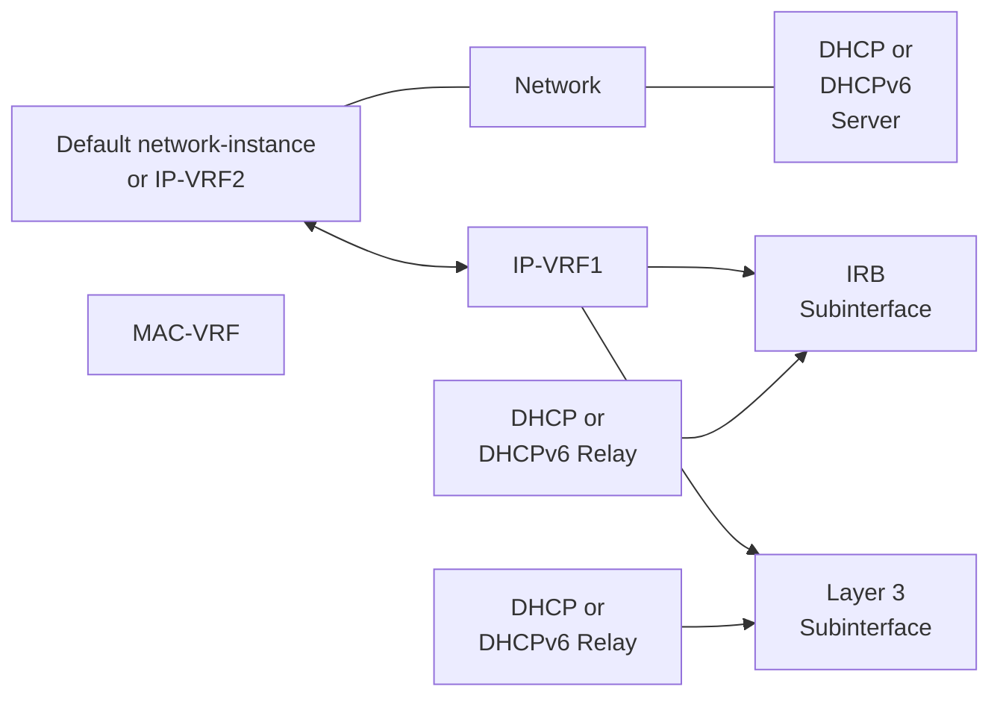
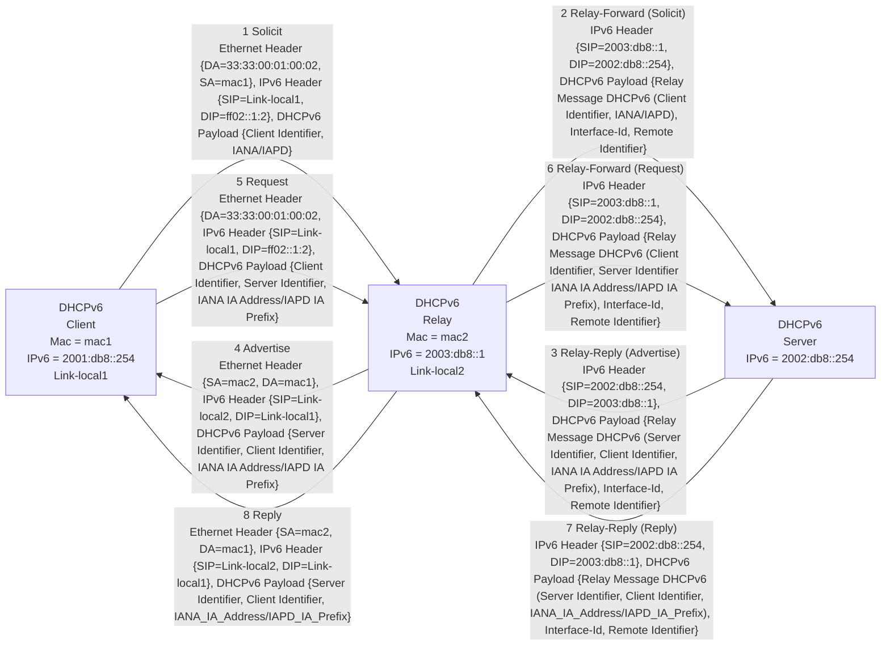
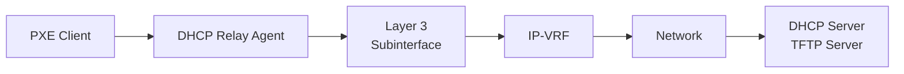
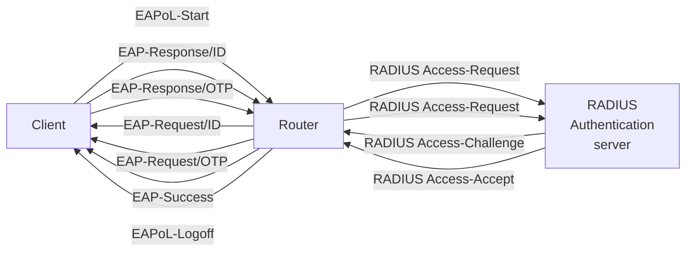
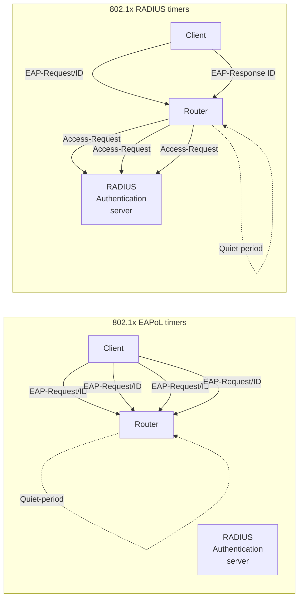
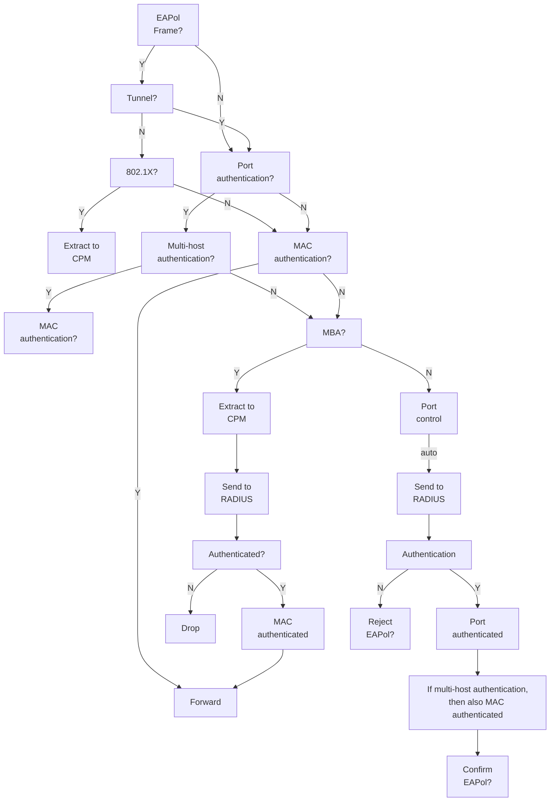

logo: Nokia

# Nokia Service Router Linux
## 7215 Interconnect System
## 7220 Interconnect Router
## 7250 Interconnect Router
## 7730 Service Interconnect Router

Release 26.7

Interfaces Guide

3HE 22263 AAAB TQZZA
Edition: 01
July 2026

**© 2026 Nokia.**
Use subject to Terms available at: www.nokia.com/terms.

Nokia is committed to diversity and inclusion. We are continuously reviewing our customer documentation and consulting with standards bodies to ensure that terminology is inclusive and aligned with the industry. Our future customer documentation will be updated accordingly.

This document includes Nokia proprietary and confidential information, which may not be distributed or disclosed to any third parties without the prior written consent of Nokia.

This document is intended for use by Nokia’s customers (“You”/”Your”) in connection with a product purchased or licensed from any company within Nokia Group of Companies. Use this document as agreed. You agree to notify Nokia of any errors you may find in this document; however, should you elect to use this document for any purpose(s) for which it is not intended, You understand and warrant that any determinations You may make or actions You may take will be based upon Your independent judgment and analysis of the content of this document.

Nokia reserves the right to make changes to this document without notice. At all times, the controlling version is the one available on Nokia’s site.

No part of this document may be modified.

NO WARRANTY OF ANY KIND, EITHER EXPRESS OR IMPLIED, INCLUDING BUT NOT LIMITED TO ANY WARRANTY OF AVAILABILITY, ACCURACY, RELIABILITY, TITLE, NON-INFRINGEMENT, MERCHANTABILITY OR FITNESS FOR A PARTICULAR PURPOSE, IS MADE IN RELATION TO THE CONTENT OF THIS DOCUMENT. IN NO EVENT WILL NOKIA BE LIABLE FOR ANY DAMAGES, INCLUDING BUT NOT LIMITED TO SPECIAL, DIRECT, INDIRECT, INCIDENTAL OR CONSEQUENTIAL OR ANY LOSSES, SUCH AS BUT NOT LIMITED TO LOSS OF PROFIT, REVENUE, BUSINESS INTERRUPTION, BUSINESS OPPORTUNITY OR DATA THAT MAY ARISE FROM THE USE OF THIS DOCUMENT OR THE INFORMATION IN IT, EVEN IN THE CASE OF ERRORS IN OR OMISSIONS FROM THIS DOCUMENT OR ITS CONTENT.

Copyright and trademark: Nokia is a registered trademark of Nokia Corporation. Other product names mentioned in this document may be trademarks of their respective owners.

The registered trademark Linux® is used pursuant to a sublicense from the Linux Foundation, the exclusive licensee of Linus Torvalds, owner of the mark on a worldwide basis.

© 2026 Nokia.

Interfaces Guide Release 26.7

Interfaces Guide Release 26.7
Table of contents

5 **IRB interfaces** 40
 5.1 IRB interface configuration 41

6 **Displaying interface statistics** 42
 6.1 Clearing interface statistics 43

7 **Displaying subinterface statistics** 44
 7.1 Clearing subinterface statistics 46

8 **Displaying interface status** 47

9 **Configuring interface delay** 53

10 **LLDP** 54
 10.1 LLDP implementation in SR Linux 56
 10.2 LLDP transmitting system capabilities TLV 56
 10.3 Configuring LLDP 57
 10.4 Suppressing TLV advertisement 57
 10.5 Displaying LLDP neighbor information 58
 10.6 Displaying LLDP statistics 58
 10.7 Clearing LLDP statistics 60

11 **LAG** 62
 11.1 Min-link threshold 62
 11.2 LACP 62
  11.2.1 LACP fallback 62
 11.3 LAG configuration 63
  11.3.1 Configuring the min-link threshold 64
  11.3.2 Configuring LACP and LACP fallback 64
  11.3.3 Disabling LAG member interfaces 65
  11.3.4 Forwarding viability configuration for LAG members 66
  11.3.4.1 Configuring forwarding viability for a LAG member 67
  11.3.5 LAG resource allocation 67
  11.3.5.1 Configuring LAG resource allocation 68
 11.4 Displaying LAG interface statistics 69
  11.4.1 Clearing LAG interface statistics 69


SPACER TEXT

3HE 22263 AAAB TQZZA     **© 2026 Nokia.**     4
Use subject to Terms available at: [www.nokia.com/terms](http://www.nokia.com/terms).

Interfaces Guide Release 26.7
Table of contents

**12 MTU** 71
12.1 Port MRU 71
12.2 Port MTU 71
12.3 IP MTU 72
12.4 MPLS MTU 72

**13 Breakout ports** 74
13.1 Configuring breakout mode for an interface 80

**14 Physical port and VLAN loopback** 82
14.1 Configuring loopback mode 83

**15 PHY-to-port-group mapping (7220 IXR-D2 and 7220 IXR-D2L only)** 85
15.1 Displaying the members of a port group 85

**16 IPv4 ARP and IPv6 ND** 87
16.1 IPv4 ARP 87
16.1.1 Configuring static ARP entries 88
16.1.2 Configuring dynamic ARP timeout 89
16.1.3 Disabling ARP address conflict detection 89
16.2 IPv6 Neighbor Discovery 90
16.2.1 Configuring static ND entries 91
16.2.2 Configuring ND reachable time and stale time 91
16.2.3 Configuring IPv6 neighbor limit on subinterfaces 92

**17 DHCP relay** 93
17.1 DHCP relay for IPv4 94
17.1.1 Configuring DHCP relay for IPv4 99
17.1.2 Using the GIADDR as the source address for DHCP Discover/Request packets 101
17.1.3 Trusted and untrusted DHCP requests 102
17.2 DHCP relay for IPv6 103
17.2.1 Configuring DHCP relay for IPv6 105
17.3 QoS for DHCP relay 107
17.4 DHCP relay operational down reasons 108
17.5 Updating domain name resolution for DHCP-relay server FQDNs 108
17.6 Displaying DHCP relay statistics 109


SPACER TEXT

3HE 22263 AAAB TQZZA 5 **© 2026 Nokia.**
Use subject to Terms available at: [www.nokia.com/terms](http://www.nokia.com/terms).

<layout_regions>

Interfaces Guide Release 26.7

Interfaces Guide Release 26.7 Table of contents

27.5.2 Static allow source MAC policy 144
27.5.3 802.1X packet-type reception behavior 145
27.5.4 Host authentication behavior 146
27.5.5 Authentication lists 146
27.6 802.1X MAC-based authentication 146
27.6.1 Port authentication mode 146
27.6.2 Host-mode authentication method change 147
27.6.3 MBA reception packet behavior 148
27.7 EAPoL configuration 148


Use subject to Terms available at: www.nokia.com/terms.

SPACER TEXT

3HE 22263 AAAB TQZZA **© 2026 Nokia.** 77

Interfaces Guide Release 26.7

<page_header>Interfaces Guide Release 26.7

Interfaces Guide Release 26.7 What's new

## 2 What's new

This section lists the changes that were made in this release.

Table 2: What's new in Release 26.7.1

<table>
<thead>
<tr><th>**Topic**</th><th>**Location**</th></tr>
</thead>
<tbody>
<tr><td>Exponential port dampening to block ports from reuse after port-down/up events</td><td>Exponential port dampening</td></tr>
<tr><td>SR Linux **tools** command to adjust the amount of resources reserved for physical LAGs</td><td>LAG resource allocation</td></tr>
<tr><td>Administrative tags for IP subinterfaces for routing policy matching</td><td>Administrative tags for IP subinterfaces</td></tr>
<tr><td>ICMP destination unreachable message returned when ARP/ND is unsuccessful</td><td>Dynamic ARP entries</td></tr>
<tr><td>ARP/ND traffic-triggered refresh</td><td>IPv6 Neighbor Entries for Routing Next-Hops</td></tr>
<tr><td>SR Linux **interface** command to tunnel incoming 802.1X frames (untagged, single-tagged, or double-tagged)</td><td>802.1X tunneling</td></tr>
<tr><td>Disabling all LAG member-link interfaces when the LAG admin is operationally down</td><td>Disabling LAG member interfaces</td></tr>
<tr><td>DHCP relay option 82 configurable circuit-id (IPv4/ IPv6)</td><td>Configuring DHCP relay for IPv4<br />Configuring DHCP relay for IPv6</td></tr>
<tr><td>Support for facility loopback mode on 7250 IXR Gen 3</td><td>Physical port and VLAN loopback</td></tr>
</tbody>
</table>

3HE 22263 AAAB TQZZA 10 **© 2026 Nokia.** Use subject to Terms available at: [www.nokia.com/terms](http://www.nokia.com/terms).

Interfaces Guide Release 26.7 Interfaces

## 3 Interfaces

In SR Linux, an interface is any physical or logical port through which packets can be sent to or received from other devices. SR Linux supports the following interface types:

* **loopback**

A loopback interface is a virtual interface that is always up, providing a stable source or destination from which packets can always be originated or received. SR Linux supports up to 256 loopback interfaces system-wide, across all network-instances. Loopback interfaces are named loN, where N is 0 to 255.

* **system**

The system interface is a type of loopback interface that has characteristics that do not apply to regular loopback interfaces:

– The system interface can be bound to the default network-instance only.

– The system interface does not support multiple IPv4 addresses or multiple IPv6 addresses.

– The system interface cannot be administratively disabled. Once configured, it is always up.

SR Linux supports a single system interface named system0. When the system interface is bound to the default network-instance, and an IPv4 address is configured for it, the IPv4 address is the default local address for multi-hop BGP sessions to IPv4 neighbors established by the default network-instance, and it is the default IPv4 source address for IPv4 VXLAN tunnels established by the default network-instance. The same functionality applies with respect to IPv6 addresses / IPv6 BGP neighbors / IPv6 VXLAN tunnels.

* **network**

Network interfaces carry transit traffic, as well as originate and terminate control plane traffic and in-band management traffic.

The physical ports in line cards installed in the SR Linux device are network interfaces. A typical line card has a number of front-panel cages, each accepting a pluggable transceiver. Each transceiver may support a single channel or multiple channels, supporting one Ethernet port or multiple Ethernet ports, depending on the transceiver type and its breakout options.

In the SR Linux CLI, each network interface has a name that indicates its type and its location in the chassis. The location is specified using the following formats:

ethernet-slot[/mmda-slot][/connector]/port

where:

– slot – is a slot number (1 to 9). On 7220 IXR-Dx and 7220 IXR-Hx fixed systems there is only one slot, numbered 1; even though no other slot value is possible, the slot number 1 is still part of the interface name.

– mda-slot – is a number representing the media dependent adapter (MDA) position within the parent card or chassis on devices that support MDA assemblies.

– connector – is a number indicating the front-panel connector/cage to which a breakout cable is connected. It is omitted when there is no breakout configuration.

– port – is a number referring to the front-panel connector/cage to which a non-breakout cable is connected, or else it refers to the channel number (1 to 4) in a breakout configuration.

3HE 22263 AAAB TQZZA 11
**© 2026 Nokia.**
Use subject to Terms available at: [www.nokia.com/terms](http://www.nokia.com/terms).

Interfaces Guide Release 26.7 Interfaces

For example:

* Interface ethernet-1/1 can refer to port 1 of a 7220 IXR-Dx system or to port 1 of the 7250 IXR IMM installed in slot 1.

* Interface ethernet-2/1 refers to port 1 of the 7250 IXR IMM installed in slot 2.

* Interface ethernet-1/1/1 can refer to breakout port 1 of connector 1 in a 7220 IXR-Dx chassis.

* Interface ethernet-1/m1/2/4 refers to breakout port 4 of connector 2 on the first MDA of the chassis.

* **management**

Management interfaces are used for out-of-band management traffic. Fixed systems have a single out-of-band management interface named **mgmt0**. Modular systems with redundant CPMs have two out-of-band management ports with virtual names **mgmt0** and **mgmt0-standby** and fixed names **mgmtA** and **mgmtB**. See Out-of-band management interfaces.

* **integrated routing and bridging (IRB)**

IRB interfaces enable inter-subnet forwarding. Network-instances of type **mac-vrf** are associated with a Layer 3 network-instance of type **ip-vrf** or type **default** via an IRB interface.

IRB interfaces are named irbN, where N is 0 to 255. See IRB interfaces.

In SR Linux, each loopback, network, management, and IRB interface can be subdivided into one or more subinterfaces. See Subinterfaces.

## 3.1 Out-of-band management interfaces

In SR Linux configuration and state, out-of-band management ports are represented by interface names that start with **mgmt**: **mgmt0**, **mgmt0-standby**, **mgmtA**, and **mgmtB**.

The **mgmt** interfaces support many of the same capabilities as regular **ethernet** interfaces, with the following exceptions:

* Packets sent and received on the out-of-band management interface are processed completely in software.

* The out-of-band management interface does not support multiple output queues, so there is no output traffic differentiation based on forwarding class.

* The out-of-band management interface does not support pluggable optics. It is a fixed 10/100/1000-BaseT copper port.

* The default port MTU of **mgmt** interfaces is 1514 bytes, and is not derived from the system.mtu.default-port-mtu setting.

* The only supported speed for **mgmt** interfaces is 1G.

* **mgmt** interfaces do not support breakout mode.

* **mgmt** interfaces cannot be configured as LAG members.

* **mgmt** interfaces do not support port loopback.

The **mgmt0.0** routed subinterface of **mgmt0** can be referenced by any network-instance of type **ip-vrf** or by the **default** network-instance. The management stack is accessible through any network-instance, even it does not include the **mgmt0.0** subinterface.

3HE 22263 AAAB TQZZA      **© 2026 Nokia.**      12
Use subject to Terms available at: [www.nokia.com/terms](http://www.nokia.com/terms).

Interfaces Guide Release 26.7 Interfaces

On fixed systems, there is a single management interface named **mgmt0**.

On chassis-based modular systems with redundant CPMs, the out-of-band management ports have a virtual name that indicates the port's current role in the system, as well as a fixed name that indicates the port's location in the chassis:

• The virtual name **mgmt0** refers to the management interface on the active CPM in the system.

• The virtual name **mgmt0-standby** refers to the management interface on the standby CPM in the system.

• The fixed name **mgmtA** refers to the management port on the CPM in slot A.

• The fixed name **mgmtB** refers to the management port on the CPM in slot B.

On systems with redundant CPMs, the configured list of interfaces must still include **mgmt0** and **mgmt0-** **standby**, even if you intend to manage the ports using the **mgmtA** and **mgmtB** names.

Only the following port properties are configurable for **mgmtA** and **mgmtB**: **description**, **admin-state** and **mtu**.

Port statistics for **mgmtA** and **mgmtB** are reset whenever there is a CPM switchover.

**mgmtA** and **mgmtB** can be configured as LLDP interfaces (under system.lldp.interface). When **mgmtA** or **mgmtB** is enabled as an LLDP interface, the LLDP PDUs transmitted from the corresponding **mgmt** port encode **mgmtA** or **mgmtB** as the interface name rather than **mgmt0** or **mgmt0-standby.**

## 3.2 Linux interface naming conventions

Every type of SR Linux interface has an underlying interface in the Linux OS. These interfaces have names that adhere to Linux restrictions (maximum 15 characters and no slashes). The Linux interface name formats are as follows:

• Loopback interfaces: loN, where N is 0 to 255; for example, lo0

• Network interfaces: eslot-port-subinterface; for example, e4-2-1

• Management interface: mgmt0

• System interface: system0

• LAG interface: lagN

• IRB interface: irbN

## 3.3 Basic interface configuration

The following example shows a configuration for interface basic parameters, including administratively enabling the interface, specifying a description, and setting the MTU. The settings apply to any subinterfaces on the port, unless overridden in the subinterface configuration.

```
--{ * candidate shared default }--[ ]--
# info with-context interface ethernet-1/2
interface ethernet-1/2
  description Sample_interface_config
  admin-state enable
  mtu 1500
```

3HE 22263 AAAB TQZZA **© 2026 Nokia.** 13
Use subject to Terms available at: [www.nokia.com/terms](http://www.nokia.com/terms).

Interfaces Guide Release 26.7

Interfaces Guide Release 26.7 Subinterfaces

The Linux name of a subinterface adheres to Linux restrictions (maximum 15 characters and no slashes). For example, the subinterface named ethernet-2/1.0 has the Linux name e2-1.0.

## 4.3 Basic subinterface configuration

For IPv4 packets to be sourced from a subinterface, the IPv4 address family must be enabled on the subinterface and the subinterface must be configured with an IPv4 address and prefix length that indicates the other IPv4 hosts reachable on the same subnet.

A subinterface can have up to 64 IPv4 prefixes assigned to it. One or more of these can be optionally configured as a primary candidate. Within the set of IPv4 prefixes configured as primary candidates, the lowest IPv4 address that does not fail duplicate address detection is selected as the primary address for the subinterface. The primary address is used by upper layer protocols that need to choose only one IPv4 address from which to source their messages, as well as for information about this interface displayed with the **info from state** command. If there is no suitable address in the set of IPv4 prefixes configured as primary candidates (or if no IPv4 prefix is configured as primary), a selection is made from the IPv4 prefixes not configured as primary candidates.

For IPv6 packets to be sourced from a subinterface, the IPv6 address family must be enabled on the subinterface, which must be configured with a global unicast IPv6 address and prefix length. The address can be configured statically or obtained from a DHCP server.

A subinterface can have up to 16 global unicast IPv6 addresses and prefixes assigned to it. One or more of these can be optionally configured as a primary candidate. Within the set of IPv6 prefixes configured as primary candidates, the lowest IPv6 address that does not fail duplicate address detection is selected as the primary address for the subinterface. The primary address is used by upper layer protocols that need to choose only one IPv6 address from which to source their messages, as well as for information about this interface displayed with the **info from state** command. If there is no suitable address in the set of IPv6 prefixes configured as primary candidates (or if no IPv6 prefix is configured as primary), a selection is made from the IPv6 prefixes not configured as primary candidates.

The following example shows basic parameters for a subinterface configuration, including IPv4 and IPv6 addresses and prefix lengths.

The configuration for subinterface 1 administratively enables the subinterface, and specifies a DSCP classifier policy that assigns input IPv4 traffic to a queue based on the 6-bit DSCP value in the IP header.

The configuration for subinterface 2 administratively enables the subinterface, and configures multiple IPv4 and IPv6 addresses and prefix lengths. The primary IPv4 address for the subinterface is selected from among the set of IPv4 prefixes configured as primary candidates; the selected IPv4 address is the numerically lowest address that does not fail duplicate address detection. The global unicast IPv6 address for the subinterface is selected from the IPv6 prefix configured as primary. The selected global unicast IPv6 address is the numerically lowest address that does not fail duplicate address detection.

```
--{ * candidate shared default }--[ ]--
# **info with-context interface ethernet-1/2**
interface ethernet-1/2
 description Sample_interface_config
 admin-state enable
 mtu 1500
 subinterface 1 {
  admin-state enable
  ipv4 {
   admin-state enable
   }
```

3HE 22263 AAAB TQZZA 15
**© 2026 Nokia.**
Use subject to Terms available at: [www.nokia.com/terms](http://www.nokia.com/terms).

Interfaces Guide Release 26.7 Subinterfaces

```
}
ipv6 {
 admin-state enable
 address 2001:1::192:168:12:1/126 {
 }
}
qos {
 input {
      classifiers {
                    ipv4-dscp 1
      }
 }
}
}
subinterface 2 {
 admin-state enable
 ipv4 {
  admin-state enable
  address 192.168.12.1/30 {
       primary
  }
  address 192.168.12.2/30 {
       primary
  }
  address 192.168.12.2/30 {
  }
 }
 ipv6 {
  admin-state enable
  address 2001:1::192:168:12:2/126 {
       primary
  }
  address 2001:1::192:168:12:3/126 {
  }
 }
}
```

## 4.4 IPv4 unnumbered interfaces

An IPv4 unnumbered interface is an interface of the router that is enabled for sending and receiving IPv4 packets, but has no configured IPv4 address of its own. When the router needs to send IPv4 packets from this interface, it borrows the IPv4 source address from another interface that is numbered; that is, one that has its own, explicitly configured IPv4 address. The IPv4 address can only be borrowed from an interface that is up, so the borrowed address is almost always a loopback or system address.

IPv6 unnumbered interfaces exist, but they are not widely used because an IPv6-enabled interface always has an IPv6 link-local address. The only benefit of borrowing an IPv6 address from another interface is to borrow a global-unicast IPv6 address from the other interface. SR Linux does not support IPv6 unnumbered interfaces.

Using IPv4 unnumbered interfaces can lead to simplified network design, where each router has minimally just one IPv4 address, assigned to a loopback/system interface. When Router A is connected by a link to Router B, Router A borrows the address of its loopback, and Router B borrows the address of its loopback. There is no need to allocate a unique IPv4 subnet for the link and no need to coordinate the addresses at each end. This allows a plug-and-play approach and greatly simplifies the reconfiguration effort required if physical connectivity is changed.

3HE 22263 AAAB TQZZA 16
**© 2026 Nokia.**
Use subject to Terms available at: [www.nokia.com/terms](http://www.nokia.com/terms).

Interfaces Guide Release 26.7 Subinterfaces

Unnumbered interfaces can also simplify control plane protection configuration because CPM-filters (or the equivalent) protect traffic that is terminated by the loopback/system address and require no modification when new interfaces are added.

Routing protocol support for unnumbered interfaces in SR Linux is as follows:

• OSPFv2 and OSPFv3 adjacencies can form over unnumbered interfaces, but they are always P2P (point-to-point) adjacencies. If the interface-type is configured as broadcast, the operational interface- type is forced back to point-to-point.

• IS-IS adjacencies can form over unnumbered interfaces, but they are always P2P adjacencies. If the interface-type is configured as broadcast, the operational interface-type is forced back to point-to-point.

• iBGP and multi-hop eBGP sessions can form over unnumbered interfaces.

• LDP and SR-ISIS support unnumbered interfaces.

IPv4 unnumbered interfaces are supported on routed subinterfaces of ethernet and lagN interfaces.

A subinterface of a network-instance can borrow an IPv4 address from any other subinterface of that network-instance, as long as that other subinterface is not a mgmt subinterface.

If the interface configuration points to a subinterface in a different network-instance or a subinterface not bound to any network-instance at all, the subinterface remains operationally down with respect to IPv4 forwarding. If the interface configuration points to a subinterface with multiple IPv4 addresses, the primary IPv4 address of the subinterface is the borrowed address.

If the interface configuration points to a subinterface that is operationally down (or where IPv4 is operationally down), the borrowing subinterface remains operationally down with respect to IPv4 forwarding. If the interface configuration points to a subinterface that has no IPv4 addresses, the borrowing subinterface remains operationally down with respect to IPv4 forwarding.

When an ICMP message is transmitted from an unnumbered IPv4 subinterface, the source address is the borrowed address.

### 4.4.1 Configuring an IPv4 unnumbered subinterface

**Procedure**

To configure an IPv4 unnumbered subinterface, you administratively enable the unnumbered subinterface and specify the interface the unnumbered subinterface borrows its address from. If you configure a subinterface as unnumbered, you cannot assign an IPv4 address to it.

**Example**

The following example enables an IPv4 unnumbered subinterface. The subinterface is configured to borrow the address of loopback interface lo0.1.

```
--{ * candidate shared default }--[ ]--
# **info with-context interface ethernet-1/8 subinterface 1 ipv4**
interface ethernet-1/8 {
 subinterface 1 {
         ipv4 {
          admin-state enable
          unnumbered {
               admin-state enable
               interface lo0.1
          }
         }
 }
}
```

3HE 22263 AAAB TQZZA 17
**© 2026 Nokia.**
Use subject to Terms available at: [www.nokia.com/terms](http://www.nokia.com/terms).

Interfaces Guide Release 26.7 Subinterfaces
</layout_header>

## 4.5 IPv6 address assignment in SR Linux

A routed subinterface becomes operational for IPv6 forwarding when `interface.subinterface.ipv6.admin-state` is set to enable.

To assign a global-unicast IPv6 address to a routed subinterface, you must provide a host address and a prefix-length. In SR Linux, the address and prefix-length are subject to the following restrictions:

• ::/128 is disallowed (special reserved address for unspecified)

• ::1/128 is disallowed (special reserved address for loopback)

• Addresses in the block ff00::/8 are disallowed (special reserved addresses for multicast)

In SR Linux, some types of routed subinterfaces support assignment of multiple IPv6 global-unicast addresses to a single interface. The maximum number of IPv6 global unicast addresses that can be assigned to each routed subinterface is summarized in the following table.

Table 3: Maximum IPv6 global-unicast addresses for routed subinterface types

<table>
<thead>
<tr><th>Subinterface</th><th>Maximum IPv6 addresses</th></tr>
</thead>
<tbody>
<tr><td>system0.0</td><td>1</td></tr>
<tr><td>mgmt0.0</td><td>1</td></tr>
<tr><td>lo&#x3C;N>.x</td><td>16</td></tr>
<tr><td>lag&#x3C;N>.x</td><td>16</td></tr>
<tr><td>irb&#x3C;N>.x</td><td>16</td></tr>
<tr><td>ethernet-&#x3C;slot>/&#x3C;connector>/&#x3C;port>.x</td><td>16</td></tr>
</tbody>
</table>

On a particular routed subinterface, each global-unicast IPv6 address must be unique, but the subnets that result from applying the prefix-length masks can create overlap. For example, it is possible to assign 2001::1/64, 2001::2/64, and 2001::3/64 to the same subinterface. This can lead to ambiguity when a locally originated packet is destined for an address such as 2001::5. SR Linux chooses the source address based on the longest prefix match of the destination address; if there are still multiple choices, the numerically lowest IP address is selected. For this example, 2001::1 is used as a local address when you issue a **ping 2001::5** command.

On a routed subinterface that supports multiple global-unicast IPv6 addresses, one of them is selected as the primary IPv6 address. The primary address is used by upper-layer protocols that need to choose only one IPv6 global-unicast address from which to source their messages. You can influence the election algorithm by configuring one or more IPv6 addresses as primary; this set of IPv6 addresses are the preferred candidates. The system elects the lowest IP address among the members of the preferred set that did not fail duplicate address detection (DAD). If no addresses are preferred or else all the preferred addresses fail DAD validation then the system elects the lowest IP address among the members of the non-preferred set that did not fail duplicate address detection (DAD). The elected address is the single address that has the primary leaf in the output of info from state commands.

3HE 22263 AAAB TQZZA 18
© 2026 Nokia.
Use subject to Terms available at: www.nokia.com/terms.

Interfaces Guide Release 26.7 <span style="float: right;">Subinterfaces</span>

### IPv6 LLA assignment

If a subinterface has a statically configured IPv6 address in the IPv6 link-local block (FE80::/10), the system publishes this address as the IPv6 link-local address (LLA) of the interface. If the configuration of the subinterface has no IPv6 address in the IPv6 link-local block, the system generates an IPv6 link-local address for assignment to the subinterface.

The link-local IPv6 address is generated from the MAC address of the subinterface, which is itself derived from the MAC address of the port. The address generation process converts the 48-bit MAC address into a 64-bit EUI-64 address, and this EUI-64 address becomes the host portion of the FE80::/10 prefix.

When the static or generated IPv6 LLA is programmed, the subinterface can receive IPv6 packets with any of the following destinations:

• IPv6 LLA

• Solicited-node multicast address for the LLA

• ff02::1 (all IPv6 devices)

• ff02::2 (all IPv6 routers)

To terminate (as a host) IPv6 unicast packets originated by remote devices (that is, devices not connected to the local link), one or more IPv6 global unicast addresses must be assigned to the subinterface.

Several routing protocols including BFD, IS-IS, OSPFv3, and BGP can establish a session between two interfaces on the same link that have a link-local address but no IPv6 global-unicast address.

• For BGP, the local-address of a static BGP session of any type cannot be configured as an LLA; however, the local TCP connection endpoint (and BGP next-hop-self) automatically uses the LLA when the neighbor address is link-local.

If the neighbor address is defined as an LLA (with the subinterface name to scope the address), the session comes up only if it is eBGP. iBGP peers do not come up because they are presumed to be multi-hop.

Dynamic sessions are not accepted if they come from an IPv6 LLA.

• BFD sessions tied to IS-IS adjacencies that were discovered from a Hello that included an IPv6 LLA, and BFD sessions tied to BGP sessions established between link-local addresses do not establish.

### 4.5.1 Assigning IPv6 addresses to a subinterface

### Procedure

You can configure one or more IPv6 addresses on a subinterface. This table lists the number of global-unicast IPv6 addresses that can be configured on each type of subinterface.

### Example: Configuring primary IPv6 addresses

The following example configures three IPv6 addresses on a subinterface. Two addresses are configured as primary. Upper-layer protocols prefer the primary addresses when selecting an IPv6 address from which to source their messages.

```
--{ * candidate shared default }--[ ]--
# **info with-context interface ethernet-1/12 subinterface 1 ipv6**
interface ethernet-1/12 {
        subinterface 1 {
        ipv6 {
        admin-state enable
```

3HE 22263 AAAB TQZZA <span style="float: right;">19</span>
**© 2026 Nokia.**
Use subject to Terms available at: [www.nokia.com/terms](http://www.nokia.com/terms).

Interfaces Guide Release 26.7

Interfaces Guide Release 26.7

Interfaces Guide Release 26.7 22 Subinterfaces

```
# info with-context interface ethernet-1/2 subinterface 1
  interface ethernet-1/2 {
    subinterface 1 {
      ipv6 {
          address 2001:db8:1:1::2/64 {
                  internal-tags {
                        set-tag-set [
                          ts1
                        ]
                  }
          }
      }
    }
  }
```

## 4.7 Subinterface VLAN configuration

When the **vlan-tagging** parameter is set to **true** for a network interface, the interface can accept ethertype 0x8100 frames with one or more VLAN tags. The interface can be configured with up to 4096 subinterfaces, each with a separate index number.

The following example enables VLAN tagging for an interface and configures two subinterfaces. Single-tagged packets received on subinterface ethernet-2/1.2 are encapsulated with VLAN ID 101.

```
--{ * candidate shared default }--[  ]--
# info with-context interface ethernet-2/1
interface ethernet-2/1 {
 admin-state enable
 vlan-tagging true
 subinterface 1 {
   admin-state enable
   vlan {
     encap {
         single-tagged {
            vlan-id 100
         }
     }
   }
 }
 subinterface 2 {
   admin-state enable
   vlan {
     encap {
         single-tagged {
            vlan-id 101
         }
     }
   }
 }
}
```

## 4.7.1 Null encapsulated bridged subinterfaces

Untagged bridged and routed subinterfaces are supported on all platforms that support bridged subinterfaces, including 7220 IXR-Dx, 7215 IXS, 7250 IXR, and 7730 SXR platforms.

3HE 22263 AAAB TQZZA **© 2026 Nokia.** 22
Use subject to Terms available at: [www.nokia.com/terms](http://www.nokia.com/terms).

Interfaces Guide Release 26.7 Subinterfaces

When a subinterface is untagged bridged and routed, the Ethernet interface is configured as **vlan-tagging** **false**.

Only one untagged subinterface is supported on an Ethernet interface.

All incoming frames on the interface are classified into the untagged subinterface whether the frames are tagged or untagged.

**Example: Untagged interface configuration**

```
--{ * candidate shared default }--[ interface ethernet-1/1 ]--
A:srl1# **info**
    admin-state enable
    **vlan-tagging** **false**
    subinterface 1 {
        type bridged
    }
```

## 4.7.2 Dot1q tagged bridged subinterfaces

Dot1q tagged bridged subinterfaces are supported on 7220 IXR-Dx, 7215 IXS, 7250 IXR, and 7730 SXR platforms.

When a bridged subinterface is Dot1q tagged, the Ethernet interface is configured as **vlan-tagging true** and multiple subinterfaces are supported on the same interface.

Ingress traffic is classified into a subinterface based on the associated Dot1q tagging.

The following table describes the possible subinterfaces that traffic is classified into.

Table 4: Dot1q tagged bridged subinterfaces

<table>
<thead>
<tr><th>**Subinterface type**</th><th>**VLAN ID configuration**</th><th>**Description**</th><th>**Platform support**</th></tr>
</thead>
<tbody>
<tr><td>**subinterface vlan**<br />**encap untagged**</td><td>—</td><td>Untagged traffic is classified into the subinterface.<br />On 7220 IXR-Dx and 7215 IXS-A1 platforms, frames tagged with vlan-**id=0** are also classified into this subinterface.</td><td>7220 IXR-Dx<br />7215 IXS-A1<br />7250 IXR<br />7730 SXR</td></tr>
<tr><td>**subinterface vlan**<br />**encap single-tagged**</td><td>**vlan-id =** 1 to 4094</td><td>Dot1q tagged traffic is classified into the subinterface.<br />When **vlan-id** is configured to a specific value, it is popped on ingress and pushed on egress (default). The **vlan-id** is service-delimiting.</td><td>7220 IXR-Dx<br />7215 IXS-A1<br />7250 IXR<br />7730 SXR</td></tr>
</tbody>
</table>


SPACER TEXT

3HE 22263 AAAB TQZZA 23 **© 2026 Nokia.** Use subject to Terms available at: [www.nokia.com/terms](http://www.nokia.com/terms).

Interfaces Guide Release 26.7 Subinterfaces

<table>
<thead>
<tr><th>**Subinterface type**</th><th>**VLAN ID configuration**</th><th>**Description**</th><th>**Platform support**</th></tr>
</thead>
<tbody>
<tr><td>**subinterface vlan**<br />**encap single-tagged**</td><td>**vlan-id = optional**</td><td>Dot1q tagged and untagged traffic is classified into the subinterface.<br /><br />If **vlan-id = optional**, any non-specified value (or untagged value) is classified into the subinterface. There are no service-delimiting VLAN tags on the subinterface.</td><td>7220 IXR-Dx<br />7215 IXS-A1<br />7250 IXR<br />7730 SXR</td></tr>
<tr><td>**subinterface vlan**<br />**encap single-tagged**</td><td>**vlan-id = any**</td><td>Dot1q tagged traffic is classified into the subinterface.<br /><br />If **vlan-id = any**, any non-specified value (but a tag must always exist) is classified into the subinterface. There are no service-delimiting VLAN tags on the subinterface.</td><td>7730 SXR</td></tr>
</tbody>
</table>

### 4.7.3 Dot1q VLAN ranges on bridged subinterfaces

Bridged subinterfaces support Dot1q VLAN ranges. When a bridged subinterface is configured for a Dot1q VLAN range, traffic matching any VLAN in the range is associated with the bridged subinterface.

For example, you can configure a bridged subinterface with the Dot1q VLAN range 10 to 100. When an attached device sends traffic that has a VLAN ID in the range 10 through 100, the traffic is associated with the bridged subinterface.

A bridged subinterface can support a single VLAN range or multiple VLAN ranges. The following figure shows a configuration with a single VLAN range.

3HE 22263 AAAB TQZZA © 2026 Nokia. 24
Use subject to Terms available at: [www.nokia.com/terms](http://www.nokia.com/terms).

Interfaces Guide Release 26.7 <span style="float: right;">Subinterfaces</span>

Figure 1: Single VLAN range on a bridged subinterface

chart: flow chart of VNI 20001, Leaf-1, Leaf-2, Leaf-3, and BM Server configuration

In this figure, the Bare Metal (BM) server is attached to a MAC VRF, and LAG-bridged subinterfaces are associated with the Dot1q VLAN range 1-4000. Traffic issued by the BM server with a VLAN ID matching any value in the configured range is associated with the bridged subinterface. VLAN IDs 4001-4095 are not associated with the subinterface.

The following figure shows a configuration with multiple VLAN ranges associated with a bridged subinterface.

3HE 22263 AAAB TQZZA <span style="float: right;">**© 2026 Nokia.** 25</span>
Use subject to Terms available at: www.nokia.com/terms.

Interfaces Guide Release 26.7 Subinterfaces

Figure 2: Multiple VLAN ranges on a bridged subinterface

diagram: network topology showing VNI 20001 and VNI 20002 associated with Leaf-1, Leaf-2, and Leaf-3 connected to a BM Server via LAG

In this figure, VLAN ranges are selectively associated with a mac-vrf. VLAN IDs 1–100 are associated with MAC-VRF 20001 (which uses VNI 20001), and VLAN IDs 101–200 are associated with MAC-VRF 20002 (which uses VNI 20002).

In both figures, it is expected that all the leaf nodes attached to the same BD use the same VLAN ranges on all their bridged subinterfaces for the mac-vrf. The Dot1q VLAN tags of the incoming frames are not stripped off at the ingress subinterface. At the egress subinterface (which is configured with the same VLAN range as the ingress subinterface), no additional Dot1q tag is pushed onto the frames.

An SR Linux system can support up to 8,000 subinterfaces that have VLAN ranges, with up to 8 VLAN ranges per interface.

VLAN ranges can be configured on bridged subinterfaces of a mac-vrf with or without IRB subinterfaces. When an IRB subinterface is present in the same mac-vrf where the VLAN range subinterface is configured, incoming frames containing tags with a MAC DA equal to the IRB and associated with a Dot1q VLAN range subinterface are dropped. On egress, traffic coming from the IRB is not tagged if the destination is associated with a VLAN range subinterface.

3HE 22263 AAAB TQZZA **© 2026 Nokia.** 26
Use subject to Terms available at: www.nokia.com/terms.

Interfaces Guide Release 26.7 Subinterfaces

VLAN ranges cannot overlap within the same subinterface or across subinterfaces of the same physical interface. In addition, ranges configured in subinterface a and individual VLAN ID values configured in a single-tagged subinterface b cannot overlap if a and b are defined in the same interface.

## 4.7.3.1 Configuring Dot1q VLAN ranges on a bridged subinterface
### Procedure

To configure a Dot1q VLAN range, specify the lower and upper values for the range. A subinterface can have multiple ranges associated with it.

### Example

The following example configures a range of VLAN IDs associated with a bridged subinterface. Traffic matching any VLAN in the range is associated with the bridged subinterface.

```
--{ candidate shared default }--[ ]--
# info with-context interface ethernet-1/1
     interface ethernet-1/1 {
       vlan-tagging true
       subinterface 1 {
                type bridged
                vlan {
                 encap {
                       single-tagged-range {
                        low-vlan-id 10 {
                             high-vlan-id 100
                        }
                       }
                 }
                }
       }
     }
```

## 4.7.3.2 Displaying Dot1q VLAN range information
### Procedure

Check the Encapsulation field of the **show interface** command for the configured Dot1q VLAN ranges for the interface.

### Example

```
--{ candidate shared default }--[ ]--
# show interface lag1.1
=================================================================================
lag1.1 is up
     Network-instance: MAC-VRF-1
     Encapsulation     : vlan-id 1-10, 20-30
     Type              : bridged
=================================================================================
```

3HE 22263 AAAB TQZZA **© 2026 Nokia.** 27
Use subject to Terms available at: [www.nokia.com/terms](http://www.nokia.com/terms).

Interfaces Guide Release 26.7 Subinterfaces

## 4.7.4 QinQ bridged subinterfaces

SR Linux supports QinQ bridged subinterfaces on 7250 IXR and 7730 SXR platforms. You can configure double-tagged subinterfaces when an Ethernet interface is configured as **vlan-tagging true**.

The **double-tagged** command enables QinQ subinterfaces in a given Ethernet interface and is only configured in bridged subinterfaces.

Both **inner-vlan-id** and **outer-vlan-id** must be configured.

The following table describes the possible subinterfaces that QinQ traffic is classified into.

Table 5: QinQ tagged bridged subinterfaces

<table>
<thead>
<tr><th>Subinterface type</th><th>VLAN ID configuration</th><th>Description</th><th>Platform support</th></tr>
</thead>
<tbody>
<tr><td>**subinterface vlan**<br />**encap double-tagged**</td><td>**inner-vlan-id = 1 to**<br />**4094**<br />**outer-vlan-id = 1 to**<br />**4094**</td><td>QinQ tagged traffic<br />is classified into the<br />subinterface.<br />Frames matching the<br />specific inner and outer<br />VLAN ID combination<br />are classified into the<br />subinterface.<br />Both **inner-vlan-id**<br />and **outer-vlan-id** are<br />considered service-<br />delimiting and are<br />popped on ingress and<br />pushed on egress.</td><td>7250 IXR and 7730 SXR</td></tr>
<tr><td>**subinterface vlan**<br />**encap double-tagged**</td><td>**inner-vlan-id = any**<br />**outer-vlan-id = 1 to**<br />**4094**</td><td>QinQ tagged traffic<br />is classified into the<br />subinterface.<br />If **inner-vlan-id = any**,<br />any frames with a non-<br />specified value in the<br />inner tag (but a tag must<br />always exist) and a<br />specified outer tag value<br />are classified into the<br />subinterface.<br />In this case, only<br />the **outer-vlan-id** is<br />considered service-<br />delimiting, therefore only<br />the outer tag is popped<br />on ingress and pushed<br />on egress.</td><td>7730 SXR</td></tr>
</tbody>
</table>

3HE 22263 AAAB TQZZA 28
**© 2026 Nokia.**
Use subject to Terms available at: [www.nokia.com/terms](http://www.nokia.com/terms).

Interfaces Guide Release 26.7 Subinterfaces

<table>
<thead>
<tr><th>**Subinterface type**</th><th>**VLAN ID configuration**</th><th>**Description**</th><th>**Platform support**</th></tr>
</thead>
<tbody>
<tr><td>**subinterface vlan**<br />**encap double-tagged**</td><td>**inner-vlan-id = optional**<br />**outer-vlan-id = optional**</td><td>Untagged, Dot1q, and QinQ tagged traffic is classified into the subinterface.<br /><br />If **inner-vlan-id = any**, and **outer-vlan-id = any**, untagged frames or tagged frames with non-specified values in the outer tag and inner tag are classified into the subinterface.<br /><br />There are no service-delimiting tag values in this case, therefore no tags are popped or pushed on these subinterfaces.</td><td>**7250 IXR and 7730 SXR**</td></tr>
</tbody>
</table>

Untagged, single-tagged, and double-tagged subinterfaces are supported on the same Ethernet or LAG interface.

The following example shows untagged, single-tagged, and double-tagged subinterfaces under the same interface.

### Example: Combined untagged, single-tagged, and double-tagged subinterface configuration

```
--{ * candidate shared default }--[ ]-- # **info with-context interface ethernet-1/1**
interface ethernet-1/1 {
    description qinq-interface
    admin-state enable
    vlan-tagging true
    subinterface 1 {
        type bridged
        vlan {
            encap {
                single-tagged {
                    vlan-id 1
                }
            }
        }
    }
    subinterface 2 {
        type bridged
        vlan {
            encap {
                double-tagged {
                    inner-vlan-id 100
                    outer-vlan-id 100
                }
            }
        }
    }
}
```

3HE 22263 AAAB TQZZA 29
**© 2026 Nokia.**
Use subject to Terms available at: [www.nokia.com/terms](http://www.nokia.com/terms).

Interfaces Guide Release 26.7 Subinterfaces

```
}
subinterface 3 {
  type bridged
  vlan {
    encap {
      untagged {
      }
    }
  }
}
```

## 4.7.5 Ingress and egress mapping for VLAN manipulation

icon: note

**Note:**
This feature is supported exclusively on 7730 SXR platforms.

Ingress and egress mapping allows you to configure VLAN manipulation actions for a subinterface using the **ingress-mapping** and **egress-mapping** commands.

The ingress and egress **vlan-stack-action** commands are only supported on bridged subinterfaces that are untagged, single-tagged, or double-tagged. The **vlan-stack-action** commands are supported on subinterfaces attached to VPWS, MAC-VRFs with IRB, and MAC-VRFs without IRB.

The ingress and egress **vlan-stack-action** commands are not supported on routed subinterfaces, pseudowires, or EVPN packets.

The following **vlan-stack-action** commands are supported on ingress and egress:

* **PUSH**
* **POP**
* **SWAP**
* **PRESERVE**
* **PUSH-PUSH**
* **POP-POP**
* **POP-SWAP**
* **SWAP-SWAP**

The double actions, **PUSH-PUSH**, **POP-POP**, **POP-SWAP**, **SWAP-SWAP**, are not supported on untagged or single-tagged subinterfaces.

The following examples show the default ingress and egress mapping value defaults for VLAN manipulation in untagged, single-tagged, and double-tagged subinterfaces.

### Example: Default ingress and egress mapping in untagged and single-tagged subinterfaces

```
--{ +* candidate shared default }--[ interface ethernet-1/1 ]--
A:srl2# info from state with-context
    interface ethernet-1/1 {
        admin-state enable
        vlan-tagging true
        subinterface 0 {
          type bridged
```

30 3HE 22263 AAAB TQZZA © 2026 Nokia.
Use subject to Terms available at: [www.nokia.com/terms](http://www.nokia.com/terms).

Interfaces Guide Release 26.7 Subinterfaces

```
vlan {
 encap {
      untagged {
      }
 }
 ingress-mapping {
      vlan-stack-action PRESERVE
 }
 egress-mapping {
      vlan-stack-action PRESERVE
 }
}
}
subinterface 1 {
 type bridged
 vlan {
  encap {
       single-tagged {
         vlan-id any
       }
  }
  ingress-mapping {
       vlan-stack-action PRESERVE
  }
  egress-mapping {
       vlan-stack-action PRESERVE
  }
 }
}
subinterface 2 {
 type bridged
 vlan {
  encap {
       single-tagged {
         vlan-id optional
       }
  }
  ingress-mapping {
       vlan-stack-action PRESERVE
  }
  egress-mapping {
       vlan-stack-action PRESERVE
  }
 }
}
subinterface 3 {
 type bridged
 vlan {
  encap {
       single-tagged {
         vlan-id 1
       }
  }
  ingress-mapping {
       vlan-stack-action POP
  }
  egress-mapping {
       vlan-stack-action PUSH
  }
 }
}
}
```

SPACER TEXT

3HE 22263 AAAB TQZZA 31 **© 2026 Nokia.**
Use subject to Terms available at: [www.nokia.com/terms](http://www.nokia.com/terms).

Interfaces Guide Release 26.7

Interfaces Guide Release 26.7 Subinterfaces

```
outer-vlan-id optional
}
}
ingress-mapping {
vlan-stack-action PRESERVE
}
egress-mapping {
vlan-stack-action PRESERVE
}
}
}
```

On ingress, VLAN manipulation operations (of one or two tags) are based on the tags on the wire, instead of being based on the service delimiting tags.

On egress, VLAN manipulation actions are based on the result of ingress VLAN processing, with a maximum of two tags available for classification and manipulation. For example, if a packet arrives with three VLAN tags and ingress pops two tags, the remaining tag is treated as part of the payload at egress. As a result, the egress stage cannot pop or swap the third tag.

## Ingress and egress TPID configuration

The VLAN Tag Protocol Identifier (TPID) can be configured at the interface level (see VLAN tag TPID configuration) and at the subinterface level using **ingress-mapping** or **egress-mapping**. When configured at the interface level, VLAN TPID is used for ingress classification on a subinterface. Any interface-level TPID is pushed on egress frames in the absence of more a specific TPID configured at the **egress-mapping** level.

A TPID configured using **ingress-mapping** or **egress-mapping** containers is used on ingress or egress VLAN manipulation actions that **PUSH** or **SWAP** VLAN tags. If one or two VLAN tags are pushed as a result of the ingress or egress manipulation actions, their TPIDs can be configured using one of the following options:

• under the **ingress-mapping** or **egress-mapping** commands

• at the ingress and egress interface levels, if no TPID is configured at the **ingress-mapping** or **egress-mapping** levels

• as default (0x8100), if no TPID is configured at the **ingress-mapping** or **egress-mapping** levels

The following example shows a TPID configuration for manipulated VLAN tags. The ingress outer tag is popped and the inner tag is swapped with vlan-id 20 and TPID 0x9100.

icon: note **Note:** The **info from state** command only shows the **egress-mapping** default TPIDs if the inner and outer VLAN IDs are configured. Otherwise, the interface level TPID is used.

```
--{ + candidate shared default }--[ interface lag12 ]--
A:root@PE1# **info from state with-context**
  interface lag12 {
  subinterface 10 {
  vlan {
             encap {
                double-tagged {
                    inner-vlan-id any
                    outer-vlan-id 10
                }
             }
             ingress-mapping {
                vlan-stack-action POP-SWAP
                inner-vlan-id 20
```

3HE 22263 AAAB TQZZA 33 **© 2026 Nokia.**
Use subject to Terms available at: [www.nokia.com/terms](http://www.nokia.com/terms).

Interfaces Guide Release 26.7 Subinterfaces

```
inner-tpid TPID_0X9100 } egress-mapping { vlan-stack-action PUSH } } } }
```

The following show command displays the ingress and egress mapping details on the subinterface.

```
--{ + candidate shared default }--[ interface ethernet-1/1 subinterface 1 ]--
A:user@dut1# /show interface ethernet-1/1.1 detail
-----------------------------------------------------------------------------------------------
===============================================================================================
Subinterface: ethernet-1/1.1
-----------------------------------------------------------------------------------------------
Description  : <None>
Network-instance: default
Type         : bridged
Oper state   : up
Down reason  : N/A
Last change  : 2m2s ago
Encapsulation: null
Ingress Mapping:
 Vlan Stack Action : POP-POP
 Outer vlan-id     : N/A
 Outer TPID        : Interface-TPID
 Inner vlan-id     : N/A
 Inner TPID        : N/A
Egress Mapping:
 Vlan Stack Action : PUSH-PUSH
 Outer vlan-id     : N/A
 Outer TPID        : Interface-TPID
 Inner vlan-id     : N/A
 Inner TPID        : N/A
Loopback mode : none
MAC-SWAP      : no
Last stats clear: never
IPv4 addr     : 10.1.1.1/24 (static, None, primary)
```

See VLAN tag TPID configuration for the accepted configurable TPID values for an interface.

## 4.7.6 Platform specifications for VLAN tagging support

The following table shows the different VLAN encapsulation options supported across platforms.

Table 6: QinQ and VLAN tagging options supported across platforms

<table>
<thead>
<tr><th>Tagging option</th><th>**7220 IXR-Dx**</th><th>**7250 IXR**</th><th>**7730 SXR**</th><th>**7215 IXS**</th></tr>
</thead>
<tbody>
<tr><td>**vlan-tagging false**</td><td>[yes]</td><td>[yes]</td><td>[yes]</td><td>[yes]</td></tr>
<tr><td>**untagged**</td><td>[yes]</td><td>[yes]</td><td>[yes]</td><td>[yes]</td></tr>
<tr><td>**single-tagged-range**</td><td>[yes]</td><td></td><td></td><td></td></tr>
</tbody>
</table>

3HE 22263 AAAB TQZZA © **2026 Nokia.** Use subject to Terms available at: [www.nokia.com/terms](http://www.nokia.com/terms). 34

Interfaces Guide Release 26.7 Subinterfaces

<table>
<thead>
<tr><th>Tagging option</th><th>**7220 IXR-D**x</th><th>**7250 IXR**</th><th>**7730 SXR**</th><th>**7215 IXS**</th></tr>
</thead>
<tbody>
<tr><td>**single-tagged**<br />**vlan-id** 1 to 4094</td><td>[yes]</td><td>[yes]</td><td>[yes]</td><td>[yes]</td></tr>
<tr><td>**single-tagged**<br />**vlan-id optional**</td><td>[yes]</td><td>[yes]</td><td>[yes]</td><td>[yes]</td></tr>
<tr><td>**single-tagged**<br />**vlan-id any**</td><td></td><td></td><td>[yes]</td><td></td></tr>
<tr><td>**double-tagged**<br />**outer-vlan-id** 1 to<br />4094 **inner-vlan-id**<br />1 to 4094</td><td></td><td>[yes]</td><td>[yes]</td><td></td></tr>
<tr><td>**double-tagged**<br />**outer-vlan-id** 1 to<br />4094 **inner-vlan-id**<br />**any**</td><td></td><td></td><td>[yes]</td><td></td></tr>
<tr><td>**double-tagged**<br />**outer-vlan-id**<br />**optional inner-**<br />**vlan-id optional**</td><td></td><td>[yes]</td><td>[yes]</td><td></td></tr>
</tbody>
</table>

## Considerations on 7250 IXR platforms

The following considerations apply when Dot1q and QinQ subinterfaces are configured on the same interface on 7250 IXR platforms:

* **single-tagged vlan-id** 1..4094 – accepts tags with the specified VLAN ID and more tags that can be part of the payload

* **single-tagged vlan-id optional** – accepts untagged traffic or traffic with any number of tags with a VLAN ID value in the range of 0 to 4094

* **double-tagged outer-vlan-id optional iner-vlan-id optional** – accepts untagged traffic or traffic tagged with any number of tags, each with a specific value in the range of 0 to 4094

icon: note **Note:** The latter two options are not allowed on the same interface at the same time.

## Considerations on 7730 SXR platforms

The following considerations apply when Dot1q and QinQ subinterfaces are configured on the same interface on 7730 SXR platforms:

* **single-tagged vlan-id** 1 to 4094 – accepts tagged traffic with only one tag, whose value is the specified VLAN ID (no more than one tag is accepted in this subinterface)

* **single-tagged vlan-id optional** – accepts untagged traffic or traffic tagged with a maximum of one tag with a VLAN ID value in the range of 0 to 4094

* **single-tagged vlan-id any** – accepts frames with only one tag, with a VLAN ID value in the range of 0 to 4094

3HE 22263 AAAB TQZZA **© 2026 Nokia.** 35
Use subject to Terms available at: [www.nokia.com/terms](http://www.nokia.com/terms).

Interfaces Guide Release 26.7 Subinterfaces

* **double-tagged outer-vlan-id** 1 to 4094 inner-vlan-id any – accepts only QinQ frames with the specified VLAN ID value in the outer tag and an inner tag with any VLAN ID value in the range of 0 to 4094
* **double-tagged outer-vlan-id optional inner-vlan-id optional** – accepts untagged traffic or tagged traffic with any number of tags and VLAN ID values

## 4.8 VLAN tag TPID configuration

The 802.1Q VLAN Tag Protocol Identifier (TPID) in the VLAN tag of an Ethernet frame indicates the protocol type of the VLAN tag. This feature allows you to configure the VLAN tag TPID that is used to classify frames as Dot1q on single-tagged interfaces or to push at egress; by default, the value of the VLAN tag TPID is 0x8100.

You can configure the following TPID values for an interface:

* TPID_0X8100
  Default value typically used to identify 802.1Q single-tagged frames.

* TPID_0X88A8
  Typical TPID value for 802.1Q provider bridging or QinQ S-tags.

* TPID_0X9100
  Alternate TPID value for QinQ tags.

* TPID_0X9200
  Alternate TPID value for QinQ tags.

* TPID_ANY
  Wildcard that matches any of the generally used TPID values for single- or multi-tagged VLANs. This value is equivalent to matching any of TPID_0X8100, TPID_0X88A8, TPID_0X9100, or TPID_ 0x9200 at ingress. At egress, if a tag needs to be pushed and TPID_ANY is configured, the default TPID value is used.

icon: note

**Note:**
* On 7220 IXR-Dx platforms, when an interface is configured with **vlan-tagging = false**:
  – If a non-default TPID is configured, all ingress packets matching the non-default TPID are sent out with a value of TPID_0X8100. That is, the configuration is not rejected and it will reset the TPID to the default value when it matches the incoming frame’s TPID.
  – If the offered TPID value in the frame is different from the TPID value configured on the null encapsulation interface, the offered TPID is retained.
  – If the configured TPID value is TPID_ANY, any non-default incoming TPID value is overwritten with 8100.
  – If no TPID is configured on the interface, traffic is forwarded retaining the incoming TPID value.
* On a Dot1q interface, if the configured TPID is (for example) TPID_0X88A8, the service- delimiting tags have TPID value 0x88a8, so frames received with that TPID may match a subinterface if they come with the appropriate VLAN ID. Frames with any other TPID value only match untagged interfaces or tagged interfaces with VLAN ID any, optional, or untagged.
* Only one TPID value can be configured per interface.

3HE 22263 AAAB TQZZA 36
**© 2026 Nokia.**
Use subject to Terms available at: [www.nokia.com/terms](http://www.nokia.com/terms).

Interfaces Guide Release 26.7 Subinterfaces

• The TPID pushed at egress is one of the following:

– The configured TPID, if SR Linux is pushing a service-delimiting tag and the configured TPID is different from TPID_ANY.

– The default TPID of 0x8100, if SR Linux is pushing a service-delimiting tag and the configured TPID is TPID_0X8100 or TPID_ANY.

• This feature is supported on all interfaces that support VLAN tagging (that is, all interfaces except for loopback, system, management, and IRB).

• For CPU injected packets, the configured interface TPID is used in injected unicast and multicast frames (in the context of the MAC-VRF flood group), so the configured TPID appears in CPM-outgoing Ethernet frames.

• When the TPID is configured on a LAG interface, the configuration is propagated to all LAG members.

• This feature is not supported on interfaces configured in breakout mode.

• This feature is supported on 7220 IXR and 7215 IXS platforms.

## 4.8.1 Configuring the VLAN tag TPID for an interface

### Procedure

To configure the VLAN tag TPID for an interface, specify one of the TPID values listed in the previous topic.

### Example

The following example configures the TPID_ANY wildcard for an interface. At ingress, this configuration matches TPID_0X8100, TPID_0X88A8, TPID_0X9100, or TPID_0x9200. SR Linux pushes the default TPID of 0x8100 to egress frames.

```
--{ candidate shared default }--[  ]--
# info with-context interface ethernet-1/1
          interface ethernet-1/1 {
             vlan-tagging true
             tpid TPID_ANY
             subinterface 1 {
               vlan {
                   encap {
                     single-tagged {
                          vlan-id 101
                     }
                   }
               }
             }
          }
```

## 4.8.2 Displaying the VLAN tag TPID

### Procedure

Use the **show interface detail** command to display the VLAN tag TPID for an interface.


3HE 22263 AAAB TQZZA      **© 2026 Nokia.**      37

Interfaces Guide Release 26.7 Subinterfaces

**Example**

```
--{ candidate shared default }--[  ]--
# show interface ethernet-1/12 detail
==========================================================================
Interface: ethernet-1/12
--------------------------------------------------------------------------
 Description       : dut2
 Oper state        : up
 Down reason       : N/A
 Last change       : 47m6s ago, 1 flaps since last clear
 Speed             : 100G
 Flow control      : Rx is disabled, Tx is disabled
 MTU               : 9232
 VLAN tagging      : true
 VLAN TPID         : 0x8100
 Queues            : 8 output queues supported, 1 used since the last clear
 MAC address       : 00:01:02:FF:00:0C
 Last stats clear: 47m6s ago
 Breakout mode     : false
```

## 4.9 **Bridged subinterface configuration**

Bridged subinterfaces are associated with a mac-vrf network-instance (see the Network-instances chapter in the SR Linux Configuration Basics Guide). On mac-vrf network-instances, traffic can be classified based on VLAN tagging. Interfaces where VLAN tagging is set to false or true can be used with mac-vrf network instances.

A default subinterface can be specified, which captures untagged and non-explicitly configured VLAN- tagged frames in tagged subinterfaces.

Within a tagged interface, a default subinterface (**vlan-id** value is set to **optional**) and an untagged subinterface can be configured. This kind of configuration behaves as follows:

• The **vlan-id** **optional** subinterface captures non-explicitly configured VLAN-tagged frames.

• The untagged subinterface captures untagged and packets with tag0 as outermost tag.

The **vlan-id** value can be configured as a specific valid number or with the keyword **optional**, which means any frame that does not hit the **vlan-id** configured in other subinterfaces of the same interface is classified in this subinterface.

In the following example, the vlan encap untagged setting is enabled for subinterface 1. This setting allows untagged frames to be captured on tagged interfaces.

For subinterface 2, the vlan encap single-tagged **vlan-id** **optional** setting allows non- configured VLAN IDs and untagged traffic to be classified to this subinterface.

With the vlan encap untagged setting on one subinterface, and the vlan encap single-tagged **vlan-id** **optional** setting on the other subinterface, traffic enters the appropriate subinterface; that is, traffic for unconfigured VLANs goes to subinterface 2, and tag0/untagged traffic goes to subinterface 1.

```
--{ candidate shared default }--[  ]--
# info with-context interface ethernet-1/2
interface ethernet-1/2
  vlan-tagging true
  subinterface 1 {
  type bridged
```

3HE 22263 AAAB TQZZA **© 2026 Nokia.** 38
Use subject to Terms available at: [www.nokia.com/terms](http://www.nokia.com/terms).

Interfaces Guide Release 26.7

Interfaces Guide Release 26.7

Interfaces Guide Release 26.7

Interfaces Guide Release 26.7 Displaying interface statistics

# 6 Displaying interface statistics

## Procedure

To display statistics for a specific interface, use the **info from state** command in candidate or running mode, or the **info** command in state mode.

## Example

```
--{ candidate shared default }--[ ]--
# **info with-context from state interface ethernet-1/2**
      interface ethernet-1/2 {
        admin-state enable
        mtu 9232
        loopback-mode false
        ifindex 49150
        oper-state up
        last-change "an hour ago"
        linecard 1
        forwarding-complex 0
        vlan-tagging false
        tpid TPID_0X8100
        statistics {
         in-packets 513
         in-octets 46399
         in-unicast-packets 486
         in-broadcast-packets 6
         in-multicast-packets 19
         in-discarded-packets 0
         in-error-packets 2
         in-fcs-error-packets 0
         out-packets 524
         out-octets 47380
         out-unicast-packets 498
         out-broadcast-packets 6
         out-multicast-packets 20
         out-discarded-packets 0
         out-error-packets 0
         carrier-transitions 1
        }
        traffic-rate {
         in-bps 0
         out-bps 0
        }
        transceiver {
         tx-laser false
         oper-state down
         oper-down-reason not-present
         ddm-events false
         forward-error-correction disabled
        }
        ethernet {
         dac-link-training false
         lacp-port-priority 32768
         port-speed 10G
         hw-mac-address 00:01:03:FF:00:02
         flow-control {
                receive false
```

3HE 22263 AAAB TQZZA **© 2026 Nokia.** 42
Use subject to Terms available at: [www.nokia.com/terms](http://www.nokia.com/terms).

Interfaces Guide Release 26.7

Interfaces Guide Release 26.7 Displaying subinterface statistics

# 7 Displaying subinterface statistics

## Procedure

To display statistics for a specific subinterface, enter the context for the subinterface and use the **info from** **state** command.

## Example

```
--{ candidate shared default }--[  ]--
# info with-context from state interface ethernet-1/2 subinterface 1
              interface ethernet-1/2 {
                  subinterface 1 {
             type routed
             admin-state enable
             ip-mtu 1500
             name ethernet-1/2.1
             ifindex 32770
             oper-state up
             last-change "a minute ago"
             ipv4 {
              admin-state enable
              allow-directed-broadcast false
              address 192.168.12.2/30 {
                   origin static
                   primary
                   status preferred
              }
              arp {
                   duplicate-address-detection true
                   timeout 14400
                   learn-unsolicited false
                   proxy-arp false
                   neighbor 192.168.12.1 {
                        link-layer-address 00:01:01:FF:00:01
                        origin dynamic
                        expiration-time "3 hours from now"
                        datapath-programming {
                          status success
                        }
                   }
              }
             }
             ipv6 {
              admin-state enable
              address 2001:1::192:168:12:2/126 {
                   origin static
                   primary
                   status preferred
              }
              address fe80::201:3ff:feff:2/64 {
                   origin link-layer
                   status preferred
              }
              neighbor-discovery {
                   duplicate-address-detection true
                   reachable-time 30
                   stale-time 14400
```


SPACER TEXT

3HE 22263 AAAB TQZZA 44
**© 2026 Nokia.**
Use subject to Terms available at: [www.nokia.com/terms](http://www.nokia.com/terms).

Interfaces Guide Release 26.7

Interfaces Guide Release 26.7

Interfaces Guide Release 26.7 Displaying interface status

# 8 Displaying interface status

## Procedure

Use the **show interface** command to display the operational state of configured interfaces.

## Example: Display the status of all interfaces and subinterfaces in up state

To display the status of all configured interfaces that have operational state up and their subinterfaces that also have operational state up:

```
--{ running }--[  ]--
# show interface
===================================================================================
ethernet-1/10 is up, speed 100G, type 100GBASE-CR4 CA-L
 ethernet-1/10.1 is up
   Encapsulation: null
   IPv4 addr     : 192.35.1.0/31 (static)
   IPv6 addr     : 2001:192:35:1::/127 (static, preferred)
   IPv6 addr     : fe80::22e0:9cff:fe78:e2ea/64 (link-layer, preferred)
-----------------------------------------------------------------------------------
ethernet-1/21 is up, speed 100G, type 100GBASE-CR4 CA-L
 ethernet-1/21.1 is up
   Encapsulation: null
   IPv4 addr     : 192.45.1.254/31 (static)
   IPv6 addr     : 2001:192:45:1::fe/127 (static, preferred)
   IPv6 addr     : fe80::22e0:9cff:fe78:e2f5/64 (link-layer, preferred)
-----------------------------------------------------------------------------------
ethernet-1/22 is up, speed 100G, type 100GBASE-CR4 CA-L
 ethernet-1/22.1 is up
   Encapsulation: null
   IPv4 addr     : 192.45.3.254/31 (static)
   IPv6 addr     : 2001:192:45:3::fe/127 (static, preferred)
   IPv6 addr     : fe80::22e0:9cff:fe78:e2f6/64 (link-layer, preferred)
-----------------------------------------------------------------------------------
ethernet-1/3 is up, speed 100G, type 100GBASE-CR4 CA-L
 ethernet-1/3.1 is up
   Encapsulation: null
   IPv4 addr     : 192.57.1.1/31 (static)
   IPv6 addr     : 2001:192:57:1::1/127 (static, preferred)
   IPv6 addr     : fe80::22e0:9cff:fe78:e2e3/64 (link-layer, preferred)
-----------------------------------------------------------------------------------
...
===================================================================================
Summary
 3 loopback interfaces configured
 8 ethernet interfaces are up
 1 management interfaces are up
 12 subinterfaces are up
===================================================================================
```

## Example: Display summary information about all interfaces

To display summary information about interfaces that have operational state up or down:

```
--{ running }--[  ]--
# show interface brief
```

3HE 22263 AAAB TQZZA **© 2026 Nokia.** 47
Use subject to Terms available at: [www.nokia.com/terms](http://www.nokia.com/terms).

Interfaces Guide Release 26.7 Displaying interface status

<table>
<thead>
<tr><th>Port</th><th>Admin State</th><th>Oper State</th><th>Speed</th><th>Type</th></tr>
</thead>
<tbody>
<tr><td>ethernet-1/1</td><td>enable</td><td>up</td><td>100G</td><td>100GBASE-SR4</td></tr>
<tr><td>ethernet-1/2</td><td>enable</td><td>up</td><td></td><td>100GBASE-SR4</td></tr>
<tr><td>ethernet-1/3</td><td>disable</td><td>down</td><td></td><td></td></tr>
<tr><td>ethernet-1/4</td><td>disable</td><td>down</td><td></td><td></td></tr>
<tr><td>ethernet-1/5</td><td>disable</td><td>down</td><td></td><td></td></tr>
<tr><td>ethernet-1/6</td><td>disable</td><td>down</td><td></td><td></td></tr>
<tr><td>ethernet-1/7</td><td>disable</td><td>down</td><td></td><td></td></tr>
</tbody>
</table>

## Example: Display summary information about a specific interface

To display summary information about a specific interface:

```
--{ running }--[ ]--
# show interface ethernet-1/1 brief
+---------------+-------------+------------+-------+--------------+
| Port          | Admin State | Oper State | Speed | Type         |
+===============+=============+============+=======+==============+
| ethernet-1/1  | enable      | up         | 100G  | 100GBASE-SR4 |
+---------------+-------------+------------+-------+--------------+
```

## Example: Display summary information about all interfaces and subinterfaces

To display summary information about interfaces and subinterfaces that have operational state up or down:

```
--{ running }--[ ]--
# show interface all
===================================================================================
ethernet-1/1 is down, reason port-admin-disabled
------------------------------------------------------------------------
ethernet-1/10 is up, speed 100G, type 100GBASE-CR4 CA-L
ethernet-1/10.1 is up
Encapsulation: null
IPv4 addr  : 192.35.1.0/31 (static)
IPv6 addr  : 2001:192:35:1::/127 (static, preferred)
IPv6 addr  : fe80::22e0:9cff:fe78:e2ea/64 (link-layer, preferred)
------------------------------------------------------------------------
ethernet-1/11 is down, reason port-admin-disabled
------------------------------------------------------------------------
ethernet-1/12 is down, reason port-admin-disabled
------------------------------------------------------------------------
...
===================================================================================
Summary
3 loopback interfaces configured
8 ethernet interfaces are up
1 management interfaces are up
12 subinterfaces are up
===================================================================================
```

## Example: Display summary information about a specific interface and its subinterfaces

To display summary information about a specific interface and its subinterfaces:

```
--{ running }--[ ]--
# show interface ethernet-1/21
===================================================================================
```

3HE 22263 AAAB TQZZA **© 2026 Nokia.** 48
Use subject to Terms available at: [www.nokia.com/terms](http://www.nokia.com/terms).

Interfaces Guide Release 26.7 <span style="float: right;">Displaying interface status</span>

```
ethernet-1/21 is up, speed 100G, type 100GBASE-CR4 CA-L
 ethernet-1/21.1 is up
  Encapsulation: null
  IPv4 addr        : 192.45.1.254/31 (static)
  IPv6 addr        : 2001:192:45:1::fe/127 (static, preferred)
  IPv6 addr        : fe80::22e0:9cff:fe78:e2f5/64 (link-layer, preferred)
===================================================================================
```

# Example: Display details about an interface and its subinterfaces

To display details about a specific interface and its subinterfaces:

```
--{ running }--[     ]--
# **show interface ethernet-1/3 detail**
===================================================================================
Interface: ethernet-1/3
-----------------------------------------------------------------------------------
 Description         : rifa-difa-1
 Oper state          : up
 Down reason         : N/A
 Last change         : 23m14s ago, No flaps since last clear
 Speed               : 100G
 Flow control        : Rx is disabled, Tx is not supported
 MTU                 : 9232
 VLAN tagging        : false
 Queues              : 8 output queues supported, 3 used since the last clear
 MAC address         : 20:E0:9C:78:E2:E3
 Last stats clear: never
-----------------------------------------------------------------------------------
```

<table>
<thead>
<tr><th>Queue-id</th><th>Scheduling</th><th>Weight</th></tr>
</thead>
<tbody>
</tbody>
</table>

<table>
<thead>
<tr><th>counter</th><th>Rx</th><th>Tx</th></tr>
</thead>
<tbody>
<tr><td>Octets</td><td>14241</td><td>11724</td></tr>
<tr><td>Unicast packets</td><td>0</td><td>0</td></tr>
<tr><td>Broadcast packets</td><td>0</td><td>0</td></tr>
<tr><td>Multicast packets</td><td>52</td><td>56</td></tr>
<tr><td>Errored packets</td><td>0</td><td>0</td></tr>
<tr><td>FCS error packets</td><td>0</td><td>N/A</td></tr>
<tr><td>MAC pause frames</td><td>0</td><td>N/A</td></tr>
<tr><td>Oversize frames</td><td>0</td><td>N/A</td></tr>
<tr><td>Jabber frames</td><td>0</td><td>N/A</td></tr>
<tr><td>Fragment frames</td><td>0</td><td>N/A</td></tr>
<tr><td>CRC errors</td><td>0</td><td>N/A</td></tr>
</tbody>
</table>

<table>
<thead>
<tr><th>Frame length(Octets)</th><th>Rx</th><th>Tx</th></tr>
</thead>
<tbody>
<tr><td>64 bytes</td><td>0</td><td>0</td></tr>
<tr><td>65-127 bytes</td><td>5</td><td>8</td></tr>
<tr><td>128-255 bytes</td><td>0</td><td>48</td></tr>
<tr><td>256-511 bytes</td><td>47</td><td>0</td></tr>
<tr><td>512-1023 bytes</td><td>0</td><td>0</td></tr>
<tr><td>1024-1518 bytes</td><td>0</td><td>0</td></tr>
<tr><td>1519+ bytes</td><td>0</td><td>0</td></tr>
</tbody>
</table>

3HE 22263 AAAB TQZZA <span style="float: center;">**© 2026 Nokia.**</span> <span style="float: right;">49</span>
<span style="float: center;">Use subject to Terms available at: www.nokia.com/terms.</span>

Interfaces Guide Release 26.7

Interfaces Guide Release 26.7

Interfaces Guide Release 26.7 Displaying interface status

<table>
<thead>
<tr><th>Name</th><th>Fwd-Octets</th><th>Fwd-Pkts</th><th>Drop-Octets</th><th>Drop-Pkts</th></tr>
</thead>
<tbody>
<tr><td colspan="5">Queue statistics for interface ethernet-1/1, Queue 3 (fc3 traffic)</td></tr>
<tr><td>Unicast Egress queue</td><td>0</td><td>0</td><td>0</td><td>0</td></tr>
<tr><td>VOQ 1</td><td>0</td><td>0</td><td>0</td><td>0</td></tr>
<tr><td>VOQ 2</td><td>0</td><td>0</td><td>0</td><td>0</td></tr>
<tr><td>VOQ 3</td><td>0</td><td>0</td><td>0</td><td>0</td></tr>
<tr><td>VOQ 4</td><td>0</td><td>0</td><td>0</td><td>0</td></tr>
<tr><td>Multicast Egress queue</td><td>0</td><td>0</td><td>0</td><td>0</td></tr>
<tr><td colspan="5">Queue statistics for interface ethernet-1/1, Queue 4 (fc4 traffic)</td></tr>
<tr><td>Unicast Egress queue</td><td>0</td><td>0</td><td>0</td><td>0</td></tr>
<tr><td>VOQ 1</td><td>0</td><td>0</td><td>0</td><td>0</td></tr>
<tr><td>VOQ 2</td><td>0</td><td>0</td><td>0</td><td>0</td></tr>
<tr><td>VOQ 3</td><td>0</td><td>0</td><td>0</td><td>0</td></tr>
<tr><td>VOQ 4</td><td>0</td><td>0</td><td>0</td><td>0</td></tr>
<tr><td>Multicast Egress queue</td><td>0</td><td>0</td><td>0</td><td>0</td></tr>
<tr><td colspan="5">Queue statistics for interface ethernet-1/1, Queue 5 (fc5 traffic)</td></tr>
<tr><td>Unicast Egress queue</td><td>0</td><td>0</td><td>0</td><td>0</td></tr>
<tr><td>VOQ 1</td><td>0</td><td>0</td><td>0</td><td>0</td></tr>
<tr><td>VOQ 2</td><td>0</td><td>0</td><td>0</td><td>0</td></tr>
<tr><td>VOQ 3</td><td>0</td><td>0</td><td>0</td><td>0</td></tr>
<tr><td>VOQ 4</td><td>0</td><td>0</td><td>0</td><td>0</td></tr>
<tr><td>Multicast Egress queue</td><td>0</td><td>0</td><td>0</td><td>0</td></tr>
<tr><td colspan="5">Queue statistics for interface ethernet-1/1, Queue 6 (fc6 traffic)</td></tr>
<tr><td>Unicast Egress queue</td><td>0</td><td>0</td><td>0</td><td>0</td></tr>
<tr><td>VOQ 1</td><td>0</td><td>0</td><td>0</td><td>0</td></tr>
<tr><td>VOQ 2</td><td>0</td><td>0</td><td>0</td><td>0</td></tr>
<tr><td>VOQ 3</td><td>0</td><td>0</td><td>0</td><td>0</td></tr>
<tr><td>VOQ 4</td><td>0</td><td>0</td><td>0</td><td>0</td></tr>
<tr><td>Multicast Egress queue</td><td>0</td><td>0</td><td>0</td><td>0</td></tr>
<tr><td colspan="5">Queue statistics for interface ethernet-1/1, Queue 7 (fc7 traffic)</td></tr>
<tr><td>Unicast Egress queue</td><td>0</td><td>0</td><td>0</td><td>0</td></tr>
<tr><td>VOQ 1</td><td>0</td><td>0</td><td>0</td><td>0</td></tr>
<tr><td>VOQ 2</td><td>0</td><td>0</td><td>0</td><td>0</td></tr>
<tr><td>VOQ 3</td><td>0</td><td>0</td><td>0</td><td>0</td></tr>
<tr><td>VOQ 4</td><td>0</td><td>0</td><td>0</td><td>0</td></tr>
<tr><td>Multicast Egress queue</td><td>0</td><td>0</td><td>0</td><td>0</td></tr>
</tbody>
</table>

3HE 22263 AAAB TQZZA **© 2026 Nokia.** 52
Use subject to Terms available at: [www.nokia.com/terms](http://www.nokia.com/terms).

Interfaces Guide Release 26.7 <span style="float: right;">Configuring interface delay</span>

# 9 Configuring interface delay

## Procedure

SR Linux supports the configuration of static and dynamic delay measurement and provides a configuration parameter to determine precedence. You can configure both static and dynamic delay under the same interface. The delay-selection (delay-selection) parameter within the network instance IGP context (network-instance.protocols isis. instance interface.delay ) provides the following options to customize the handling.

• static

• dynamic

• static-preferred

• dynamic-preferred

The configuration options permit the selection of only one delay type (either static or dynamic), or the designation of a preferred option should both delay types exist (using either static-preferred or dynamic-preferred options). The interface delay is a link property. There may be a period between the initialization of the interface and the reporting of a valid dynamic delay value. This interval may require some deployments to configure a static delay value to bridge the gap while waiting for the initial report on link measurement. In such cases, preferring dynamic allows the routing engine to advertise the static value until the dynamic delay report is available..

When you configure interface delay for an IGP, the IGP automatically incorporates these details in its LSP. This information is necessary for traffic engineering. For information about how the interface delay is mapped to the link state delay advertisement, see the SR Linux Segment Routing Guide.

## Example: Configuring static delay

The following example shows the configuration of static delay.

```
--{ * candidate shared default }--[ ]--
# info with-context interface ethernet-1/1 subinterface 0
interface ethernet-1/1 {
 subinterface 0 {
  admin-state enable
  unidirectional-link-delay {
   static-delay 1234
  }
  ipv4 {
   admin-state enable
   address 192.168.0.0/31 {
   }
  }
  ipv6 {
   admin-state enable
   address 2002::c0a8:0/64 {
   }
  }
 }
}
```

3HE 22263 AAAB TQZZA <span style="float: right;">© 2026 Nokia. 53</span>
Use subject to Terms available at: [www.nokia.com/terms](http://www.nokia.com/terms).

Interfaces Guide Release 26.7 LLDP

# 10 LLDP

The IEEE 802.1ab Link Layer Discovery Protocol (LLDP) standard defines protocol and management elements that are suitable for advertising information to devices attached to the same LAN, for the purpose of populating physical or logical topology and device discovery management information databases.

SR Linux supports the ability to run LLDP on all physical interfaces (both in-band and out-of-band). You can enable or disable LLDP as follows:

• at the global level, using `.system.lldp.admin-state`

• at the interface level, using `.system.lldp.interface{}.admin-state`

If you globally disable LLDP, no interfaces use LLDP. SR Linux does not currently support TLV suppression.

Devices send LLDP information in Ethernet frames from each of their interfaces at a fixed interval. Each frame contains one LLDP Data Unit (LLDPDU), which is a sequence of Type-Length-Value (TLV) structures. LLDP Ethernet frames have the destination MAC address typically set to a special multicast address which 802.1D-compliant bridges do not forward. The EtherType field is set to 0x88cc.

As shown in Figure 3: LLDP frame structure, each LLDP frame starts with the following mandatory TLVs:

• Chassis-ID

• Port-ID

• Time-to-Live (TTL)

Any number of optional TLVs follow the mandatory TLVs. The frame ends with a special TLV named End of LLDPDU, in which both the type and length fields are 0.

Figure 3: LLDP frame structure

chart: LLDP frame structure

## Suppress TLV advertisement

icon: note

**Note:** This feature is supported on 7220 IXR platforms.

The transmission of LLDP TLVs can be suppressed by configuring the specific LLDP TLVs using the **system lldp suppress-tlv-advertisement** command. See Suppressing TLV advertisement for detailed information. Any of the LLDP TLVs that reference the **LLDP_TLV** base in the YANG model may be suppressed. If a mandatory TLV is suppressed, the transmitted LLDP PDU is rendered invalid and discarded by the peer, rejecting the peering relationship.

By default, no LLDP TLVs are suppressed.

3HE 22263 AAAB TQZZA **© 2026 Nokia.** 54
Use subject to Terms available at: www.nokia.com/terms.

Interfaces Guide Release 26.7 LLDP

When the criteria to generate a specific LLDP TLV are met, the TLV is sent as long as it is not included in the suppression list. If an existing configuration of the **system lldp suppress-tlv-advertisement** command is deleted from the candidate, the result is that the **lldp_mgr** sends all supported LLDP TLVs that meet their respective rediness criteria.

There are two triggers for the transmission of LLDP TLVs:

• Configuration: The configuration of a specific function is required before the **lldp_mgr** can transmit the appropriate **LLDP TLV**.

• Automatic: No configuration is required.

In the first case, the specific application configuration must be complete, LLDP must be active on the node, and the specific **LLDP TLV** must not appear in the suppression leaf list. In the second case, LLDP must be active on the node, and the specific **LLDP TLV** must not appear in the suppression leaf list.

The table below lists the supported **LLDP TLVs**, the method that triggers the **lldp_mgr** to send that TLV, and the consequences of including the TLV on the suppression list.

Table 7: **LLDP TLVs** and the consequences of adding to the suppression list

<table>
<thead>
<tr><th>**LLDP TLV**</th><th>**Mandatory Trigger**</th><th>**Trigger**</th><th>**Consequence of adding to** <br />**the suppression list**</th></tr>
</thead>
<tbody>
<tr><td>CHASSIS_ID</td><td>Yes</td><td>Automatic</td><td>Invalid LLDP PDU</td></tr>
<tr><td>PORT_ID</td><td>Yes</td><td>Automatic</td><td>Invalid LLDP PDU</td></tr>
<tr><td>TTL</td><td>Yes</td><td>Automatic</td><td>No option to suppress</td></tr>
<tr><td>PORT_DESCRIPTION</td><td>No</td><td>Automatic</td><td>Stops transmitting the TLV</td></tr>
<tr><td>SYSTEM_NAME</td><td>No</td><td>Automatic</td><td>Stops transmitting the TLV</td></tr>
<tr><td>SYSTEM_DESCRIPTION</td><td>No</td><td>Automatic</td><td>Stops transmitting the TLV</td></tr>
<tr><td>SYSTEM_CAPABILITIES</td><td>No</td><td>Automatic</td><td>Stops transmitting the TLV</td></tr>
<tr><td>MANAGEMENT_ADDRESS</td><td>No</td><td>Automatic</td><td>Stops transmitting the TLV</td></tr>
<tr><td>PFC_CONFIGURATION_TLV</td><td>No</td><td>Configuration</td><td>Stops transmitting the TLV</td></tr>
<tr><td>ETS_CONFIGURATION_TLV</td><td>No</td><td>Automatic</td><td>Stops transmitting the TLV</td></tr>
<tr><td>ETS_RECOMMENDATION_TLV</td><td>No</td><td>Automatic</td><td>Stops transmitting the TLV</td></tr>
<tr><td>PORT_ID_VLAN</td><td>No</td><td>Configuration</td><td>Stops transmitting the TLV</td></tr>
<tr><td>VLAN_NAME</td><td>No</td><td>Configuration</td><td>Stops transmitting the TLV</td></tr>
<tr><td>MAXIMUM_FRAME_SIZE</td><td>No</td><td>Automatic</td><td>Stops transmitting the TLV</td></tr>
<tr><td>LINK_AGGREGATION</td><td>No</td><td>Automatic</td><td>Stops transmitting the TLV</td></tr>
</tbody>
</table>

3HE 22263 AAAB TQZZA 55
**© 2026 Nokia.**
Use subject to Terms available at: [www.nokia.com/terms](http://www.nokia.com/terms).

Interfaces Guide Release 26.7 LLDP

## 10.1 LLDP implementation in SR Linux

LLDP is implemented in SR Linux using the `lldp_mgr` application, which controls sending of packets using in-band and out-of-band interfaces (a Linux-native LLDP such as `lldpad` is not used). The `lldp_mgr` application crafts packets based on its configuration and forwards them using xdp. The SR Linux xdp process manages the sending and receiving of frames using in-band and out-of-band ports as follows:

* For ingress in-band, the xdp process forwards frames to the active CPM `lldp_mgr` application.

* For egress, the xdp process sends frames out the correct interface.

Instead of a hold-time, SR Linux allows you to configure the following two values, which together create the TTL TLV in the LLDPDU (by multiplying the hello-timer by the hold-multiplier):

* hello-timer `at.system.lldp.hello-timer`

* hold-multiplier `at.system.lldp.hold-multiplier`

You cannot configure the following referenced fields:

* The system-name is a leaf reference to `.system.name.host-name`.

* The system-description is auto-generated based on system information. The following is the template for this field.

`SRLinux-<version> <hostname> <kernel> <build date>`

Although multiple neighbors are supported under the YANG model, LLDP is not available per VLAN.

## 10.2 LLDP transmitting system capabilities TLV

Each LLDPDU received and transmitted contains a TLV that references the transmitting system capabilities. The following are the available capabilities:

* SYSTEM_CAPABILITIES_OTHER

* SYSTEM_CAPABILITIES_REPEATER

* SYSTEM_CAPABILITIES_BRIDGE

* SYSTEM_CAPABILITIES_WLAN_AP

* SYSTEM_CAPABILITIES_ROUTER

* SYSTEM_CAPABILITIES_PHONE

* SYSTEM_CAPABILITIES_DOCSIS

* SYSTEM_CAPABILITIES_STATION

* SYSTEM_CAPABILITIES_CVLAN

* SYSTEM_CAPABILITIES_SVLAN

* SYSTEM_CAPABILITIES_TPMR

SR Linux sends only the following capabilities:

* SYSTEM_CAPABILITIES_BRIDGE

3HE 22263 AAAB TQZZA 56 **© 2026 Nokia.**
Use subject to Terms available at: [www.nokia.com/terms](http://www.nokia.com/terms).

Interfaces Guide Release 26.7 LLDP

• SYSTEM_CAPABILITIES_ROUTER

• SYSTEM_CAPABILITIES_SVLAN

## 10.3 Configuring LLDP

**Procedure**

To configure LLDP, enable it at the global level or interface level and configure the hello-timer and hold-multiplier.

**Example**

The following example shows a basic configuration for LLDP.

```
--{ + running }--[ ]--
# **info with-context system lldp**
    system {
    lldp {
     admin-state enable
     hello-timer 1
     hold-multiplier 255
     management-address ethernet-1/17.1 {
            type [
                    IPv4
                    IPv6
            ]
     }
     management-address mgmt0.0 {
            type [
                    IPv4
                    IPv6
            ]
     }
     interface ethernet-1/17 {
            admin-state enable
     }
     interface mgmt0 {
            admin-state enable
     }
    }
    }
```

## 10.4 Suppressing TLV advertisement

**Procedure**

Use the **system lldp suppress-tlv-advertisement** command to suppress the transmission of specific LLDP TLVs.

3HE 22263 AAAB TQZZA 57
**© 2026 Nokia.**
Use subject to Terms available at: [www.nokia.com/terms](http://www.nokia.com/terms).

Interfaces Guide Release 26.7 LLDP

## Example: Suppressing specific TLVs

The following example displays the configuration of the **VLAN_NAME** TLV not to be advertised in outgoing LLDP frames.

```
--{ + candidate shared default }--[ ]-- # **info with-context system lldp suppress-tlv-advertisement**
system {
    lldp {
        suppress-tlv-advertisement [ VLAN_NAME ]
    }
}
```

## 10.5 Displaying LLDP neighbor information

### Procedure

LLDP neighbor information is available using a Nokia-provided CLI plugin. You can display LLDP neighbor reports that include information such as the system name, chassis ID, first message, last update, port, and related BGP details. You can also access LLDP neighbor reports for a particular interface.

### Example

<table>
<thead>
<tr><th>Name</th><th>Neighbor</th><th>Neighbor <br />System <br />Name</th><th>Neighbor <br />Chassis <br />ID</th><th>Neighbor <br />First <br />Message</th><th>Neighbor <br />Last <br />Update</th><th>Neighbor <br />Port</th></tr>
</thead>
<tbody>
<tr><td>ethernet<br />-1/1</td><td>00:01:01<br />:FF:00:0<br />0</td><td>3-node-s<br />rlinux-A</td><td>00:01:01<br />:FF:00:0<br />0</td><td>7 days<br />ago</td><td>6<br />minutes<br />ago</td><td>ethernet<br />-1/1</td></tr>
<tr><td>ethernet<br />-1/3</td><td>00:01:03<br />:FF:00:0<br />0</td><td>3-node-s<br />rlinux-C</td><td>00:01:03<br />:FF:00:0<br />0</td><td>7 days<br />ago</td><td>6<br />minutes<br />ago</td><td>ethernet<br />-1/3</td></tr>
</tbody>
</table>

See the *SR Linux System Management Guide*, for more information about predefined show reports.

## 10.6 Displaying LLDP statistics

### Procedure

You can display aggregate statistics and per-interface statistics for LLDP, including frame discards, frame- in and frame-out numbers, last clear, and TLV accepted numbers.

To display statistics use the **info from state** command in candidate or running mode or the **info** command in state mode.

3HE 22263 AAAB TQZZA 58 © **2026 Nokia.** Use subject to Terms available at: [www.nokia.com/terms](http://www.nokia.com/terms).

Interfaces Guide Release 26.7 LLDP

**Example: Display LLDP statistics**

```
--{ + running }--[ ]--
# info with-context from state system lldp statistics
 system {
  lldp {
   statistics {
         frame-in 516
         frame-out 2565
         last-clear "3 minutes ago"
         tlv-accepted 5680
   }
  }
 }
```

**Example: Display LLDP detail statistics**

```
--{ + running }--[ ]--
# info with-context detail from state system lldp statistics
 system {
  lldp {
   statistics {
         frame-in 22
         frame-out 88
         last-clear 2022-10-24T18:57:26.468Z
         tlv-accepted 274
   }
  }
 }
```

**Example: Display LLDP detail statistics for the management interface**

```
--{ + running }--[ ]--
# info with-context detail from state system lldp interface mgmt0 statistics
 system {
  lldp {
   interface mgmt0 {
         statistics {
                    frame-in 0
                    frame-out 344426
                    frame-error-in 0
                    frame-discard 120
                    tlv-discard 0
                    tlv-unknown 0
                    frame-error-out 1
         }
   }
  }
 }
```

**Example: Display LLDP statistics for an Ethernet interface**

```
--{ + running }--[ ]--
# info with-context from state system lldp interface ethernet-1/17 statistics
 system {
  lldp {
   interface ethernet-1/17 {
         statistics {
                    frame-in 331
                    frame-out 333
                    last-clear "5 minutes ago"
```

3HE 22263 AAAB TQZZA **© 2026 Nokia.** 59
Use subject to Terms available at: [www.nokia.com/terms](http://www.nokia.com/terms).

Interfaces Guide Release 26.7 LLDP

```
}
 }
  }
 }
```

**Example: Display LLDP detail statistics for an Ethernet interface**

```
--{ + running }--[ ]--
# info with-context detail from state system lldp interface ethernet-1/17 statistics
system {
 lldp {
  interface ethernet-1/17 {
   statistics {
    frame-in 5
    frame-out 5
    last-clear 2022-10-24T18:58:44.534Z
   }
  }
 }
}
```

## 10.7 Clearing LLDP statistics

### Procedure

You can clear aggregate statistics and per-interface statistics for LLDP. Clearing the statistics counters resets all statistics to 0 and populates the last-clear field with the current timestamp.

Use the following commands in running, candidate, or state mode to clear LLDP statistics counters.

```
tools system lldp statistics clear
tools system lldp interface name statistics clear
```

### Example: Clear LLDP statistics

```
--{ + running }--[ ]--
# tools system lldp statistics clear
--{ + running }--[ ]--
# info with-context from state system lldp statistics
system {
 lldp {
  statistics {
   frame-in 2
   frame-out 11
   last-clear now
   tlv-accepted 28
  }
 }
}
```

### Example: Clear management-interface statistics

```
--{ + running }--[ ]--
# tools system lldp interface mgmt0 statistics clear
--{ + running }--[ ]--
# info with-context detail from state system lldp interface mgmt0 statistics
system {
```

3HE 22263 AAAB TQZZA 60 **© 2026 Nokia.**
Use subject to Terms available at: [www.nokia.com/terms](http://www.nokia.com/terms).

Interfaces Guide Release 26.7 LLDP

```
lldp {
 interface mgmt0 {
       statistics {
                  frame-out 1
                  last-clear 2022-10-24T18:59:46.291Z
       }
 }
}
```

**Example: Clear Ethernet interface statistics**

```
--{ + running }--[  ]--
# **tools system lldp interface ethernet-1/17 statistics clear**
--{ + running }--[  ]--
# **info with-context from state system lldp interface ethernet-1/17 statistics**
 system {
  lldp {
   interface ethernet-1/17 {
         statistics {
                    frame-in 1
                    frame-out 1
                    last-clear now
         }
   }
  }
 }
```


SPACER TEXT

3HE 22263 AAAB TQZZA 61
**© 2026 Nokia.**
Use subject to Terms available at: [www.nokia.com/terms](http://www.nokia.com/terms).

Interfaces Guide Release 26.7 LAG

# 11 LAG

A Link Aggregation Group (LAG), based on the IEEE 802.1ax standard (formerly 802.3ad), increases the bandwidth available between two network devices, depending on the number of links installed. A LAG also provides redundancy if one or more links participating in the LAG fail. All physical links in a LAG combine to form one logical interface.

Packet sequencing is maintained for individual sessions. The hashing algorithm deployed by SR Linux is based on the type of traffic transported to ensure that all traffic in a flow remains in sequence, while providing effective load sharing across the links in the LAG.

LAGs can be either statically configured, or formed dynamically with Link Aggregation Control Protocol (LACP). Load sharing is executed in hardware, which provides line rate forwarding for all port types. A LAG can consist of ports of the same speed, as well as ports of mixed speed; however, the active links would be only those whose port speed matches the configured **member-speed** parameter for the LAG instance.

## 11.1 Min-link threshold

SR Linux supports configuring a min-link threshold for a LAG, which sets the minimum number of member links that must be active in order for the LAG to be operationally up. If the number of active links falls below this threshold, the entire LAG is brought operationally down.

If the min-link threshold is crossed, the active member links are maintained, including continuing to run LACP on links where it is configured, but the LAG is held out of forwarding state. When the number of active links reaches or exceeds the min-link threshold, the LAG is brought back up operationally.

## 11.2 LACP

LACP, defined by the IEEE 802.3ad standard, specifies a method for two devices to establish and maintain LAGs. When LACP is enabled, SR Linux can automatically associate LACP-compatible ports into a LAG. All non-failing links in a LAG are active, and traffic is load-balanced across the active links.

When LACP is enabled, LACP changes are visible through traps and log messages logged against the LAG.

### 11.2.1 LACP fallback

LACP fallback allows one or more designated links of an LACP controlled LAG to go into forwarding mode if LACP is not yet operational after a configured timeout period.

SR Linux supports LACP fallback in static mode. In static mode, a single designated LAG member goes into forwarding mode if LACP is not operational after the timeout period.

LACP fallback is configured by selecting the mode and fallback timeout (seconds). If the LAG receives no PDUs and the timeout period expires, the configured fallback mode is enabled. If any member link in the LAG receives a PDU, the fallback mode is immediately disabled.

3HE 22263 AAAB TQZZA **© 2026 Nokia.** 62
Use subject to Terms available at: [www.nokia.com/terms](http://www.nokia.com/terms).

Interfaces Guide Release 26.7 LAG

## 11.3 LAG configuration

To configure a LAG, you specify LAG parameters within the context of a LAG interface, then associate Ethernet interfaces with the LAG interface.

The MAC address of the LAG should be a unique value taken from the chassis MAC address pool.

Member links in the LAG can be associated statically or dynamically.

• Static links are explicitly associated with the LAG within the configuration of the LAG instance.

• Dynamic links are associated with the LAG using LACP.

A LAG instance can consist of static links only or dynamic links only.

icon: note **Note:** When a port is configured as part of a LAG, it remains part of that LAG regardless of the port state or LAG state. The port's membership in the LAG does not change even if the port or LAG is administratively disabled (brought down by the user or OAM function) or operationally down (the port or ports at the other end of the LAG are down).

If an Ethernet interface is associated with a LAG interface, the following parameters must be the same for all associated Ethernet ports:

• **flow-control**

• **port-speed**

• **aggregate-id**

The following example shows the configuration for a LAG consisting of three member links.

```
--{ * candidate shared default }--[ ]--
# info with-context interface *
  interface ethernet-1/1 {
   admin-state enable
   ethernet {
    aggregate-id lag1
   }
  }
  interface ethernet-1/2 {
   admin-state enable
   ethernet {
    aggregate-id lag1
   }
  }
  interface ethernet-1/3 {
   admin-state enable
   ethernet {
    aggregate-id lag1
   }
  }
  interface lag1 {
   subinterface 1 {
    admin-state enable
   }
   lag {
    lag-type static
    min-links 2
   }
  }
```

3HE 22263 AAAB TQZZA 63
**© 2026 Nokia.**
Use subject to Terms available at: [www.nokia.com/terms](http://www.nokia.com/terms).

Interfaces Guide Release 26.7 LAG

## 11.3.1 Configuring the min-link threshold

**Procedure**

You can configure the min-link threshold for a LAG, which specifies the minimum number of member links that must be active in order for the LAG to be operationally up. If the number of active links falls below this threshold, the entire LAG is brought operationally down.

**Example**

The following example configures the min-link threshold for a LAG to be 4. If the number of active links in the LAG drops below 4, the LAG is taken operationally down.

```
--{ * candidate shared default }--[ ]--
# **info with-context interface lag1**
     interface lag1 {
       lag {
        min-links 4
       }
     }
```

After the LAG has been taken operationally down because of crossing the min-link threshold, if the number active links in the LAG subsequently reaches 4 or higher, the LAG is brought operationally up. The default for the min-link threshold is 0 (disabled).

## 11.3.2 Configuring LACP and LACP fallback

**Procedure**

When you enable LACP, SR Linux can automatically associate LACP-compatible ports into a LAG. LACP should be configured in ACTIVE mode only if LACP fallback is also configured.

**Example: Configure LACP to run on an interface**

The following example configures LACP to run on an interface, which can dynamically become a member of a LAG:

```
--{ * candidate shared default }--[ ]--
# **info with-context interface lag1**
     interface lag1 {
       lag {
        lag-type lacp
        min-links 1
        member-speed 100G
        lacp-fallback-mode static
        lacp-fallback-timeout 4
        lacp {
               interval **FAST**
               lacp-mode ACTIVE
        }
       }
     }
```

In this example, the LACP interval is set to **FAST**, which causes LACP messages to be sent every second. The **SLOW** option for LACP interval causes LACP messages to be sent every 30 seconds.

3HE 22263 AAAB TQZZA 64 **© 2026 Nokia.**
Use subject to Terms available at: [www.nokia.com/terms](http://www.nokia.com/terms).

Interfaces Guide Release 26.7 LAG

### Example: Enable LACP fallback mode for a LAG

The following example enables LACP fallback mode for a LAG, which allows a single designated LAG member to go into forwarding mode if LACP is not operational after the timeout period.

```
--{ * candidate shared default }--[ ]--
# **info with-context interface lag1**
  interface lag1 {
       lag {
                lacp-fallback-mode static
                lacp-fallback-timeout 4
       }
  }
```

The LACP fallback timeout range is 4 to 3600 seconds when the LACP interval is **FAST**, and 90 to 3600 seconds when LACP interval is **SLOW**.

### Example: Enable LACP port priority

The following example enables LACP port priority. When LACP fallback is triggered in static mode, one of the member-links goes into a forwarding state that can be influenced using LACP port priority.

```
--{ * candidate shared default }--[ ]--
# **info with-context interface ethernet-1/1 ethernet**
  interface ethernet-1/1 {
       ethernet {
                aggregate-id lag1
                lacp-port-priority 1
                port-speed 25G
                hw-mac-address 00:01:02:FF:00:01
       }
  }
```

## 11.3.3 Disabling LAG member interfaces

### Procedure

Administratively disabling the LAG automatically brings the operational state of all its member links down. Disabling all LAG member-link interfaces when the LAG admin is operationally down allows for the continuous monitoring of the operational status of LAG member interfaces. This ensures that traffic is not forwarded through the member interfaces while the LAG is disabled.

The following example shows the configuration to disable the **admin-state** of a LAG interface. When the LAG interface is administratively disabled, all associated LAG member links are automatically brought operationally down.

```
--{ * candidate shared default }--[ ]--
# **info with-context interface lag1**
  interface lag1 {
    **admin-state** disable
    lag {
         lag-type lacp
         member-speed 100G
         lacp {
           lacp-mode ACTIVE
           admin-key 1
         }
  }
```

3HE 22263 AAAB TQZZA 65
© **2026 Nokia.**
Use subject to Terms available at: [www.nokia.com/terms](http://www.nokia.com/terms).

Interfaces Guide Release 26.7 LAG

```
}
}
```

When the LAG member-links are operationally down, their state shows the **port-oper-down-reason** as lag-admin-disabled.

```
--{ candidate shared default }--[ interface ethernet-1/1 ]--
# show
================================================================================
ethernet-1/1 is down, reason lag-admin-disabled
--------------------------------------------------------------------------------
================================================================================
--{ candidate shared default }--[ interface ethernet-1/1 ]--
# info from state
  admin-state enable
  loopback-mode none
  ifindex 32768
  oper-state down
  oper-down-reason lag-admin-disabled
  last-change "2026-05-19T15:12:00.991Z (an hour ago)"
```

## 11.3.4 Forwarding viability configuration for LAG members

By default, all interfaces configured in a LAG are capable of forwarding traffic to the other end of the LAG, assuming all other LAG and port attributes allow it (port and LACP state). You can optionally configure individual LAG members to be non-viable for forwarding traffic to the other end of the LAG link.

When a LAG member is configured as non-viable for forwarding traffic, the interface is not used for the transmission of traffic over the LAG, but is still able to process traffic it receives on the associated member link. In addition, Layer 2 protocols such as LLDP, LACP, and micro-BFD continue to be sent and processed over the non-forwarding-viable LAG member.

## LAG forwarding viability interaction with other protocols

If at least one member of a LAG is operational and not configured as non-viable for forwarding LAG traffic, then the IP subinterfaces associated with the LAG remain up and continue to operate normally. If all members of a LAG are either operationally down and, or marked as configured as non-viable for forwarding LAG traffic, the fib-tx-forwarding state for the LAG is set to false at the LAG level, interface level and subinterface level. The fib-tx-forwarding state is set back to true when at least one member link is operationally up and is configured as viable for forwarding LAG traffic.

• For gRIBI, if the fib-tx-forwarding state for the LAG is false, the IP subinterface is removed from any gRIBI next-hop entry in use. If this results in no active next hop entries being viable, SR Linux switches to an available backup next hop group (NHG).

If the fib-tx-forwarding state for the LAG is set back to true, SR Linux re-evaluates any next hop entries that were removed from use and re-installs them, which may result in switching from a backup NHG to the primary NHG if the updated state makes the primary NHG viable again.

• For IP control traffic, if the fib-tx-forwarding state for the LAG is false, the IP control plane stops sending IP control traffic out of the associated LAG, the same as transit traffic. Any IP control traffic with keepalives or BFD associations time in based on configured timer values.

The fib-tx-forwarding state is used internally by the system and is not visible in output from **info** **from state** commands.

3HE 22263 AAAB TQZZA     **© 2026 Nokia.**     66
Use subject to Terms available at: [www.nokia.com/terms](http://www.nokia.com/terms).

Interfaces Guide Release 26.7 67 LAG

## LAG forwarding viability interaction with load balancing

When the forwarding viability configuration for a LAG member is changed from true to false, the LAG dynamic bandwidth value is adjusted based on the remaining number of usable LAG links. This LAG bandwidth value then causes an adjustment to the amount of traffic directed to the LAG by wECMP hashing.

## 11.3.4.1 Configuring forwarding viability for a LAG member

### Procedure

To configure the forwarding viability for a LAG member, you set **ethernet forwarding-viable** to either **true** or **false** for the interface.

### Example

The following example configures a LAG member to be non-viable for forwarding traffic across a LAG link. The interface can still receive traffic on the LAG link and participate in Layer 2 functions, but does not transmit packets to the other end of the LAG.

```
--{ candidate shared default }--[ ]--
# info with-context interface ethernet-1/1 ethernet
interface ethernet-1/1 {
     ethernet {
       aggregate-id lag1
       forwarding-viable false
     }
}
```

icon: note

**Note:** If the **forwarding-viable** command is explicitly configured for a LAG member, you must delete the **forwarding-viable** command to remove the LAG member from the LAG instance.

## 11.3.5 LAG resource allocation

icon: note

**Note:** This feature is supported on the 7250 IXR-X4.

On SR Linux devices, LAG interfaces rely on datapath resource pools allocated for the LAG ID and the member links. By default, the datapath resource pools allow up to 512 LAGs, each with 64 member links.

For the per-subinterface queuing and scheduling feature (see the 7220 IXR and 7250 IXR SR Linux Quality of Service Guide), subinterfaces on a LAG interface require internal resources that come from the same datapath resource pools. Every subinterface on a LAG requires additional resources. This requirement is in addition to the resources already required by the physical LAG interface and member ports. On 7250 IXR-X4 devices, the datapath resource pools are by default entirely reserved for the physical LAG scale (512 LAGs x 64 member links), leaving no resources for subinterfaces with per-subinterface queueing requirements.

To accommodate the resource requirement for the per-subinterface queuing and scheduling feature, you can decrease the amount of resources reserved for physical LAGs, making LAG pool resources available for subinterfaces. To do this, you can change the maximum number of member links per LAG from the default of 64 to a lower value. The maximum number of LAGs remains at generally at 512 for

3HE 22263 AAAB TQZZA    **© 2026 Nokia.**    Use subject to Terms available at: [www.nokia.com/terms](http://www.nokia.com/terms).

Interfaces Guide Release 26.7 LAG

most 7250 IXR devices (256 for 7250 IXR-X4), but each LAG can have no more than the configured maximum number of member links. This lowered value applies to all LAGs system-wide.

After you change the maximum value for LAG member links, a system reboot is required. When the configuration is loaded following the reboot, previously configured LAGs that have a larger number of member links than the maximum value are brought up with a number of links that matches the maximum value; for example, if the maximum value is 8, and a LAG is configured to have 10 member links, only 8 ports in the LAG are placed in the oper-up state. The other 2 ports in the LAG are placed in the oper-down state with port-oper-down-reason = lag-resource-exceeded, and the LAG members have member-link-oper-down-reason = port-oper-disabled. The ports made oper-up and oper-down depend on the system's order of execution of the startup configuration; that is, links made oper-up are the ones whose configuration the system executed first, while the links made oper-down are the ones whose configuration the system executed after the maximum value for LAG link members was exceeded.

If an additional port is made part of a LAG, and this addition results in the number of links exceeding the maximum value, the last-added member link is placed in oper-down state.

If a LAG has member links in oper-down state because of exceeding the maximum value, and you remove some of the oper-up links from the LAG, the system does not automatically reallocate resources to bring the oper-down links up. To bring the oper-down links up, do any of the following:

* Execute the **tools interface <lag> resource retry** command

* Disable and re-enable the admin-state of the LAG

* Disable and re-enable the admin-state of the oper-down ports you want to bring up

## 11.3.5.1 Configuring LAG resource allocation

### Procedure

To configure LAG resource allocation, set a value for the maximum number of member links for LAGs on the device, then reboot the system.

### Example: Configure the system-wide maximum LAG member count

The following example configures the maximum number of member links for all LAGs on the SR Linux device.

```
--{ + candidate shared default }--[ ]--
# **info with-context platform resource-management**
 platform {
     resource-management {
      lag-pool {
               max-member-count 32
      }
     }
 }
```

After committing the change, a reboot is required for the max-member-count to take effect. Following the reboot, LAG members are brought up, in order of system configuration, up to the max-member-count. The remaining member links are placed in the oper-down state with port-oper-down-reason = lag-resource-exceeded, and each LAG member has member-link-oper-down-reason = port-oper-disabled.

3HE 22263 AAAB TQZZA **© 2026 Nokia.** 68
Use subject to Terms available at: [www.nokia.com/terms](http://www.nokia.com/terms).

Interfaces Guide Release 26.7 LAG

## Example: Retry LAG resource allocation

If some of the member ports are in oper-down state because the max-member-count was exceeded, and you subsequently remove some of the oper-up member ports from the LAG, the oper-down ports do not automatically transition to oper-up. For these ports to transition to oper-up, you can disable/re-enable the admin-state of the LAG or port, or you can use the following **tools** command:

```
--{ + candidate shared default }--[ ]--
# tools interface lag1 resource retry
/interface[name=lag1]:
     interface lag1 resource retried
```

## 11.4 Displaying LAG interface statistics

### Procedure

To display statistics for a LAG interface, use the **info from state** command in candidate or running mode, or the **info** command in state mode.

### Example

```
--{ candidate shared default }--[ ]--
# info with-context from state interface lag1 statistics
     interface lag1 {
       statistics {
        in-octets 0
        in-unicast-packets 0
        in-broadcast-packets 0
        in-multicast-packets 0
        in-error-packets 0
        in-fcs-error-packets 0
        out-octets 7168
        out-unicast-packets 0
        out-broadcast-packets 0
        out-multicast-packets 56
        out-error-packets 0
        last-clear 2020-06-09T21:58:40.919Z
       }
     }
```

## 11.4.1 Clearing LAG interface statistics

### Procedure

You can clear the statistics counters for a specified LAG interface.

### Example: Clear statistics counters for a LAG interface

```
--{ candidate shared default }--[ ]--
# tools interface lag1 statistics clear
/interface[name=lag1]:
     interface lag1 statistics cleared
```

3HE 22263 AAAB TQZZA      **© 2026 Nokia.**      69
Use subject to Terms available at: [www.nokia.com/terms](http://www.nokia.com/terms).

Interfaces Guide Release 26.7 LAG

**Example: Clear statistics for a LAG interface and all member links**

```
--{ candidate shared default }--[ ]--
# tools interface lag1 statistics clear include-members
/interface[name=lag1]:
interface lag1 and all member interfaces statistics cleared
```

3HE 22263 AAAB TQZZA 70 **© 2026 Nokia.**
Use subject to Terms available at: [www.nokia.com/terms](http://www.nokia.com/terms).

Interfaces Guide Release 26.7 MTU

# 12 MTU

SR Linux supports the following types of maximum transmission unit (MTU) parameters:

• Port MRU and Port MTU

• IP MTU

• MPLS MTU

The following sections describe each MTU parameter and their respective functions in SR Linux.

## 12.1 Port MRU

The maximum receive unit (MRU) of a port is the maximum size of an Ethernet frame, measured in bytes, that can be received on the port. The MRU includes the Ethernet header (MAC SA, MAC DA, ethertype, VLAN tags) and does not include the 4-byte CRC and the physical layer overhead (preamble and SFD). Received packets that exceed the port MRU are dropped and counted in the **in-error-packets** statistic. They are also counted in **in-packets** and **in-octets** by a control plane aggregation process.

icon: note

**Note:** When a packet larger than the MRU is received on a port, the **in-oversize-packets** counter is not incremented.

The default and non-configurable MRU on IXR switches is 10000 bytes.

On 7220 IXR platforms, the port MRU is always equal to the configured port MTU. The forwarding chip does not have a separate MRU register.

## 12.2 Port MTU

The MTU of a port is the maximum size of an Ethernet frame, measured in bytes, that can be transmitted from the port. The MTU includes the Ethernet header (MAC SA, MAC DA, ethertype, VLAN tags) and does not include the 4-byte CRC and the physical layer overhead (preamble and SFD). Packets scheduled for transmission that exceed the port MTU are dropped and not counted.

For Ethernet-X ports, the MTU value is taken from the **system mtu default-port-mtu** configuration. If there is no configuration under the **system mtu default-port-mtu** context, the default value is set to 9232 bytes.

For **mgmt0** and **mgmt0-standby** ports, the default is 1514 bytes, but you can change the value for each port individually in the **interface mtu** command context.

Port MTU is not configurable for **system0** and **loN** (loopback) interfaces.

7250 IXR linecards support a maximum of eight different port MTU values. When eight different port MTU values are configured on a linecard and an additional port MTU value configuration is attempted, the associated port goes down and a comment is automatically added to the **info from running** output with the port oper-down-reason being port-mtu-resource-exceeded. To bring up the downed port, use the following steps:

**1.** Free up at least one MTU resource that is already consumed.

3HE 22263 AAAB TQZZA 71
© 2026 Nokia.
Use subject to Terms available at: [www.nokia.com/terms](http://www.nokia.com/terms).

Interfaces Guide Release 26.7 MTU

**2.** Commit the change.

**3.** On the port that needs the MTU resource, change the **admin-state** of the port to **enable**.

The 7220 IXR and 7730 SXR platforms do not have limits on the maximum number of different port MTU values supported.

icon: note **Note:** Port MTU is not configurable for LAG member ports. For LAG interfaces, port MTU can only be configured at the parent LAG level.

## 12.3 IP MTU

The IP MTU of a routed subinterface is the maximum size of an IPv4 or IPv6 packet, measured in bytes, that can be transmitted from the subinterface. It includes the IP header but does not include the Ethernet header. SR Linux does not support fragmentation of IPv4 packets, even those for which fragmentation is allowed, and packets that exceed the IP MTU are dropped.

For subinterfaces of Ethernet-X ports, the default value is taken from **system mtu default-ip-mtu**. If there is no configuration under the **system mtu default-ip-mtu** context, the default value is set to 1500 bytes.

IP MTU configuration is not supported for subinterfaces of **system0** and **loN** (loopback) ports. For subinterfaces of the **mgmt0** port, the default IP MTU is 1500 bytes, but you can change this in the **interface subinterface ip-mtu** command context.

Each 7250 IXR IMM supports a maximum of four different IP MTU values (including the default). When four different port MTU values are configured on a linecard and an additional IP MTU value configuration is attempted, the associated subinterface goes down and a comment is automatically added to the **info from running** output with the subinterface oper-down-reason being ip-mtu-resource-exceeded.

The 7220 IXR and 7730 SXR platforms do not have limits on the maximum number of different IP MTU values supported.

If the IP MTU value of a subinterface and the Ethernet including VLAN overhead value exceeds the port MTU of the associated port, the subinterface goes down with the oper-down-reason being ip-mtu- too-large. In addition, the **info from running** output displays the ### Subinterface MTU too large for interface MTU message.

icon: note **Note:** If a 7250 IXR IMM port is unable to get a port MTU resource, its effective port MTU is 0, and all of its subinterfaces will display the ### Subinterface MTU too large for interface MTU message in the **info from running** output.

IPv4 fragmentable packets that exceed the IP MTU are dropped and counted as **out-error-packets** on 7250 IXR Gen 2 platforms and as **in-discarded-packets** on 7220 IXR-Dx platforms, except on the 7220 IXR-D4 and 7220 IXR-D5. All other IPv4 and IPv6 packets that are not fragmentable and that exceed the IP MTU are dropped without counting. These packets generate the appropriate ICMP error messages.

## 12.4 MPLS MTU

The MPLS MTU defines the maximum size of an MPLS packet, including the size of the transmitted label stack (4 bytes × number of label stack entries), that is allowed to be transmitted out of a routed subinterface. If an MPLS packet containing any payload exceeds the MPLS MTU, it is not forwarded and is instead extracted to the CPM for ICMP error message generation. Once the extracted packet reaches the

3HE 22263 AAAB TQZZA 72
**© 2026 Nokia.**
Use subject to Terms available at: [www.nokia.com/terms](http://www.nokia.com/terms).

Interfaces Guide Release 26.7 MTU

CPM, the xdp-cpm skips all MPLS labels until the BOS is found and looks for an IP header to use for the packet-too-big ICMP error message generation. The generated ICMP message contains the following information:

• The destination IP address copied from the source IP address found in the extracted IP header.

• The source IP address is the incoming interface primary IP address (if the incoming interface index is provided by PD), or the loopback/system IP of the default network instance.

The transmission of the generated packet-too-big ICMP message depends on the **icmp-tunneling** configuration. If **icmp-tunneling** is configured to **true**, the error message is injected in the forward direction of the LSP by resetting all MPLS TTL values to 255 and performing an ILM lookup on the top label. If **icmp-tunneling** is configured to **false**, the error message is routed back to source based on route lookup in the default network instance.

icon: note **Note:** In the scenario described above, a route lookup may not be successful.

In the packet-too-big ICMP message, the encoded MTU is based on the highest possible IP MTU that is still supported by the MPLS MTU. This is calculated by subtracting the size of the transmitted label stack that was extracted to the CPM from the MPLS MTU of the egress subinterface.

3HE 22263 AAAB TQZZA      **© 2026 Nokia.**      73
Use subject to Terms available at: [www.nokia.com/terms](http://www.nokia.com/terms).

Interfaces Guide Release 26.7 Breakout ports

# 13 Breakout ports

Breakout functionality is supported on several platforms that run SR Linux. In SR Linux, breakout ports are named using the following format:

`ethernet-slot/port/breakout-port`

For example, if interface `ethernet-1/3` is enabled for breakout mode, its breakout ports are named as follows:

* ethernet-1/3/1
* ethernet-1/3/2
* ethernet-1/3/3
* ethernet-1/3/4

The following table lists breakout support for SR Linux platforms.

*Table 8: Breakout support for SR Linux platforms*

<table>
<thead>
<tr><th>**Platform**</th><th>**Port type**</th><th>**Breakout support**</th><th>**Notes**</th></tr>
</thead>
<tbody>
<tr><td>7215 IXS-A1</td><td></td><td>Not supported on any ports</td><td></td></tr>
<tr><td>7220 IXR-D1</td><td></td><td>Not supported on any ports</td><td></td></tr>
<tr><td>7220 IXR-D2</td><td></td><td>Not supported on any ports</td><td></td></tr>
<tr><td>7220 IXR-D2L</td><td>4x10G and 4x25G</td><td>Supported on ports 49-55</td><td></td></tr>
<tr><td>7220 IXR-D3</td><td>4x10G and 4x25G</td><td>Supported on ports 3-33</td><td></td></tr>
<tr><td>7220 IXR-D3L</td><td>2x50G, 4x10G, and 4x25G</td><td>Supported on ports 1-31</td><td></td></tr>
<tr><td>7220 IXR-D4</td><td>4x100G, 4x25G, and 4x10G</td><td>Supported on ports 29-32</td><td></td></tr>
<tr><td></td><td>4x10G and 4x25G</td><td>Supported on ports 9, 23-27</td><td></td></tr>
<tr><td>7220 IXR-D5</td><td>4x10G, 4x25G, 2x50G, 4x50G, 2x100G, 4x100G, and 2x200G</td><td>Supported on ports 1-32</td><td></td></tr>
<tr><td>7220 IXR-H2</td><td></td><td>Not supported on any ports</td><td></td></tr>
</tbody>
</table>

3HE 22263 AAAB TQZZA © **2026 Nokia.** Use subject to Terms available at: [www.nokia.com/terms](http://www.nokia.com/terms). 74

Interfaces Guide Release 26.7
Breakout ports

<table>
<thead>
<tr><th>**Platform**</th><th>**Port type**</th><th>**Breakout support**</th><th>**Notes**</th></tr>
</thead>
<tbody>
<tr><td>7220 IXR-H3</td><td>4x10G, 4x25G 2x100G, 4x100G, and 2x200G</td><td>Supported on ports 3-34</td><td></td></tr>
<tr><td>7220 IXR-H4</td><td>4x10G, 4x25G, 2x100G, 4x100G, and 2x200G</td><td>Supported on ports 1-64</td><td></td></tr>
<tr><td>7220 IXR-H4-32D</td><td>4x10G, 4x25G, 4x100G, 2x100G, and 2x200G</td><td>Supported on ports 1-32</td><td></td></tr>
<tr><td>7220 IXR-H5-32D</td><td>2x50G, 2x100G, 4x100G, 8x100G, and 4x200G</td><td>Supported on ports 1-32</td><td>Odd numbered ports can break out to 4x or 8x, while even ports can simultaneously break out to 2x.</td></tr>
<tr><td>7220 IXR-H5-64D</td><td>2x50G, 2x100G, 4x100G, 8x100G, and 4x200G</td><td>Supported on ports 1-64</td><td>Ports 1-32 can break out to 4x or 8x, while ports 33-64 can simultaneously break out to 2x.</td></tr>
<tr><td>7220 IXR-H5-64O</td><td>2x50G, 2x100G, 4x100G, 8x100G, and 4x200G</td><td>Supported on ports 1-64</td><td>Ports 1-32 can break out to 4x or 8x, while ports 33-64 can simultaneously break out to 2x.</td></tr>
<tr><td>7220 IXR-H5-64O-512</td><td>2x50G, 2x100G, 4x100G, and 8x100G</td><td>Supported on ports 1-64</td><td>Ports 1-32 can break out to 4x or 8x, while ports 33-64 can simultaneously break out to 2x.</td></tr>
<tr><td>7250 IXR-6/7250 IXR-10</td><td></td><td>Not supported on any ports</td><td></td></tr>
<tr><td>7250 IXR-6e/7250 IXR-10e/7250 IXR-18e 60p QSFP28 IMM</td><td>4x25G and 4x10G</td><td>Supported but with port group restriction</td><td>See Port group restriction for 7250 IXR-6e, 7250 IXR-10e, and 7250 IXR-18e</td></tr>
<tr><td>7250 IXR-6e/7250 IXR-10e/7250 IXR-18e 36p QSFPDD IMM</td><td>4x100G, 2x100G, 4x25G, and 4x10G</td><td>Supported on all ports</td><td></td></tr>
<tr><td>7250 IXR-X1b</td><td>4x25G and 4x10G</td><td>Supported on ports 1-24 with port group restriction</td><td>See Port group restriction for 7250 IXR-X1b</td></tr>
<tr><td>7250 IXR-X1b</td><td>4x100G, 4x25G, and 4x10G</td><td>Supported on ports 25-36</td><td></td></tr>
</tbody>
</table>


SPACER TEXT

75 3HE 22263 AAAB TQZZA
**© 2026 Nokia.** Use subject to Terms available at: [www.nokia.com/terms](http://www.nokia.com/terms).

Interfaces Guide Release 26.7
Breakout ports

<table>
<thead>
<tr><th>**Platform**</th><th>**Port type**</th><th>**Breakout support**</th><th>**Notes**</th></tr>
</thead>
<tbody>
<tr><td>7250 IXR-X3b</td><td>4x100G, 4x25G, and 4x10G</td><td>Supported on all ports</td><td></td></tr>
<tr><td>7250 IXR-X4</td><td></td><td>Supported on all ports</td><td></td></tr>
<tr><td>7250 IXR-X4 OSFP</td><td></td><td></td><td></td></tr>
<tr><td>7730 SXR-1-32D QSFP28</td><td></td><td></td><td></td></tr>
<tr><td>7730 SXR-1-32D QSFPDD</td><td></td><td></td><td></td></tr>
<tr><td>7730 SXR-1d-32D QSFP28</td><td>4x10G and 4x25G</td><td>Supported but with port group restriction</td><td>See Port group restriction for 7730 SXR-1d-32D QSFP28</td></tr>
<tr><td>7730 SXR-1d-32D QSFPDD</td><td>4x100G, 4x25G, and 4x10G</td><td>Supported on ports 17-20</td><td>4x100G and 4x25G breakout interfaces can be a member port in a LAG.</td></tr>
<tr><td>7730 SXR-1x-44S SFPDD</td><td></td><td>Not supported on any ports</td><td></td></tr>
<tr><td>7730 SXR-1x-44S QSFPDD</td><td>4x100G, 4x25G, and 4x10G</td><td>Supported on ports 21, 22, 43, 44</td><td>4x100G and 4x25G breakout interfaces can be a member port in a LAG.</td></tr>
</tbody>
</table>

### Port group restriction for 7250 IXR-6e, 7250 IXR-10e, and 7250 IXR-18e

On 7250 IXR-6e, 7250 IXR-10e, and 7250 IXR-18e platforms, with 60 QSFP28 IMM, breakout as 4x25G or 4x10G is supported on ports 9, 12, 15, 18, 21, 24, 26, 27, 29, 30, 32, 35, 38, 39, 41, 42, 45, and 48. For the port groupings in the following table, only the higher-numbered port supports breakout mode. If the higher numbered port is to be configured for breakout mode, then the lower numbered port should not be configured. If both ports are configured, then the lower-numbered port takes precedence and the higher number port shall be operationally down with reason unsupported-breakout-port.

Table 9: Restricted 4x25G and 4x10G port pairs on 7250 IXR-6e/7250 IXR-10e/7250 IXR-18e

<table>
<tr><td>8, 9</td><td>20, 21</td></tr>
<tr><td>11, 12</td><td>23, 24</td></tr>
<tr><td>14, 15</td><td>44, 45</td></tr>
<tr><td>17, 18</td><td>47, 48</td></tr>
</table>

3HE 22263 AAAB TQZZA
**© 2026 Nokia.**
76
Use subject to Terms available at: [www.nokia.com/terms](http://www.nokia.com/terms).

Interfaces Guide Release 26.7 Breakout ports

## Port group restriction for 7250 IXR-X1b

For the QSFP28 ports on the 7250 IXR-X1bb platform, the following port groups exist: [n, n+1, n+2, n+3] where n = 1, 5, 9, 13, 17, 21. Breakout for 4x25G or 4x10G is only supported on ports n+1 and n+3.

When initially configuring a port with a breakout configuration or port speed that does not already exist on another configured port within the same group, then a link flap and traffic hit may occur on other ports within the same group.

When the breakout configuration or port speed is changed for a port in a group, then a link flap and traffic hit may occur on other ports within the same group.

If port n+1 within the group is configured for breakout, then port n cannot be configured. In addition, if port n+1 is configured for breakout and port n+3 is configured without breakout, then port n+2 may only be configured with the same speed as port n+3. If port n+3 within the group is configured for breakout, then port n+2 cannot be configured. If port n+3 is configured for breakout and port n+1 is configured without breakout, then port n may only be configured with the same speed as port n+1.

## Port group restriction for 7730 SXR-1d-32D QSFP28

On the 7730 SXR-1d-32D QSFP28 platform, breakout and 40G are only supported on odd-numbered ports.

For the 4-port groupings [1-4], [5-8], [9-12], [13-16], [21-24], [25-28], and [29-32]: if either of the odd-numbered ports within a group is configured for 40G, 4x10G, or 4x25G, then the other odd-numbered port in the same group may only be enabled if it is configured for one of 40G, 4x10G, or 4x25G (can differ between the odd ports) and neither of the two even-numbered ports within the same group can be configured.

## Feature considerations for breakout connectors

When an interface is configured for breakout mode, it operates as a component of a breakout connector, not an Ethernet port. Some features that are configurable on an Ethernet port do not apply to a breakout connector or breakout port.

The following table lists considerations that apply to breakout connectors and component breakout ports.

Table 10: Considerations for breakout connectors and ports

<table>
<thead>
<tr><th>**Configuration or state**</th><th>**Breakout connector <br />considerations**</th><th>**Breakout port considerations**</th></tr>
</thead>
<tbody>
<tr><td>**admin-state**</td><td>Allowed<br />admin-state disable causes<br />all breakout ports to be shut<br />down. In this case:<br />• The connector shows oper<br />down with reason: port-<br />admin-disabled.<br />• The connector's transceiver<br />shows oper down with<br />reason: port-disabled.<br />• The individual breakout<br />ports show oper down with</td><td>Allowed<br />admin-state disable causes<br />the individual breakout port to be<br />shut down. In this case:<br />• The connector oper-state<br />is not impacted.<br />• The connector's<br />transceiver oper state<br />is not impacted.<br />• The individual breakout port<br />shows oper-down with</td></tr>
</tbody>
</table>

3HE 22263 AAAB TQZZA © **2026 Nokia.** Use subject to Terms available at: [www.nokia.com/terms](http://www.nokia.com/terms). 77

Interfaces Guide Release 26.7
Breakout ports

<table>
<thead>
<tr><th>**Configuration or state**</th><th>**Breakout connector <br />considerations**</th><th>**Breakout port considerations**</th></tr>
</thead>
<tbody>
<tr><td></td><td>reason: connector-down<br />(if the breakout port is not<br />disabled as well).<br />• The transceiver of the<br />individual breakout ports show<br />oper-down with reason:<br />connector-transceiver-<br />down. Reading tx-laser<br />from state returns false even if<br />configured true.</td><td>reason: port-admin-<br />disabled<br />• The transceiver of the<br />individual breakout port shows<br />oper-down with reason:<br />port-disabled. (In this<br />case reading tx-laser from<br />state returns false.)</td></tr>
<tr><td>**description**</td><td>Allowed</td><td>Allowed</td></tr>
<tr><td>**mtu**</td><td>Not allowed</td><td>Allowed</td></tr>
<tr><td>**loopback-mode**</td><td>Not allowed</td><td>Allowed</td></tr>
<tr><td>**vlan-tagging**</td><td>Not allowed</td><td>Allowed</td></tr>
<tr><td>**ifindex**</td><td></td><td>**Allocated**</td></tr>
<tr><td>**interface/oper-state**</td><td>Populated</td><td>Populated</td></tr>
<tr><td>**interface/oper-down-reason**</td><td>Populated</td><td>Populated<br />• connector-down is<br />shown when the breakout<br />port is down because the<br />parent connector has been<br />administratively disabled.</td></tr>
<tr><td>**last-change**</td><td>Follows changes in oper-state</td><td>Follows changes in oper-state</td></tr>
<tr><td>**subinterface**</td><td>Not allowed</td><td>Allowed</td></tr>
<tr><td>**lag**</td><td>Not allowed</td><td>Not allowed</td></tr>
<tr><td>**qos**</td><td>Not allowed</td><td>Allowed</td></tr>
<tr><td>**sflow**</td><td>Not allowed</td><td>Allowed</td></tr>
<tr><td>**queue-stats**</td><td>Not populated</td><td>Populated</td></tr>
<tr><td>**statistics**</td><td>Not populated</td><td>Populated</td></tr>
<tr><td>**traffic-rate**</td><td>Not populated</td><td>Populated</td></tr>
<tr><td>**transceiver**</td><td>transceiver oper-down-<br />reason can be any of the<br />following:<br />• not-present (nothing reported<br />by device manager)<br />• read-failure</td><td>Only transceiver oper-<br />state and transceiver<br />oper-down-reason are<br />displayed. The transceiver<br />oper-down-reason can be<br />any of the following:</td></tr>
</tbody>
</table>


SPACER TEXT

3HE 22263 AAAB TQZZA
© 2026 Nokia.
Use subject to Terms available at: [www.nokia.com/terms](http://www.nokia.com/terms).
78

Interfaces Guide Release 26.7
Breakout ports

<table>
<thead>
<tr><th>**Configuration or state**</th><th>**Breakout connector <br />considerations**</th><th>**Breakout port considerations**</th></tr>
</thead>
<tbody>
<tr><td></td><td>• checksum-failure<br />• unknown-transceiver<br />• unsupported-breakout (if num-<br />channels x channel-speed is<br />not compatible with the overall<br />speed)<br />• port-disabled<br />The following are not<br />configurable:<br />• tx-laser<br />• ddm-events<br />• forward-error-correction</td><td>• not-present (nothing reported<br />by device manager)<br />• tx-laser-disabled (the tx-laser<br />has been configured to false<br />by the user)<br />• port-disabled (the associated<br />port has been disabled; for<br />example, admin-disabled)<br />• connector-transceiver-<br />down (the transceiver<br />associated with the connector<br />is operationally down)<br />Configuration is allowed, with<br />effects as described below:<br />• tx-laser affects only the<br />individual breakout port. If the<br />installed transceiver supports<br />per-channel disabling of the<br />TX laser then tx-laser = false<br />causes the breakout port to<br />be oper down. If the installed<br />transceiver does not support<br />per-channel disabling of the<br />TX laser, then the breakout<br />port remains oper up and<br />info from state displays<br />tx-laser=true.<br />• If ddm-events = true for any<br />breakout port, then the system<br />generates warning logs for<br />temperature and voltage of the<br />overall transceiver/connector.<br />• if ddm-events = false for any<br />breakout port, then the system<br />suppresses warning logs for<br />input-power, output-power<br />and laser-bias-current for that<br />specific port/laser.<br />• The forward-error-correction<br />algorithm applies only to the<br />individual breakout port.</td></tr>
<tr><td>**ethernet/aggregate-id**</td><td>Not allowed</td><td>Allowed</td></tr>
<tr><td>**ethernet/auto-negotiate**</td><td>Not allowed</td><td>Allowed</td></tr>
</tbody>
</table>


SPACER TEXT

3HE 22263 AAAB TQZZA
**© 2026 Nokia.**
Use subject to Terms available at: [www.nokia.com/terms](http://www.nokia.com/terms).
79

Interfaces Guide Release 26.7 Breakout ports

<table>
<thead>
<tr><th>Configuration or state</th><th>Breakout connector considerations</th><th>Breakout port considerations</th></tr>
</thead>
<tbody>
<tr><td>**ethernet/duplex-mode**</td><td>Not allowed</td><td>Allowed</td></tr>
<tr><td>**ethernet/flow-control**</td><td>Not allowed</td><td>Allowed</td></tr>
<tr><td>**ethernet/lacp-port-priority**</td><td>Not allowed</td><td>Allowed</td></tr>
<tr><td>**ethernet/port-speed**</td><td>Not allowed</td><td>Not allowed. The speed of the breakout port is determined by the channel-speed setting configured for the breakout connector.</td></tr>
<tr><td>**ethernet/reload-delay**</td><td>Not allowed</td><td>Allowed</td></tr>
<tr><td>**ethernet/hold-time**</td><td>Not allowed</td><td>Allowed</td></tr>
<tr><td>**ethernet/hw-mac-address**</td><td>Not populated</td><td>Allocated and displayed</td></tr>
<tr><td>**ethernet/standby-signaling**</td><td>Not allowed</td><td>Allowed</td></tr>
<tr><td>**ethernet/storm-control**</td><td>Not allowed</td><td>Allowed</td></tr>
<tr><td>**ethernet/statistics**</td><td>Not populated</td><td>Populated</td></tr>
</tbody>
</table>

## 13.1 Configuring breakout mode for an interface

### Procedure

To enable breakout ports, you enable breakout mode for an interface and configure breakout ports for the interface.

### Example

The following is an example of configuring an interface for breakout-mode and enabling breakout ports on the interface.

```
--{ candidate shared default }--[ ]--
# **info with-context interface ethernet-1/3***
interface ethernet-1/3 {
    admin-state enable
    description "Breakout connector"
    breakout-mode {
        num-breakout-ports 4
        breakout-port-speed 25G
    }
}
interface ethernet-1/3/1 {
    admin-state enable
    description "Breakout port 1"
    subinterface 1 {
        admin-state enable
        ipv4 {
            admin-state enable
            address 192.168.12.1/30 {
            }
```

3HE 22263 AAAB TQZZA **© 2026 Nokia.** 80
Use subject to Terms available at: [www.nokia.com/terms](http://www.nokia.com/terms).

Interfaces Guide Release 26.7

Interfaces Guide Release 26.7 Physical port and VLAN loopback

# 14 Physical port and VLAN loopback

SR Linux allows you to put a physical interface or VLAN subinterface into loopback mode to perform diagnostic testing or troubleshooting. When an interface or subinterface is in loopback mode, the datapath is changed to internally loop received traffic to the transmitting side or to loop transmitted traffic to the receiving side. The loopback feature can operate in either terminal mode or facility mode.

## Terminal loopback mode (physical interfaces only)

icon: note **Note:** Terminal loopback mode is supported only on physical interfaces and only on 7250 IXR platforms.

In terminal mode (also called internal loopback), traffic that is normally transmitted from the system is instead redirected as if received from an external source on the same interface. If the interface receives traffic while in terminal loopback mode, the traffic is dropped.

## Facility loopback mode (physical interfaces or VLAN subinterfaces)

icon: note **Note:** Facility loopback mode is supported on physical interfaces and VLAN subinterfaces on the 7250 IXR Gen 2, 7250 IXR Gen 2c+, 7250 IXR Gen 3 (excluding mixed mode), and 7730 SXR platforms.

In facility mode (also called line loopback or external loopback), traffic received from an external source is redirected back to the transmitting side of the same interface or subinterface.

On a physical interface, facility loopback can be enabled on all null, 802.1Q, and QinQ encapsulated interfaces. On a VLAN subinterface, facility loopback can be enabled only on 802.1Q and QinQ encapsulated subinterfaces. VLAN loopback is not supported on system or loopback interfaces.

Facility mode also supports the option to perform a MAC swap. When MAC swap is enabled, the system swaps the source and destination Ethernet MAC addresses for unicast and unknown unicast traffic only. Broadcast and multicast traffic is dropped for both data and control traffic. Nokia recommends to enable MAC swap for MAC-VRF, IP-VRF, and default network instances.

icon: note **Note:** On 7250 IXR platforms, MAC swap must be configured when facility loopback is enabled.

When a physical interface is in facility loopback mode, certain port protocols including EFM-OAM, LACP, LLDP, and EAPoL (802.1X packets) are not looped back at ingress. At egress, system-generated frames for these same port protocols are transmitted to keep the protocol active and allow traffic to be sent out of the loopback-enabled interface. Any other control protocol packets are dropped.

When a VLAN subinterface is in facility loopback mode, at ingress, all frames received are looped back. However, at egress, all CPU generated traffic is dropped.

3HE 22263 AAAB TQZZA 82
**© 2026 Nokia.**
Use subject to Terms available at: [www.nokia.com/terms](http://www.nokia.com/terms).

Interfaces Guide Release 26.7 <span style="float: right;">Physical port and VLAN loopback</span>

## 14.1 Configuring loopback mode

### About this task

When an administratively enabled interface (non-breakout or breakout) is put in terminal loopback mode, the interface status immediately transitions to operationally up, even if no transceiver is installed. Similarly, if the interface is a member of a static LAG (LACP mode static) and the **min-links** threshold is met, the LAG immediately becomes fully functional.

If an interface fails to enter a configured loopback mode for any reason, the state value for the interface shown in the **info interface loopback-mode** command remains at **none**.

In addition, when **facility** loopback mode is enabled on an interface or subinterface, the existing statistics are not cleared. If you must verify the interface counters, first clear the interface statistics and then perform any required traffic tests.

### Procedure

To configure the loopback **mode** on a physical interface or VLAN subinterface, use the loopback-**mode** command. Supported values are: **facility**, **none**, and **terminal** (**terminal** is supported on physical interfaces only).

### Example: Set the physical port loopback mode to terminal (7250 IXR)

The following example sets the loopback mode for interface ethernet-1/1 to **terminal**.

```
--{ candidate shared default }--[ ]--
# info with-context interface ethernet-1/1
 interface ethernet-1/1 {
       loopback-mode terminal
 }
```

### Example: Set the physical port loopback mode to facility

The following example sets the loopback mode for interface ethernet-1/2 to **facility** and sets the MAC swap setting to true. MAC swap is supported only with **facility** loopback mode.

```
--{ candidate shared default }--[ ]--
# info with-context interface ethernet-1/2
 interface ethernet-1/2 {
       loopback-mode facility
       swap-src-dst-mac true
 }
```

### Example: Set the VLAN loopback mode to facility

The following example sets the loopback mode to **facility** for VLAN subinterface 1 on interface ethernet-1/3 and sets the MAC swap setting to true.

```
--{ candidate shared default }--[ ]--
# info with-context interface ethernet-1/3 subinterface 1
 interface ethernet-1/3 {
       subinterface 1 {
               vlan {
                loopback-mode facility
                swap-src-dst-mac true
               }
       }
 }
```

3HE 22263 AAAB TQZZA <span style="float: center;">**© 2026 Nokia.**</span> <span style="float: right;">83</span>
Use subject to Terms available at: [www.nokia.com/terms](http://www.nokia.com/terms).

Interfaces Guide Release 26.7 Physical port and VLAN loopback

}


SPACER TEXT

3HE 22263 AAAB TQZZA 84 **© 2026 Nokia.** Use subject to Terms available at: [www.nokia.com/terms](http://www.nokia.com/terms).

Interfaces Guide Release 26.7 PHY-to-port-group mapping (7220 IXR-D2 and 7220 IXR-D2L only)

# 15 PHY-to-port-group mapping (7220 IXR-D2 and 7220 IXR-D2L only)

On 7220 IXR-D2 and 7220 IXR-D2L devices there are 12 port groups, consisting of 4 ports each. The group a port belongs to corresponds to the PHY connected to the port; the ports in a port group are all connected to the same PHY.

On 7220 IXR-D2 devices, the Ethernet ports are grouped using the following mapping:

Figure 4: Port-group mapping on 7220 IXR-D2

<table>
<tr><td>1</td><td>3</td><td>5</td><td>7</td><td>9</td><td>11</td><td>13</td><td>15</td><td>17</td><td>19</td><td>21</td><td>23</td><td>25</td><td>27</td><td>29</td><td>31</td><td>33</td><td>35</td><td>37</td><td>39</td><td>41</td><td>43</td><td>45</td><td>46</td><td>49</td><td>51</td><td>53</td><td>55</td></tr>
<tr><td>2</td><td>4</td><td>6</td><td>8</td><td>10</td><td>12</td><td>14</td><td>16</td><td>18</td><td>20</td><td>22</td><td>24</td><td>26</td><td>28</td><td>30</td><td>32</td><td>34</td><td>36</td><td>38</td><td>40</td><td>42</td><td>44</td><td>46</td><td>47</td><td>50</td><td>52</td><td>54</td><td>56</td></tr>
</table>

sw4424

In this mapping, ports 1, 2, 3, and 4 belong to one port group, ports 5, 6, 7, and 8 belong to another port group, and so on.

On 7220 IXR-D2L devices, the Ethernet ports are grouped using the following mapping:

Figure 5: Port-group mapping on 7220 IXR-D2L

<table>
<tr><td>1</td><td>4</td><td>7</td><td>10</td><td>13</td><td>16</td><td>19</td><td>22</td><td>25</td><td>28</td><td>31</td><td>34</td><td>37</td><td>40</td><td>43</td><td>46</td><td></td><td></td><td></td><td></td></tr>
<tr><td>2</td><td>5</td><td>8</td><td>11</td><td>14</td><td>17</td><td>20</td><td>23</td><td>26</td><td>29</td><td>32</td><td>35</td><td>38</td><td>41</td><td>44</td><td>47</td><td>49</td><td>51</td><td>53</td><td>55</td></tr>
<tr><td>3</td><td>6</td><td>9</td><td>12</td><td>15</td><td>18</td><td>21</td><td>24</td><td>27</td><td>30</td><td>33</td><td>36</td><td>39</td><td>42</td><td>45</td><td>48</td><td>50</td><td>52</td><td>54</td><td>56</td></tr>
</table>

sw4425

In this mapping, ports 1, 2, 3, and 6 belong to one port group, ports 4, 5, 7, and 9 belong to another port group, and so on.

## 15.1 Displaying the members of a port group

### Procedure

To list the members of the port group to which a specified port belongs, use the **info from state interface** **phy-group-members** command. All of the ports in the group are connected to the same PHY on the 7220 IXR-D2 or 7220 IXR-D2L device.

### Example

The following example displays the members of the port group to which interface ethernet 1/1 on a 7220 IXR-D2L device belongs.

```
--{ running }--[ ]-- # **info with-context from state interface ethernet-1/1 phy-group-members**
interface ethernet-1/1 {
    phy-group-members [
```

3HE 22263 AAAB TQZZA 85
**© 2026 Nokia.**
Use subject to Terms available at: [www.nokia.com/terms](http://www.nokia.com/terms).

Interfaces Guide Release 26.7 PHY-to-port-group mapping (7220 IXR-D2 and 7220 IXR- D2L only)

```
ethernet-1/1
ethernet-1/2
ethernet-1/3
ethernet-1/6
]
}
```


SPACER TEXT

3HE 22263 AAAB TQZZA **© 2026 Nokia.** 86
Use subject to Terms available at: [www.nokia.com/terms](http://www.nokia.com/terms).

Interfaces Guide Release 26.7 IPv4 ARP and IPv6 ND

# 16 IPv4 ARP and IPv6 ND

Address Resolution Protocol (ARP) allows an IPv4 host or router to learn the link-layer (MAC) address that is associated with a neighbor's IPv4 address. IPv4 ARP also provides address conflict detection.

Similarly, the Neighbor Discovery (ND) protocol allows an IPv6 host or router to learn the link-layer address that is associated with a neighbor's IPv6 address. IPv6 ND also supports duplicate address detection (DAD) and neighbor unreachability detection (NUD).

In SR Linux the arp_nd_mgr is the software process that handles the sending and receiving of ARP and ND messages.

## Interaction between SR Linux and the underlying Linux OS

The underlying Linux OS uses its own ARP/ND stack to send ARP requests and neighbor solicitations as required by native Linux applications. The SR Linux arp_nd_mgr intercepts each request and, if it has a matching neighbor entry, replies to it immediately. Otherwise arp_nd_mgr sends the request and processes the neighbor responses, which it then forwards back to the underlying Linux OS.

In addition, if **network-instance protocols linux export-neighbors** is set to **true**, linux_mgr adds all neighbors that are known to arp_nd_mgr as static neighbors in the underlying Linux OS.

## 16.1 IPv4 ARP

ARP allows a router to determine the next-hop MAC address for a particular destination IPv4 address. SR Linux provides the following ARP support on IPv4 routed subinterfaces:

* address resolution initiator: sending ARP request messages and receiving ARP reply messages

* address resolution target: receiving ARP request messages and sending ARP reply messages

* static ARP entries

* dynamic ARP entries with configurable timeout per subinterface

* EVPN entries (on platforms where EVPN is enabled)

* address conflict detection (ACD) per RFC 5227

## Static ARP entries

A static ARP entry associates an IPv4 address with a MAC address on a subinterface. When the configuration is committed, arp_nd_mgr interacts with the Nokia eXtensible Data Path (XDP) hardware abstraction layer to add the ARP entry into the relevant hardware tables.

## Dynamic ARP entries

SR Linux creates dynamic ARP requests in the following cases:

* **Routing next-hop groups**: Whenever SR Linux installs an IPv4, IPv6, or MPLS route with an IPv4 next-hop X that was not a next-hop in any previously installed route, arp_nd_mgr automatically sends an ARP request for X, even if there is no traffic being sent to that next-hop.

3HE 22263 AAAB TQZZA **© 2026 Nokia.** 87
Use subject to Terms available at: [www.nokia.com/terms](http://www.nokia.com/terms).

Interfaces Guide Release 26.7 <span style="float: right;">IPv4 ARP and IPv6 ND</span>

* **Locally connected hosts**: When the system receives an IPv4 packet and the destination is a host address on a local subnet for which there is no ARP entry, arp_nd_mgr sends an ARP request for the destination. While the system waits for a reply, additional packets destined for the destination may be buffered.
    * If address resolution is successful, the buffered packets are transmitted to the neighbor.
    * If address resolution is unsuccessful, an ICMP destination unreachable message is returned to the sender for each buffered packet, subject to the configured ICMP rate-limit.
    * If address resolution is successful but the outgoing interface is the same as the incoming interface, an ICMP redirect message is returned to the sender.

* **Linux applications**: When a Linux application sends an ARP request for an address, arp_nd_mgr intercepts the message and if no matching ARP entry exists, arp_nd_mgr creates its own ARP request for the address.

After arp_nd_mgr sends an ARP request, it performs the following steps:

**1.** If no ARP reply is received, the ARP entry is put on the retry list that the system revisits every 30 seconds. The ARP entry does not appear in **info from state** output yet.

**2.** When the system receives an ARP reply, a dynamic entry is programmed and its expiration timeout is based on the subinterface configuration; the default is 4 hours. The expiration timeout is reset whenever the subinterface receives any ARP packet from the associated source address. Changing the expiration time of a subinterface does not affect the time remaining on existing dynamic ARP entries associated with the subinterface.

**3.** 30 seconds before the expiration timeout ends, arp_nd_mgr considers the ARP entry to be stale and automatically sends a new ARP request for the address. If it receives a response, the expiration timeout is reset. If no response is received when the expiration timeout ends, the ARP entry is deleted and removed from **info from state**.

For expired next-hop route addresses, the system periodically resends new ARP requests to attempt to resolve those entries.

### Address conflict detection

By default, address conflict detection is enabled on every router subinterface, but it can be disabled per subinterface.

## 16.1.1 Configuring static ARP entries

### Procedure

To create a static ARP entry on a subinterface, use the **ipv4 arp neighbor** *ipv4-address* link-layer-**address** *mac-address* command to associate the IPv4 address of a neighbor with its MAC address.

### Example: Configure a static ARP entry

```
--{ + candidate shared default }--[ ]--
# info with-context interface ethernet-1/1 subinterface 2 ipv4 arp
interface ethernet-1/1 {
    subinterface 2 {
        ipv4 {
            arp {
                timeout 28800
                neighbor 192.168.10.3 {
                    link-layer-address 00:00:5E:00:53:EF
```

3HE 22263 AAAB TQZZA <span style="float: right;">**© 2026 Nokia.** 88</span>
Use subject to Terms available at: [www.nokia.com/terms](http://www.nokia.com/terms).

Interfaces Guide Release 26.7 IPv4 ARP and IPv6 ND

```
}
}
}
}
}
```

## 16.1.2 Configuring dynamic ARP timeout

**Procedure**

For dynamic ARP entries, you can optionally modify the expiration timeout value on a subinterface using the **ipv4 arp timeout** command. The time remaining for existing dynamic ARP entries on the subinterface is not affected by this update.

### Example: Configure dynamic ARP timeout on a subinterface

```
--{ + candidate shared default }--[ ]--
# info with-context interface ethernet-1/1 subinterface 2 ipv4 arp timeout
interface ethernet-1/1 {
       subinterface 2 {
        ipv4 {
                       arp {
                        timeout 28800
                       }
        }
       }
}
```

## 16.1.3 Disabling ARP address conflict detection

**Procedure**

By default, address conflict detection (ACD) is enabled on every router subinterface, but you can disable it for a subinterface by setting **ipv4 arp duplicate-address-detection** to **false**.

However, if the subinterface is configured as a DHCPv4 client, ACD is always performed, regardless of this per-subinterface setting.

### Example: Disable ARP address conflict detection on a subinterface

```
--{ + candidate shared default }--[   ]--
# info with-context interface ethernet-1/1 subinterface 1 ipv4 arp
interface ethernet-1/1 {
       subinterface 1 {
        ipv4 {
                       arp {
                        duplicate-address-detection false
                       }
        }
       }
}
```

3HE 22263 AAAB TQZZA **© 2026 Nokia.** 89
Use subject to Terms available at: [www.nokia.com/terms](http://www.nokia.com/terms).

Interfaces Guide Release 26.7

Interfaces Guide Release 26.7 IPv4 ARP and IPv6 ND

### IPv6 neighbor limit on subinterfaces

You can set a limit on the number of IPv6 neighbors that a subinterface can learn. The following considerations apply:

* The limit only applies to dynamic neighbors. Static and EVPN neighbors do not count toward the limit and can still be added when the dynamic neighbor limit is exceeded.

* If a subinterface already has a number of dynamic neighbor entries and you set the neighbor limit to below the current number of entries, the router does not remove the exceeding entries. Existing neighbors are still refreshed. The limit only applies to new learned neighbors.

* The system provides two log events that warn about the number of entries exceeding the configured threshold.

### 16.2.1 **Configuring static ND entries**

#### Procedure

To create a static ND entry on a subinterface, use the **ipv6 neighbor discovery neighbor** *ipv6-address* **link-layer-address** *mac-address* command to associate the IPv6 address of a neighbor with its MAC address.

#### Example: Configure a static ND entry for a subinterface

```
--{ +* candidate shared default }--[ ]--
# **info with-context interface ethernet-1/1 subinterface 2 ipv6 neighbor-discovery neighbor 2001:db8::1**
interface ethernet-1/1 {
    subinterface 2 {
        ipv6 {
            neighbor-discovery {
                neighbor **2001:db8::1** {
                    link-layer-address 00:00:5E:00:53:AF
                }
            }
        }
    }
}
```

### 16.2.2 **Configuring ND reachable time and stale time**

#### Procedure

If the system receives a neighbor advertisement with a target address, a dynamic entry is programmed with an initial state of reachable. The state changes to stale after **reachable-time** seconds. The **reachable-time** is configurable per subinterface with a default of 30 seconds. The **stale-time** is configurable per subinterface with a default of 14 400 seconds.

#### Example: Configure ND reachable time and stale time on a subinterface

```
--{ + candidate shared default }--[ ]--
# **info with-context interface ethernet-1/1 subinterface 1 ipv6 neighbor-discovery**
interface ethernet-1/1 {
    subinterface 1 {
        ipv6 {
            neighbor-discovery {
```

3HE 22263 AAAB TQZZA 91
**© 2026 Nokia.**
Use subject to Terms available at: [www.nokia.com/terms](http://www.nokia.com/terms).

Interfaces Guide Release 26.7 IPv4 ARP and IPv6 ND

```
reachable-time 50
stale-time 28800
}
}
}
}
```

## 16.2.3 Configuring IPv6 neighbor limit on subinterfaces

### Procedure

To set a limit for IPv6 neighbors, use the **subinterface ipv6 neighbor-discovery limit** command, which has the following configurable parameters:

• **max-entries**: Sets the maximum number of neighbor entries allowed on the subinterface.

• **log-only**: Defines the action taken when the subinterface exceeds the **max-entries** limit. When set to **true**, the system keeps learning entries on the subinterface and only logs an event.

• **warning-threshold-pct**: Sets the percentage of **max-entries** that triggers a log event indicating the limit is approaching. The default value is **90** percent of the configured **max-entries** limit. The event is logged only the first time a neighbor exceeds the limit, and the condition is cleared if the limit falls back below the threshold.

The threshold value is calculated as follows:

(max-entries * warning-threshold-pct)/100

However, the system rounds the result down. Therefore, a **max-entries** setting of 2 provides the same result whether the **warning-threshold-pct** is **90** percent or **50** percent:

2*90/100 = 2*50/100 = 1

### Example: Configure IPv6 neighbor limit on a subinterface

```
--{ * candidate shared default }--[ ]--
# info with-context interface ethernet-1/1 subinterface 3 ipv6 neighbor-discovery
interface ethernet-1/1 {
 subinterface 3 {
            ipv6 {
             neighbor-discovery {
                  limit {
                     max-entries 10
                     log-only false
                     warning-threshold-pct 85
                  }
             }
            }
 }
}
```

3HE 22263 AAAB TQZZA © 2026 Nokia. 92
Use subject to Terms available at: [www.nokia.com/terms](http://www.nokia.com/terms).

Interfaces Guide Release 26.7 DHCP relay

# 17 DHCP relay

DHCP relay refers to the router's ability to act as an intermediary between DHCP clients requesting configuration parameters, such as a network address, and DHCP servers when the DHCP clients and DHCP servers are not attached to the same broadcast domain, or do not share the same IPv6 link (in the case of DHCPv6).

SR Linux supports DHCP relay for IRB subinterfaces and Layer 3 subinterfaces. Up to 8 DHCP or DHCPv6 servers are supported. The DHCP relay maximum packet size (including option 82 and vendor-specific options) is capped at 1500 bytes to avoid fragmentation on the Ethernet segment end attached to the DHCP server.

When DHCP relay is enabled for a subinterface, and a DHCP client initiates a request for configuration parameters, the router accepts the DHCP client's request and relays it to the remote DHCP server, which sends back the configuration parameters. The router relays the configuration parameters to the client.

The DHCP server network can be in the same IP-VRF network-instance of the Layer 3 subinterfaces that require DHCP relay (see Figure 6: DHCP relay for IRB and Layer 3 subinterfaces), or it can be in a different IP-VRF network-instance or the default network instance (see Figure 7: DHCP relay using different IP-VRF or default network-instance).

SR Linux supports DHCP relay for IPv4 and IPv6. This guide refers to DHCP for IPv4 as DHCP, and DHCP for IPv6 as DHCPv6.

Figure 6: DHCP relay for IRB and Layer 3 subinterfaces

illustration: DHCP relay for IRB and Layer 3 subinterfaces

93 3HE 22263 AAAB TQZZA **© 2026 Nokia.** Use subject to Terms available at: [www.nokia.com/terms](http://www.nokia.com/terms).

Interfaces Guide Release 26.7
DHCP relay

Figure 7: DHCP relay using different IP-VRF or default network-instance





## 17.1 DHCP relay for IPv4

When DHCP relay is enabled, the router intercepts DHCP broadcast packets and unicasts them to a specified DHCP server for handling. By default, the source address for DHCP packets relayed to the server (GIADDR) is the IP address of the ingress subinterface where the DHCP relay agent is enabled, although a different GIADDR can be specified if necessary.

SR Linux supports DHCP option 82, the Relay Information Option, specified in RFC 3046, which allows the router to append information to DHCP requests relayed to the DHCP server, identifying where the original DHCP request came from. DHCP option 82 includes three sub-options: circuit-id, remote-id, and link-selection.

When configured to do so, SR Linux includes the following information in the circuit-id, remote-id, and link-selection sub-options of DHCP option 82:

• circuit-id – contains the following two options:

– system_name/VRF_instance/sub-interface_id:vlan_id of the ingress subinterface where the DHCP relay agent is enabled that receives the DHCP Discover message from the DHCP client

– system_name/MAC_VRF_instance/L2-interface_id:vlan_id which includes the Layer 2 interface name in the circuit-id option and is set to false by default.

• remote-id – the MAC address of the DHCP client

• link-selection – the subnet that should be used for IP allocation

3HE 22263 AAAB TQZZA
**© 2026 Nokia.**
94
Use subject to Terms available at: [www.nokia.com/terms](http://www.nokia.com/terms).

Interfaces Guide Release 26.7 DHCP relay

Figure 8: DHCP message flow for IPv4 address allocation shows an example of the discovery, offer, request, and acknowledgment (DORA) message flow that occurs when DHCP relay assigns an address to a DHCP client.

Figure 8: DHCP message flow for IPv4 address allocation

```mermaid
graph LR
    Client["DHCP<br/>Client"]
    Relay["DHCP<br/>Relay"]
    Server["DHCP<br/>Server"]
    Client -->|DHCP Discover (Broadcast)<br/>Ethernet Header {DA=FF:FF:FF:FF:FF:FF, SA=mac1}, IP Header {SIP=0.0.0.0, DIP=255.255.255.255}, DHCP Payload {Broadcast Flag=0 or 1, Relay Agent IP=0.0.0.0, Client MAC=mac1}| Relay
    Relay -->|2 DHCP Discover (Unicast)<br/>IP Header {SIP=172.32.1.1, DIP=172.16.1.254}, DHCP Payload {Broadcast Flag=0 or 1, Relay Agent IP=192.168.1.254, Client MAC=mac1, option82}| Server
    Server -->|3 DHCP Offer (Unicast)<br/>IP Header {SIP=172.16.1.254, DIP=192.168.1.254}, DHCP Payload {Broadcast Flag=0 or 1, Your IP=192.168.1.15, Relay Agent IP=192.168.1.254, Client MAC=mac1, DHCP Server Identifier(54)=172.16.1.254, Options}| Relay
    Relay -->|4 DHCP Offer (Unicast or Broadcast)<br/>Ethernet Header {DA=mac1 or FF:FF:FF:FF:FF:FF, SA=mac2}, IP Header {SIP=192.168.1.254, DIP=192.168.1.15 or 255.255.255.255} DHCP Payload {Broadcast Flag=0 or 1. Your IP=192.168.1.15. Relay Agent IP=192.168.1.254, Client MAC=mac1, DHCP Server Identifier(54)=172.16.1.254, Options}| Client
    Client -->|5 DHCP Request (Broadcast)<br/>Ethernet Header {DA=FF:FF:FF:FF:FF:FF, SA=mac1}, IP Header {SIP=0.0.0.0, DIP=255.255.255.255}, DHCP Payload {Broadcast Flag=0 or 1, Relay Agent IP=0.0.0.0, Client MAC=mac1, DHCP Server Identifier(54)=172.16.1.254, Requested IP(50)=192.168.1.15}| Relay
    Relay -->|6 DHCP Request (Unicast)<br/>IP Header (SIP=172.32.1.1, DIP=172.16.1.254), DHCP Payload {Broadcast Flag=0 or 1, Relay Agent IP=192.168.1.254, Client MAC-mac1, DHCP Server Identifier(54)=Relay 172.16.1.254, Requested IP(50)=192.168.1.215, option82}| Server
    Server -->|7 DHCP Ack (Unicast)<br/>IP Header {SIP=172.16.1.254, DIP=192.168.1.254}, DHCP Payload {Broadcast Flag=0 or 1, Your IP=192.168.1.15, Relay Agent IP=192.168.1.254, Client MAC=mac1, DHCP Server Identifier(54)=172.16.1.254, Options}| Relay
    Relay -->|8 DHCP Ack (Unicast or Broadcast)<br/>Ethernet Header {DA=mac1 or FF:FF:FF:FF:FF:FF, SA=mac2}, IP Header {SIP=192.168.1.254, DIP=192.168.1.15 or 255.255.255.255} DHCP Payload {Broadcast Flag=0 or 1, Your IP=192.168.1.15, Relay Agent IP=192.168.1.254, Client MAC=mac1, DHCP Server Identifier(54)=172.16.1.254, Options}| Client
```

sw4008

The DORA message flow shown in Figure 8: DHCP message flow for IPv4 address allocation works as follows:

**1.** The DHCP client sends a DHCP Discover (broadcast) message with the following values:

• DA = FF:FF:FF:FF:FF:FF (broadcast)

• SA= client MAC

• SIP = 0.0.0.0

• DIP = 255.255.255.255

• Source UDP port = 68

• Destination UDP port = 67

The DHCP payload has the following values:

• Broadcast flag = 1 (broadcast) or 0 (unicast)

• Relay agent IP = 0.0.0.0

• Client MAC = mac1

• Parameter request list (option 55) which lists the required items from the DHCP server to be sent along with the IP address like subnet mask, router (gateway), and others

3HE 22263 AAAB TQZZA **© 2026 Nokia.** 95
Use subject to Terms available at: www.nokia.com/terms.

Interfaces Guide Release 26.7 DHCP relay

**2.** The DHCP relay agent relays the DHCP Discover message toward the DHCP server (unicast). If configured to do so, information is added for the circuit ID and remote ID sub-options in DHCP option 82. The relayed packet is unicast toward the DHCP servers with the following values:

* SIP = outgoing interface IP address by default. If the source-address is configured, the relayed packet instead has SIP = configured source-address

* UDP source port = 67

* UDP destination port = 67

The DHCP payload has the following values:

* Broadcast = 1 (broadcast) or 0 (unicast)

* Relay agent IP (giaddr) = IP address of the ingress sub-interface where the DHCP relay agent is enabled

* Client MAC = mac1

* Relay agent information (option 82)

**3.** The DHCP server assigns an IP address to the DHCP client, based on information in the GIADDR or in option 82, if configured to do so. The DHCP server sends a DHCP Offer message to the DHCP relay agent (unicast). The DHCP Offer message includes the IP address assigned to the DHCP client.

The DHCP Offer packet is unicast with the following values:

* SIP = DHCP IP address

* DIP = giaddr

* UDP source port = 67

* UDP destination port = 67

The DHCP payload has the following values:

* Broadcast flag = 1 (broadcast) or 0 (unicast).

* Your (client) IP = IP address assigned by DHCP server

* Relay agent IP = giaddr

* Client MAC = mac1

* DHCP server identifier = DHCP server IP address

* Option 82 (echoed back, and based on DHCP server configuration)

* IP address Lease time (option 51)

* Subnet mask (option 1)

* Router (gateway) (option 3)

* Others (DNS, Renewal Time value, Rebinding Time value, and so on)

**4.** The DHCP relay agent relays the DHCP Offer message to the DHCP client (either broadcast or unicast, based on the broadcast flag sent by the client).

The DHCP Offer message is relayed from the DHCP relay agent toward the client with the following values:

* DA = FF:FF:FF:FF:FF:FF (broadcast) OR Client MAC(unicast)

* SIP = sub-interface IP address toward the client where DHCP relay agent is enabled

* DIP = 255.255.255.255 (broadcast) OR Your (client) IP address (unicast)

3HE 22263 AAAB TQZZA      **© 2026 Nokia.**      96
Use subject to Terms available at: [www.nokia.com/terms](http://www.nokia.com/terms).

Interfaces Guide Release 26.7 DHCP relay

* Source UDP port = 67

* Destination UDP port = 68

The DHCP relay agent relays the DHCP Offer toward the client without option 82. It strips off option 82 if echoed back from the DHCP server.

The DHCP payload has the following values:

* Broadcast flag = 1 (broadcast) or 0 (unicast).

* Your (client) IP = IP address assigned by DHCP server

* Relay agent IP = giaddr

* Client MAC = mac1

* DHCP server identifier = DHCP server IP address

* Option 82 (echoed back, and based on DHCP server configuration)

* IP address Lease time (option 51)

* Subnet mask (option 1)

* Router (gateway) (option 3)

* Others (DNS, Renewal Time value, Rebinding Time value, and so on.)

**5.** The DHCP client sends a DHCP request message (broadcast) with the following values:

* DA = FF:FF:FF:FF:FF:FF (broadcast)

* SA = client MAC

* SIP = 0.0.0.0

* DIP = 255.255.255.255

* Source UDP port = 68

* Destination UDP port = 67

The DHCP payload has the following values:

* Broadcast flag = 1 (broadcast) or 0 (unicast).

* Relay agent IP = 0.0.0.0

* Client MAC = mac1

* DHCP server identifier = DHCP server IP address

* Requested IP (option 50)

* Parameter request list (option 55) that lists the required items from the DHCP server to be sent along with the IP address like subnet mask, router (gateway), and others

**6.** The DHCP relay agent relays the DHCP Request message toward the DHCP server (unicast). The relayed packet is unicast toward the DHCP servers, with the following values:

* SIP = outgoing interface IP address by default. If source-address is configured, then the relayed packet has SIP = configured source-address.

* UDP source port = 67

* UDP destination port = 67

The DHCP payload has the following values:

3HE 22263 AAAB TQZZA 97
**© 2026 Nokia.**
Use subject to Terms available at: [www.nokia.com/terms](http://www.nokia.com/terms).

Interfaces Guide Release 26.7 DHCP relay

* Broadcast flag = 1 (broadcast) or 0 (unicast).

* Relay agent IP = giaddr

* Client MAC = mac1

* DHCP server identifier = DHCP server IP address

* Requested IP (option 50)

* Relay agent Information (option 82) if configured under dhcp-relay

* Parameter request list (option 55) that lists the required items from the DHCP server to be sent along with the IP address like subnet mask, router (gateway), and others

* Vendor specific option (if configured)

**7.** The DHCP server sends a DHCP Ack message to the DHCP relay agent (unicast). The DHCP Ack packet is unicasted with the following values:

* SIP = DHCP IP address

* DIP = giaddr

* UDP source port = 67

* UDP destination port = 67

The DHCP payload has the following values:

* Broadcast flag, either 1 (broadcast), or 0 (unicast)

* Your (client) IP = IP address assigned by DHCP server

* Relay agent IP = giaddr

* Client MAC = mac1

* DHCP server identifier = DHCP server IP address

* Option 82 (echoed back and based on DHCP server configuration)

* IP address Lease time (option 51)

* Subnet mask (option 1)

* Router (gateway) (option 3)

* Others (DNS, Renewal Time value, Rebinding Time value, and so on.)

**8.** Based on the broadcast flag sent by the client, the DHCP Offer is relayed from the DHCP relay agent toward the client with the following values:

* DA = FF:FF:FF:FF:FF:FF (broadcast) OR Client MAC(unicast)

* SIP = sub-interface IP address toward the client where the DHCP relay agent is enabled

* DIP = 255.255.255.255 (broadcast) OR Your (client) IP address (unicast)

* Source UDP port = 67

* Destination UDP port = 68

The DHCP relay agent relays the DHCP Offer toward client without option 82. It strips off option 82 if echoed back from DHCP server.

The DHCP payload has the following values:

* Broadcast flag can be either 1 (broadcast), or 0 (unicast)

3HE 22263 AAAB TQZZA 98
**© 2026 Nokia.**
Use subject to Terms available at: [www.nokia.com/terms](http://www.nokia.com/terms).

Interfaces Guide Release 26.7 DHCP relay

• Your (client) IP = IP address assigned by DHCP server

• Relay agent IP = giaddr

• Client MAC = mac1

• DHCP Server identifier (option 54) = DHCP server IP address

• IP address lease time (option 51)

• Subnet mask (option 1)

• Router (gateway) (option 3)

• Others (DNS, Renewal Time value, Rebinding Time value, and so on.)

When renewing or releasing an address, the DHCP client unicasts the DHCP Request or Release message to the DHCP server without involvement by the DHCP relay agent.

## 17.1.1 Configuring DHCP relay for IPv4

### Procedure

To configure DHCP relay for a subinterface:

• Configure the addresses / FQDNs of the DHCP servers.

• Configure whether information is added to the sub-options for DHCP option 82.

### Example: Configure the DHCP relay agent on a subinterface

The following example configures the DHCP relay agent on a subinterface. The example configures the IP addresses / FQDNs of the remote DHCP servers and specifies the address to be used as the GIADDR in packets sent to the servers.

The circuit-id, remote-id, and link-selection options are configured, which causes the DHCP relay agent to include the system_name/VRF_instance/sub-interface_id:vlan_id in the circuit-id sub-option, the DHCP client MAC address in the remote-id sub-option, and the subnet for IP allocation in the link-selection option of DHCP option 82.

```
--{ * candidate shared default }--[ ]--
# **info with-context interface ethernet-1/2**
interface ethernet-1/2 {
    subinterface 1 {
        ipv4 {
            admin-state enable
            address 1.1.4.4/24 {
            }
            dhcp-relay {
                option [
                    circuit-id
                    remote-id
                    link-selection
                ]
                server [
                    172.16.32.1
                    172.16.64.1
                    192.168.1.1
                    remoteserver.example.com
                ]
            }
        }
    }
}
```

3HE 22263 AAAB TQZZA 99 **© 2026 Nokia.**
Use subject to Terms available at: [www.nokia.com/terms](http://www.nokia.com/terms).

Interfaces Guide Release 26.7 DHCP relay

The following example completes the same configuration while allowing the DHCPv4 relay agent to include the system_name/MAC_VRF_instance/L2-interface_id:vlan_id option. This is enabled by the **circuit-id-l2-interface true** which is set to **false** by default.

```
--{ * candidate shared default }--[ ]--
# info with-context interface ethernet-1/2
interface ethernet-1/2 {
 subinterface 1 {
  ipv4 {
   admin-state enable
   address 1.1.4.4/24 {
   }
   dhcp-relay {
        circuit-id-l2-interface true
        option [
                         circuit-id
                         remote-id
                         link-selection
        ]
        server [
         172.16.32.1
         172.16.64.1
         192.168.1.1
         remoteserver.example.com
        ]
   }
  }
 }
}
```

## Example: Specify the network-instance of the DHCP server

If the DHCP server network is in a different IP-VRF network-instance from the Layer 3 subinterfaces that require DHCP relay (see Figure 7: DHCP relay using different IP-VRF or default network-instance), specify the network-instance in the configuration. For example:

```
--{ * candidate shared default }--[ ]--
# info with-context interface ethernet-1/2
interface ethernet-1/2 {
 subinterface 1 {
  ipv4 {
   admin-state enable
   address 1.1.4.4/24 {
   }
   dhcp-relay {
        network-instance ipvrf2
        option [
                         circuit-id
                         remote-id
                         link-selection
        ]
        server [
         172.16.32.1
         172.16.64.1
         192.168.1.1
         remoteserver.example.com
        ]
   }
  }
 }
}
```

3HE 22263 AAAB TQZZA 100
**© 2026 Nokia.**
Use subject to Terms available at: [www.nokia.com/terms](http://www.nokia.com/terms).

Interfaces Guide Release 26.7 DHCP relay

## 17.1.2 Using the GIADDR as the source address for DHCP Discover/Request packets

**Procedure**

By default, the SR Linux uses the IP address of the outgoing interface as the source address for Discover/ Request packets sent to the DHCP server. This is not the needed behavior for some configurations, such as a firewall protecting the DHCP server that allows connections from a limited set of IP addresses. You can use the **use-gi-addr-as-src-ip-addr** parameter to cause the SR Linux to instead use the GIADDR as the source address for Discover/Request packets sent to the DHCP server.

You can optionally configure the GIADDR address using the **gi-address** parameter. The configured GIADDR address can be a local IP address under the interface where DHCP relay is enabled, any loopback address within the same IP-VRF (if the DHCP server network is in this IP-VRF network-instance), or a loopback address defined in a different IP-VRF/default network-instance (if the DHCP server network is in different IP-VRF/default network-instance).

icon: note

**Note:** When using an anycast gateway, for DHCP relay to work correctly, you must have a secondary IP address in the same subnet as the anycast gateway, and use that as your GIADDR, so that responses are correctly relayed, particularly in an environment where some devices are multi-homed and others are not.

The following table shows the GIADDR and source address combinations.

Table 11: GIADDR and source address combinations

<table>
<thead>
<tr><th>**gi-address parameter**</th><th>**use-gi-addr-as-src-ipaddr parameter**</th><th>**GIADDR in relayed packet**</th><th>**Source IP address in relayed packet**</th></tr>
</thead>
<tbody>
<tr><td>Not configured (default)</td><td>False (default)</td><td>Primary IP address of interface</td><td>IP address of outgoing interface</td></tr>
<tr><td>Configured</td><td>False (default)</td><td>Configured GIADDR</td><td>IP address of outgoing interface</td></tr>
<tr><td>Configured</td><td>True</td><td>Configured GIADDR</td><td>Configured GIADDR</td></tr>
<tr><td>Not configured (default)</td><td>True</td><td>Primary IP address of interface</td><td>Primary IP address of interface (because it is picked as the GIADDR)</td></tr>
</tbody>
</table>

## Example

In the following example, the address specified with the **gi-address** parameter is used as the source address for Discover/Request packets sent to the DHCP server. If the **gi-address** parameter is not configured, then the default GIADDR (the primary IP address of the interface) is used.

```
--{ * candidate shared default }--[ ]-- # info with-context interface ethernet-1/2
interface ethernet-1/2 {
    subinterface 1 {
        ipv4 {
            admin-state enable
            address 172.16.1.1/24 {
```

3HE 22263 AAAB TQZZA 101 © 2026 Nokia. Use subject to Terms available at: www.nokia.com/terms. 101

Interfaces Guide Release 26.7 DHCP relay

```
primary
}
address 172.16.2.1/24 {
}
dhcp-relay {
   admin-state enable
   gi-address 172.16.2.1
   use-gi-addr-as-src-ip-addr true
   option [
          circuit-id
          remote-id
   ]
   server [
          1.1.1.1
          2.2.2.2
   ]
}
}
```

## 17.1.3 Trusted and untrusted DHCP requests

### Untrusted DHCP requests

If the DHCP relay agent receives a DHCP request and the downstream node added option 82 information or set the GIADDR to any value other than 0, the DHCP request is considered to be untrusted. By default, the router drops any untrusted DHCP request and discards the DHCP packets, as described in RFC 3046. The DHCP relay agent discards DHCP packets traveling from the client to server side under the following conditions:

* The DHCP packet includes option 82.

* The DHCP packet has a GIADDR value that is not 0.

The DHCP relay agent discards DHCP packets traveling from the server to client side under the following conditions:

* The circuit-id or remote-id are not enabled on the relay interface, but are present in the packet.

* the GIADDR value in the DHCP packet does not match the GIADDR value on the relay interface.

* There is no matching entry in the cache.

### Trusted DHCP requests

SR Linux also supports trusted mode, which is enabled when **trusted-mode** is set to **true**.

```
--{ * candidate shared default }--[  ]--
# info with-context interface ethernet-1/2
  interface ethernet-1/2 {
   subinterface 1 {
      ipv4 {
        admin-state enable
        address 1.1.4.4/24 {
        }
        dhcp-relay {
            trusted-mode true
        }
      }
   }
  }
```

3HE 22263 AAAB TQZZA      **© 2026 Nokia.**      102
Use subject to Terms available at: [www.nokia.com/terms](http://www.nokia.com/terms).

Interfaces Guide Release 26.7 DHCP relay

The following behavior occurs when **trusted-mode** is enabled:

• If the DHCP packet has option 82 is set and the GIADDR is set to 0:

– The DHCP relay does not add a second relay agent option.

– The packet is forwarded as normal and the GIADDR is set as per the configuration.

• The DHCP packet has a GIADDR value that is not 0:

– If the GIADDR matches the GIADDR configured on the interface, the packet is dropped.

– If the GIADDR does not match the GIADDR configured on the interface, the packet is forwarded without adding additional DHCP relay options and the GIADDR field is not modified.

## 17.2 DHCP relay for IPv6

DHCP relay for IPv6 works similarly to IPv4. However, in DHCPv6, the DHCP Discover, Offer, and Ack messages are replaced by Solicit messages sent by clients, and Advertise and Reply messages sent by servers.

The DHCPv6 relay agent relays messages between clients and remote servers using Relay-Forward (client-to-server) and Relay-Reply (server-to-client) message types. DHCP option 82 is replaced in DHCPv6 by Interface-Id (option 18) and Remote Identifier (option 37), appended by relay agents.

You can optionally configure the DHCPv6 relay agent to include the client's MAC address in Client Link- Layer Address (option 79). This can be useful for dual-stack clients, where a client is using both DHCPv4 and DHCPv6, and the client's MAC address is being used as an identifier for DHCPv4.

Figure 9: DHCPv6 message flow for IPv6 address allocation shows the DHCPv6 message flow. Figure 10: DHCPv6 renew message flow and Figure 11: DHCPv6 release message flow show the renew and release flows.

3HE 22263 AAAB TQZZA 103
**© 2026 Nokia.**
Use subject to Terms available at: [www.nokia.com/terms](http://www.nokia.com/terms).

Interfaces Guide Release 26.7 DHCP relay

Figure 9: DHCPv6 message flow for IPv6 address allocation



When assigning an address to a DHCP client, DHCP relay for IPv6 works as follows:

**1.** The DHCPv6 client uses its link-local address as the source IPv6 address and IPv6 multicast address FF02::1:2 and MAC address 33:33:00:01:00:02 as destination IPv6 address/MAC address respectively for solicit/request messages and with the following UDP values:
* source UDP port = 546
* destination UDP port = 547

**2.** The DHCPv6 relay agent uses a Relay-Forw message to relay the Solicit message toward the DHCPv6 server, using the outbound IPv6 address of the DHCPv6 relay agent as the source IPv6 address and with the following UDP values:
* Source UDP port = 547
* Destination UDP port = 547

**3.** The DHCPv6 server replies to the relay agent an IP address to the DHCP client, based on information in the GIADDR or in option 82, if configured to do so, and with the following UDP values:
* Source UDP port = 547
* Destination UDP port = 547

**4.** The DHCPv6 server replies to the relay agent with destination IPv6 address equal to DHCPv6 (RELAY- FW) source IPv6 address, and the following UDP values:
* Source UDP port = 547
* Destination UDP port = 547

**5.** The DHCP relay agent relays the DHCP Offer message to the DHCP client (either broadcast or unicast, based on the broadcast flag sent by the client).

3HE 22263 AAAB TQZZA **© 2026 Nokia.** Use subject to Terms available at: [www.nokia.com/terms](http://www.nokia.com/terms). 104

Interfaces Guide Release 26.7 DHCP relay

Figure 10: DHCPv6 renew message flow

chart: DHCPv6 renew message flow

Figure 11: DHCPv6 release message flow

chart: DHCPv6 release message flow

## 17.2.1 Configuring DHCP relay for IPv6

## Procedure

To configure DHCP relay for a subinterface for IPv6:

• Configure the addresses / FQDNs of the DHCPv6 servers.

• Optionally configure the source IPv6 address for relay-forward messages sent to the servers.

• Optionally configure whether information is included in the Interface-Id (option 18) and Remote Identifier (option 37) in relay-forward messages.

• Optionally configure whether the MAC address of the DHCP client is included in the Client Link-Layer Address (option 79) in the relay-forward messages.

## Example: Configure the DHCPv6 relay agent on a subinterface

The following example configures the DHCPv6 relay agent on a subinterface. The example configures the IP addresses / FQDNs of the remote DHCPv6 servers and specifies the address to be used as the source IPv6 address in packets sent to the servers.

3HE 22263 AAAB TQZZA **© 2026 Nokia.** 105
Use subject to Terms available at: [www.nokia.com/terms](http://www.nokia.com/terms).

Interfaces Guide Release 26.7 DHCP relay

The **interface-id** and **remote-id** options are configured, which causes the DHCPv6 relay agent to include the system_name/VRF_instance/sub-interface_id:vlan_id in Interface-Id (option 18) and the DHCPv6 client MAC address in the Remote Identifier (option 37).

The **client-link-layer-address** option is configured, which causes the DHCPv6 relay agent to include the DHCPv6 client MAC address in the Client Link-Layer Address (option 79).

```
--{ * candidate shared default }--[ ]--
# **info with-context interface ethernet-1/2**
interface ethernet-1/2 {
 description dut1-dut4-1
 subinterface 1 {
  ipv6 {
   admin-state enable
   address 2001:db8:101::1/64 {
        primary
   }
   address 2001:db8:202::1/64 {
   }
   dhcp-relay {
        admin-state enable
        source-address 2001:db8:101::1
        option [
         **interface-id**
         **remote-id**
         **client-link-layer-address**
        ]
        server [
         1::1
         2::2
         remoteserver.example.com
        ]
   }
  }
 }
}
```

The following example completes the same configuration while allowing the DHCPv6 relay agent to include the system_name/MAC_VRF_instance/L2-interface_id:vlan_id (option 18). This is enabled by the **interface-id-l2-interface true** command.

This option is set to **false** by default.

```
--{ * candidate shared default }--[ ]--
# **info with-context interface ethernet-1/2**
interface ethernet-1/2 {
 description dut1-dut4-1
 subinterface 1 {
  ipv6 {
   admin-state enable
   address 2001:db8:101::1/64 {
        primary
   }
   address 2001:db8:202::1/64 {
   }
   dhcp-relay {
        **interface-id-l2-interface true**
        admin-state enable
        source-address 2001:db8:101::1
        option [
         **interface-id**
         **remote-id**
```

3HE 22263 AAAB TQZZA **© 2026 Nokia.** 106
Use subject to Terms available at: [www.nokia.com/terms](http://www.nokia.com/terms).

Interfaces Guide Release 26.7 DHCP relay

```
client-link-layer-address ] server [ 1::1 2::2 remoteserver.example.com ] } } } }
```

## Example: Specify the network-instance when the DHCPv6 server network is in a different IP-VRF

If the DHCPv6 server network is in a different IP-VRF network-instance from the Layer 3 subinterfaces that require DHCP relay (see Figure 7: DHCP relay using different IP-VRF or default network-instance), specify the network-instance in the configuration. For example:

```
--{ * candidate shared default }--[ ]-- # info with-context interface ethernet-1/2 interface ethernet-1/2 { description dut1-dut4-1 subinterface 1 { ipv6 { admin-state enable address 2001:db8:101::1/64 { primary } address 2001:db8:202::1/64 { } dhcp-relay { admin-state enable source-address 2001:db8:101::1 network-instance ipvrf2 option [ interface-id remote-id client-link-layer-address ] server [ 1::1 2::2 remoteserver.example.com ] } } } }
```

## 17.3 QoS for DHCP relay

Self-generated DHCP/DHCPv6 packets are mapped into forwarding class 4 (fc4), low drop probability level, and DSCP marking 34 (AF41).

3HE 22263 AAAB TQZZA 107 **© 2026 Nokia.**
Use subject to Terms available at: [www.nokia.com/terms](http://www.nokia.com/terms).

Interfaces Guide Release 26.7 DHCP relay

## 17.4 DHCP relay operational down reasons

The DHCP relay agent can enter an operationally down state in the following scenarios:

• The DHCP relay admin state is down.

• The subinterface under which DHCP relay is configured is operationally down.

• All DHCP servers configured within the network instance are unreachable.

• The configured GIADDR for DHCP, or source-address for DHCPv6, does not match any of the configured IP addresses under the subinterface where DHCP relay is configured

• The IP address is deleted under the subinterface.

## 17.5 Updating domain name resolution for DHCP-relay server FQDNs

### Procedure

If the DHCP relay configuration specifies a remote DHCP server using an FQDN instead of an IP address, SR Linux periodically refreshes the state of the domain to ensure the DHCP server name can be resolved. If the name of a DHCP server cannot be resolved, the DHCP relay agent does not send requests to that DHCP server until its name can be successfully resolved.

To manually cause an update of all domain name resolutions for DHCP servers configured for DHCP relay, use the **tools system dhcp-relay update-dns-entries** command.

### Example

```
--{ running }--[ ]-- 
# tools system dhcp-relay update-dns-entries
```

You can display the domain name resolutions with an **info from state** command. For example:

```
--{ running }--[ ]-- 
# info with-context from state interface ethernet-1/1 subinterface 1 ipv4 dhcp-relay dns‐
resolution
 interface ethernet-1/1 {
  subinterface 1 {
          ipv4 {
           dhcp-relay {
                  dns-resolution {
                     server example.com {
                      resolved-ip-address 10.0.0.1
                      last-update "25 seconds ago"
                     }
                  }
           }
          }
  }
 }
```

3HE 22263 AAAB TQZZA 108
**© 2026 Nokia.**
Use subject to Terms available at: [www.nokia.com/terms](http://www.nokia.com/terms).

Interfaces Guide Release 26.7 DHCP relay

## 17.6 Displaying DHCP relay statistics

### Procedure

To display DHCP relay statistics, use the **info from state** command in candidate or running mode, or the **info** command in state mode.

### Example: IPv4

```
--{ * candidate shared default }--[ ]--
# info with-context from state interface ethernet-1/16 subinterface 1 ipv4 dhcp-relay
statistics
 interface ethernet-1/16 {
        subinterface 1 {
            ipv4 {
             dhcp-relay {
                  statistics {
                          client-packets-received 2
                          client-packets-relayed 2
                          client-packets-discarded 0
                          server-packets-received 2
                          server-packets-relayed 2
                          server-packets-discarded 0
                  }
             }
            }
        }
 }
```

### Example: IPv6

```
--{ * candidate shared default }--[ ]--
# info with-context from state interface ethernet-1/16 subinterface 1 ipv6 dhcp-relay
statistics
 interface ethernet-1/16 {
        subinterface 1 {
            ipv6 {
             dhcp-relay {
                  statistics {
                          client-packets-received 2
                          client-packets-relayed 2
                          client-packets-discarded 0
                          server-packets-received 2
                          server-packets-relayed 2
                          server-packets-discarded 0
                  }
             }
            }
        }
 }
```

## 17.6.1 Clearing DHCP relay statistics

### Procedure

You can clear the DHCP relay statistics counters for a specified subinterface.

3HE 22263 AAAB TQZZA **© 2026 Nokia.** 109
Use subject to Terms available at: [www.nokia.com/terms](http://www.nokia.com/terms).

Interfaces Guide Release 26.7 DHCP relay

**Example**

```
--{ * candidate shared default }--[  ]--
# **tools interface ethernet-1/2 subinterface 1 ipv4 dhcp-relay statistics clear**
/interface[name=ethernet-1/2]/subinterface[index=1]:
subinterface ethernet-1/2.1 statistics cleared
```

3HE 22263 AAAB TQZZA **© 2026 Nokia.** 110
Use subject to Terms available at: [www.nokia.com/terms](http://www.nokia.com/terms).

Interfaces Guide Release 26.7 DHCP server

## 18 DHCP server

For cases where a host requires IPAM (IP Address Management) without an external DHCP server, or where DHCP relay to underlay is not possible, IPAM information can be stored locally on the SR Linux device, which can assign an IP address and other DHCP options to the host using a local DHCP server.

SR Linux supports static IP allocations on both DHCPv4 and DHCPv6 servers. The SR Linux DHCP server can be enabled under regular Layer 3 or IRB subinterfaces. On Layer 3 or IRB subinterfaces, the DHCP server can only be enabled under subinterfaces where DHCP relay is disabled.

When an incoming DHCP Discover or Solicit message is received from a host (DHCP client), and its MAC address matches an entry in the SR Linux DHCP server configuration, the SR Linux DHCP server starts the process of IP address assignment and sends other DHCP options if configured to do so.

For DHCPv4, in addition to IP address allocation, SR Linux can send the following DHCP options to a host:

* router (option 3) – IPv4 address of the gateway for the DHCP client
* dns-server (option 6) – List of up to 4 DNS servers for the DHCP client to use
* hostname (option 12) – The hostname for the DHCP client
* domain-name (option 15) – The domain name the client can use when resolving hostnames via DNS
* interface-mtu (option 26) – The MTU to use on this interface. The MTU is specified as a 16-bit unsigned integer. The minimum legal value for the MTU is 68.
* ntp-server (option 42) – List of up to 4 NTP servers for the DHCP client to use
* lease-time (option 51) – The number of seconds a client can use the IP address before the lease must be renewed
* server-id (option 54) – IP address the DHCP server must match within the network-instance, such as the subinterface primary address or loopback address
* tftp-server-name (option 66) – The FQDN of the TFTP server the client uses to download the bootfile/ configuration script
* bootfile-name (option 67) – The name of the configuration file the client uses during booting
* domain-search-list (option 119) – The domain search list the client uses when resolving hostnames with DNS
* static-route (option 121) – Classless Static Route option, which contains one or more static routes, each consisting of a destination descriptor and the IP address of the router to be used to reach that destination
* tftp-server-address (option 150) – List of IP addresses of the TFTP servers the client uses to download the bootfile/configuration script
* next-server – The IP address of the server from which to download a boot image. This is the siaddr field in the DHCP offer message; it directs the client where to download the boot file after receiving an IP address.
* custom – One or more custom DHCP options. You can specify the option ID, the encoding type, value, and whether the option is sent to the client if it was not configured in the client request.

3HE 22263 AAAB TQZZA 111
**© 2026 Nokia.**
Use subject to Terms available at: [www.nokia.com/terms](http://www.nokia.com/terms).

Interfaces Guide Release 26.7 DHCP server

For DHCPv6, in addition to IP address allocation, SR Linux can send the following DHCP options to a host:

* dns-server (option 23) - List of up to 4 DNS servers for the DHCP client to use

* domain-search-list (option 24) - The domain search list the client uses when resolving hostnames with DNS

Notes:

* The DHCP server can be enabled under regular Layer 3 or IRB subinterfaces.

* The SR Linux DHCP server supports static IP address allocation only. Dynamic allocation is not supported.

* On Layer 3 subinterfaces, you can enable either DHCP relay or the DHCP server, but not both. DHCP servers can be enabled only on subinterfaces where DHCP relay is disabled.

* It is assumed there is no DHCP relay agent between the DHCP client and the SR Linux DHCP server. Relayed frames are not supported.

* For IPv6, DHCP configuration uses MAC-to-IPv6 address binding. The IPv6 address is assigned to the client based on the client's MAC address, not IAID. The client's MAC address is derived from the client identifier. The recommended client identifier type is DUID type DUID-LLT or DUID-LL.

## 18.1 Configuring the DHCP server

### Procedure

To configure the SR Linux DHCP server, you enable it on a subinterface and at the system dhcp- server level configure DHCPv4 and DHCPv6 options and static IP allocations for the network-instance where DHCP is required.

### Example: Enable DHCPv4 and DHCPv6 servers for a subinterface

```
--{ * candidate shared default }--[ ]--
# info with-context interface ethernet-1/1 subinterface 1
interface ethernet-1/1 {
    subinterface 1 {
        admin-state enable
        ipv4 {
            admin-state enable
            address 192.14.1.4/27 {
            }
            dhcp-server {
                admin-state enable
            }
        }
        ipv6 {
            admin-state enable
            address 2001:192:14:1::4/120 {
            }
            dhcpv6-server {
                admin-state enable
            }
        }
    }
}
```

3HE 22263 AAAB TQZZA 112
**© 2026 Nokia.**
Use subject to Terms available at: [www.nokia.com/terms](http://www.nokia.com/terms).

Interfaces Guide Release 26.7

Interfaces Guide Release 26.7 DHCP server

### Example: Configure IPv4 static IP allocation settings

The following example configures static IP allocation settings for an IPv4 host:

```
--{ * candidate shared default }--[ ]--
# **info with-context detail system dhcp-server network-instance default dhcpv4**
system {
  dhcp-server {
    admin-state enable
    network-instance default {
      dhcpv4 {
        admin-state enable
        static-allocation {
          host 00:1D:FE:E0:E9:7C {
            ip-address 192.168.1.1/24
            options {
              router 192.168.1.1
              dns-server [
                192.168.1.53
              ]
            }
          }
        }
      }
    }
  }
}
```

### Example: Configure IPv4 static allocation with DHCP relay information

The following example uses information received from a DHCP relay agent in the DHCP option 82 circuit-id and remote-id sub-options to assign an IP address to a client.

```
--{ + candidate shared default }--[ ]--
# **info with-context system dhcp-server network-instance green dhcpv4 static-allocation**
system {
  dhcp-server {
    network-instance green {
      dhcpv4 {
        static-allocation {
          relay-information "tor1|green|ethernet-1/1|1:0" remote-id 00:00:64:01:05:05 {
            ip-address 100.1.5.135/24
          }
        }
      }
    }
  }
}
```

### Example: Configure IPv6 static IP allocation settings

The following example configures static IP allocation settings for an IPv6 host:

```
--{ * candidate shared default }--[ ]--
# **info with-context detail system dhcp-server network-instance default dhcpv6**
system {
  dhcp-server {
    admin-state enable
    network-instance default {
      dhcpv6 {
        admin-state enable
```

3HE 22263 AAAB TQZZA **© 2026 Nokia.** 114
Use subject to Terms available at: [www.nokia.com/terms](http://www.nokia.com/terms).

Interfaces Guide Release 26.7

Interfaces Guide Release 26.7

Interfaces Guide Release 26.7 TFTP server

```
admin-state enable
source-address [
 172.20.20.2
]
}
}
}
```

**Example: Set root directory for the TFTP server**

The default root directory for the SR Linux TFTP server is /srv/tftpboot. The following example changes the SR Linux TFTP server root directory to /opt/bootimages.

```
--{ +* candidate shared default }--[ ]--
# **info with-context system tftp-server network-instance mgmt root-directory**
system {
 tftp-server {
  network-instance mgmt {
        root-directory /opt/bootimages
  }
 }
}
```

3HE 22263 AAAB TQZZA **© 2026 Nokia.** 117
Use subject to Terms available at: [www.nokia.com/terms](http://www.nokia.com/terms).

Interfaces Guide Release 26.7 PXE boot services

# 20 PXE boot services

Preboot eXecution Environment (PXE) allows a network client to boot a software image retrieved from a network server. The SR Linux DHCP server and TFTP server can be configured to provide PXE boot functionality to connected network clients. The process works as follows:

1. **A PXE client starts and requests DHCP services.**

2. **The SR Linux DHCP server assigns an address to the client and provides the address of the SR Linux TFTP server and the name of the boot file to download.**

3. **The PXE client downloads the boot file from the SR Linux TFTP server and boots from it.**

When the network client and DHCP server are on different subnets, DHCP relay is configured to forward messages between the PXE client and the DHCP server.

A typical use for PXE boot services involves one or more racks of network devices, with two SR Linux top of rack (ToR) switches per rack for redundancy. One ToR switch is configured with a DHCP server, and the other ToR switches are configured as DHCP relays.

## PXE boot services example

The following diagram shows an example of using PXE boot services with DHCP relay to provide a client with an image file to boot from.

*Figure 12: PXE boot services using DHCP relay*



When the PXE client starts, it broadcasts a DHCP request. The DHCP relay agent forwards the request from the client to the DHCP server. The forwarded request includes the client's interface information and MAC address in DHCP option 82. The DHCP server uses this information to match the request with a static IP address allocation for the client, then returns a message containing an IP address for the client to use, as well as the IP address of the TFTP server and the name of a boot file. The client connects to the TFTP server and downloads the boot file.

3HE 22263 AAAB TQZZA 118
**© 2026 Nokia.**
Use subject to Terms available at: [www.nokia.com/terms](http://www.nokia.com/terms).

Interfaces Guide Release 26.7

Interfaces Guide Release 26.7

Interfaces Guide Release 26.7 IPv6 router advertisements

## 21 IPv6 router advertisements

You can configure an IPv6 subinterface to originate Router Advertisement (RA) messages. The following settings can be configured for the RA messages:

* **current-hop-limit**
  The current hop limit to advertise in the RA messages.

* **ip-mtu**
  Hosts can associate the IP MTU with the link on which the RA messages are received.

* **managed-configuration-flag**
  When enabled, this setting indicates that hosts should use DHCPv6 to obtain IPv6 addresses.

* **other-configuration-flag**
  When enabled, this setting indicates that hosts should use DHCPv6 to obtain other configuration information (besides addresses).

* **max-advertisement-interval**
  The maximum time between sending RA messages to the all-nodes multicast address.

* **min-advertisement-interval**
  The minimum time between sending RA messages to the all-nodes multicast address.

* **prefix**
  The IPv6 prefix list. Hosts that support Stateless Address Auto-Configuration (SLAAC) can use the IPv6 prefixes in the RA messages to generate IPv6 addresses.

* **reachable-time**
  Number of milliseconds advertised for the reachable time and the retransmit time in RA messages, which hosts use for address resolution and the ICMPv6 Neighbor Unreachability Detection algorithm.

* **router-lifetime**
  Number of seconds advertised as the router lifetime in RA messages. This setting indicates the amount of time the advertising router can be used as a default router/gateway.

* **dns-options server**
  When recursive DNS server addresses are enabled, the advertising router sends up to four IPv6 unicast addresses to the host for recursive DNS resolution.

* **dns-options rdnss-lifetime**
  The lifetime of the recursive DNS server can be optionally configured. The default value is set to three times the max-advertisement-interval value.

3HE 22263 AAAB TQZZA © 2026 Nokia. 121
Use subject to Terms available at: [www.nokia.com/terms](http://www.nokia.com/terms).

Interfaces Guide Release 26.7

Interfaces Guide Release 26.7 IPv6 Router Advertisement guard (RA guard)

## 22 IPv6 Router Advertisement guard (RA guard)

IPv6 Router Advertisement guard (IPv6 RA guard) allows you to configure policies that filter out IPv6 RA messages that may be incorrectly or maliciously configured. IPv6 RA messages entering a subinterface where an IPv6 RA guard policy is applied can be accepted or discarded based on match criteria specified in the policy.

IPv6 RA guard is supported on Layer 2 and Layer 3 subinterfaces, which allows unwanted RA messages to be discarded as close to the network edge or server connection as possible. The IPv6 RA guard feature can be configured on 7220 IXR-Dx and 7215 IXS systems only.

On IRB interfaces, an IPv6 RA guard policy can be applied to the Layer 2 subinterface, but not on the IRB subinterface.

Ingress ACLs are applied before IPv6 RA guard policies, which may cause RA messages to be discarded before they can be evaluated by an IPv6 RA guard policy

icon: note **Note:**
Ingress ACLs are applied before IPv6 RA guard policies, which may cause RA messages to be discarded before they can be evaluated by an IPv6 RA guard policy

The following can be used as match criteria in an IPv6 RA guard policy:

• Advertised IPv6 prefix set

• Source IPv6 address list or prefix set

• RA hop-count limit

• Router preference value

• Managed configuration flag (M-flag) setting

• Other configuration flag (O-flag) setting

An IPv6 RA guard policy can have an action of accept or discard. When an IPv6 RA guard policy is applied to a subinterface, the default action for the subinterface is the opposite of the action specified in the policy. If the policy action is accept, then IPv6 RA packets that do not match the policy are discarded; if the policy action is discard, IPv6 RA packets that do not match the policy are accepted.

To configure IPv6 RA guard, you specify match criteria and an action in an IPv6 RA guard policy, then apply the policy to a subinterface. If an IPv6 RA guard policy is not applied to a subinterface, then IPv6 RA guard is disabled on that subinterface.

icon: note **Note:**
Depending on your configuration, it may be more efficient to block IPv6 RA messages on a subinterface using an ACL entry and action, instead of configuring an IPv6 RA guard policy.

3HE 22263 AAAB TQZZA © 2026 Nokia. 123
Use subject to Terms available at: [www.nokia.com/terms](http://www.nokia.com/terms).

Interfaces Guide Release 26.7    IPv6 Router Advertisement guard (RA guard)

## 22.1 Configuring IPv6 RA guard policies

**Procedure**

To configure an IPv6 RA guard policy, specify one or more match criteria and an action of either accept or discard.

**Example: Configure an IPv6 RA guard policy with accept action**

The following example configures an IPv6 RA guard policy with an advertised IPv6 prefix set and source IPv6 prefix set as match criteria, and accept as the action.

To be considered a match, all advertised prefixes in the RA message must match the IPv6 prefix set, and the source address of the RA message must match the source IPv6 address prefix set.

```
--{ * candidate shared default }--[  ]--
# **info with-context system ra-guard-policy**
      system {
       ra-guard-policy rag1 {
        action accept
        advertise-prefix-set 2001:db8:0:b::/64
        source-prefix-set 2001:1::192:168:11:1/126
       }
      }
```

**Example: Configure an IPv6 RA guard policy with discard action**

The following example configures an IPv6 RA guard policy with no match criteria and action of discard. This policy blocks all RA messages on subinterfaces where it is applied.

```
--{ * candidate shared default }--[  ]--
# **info with-context system ra-guard-policy**
      system {
       ra-guard-policy "Discard all" {
        action discard
       }
      }
```

## 22.2 Applying IPv6 RA guard policies to subinterfaces

**Procedure**

To activate IPv6 RA guard, apply an IPv6 RA guard policy to a subinterface.

**Example: Apply an IPv6 RA guard policy to a subinterface**

The following example applies an IPv6 RA guard policy to a subinterface. This policy (configured in the previous example) causes all IPv6 RA messages received on the subinterface to be discarded.

```
--{ * candidate shared default }--[  ]--
# **info with-context interface ethernet-1/4 subinterface 2 ra-guard**
        interface ethernet-1/4 {
            subinterface 2 {
        ra-guard {
              policy "Discard all"
```

3HE 22263 AAAB TQZZA    **© 2026 Nokia.**    124
                        Use subject to Terms available at: [www.nokia.com/terms](http://www.nokia.com/terms).

Interfaces Guide Release 26.7 IPv6 Router Advertisement guard (RA guard)

```
}
}
}
```

If the subinterface has VLANs configured, you can specify a list of VLANs to which the IPv6 RA guard policy applies. If a VLAN list is specified, the IPv6 RA guard policy applies only to those VLANs, not to any others configured on the subinterface. If VLAN list is not specified, the policy applies to all VLANs on the subinterface.

**Example: Specify a VLAN list with the IPv6 RA guard policy**

On a default bridged subinterface, where the vlan encap single-tagged vlan-id optional setting is configured, a VLAN list must be specified with the IPv6 RA guard policy. For example:

```
--{ * candidate shared default }--[ ]--
# **info with-context interface ethernet-1/4 subinterface 2**
interface ethernet-1/4 {
 subinterface 2 {
  admin-state enable
  type bridged
  vlan {
   encap {
        single-tagged {
            vlan-id optional
            }
        }
   }
  }
  ra-guard {
   policy rag1
   vlan-list 10 {
   }
  }
 }
}
```

3HE 22263 AAAB TQZZA 125
**© 2026 Nokia.**
Use subject to Terms available at: [www.nokia.com/terms](http://www.nokia.com/terms).

Interfaces Guide Release 26.7
Interface port speed configuration

# 23 Interface port speed configuration

By default, ports on SR Linux devices operate at the speeds listed in Table 12: Default and supported port speeds for SR Linux devices. You can optionally configure ports to operate a different speed as long as that speed is supported for the port. On all devices, the Mgmt ports operate at 1G.

On 7220 IXR-D1 systems, it is possible to configure auto-negotiation for the port. See Configuring link auto-negotiation (7220 IXR-D1 only).

The following table lists the default and supported port speeds for SR Linux devices.

Table 12: Default and supported port speeds for SR Linux devices

<table>
<thead>
<tr><th>**SR Linux device**</th><th>**Port range**</th><th>**Default port speed**</th><th>**Supported port speeds**</th></tr>
</thead>
<tbody>
<tr><td>7250 IXR-6/<br />7250 IXR-10</td><td>Ports 1-8, 13-32</td><td>100G</td><td>40G, 100G</td></tr>
<tr><td></td><td>Ports 9-12</td><td>100G</td><td>100G</td></tr>
<tr><td></td><td>Ports 33-36</td><td>100G</td><td>40G, 100G, 400G</td></tr>
<tr><td>7215 IXS-A1</td><td>Ports 1-48</td><td>1G</td><td>10M, 100M, 1G</td></tr>
<tr><td></td><td>Ports 49-52</td><td>10G</td><td>1G, 10G</td></tr>
<tr><td>7220 IXR-D1</td><td>Ports 1-48</td><td>1G</td><td>10M, 100M, 1G</td></tr>
<tr><td></td><td>Ports 49-52</td><td>10G</td><td>10G</td></tr>
<tr><td>7220 IXR-D2</td><td>Ports 1-48</td><td>25G</td><td>1G, 10G, 25G<br />**Note:** If one port in each consecutive group of 4 ports (1-4, 5-8, .. , 45-48) is enabled and has a configured speed of 25G, then the other 3 ports may only be enabled if they also have a configured speed of 25G or no speed configured; if one port in each consecutive group of 4 ports is enabled and has a configured speed of 1G or 10G, the other 3 ports may only be enabled if they also have a configured speed of 1G or 10G or no speed configured.</td></tr>
<tr><td></td><td>Ports 49-56</td><td>100G</td><td>10G, 25G, 40G, 100G</td></tr>
<tr><td>7220 IXR-D2L</td><td>Ports 1-48</td><td>25G</td><td>1G, 10G, 25G<br />**Note:** If one port in each port group of 4 ports ({1, 2, 3, 6}, {4, 5, 7, 9}, {8, 10, 11, 12}, {13, 14, 15, 18}, {16, 17, 19, 21}, {20, 22, 23, 24}, {25, 26, 27, 30}, {28, 29, 31, 33}, {32, 34, 35, 36}, {37, 38, 39, 42}, {40, 41, 43, 45}, {44,</td></tr>
</tbody>
</table>

3HE 22263 AAAB TQZZA
**© 2026 Nokia.**
126
Use subject to Terms available at: [www.nokia.com/terms](http://www.nokia.com/terms).

Interfaces Guide Release 26.7
Interface port speed configuration

<table>
<thead>
<tr><th>**SR Linux device**</th><th>**Port range**</th><th>**Default port speed**</th><th>**Supported port speeds**</th></tr>
</thead>
<tbody>
<tr><td></td><td></td><td></td><td>46, 47, 48}) is enabled and has a configured speed of 25G, the other 3 ports may only be enabled if they also have a configured speed of 25G or no speed configured; if one port in each port group of 4 ports is enabled and has a configured speed of 1G or 10G, the other 3 ports may only be enabled if they also have a configured speed of 1G or 10G or no speed configured.</td></tr>
<tr><td></td><td>Ports 49-56</td><td>100G</td><td>10G, 25G, 40G, 100G</td></tr>
<tr><td></td><td>Ports 57-58</td><td>10G</td><td>10G</td></tr>
<tr><td>7220 IXR-D3</td><td>Ports 1-2</td><td>10G</td><td>10G</td></tr>
<tr><td></td><td>Ports 3-34</td><td>100G</td><td>10G, 25G, 40G, 50G, 100G</td></tr>
<tr><td>7220 IXR-D3L</td><td>Ports 1-32</td><td>100G</td><td>10G, 25G, 40G, 50G, 100G</td></tr>
<tr><td></td><td>Ports 33-34</td><td>10G</td><td>10G</td></tr>
<tr><td>7220 IXR-D4</td><td>Ports 1-28</td><td>100G</td><td>10G, 25G, 40G, 100G</td></tr>
<tr><td></td><td>Ports 29-36</td><td>400G</td><td>10G, 25G, 40G, 100G, 200G, 400G</td></tr>
<tr><td>7220 IXR-D5</td><td>Ports 1-32</td><td>400G</td><td>40G, 100G, 200G, 400G</td></tr>
<tr><td></td><td>Ports 33-34</td><td>10G</td><td>10G</td></tr>
<tr><td>7220 IXR-H2</td><td>Ports 1-128</td><td>100G</td><td>100G</td></tr>
<tr><td>7220 IXR-H3</td><td>Ports 1-2</td><td>10G</td><td>10G</td></tr>
<tr><td></td><td>Ports 3-34</td><td>400G</td><td>40G, 100G, 200G, 400G</td></tr>
<tr><td>7220 IXR-H4</td><td>Ports 1-64</td><td>400G</td><td>40G, 100G, 200G, 400G</td></tr>
<tr><td></td><td>Ports 65-66</td><td>10G</td><td>10G</td></tr>
<tr><td>7220 IXR-H4-32D</td><td>Ports 1-32</td><td>400G</td><td>40G, 100G, 200G, 400G</td></tr>
<tr><td></td><td>Port 33</td><td>10G</td><td>10G</td></tr>
<tr><td>7220 IXR-H5-32D</td><td>Ports 1-32</td><td>800G</td><td>50G, 100G, 200G, 400G, 800G</td></tr>
<tr><td></td><td>Ports 33-34</td><td>10G</td><td>10G</td></tr>
<tr><td>7220 IXR-H5-64D</td><td>Ports 1-64</td><td>800G</td><td>50G, 100G, 200G, 400G, 800G</td></tr>
<tr><td></td><td>Ports 65-66</td><td>10G</td><td>10G</td></tr>
<tr><td>7220 IXR-H5-64O</td><td>Ports 1-64</td><td>800G</td><td>50G, 100G, 200G, 400G, 800G</td></tr>
</tbody>
</table>


SPACER TEXT

3HE 22263 AAAB TQZZA
**© 2026 Nokia.**
127
Use subject to Terms available at: [www.nokia.com/terms](http://www.nokia.com/terms).

<layout_regions> jtjl juic </layout_regions>
Interfaces Guide Release 26.7 Interface port speed configuration

<table>
<thead>
<tr><th>**SR Linux device**</th><th>**Port range**</th><th>**Default port speed**</th><th>**Supported port speeds**</th></tr>
</thead>
<tbody>
<tr><td></td><td>Ports 65-66</td><td>10G</td><td>10G</td></tr>
<tr><td>7250 IXR-6e/ 7250 IXR-10e/ 7250 IXR-18e 60p QSFP28 IMM</td><td>All ports</td><td>100G</td><td>100G</td></tr>
<tr><td>7250 IXR-6e/ 7250 IXR-10e/ 7250 IXR-18e 36p QSFPDD-400 IMM</td><td>All ports</td><td>400G</td><td>40G, 100G, 400G</td></tr>
<tr><td>7250 IXR-X1b QSFP28</td><td>Ports 1-24</td><td>100G</td><td>40G, 100G<br />**Note:** See Port group restriction for 7250 IXR-X1b for port group restrictions related to breakout ports.</td></tr>
<tr><td>7250 IXR-X1b QSFPDD</td><td>Ports 25-36</td><td>400G</td><td>40G, 100G, 400G</td></tr>
<tr><td>7250 IXR-X3b QSFPDD</td><td>All ports</td><td>400G</td><td>40G, 50G, 100G, 400G</td></tr>
<tr><td>7250 IXR-X4 QSFPDD</td><td>All ports</td><td>800G</td><td>40G, 50G, 100G, 400G, 800G</td></tr>
<tr><td>7250 IXR-X4 OSFP</td><td></td><td></td><td></td></tr>
<tr><td>7730 SXR-1-32D QSFP28</td><td>Ports 1-16, 21-32</td><td>100G</td><td>40G, 100G</td></tr>
<tr><td>7730 SXR-1-32D QSFPDD</td><td>Ports 17-20</td><td>400G</td><td>40G, 100G, 400G</td></tr>
<tr><td>7730 SXR-1d-32D QSFP28</td><td>Ports 1-16, 21-32</td><td>100G</td><td>40G, 100G<br />**Note:** See Port group restriction for 7730 SXR-1d-32D QSFP28 for port group restrictions related to breakout ports.</td></tr>
<tr><td>7730 SXR-1d-32D QSFPDD</td><td>Ports 17-20</td><td>400G</td><td>40G, 100G, 400G</td></tr>
<tr><td>7730 SXR-1x-44S SFPDD</td><td>Ports 1-20, 23-42</td><td>100G</td><td>10G, 25G, 100G</td></tr>
<tr><td>7730 SXR-1x-44S QSFPDD</td><td>Ports 21, 22, 43, 44</td><td>400G</td><td>40G, 100G, 400G</td></tr>
</tbody>
</table>

On 7220 IXR-Dx, 7220 IXR-Hx, 7250 IXR-6/7250 IXR-6e, 7250 IXR-10/7250 IXR-10e, 7250 IXR-18e, 7250 IXR-X1b/7250 IXR-X3b, and 7730 SXR platforms, when the SR Linux device is started, and a transceiver is detected, the port speed is set based on the port-speed or breakout-mode configuration if

<layout_regions> vcre fkiu kixo opav </layout_regions>
3HE 22263 AAAB TQZZA 128
**© 2026 Nokia.**
Use subject to Terms available at: [www.nokia.com/terms](https://www.nokia.com/terms).

Interfaces Guide Release 26.7 Interface port speed configuration

any exists. Otherwise, the system automatically sets the port speed to the speed of the transceiver; for example, if a QSFP28 transceiver is installed in a 400G cage, the system sets 100G speed for the port.

The following table lists the system-set port speed for each supported transceiver form factor:

Table 13: System-set port speed for detected transceivers

<table>
<thead>
<tr><th>**Transceiver form factor**</th><th>**System-set port speed**</th></tr>
</thead>
<tbody>
<tr><td>SFP</td><td>1G</td></tr>
<tr><td>SFP+</td><td>10G</td></tr>
<tr><td>SFP28</td><td>25G</td></tr>
<tr><td>QSFP+</td><td>40G</td></tr>
<tr><td>SFP56</td><td>50G</td></tr>
<tr><td>QSFP28-50G</td><td>50G</td></tr>
<tr><td>QSFP28</td><td>100G</td></tr>
<tr><td>SFP112</td><td>100G</td></tr>
<tr><td>SFP56-DD</td><td>100G</td></tr>
<tr><td>QSFP56</td><td>200G</td></tr>
<tr><td>QSFP56-DD</td><td>400G<sup>4</sup></td></tr>
<tr><td>QSFP112</td><td>400G</td></tr>
<tr><td>QSFP112-DD</td><td>800G<sup>5</sup></td></tr>
<tr><td>OSFP800</td><td>800G</td></tr>
</tbody>
</table>

## 23.1 Configuring interface port speed

### Procedure

You can configure the port speed for an interface.

### Example

```
--{ * candidate shared default }--[ ]--
# **info with-context interface ethernet-1/1 ethernet**
interface ethernet-1/1 {
    ethernet {
        port-speed 100G
    }
}
```

<sup>4</sup> In front-panel cages capable of 112G SERDES, the system sets the port speed to 800G for QSFP56-DD transceivers. These require manual configuration to set the correct port speed of 400G.

<sup>5</sup> QSFPDD optics auto-configure to the highest supported cage speed.

3HE 22263 AAAB TQZZA 129 © **2026 Nokia.** Use subject to Terms available at: [www.nokia.com/terms](http://www.nokia.com/terms).

Interfaces Guide Release 26.7 Interface port speed configuration

## 23.2 Configuring link auto-negotiation (7220 IXR-D1 only)

### Procedure

For ports 1-48 on 7220 IXR-D1 systems, you can configure the interface to use auto-negotiation for the speed, duplex, and flow-control settings. Table 14: Port speed negotiation for RJ45 ports (7220 IXR-D1 systems) lists how the auto-negotiation setting inter-operates with the port-speed configured for the interface.

Table 14: Port speed negotiation for RJ45 ports (7220 IXR-D1 systems)

<table>
<thead>
<tr><th>**auto- <br />negotiate** <br />**parameter** <br />**setting**</th><th>**Port speed** <br />**parameter** <br />**configured?**</th><th>**Port speed behavior**</th></tr>
</thead>
<tbody>
<tr><td>false</td><td>No</td><td>Bring up the port at the default speed of 1G.</td></tr>
<tr><td>false</td><td>Yes</td><td>Bring up the port at the configured speed of 10M, 100M or 1G if the other side is configured for the same speed; otherwise, the port state is oper-down.</td></tr>
<tr><td>true (default)</td><td>No</td><td>All speeds are advertised as supported, and the actual speed is the highest common value between the two sides.</td></tr>
<tr><td>true (default)</td><td>Yes</td><td>The configured port speed is the only speed advertised. If the port at the other side of the link advertises this speed as well, the link comes up; otherwise it stays down.</td></tr>
</tbody>
</table>

### Example

The following example configures auto-negotiation and port speed for a port on a 7220 IXR-D1 system. In this example, a port speed is configured, and the auto-negotiation setting is enabled. SR Linux advertises the configured port speed to the other end of the link. If the other port also advertises this speed, then the link is established; otherwise, the port state is oper-down.

```
--{ * candidate shared default }--[ ]-- # **info with-context interface ethernet-1/1 ethernet**
interface ethernet-1/1 {
    ethernet {
        auto-negotiate true
        port-speed 100M
    }
}
```

3HE 22263 AAAB TQZZA 130
**© 2026 Nokia.**
Use subject to Terms available at: [www.nokia.com/terms](http://www.nokia.com/terms).

Interfaces Guide Release 26.7 Interface hold timers

# 24 Interface hold timers

You can configure hold timers that keep an interface operationally enabled or disabled for a specified amount of time following an event that brings the interface up or shuts the interface down.

For example, you can configure a hold timer that keeps an interface operationally disabled for a period of time following a system reboot, and you can configure a hold timer that keeps an interface operationally enabled for a period of time after the interface goes down.

The main use for hold timers is to reduce the number of link transitions and advertise/withdraw messages in networks where there are flapping optics.

You can configure a **hold-time up** timer and a **hold-time down** timer for an interface:

• **hold-time up** timer

This timer specifies the amount of time an interface is kept operationally disabled following an event that normally enables it, such as entering the **interface admin-state enable** command or a system reboot.

The interface remains disabled from the time the event occurs until the **hold-time up** timer expires. While the **hold-time up** timer is running, the transceiver is enabled but the system does not consider the interface operationally up until the timer expires.

• **hold-time down** timer

This timer specifies the amount of time an interface remains operationally enabled following an event that brings the interface down. When triggered, the **hold-time down** timer keeps the interface operationally enabled until the timer expires. Entering the **interface admin-state disable** command does not trigger the **hold-time down** timer, nor does internal events such as fabric unavailability.

If you manually disable the interface while the **hold-time down** timer is running, the interface is disabled immediately, and the timer is aborted.

The hold timers can be set to a value from 100 to 86 400 000 ms in a multiple of 50 ms. The default value is 0, which indicates that no hold time is considered when an interface changes state.

The hold timers are available for Ethernet interfaces only, including those that are part of a LAG. You cannot configure a hold timer for an interface in breakout mode.

The hold timer does not affect the port LED color, which reflects the physical status of the port; that is, the port LED is green when the **hold-time up** timer is running, and solid amber when the **hold-time down** timer is running.

## 24.1 Configuring interface hold timers

### Procedure

To configure hold timers for an interface, specify a time value from 100 to 86 400 000 ms in a multiple of 50 ms for the **hold-time up** and/or **hold-time down** timers.

3HE 22263 AAAB TQZZA 131
**© 2026 Nokia.**
Use subject to Terms available at: [www.nokia.com/terms](http://www.nokia.com/terms).

Interfaces Guide Release 26.7 <span style="float: right;">Interface hold timers</span>

### Example: Configure hold-time up and hold-time down timers for an interface

In the following example, when the interface is enabled, it remains operationally disabled for 200 000 ms, until the **hold-time up** timer expires. When the interface becomes disabled, it remains operationally enabled for 100 000 ms, until the **hold-time down** timer expires.

```
--{ candidate shared default }--[ ]--
# **info with-context interface ethernet-1/1 ethernet**
 interface ethernet-1/1 {
  ethernet {
   hold-time {
    up 200000
    down 100000
   }
  }
 }
```

### Example: Display the amount of time remaining for the hold timer

When a hold timer is in effect, you can use the **info from state** command to display the amount of time remaining. For example:

```
--{ running }--[ ]--
# **info with-context from state interface ethernet-1/1 ethernet hold-time**
 interface ethernet-1/1 {
  ethernet {
   hold-time {
    up 200000
    down 100000
    up-expires "2024-01-12T23:57:28.647Z (85 seconds from now)"
   }
  }
 }
```

In addition, when the **hold-time up** timer is in effect, the port-oper-down-reason for the interface is shown as interface-hold-time-up-active.

3HE 22263 AAAB TQZZA <span style="float: right;">© 2026 Nokia. 132</span>
Use subject to Terms available at: [www.nokia.com/terms](http://www.nokia.com/terms).

Interfaces Guide Release 26.7 Exponential port dampening

# 25 Exponential port dampening

icon: note **Note:** This feature is supported on 7250 IXR Gen 2, 7250 IXR Gen 2c+, 7250 IXR Gen 3, and 7730 SXR systems.

The Interface hold timers feature works best in situations where flapping events are caused by system reconfiguration or when flapping events are rare.

Exponential port dampening (EPD) is similar to the interface hold-timer feature in that it can automatically block a port from reuse for a period of time after port-down/up events. EPD can also address situations where a port or link exhibits flapping where the outage events are repetitive, but they fall outside the preset hold timers. For example, a port may be up for a short period, then fail again shortly thereafter, creating churn in the networking topology. If a series of port-down/up events occur close together, EPD can keep the port in the down state for a longer period than if only one port-down/up event occurred. This prevents the router from using the port when there are events causing the port state to fluctuate. The more port-down/up events that occur, the longer EPD keeps the port down and unavailable for use by the upper-layer routing protocols.

EPD does this by assigning cumulative penalties for each consecutive port-down event and reducing those penalties over time using an exponential decay formula. As a port's state continues to be unstable and the penalties accumulate, EPD can place the port in a suppressed state, preventing the router from reporting port-up events to upper-layer routing protocols. If the port state stabilizes, the accumulated penalties decay over time, and the port is made available to the upper-layer routing protocols again.

EPD assigns a fixed penalty amount per port-down event and applies an exponential decay formula to reduce penalties over time. The exponential decay is defined by the following equation:

Figure 13: Exponential decay formula

$$N(t) = N_0 \left( \frac{1}{2} \right)^{\frac{t}{t_{1/2}}}$$

Where:

N(t) is the remaining penalty after time t

N<sub>0</sub> is the initial penalty quantity

t<sub>1/2</sub> is the half-life

N<sub>0</sub> refers to the starting penalties from the last port down event. N(t) refers to the decayed penalties at a specific time, and is calculated starting from the last port down event (that is, from when N<sub>0</sub> last changed).

The following figure shows how EPD assigns penalties to suppress the state of a port with frequent port-down/up events.

3HE 22263 AAAB TQZZA 133
**© 2026 Nokia.**
Use subject to Terms available at: [www.nokia.com/terms](http://www.nokia.com/terms).

Interfaces Guide Release 26.7
Exponential port dampening

Figure 14: Exponential port dampening example

diagram: Exponential port dampening example

In this example, when the operational state of a port goes from up to down, EPD assigns a penalty value to the port of 1000 points. The 1000 point penalty value is not configurable. Over a period of time (the configured half-life decay time, default 5 seconds), the exponential decay calculated by the equation in Figure 13: Exponential decay formula gradually reduces the accumulated penalties, as long as the port's operational state does not change, or it changes from down to up.

If the port again transitions from up to down, the port is assigned another 1000-point penalty. The penalty values are cumulative, so if a port had 250 penalty points when it went operationally down, the additional penalty gives it a total of 1,250 points. If the accumulated penalties for a port reach a configured threshold (the suppress-threshold, default 2000 points), EPD suppresses the port state, preventing it from being used by the upper-layer routing protocols. While the port is suppressed, the exponential-port-dampening oper-state for the port is active. In order for the suppressed state to be removed for the port, its accumulated penalties must drop below a threshold (the configured reuse-threshold, default 1000 points). When the penalties drop below the reuse-threshold, the hold state is removed for the port, making it available to the upper-layer protocols.

You can configure the following parameters for EPD:

• **admin-state**
Enables EPD for the port.

• **half-life**
Sets the half-life decay period for penalties assigned to the port. This is the duration of time that must pass before penalties decay to one-half the initial amount. Each second, the system reduces the accumulated penalties for the port using the equation shown in Figure 13: Exponential decay formula.

3HE 22263 AAAB TQZZA
**© 2026 Nokia.**
134
Use subject to Terms available at: www.nokia.com/terms.

Interfaces Guide Release 26.7 Exponential port dampening

* **max-suppress-time**

Following a port-up event, sets the maximum amount of time that a port can remain in the suppressed state before its accumulated penalties decay to the reuse-threshold value; default 20 seconds.

* **reuse-threshold**

Sets the number of penalty points for a port in the suppressed state to no longer be suppressed. If a port is in the suppressed state and its accumulated penalties decays below this threshold, the port-up state is not suppressed anymore; default 1000 points.

* **suppress-threshold**

Sets the number of penalty points a port can accumulate from port-down events before it is placed in the suppressed state. When accumulated penalties from port-down events exceed this threshold, the port-up state is suppressed until the penalties drop below the reuse-threshold; default 2000 points

When both the interface hold-timer feature and EPD are configured for an interface, both **hold-time up** timer and EPD suppression must be expired before the port is made available to the upper-layer routing protocols.

EPD is supported for Ethernet interfaces only, excluding those that are part of a LAG. You cannot configure EPD for an interface in breakout mode or for the management port.

EPD does not affect the port LED color, which reflects the physical status of the port; that is, the port LED is green when the **hold-time up** timer is running, or the timer has expired and EPD suppression is in operation, and solid amber when the **hold-time down** timer is running.

## 25.1 Configuring exponential port dampening

### Procedure

To configure exponential port dampening, enable it for an interface and optionally set values for the half-**life**, **max-suppress-time**, **reuse-threshold**, and **suppress-threshold** parameters.

### Example: Configure EPD parameters for an interface

```
--{ candidate shared default }--[ ]--
# info with-context interface ethernet-1/1 ethernet exponential-port-dampening
   interface ethernet-1/1 {
    ethernet {
     exponential-port-dampening {
                 admin-state enable
                 half-life 10
                 max-suppress-time 40
                 reuse-threshold 1200
                 suppress-threshold 2400
     }
    }
   }
```

### Example: Display EPD information for an interface

```
--{ running }--[ ]--
# info from state with-context interface ethernet-1/1 ethernet exponential-port-dampening
   interface ethernet-1/1 {
    ethernet {
     exponential-port-dampening {
                 admin-state enable
```

3HE 22263 AAAB TQZZA 135
**© 2026 Nokia.**
Use subject to Terms available at: [www.nokia.com/terms](http://www.nokia.com/terms).

Interfaces Guide Release 26.7

Interfaces Guide Release 26.7 Reload-delay timer

## 26 Reload-delay timer

After the system boots, the reload-delay timer keeps an interface shut down with the laser off for a configured amount of time until connectivity with the rest of network is established. When applied to an access multi-homed interface (typically an Ethernet Segment interface), this delay can prevent black-holing traffic coming from the multi-homed server or CE.

When a reload-delay timer is configured, the interface port is shut down and the laser is turned off from the time that the system determines the interface state following a reboot or reload of the XDP process, until the number of seconds specified in the reload-delay timer elapse.

The reload-delay timer is only supported on Ethernet interfaces that are not enabled with breakout mode. For a multi-homed LAG interface, the reload-delay timer should be configured on all the interface members. The reload-delay timer can be from 1-86,400 seconds. There is no default value; if not configured for an interface, there is no reload-delay timer.

Only ES interfaces should be configured with a non-zero reload-delay timer. Single-homed interfaces and network interfaces (used to forward VXLAN traffic) should not have a reload-delay timer configured.

The following example sets the reload-delay timer for an interface to 20 seconds. The timer starts following a system reboot or when the IMM is reconnected, and the system determines the interface state. During the timer period, the interface is deactivated and the port laser is inactive.

```
--{ * candidate shared default }--[ ]--
# **info with-context interface ethernet-1/1**
 interface ethernet-1/1 {
  admin-state enable
  ethernet {
     reload-delay 20
  }
 }
```

When the reload-delay timer is running, the port-oper-down-reason for the port is shown as interface-reload-timer-active. The reload-delay-expires state indicates the amount of time remaining until the port becomes active. For example:

```
--{ running }--[ ]--
# **info with-context from state interface ethernet-1/1**
 interface ethernet-1/1 {
  description eth_seg_1
  admin-state enable
  mtu 9232
  loopback-mode false
  ifindex 671742
  oper-state down
  **oper-down-reason interface-reload-time-active**
  last-change "51 seconds ago"
  linecard 1
  forwarding-complex 0
  vlan-tagging true
  ...
  ethernet {
     auto-negotiate false
     lacp-port-priority 32768
     port-speed 100G
```

3HE 22263 AAAB TQZZA 137
**© 2026 Nokia.**
Use subject to Terms available at: [www.nokia.com/terms](http://www.nokia.com/terms).

Interfaces Guide Release 26.7

Interfaces Guide Release 26.7

Interfaces Guide Release 26.7 802.1X network access control

# 27 802.1X network access control

icon: note 

 **Note:** 802.1X is supported on the 7730 SXR platforms.

SR Linux supports network access control of client devices (such as PCs or set-up boxes) on an Ethernet network using the IEEE 802.1X standard, which is also known as Extensible Authentication Protocol (EAP) over LAN (EAPoL).

## 27.1 802.1X basics

The IEEE 802.1X standard defines three participants in an authentication conversation, as shown in the following figure:

* **supplicant**
  The end-user device that requests access to the network.

* **authenticator**
  Controls access to the network. Both the supplicant and the authenticator are referred to as Port Authentication Entities (PAEs).

* **authentication server**
  Processes the user information.

Figure 15: 802.1X architecture

diagram: 802.1X architecture

The authentication exchange is carried out between the supplicant and the authentication server, where the authenticator acts only as a bridge. The communication between the supplicant and the authenticator is done through the EAPoL. On the back end, the communication between the authenticator and the authentication server is done with the RADIUS protocol. Therefore, the authenticator is a RADIUS client, and the authentication server is a RADIUS server.

The messages involved in the authentication process are shown in the following figure.

3HE 22263 AAAB TQZZA **© 2026 Nokia.** 140
Use subject to Terms available at: www.nokia.com/terms.

Interfaces Guide Release 26.7 802.1X network access control

Figure 16: 802.1X authentication scenario



In this scenario, when the Ethernet port becomes operationally up, the router initiates the authentication process by sending a special PDU called an EAP-Request/ID to the client. If an EAP-Request/ID frame is not received during bootup, the client can also initiate the exchange by sending an EAPoL-start PDU. The client responds to the EAP-Request/ID with an EAP-Response/ID frame containing its identity (which is typically the username and password).

After receiving the EAP-Response/ID frame, the router encapsulates the identity information into a RADIUS AccessRequest packet, and sends it to the configured RADIUS server.

The RADIUS server checks the supplied credentials, and if approved, returns an Access Accept message to the router. The router notifies the client with an EAP-Success PDU and puts the port in authorized state.

## 27.2 802.1X modes

SR Linux supports 802.1X authentication for Ethernet ports only. Every Ethernet port can be configured to operate in one of three different operating modes, which you can configure using the following parameters under the **interface ethernet dot1x authenticator interface** command context:

• **force-authorized** — Disables 802.1X authentication and causes the port to transition to the authorized state without requiring any authentication exchange. The port transmits and receives normal traffic without requiring 802.1X-based host authentication. This is the default setting.

• **force-unauthorized** — Causes the port to remain in the unauthorized state, ignoring all attempts by the hosts to authenticate. The router cannot provide authentication services to the host through the interface.

• **auto** — Enables 802.1X authentication. The port starts in the unauthorized state, allowing only EAPoL frames to be sent and received through the port. Both the router and the host can initiate an authentication procedure. The port remains in an unauthorized state (no traffic except EAPoL frames is allowed) until the first client is authenticated successfully. After this, traffic is allowed on the port for all connected hosts.

3HE 22263 AAAB TQZZA **© 2026 Nokia.** 141
Use subject to Terms available at: [www.nokia.com/terms](http://www.nokia.com/terms).

Interfaces Guide Release 26.7 802.1X network access control

## 27.3 802.1X timers

The 802.1X authentication process is controlled by a number of configurable timers and scalars. There are two separate sets, one for the EAPoL message exchange and one for the RADIUS message exchange. The following figure shows an example of 802.1X EAPoL and RADIUS timers.

Figure 17: 802.1X EAPoL and RADIUS timers



In the preceding figure, the following definitions apply:

• **quiet-period** — Defines the interval (in seconds) between authentication sessions. Upon logout, the timer starts after sending an EAP-Failure message or after the supplicant-timeout expires. The default value is 60. The range is 1 to 3600.

• **supplicant-timeout** — Defines the maximum interval (in seconds) after a new authentication procedure begins, during which an EAP-Request/ID frame must be received before the 802.1X authentication session, or the session is considered as failed. The default value is 30. The range is 1 to 300.

• **retransmit-interval** — Defines the interval (in seconds) the interface waits for a response from an EAPoL-Start before restarting 802.1X authentication on the interface. The default value is 30.

• **max-authentication-requests** — Defines the maximum number of times that the router sends an authentication request to the RADIUS server before the process is considered as having failed. The default value is value 2. The range is 1 to 10.

Additionally, for EAPoL message exchanges, you can configure the **reauthenticate-interval** command to enable periodic re-authentication of the device connected to the interface, causing the device to send out an identity request once every configured number of seconds. Configuring a value of 0 disables reauthentication on the interface. The following shows an example reauthenticate-interval command configuration.

### Example: reauthentication-interval command configuration

```
--{ * candidate shared default }--[ ]--
# **info with-context interface ethernet-1/1 ethernet dot1x authenticator**
        interface ethernet-1/1 {
        ethernet {
```

3HE 22263 AAAB TQZZA © 2026 Nokia. 142
Use subject to Terms available at: [www.nokia.com/terms](http://www.nokia.com/terms).

Interfaces Guide Release 26.7 802.1X network access control

```
dot1x {
 authenticator {
        authenticate-interface true
        reauthenticate-interval 120
 }
}
```

## 27.4 802.1X tunneling

You can tunnel incoming 802.1X frames that are untagged, single-tagged, or double-tagged on an interface by configuring the **interface ethernet dot1x tunnel** command or by enabling the **interface ethernet l2cp-transparency tunnel-all-l2cp**.

In the **interface ethernet dot1x tunnel** context, tunneling is controlled independently for each tag type using the **untagged**, **single-tagged**, and **double-tagged** parameters.

When tunneling is enabled for a tag type, matching 802.1X frames are treated as user frames and forwarded through the port instead of being extracted and sent to the RADIUS server for authentication.

When tunneling is not selected for that tag type, the frame follows the extract or drop behavior shown in the reception tables. For reception table details, see 802.1X packet-type reception behavior.

When tunneling is required, it must be enabled on all ports receiving 802.1X frames. The **interface ethernet dot1x tunnel** command must be manually configured consistently across all ports in a LAG.

## 27.5 802.1X multi-host authentication

On SR Linux, multi-host authentication enables authentication of each host individually and decides whether to permit the PDUs from the host through the port. Multi-host authentication is configurable; it is disabled by default.

When the **dot1x tunneling** command is not configured, the port does not allow any PDUs to pass through, with the exception of dot1x packets, which are extracted.

When the **dot1x authenticator host-mode** command is set to **multi-host-authentication**, each host is authenticated individually according to the RADIUS policy, and host traffic is decided whether to be permitted through the port. After the first successful host authentication, the following behavior applies:

• On downstream traffic (network to host), the port is authorized and allows all traffic to go through.

• On upstream traffic (host to network), the port is authorized, allowing only traffic from authenticated hosts. When a host is allowed through the port, all PDUs for that host are allowed to pass through the port, including untagged or tagged packets.

For multi-host authentication, EAPoL packets are sent to the RADIUS server using the RADIUS protocol. The calling station identifier is the source MAC address of the host and is usually present in the packet. The identifier is used to allow or not allow the host source MAC address based on the RADIUS success or failure answer.

The hosts are authenticated periodically. If a host is authenticated and placed on the allow list and a subsequent authentication fails, that host is removed from the allow list.

3HE 22263 AAAB TQZZA **© 2026 Nokia.** 143
Use subject to Terms available at: [www.nokia.com/terms](http://www.nokia.com/terms).

Interfaces Guide Release 26.7 802.1X network access control

If a host authenticates unsuccessfully multiple times, that host is put on a disallow list for a specific amount of time. Therefore, enabling per-host authentication provides per-host (source MAC) DoS mitigation.

icon: note **Note:** Duplicate MAC addresses are not allowed on the port.

## 27.5.1 Per-host authentication and 802.1X interaction

When per-host authentication is first enabled, all MAC addresses on the port are denied. You can allow MAC addresses using the static source MAC or 802.1X host authentication. The following considerations apply when 802.1X authentication is used.

• If the 802.1X authentication mode is configured as **force-authorized** (using the **interface ethernet** **dot1x authenticator authenticate-interface** command), any host that sends EAPoL frames is authenticated without requiring any exchange with the RADIUS server.

• If the 802.1X authentication mode is configured as **auto** (using the **interface ethernet dot1x** **authenticator authenticate-interface** command, the hosts are authenticated using RADIUS.

## 27.5.2 Static allow source MAC policy

A host can statically be added to the allow MAC list without being authenticated using 802.1X host authentication. In such cases, the host source MAC address must be added manually with CLI using the **interface ethernet dot1x multi-host-authentication allowed-mac-address** command. Furthermore, the following behavior applies:

• If the same host is added to the list using 802.1X host authentication and CLI, the static configuration takes precedence.

• If the host is added with CLI, the host is placed on the allow list.

• If the same host tries to authenticate using RADIUS and the authentication fails, the host is allowed through the port because it was statically added with CLI.

The following shows an example configuration of a manually added MAC address to the host source.

### Example: Static allow configuration

```
--{ candidate shared default }--[ ]--
# info with-context interface ethernet-1/1 ethernet dot1x authenticator
 interface ethernet-1/1 {
  ethernet {
   dot1x {
    authenticator {
     authenticate-interface true
     host-mode multi-host-authentication
     multi-host-authentication {
      allowed-mac-address 00:01:00:0B:00:05 {
      }
     }
    }
   }
  }
 }
```

3HE 22263 AAAB TQZZA **© 2026 Nokia.** 144
Use subject to Terms available at: [www.nokia.com/terms](http://www.nokia.com/terms).

Interfaces Guide Release 26.7 802.1X network access control

### 27.5.3 802.1X packet-type reception behavior

SR Linux supports 802.1X authentication for untagged, single-tagged, and double-tagged frames.

The following tables describe 802.1X packet-type behavior when the interface is set to authenticate and when an 802.1X packet arrives.

Table 15: Reception behavior with per-tag tunneling set to **false**

<table>
<thead>
<tr><th>**Interface mode**</th><th>**802.1X packet type**</th><th></th><th></th></tr>
<tr><th></th><th>**Untagged 802.1X**</th><th>**Single-tagged 802.1X**</th><th>**Double-tagged 802.1X**</th></tr>
</thead>
<tbody>
<tr><td>interface single-tagged configured</td><td>drop</td><td>extract</td><td>drop</td></tr>
<tr><td>interface double-tagged configured</td><td>drop</td><td>drop</td><td>extract</td></tr>
<tr><td>interface untagged configured</td><td>extract</td><td>drop</td><td>drop</td></tr>
<tr><td>interface optional single-tagged configured<br />(bridged interfaces only)</td><td>extract</td><td>extract</td><td>drop</td></tr>
<tr><td>interface optional double-tagged configured<br />(bridged interfaces only)</td><td>extract</td><td>extract</td><td>extract</td></tr>
</tbody>
</table>

Table 16: Reception behavior with per-tag tunneling set to **true**

<table>
<thead>
<tr><th>**Interface mode**</th><th>**802.1X packet type**</th><th></th><th></th></tr>
<tr><th></th><th>**Untagged 802.1X**</th><th>**Single-tagged 802.1X**</th><th>**Double-tagged 802.1X**</th></tr>
</thead>
<tbody>
<tr><td>interface single-tagged configured</td><td>tunnel</td><td>tunnel</td><td>tunnel</td></tr>
<tr><td>interface double-tagged configured</td><td>tunnel</td><td>tunnel</td><td>tunnel</td></tr>
<tr><td>interface untagged configured</td><td>tunnel</td><td>tunnel</td><td>tunnel</td></tr>
<tr><td>interface optional single-tagged configured<br />(bridged interfaces only)</td><td>tunnel</td><td>tunnel</td><td>tunnel</td></tr>
<tr><td>interface optional double-tagged configured<br />(bridged interfaces only)</td><td>tunnel</td><td>tunnel</td><td>tunnel</td></tr>
</tbody>
</table>

145 3HE 22263 AAAB TQZZA © 2026 Nokia. Use subject to Terms available at: [www.nokia.com/terms](http://www.nokia.com/terms).

Interfaces Guide Release 26.7 802.1X network access control

## 27.5.4 Host authentication behavior

You can configure the same MAC source address (MAC SA) on different ports if the MAC address is authenticated. Multiple hosts with the same MAC address can reside and get authenticated on different ports.

## 27.5.5 Authentication lists

7730 SXR platforms support 1000 authenticated and allowed hosts per platform and 100 hosts per interface.

## 27.6 802.1X MAC-based authentication

MAC-based authentication (MBA) is a method that authenticates the end host based on its MAC address. In MBA, an authenticator learns the MAC address of the connected end host. Unlike 802.1X, MBA does not use the EAP framework. MBA is therefore especially useful for hosts that do not support 802.1X, such as printers, cameras, or IoT devices. Furthermore, clients that support 802.1X can also be configured to perform MBA as a fall back to 802.1X authentication in cases where 802.1X authentication fails.

MBA is disabled by default on SR Linux. MBA is only allowed in multi-host authentication mode and can be enabled using the **mac-based-authentication** command under the **interface ethernet dot1x multi-host-authentication** context.

icon: note

**Note:** SR Linux only supports MBA if 802.1x is enabled on the port.

MBA allows a set of MAC addresses to be programmed into the RADIUS server as username and password; it also allows for these MAC address to be authenticated through the standard RADIUS authentication methods (such as the username and password authentication method). These MAC addresses do not connect to 802.1X profiles but are still allowed access to the network. The authenticator identifies devices that do not support 802.1X and uses the MAC address of these devices as the username and password in its RADIUS request packets.

In MBA, every supplicant trying to gain access to the authenticator port is individually authenticated by default, whereas 802.1X without MBA authenticates one supplicant on a given port to allow access to all supplicants on that port by default. That said, per-host authentication is supported on 802.1X. For more information, see Per-host authentication and 802.1X interaction.

## 27.6.1 Port authentication mode

The following modes can be set for a port:

• **802.1X enabled**

The entire port will be authenticated via EAPoLAN procedures

• **802.1X multi-host enabled**

Each host can be authenticated through the following methods:

– EAPoLAN procedures

3HE 22263 AAAB TQZZA 146
**© 2026 Nokia.**
Use subject to Terms available at: [www.nokia.com/terms](http://www.nokia.com/terms).

Interfaces Guide Release 26.7 802.1X network access control

– MBA if the host is not authenticated through EAPoLAN and the arriving packet is a user packet, or MBA as fallback to 802.1X failed authentication scenarios

– Source MAC policy to allow the source MAC through the port

icon: note **Note:** When the host is added to this policy, the host is automatically allowed through the port irrespective of authentication.

The following figure illustrates the detail port authentication.

*Figure 18: Port authentication diagram*



### EAPoL authentication fallback

If a host is authenticated through EAPoL, RADIUS authentication fails, and the authentication option is enabled, host authentication can be reattempted using MBA.

This fall-back mechanism is enabled on a per-port basis.

### 27.6.2 Host-mode authentication method change

If the authentication method changes from single-host to multi-host, the port becomes unauthorized and reattempts authentication on a per-host basis. In the case of dynamic authentication, the current hosts traffic through the port is dropped until RADIUS authentication is successful, or the MAC address of the host is configured statically in the MAC list in order to send traffic.

3HE 22263 AAAB TQZZA **© 2026 Nokia.** 147
Use subject to Terms available at: [www.nokia.com/terms](http://www.nokia.com/terms).

Interfaces Guide Release 26.7 802.1X network access control

If the authentication method changes from multi-host to single-host, all hosts are dropped again and the first authenticated host opens the port for all hosts.

## 27.6.3 **MBA reception packet behavior**

The following tables show the reception behavior of packets from hosts authenticated through MBA when the interface is configured to authenticate.

Table 17: MBA reception packet behavior

<table>
<thead>
<tr><th>**Interface mode**</th><th colspan="3">**MBA packet type**</th></tr>
<tr><th></th><th>**Untagged**</th><th>**Single-tagged**</th><th>**Double-tagged**</th></tr>
</thead>
<tbody>
<tr><td>interface single-tagged configured</td><td>drop</td><td>extract</td><td>drop</td></tr>
<tr><td>interface double-tagged configured</td><td>drop</td><td>drop</td><td>extract</td></tr>
<tr><td>interface untagged configured</td><td>extract</td><td>drop</td><td>drop</td></tr>
<tr><td>interface optional single-tagged configured<br />(bridged interfaces only)</td><td>extract</td><td>extract</td><td>drop</td></tr>
<tr><td>interface optional double-tagged configured<br />(bridged interfaces only)</td><td>extract</td><td>extract</td><td>extract</td></tr>
</tbody>
</table>

## 27.7 **EAPoL configuration**

To configure EAPoL use the **interface ethernet dot1x** command. The following shows an example EAPoL configuration.

### Example: EAPoL configuration

```
--{ candidate shared default }--[ ]-- # **info with-context interface ethernet-1/1 ethernet dot1x**
interface ethernet-1/1 {
    ethernet {
        dot1x {
            authenticator {
                authenticate-interface true
                interface auto
                authenticator-initiated true
                host-mode single-host-authenticates-interface
                reauthenticate-interval 0
                retransmit-interval 30
                quiet-period 60
                supplicant-timeout 30
                max-requests 2
                max-authentication-requests 2
                radius-policy local
            }
            tunnel {
```

3HE 22263 AAAB TQZZA © 2026 Nokia. 148
Use subject to Terms available at: [www.nokia.com/terms](http://www.nokia.com/terms).

Interfaces Guide Release 26.7 802.1X network access control

```
untagged true
single-tagged true
double-tagged true
}
}
}
}
```


SPACER TEXT

3HE 22263 AAAB TQZZA **© 2026 Nokia.** 149
Use subject to Terms available at: [www.nokia.com/terms](http://www.nokia.com/terms).

# Customer document and product support

icon: book

**Customer documentation**

Customer documentation welcome page

icon: laptop

**Technical support**

Product support portal

icon: envelope

**Documentation feedback**

Customer documentation feedback